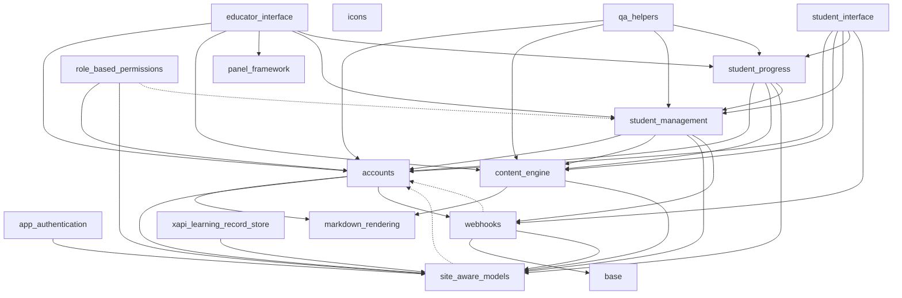

# App Structure

This file is the authoritative picture of inter-app dependencies in this project. It is **generated** by running `/app_map`.

Treat it as the source of truth for what cross-app imports are allowed. Any implementation plan that introduces a new edge must flag the change via `/plan_structure_review` and get approval before code is written.

- **Solid arrows** — runtime imports (one app imports from another outside of tests).
- **Dashed arrows** — test-only imports (cross-app fixtures or helpers).
- **No arrow** — no import relationship; treat these apps as independent.

Regenerate this file whenever the graph changes: `/app_map`.

## Dependency table

| App | Runtime deps | Test-only deps |
| --- | --- | --- |
| accounts | markdown_rendering, site_aware_models, webhooks | — |
| app_authentication | site_aware_models | — |
| base | — | — |
| content_engine | markdown_rendering, site_aware_models | — |
| educator_interface | accounts, content_engine, panel_framework, student_management, student_progress | — |
| icons | — | — |
| markdown_rendering | — | — |
| panel_framework | — | — |
| qa_helpers | accounts, content_engine, student_management, student_progress | — |
| role_based_permissions | accounts, site_aware_models | student_management |
| site_aware_models | — | accounts |
| student_interface | accounts, content_engine, student_management, student_progress, webhooks | — |
| student_management | accounts, content_engine, site_aware_models, webhooks | — |
| student_progress | accounts, content_engine, site_aware_models, student_management | — |
| webhooks | base, site_aware_models | accounts |
| xapi_learning_record_store | site_aware_models | — |

## Legend

- `A --> B` — `A` imports from `B` at runtime.
- `A -.-> B` — `A` imports from `B` only in test code (tests, conftest, factories).
- Apps with no edges are self-contained.
