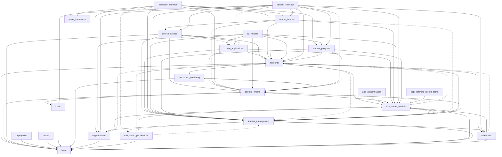

# App Structure

This file is the authoritative picture of inter-app dependencies in this project. It is **generated** by running `/app_map`.

Treat it as the source of truth for what cross-app imports are allowed. Any implementation plan that introduces a new cross-app edge should be called out and approved before code is written.

- **Solid arrows** — runtime imports (one app imports from another outside of tests).
- **Dashed arrows** — test-only imports (cross-app fixtures or helpers).
- **No arrow** — no import relationship; treat these apps as independent.

Regenerate this file whenever the graph changes: `/app_map`.

```mermaid
flowchart TB
    accounts
    app_authentication
    base
    content_engine
    course_access
    course_applications
    course_interest
    deployment
    educator_interface
    health
    icons
    markdown_rendering
    organisations
    panel_framework
    qa_helpers
    role_based_permissions
    site_aware_models
    student_interface
    student_management
    student_progress
    webhooks
    xapi_learning_record_store
    accounts --> base
    accounts --> markdown_rendering
    accounts --> site_aware_models
    accounts --> webhooks
    app_authentication --> site_aware_models
    content_engine --> base
    content_engine --> icons
    content_engine --> markdown_rendering
    content_engine --> site_aware_models
    course_access --> accounts
    course_access --> base
    course_access --> content_engine
    course_access --> student_management
    course_applications --> accounts
    course_applications --> content_engine
    course_applications --> course_access
    course_applications --> site_aware_models
    course_applications --> student_management
    course_interest --> accounts
    course_interest --> content_engine
    course_interest --> course_access
    course_interest --> site_aware_models
    deployment --> base
    educator_interface --> accounts
    educator_interface --> content_engine
    educator_interface --> course_interest
    educator_interface --> organisations
    educator_interface --> panel_framework
    educator_interface --> student_management
    educator_interface --> student_progress
    health --> base
    icons --> base
    markdown_rendering --> base
    organisations --> base
    organisations --> site_aware_models
    qa_helpers --> accounts
    qa_helpers --> content_engine
    qa_helpers --> course_applications
    qa_helpers --> organisations
    qa_helpers --> site_aware_models
    qa_helpers --> student_management
    qa_helpers --> student_progress
    role_based_permissions --> accounts
    role_based_permissions --> base
    role_based_permissions --> site_aware_models
    site_aware_models --> base
    student_interface --> accounts
    student_interface --> content_engine
    student_interface --> course_access
    student_interface --> course_interest
    student_interface --> icons
    student_interface --> organisations
    student_interface --> site_aware_models
    student_interface --> student_management
    student_interface --> student_progress
    student_interface --> webhooks
    student_management --> accounts
    student_management --> base
    student_management --> content_engine
    student_management --> organisations
    student_management --> site_aware_models
    student_management --> webhooks
    student_progress --> accounts
    student_progress --> content_engine
    student_progress --> site_aware_models
    student_progress --> student_management
    webhooks --> base
    webhooks --> site_aware_models
    xapi_learning_record_store --> site_aware_models
    accounts -.-> student_management
    course_access -.-> course_applications
    course_interest -.-> student_management
    educator_interface -.-> role_based_permissions
    markdown_rendering -.-> content_engine
    organisations -.-> accounts
    role_based_permissions -.-> student_management
    site_aware_models -.-> accounts
    site_aware_models -.-> content_engine
    site_aware_models -.-> student_management
    student_interface -.-> course_applications
    student_management -.-> role_based_permissions
    webhooks -.-> accounts
```

## Dependency table

| App | Runtime deps | Test-only deps |
| --- | --- | --- |
| accounts | base, markdown_rendering, site_aware_models, webhooks | student_management |
| app_authentication | site_aware_models | — |
| base | — | — |
| content_engine | base, icons, markdown_rendering, site_aware_models | — |
| course_access | accounts, base, content_engine, student_management | course_applications |
| course_applications | accounts, content_engine, course_access, site_aware_models, student_management | — |
| course_interest | accounts, content_engine, course_access, site_aware_models | student_management |
| deployment | base | — |
| educator_interface | accounts, content_engine, course_interest, organisations, panel_framework, student_management, student_progress | role_based_permissions |
| health | base | — |
| icons | base | — |
| markdown_rendering | base | content_engine |
| organisations | base, site_aware_models | accounts |
| panel_framework | — | — |
| qa_helpers | accounts, content_engine, course_applications, organisations, site_aware_models, student_management, student_progress | — |
| role_based_permissions | accounts, base, site_aware_models | student_management |
| site_aware_models | base | accounts, content_engine, student_management |
| student_interface | accounts, content_engine, course_access, course_interest, icons, organisations, site_aware_models, student_management, student_progress, webhooks | course_applications |
| student_management | accounts, base, content_engine, organisations, site_aware_models, webhooks | role_based_permissions |
| student_progress | accounts, content_engine, site_aware_models, student_management | — |
| webhooks | base, site_aware_models | accounts |
| xapi_learning_record_store | site_aware_models | — |

## Legend

- `A --> B` — `A` imports from `B` at runtime.
- `A -.-> B` — `A` imports from `B` only in test code (tests, conftest, factories).
- Apps with no edges are self-contained.
