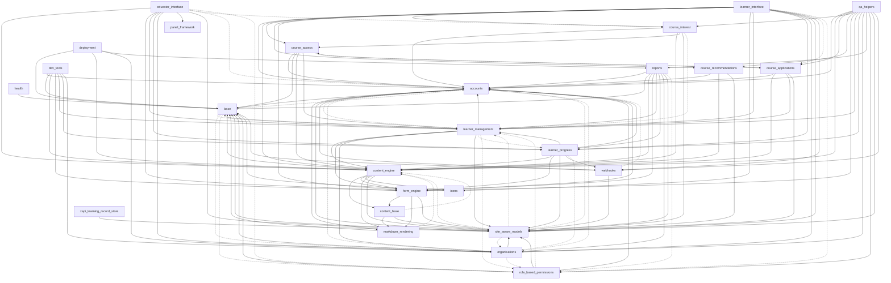

# App Structure

This file is the authoritative picture of inter-app dependencies in this project. It is **generated** by running `/app_map`.

Treat it as the source of truth for what cross-app imports are allowed. Any implementation plan that introduces a new cross-app edge should be called out and approved before code is written.

- **Solid arrows** — runtime imports (one app imports from another outside of tests).
- **Dashed arrows** — test-only imports (cross-app fixtures or helpers).
- **No arrow** — no import relationship; treat these apps as independent.

Regenerate this file whenever the graph changes: `/app_map`.

```mermaid
flowchart TB
    accounts
    base
    content_base
    content_engine
    course_access
    course_applications
    course_interest
    course_recommendations
    deployment
    dev_tools
    educator_interface
    form_engine
    health
    icons
    learner_interface
    learner_management
    learner_progress
    markdown_rendering
    organisations
    panel_framework
    qa_helpers
    reports
    role_based_permissions
    site_aware_models
    webhooks
    xapi_learning_record_store
    accounts --> base
    accounts --> markdown_rendering
    accounts --> site_aware_models
    accounts --> webhooks
    content_base --> markdown_rendering
    content_base --> site_aware_models
    content_engine --> base
    content_engine --> content_base
    content_engine --> form_engine
    content_engine --> icons
    content_engine --> markdown_rendering
    content_engine --> site_aware_models
    course_access --> accounts
    course_access --> base
    course_access --> content_engine
    course_access --> learner_management
    course_applications --> accounts
    course_applications --> content_engine
    course_applications --> course_access
    course_applications --> learner_management
    course_applications --> site_aware_models
    course_interest --> accounts
    course_interest --> content_engine
    course_interest --> course_access
    course_interest --> site_aware_models
    course_recommendations --> accounts
    course_recommendations --> content_engine
    course_recommendations --> site_aware_models
    deployment --> base
    deployment --> content_engine
    deployment --> organisations
    deployment --> reports
    dev_tools --> accounts
    dev_tools --> base
    dev_tools --> content_engine
    dev_tools --> form_engine
    dev_tools --> learner_management
    dev_tools --> learner_progress
    dev_tools --> organisations
    educator_interface --> content_engine
    educator_interface --> form_engine
    educator_interface --> learner_management
    educator_interface --> learner_progress
    educator_interface --> organisations
    educator_interface --> panel_framework
    educator_interface --> site_aware_models
    form_engine --> accounts
    form_engine --> content_base
    form_engine --> markdown_rendering
    form_engine --> site_aware_models
    health --> base
    icons --> base
    learner_interface --> accounts
    learner_interface --> content_engine
    learner_interface --> course_access
    learner_interface --> course_interest
    learner_interface --> course_recommendations
    learner_interface --> form_engine
    learner_interface --> icons
    learner_interface --> learner_management
    learner_interface --> learner_progress
    learner_interface --> organisations
    learner_interface --> site_aware_models
    learner_interface --> webhooks
    learner_management --> accounts
    learner_management --> base
    learner_management --> content_engine
    learner_management --> form_engine
    learner_management --> organisations
    learner_management --> site_aware_models
    learner_progress --> accounts
    learner_progress --> content_engine
    learner_progress --> form_engine
    learner_progress --> learner_management
    learner_progress --> site_aware_models
    learner_progress --> webhooks
    markdown_rendering --> base
    organisations --> base
    organisations --> site_aware_models
    qa_helpers --> accounts
    qa_helpers --> content_engine
    qa_helpers --> course_applications
    qa_helpers --> course_interest
    qa_helpers --> course_recommendations
    qa_helpers --> form_engine
    qa_helpers --> learner_management
    qa_helpers --> learner_progress
    qa_helpers --> organisations
    qa_helpers --> reports
    qa_helpers --> role_based_permissions
    qa_helpers --> site_aware_models
    qa_helpers --> webhooks
    reports --> accounts
    reports --> base
    reports --> content_engine
    reports --> form_engine
    reports --> learner_management
    reports --> learner_progress
    reports --> organisations
    reports --> site_aware_models
    role_based_permissions --> accounts
    role_based_permissions --> base
    role_based_permissions --> site_aware_models
    site_aware_models --> base
    webhooks --> base
    webhooks --> site_aware_models
    xapi_learning_record_store --> site_aware_models
    accounts -.-> learner_management
    accounts -.-> organisations
    base -.-> accounts
    base -.-> learner_management
    base -.-> organisations
    base -.-> role_based_permissions
    content_base -.-> content_engine
    course_access -.-> course_applications
    course_interest -.-> learner_management
    educator_interface -.-> accounts
    educator_interface -.-> course_interest
    educator_interface -.-> role_based_permissions
    learner_interface -.-> course_applications
    learner_interface -.-> role_based_permissions
    learner_management -.-> learner_progress
    learner_management -.-> role_based_permissions
    learner_progress -.-> organisations
    markdown_rendering -.-> content_engine
    organisations -.-> accounts
    organisations -.-> role_based_permissions
    reports -.-> role_based_permissions
    role_based_permissions -.-> learner_management
    site_aware_models -.-> accounts
    site_aware_models -.-> content_engine
    site_aware_models -.-> learner_management
    site_aware_models -.-> organisations
    webhooks -.-> accounts
```

## Dependency table

| App | Runtime deps | Test-only deps |
| --- | --- | --- |
| accounts | base, markdown_rendering, site_aware_models, webhooks | learner_management, organisations |
| base | — | accounts, learner_management, organisations, role_based_permissions |
| content_base | markdown_rendering, site_aware_models | content_engine |
| content_engine | base, content_base, form_engine, icons, markdown_rendering, site_aware_models | — |
| course_access | accounts, base, content_engine, learner_management | course_applications |
| course_applications | accounts, content_engine, course_access, learner_management, site_aware_models | — |
| course_interest | accounts, content_engine, course_access, site_aware_models | learner_management |
| course_recommendations | accounts, content_engine, site_aware_models | — |
| deployment | base, content_engine, organisations, reports | — |
| dev_tools | accounts, base, content_engine, form_engine, learner_management, learner_progress, organisations | — |
| educator_interface | content_engine, form_engine, learner_management, learner_progress, organisations, panel_framework, site_aware_models | accounts, course_interest, role_based_permissions |
| form_engine | accounts, content_base, markdown_rendering, site_aware_models | — |
| health | base | — |
| icons | base | — |
| learner_interface | accounts, content_engine, course_access, course_interest, course_recommendations, form_engine, icons, learner_management, learner_progress, organisations, site_aware_models, webhooks | course_applications, role_based_permissions |
| learner_management | accounts, base, content_engine, form_engine, organisations, site_aware_models | learner_progress, role_based_permissions |
| learner_progress | accounts, content_engine, form_engine, learner_management, site_aware_models, webhooks | organisations |
| markdown_rendering | base | content_engine |
| organisations | base, site_aware_models | accounts, role_based_permissions |
| panel_framework | — | — |
| qa_helpers | accounts, content_engine, course_applications, course_interest, course_recommendations, form_engine, learner_management, learner_progress, organisations, reports, role_based_permissions, site_aware_models, webhooks | — |
| reports | accounts, base, content_engine, form_engine, learner_management, learner_progress, organisations, site_aware_models | role_based_permissions |
| role_based_permissions | accounts, base, site_aware_models | learner_management |
| site_aware_models | base | accounts, content_engine, learner_management, organisations |
| webhooks | base, site_aware_models | accounts |
| xapi_learning_record_store | site_aware_models | — |

## Legend

- `A --> B` — `A` imports from `B` at runtime.
- `A -.-> B` — `A` imports from `B` only in test code (tests, conftest, factories).
- Apps with no edges are self-contained.
