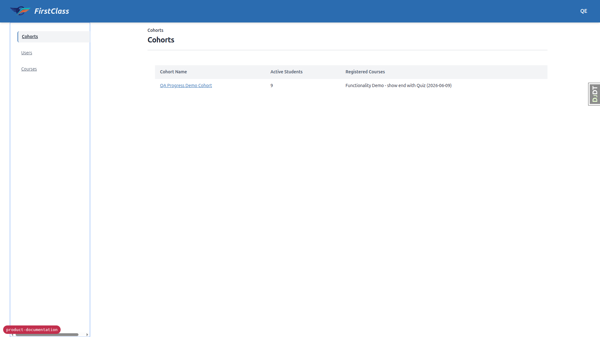
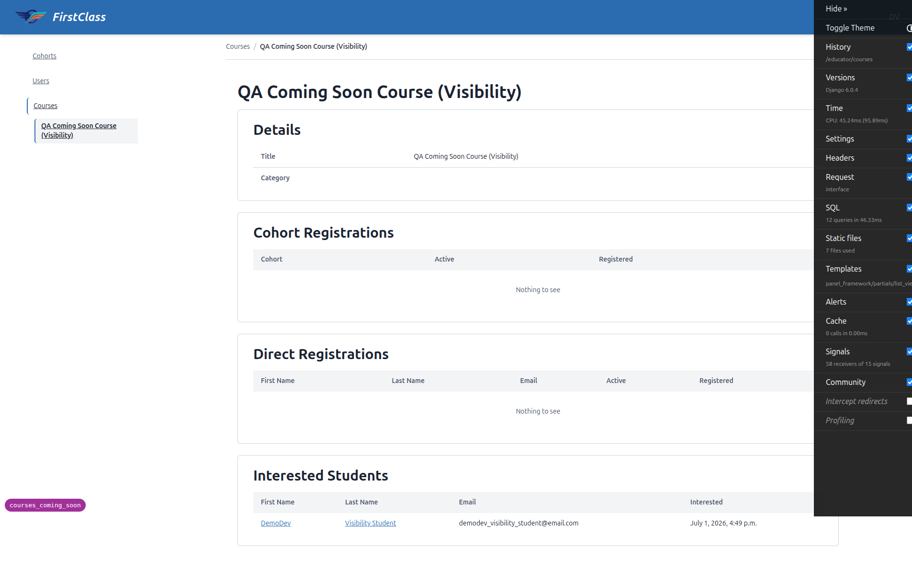
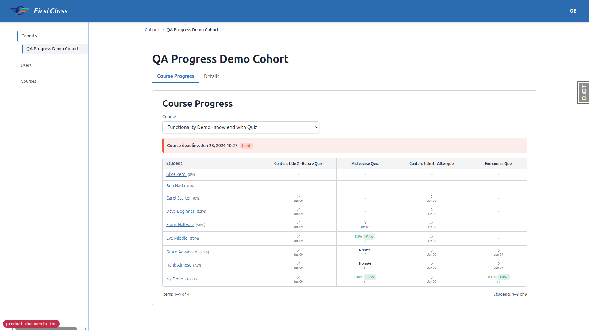

# Educator Interface

_Last updated: 2026-07-01_

## Summary

- Educators access a single-page HTMX panel interface with three sections: Cohorts, Users, and Courses.
- Object-level access control via django-guardian ensures educators see only the cohorts they have been explicitly granted permission on; no cross-cohort data leakage is possible through the interface.
- The cohort detail view includes a course-progress matrix showing completion status, quiz scores, pass/fail, and deadlines for every student × course-item combination.
- Courses carry a visibility state (published / coming soon / hidden); the Courses list shows each course's visibility and, for coming-soon courses, an interest count with drill-down to the interested students. Visibility itself is read-only in the interface — see [content editing workflow](./content-editing-workflow.md) for how it's set.
- **Limits:** cohort membership management, course registration, and deadline-setting are admin-only operations — they cannot be performed from the educator interface. There is no messaging capability.

## Panel Interface

The educator interface is served at `educator_interface:interface` as a single-page application. All navigation within the interface is HTMX-driven: clicking a section or item updates the main panel and the sidebar without a full page reload. The underlying panel framework also handles out-of-band (OOB) updates to the sidebar and breadcrumb.

The interface has three top-level sections:

### Cohorts

- **List view** — shows each permissioned cohort with its student count and the courses the cohort is registered for.
- **Detail view** — shows the cohort name (editable inline), the list of student members, and the list of registered courses. Create and delete cohort actions are available.
- **Course Progress tab** — the course-progress matrix (see below).

### Users

Lists users who are members of at least one cohort the educator has permission on. Each user entry shows name, email address, and their cohort memberships. Educators cannot see users outside their permissioned cohorts.

### Courses

Lists all courses with the count of active students and cohorts. Each course also shows its **visibility** — published, coming soon, or hidden — so educators and admins can see every course regardless of state; visibility filtering only ever applies to learners, never to the educator or admin querysets. For courses that are coming soon, the list also shows an **interest count**: the number of learners who have expressed interest via the coming-soon waitlist, giving educators a demand signal for what to launch next.

The course detail view shows the course title and category, the cohorts registered for the course, any direct (non-cohort) student registrations, and — for coming-soon courses — a drill-down panel listing the interested students by name and the date they expressed interest, making the waitlist actionable. Interest counts and the drill-down are scoped to the current site, consistent with the rest of the interface.

Visibility itself is **read-only** here and in the Django admin — it cannot be changed from either interface. Visibility is set solely in the course content front-matter and takes effect when the course is (re-)imported; see [content editing workflow](./content-editing-workflow.md) for how educators/authors flip a course between published, coming soon, and hidden. The learner-facing experience of coming-soon and hidden courses (badging, the "I'm interested" affordance, hidden-course 404 behaviour) is covered in [learner experience](./learner-experience.md).

## Course-Progress Matrix

The Course Progress tab on a cohort detail page presents a paginated matrix of students (rows) × course items (columns). Each cell shows:

- Completion status (complete / in progress / not started).
- Quiz score and pass/fail outcome for form-type items.
- Deadline for the item, with an overdue indicator if the deadline has passed and the item is not complete.

Both cohort-level deadlines and per-student deadline overrides are visible in the matrix.

## Access Control

The educator interface uses **django-guardian** object-level permissions. An educator sees a cohort only if they have the `view_cohort` permission granted on that specific `Cohort` object. This is checked via `get_objects_for_user` in every cohort list and detail view.

Granting and revoking cohort permissions is performed in the Django admin by an administrator. The educator interface itself has no permission-management UI.

Site-level isolation applies: the educator interface queries are scoped to the current site. See [multi-tenancy and isolation](./multi-tenancy-and-isolation.md) for the full isolation model.

## Limits

The following operations are **admin-only** and cannot be performed from the educator interface:

- **Adding or removing students from a cohort** — cohort membership is managed in the Django admin.
- **Registering a cohort for a course** — course registration (cohort or individual) is managed in the Django admin.
- **Setting or modifying deadlines** — cohort deadlines, per-student deadlines, and deadline overrides are all set in the Django admin.

**There is no messaging capability.** Educators cannot send messages or emails to students from the educator interface.
