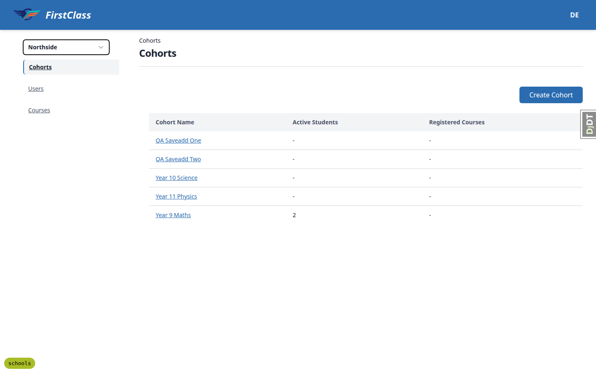
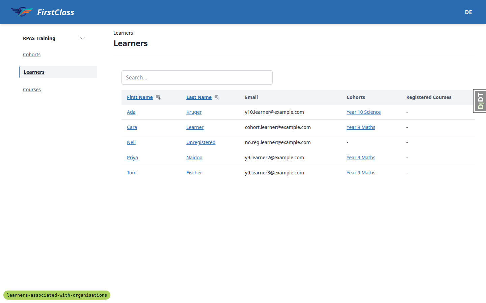
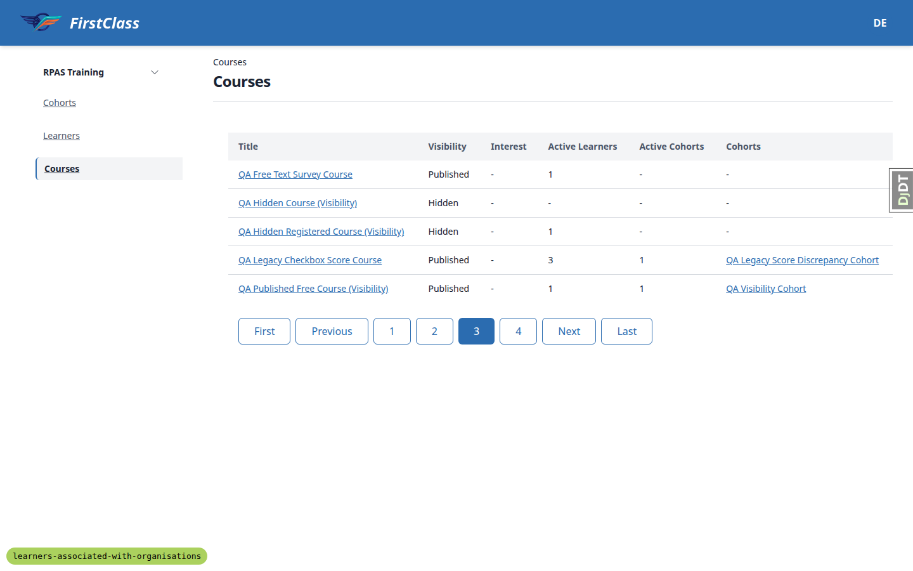
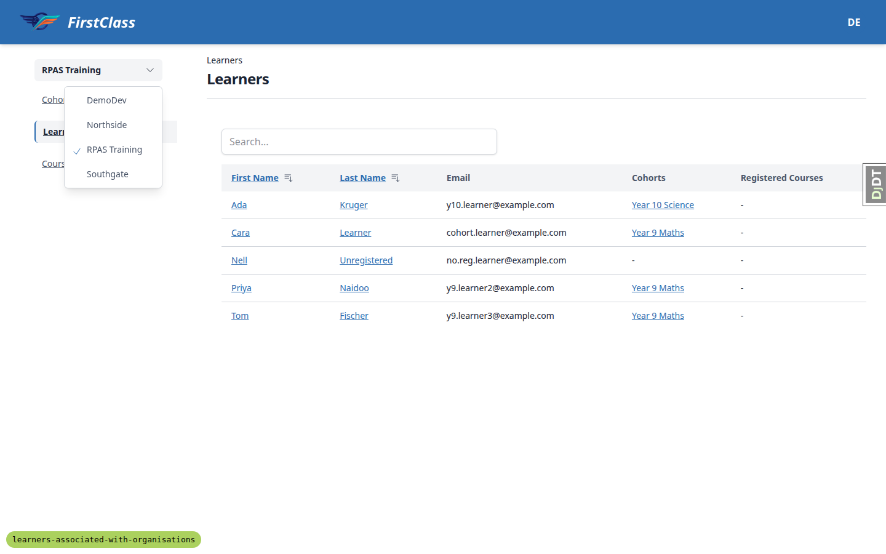

# Educator Interface

_Last updated: 2026-08-27_

## Summary

- Educators use a single-page HTMX panel with three sections: Cohorts, Learners, and Courses.
- The interface is scoped to one organisation at a time, chosen with a switcher and carried in the URL. See [Organisation Scope](#organisation-scope).
- The cohort detail view includes a course-progress matrix showing completion, quiz scores, pass/fail, and deadlines for every learner and course item.
- The Courses list shows each course's visibility and an interest count. Visibility is read-only here.
- **Access control has a narrowed known gap** — the Cohorts and Learners sections are permission-checked on both listings and detail pages, but the Courses section is not filtered at all. Reads only; writes are gated. See [Access Control](#access-control).
- **Limits:** cohort membership, course registration, deadline management, and generating a cohort progress report are admin-only. There is no messaging capability.

## Panel Interface

The educator interface is a single-page application, scoped to one organisation at a time — see [Organisation Scope](#organisation-scope). Navigation within it is HTMX-driven: selecting a section or item updates the main panel, sidebar, and breadcrumb without a full page reload.

### Cohorts

- **List view** — each cohort in the current organisation the educator has access to, with its learner count and registered courses.
- **Detail view** — cohort name (editable inline), learner members, and registered courses. Cohorts can be created and deleted, though deletion is refused — with a plain message naming what still depends on it — once the cohort has course progress recorded against it. Only a cohort the educator has access to can be opened — see [Access Control](#access-control).
- **Course Progress tab** — the [progress matrix](#course-progress-matrix).

### Learners

Lists the learners of the current organisation the educator has access to — members of cohorts they can see, plus, for an educator holding an organisation-wide role, everyone associated with the organisation, whether or not they have enrolled in anything yet. Someone studying with more than one organisation appears once per organisation, showing only the cohort memberships and course registrations belonging to the one currently in view. Learners marked removed do not appear, and there is no filter to show them. Detail pages carry the same access check as the listing; see [Access Control](#access-control).

### Courses

Lists all courses with their active learner and cohort counts. Each course shows its **visibility** — published, coming soon, or hidden — so educators and admins see every course regardless of state; visibility filtering only ever applies to learners, never to educator or admin views.

Unlike Cohorts and Learners, this section is not scoped to the current organisation, and it carries **no permission filter at all** — every course on the site, hidden ones included, is visible to any authenticated user. See [Access Control](#access-control).

Each course also shows an **interest count**: the number of learners who have expressed interest through the coming-soon waitlist. The count is shown for every course, not only coming-soon ones, so a course that has since launched still shows the demand it attracted. Who expressed that interest, and when, is read in the Django admin rather than here — see [admin interface](./admin-interface.md).

The course detail view shows the title and category, the cohorts registered for the course, and any direct non-cohort registrations. All of it is scoped to the current site.

Visibility is **read-only** here and in the Django admin. It is set solely in the course's content frontmatter and takes effect on import — see [content editing workflow](./content-editing-workflow.md). The learner-facing experience of coming-soon and hidden courses is covered in [learner experience](./learner-experience.md).

## Organisation Scope

The educator interface is scoped to one **organisation** at a time — a grouping layer within a site, sitting above cohorts and course registrations. See [multi-tenancy and isolation](./multi-tenancy-and-isolation.md#organisations) for what an organisation is and where the isolation boundary actually sits, and [admin interface](./admin-interface.md#organisation-management) for how organisations are created and staffed.

The current organisation is part of every page's URL rather than being remembered in the session, so two browser tabs can sit on two different organisations at once, the back button behaves correctly, and any page can be linked to directly.

A switcher at the top of the left sidebar always names the current organisation. Where an educator can reach more than one, the name opens a list to switch between them; where they can reach only one, the name is still shown, as static text.

Switching on a list page reloads it for the newly selected organisation. Switching while viewing a cohort or learner that does not belong to the newly selected organisation returns to the equivalent list with an inline notice rather than an error page.

The Courses section is the exception: it is not organisation-scoped, and the switcher does not change what it shows. See [Courses](#courses).

## Course-Progress Matrix

The Course Progress tab on a cohort detail page shows a paginated matrix of learners (rows) against course items (columns). Each cell shows completion status (complete / in progress / not started), the quiz score and pass/fail outcome for form items, and the item's deadline with an overdue indicator where the deadline has passed and the item is not complete. Both cohort-level deadlines and per-learner overrides are visible.

The matrix shows the selected cohort registration's progress and only that — the percentage column and the item cells always read the same registration, so the two halves cannot disagree. A cohort member who also holds their own registration for the same course did that work under the other registration and reads as 0% here; the panel carries an on-screen note saying so, and there is no way to reach the other registration's progress from this view. See [learner tracking](./learner-tracking.md) for how progress is scoped.

This view is on-screen only, and shows one course at a time. For a printable, filable record covering every course the cohort is registered for, a [cohort progress report](./reports.md) can be produced from the Django admin by anyone with cohort access under either route in [access control](#access-control).

## Access Control

An administrator grants an educator access one of two ways: permission on a specific cohort, or a staff role on a whole organisation, which covers every cohort in it including ones created later. Both are granted in the Django admin — see [admin interface](./admin-interface.md#organisation-management). The educator interface itself has no permission-management UI.

**What is enforced.** The Cohorts and Learners listings are scoped to the selected organisation and filtered to what the educator has been granted under either route. Cohort and learner *detail* pages carry the same check: an educator who navigates directly to one outside their access gets a "not found" response — the same response a record that does not exist would give, so identifiers cannot be probed by guessing URLs. Every *write* — creating, renaming, or deleting a cohort — checks the permission before it runs.

**Known gap — the Courses section is not permission-checked.** The Courses list and course detail pages ignore both organisation scope and access grants: every authenticated user on the site sees every course, including courses authored as hidden, which learners cannot otherwise discover.

**Scope of the gap.** This is a read and disclosure defect now confined to Courses. Cohort and user data are gated, as is every write action. It is a genuine authorisation gap, not a design decision, and it is tracked in the [roadmap](./roadmap.md).

**Site isolation is unaffected.** All educator interface queries remain scoped to the current site, so nothing here crosses a tenant boundary. See [multi-tenancy and isolation](./multi-tenancy-and-isolation.md).

## Limits

These operations are **admin-only** and cannot be performed from the educator interface:

- **Cohort membership** — adding or removing learners.
- **Learner roster** — associating a person with an organisation, or marking one removed, is done in the [Django admin](./admin-interface.md#learner-rosters).
- **Course registration** — registering a cohort or an individual learner for a course.
- **Deadlines** — cohort deadlines, per-learner deadlines, and overrides.
- **Cohort progress reports** — generating a cohort's [progress report](./reports.md) is done from the Django admin. An educator with access to the cohort can have one produced, but not from this interface.

**There is no messaging capability.** Educators cannot send messages or emails to learners from FLS.
