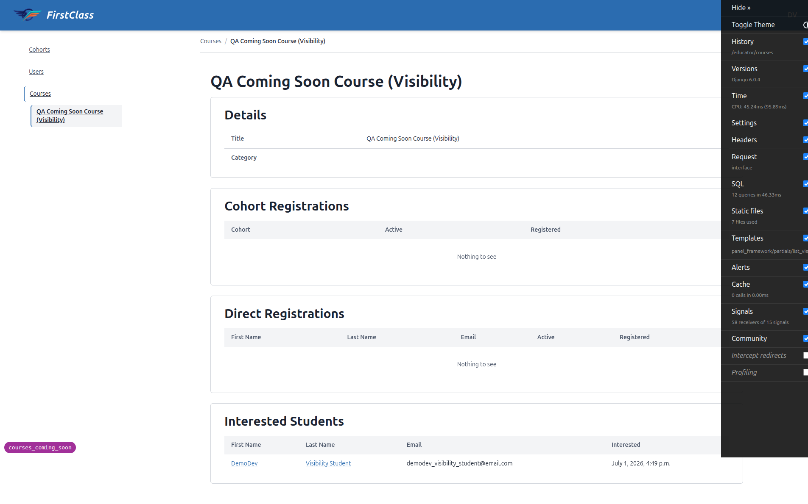

# Educator Interface

_Last updated: 2026-08-11_

## Summary

- Educators use a single-page HTMX panel with three sections: Cohorts, Users, and Courses.
- The interface is scoped to one organisation at a time, chosen with a switcher and carried in the URL. See [Organisation Scope](#organisation-scope).
- The cohort detail view includes a course-progress matrix showing completion, quiz scores, pass/fail, and deadlines for every student and course item.
- The Courses list shows each course's visibility and an interest count, with drill-down to the interested students. Visibility is read-only here.
- **Access control has a narrowed known gap** — the Cohorts and Users sections are permission-checked on both listings and detail pages, but the Courses section is not filtered at all. Reads only; writes are gated. See [Access Control](#access-control).
- **Limits:** cohort membership, course registration, and deadline management are admin-only. There is no messaging capability.

## Panel Interface

The educator interface is a single-page application, scoped to one organisation at a time — see [Organisation Scope](#organisation-scope). Navigation within it is HTMX-driven: selecting a section or item updates the main panel, sidebar, and breadcrumb without a full page reload.

### Cohorts

- **List view** — each cohort in the current organisation the educator has access to, with its student count and registered courses.
- **Detail view** — cohort name (editable inline), student members, and registered courses. Cohorts can be created and deleted. Only a cohort the educator has access to can be opened — see [Access Control](#access-control).
- **Course Progress tab** — the [progress matrix](#course-progress-matrix).

### Users

Lists users in the current organisation the educator has access to — members of cohorts they can see, plus, for an educator holding an organisation-wide role, individually registered learners who belong to no cohort — showing name, email, and cohort memberships. Detail pages carry the same access check as the listing; see [Access Control](#access-control).

### Courses

Lists all courses with their active student and cohort counts. Each course shows its **visibility** — published, coming soon, or hidden — so educators and admins see every course regardless of state; visibility filtering only ever applies to learners, never to educator or admin views.

Unlike Cohorts and Users, this section is not scoped to the current organisation, and it carries **no permission filter at all** — every course on the site, hidden ones included, is visible to any authenticated user. See [Access Control](#access-control).

Each course also shows an **interest count**: the number of learners who have expressed interest through the coming-soon waitlist. The count and its drill-down are shown for every course, not only coming-soon ones, so a course that has since launched still shows the demand it attracted.

The course detail view shows the title and category, the cohorts registered for the course, any direct non-cohort registrations, and a drill-down panel listing interested students by name with the date they expressed interest — making the waitlist actionable. All of it is scoped to the current site.

Visibility is **read-only** here and in the Django admin. It is set solely in the course's content frontmatter and takes effect on import — see [content editing workflow](./content-editing-workflow.md). The learner-facing experience of coming-soon and hidden courses is covered in [learner experience](./learner-experience.md).

## Organisation Scope

The educator interface is scoped to one **organisation** at a time — a grouping layer within a site, sitting above cohorts and course registrations. See [multi-tenancy and isolation](./multi-tenancy-and-isolation.md#organisations) for what an organisation is and where the isolation boundary actually sits, and [admin interface](./admin-interface.md#organisation-management) for how organisations are created and staffed.

The current organisation is part of every page's URL rather than being remembered in the session, so two browser tabs can sit on two different organisations at once, the back button behaves correctly, and any page can be linked to directly.

A switcher at the top of the left sidebar always names the current organisation. Where an educator can reach more than one, the name opens a list to switch between them; where they can reach only one, the name is still shown, as static text.

Switching on a list page reloads it for the newly selected organisation. Switching while viewing a cohort or user that does not belong to the newly selected organisation returns to the equivalent list with an inline notice rather than an error page.

The Courses section is the exception: it is not organisation-scoped, and the switcher does not change what it shows. See [Courses](#courses).

## Course-Progress Matrix

The Course Progress tab on a cohort detail page shows a paginated matrix of students (rows) against course items (columns). Each cell shows completion status (complete / in progress / not started), the quiz score and pass/fail outcome for form items, and the item's deadline with an overdue indicator where the deadline has passed and the item is not complete. Both cohort-level deadlines and per-student overrides are visible.

## Access Control

An administrator grants an educator access one of two ways: permission on a specific cohort, or a staff role on a whole organisation, which covers every cohort in it including ones created later. Both are granted in the Django admin — see [admin interface](./admin-interface.md#organisation-management). The educator interface itself has no permission-management UI.

**What is enforced.** The Cohorts and Users listings are scoped to the selected organisation and filtered to what the educator has been granted under either route. Cohort and user *detail* pages carry the same check: an educator who navigates directly to one outside their access gets a "not found" response — the same response a record that does not exist would give, so identifiers cannot be probed by guessing URLs. Every *write* — creating, renaming, or deleting a cohort — checks the permission before it runs.

**Known gap — the Courses section is not permission-checked.** The Courses list and course detail pages ignore both organisation scope and access grants: every authenticated user on the site sees every course, including courses authored as hidden, which learners cannot otherwise discover.

**Scope of the gap.** This is a read and disclosure defect now confined to Courses. Cohort and user data are gated, as is every write action. It is a genuine authorisation gap, not a design decision, and it is tracked in the [roadmap](./roadmap.md).

**Site isolation is unaffected.** All educator interface queries remain scoped to the current site, so nothing here crosses a tenant boundary. See [multi-tenancy and isolation](./multi-tenancy-and-isolation.md).

## Limits

These operations are **admin-only** and cannot be performed from the educator interface:

- **Cohort membership** — adding or removing students.
- **Course registration** — registering a cohort or an individual student for a course.
- **Deadlines** — cohort deadlines, per-student deadlines, and overrides.

**There is no messaging capability.** Educators cannot send messages or emails to students from FLS.
