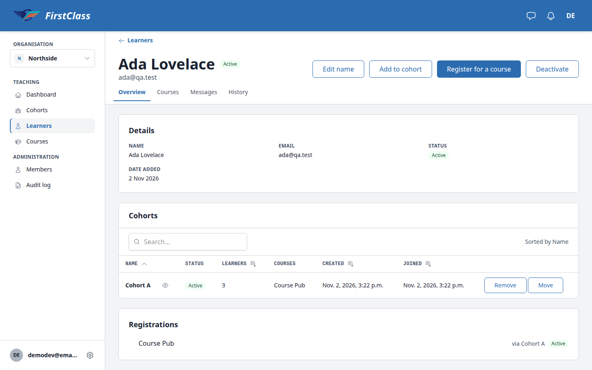
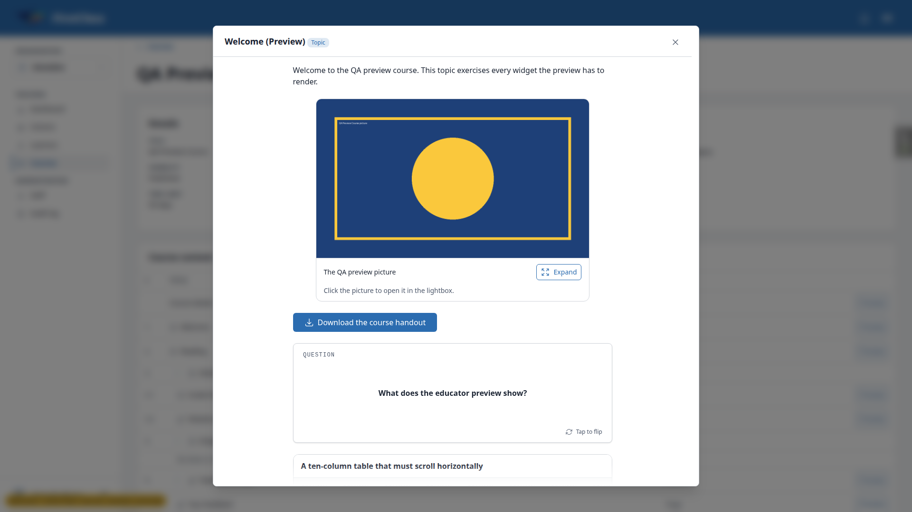

# Educator Interface

_Last updated: 2026-11-13_

## Summary

- Educators work in one panel scoped to one organisation at a time, with Dashboard, Cohorts, Learners and Courses under Teaching, and Staff and Audit log under Administration. Staff is also open to the two staff viewer roles; Audit log is for admins. See [Organisation scope](#organisation-scope).
- The dashboard shows totals, the learners who need attention and each cohort's progress. See [Dashboard](#dashboard).
- Educators add learners by email or CSV file, see whether each is active, pending or inactive, manage their cohorts and course registrations, and deactivate or reactivate them. A quick view previews a learner or cohort without leaving the list. See [Learners](#learners).
- Educators can act on many learners or cohorts at once, including everything matching the current filter. See [Bulk actions](#bulk-actions).
- Educators create, rename, deactivate and delete cohorts, and register a cohort for courses. See [Cohorts](#cohorts).
- The Courses list shows each course's visibility and interest count. A course's page shows its details and an outline of its content, and any topic or form can be previewed as a learner would see it, without recording progress. Visibility is read-only here. See [Courses](#courses).
- Organisation admins add staff, assign and deactivate their roles, and deactivate or reactivate them. Cohort admins manage staff on their own cohorts, and two viewer roles can read the staff list. See [Staff and roles](#staff-and-roles).
- Site and organisation admins see who changed what and when, on learner and cohort pages and in an Audit log, and a cohort admin sees it on the cohorts they administer. See [History](#history).
- A cohort's progress report shows on screen, with a PDF to download. See [Reports](#reports).
- Access is granted by role: site admin, organisation admin, organisation staff viewer, organisation staff and roles viewer, cohort admin or cohort viewer. See [Access control](#access-control).
- **Limits:** educators cannot see or set deadlines, or pause or extend a learner's course, and moving or deleting in bulk and updating existing learners from a file are not built. See [Limits](#limits).

## Dashboard

The dashboard is the first page an educator sees. It covers every active cohort they can see in the current organisation: tiles for learners, cohorts, average progress and learners needing attention, a list of flagged learners across those cohorts, and one progress row per cohort. A cohort larger than the report's learner limit is left out, and the dashboard says so. There are no charts.

A learner with nothing to do yet, because their cohort is not registered for a course, is never flagged as needing attention, and nor is a learner who has finished everything. Overdue learners are not flagged either; see [Limits](#limits). The figures are recalculated every few minutes rather than live, and the page says when they are from. See [Reports](#reports).

## Learners

### The list

The Learners list shows the learners of the current organisation the educator has access to: learners in cohorts they can see, plus, for an educator holding an organisation-wide role, everyone associated with the organisation, whether or not they are registered for anything yet. Someone studying with more than one organisation appears once per organisation, with only that organisation's cohorts and registrations.

Each learner is **Active**, **Pending** (staff created their account and they have not yet set a password and signed in) or **Inactive**. The list shows Active and Pending until the Status filter asks for others, and clearing the filter returns to that view. A learner with no name is shown by email. The list can be searched, filtered and sorted, and **Export CSV** downloads what the list shows (name, email, status, cohorts, courses and last active date), narrowed by the current search and filters. A cohort's Learners tab exports the same way.

### The learner page

The header shows the name and email, and a badge only while the learner is Pending or Inactive. The tabs are:

- **Overview**: details, cohorts and course registrations. The Cohorts panel is where the learner's cohorts are changed.
- **Courses**: for each registered course, completion, a progress status and any at-risk flags, the items completed and the last one, and every quiz attempt with its score and the quiz's pass mark. This tab is where the learner is registered for a course.
- **Messages**: when direct messaging is turned on. See [Messaging from a learner](#messaging-from-a-learner).
- **Settings**: the actions with no home elsewhere: the name, the setup email, and deactivating or reactivating. Shown to anyone who may take at least one of them.
- **History**: see [History](#history).

Each control sits beside what it changes:

- **Add to a cohort, remove, or move** a learner to another active cohort in the organisation, from the Overview tab's Cohorts panel: Add to cohort under the list, Remove and Move on each row. Each confirmation names the courses the learner loses access to. A move carries course progress across, keeping whichever record is further along for a course both cohorts give access to. Nothing is deleted.
- **Register for a course** from the Courses tab, and deactivate or reactivate a registration from its row on the Overview tab's Course registrations list. Any course that is not coming soon can be registered, but not one that is closed to the learner's organisation, which is refused with a message. Deactivating a registration keeps progress and says whether a cohort still gives access to the course.
- **Deactivate or reactivate** the learner, from the Settings tab. Deactivating removes access to this organisation's courses while keeping cohorts, registrations and progress, which return on reactivation. On the site's default organisation, a learner can undo a deactivation, of themselves or of a registration, by registering for an open course themselves.
- **Edit the name**, from the Settings tab. Only a site admin can. Email is the learner's login for every organisation, so it is changed in the Django admin; see [admin interface](./admin-interface.md#learner-rosters).

Cohort admins manage membership and course registrations within their own cohorts. Adding, deactivating and reactivating learners, and resending the account setup email, need an organisation admin or site admin. Learners are deactivated here, never deleted. Each action sends a [webhook](./webhooks.md) event.

### Quick view

Selecting a learner's or cohort's preview control opens a summary beside the list, with a link through to the full page. On a wide screen it sits beside the list; on a phone it opens as a sheet. For a learner it shows email, status, cohorts, course registrations with progress, and when they were last active. For a cohort it shows status, learner count and courses. It shows only what the educator could already see on the full page. Courses have no quick view.

### Messaging from a learner

When direct messaging is turned on, the learner's quick view shows the latest messages with that learner and a composer to reply, and the learner's Messages tab shows the signed-in educator's own conversation with them. Who an educator may message follows the messaging policy; see [messaging](./messaging.md).

Organisation admins and site admins also see, on the Messages tab, a read-only list of the learner's other conversations with their educators, and can open one to read it. Each open is recorded in the learner's History. No other role has this.

### Adding learners

Organisation admins and site admins add a learner by email, with an optional name and cohort, one at a time: **Add** reports what happened and offers **Add another**, and **Add and add another** goes straight to the next, keeping the cohort. An address that already has an account on the site joins the organisation and keeps its name; a new one gets an account and an **account setup email** with a link to choose a password, which can be resent from the learner's page. A list of people is [imported from a file](#importing-learners). Staff-created people still meet the site's terms and registration forms at first login.

### Importing learners

Organisation admins and site admins import larger lists from a CSV file, from the Learners list or into one cohort from its Learners tab, in three steps: upload, preview, result. A downloadable template shows the columns: `email` (required), `first_name`, `last_name` and `cohort`. On a cohort's page everyone goes into that cohort; otherwise `cohort` is matched by name to an existing active cohort. Cohorts are never created from a file, and people are treated as in the Add learner dialog.

The preview labels every row (new account, joined, reactivated, added to cohort, already a member, or error) with counts, before anything is written. Rows with errors are listed with their line and reason on the preview and the result page, can be downloaded as a CSV, and do not stop the valid rows. A file is rejected whole if it is over 1 MB or has more rows than `LEARNER_IMPORT_MAX_ROWS` (default 2000). Imports over `BULK_BACKGROUND_THRESHOLD` rows (default 250) continue in the background with a result page that shows progress; no notification is sent when an import finishes. Background runs need the worker process described in [deployment](./deployment.md#background-tasks). Cohort admins cannot import, and an import cannot update an existing person's details.

### Bulk actions

Tick rows in the Learners or Cohorts list and a selection bar takes the place of the search and filters above the table, at every screen size, and stays in view while the list scrolls. It shows how many rows are selected and up to four actions, with the rest under **More**, where a destructive action such as removing learners from a cohort is always listed last. **Select all N** extends the selection to every row the filter matches, across pages, and **Clear** empties it. Changing page, sort or filters clears the selection.

- **Learners**: add to a cohort, remove from a cohort, register for a course, deactivate a course registration, deactivate, reactivate, and resend the account setup email.
- **Cohorts**: register for a course, deactivate a course registration, deactivate and reactivate.

Each action offers only what the educator could do to a single learner or cohort, and each row is checked on its own. Rows the educator may not change are skipped rather than blocking the rest. Nothing runs before a confirmation that says what will change and how many rows will be skipped, and why. Afterwards a result gives the counts (how many changed, how many were skipped and why) and names only the rows that failed. Each row is handled as if done by hand, so [webhook](./webhooks.md) events and emails fire once per learner or cohort changed.

Runs over `BULK_BACKGROUND_THRESHOLD` rows (default 250) continue in the background: the educator can leave the list, and an in-app notification says when the run is done.

## Cohorts

The Cohorts list shows each cohort in the current organisation the educator has access to, with its status, learner count and registered courses. Inactive cohorts are hidden until **Show inactive** is switched on, and the list can be filtered by course. Creating, deactivating and deleting a cohort, and registering it for a course or deactivating that registration, happen in a dialog over the current page; renaming is a field on the cohort's Settings tab. The list takes [bulk actions](#bulk-actions).

- **Creating and renaming.** A name is all a cohort needs, and names are unique within an organisation. **Save and add another** keeps the dialog open to create several in a row. The name is changed in place on the Settings tab, with the error shown beside the field when the name is taken.
- **Cohort page.** Tabs are *Overview* (details, completion for each registered course and a needs-attention list), *Learners*, *Courses*, *Report* (see [Reports](#reports)), *Settings* (the name, the staff assigned to the cohort with their roles, deactivation and deletion) and *History* (see [History](#history)). The Learners tab adds learners, and removes or moves one from their row.
- **Registering for courses.** The Courses tab registers the cohort for any course that is not coming soon and not closed to the organisation, and deactivates a registration from its row. Deactivating is reversible and everyone keeps their progress. The confirmation says how many learners lose access and names those who keep it through another registration.
- **Deactivating.** An inactive cohort's registrations give no access to their courses and the cohort becomes read-only, so it takes no membership action. Learners keep their place and progress, and reactivating restores access. See [learner tracking](./learner-tracking.md#what-is-recorded).
- **Deleting.** Only while the cohort has no learners and no course registrations, inactive ones included; otherwise the Settings tab says what still depends on it. Deleting a cohort also deletes the cohort roles held on it.

Renaming, deactivating, reactivating and deleting need an organisation admin or site admin. A cohort admin can register their own cohort for courses and deactivate those registrations. An organisation admin or the cohort's admin can add staff to the cohort, change a person's role on it and remove them from it, from the Settings tab's Staff list. A cohort admin chooses only among staff they can already see. Adding a new person to the organisation's staff is for organisation admins; see [Staff and roles](#staff-and-roles).

## Courses

The Courses section is read-only and scoped to the current organisation. It lists every published course, plus any course registered to a cohort or learner the educator can see, so a hidden or coming-soon course appears only where this organisation uses it. A course that belongs to other organisations and is not public is not listed; see [multi-tenancy and isolation](./multi-tenancy-and-isolation.md#organisations). Cohorts are registered for courses from the cohort page.

Each course shows its **visibility** (published, coming soon or hidden), its active learner and cohort counts, and the cohorts registered for it. Counts and links include only what the educator can see, and inactive cohorts are not counted. A course's page shows the title and category, the course's details (subtitle, level, duration, time limit, learning outcomes and lesson count), the cohorts registered with each cohort's status, and any direct registrations.

The page also has a **Course content** outline of the course's parts, topics, forms and form pages. **Preview** beside a topic, form or form page, and beside the course details, shows it as a learner would see it, in a wide dialog. A preview is read-only: forms show the answer key, nothing can be submitted, and opening one records no learner progress. There is no previous or next inside a preview, and parts cannot be previewed. The outline and previews are shown even while the course's outline is still marked in development for learners, with a notice saying learners cannot see it yet. Anyone who can open the course page can preview its content. The quick view on the Learners and Cohorts lists is a side summary of a person or group; a course's Preview shows its content.

Each course also shows an **interest count**: the learners who have expressed interest through the coming-soon waitlist, counted site-wide rather than per organisation and shown for every course, so a launched course still shows the demand it attracted. Who expressed interest, and when, is read in the Django admin; see [admin interface](./admin-interface.md).

Visibility is set only in the course's content frontmatter and takes effect on import; see [content editing workflow](./content-editing-workflow.md). Learners' experience of coming-soon and hidden courses is in [learner experience](./learner-experience.md).

## Staff and roles

Staff are the people who help run an organisation, whether or not they teach. A staff member holds one or more roles in the organisation, or none yet:

- **Organisation admin**: manages learners, cohorts and staff in this organisation.
- **Organisation staff and roles viewer**: sees who is on the organisation's staff and the roles they hold, and changes nothing.
- **Organisation staff viewer**: sees who is on the organisation's staff, without their roles, and changes nothing.
- **Cohort admin**: manages the learners and course registrations in their cohorts, and the staff on them.
- **Cohort viewer**: sees the learners and progress in their cohorts, and changes nothing.

The two staff viewer roles open the Staff section and no other section. A further role, **site admin**, gives full access to every organisation on the site. It is not given from this interface (see [Limits](#limits)), and a site admin is listed as staff of an organisation only through a role they hold in it. A learner is a staff member only if they also hold one of these roles.

The Staff section is open to organisation admins, site admins and the two staff viewer roles. It lists each staff member with their roles, the cohorts a cohort role covers, and who added each role and when, and can be searched and filtered by role. An organisation staff viewer sees names only. From it an organisation admin can:

- **Add a staff member** by typing a name or a full email. Matches appear as you type, drawn from the organisation's staff and active learners; a full email also reaches an account that is not yet in the organisation. An existing account shows that person's name and email before anything is saved; a new address gets an account and an [account setup email](#adding-learners). The admin picks one role and, for a cohort role, the cohorts it covers, which does not extend to cohorts added later, or picks no role yet.
- **Add a role** to a staff member later.
- **Change the cohorts** on a cohort role.
- **Deactivate a role.** The person keeps their account, their other roles and any place as a learner.
- **Deactivate a staff member**, which stops everything they can do in this organisation while keeping their roles, and **reactivate** them.

Admins can give only roles at or below their own. A change that gives someone access they did not have, or takes access away, is confirmed first and says what changes. Roles add up: to change someone's role, assign the new one and deactivate the old. The person is not notified when a role is assigned or deactivated, a setup email cannot be resent from this section, and staff members have no page of their own. Adding a staff member, role changes and staff deactivations are recorded in the [Audit log](#audit-log).

## History

### History tabs

The educator interface records who changed what, and when, for the actions educators take here: learner changes, cohort membership and course registrations, cohort changes, and staff roles and deactivations. Pausing a learner's course, resuming it and extending its deadlines are done in the Django admin, but are recorded too, on the learner's History tab and in the Audit log. The record shows as a **History** tab on a learner's page and on a cohort's page. A move between cohorts appears on the learner and on both cohorts. Each entry is one line showing when, who and what, with any description, reason and, for a bulk change, the entries it made opening beneath it; the cohort tab also names the person each row is about. A History tab sorts on its columns and filters by who, what and when, as the Audit log does. Deleting a cohort also records each role that went with it, and the learner's History tab shows each time an admin opened one of the learner's conversations. Changes with no user behind them show as "System".

### Reasons

Confirming a removal or deactivation (removing a learner from a cohort, deactivating a course registration, deactivating a learner or cohort, deleting a cohort, deactivating a role, deactivating a staff member) offers an optional **Reason**, shown in the history to staff only. Every confirmation says what stops, what is kept and how to undo it.

### Audit log

The Audit log, under Administration, lists the current organisation's entries, newest first, sorted by any column and filtered by who, by what and by when, and names the person each row is about. The Audit log and both History tabs export to CSV with their current filters, and each export is itself recorded in the Audit log. Only site admins and organisation admins see the Audit log and a learner's History tab. A cohort admin also sees the History tab of a cohort they administer. Cohort viewers see neither.

Not recorded: anything before the feature was installed (there is no backfill), logins, and records edited directly in the Django admin, apart from pausing, resuming and extending a learner's course. The log has no search, and entries cannot be edited or undone. For how long entries are kept and how they are protected, see [security and data handling](./security-and-data-handling.md#audit-log-built).

## Reports

A cohort's **Report** tab shows the [cohort report](./reports.md) on screen: the cohort at a glance, the learners needing attention, a progress summary per course with quiz scores, and the quiz confusions. Per-learner detail stays in the PDF. An educator with the report download capability generates the PDF from the same tab, with a button beside the Downloads title, and the table under it lists the last five finished reports with who generated each one and when. A report that has not finished after ten minutes can be started again. While the cohort is over the report's learner limit the button is disabled and the reason sits beside it.

On-screen figures, here and on the dashboard, are recalculated every few minutes (see `REPORTS_SCREEN_CACHE_SECONDS` in [configuration and extension](./configuration-and-extension.md#settings-reference)) and each page says when its figures are from. Adding or removing a learner, or registering a course or deactivating a registration, shows at once; new progress shows at the next recalculation, or when the Report tab's Refresh is pressed.

## Organisation scope

The educator interface is scoped to one **organisation** at a time. See [multi-tenancy and isolation](./multi-tenancy-and-isolation.md#organisations) for what an organisation is and where the isolation boundary sits, and [admin interface](./admin-interface.md#organisation-management) for how organisations are created.

The current organisation is part of every page's address, so two browser tabs can sit on two organisations at once and any page can be linked to directly. A switcher at the top of the sidebar names the current organisation; where an educator can reach more than one, it opens a list to switch between them. Switching while viewing a cohort or learner that does not belong to the new organisation returns to the equivalent list with a notice.

## Access control

Access comes from **role assignments**; permissions granted on a cohort or organisation in the Django admin have no effect here. The roles are described in [Staff and roles](#staff-and-roles).

A person holding several roles gets all of them. A role on an organisation covers every cohort in it, including ones created later; a role on a cohort covers that cohort and its learners. Organisation and cohort roles count only while the person is an active staff member of that organisation: deactivating a staff member switches off their access without deleting their roles, and reactivating restores it. Organisation admins can assign roles only within their own organisation. A person can change their own organisation or cohort role wherever they could give that role to someone else. Nobody can deactivate their own staff membership. An organisation's last admin can have the role deactivated, or be deactivated as a staff member, only by a site admin.

Listings and detail pages are limited to what the educator's roles cover, and an educator who opens a page outside their access gets the same "not found" as for a record that does not exist. Every write is checked before it runs, and a control the role does not allow is hidden rather than shown disabled. If an educator acts from a page that was open when their access was removed, or the record has left their access, a dialog says the action can no longer be used there and names who to ask: the organisation's admins by name where the educator may see them, otherwise "an administrator".

All queries stay scoped to the current site, so nothing here crosses a tenant boundary. See [multi-tenancy and isolation](./multi-tenancy-and-isolation.md).

## Accessibility and small screens

The interface is designed for phones as well as desktop. On a phone, tables become cards, filters open in a sheet, sorting is a menu of columns, and the quick view is a sheet; controls are at least 44px high on phones. Both themes, default and first class, are light only: there is no dark mode.

Every action works by keyboard. Dialogs and the quick view take their names from their headings, move focus in when opened, close on Escape and return focus afterwards; tables are labelled and mark the sorted column; and results and notices are announced to screen readers. Text and borders are designed to meet WCAG contrast targets in both themes.

Not done: no screen reader (NVDA, VoiceOver or TalkBack) has been run through the screens, only a browser check of names, announcements and keyboard flow. Inline links inside table cells and the footer's Terms and Privacy links are smaller than 44px on a phone.

## Limits

These are not available in the educator interface:

- **Bulk operations**: moving several learners between cohorts, deleting in bulk, and bulk actions on a cohort's Learners tab or on Staff. Imports cannot import anything but learners.
- **Email changes**: a learner's email is changed in the [Django admin](./admin-interface.md#learner-rosters).
- **Deleting a learner**: learners are deactivated, never deleted, here.
- **Site admin**: the role is not assigned or deactivated from the educator interface, nor from the Django admin.
- **Deadlines**: due dates, time limits, deadline overrides and overdue status are not shown or set here, and overdue learners do not appear in needs-attention lists. Overrides, pauses and extensions are set in the Django admin; see [admin interface](./admin-interface.md#deadline-overrides).
- **Dark mode**: neither theme has one.

Educators cannot send email to learners from FLS, and there is no group or broadcast messaging; see [messaging](./messaging.md#not-built). Remaining gaps are in the [roadmap](./roadmap.md).
