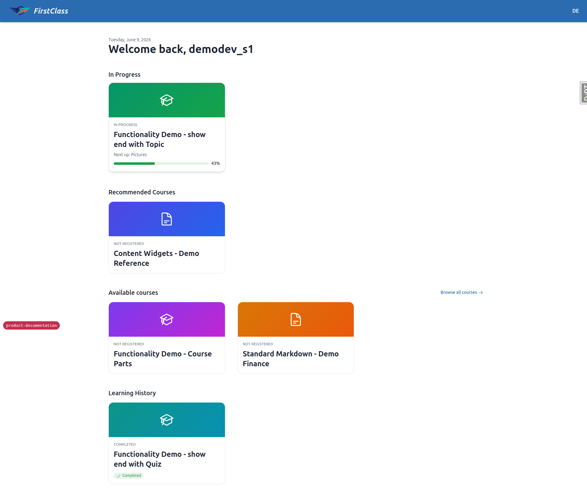
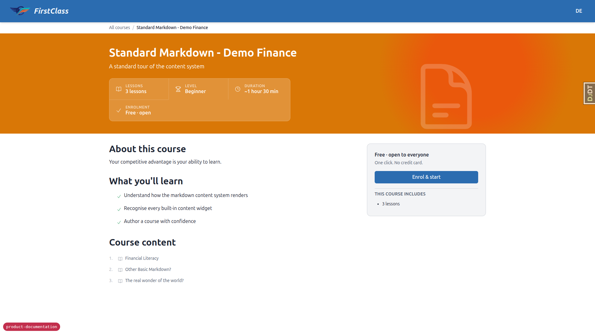
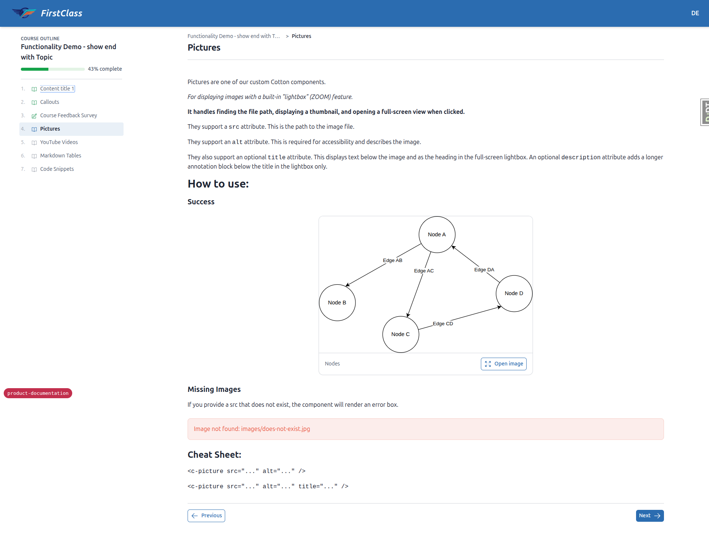
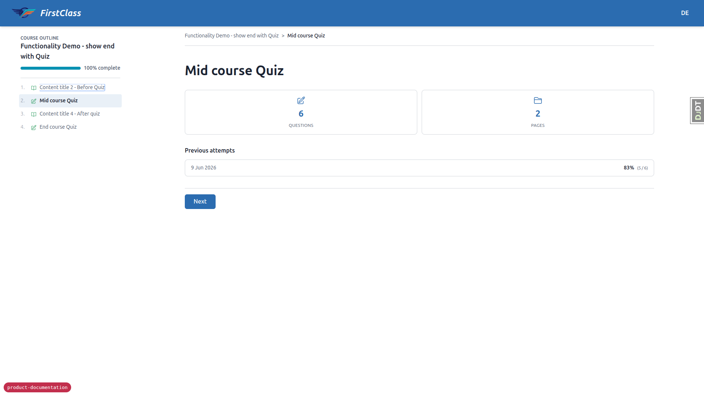
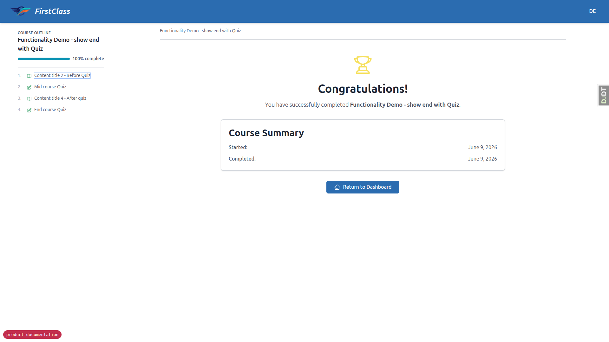

# Learner Experience

_Last updated: 2026-06-09_

## Summary

- Learners see a personalised dashboard grouping courses into in-progress, recommended, and completed; a full course listing shows registration status at a glance.
- Each course displays learning outcomes, difficulty, estimated duration, and a description before registration; learners self-register with a single action.
- The course player enforces sequential item unlock (BLOCKED → READY → IN_PROGRESS → COMPLETE/FAILED) and resumes automatically at the last accessed item.
- Multi-page forms, quiz feedback (pass/fail, score, optional reveal of incorrect answers), and a course finish page are all built in.
- Hard deadlines lock uncompleted content after expiry; soft deadlines show an overdue indicator without locking.

## Dashboard

The student dashboard (`student_interface:dashboard`) is the entry point after login. It presents three sections:

- **In progress** — courses the learner has started but not completed, ordered by recent activity.
- **Recommended** — courses surfaced via `RecommendedCourse` records (set by site administrators).
- **Completed** — courses for which `CourseProgress.completed_time` is set.

Each course card shows the course title, category, and progress percentage.

## Course Listing

The course listing page (`student_interface:courses`) shows all courses available on the current site. Each entry displays the learner's registration status: not registered, registered (in progress), or completed. Learners can navigate from the listing to a course detail page or directly to a registered course to resume.

## Course Detail Page

The course detail page (`student_interface:course_detail`) shows:

- **Learning outcomes** — a list of what the learner will achieve.
- **Difficulty** — one of: beginner, intermediate, advanced, all levels.
- **Estimated duration** — a human-readable display of the `estimated_duration` field.
- **Description** — full course markdown description.
- **Start / resume CTA** — if already registered, the button resumes from the last accessed item.

## Self-Registration

A learner who is not yet registered for a course can register from the course detail page. The `register_for_course` view (`student_interface:register_for_course`) creates a `UserCourseRegistration` record and an initial `CourseProgress` record in a single step. No administrator action is needed for self-registration.

## Course Player

The course player (`student_interface:view_course_item`) displays one content item at a time, identified by its position index within the course (`courses/<slug>/<int:index>/`).

### Sequential Item Unlock

Items are unlocked in order. Each item carries a status derived at runtime:

| Status | Meaning |
|---|---|
| `BLOCKED` | A preceding item is not yet complete; this item is inaccessible. |
| `READY` | The preceding item is complete (or this is the first item); the learner may start. |
| `IN_PROGRESS` | The learner has opened this item but not completed it. |
| `COMPLETE` | The item is finished. |
| `FAILED` | A form/quiz item was submitted and did not meet the pass threshold. |

The first item in a course always starts as `READY`. A learner cannot skip ahead; attempting to access a `BLOCKED` item redirects back.

### Course Parts (Chapters)

Courses may be divided into `CoursePart` groupings (chapters or sections). Each part derives a composite status (COMPLETE / IN_PROGRESS / BLOCKED) from the statuses of its child items. Parts are displayed in the player navigation for orientation.

### Resume

`CourseProgress.last_accessed_item` is a `GenericForeignKey` that records the most recently viewed item. Navigating to the bare course URL redirects the learner to this item automatically, so they do not need to find their place manually.

## Multi-Page Forms

Form-type content items may span multiple pages. The form workflow is:

1. Start (`student_interface:form_start`)
2. Fill a page (`student_interface:form_fill_page`)
3. Advance to the next page or submit the final page
4. Completion recorded (`student_interface:course_form_complete`)

A learner can also exit a form mid-way (`student_interface:form_submit_and_exit`); progress is preserved and the form can be resumed.

## Quiz Feedback

After submitting a quiz (form with `QUIZ` scoring strategy), the learner sees:

- **Pass or fail** — derived from `FormProgress.passed()`.
- **Score percentage** — derived from `FormProgress.quiz_percentage()`.
- **Incorrect answers** — if the course is configured with `quiz_show_incorrect=True`, the items the learner answered incorrectly are revealed. If `quiz_show_incorrect=False`, only the aggregate result is shown.

Multiple attempts are supported: a new `FormProgress` record is created for each attempt; only the most recent incomplete or the latest completed attempt is active.

## Course Finish Page

When all items in a course are complete, the learner is directed to the course finish page (`student_interface:course_finish`). `CourseProgress.completed_time` is set and the course moves to the completed section of the dashboard. There is no certificate or downloadable completion evidence.

## Deadlines

Deadlines are set by administrators (cohort-level or per-student) and are read-only from the learner's perspective.

- **Hard deadline** — if the deadline has expired and the item is not yet complete, the item is locked. A lock icon is shown and the learner cannot access the item.
- **Soft deadline** — the deadline is shown as overdue without locking the item. The learner can still access and complete the content.

The most permissive deadline governs when both a cohort deadline and a per-student override apply. The deadline feature can be disabled site-wide via the `DEADLINES_ACTIVE` setting.
