# Learner Experience

_Last updated: 2026-08-27_

## Summary

- Anonymous (logged-out) visitors can browse the home page, the course catalogue, and individual course detail pages without creating an account. Login is required only at the committing action (enrolment or application). The three personalised dashboard sections (In Progress, Recommended Courses, Learning History) are shown only to authenticated learners; anonymous visitors see a value-proposition hero and a discovery section instead.
- Each course listing entry shows an **access-model badge** (Free / By application) so a visitor can tell the access model before clicking through. Each course displays learning outcomes, difficulty, estimated duration, and a description; the acquisition CTA wording is action-forward: free courses show "Enrol for free", application-gated courses show "Apply now" (or "View my application" for a returning applicant).
- Independently of access type, a course also has a visibility state — published, coming soon, or hidden — that governs whether it's discoverable and enrollable; see [Course Visibility](#course-visibility-coming-soon--hidden) below.
- The course player unlocks items in sequence and resumes automatically where the learner left off.
- Multi-page forms, quiz feedback (pass/fail, score, optional reveal of incorrect answers), and a course finish page are all built in.
- Hard deadlines lock uncompleted content after expiry; soft deadlines are shown to the learner but never lock anything.
- Where a learner is studying through an organisation, that organisation's logo — or an initials monogram — and its name appear as a small, secondary mark in the course player. The site's own branding stays primary throughout.

## Dashboard

The learner dashboard serves as the home page at `/`. Its content branches on whether the visitor is authenticated.

**Anonymous visitors** see a value-proposition hero (a short headline, subtext, and a single "Browse all courses" CTA) at the top of the page, followed by the **Available courses** discovery section showing a sample of courses on the site. The personalised sections — the "Welcome back" greeting, In Progress, Recommended Courses, Learning History, and any backend panels — are not shown. They are omitted entirely rather than shown as "sign in to see this" placeholders.

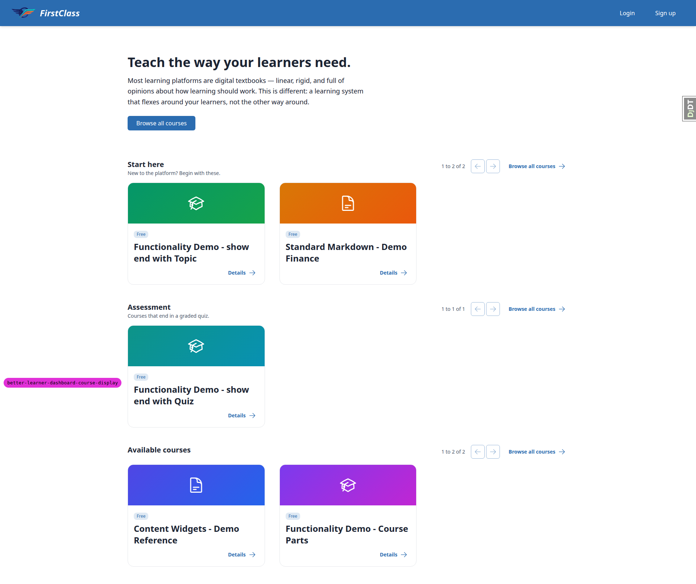

**Authenticated learners** see the personalised greeting and three sections:

- **In Progress** — courses the learner has started but not completed, ordered by recent activity.
- **Recommended Courses** — courses an administrator has surfaced for the learner.
- **Learning History** — courses the learner has finished.

Each course card shows the course title, category, and progress percentage, plus a low-emphasis "Details" link back to the course's [detail page](#course-detail-page). This link appears on every card in every state (in progress, completed, not yet registered, or coming soon) and on the anonymous "Available courses" grid, giving a consistent way back to the overview without competing with the card's primary action.

When application-gated courses are in use, the authenticated dashboard also shows an **In-flight applications** panel listing any courses the learner has applied to but not yet been enrolled in, each linking to its status page. This panel is absent on installations offering only free courses.

The site header shows **Log in** and **Sign up** affordances for anonymous visitors (carrying a `?next=` parameter so the visitor returns to the page they were on after authenticating). These affordances are absent from the header for authenticated users.

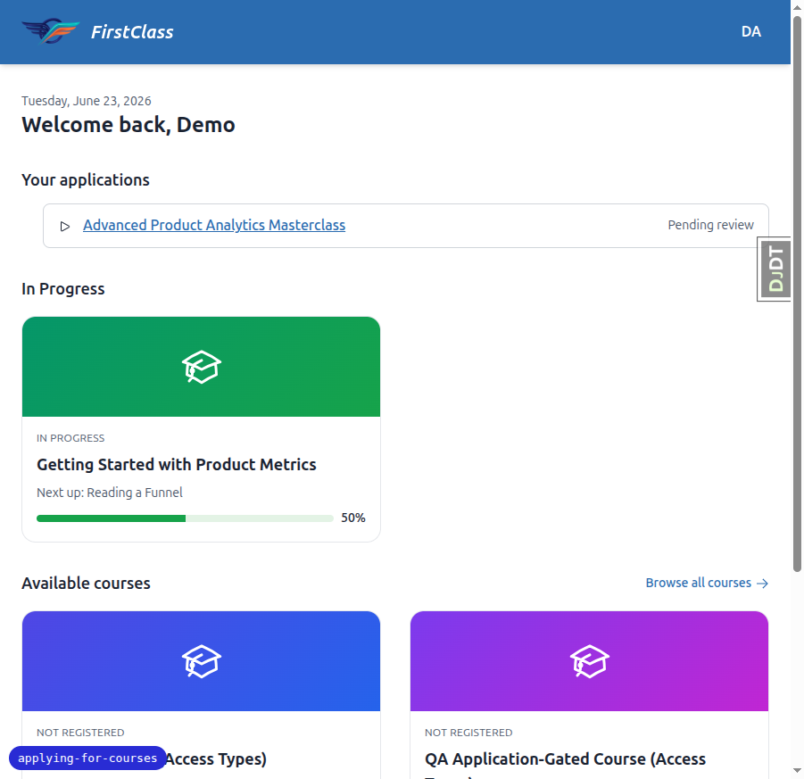

## Course Listing

The course listing page is publicly accessible — no login is required to browse it. It shows all courses available on the current site.

Each entry shows an **access-model badge** ("Free" or "By application") so a visitor can identify the access model before clicking through to the detail page.

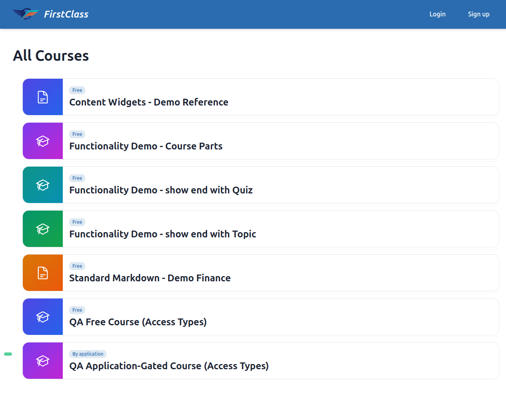

For authenticated learners, the listing additionally shows registration status (not registered, registered/in progress, or completed) and allows navigating directly to a registered course to resume. For anonymous visitors the "Not registered" status eyebrow is suppressed — the access badge serves as the at-a-glance signal instead. Card links point to the public course detail page for all visitors. Every row also carries the same low-emphasis "Details" link that appears on dashboard cards — identical wording and destination — in every row state, so anonymous, registered, and signed-in-but-unregistered visitors alike have an explicit way to the detail page, not only via the row's primary link.

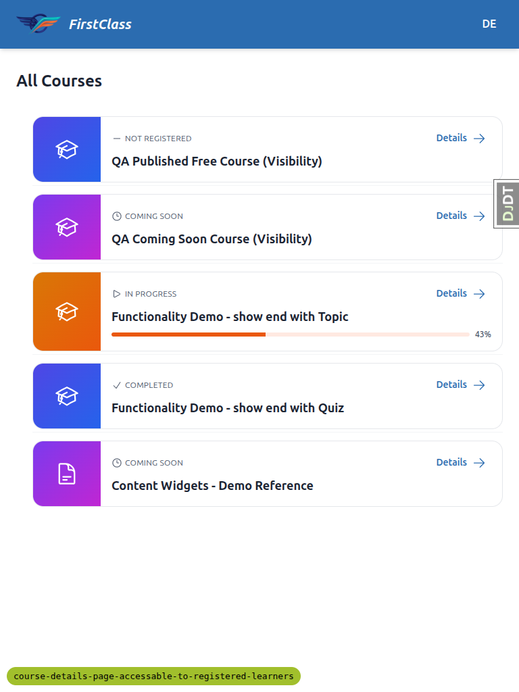

A course set to "coming soon" also appears in this listing, clearly badged, but as a plain link to its detail page rather than a course card with a registration action — there is no enrol, apply, or express-interest control on the listing itself. A "hidden" course does not appear in this listing at all, unless the learner is already registered for it. See [Course Visibility](#course-visibility-coming-soon--hidden).

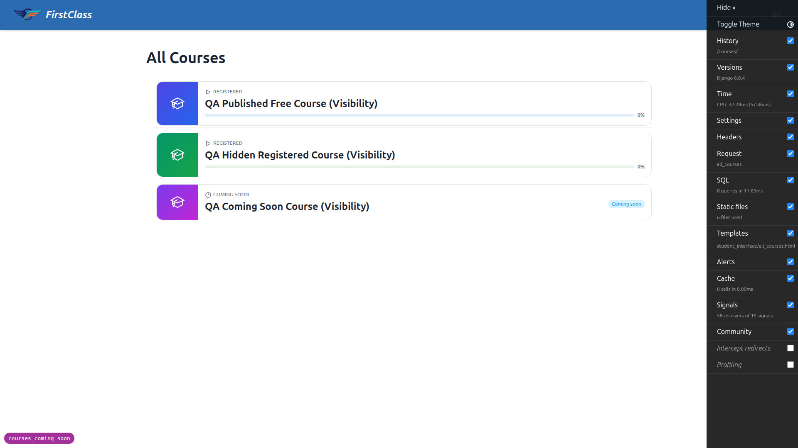

## Course Visibility (Coming Soon & Hidden)

Independently of a course's access type (free or application-gated), every course also has a **visibility** state: **published**, **coming soon**, or **hidden**. Visibility governs whether a course is discoverable and enrollable; access type governs how a learner enrols once it is. The two combine freely — for example, an application-gated course can be coming soon.

- **Published** is the default and is unchanged from the rest of this document: the course is discoverable everywhere and access is decided entirely by its access type.
- **Coming soon** courses are discoverable everywhere and clearly badged "Coming soon", but are not yet enrollable.
- **Hidden** courses are removed from discovery entirely.

A learner who is **already registered** for a course is unaffected by its visibility. Whether the course is coming soon or hidden, it stays on their dashboard, is reachable by direct URL, its content stays open, and they see the normal registered CTA. A visibility change never disrupts a learner partway through a course.

### Coming soon

In the course listing and on the dashboard, a coming-soon course is badged "Coming soon" and is a plain link through to its detail page — there is no enrol, apply, or express-interest control on the card or row itself.

On the course detail page, an unregistered learner sees an "I'm interested" control in place of the usual Start/Apply CTA. This expresses interest in the course — a lightweight, capacity-free waitlist — rather than enrolling the learner. Clicking it swaps the page, without a reload, to a quiet "Interested" confirmation alongside a "Remove interest" secondary action, so the learner can change their mind. Expressing interest is idempotent: clicking repeatedly (or across visits) never creates more than one interest record for that learner and course.

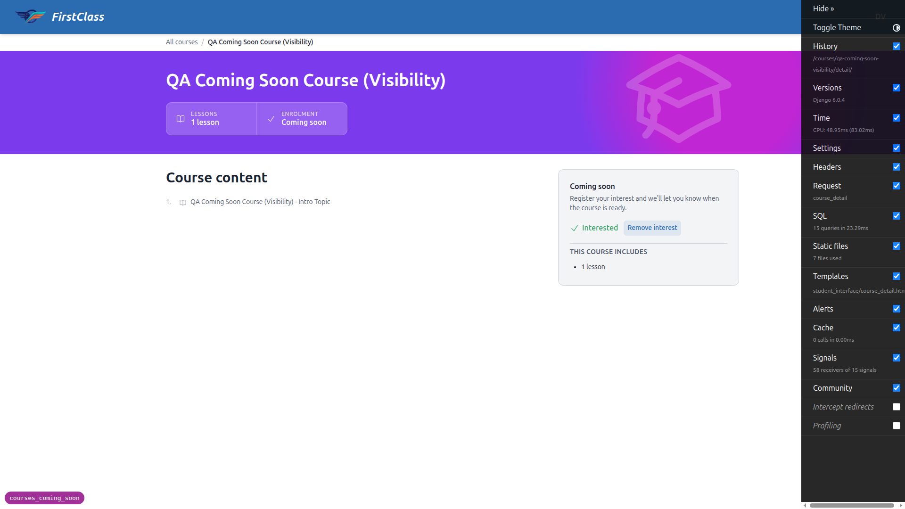

The confirmation copy sets a soft expectation that the learner will be told when the course is ready. In the current release, expressing interest only records that interest — no email or in-app notification is sent when the course later launches, because FLS has no notification system yet. Notify-on-launch is planned future work; see [roadmap](./roadmap.md).

There is deliberately no scarcity signalling anywhere in this flow: no queue position, no count of other interested learners, and no countdown to launch.

A coming-soon course's content stays locked: a learner who is not registered cannot open the course player, and is sent back to the detail page if they try.

### Hidden

A hidden course is removed from discovery entirely — it does not appear in the course listing, the dashboard, or any other browse surface. Its detail page returns a "not found" result for a learner who isn't already registered, the same as if the course didn't exist; a hidden course never confirms its own existence to a learner who stumbles onto its URL.

### Setting visibility

Visibility is set per course in the course's content file and takes effect on import; it is not something a learner or educator toggles in the app. See [content editing workflow](./content-editing-workflow.md) for how it's authored and [configuration and extension](./configuration-and-extension.md) for how access types and backends interact with it. The educator-facing view of visibility (badges, interest counts, drill-down to interested learners) is described in [educator-interface](./educator-interface.md).

## Course Detail Page

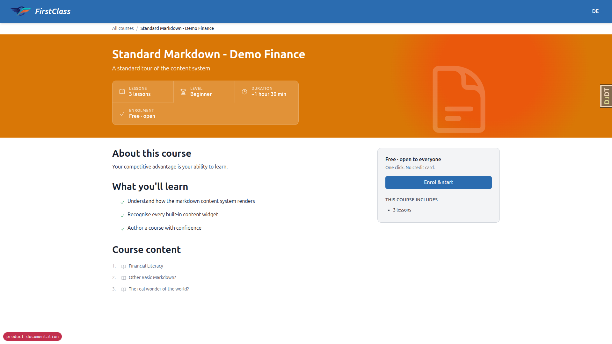

The course detail page is publicly accessible. Anonymous visitors and authenticated learners alike can view:

- **Learning outcomes** — a list of what the learner will achieve.
- **Difficulty** — one of: beginner, intermediate, advanced, all levels (authored as `all_levels`).
- **Estimated duration** — a human-readable estimate of how long the course takes.
- **Description** — full course markdown description.
- **Access-model signal** — the "Enrolment" stat near the CTA shows "Free · open" for free courses and "By application" for application-gated courses.
- **Table of contents** — all items are shown locked for visitors who are not registered, whether anonymous or signed in.

An author can flag a course as still being built so its table-of-contents surfaces are hidden entirely on this page — the lesson count, the "This course includes" lesson-count line, and the "Course content" section are omitted rather than shown empty, so an unfinished course never displays a "0 lessons" stat or a heading with nothing under it. This affects only what's shown on the detail page — it does not change a course's enrolment, access, or whether it's listed. See [content editing workflow](./content-editing-workflow.md) for how an author sets this.

**Acquisition CTA (not-registered visitors).** The CTA label and destination follow the course's access model, so new access models can supply their own wording. For the two access models that exist today:

- Free course → **"Enrol for free"**, which enrols the learner.
- Application-gated course, no prior application → **"Apply now"**, which starts an application.
- Application-gated course, existing application → **"View my application"**, which links to the learner's application status page.

The CTA label is action-forward and does not mention login; an anonymous visitor is taken through the standard login or signup flow automatically when they click the CTA (see [Deferred-login intent completion](#deferred-login-intent-completion) below). See [configuration and extension](./configuration-and-extension.md) for how access types are configured per course.

**Progress-aware CTA (already-registered learners).** For learners who are already enrolled, the detail page shows a progress-aware CTA regardless of access model: "Start course", "Continue", or "Review course", pointing at the appropriate position in the course.

**Visibility overrides the CTA.** A course marked "coming soon" replaces the acquisition CTA with an "I'm interested" express-interest control, and a "hidden" course's detail page is not reachable at all for a learner who isn't already registered — both are described in [Course Visibility](#course-visibility-coming-soon--hidden).

## Deferred-login Intent Completion

When an anonymous visitor clicks an acquisition CTA ("Enrol for free" or "Apply now"), they are sent through the standard full-page login or signup flow via a `?next=` parameter. After authenticating, their intended action completes automatically:

- **"Enrol for free"** — after login or signup, the learner is enrolled and dropped straight into the course content with no additional click.
- **"Apply now"** — after login or signup, the learner lands on the apply confirmation page, ready to submit. The application is not auto-submitted; applying is a deliberate action.

This intent is preserved even through the new-user signup path that requires completing additional registration forms. For how the intended destination is preserved through signup, see [Authentication](./authentication.md).

## Discoverability

Because the catalogue and course detail pages are public, they are crawlable. Each page emits a per-page `<title>` and `<meta name="description">`. Course detail pages include `schema.org/Course` JSON-LD structured data (populated only from fields that exist in the model: title, description, difficulty, estimated duration, learning outcomes, and whether the course is accessible for free). The catalogue page includes `schema.org/ItemList` JSON-LD covering the visible courses and their detail URLs.

The installation serves a dynamic per-site `sitemap.xml` listing the catalogue and course detail pages, and a `robots.txt` that allows crawling of the public course paths and references the current site's sitemap. The sitemap follows the same visibility rules as the catalogue: hidden courses are excluded, while coming-soon courses (whose detail pages are publicly reachable) are included. All URLs in structured data and the sitemap are absolute and tenant-correct. For details of per-tenant URL isolation, see [Multi-tenancy and isolation](./multi-tenancy-and-isolation.md).

## Self-Registration

When a learner enrols in a free course from its detail page, they are registered and their progress record is created in a single step — no administrator action is needed for a free course.

Access is enforced server-side: a learner cannot self-register for an application-gated course by guessing a URL. Attempting to do so routes them into the application flow instead. Administrator and cohort enrolment deliberately bypass this gate and work for any course regardless of access type.

Content within a course is also gated consistently: a learner who is not entitled to a course's content is redirected to the course detail page rather than reaching item content directly.

This same chokepoint also enforces course visibility, for every access type: a learner cannot self-register for, apply to, or open the content of a "coming soon" or "hidden" course by guessing a URL. See [Course Visibility](#course-visibility-coming-soon--hidden).

## Applying to a Course

Courses configured as application-gated present an "Apply now" CTA on the course detail page; the course content is locked until the learner is enrolled.

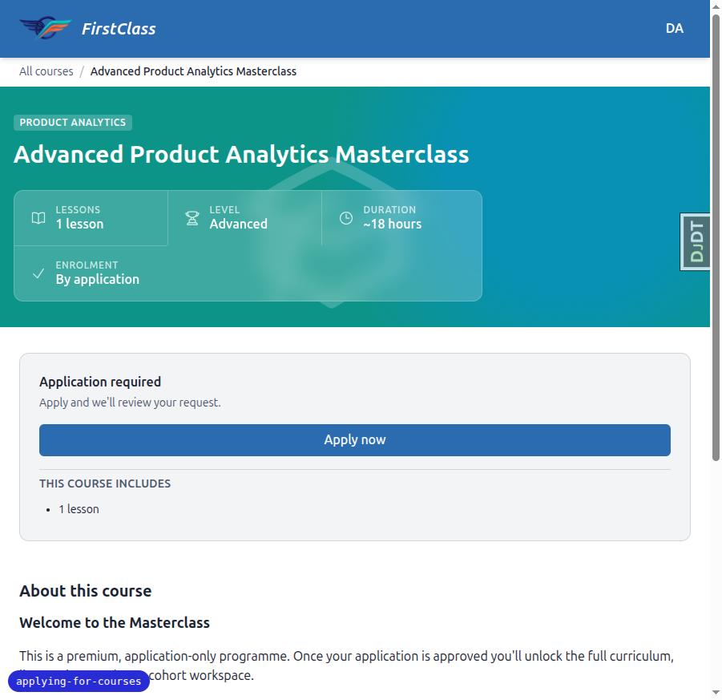

Selecting "Apply now" leads to a confirmation page ("Apply to \<course\>?"); confirming creates the application and shows a status page confirming it has been received and is pending review.

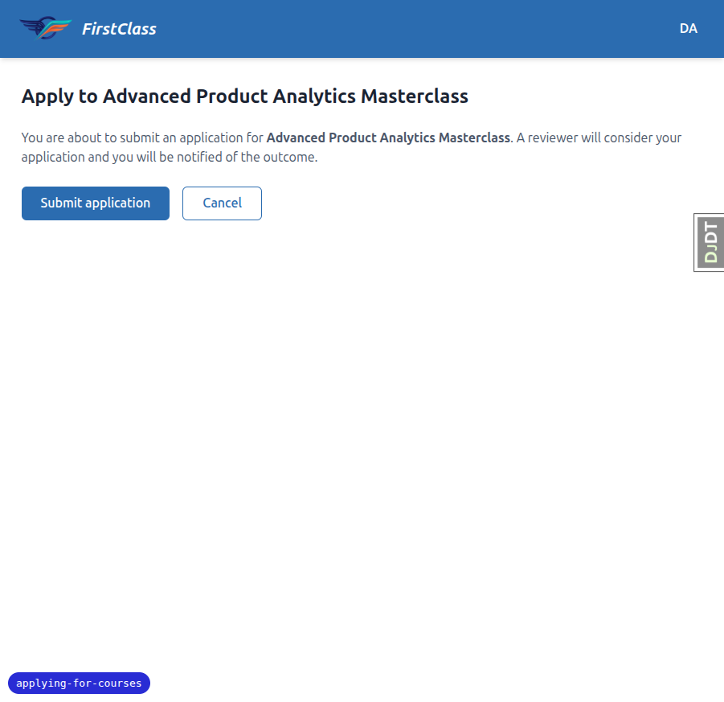

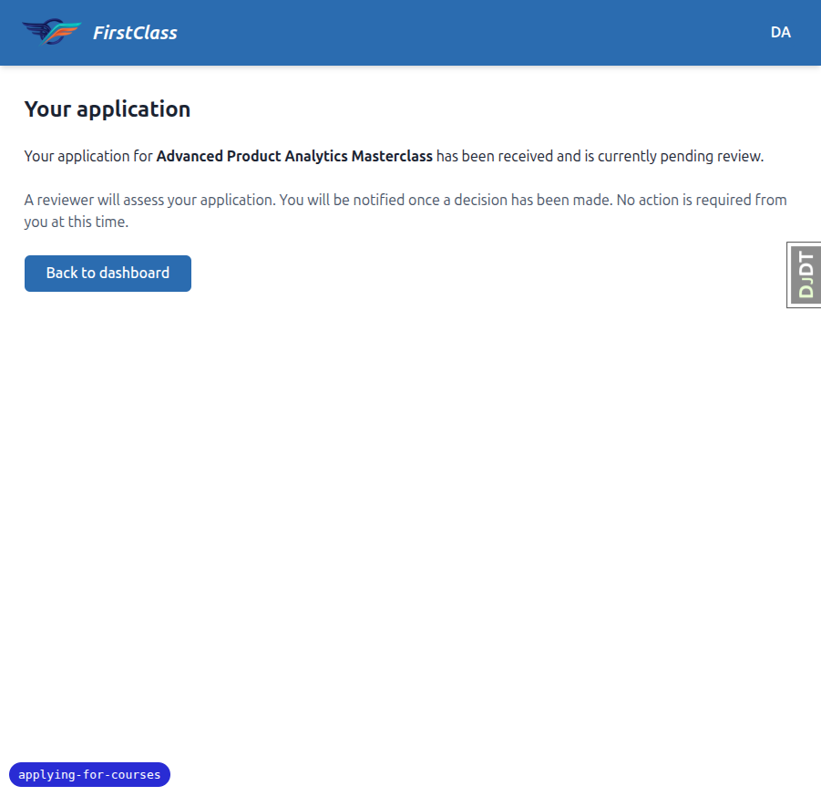

Applying is idempotent: a learner who has already applied for a course is taken directly to their existing application's status page rather than creating a duplicate submission.

The application records only that the learner applied — it collects no questions or file uploads, and there is no review or approval workflow: the status page is static, with no reviewer messages or withdraw action. Multi-step application forms and application review are planned; see [roadmap](./roadmap.md).

Access type is configured per course through the content-loading pipeline; see [content editing workflow](./content-editing-workflow.md) for authoring details and [configuration and extension](./configuration-and-extension.md) for the backend settings.

## Course Player

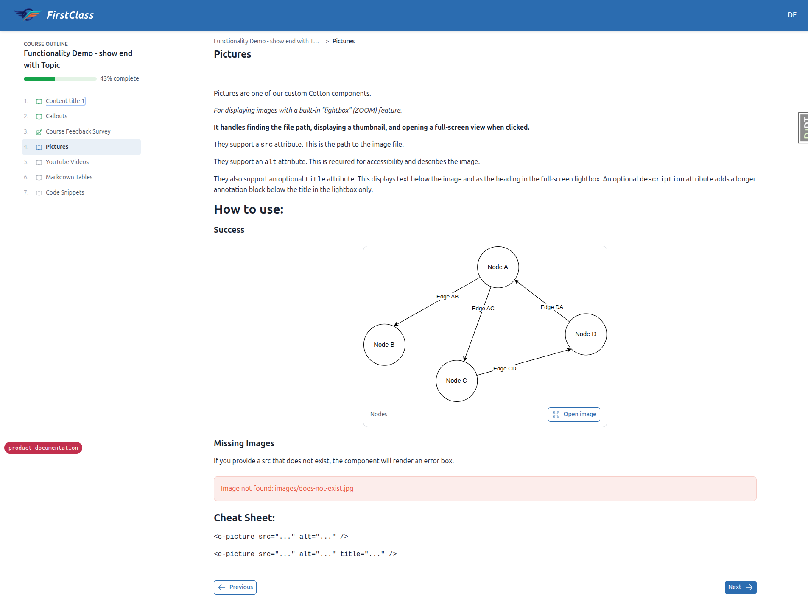

The course player displays one content item at a time. The breadcrumb trail starts with the course title; clicking it takes the learner to the course's [detail page](#course-detail-page) rather than back to the first lesson, giving a one-click route out of the player to the overview at any point. Because that detail page's URL is itself the shareable link, this is also how a learner shares the course — FLS ships no separate share control.

### Sequential Item Unlock

Items unlock in order: a learner can start an item once the previous one is complete, cannot skip ahead, and a form or quiz that does not reach its pass threshold is marked failed. The first item is always available.

The ordering is enforced on the server, not only in how the outline is drawn: an item shown as locked cannot be reached by opening its URL directly, and visiting one never counts as starting it.

### Course Parts (Chapters)

Courses can be divided into parts (chapters); the player shows part-level progress for orientation. Where the only thing standing between a learner and a part is a quiz inside it they have not passed, the part reads as needing a retry and links straight to the re-sit, rather than showing as locked with no way in.

### Resume

Returning to a course sends the learner straight back to the item they last viewed, so they never have to find their place.

### Organisation Co-Branding

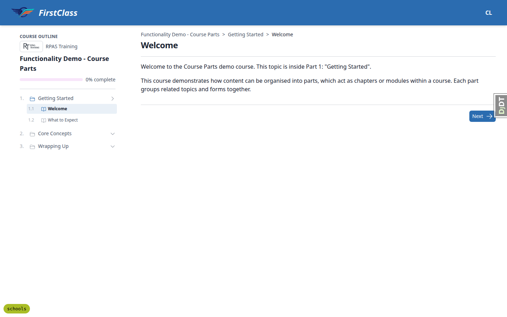

If a learner is studying a course through an organisation — reached either through their cohort or through their own registration — that organisation's logo and name appear in the course outline header, directly above the course title, as a small, clearly secondary mark. If the organisation has no logo, an initials monogram derived from its name is shown instead; if its name has no usable letters, a generic icon.

A learner who self-registers for a course, rather than being added through a cohort, is registered through the site's own default organisation, so no mark appears unless an administrator has given that organisation a logo.

This is co-branding, not rebranding: the rest of the learner-facing chrome — theme, colours, domain — remains the site's own regardless of organisation. There is no per-organisation theme, domain, or email and certificate branding.

See [multi-tenancy and isolation](./multi-tenancy-and-isolation.md#organisations) for what an organisation is, and [admin interface](./admin-interface.md#organisation-management) for how its logo is uploaded.

## Multi-Page Forms

Form items can span multiple pages. A learner can leave a form part-way through and resume later with their answers preserved. Leaving is only guarded by a confirmation prompt when there are unsaved changes to lose. A question marked required must be answered before the learner can move on.

## Quiz Feedback

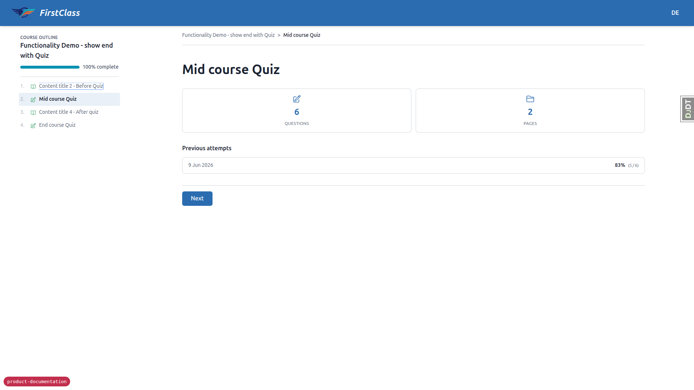

After submitting a quiz, the learner sees:

- **Score percentage.**
- **Pass or fail — or no verdict at all**, where the quiz has no pass mark set. In that case the learner is given their score and nothing is claimed about passing. The same three-way treatment applies everywhere a quiz outcome is shown: the results page, the course player's unlock decisions, and the dashboard.
- **Incorrect answers** — if the quiz is authored to reveal incorrect answers (`quiz_show_incorrect`), the learner sees which they got wrong; otherwise only the score, and the verdict where there is one, is shown. The review reflects what was actually marked wrong: a free-text question is never listed, having no right-or-wrong options to show; a question left unanswered is listed like any other wrong answer rather than dropped, so a learner who failed is never shown an empty review; and an option the learner ticked correctly is never flagged as an error beside a correct-answer list that says otherwise.

A checkbox question is marked correct only when every correct option is selected and no incorrect one is — ticking everything no longer guarantees full marks. Single-answer multiple-choice questions are unaffected, since only one option can ever be selected.

Scores are frozen when an attempt is submitted and are never recalculated, so a learner keeps the score they were shown even if the quiz's marking changes afterwards. Where an attempt's stored score no longer matches what the same answers would score today — a checkbox attempt sat before the rule above, for instance — the results page says so, rather than leaving the mismatch looking like an error.

A survey or other unscored form confirms that answers were recorded, and does not promise marking that is not coming.

Learners can attempt a quiz more than once.

## Course Finish Page

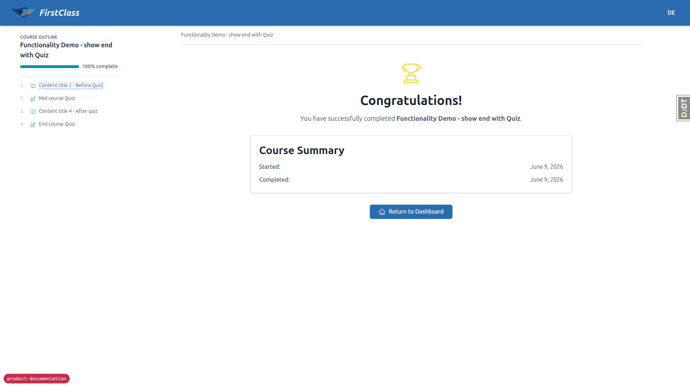

When every item in a course is complete, the learner reaches a finish page and the course moves to the completed section of their dashboard. A quiz the learner has not passed does not count toward that completion — the finish page names what is outstanding and links to the retry. See [learner tracking](./learner-tracking.md#progress-percentage) for how completion is calculated. There is no certificate or downloadable completion evidence.

## Deadlines

Deadlines are set by administrators (cohort-level or per-learner) and are read-only from the learner's perspective. Applicable deadline dates appear as colour-coded badges against items in the course contents.

- **Hard deadline** — once expired, an incomplete item is locked. A lock icon is shown and the learner cannot open it. Completed items are never locked.
- **Soft deadline** — shown to the learner but never locks anything; the content stays accessible and completable past the date. Note there is no explicit "overdue" state on the learner's side — overdue highlighting appears only in the educator's [progress matrix](./educator-interface.md#course-progress-matrix).

Where both a cohort deadline and a per-learner override apply, the most permissive — the latest — governs. Where a learner is registered for the same course through more than one [organisation](./multi-tenancy-and-isolation.md#organisations), each organisation's deadlines apply only to that organisation's registration; they are never merged into one list. Deadlines can be disabled site-wide via the `DEADLINES_ACTIVE` setting.
