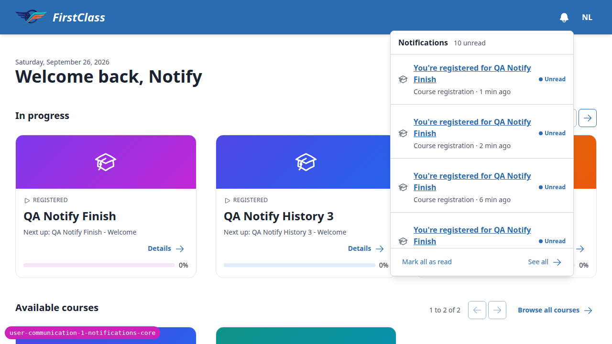

# Notifications

_Last updated: 2026-09-26_

## Summary

- Signed-in users get an in-app bell with an unread badge in the header, a panel of recent notifications, and a notification centre page.
- One event raises a notification today: a learner is registered for a course by someone else.
- The bell is **off by default**. Notifications are recorded either way.
- A project can add its own notification categories.
- Not built: email or any other delivery, preferences, pop-up alerts, retention, and backfill.

## The Bell and the Notification Centre

Every signed-in user, learner or educator, has a bell in the shared header. It carries a badge counting notifications that have arrived since they last looked. Opening it shows the most recent notifications and links to the notification centre, a full page with All and Unread filters where a user can mark notifications read or unread, one at a time or all at once. Following a notification takes the user to the thing it is about and marks it read. A user only ever sees their own notifications.

## What Triggers a Notification

FLS never notifies someone about what they just did. A learner is notified when someone else registers them for a course. Self-registering and finishing a course notify nobody, because the learner is already looking at the result. The corresponding [webhooks](./webhooks.md) still fire in both cases.

## Turning It On and Extending It

The bell is hidden until a project sets `NOTIFICATIONS_ENABLED`. Notifications are recorded whether or not it is set, so a site that turns the bell on later shows the history it has built up. A project adds its own notification categories through the `NOTIFICATION_CATEGORIES` setting.

## Not Built

- **Delivery beyond the bell.** There is no email notification. `NOTIFICATION_DELIVERY_BACKENDS` is the place a delivery channel will plug in, but none ships.
- **Preferences.** A user cannot choose which notifications they receive.
- **Pop-up alerts.** A new notification appears only in the bell and the centre.
- **Retention.** Every notification is kept indefinitely.
- **Backfill.** Nothing that happened before the feature existed produces a notification.

See the [roadmap](./roadmap.md#notification-system) for what else is missing.
