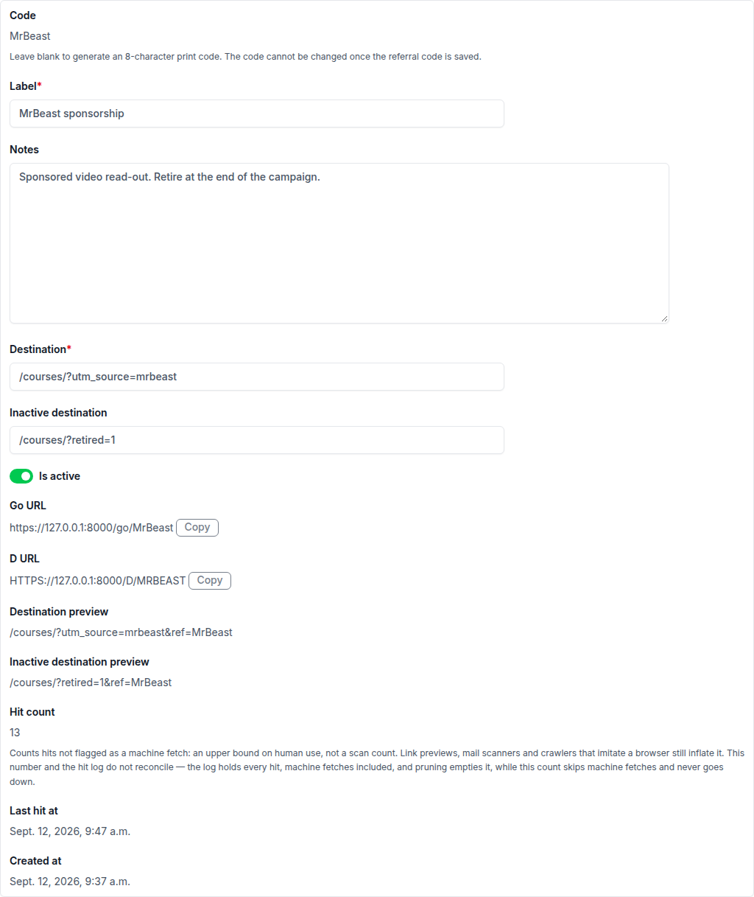

# Referral Codes

_Last updated: 2026-09-12_

## Summary

- **A referral code is a short URL an operator hands out, which redirects to a page on the site and counts how many times it was followed.** The code is created in the admin, either typed as a vanity code or left blank to have one generated. Built.
- **Each code has two URLs: `/go/<code>` for a link someone clicks, and `/d/<CODE>` for the one to put behind a printed QR symbol.** Both resolve in either case, so an uppercase URL on a poster still works. Built.
- **A code's hit count is a usage signal, not a headcount.** It leaves out visits identified as automated, which makes it an upper bound on human use rather than a number of people or a basis for a conversion rate. Built.
- **A code reaches signup attribution only as a first touch**, the same rule every other tracked link follows. See [signup attribution](./signup-attribution.md). Built.
- **A retired code still redirects and still logs**, so printed material never dead-ends. Only a code that never existed is treated as a dead link. Built.
- **A saved code can be deactivated but never deleted or renamed**, so its text is never handed to someone else later. Built.
- **Nothing trims the hit log.** An operator prunes it on whatever schedule suits them. Not built: automatic pruning.

## Codes and Redirects

A referral code is created in the admin with a label, a destination page on the site, and an optional fallback destination for once it is retired. Following either of the code's two URLs sends the visitor to that destination with the code attached to the landing, the way an advert code or a UTM parameter is — see [signup attribution](./signup-attribution.md) for how a landing like that becomes a signup record. A code only ever counts as the first tracked touch; a later visit through the same or a different code does not change what a signup is attributed to.

A deactivated code keeps redirecting rather than breaking a link or a printed board. It sends the visitor to its own fallback destination, or to an installation-wide default when none is set — see the `REFERRAL_TRACKING_INACTIVE_DESTINATION` setting in [configuration and extension](./configuration-and-extension.md) — and it still logs the visit, so retired material that is still pulling traffic is visible rather than silent.

## Reviewing and Exporting

The admin change form for a code shows both of its URLs ready to copy and a preview of where each one currently redirects to. The changelist shows each code's hit count and when it was last followed, and a bulk action deactivates a selection.

Every visit is written to a separate hit log, recording which code it carried and which of the two URLs it came through. That log holds no personal data and describes no visitor — see [security and data handling](./security-and-data-handling.md#personal-data-collected). It is not trimmed automatically: an operator runs the `prune_referral_code_hits` command on whatever schedule their deployment needs. Because the log is pruned and the hit count is not, the two do not reconcile.

Both the code list and the hit log export to CSV.

## Not Built

- Counting or de-duplicating individual visitors, and any per-hit conversion rate.
- Anything describing who followed a code.
- Automatic pruning of the hit log.
- QR image generation. FLS supplies the URL; rendering the symbol is the designer's job.
- A dashboard, or a partner-facing view of a code's own performance.
