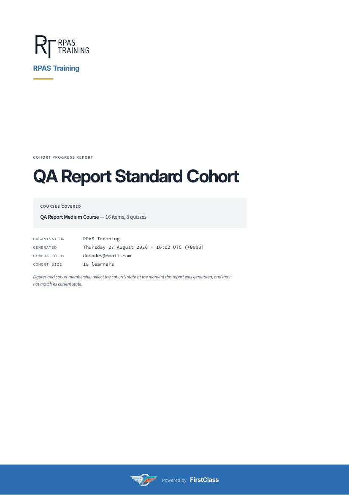
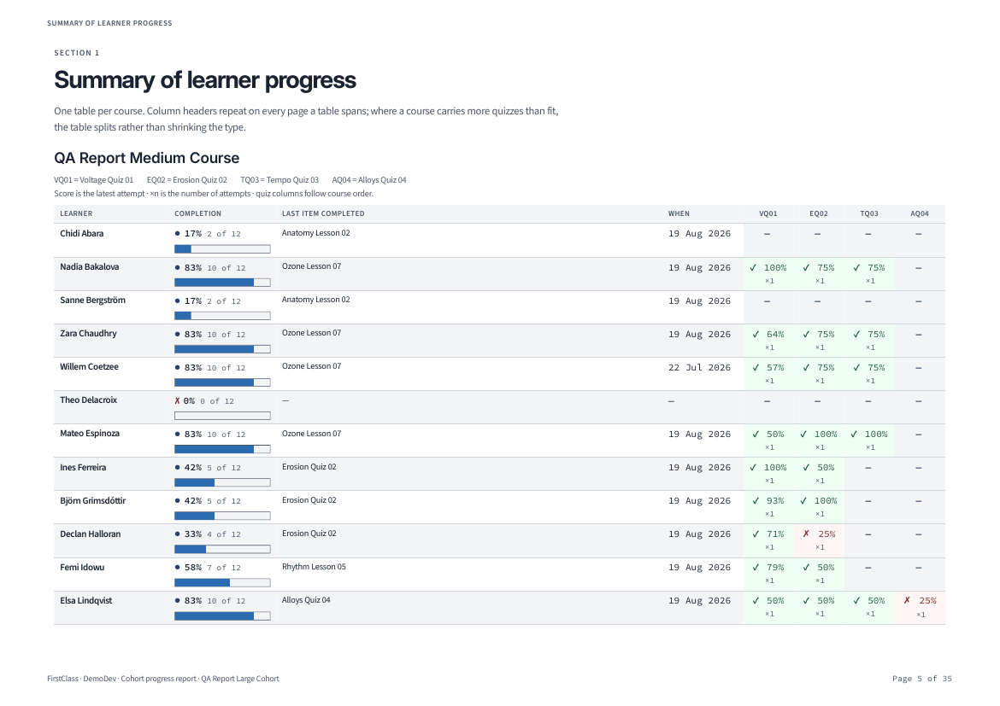
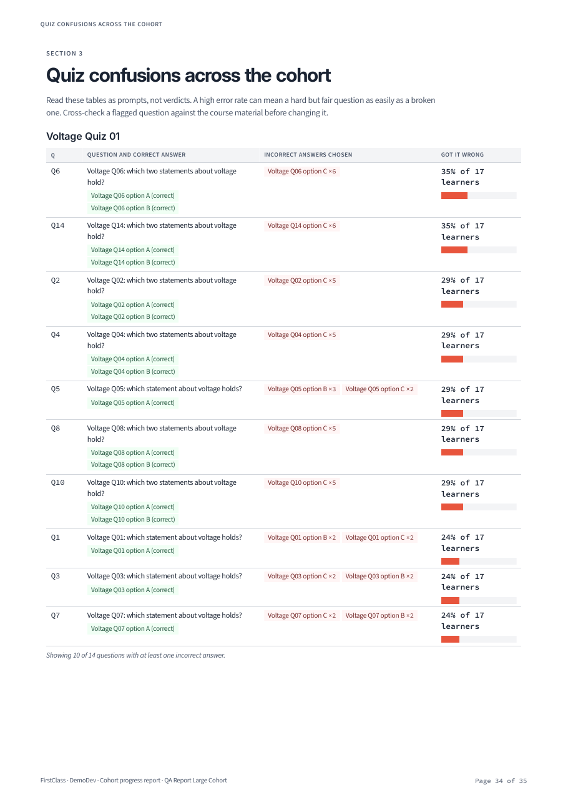

# Cohort Reports

_Last updated: 2026-08-30_

## Summary

- FLS generates a single A4 PDF progress report for a cohort, covering every course that cohort is registered for — including courses whose registration has since been deactivated, which are included and marked rather than dropped.
- The report holds a cover, a cohort-at-a-glance page, a contents and definitions page, a landscape summary table per course, a detail section per learner, and a cohort-wide analysis of which quiz questions caused the most trouble.
- Three at-risk rules — no recorded activity, a failed latest quiz attempt, and inactivity beyond a threshold — flag learners identically on the at-a-glance page and in their own section.
- Generation is triggered on demand from the Django admin and runs in the background; the finished PDF is downloaded through a permission-checked link, never a public media URL.
- The report leads with the **organisation's** own name and logo; the platform appears only as a small "Powered by" mark naming the site, which cannot be switched off.
- **Not built:** scheduled or emailed reports, retention or expiry of stored PDFs, and any per-learner or publicly shareable link. See [Limits](#limits).

## What the Report Is

One portrait A4 PDF per cohort, covering every course that cohort is registered for, a section apiece. A course whose registration has since been deactivated still appears and is marked inactive — learners did that work and it should not vanish from the record.

The audience is internal educators and staff, so the report uses learners' real names and is not anonymised. It exists to be taken into a meeting, filed, marked up, or handed to someone who does not have a login — which the live [course-progress matrix](./educator-interface.md#course-progress-matrix) cannot be.

## What Is In It

**Cover** — leads with the organisation's own logo and name as the primary brand, or its name alone set as a wordmark where no logo has been uploaded. Then the cohort, the courses covered with inactive registrations marked, and when the report was generated and by whom. The platform appears only as a small "Powered by" mark naming the site, on the cover and again in every interior page footer — and not at all for a cohort in the site's own default organisation, where the platform already is the brand. The cover states plainly that both the figures and the cohort's membership are a snapshot taken at generation time.

**Cohort at a glance** — headline numbers (cohort size, median completion, how many have not started, how many have completed everything) and a "learners needing attention" list drawn from the at-risk rules, worst-first, each pointing at that learner's own page. The list is capped, and the cap is disclosed — "18 learners flagged, 12 shown" — rather than silently truncated.

**Contents and definitions** — a table of contents with real page numbers and PDF bookmarks, followed by a plain-language methodology block: what "complete" means, that a quiz score is the latest attempt, what counts as an attempt, why the cohort-wide analysis uses first attempts only, that multi-select quiz scoring changed so a score stored before that change can disagree with the wrong-answer detail beside it, and what is excluded.

**Summary of learner progress** — one landscape table per course, listing each learner's completion percentage and count, the last item they completed and when, and a column per quiz carrying their latest score and attempt count. Header rows repeat on every page a table spans. A course with more quizzes than fit across an A4 landscape page splits into continued tables rather than shrinking the type to illegibility; the column budget is configurable, since it depends on the page size and typeface a deployment uses.

**Details per learner** — one section per learner, alphabetical by surname, starting on a fresh page and carrying their name in the running header. It shows every at-risk flag they tripped, every item they completed and when, every quiz attempt with its score, and which questions and options they got wrong, counted per attempt so a mistake repeated across three attempts reads as the persistent misconception it is. A learner with nothing recorded gets an explicit "No activity recorded" line, and a learner with no flags is told so — silent omission reads as a data bug.

**Quiz confusions across the cohort** — covered below.

## At-Risk Flags

Three rules run against every learner: **no recorded activity at all**, **failed their latest quiz attempt** (a quiz with no pass mark yields no verdict, so it cannot trigger this), and **inactive for a number of days** since their last completion. A learner can trip several and shows every reason.

Both the at-a-glance attention list and the learner's own section render from one evaluation, so a name spotted on the front page shows identical flags when you turn to their page.

The rules are a fixed list in code. There is no setting to add, remove, or retune one — a downstream project that needs a different rule or a different inactivity threshold has to fork until rule selection moves into the database. See [configuration and extension](./configuration-and-extension.md) and the [roadmap](./roadmap.md).

## Quiz Confusions

This section asks, cohort-wide, which questions people got wrong — using each learner's **first** completed attempt only. Retakes let a learner remember an answer they have already seen, which would make a genuinely hard question look easy.

Questions are ranked worst-first and the list is capped per quiz with the cap disclosed ("showing worst 10 of 23 questions with at least one incorrect answer"). The correct option is always shown beside the incorrect ones the question attracted, so a table stands on its own without turning back to the course. Below a small-group threshold the report gives a plain count — "7 of 9 learners got this wrong" — rather than a percentage, which would imply a precision that is not there. The section carries a standing caution that a high error rate can mean a hard-but-fair question rather than a broken one.

Free-text questions have no notion of a correct answer in FLS and are excluded from this analysis entirely.

## Generating and Downloading

A report is requested from the Django admin by a staff member who can view the target cohort — through a permission granted on that cohort, or through a staff role on the cohort's organisation, the same two routes the [educator interface](./educator-interface.md#access-control) uses. Generation runs in the background rather than making the requester wait, and the report list shows how far along it is. Only one report can be in flight for a cohort at a time, so a second request while one is running does not start a duplicate. A failed generation surfaces its error in the list and the cohort can be retried straight away. A report whose generation was interrupted, by a restart or a crash partway through rendering, is closed as failed by a scheduled sweep rather than being left in flight forever, so the cohort is not blocked from asking again. See [deployment](./deployment.md) for that sweep. The downloaded file is named for the organisation and cohort, and the PDF's own document properties name the organisation as author and the site as generator, so a copy passed on to a learner, employer or funder identifies itself as that organisation's record.

See [admin interface](./admin-interface.md#cohort-progress-reports) for the admin flow, and [security and data handling](./security-and-data-handling.md) for the access and privacy posture — a generated report holds learner names, scores and individual answers, and is served through a permission-checked download rather than a media URL.

## Limits

**No scheduled or emailed reports.** Generation is manual, one cohort at a time, from the admin. There is no recurring schedule and no email delivery.

**No retention or expiry.** A generated PDF is kept until an administrator deletes it by hand.

**No shareable link.** A report is reachable only by an authorised staff member through the admin. There is no link that can be given to a learner or an external party.

**The platform attribution cannot be switched off.** A report carries a small "Powered by" mark naming the site on its cover and in every footer, alongside the organisation's own brand, with no setting to remove it. See [roadmap](./roadmap.md).

**Activities and free-text answers are excluded** from completion figures and from the quiz analyses, because FLS records no completion data for activities and no correctness concept for free-text answers.

**Individually registered courses are not covered.** Only the cohort's own course registrations appear; a course a learner joined on their own is absent from the report. Within a covered course, the completion figures, quiz attempts and at-risk flags reflect only the work done under the cohort's own registration — the same learner's activity through a registration of their own, or through another organisation, is not folded in.

**Deadlines are not shown.** Deadlines are a live-tracking concept and a point-in-time PDF is deliberately not where they belong.

**The report is a snapshot.** Figures and cohort membership reflect the moment of generation. Cohort membership carries no history, so a learner who has since left appears as though they were never in the cohort in a later report.

## See Also

- [Deployment](./deployment.md) — the system libraries and background worker report rendering needs.
- [Configuration and extension](./configuration-and-extension.md) — the settings governing report storage, size caps, and typography.
- [Learner tracking](./learner-tracking.md) — what the underlying progress data records and what the completion percentage means.
