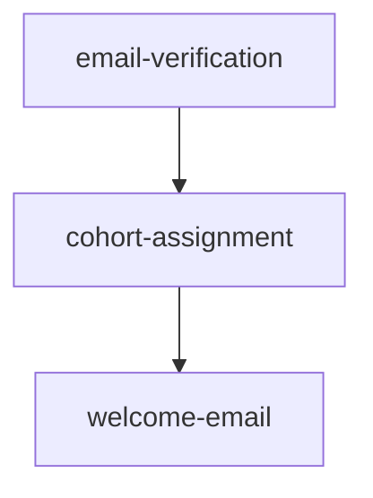

# Research: Representing Dependencies Between Sibling Specs

Goal: design a way to track parallel-vs-sequential dependencies between child specs created in `spec_dd/1. next/<name>/` after a parent spec is decomposed. Below: prior art, then candidate file formats for FLS.

## Prior art

### Linear — issue relations + project graph
- **Format**: relations are first-class DB rows; UI exposes "Blocked by" / "Blocks" / "Related" / "Duplicate" plus parent/sub-issue. Project-level dependencies render as a graph on the timeline (blue = clean, red = violated).
- **Sync**: bidirectional and managed by Linear — adding `blocks` on A automatically materialises `blocked-by` on B. No drift because there is no second source.
- **Visualisation**: native UI sidebar pills + a project timeline that draws DAG edges between projects.
- **Failure modes**: cycle detection is enforced; the main pain is that parent/sub-issue is a *different* relation from blocks/blocked-by, so people pick the wrong one.
- Refs: <https://linear.app/docs/issue-relations>, <https://linear.app/docs/parent-and-sub-issues>, <https://linear.app/docs/project-dependencies>.

### Jira — issue links + Advanced Roadmaps
- **Format**: `blocks` / `is blocked by` is one of many configurable link types stored on the issue. Epic→story is a separate "Epic Link" custom field (semi-deprecated in favour of parent links).
- **Sync**: bidirectional and DB-managed; reverse direction auto-created.
- **Visualisation**: arrows on Timeline / Advanced Roadmaps; only `blocks/is blocked by` actually drives scheduling — other links are decorative.
- **Failure modes**: link directionality occasionally reverses on import; epics-blocking-epics often miss the dependency report; admins can add link types, fragmenting conventions.
- Refs: <https://support.atlassian.com/jira-software-cloud/docs/create-or-remove-dependencies-on-your-timeline/>, <https://www.quirk.com.au/jira-dependency-management-guide/>.

### GitHub Issues / Projects — task lists & "tracked by"
- **Format**: markdown task lists (`- [ ] #123`) inside an issue body. GitHub parses these and exposes "Tracks" / "Tracked by" columns + filters in Projects.
- **Sync**: GitHub auto-derives the reverse "tracked by" from the parent's task list; no separate write needed.
- **Visualisation**: hierarchical view in Projects; no native DAG visualisation for blocks (that lives in third-party tools).
- **Failure modes**: only models *parent → children*, not arbitrary blocking edges; closing/reopening an issue does not propagate; references break when issues are moved.
- Refs: <https://docs.github.com/en/issues/tracking-your-work-with-issues/about-task-lists>, <https://github.com/github/roadmap/issues/760>.

### Bazel / Buck / Pants — BUILD files
- **Format**: `deps = [":foo", "//path/to:bar"]` per target in a `BUILD`/`BUILD.bazel` file. Pants v2 *infers* deps from imports and falls back to explicit `dependencies = [...]` for resources/codegen.
- **Sync**: one-way only — a target lists what it needs. No reverse edges in source; reverse queries (`bazel query 'rdeps(...)'`) compute them on demand.
- **Visualisation**: `bazel query --output=graph` produces graphviz; IDE plugins render the DAG.
- **Failure modes**: stale deps are the canonical pain; Bazel breaks the build, Pants warns. Cycles are rejected by the build.
- Refs: <https://bazel.build/concepts/dependencies>, <https://www.pantsbuild.org/blog/2022/10/27/why-dependency-inference>, <https://buck.build/concept/build_rule.html>.

### Cargo / npm / Poetry workspaces
- **Format**: a root manifest lists members (`[workspace] members = ["bar"]` or `"workspaces": ["packages/*"]`); each member declares its own deps with a workspace marker (`regex = { workspace = true }`, `"foo": "workspace:*"`, `core = {path = "../core"}`).
- **Sync**: one-way — child declares dep on sibling; tooling resolves. Workspace root pins versions to keep siblings consistent.
- **Visualisation**: `cargo tree`, `npm ls`, plus IDE graph views.
- **Failure modes**: transitive lock drift (Poetry especially); cycles forbidden; "phantom" dependencies (used but undeclared) surface only at build/test.
- Refs: <https://doc.rust-lang.org/cargo/reference/workspaces.html>, <https://docs.npmjs.com/cli/v11/using-npm/workspaces/>, <https://python-poetry.org/docs/pyproject/>.

### Terraform `depends_on`
- **Format**: HCL meta-argument; `depends_on = [module.foo, aws_iam_role.bar]` per resource/module block. Most deps are *implicit* via expression references; `depends_on` is the explicit escape hatch.
- **Sync**: one-way only.
- **Visualisation**: `terraform graph` → DOT/graphviz.
- **Failure modes**: explicit `depends_on` is conservative — flips dependent resources to "known after apply" and over-replaces. Best-practice docs warn to use it only when implicit references can't express the order.
- Refs: <https://developer.hashicorp.com/terraform/language/meta-arguments/depends_on>.

### Make / CMake
- **Format**: Make uses `target: prereq1 prereq2` (with optional `|` for order-only deps that don't trigger rebuilds). CMake prefers `target_link_libraries(target PUBLIC|PRIVATE dep)` over the older `add_dependencies(a b)` because the former carries link semantics in addition to ordering.
- **Sync**: one-way; reverse computed via `make -p` etc.
- **Visualisation**: third-party graph tooling (`makefile2graph`, CMake's `--graphviz`).
- **Failure modes**: Make has notorious *under*-declaration (header changes don't trigger rebuilds); auto-prereq generation is the standard fix. CMake `add_dependencies` is widely misused as a substitute for linking.
- Refs: <https://www.gnu.org/software/make/manual/html_node/Prerequisite-Types.html>, <https://cmake.org/cmake/help/latest/command/target_link_libraries.html>.

### Story Mapping (Jeff Patton)
- **Format**: 2D wall — horizontal **backbone** of activities/tasks (narrative order); vertical ribs of stories under each backbone step, sliced into release rows. The top row is the "walking skeleton" / MVP.
- **Sync**: physical or board-based; ordering is implicit in spatial position rather than declared edges.
- **Visualisation**: the map *is* the artefact.
- **Failure modes**: doesn't model arbitrary cross-spine blocking; relies on a human curator.
- Refs: <https://www.jpattonassociates.com/wp-content/uploads/2015/03/story_mapping.pdf>, <https://agilealliance.org/glossary/story-mapping/>.

### ADRs (MADR / Nygard)
- **Format**: numbered markdown files (`0007-htmx-for-active-pages.md`); status `Proposed | Accepted | Superseded by ADR-0012`; "Related ADRs" / "Informed" sections link by ID.
- **Sync**: human-maintained, one-way (the new ADR points back at the one it supersedes; the old one is ideally edited to add a forward pointer, but this drifts).
- **Visualisation**: usually none; some teams generate a Mermaid graph from frontmatter.
- **Failure modes**: forward-pointer drift is the classic bug — easy to add the back-pointer, easy to forget the forward one.
- Refs: <https://adr.github.io/madr/>, <https://github.com/joelparkerhenderson/architecture-decision-record>.

### CI DAGs — GitHub Actions / GitLab CI
- **Format**: per-job `needs: [job_a, job_b]` (string or list) inside the workflow YAML. `needs: []` opts out of stage ordering entirely.
- **Sync**: one-way; reverse is computed.
- **Visualisation**: native pipeline graph.
- **Failure modes**: cycles rejected at parse time; missing-job references fail the workflow; `needs:optional` exists for jobs that may or may not exist in a given run.
- Refs: <https://docs.github.com/en/actions/using-workflows/workflow-syntax-for-github-actions>, <https://docs.gitlab.com/ci/yaml/needs/>.

### Spec-kit (GitHub) — closest analogue
- **Format**: `specs/[###-feature]/` with `spec.md`, `plan.md`, `research.md`, `tasks.md`, `contracts/`. Numeric prefix orders features but does not encode dependencies between sibling specs.
- **Sync**: none — relations are narrative.
- **Refs**: <https://github.com/github/spec-kit>, <https://github.com/github/spec-kit/blob/main/spec-driven.md>.

## Cross-cutting observations

- **Single-source rule**: every system that scales (Linear, Bazel, GitHub Actions) keeps the edge in *one* place and computes the reverse. Hand-maintained bidirectional links (ADRs) drift.
- **Explicit > inferred for human-authored work**: build systems can infer from imports; specs have no equivalent signal, so the edge must be declared.
- **Numeric prefixes encode order, not dependency**: `01-`, `02-` is fine for "narrative reading order" but cannot express "B and C both depend on A but are independent of each other".
- **Render the graph**: every successful system has a way to show the DAG (`bazel query`, Linear timeline, GitLab pipeline view). Without it humans can't reason about >5 nodes.

## Candidate representations for FLS

Assume the parent spec has just been decomposed into `spec_dd/1. next/<parent>/<child-1>/`, `<child-2>/`, … each child being a directory with `idea.md` / `spec.md`.

### Candidate A — `manifest.md` at the parent level (single source of truth)

```markdown
# Manifest: better-registration

## Children
- `email-verification/` — verify email on signup
- `cohort-assignment/` — auto-assign to default cohort
- `welcome-email/` — send welcome message

## Dependencies
- `cohort-assignment` depends on `email-verification`
- `welcome-email` depends on `cohort-assignment`
```

A canonical machine-parseable section can use a fenced block:

````markdown
```yaml
# spec-dd manifest v1
children:
  email-verification: {}
  cohort-assignment:
    depends_on: [email-verification]
  welcome-email:
    depends_on: [cohort-assignment]
```
````

- **Pros**: single source of truth (no drift); trivial for a slash command to parse; whole graph visible in one file; supports both prose and structured form; Mermaid render can be appended and regenerated.
- **Cons**: parent file must be edited every time a child is added/removed; if a child is moved between status folders the manifest path lookup must follow.
- **Scales**: well to 20–30 nodes; beyond that the YAML block needs splitting.

### Candidate B — Frontmatter on each child (`depends_on:` + `parent:`)

```markdown
---
spec: cohort-assignment
parent: better-registration
depends_on: [email-verification]
---
# Cohort assignment
```

- **Pros**: each child is self-describing; survives folder moves better than a parent manifest; matches ADR/MADR convention; nice for grep.
- **Cons**: no single place to see the graph — slash command must walk the directory; reverse edges must be computed; if a child is renamed, every dependent's frontmatter must be updated; cycles are only detectable after a full walk.
- **Scales**: well; this is what build systems do.

### Candidate C — Mermaid diagram in a top-level file (`graph.md`)

````markdown

````

- **Pros**: instantly visualisable in any markdown renderer; natural format for human review.
- **Cons**: Mermaid is awkward to parse robustly (regex over edges works but is fragile); no place for per-spec metadata; renaming a child means hand-editing every line referencing it.
- **Scales**: visually fine to ~15 nodes, parsing brittleness gets worse with subgraphs.
- **Best as a derived view**, not a source of truth.

### Candidate D — Folder-name prefixes (`01-`, `02-`, …)

```
better-registration/
  01-email-verification/
  02-cohort-assignment/
  03-welcome-email/
```

- **Pros**: zero tooling; ordering visible in `ls`; mirrors spec-kit and ADR numbering.
- **Cons**: only encodes a *total* order, not parallelism; cannot express "B and C both depend on A but are independent"; renumbering on insert is annoying; doesn't survive moves between status folders cleanly.
- **Scales**: poorly for anything but a strict pipeline.

## Recommendation

Adopt **A as the source of truth, C as a derived view**, with B's frontmatter used only for `parent:` (the upward pointer that survives folder moves).

- `manifest.md` in the parent directory holds the YAML edge list — one file the slash command reads/writes.
- A `/spec-dd graph` command renders the Mermaid block from the manifest (regenerated, never hand-edited).
- Each child carries `parent: <name>` in frontmatter so an orphaned directory can find its way home, but no `depends_on` lives there — that prevents the bidirectional drift that bites ADRs.
- Reject D as the primary mechanism (loses parallelism); prefix numbering can still be used cosmetically inside the manifest's children list if reading order matters.

This mirrors what works in Bazel/Cargo/CI: one declared edge list, computed reverse, generated visualisation, and a small bit of redundant metadata (the `parent:` pointer) only where it provides robustness against file moves.

Word count: ~1480.
