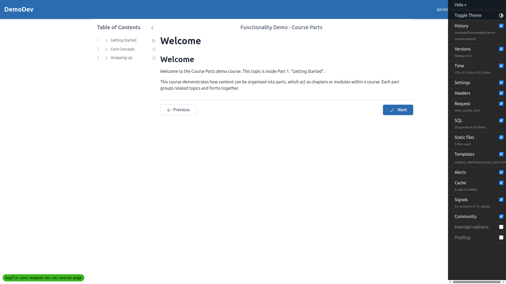
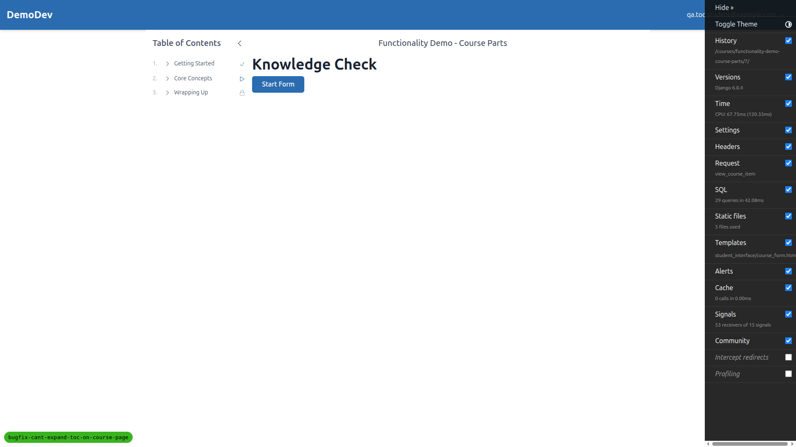
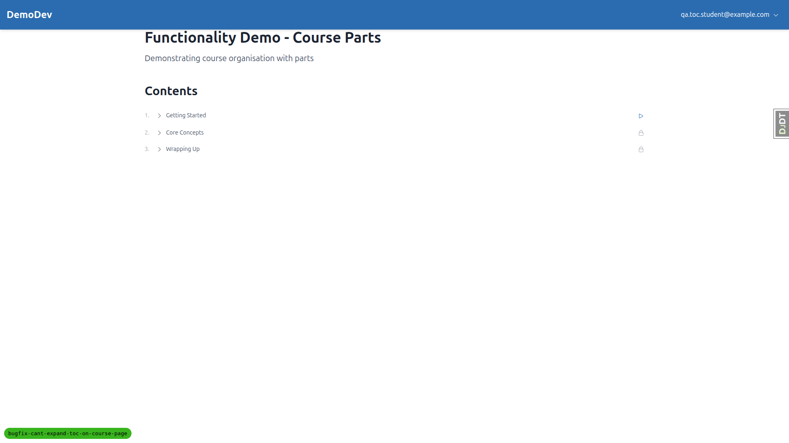
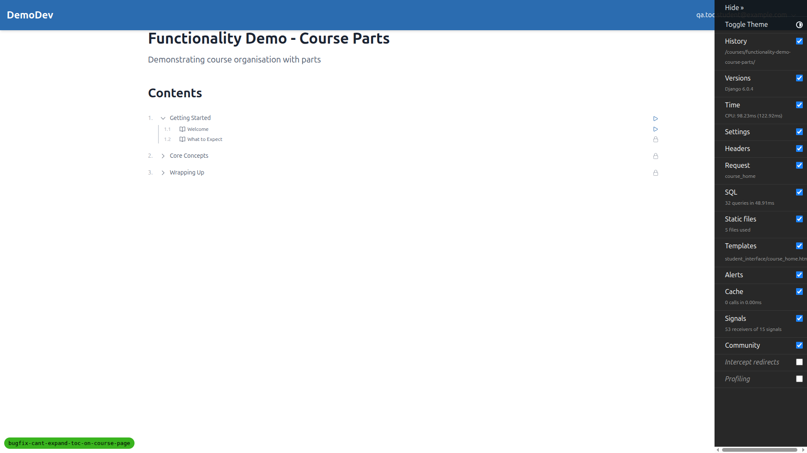
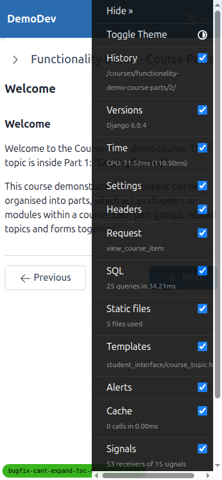
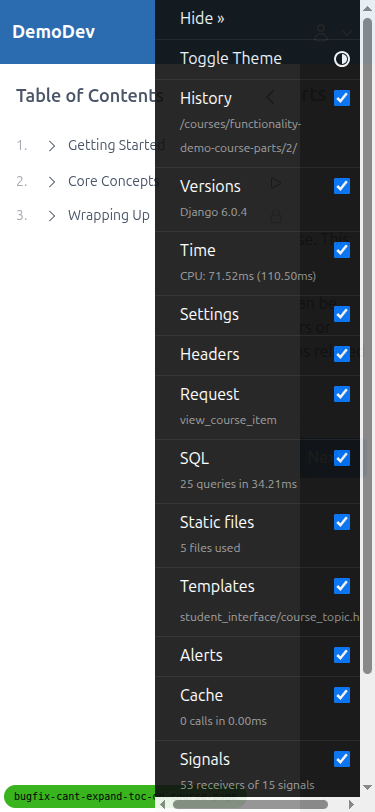
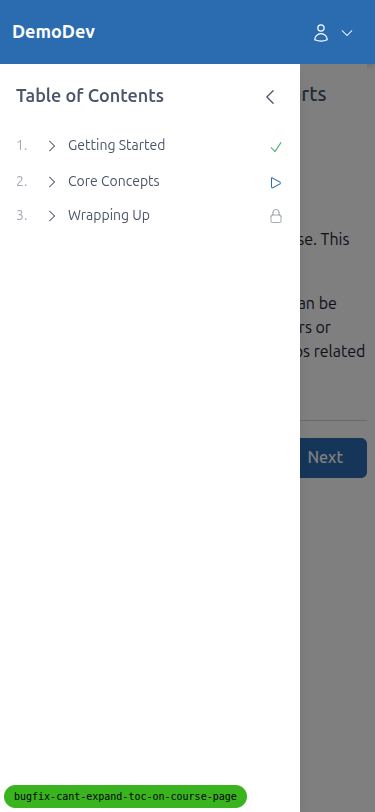
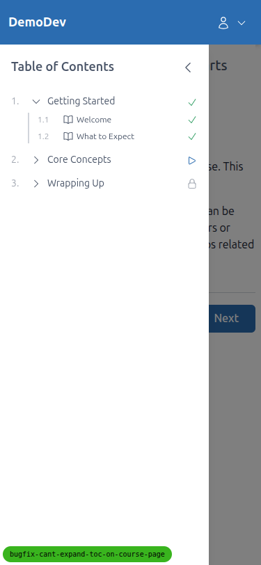
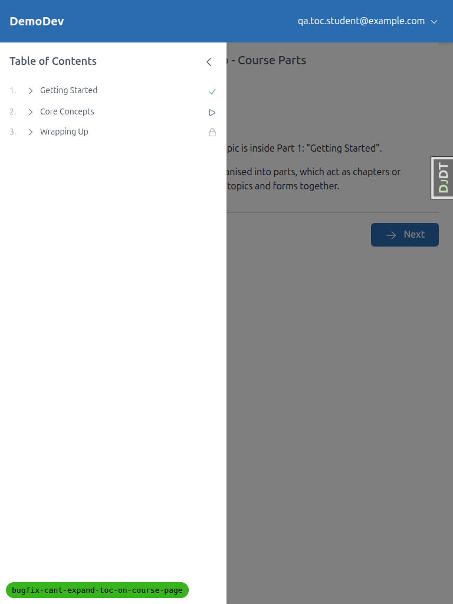

# QA Report: TOC expand/collapse on course detail pages

**Branch:** `bugfix-cant-expand-toc-on-course-page`
**Date:** 2026-04-24
**Tester:** Claude (Playwright MCP)
**Test student:** `qa.toc.student@example.com` on DemoDev site, registered for `functionality-demo-course-parts`

## Summary

The primary bug (the TOC toggle button doing nothing on course detail pages) is **fixed**. Clicking the expand/collapse toggle on course topic and course form pages now correctly reveals/hides child items. No Alpine expression errors were observed in the browser console on any of the pages under test. The existing course-home behaviour still works.

One **pre-existing** issue surfaced during Test 3 (persistence), but it reproduces on `course_home.html` too — so it is not a regression from this fix. Details below.

## Test results

| Test | Result |
| --- | --- |
| **Test 1** — TOC expand/collapse on course topic page (`/courses/.../2/`) | PASS |
| **Test 2** — TOC expand/collapse on course form page (`/courses/.../7/`, Knowledge Check) | PASS |
| **Test 3** — Expand/collapse state persists across navigation | FAIL (pre-existing, not a regression) |
| **Test 4** — No regression on course home page (`/courses/functionality-demo-course-parts/`) | PASS |
| Console — no `Alpine Expression Error` about `toggleExpanded` | PASS |

Desktop (1920x1080), mobile (375x812) and tablet (768x1024) viewports were all exercised for Test 1 (topic page) and the behaviour is consistent across sizes.

## Test 1 — Topic page expand/collapse (PASS)

Navigating to `http://127.0.0.1:$PORT/courses/functionality-demo-course-parts/2/` (the `Welcome` topic, rendered via `course_topic.html`).

Before click — sidebar TOC loaded with 3 collapsed parts:

After clicking the "Getting Started" toggle — children ("Welcome", "What to Expect") become visible:

After clicking again — children hidden:

## Test 2 — Form page expand/collapse (PASS)

Knowledge Check form at `/courses/functionality-demo-course-parts/7/` (rendered via `course_form.html`). After marking prerequisite topics complete so the student can reach the form.

Before click:

After clicking "Core Concepts" toggle — children ("Key Ideas", "Going Deeper", "Knowledge Check") become visible:

## Test 3 — Persistence (FAIL — pre-existing, not a regression)

**Expected:** After expanding a TOC part and then navigating to another course detail page, the expanded section should still be expanded (persisted via localStorage).

**Actual:** The expanded state is lost on navigation. Inspecting `window.localStorage` after a click shows only `djdt.show`; there is no `coursePart_*` key written, even though the click visibly toggles the section.

Root cause (noted, not fixed as part of this ticket): the `toggleExpanded` method in `freedom_ls/student_interface/static/student_interface/js/alpine-components.js:20` reads `this.$el.dataset.storageKey` to decide the storage slot. When the method is invoked via the button's `x-on:click="toggleExpanded"` (template `partials/course_minimal_toc.html:80`), `this.$el` resolves to the `<button>` element (which has no `data-storage-key`), so `key` is falsy and the `localStorage.setItem` branch is skipped. Calling the method via the Alpine data proxy directly (e.g. `Alpine.$data(div).toggleExpanded()`) does write to localStorage — confirming the `$el` scoping is the issue.

**Not a regression:** the same behaviour is observed on `/courses/functionality-demo-course-parts/` (`course_home.html`). I cleared localStorage, expanded a part, reloaded, and the part was collapsed again; no `coursePart_*` key existed. Since persistence was already broken before this fix, it is outside the scope of this bugfix ticket and should be filed as a separate issue (suggested fix: have `toggleExpanded` read the storage key from a closure captured in `init`, or use Alpine's `$persist`).

## Test 4 — No regression on course home page (PASS)

`course_home.html` (`/courses/functionality-demo-course-parts/`) still toggles as before:

Initial:

After expanding "Getting Started":

## Console check (PASS)

Across every page tested, the only console error recorded was a favicon 404 (`GET /favicon.ico → 404`). No `Alpine Expression Error`, no `toggleExpanded is not a function`, no other errors or warnings.

## Mobile testing (375x812) — PASS

The sidebar is closed by default on mobile and opens via the menu button, which is expected behaviour. Once opened, clicking "Getting Started" correctly expands to show its children; the layout is clean and touch-target sizing looks adequate.

Sidebar closed (default state):

Sidebar opened (with debug toolbar still covering top-right):

After hiding the debug toolbar:

After expanding "Getting Started":

## Tablet testing (768x1024) — PASS

At 768px the sidebar is open and overlays the page content (this is the current tablet behaviour — content is slightly shifted but partially hidden behind the sidebar panel when it is open, which may be worth reviewing separately; it is not caused by this fix). Toggle expand/collapse works correctly.

Initial:

After expanding "Getting Started":

## Tangential observations (not caused by this fix)

1. **Persistence broken on all pages** — described under Test 3. Worth a separate bug ticket.
2. **Tablet sidebar overlaps main content** — at 768px the sidebar opens over the page rather than alongside it. Since this is width-dependent layout behaviour it is likely part of a broader responsive-layout decision, not something introduced by this bugfix. Flagging for review.
3. **Sidebar heading visibility check** — when calling Playwright's `browser_wait_for` with text "Table of Contents" on mobile, the text exists in the DOM but is visually hidden in the collapsed-sidebar state; this is expected.

## Setup notes

- Created a fresh QA student `qa.toc.student@example.com` / `testpass123` (verified email, registered for `functionality-demo-course-parts`) via the qa-data-helper agent.
- To access the Knowledge Check form page, the student's progress for `welcome`, `what-to-expect`, `key-ideas`, and `going-deeper` was marked complete so the form is reachable at `/courses/functionality-demo-course-parts/7/`.
- Server was run on port 8248 via `uv run python manage.py runserver 8248`.
