# QA Report: Educator Interface Better Navigation

**Date:** 2026-04-06
**Branch:** educator-interface-better-nav
**Base URL:** http://127.0.0.1:8320/educator/
**Tester:** Claude (automated via Playwright MCP)

## Summary

All 12 tests (Test 0–11) **PASSED**. No functional errors were found.

---

## Desktop Tests (1920x1080)

### Test 0: Educator Root Page — PASS
- Breadcrumbs show only "Educator" (current page, not a link)
- `aria-current="page"` present on breadcrumb item
- No sidebar item highlighted
- Breadcrumb uses `<nav aria-label="Breadcrumb">` with `<ol>`

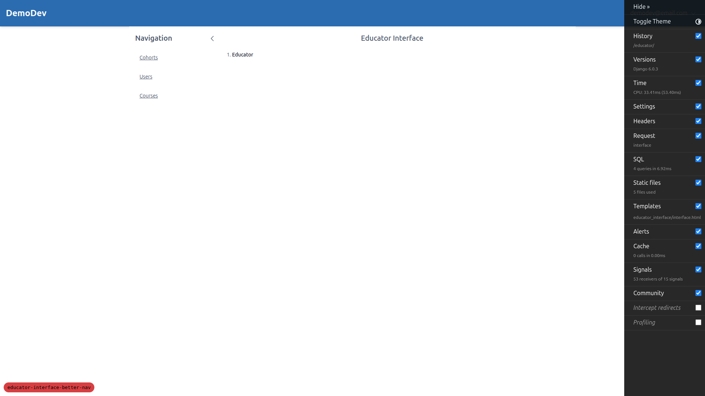

### Test 1: Sidebar Active Highlighting — PASS
- "Cohorts" highlighted with background fill, left accent bar, and semi-bold text when on `/educator/cohorts`
- Switching to "Users" correctly moves the active state
- Inactive items have hover effect (`hover:bg-surface-1`) distinct from active (`bg-surface-2`)
- `aria-current="page"` correctly applied

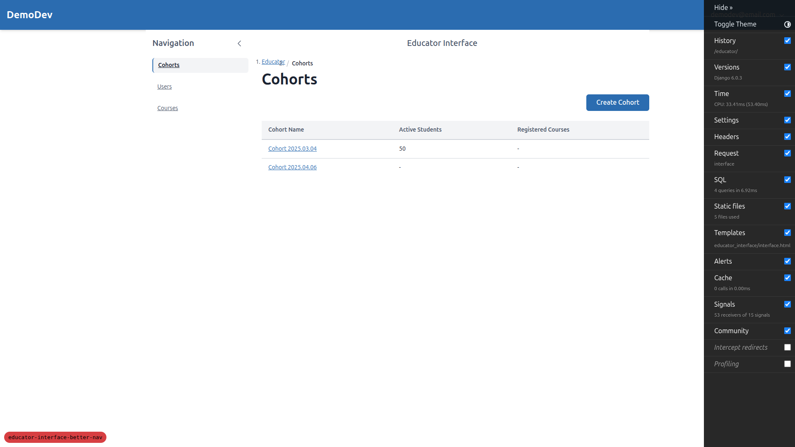
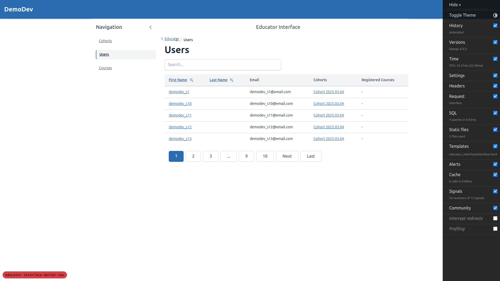

### Test 2: Breadcrumbs on List Pages — PASS
- Breadcrumbs show `Educator > Cohorts` on cohorts list page
- "Educator" is a clickable link, "Cohorts" is plain text (current page)
- Uses `<nav aria-label="Breadcrumb">` containing `<ol>` (ordered list)
- Last item has `aria-current="page"`
- Separators rendered via CSS `::before` pseudo-elements (no inline `/` text in DOM)
- Focus indicator: 2px solid blue outline on breadcrumb links

### Test 3: Breadcrumbs on Instance Pages — PASS
- Breadcrumbs show `Educator > Cohorts > Cohort 2025.03.04`
- "Educator" and "Cohorts" are clickable links
- Instance name is NOT a link (plain ``)
- Clicking "Cohorts" navigates back to list

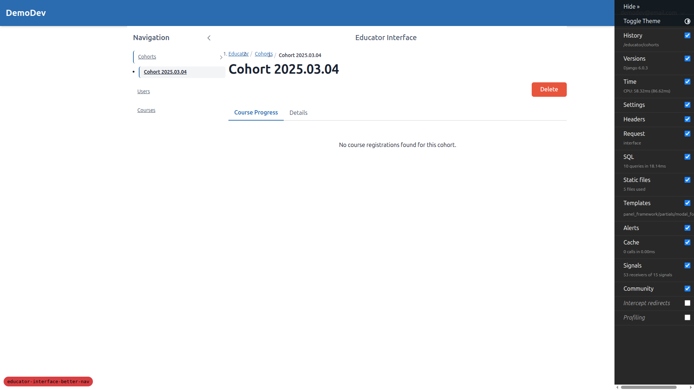

### Test 4: HTMX Navigation (No Full Page Reload) — PASS
- Sidebar links have `hx-get`, `hx-target="#main-content"`, `hx-push-url="true"`, `hx-swap="outerHTML"`
- Table links also use HTMX attributes
- Clicking sidebar items triggers XHR request (confirmed via `htmx:afterRequest` event)
- Page context preserved (no full reload) — verified by tracking variable surviving across navigation
- URL updates correctly via `hx-push-url`

### Test 5: Browser Back/Forward — PASS
- Back from user instance → Users list: URL, breadcrumbs, sidebar all correct
- Back from Users → Cohorts: URL, breadcrumbs, sidebar all correct
- Forward from Cohorts → Users: state restored correctly

### Test 6: Direct URL Visit / Page Refresh — PASS
- Direct visit to `/educator/users/` renders correctly with sidebar highlighting, breadcrumbs, and data table

### Test 7: Sidebar Instance Dropdown — PASS
- On cohort instance page: "Cohorts" section expands showing instance name nested below
- Toggle button has `aria-expanded="true"` when expanded
- Instance link has `aria-current="page"` and active visual treatment
- Clicking "Users" in sidebar: Cohorts section collapses, Users becomes active
- All other toggles show `aria-expanded="false"`

### Test 8: Sidebar Instance Dropdown — Keyboard Navigation — PASS
- Enter/Space toggle the dropdown open/closed
- Escape closes when expanded
- Focus remains on the toggle button throughout all interactions
- `aria-expanded` correctly reflects state at all times

### Test 9: Breadcrumb Navigation via HTMX — PASS
- Clicking "Users" in breadcrumb navigates back to Users list via HTMX
- Sidebar dropdown collapses, URL updates
- Clicking "Educator" navigates to root: breadcrumbs show only "Educator", no sidebar item active

### Test 10: Cross-Section Navigation — PASS
- From cohort instance → Courses (sidebar): Cohorts collapses, Courses becomes active
- Clicking a course: Courses submenu expands with course name, breadcrumbs update correctly
- All transitions via HTMX (no full page reload)

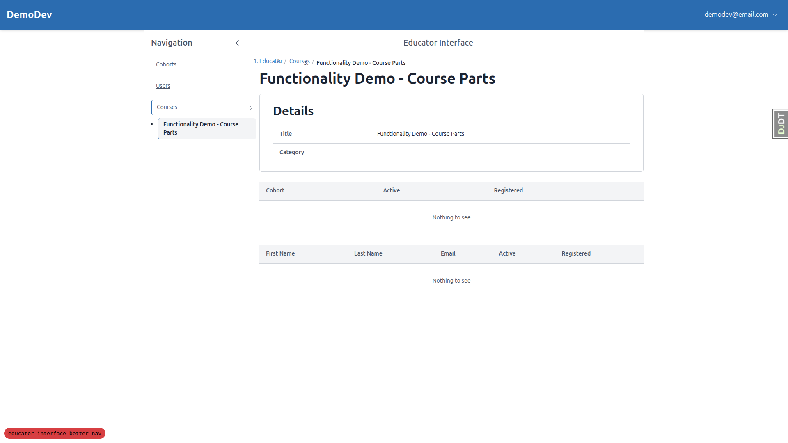

---

## Mobile Tests (375x812)

### Test 11: Mobile Sidebar Behaviour — PASS
- Sidebar hidden by default, opened via hamburger menu button
- Active highlighting works in mobile sidebar
- Instance dropdown works in mobile sidebar (Cohorts expanded with instance name)
- Breadcrumbs visible and correct in main content area
- Clicking a sidebar link closes the sidebar (existing behaviour preserved)
- Table has horizontal scrollbar for overflow — acceptable on mobile

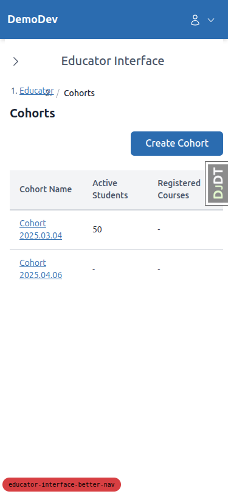
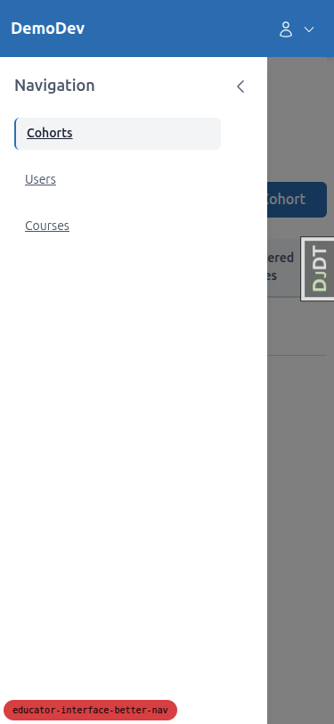
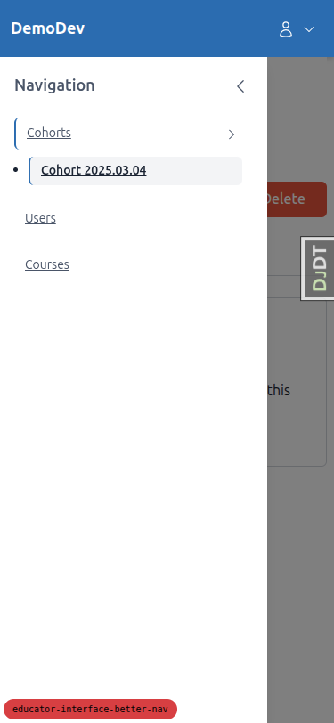
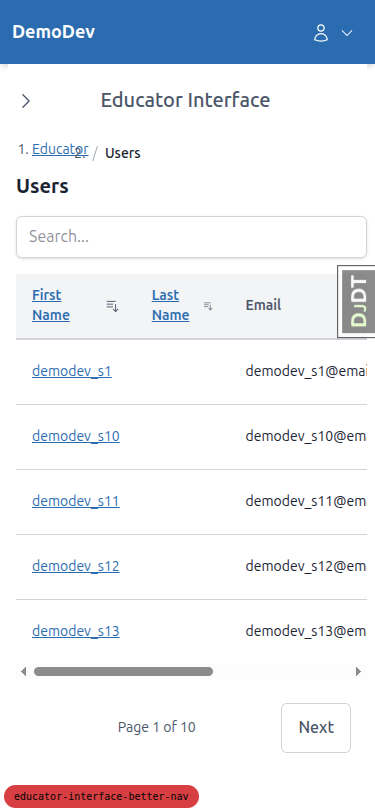

---

## Tablet Tests (768x1024)

### Navigation — PASS
- Tablet uses mobile-style navigation (hamburger menu, sidebar as overlay)
- Sidebar opens/closes correctly
- Content displays properly with sidebar closed — breadcrumbs, tables, and pagination all visible
- Tables adapt well at tablet width (all columns visible without horizontal scroll)

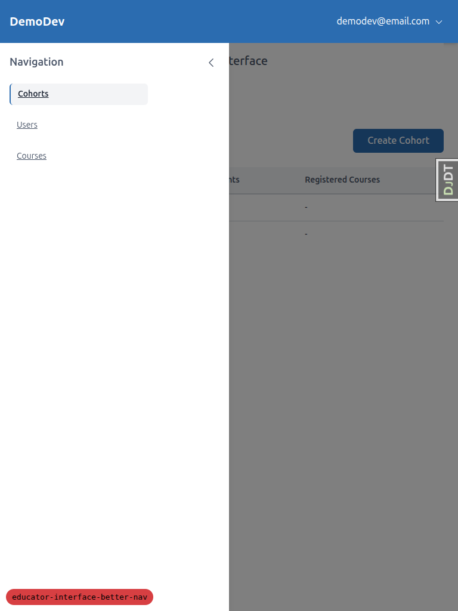
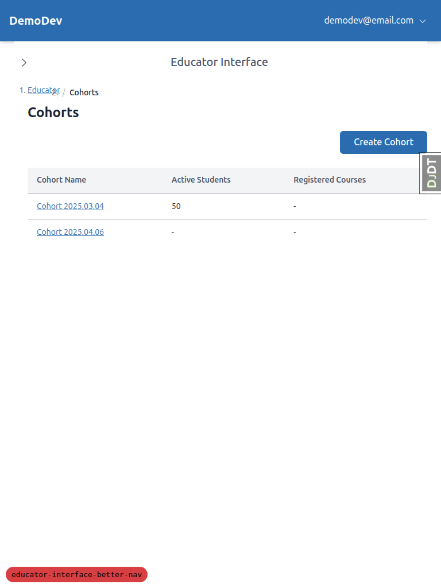
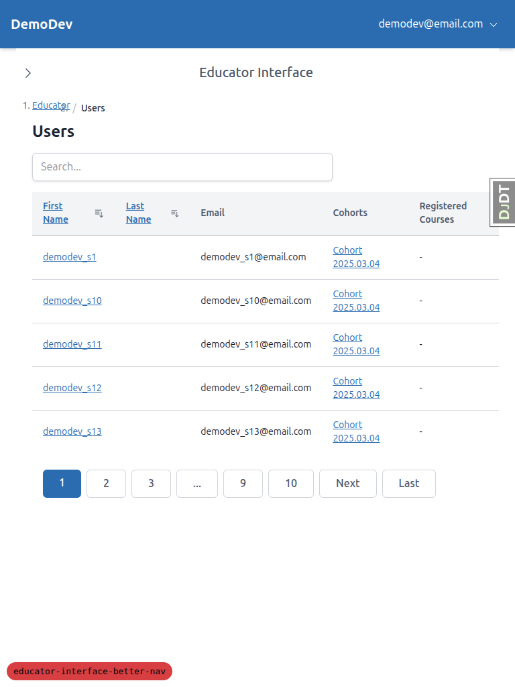

---

## Notes

- **URL path:** The educator interface is at `/educator/` (not `/educator-interface/` as referenced in the test plan). The test plan's URLs were adjusted accordingly.
- **Sidebar on tablet:** At 768px, the tablet gets the mobile navigation pattern (sidebar as overlay, not persistent sidebar). This is a reasonable design choice — the sidebar would crowd the content at this width.
- No issues were found with accessibility attributes, keyboard navigation, or HTMX transitions.
