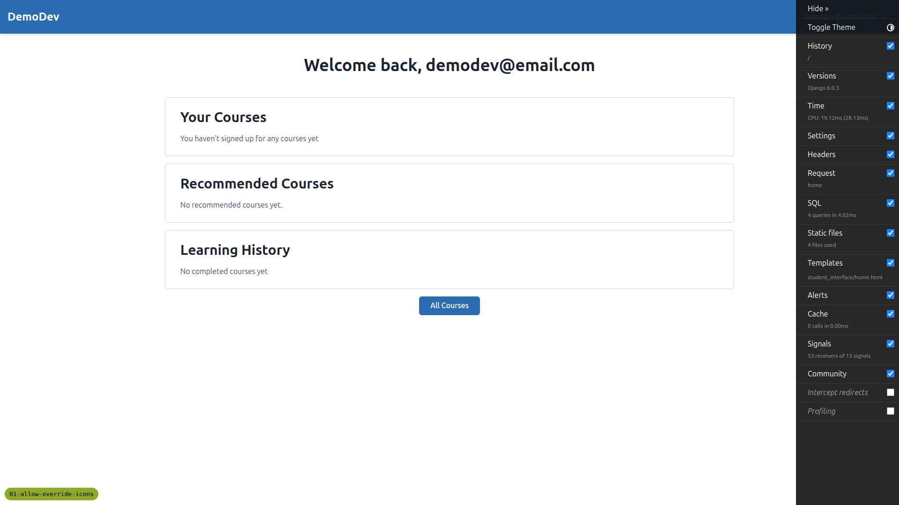
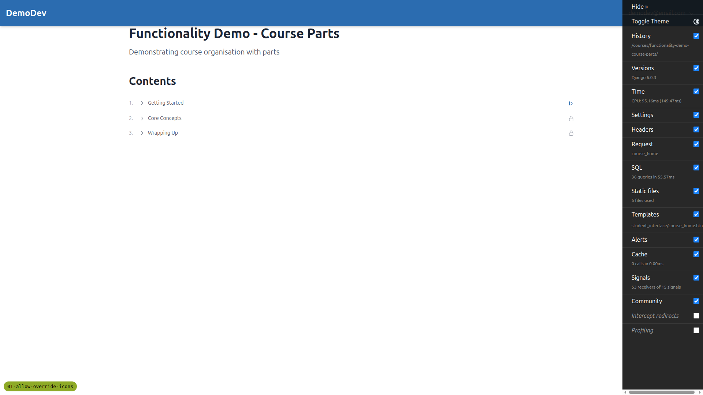
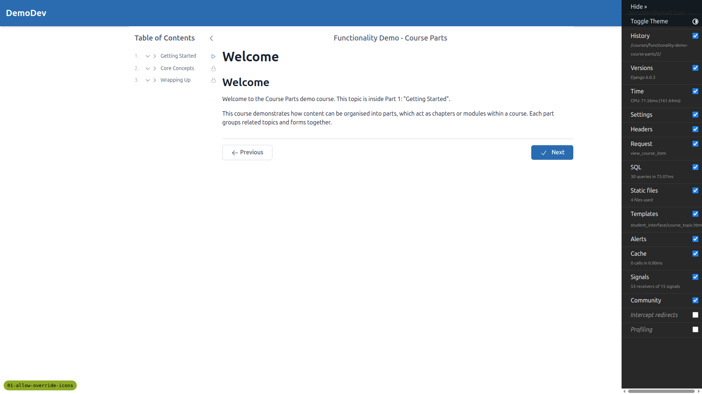
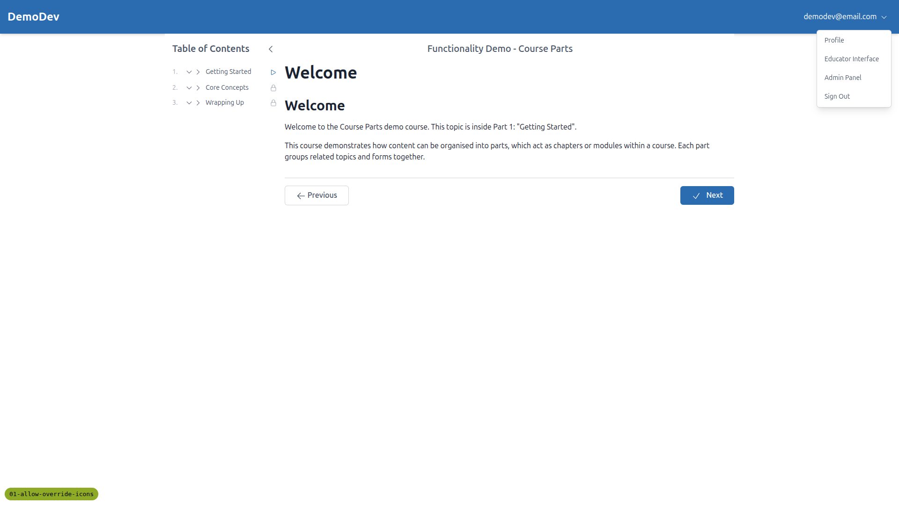
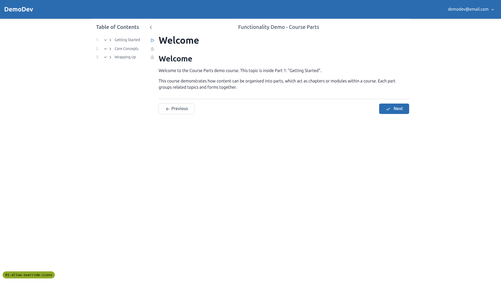
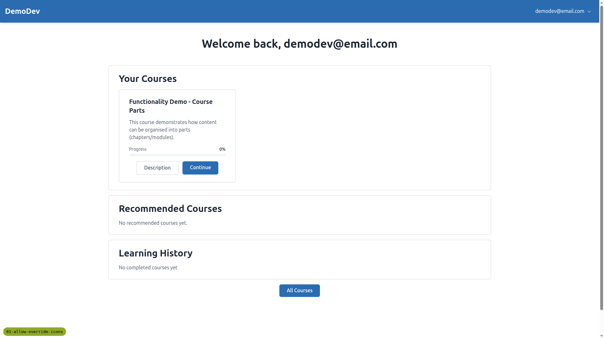
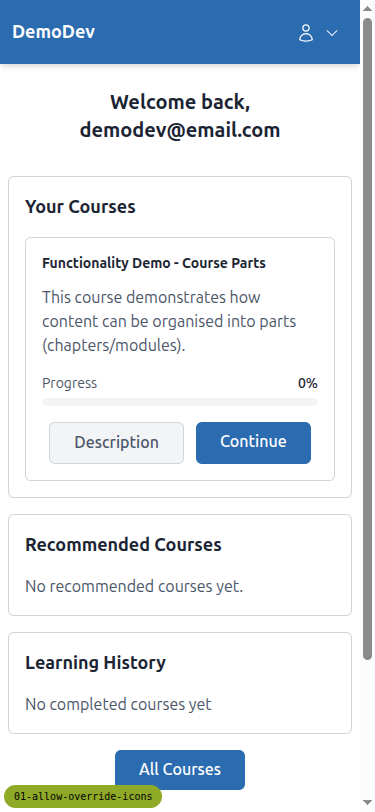
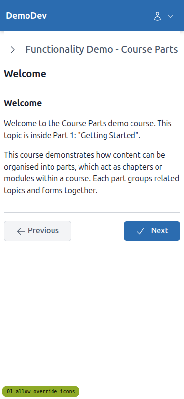
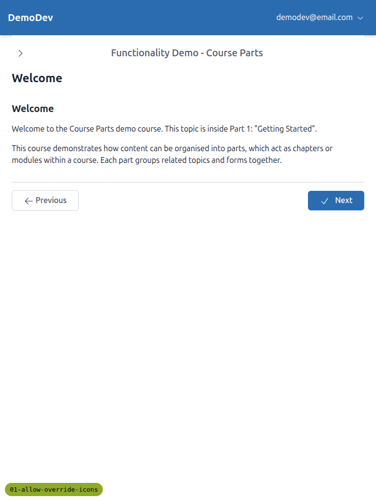

# QA Report - Pluggable Icon Backend

**Date:** 2026-03-31
**Branch:** 01-allow-override-icons
**Tester:** Claude (automated QA)

---

## Summary

All 12 tests **PASSED**. The pluggable icon backend is working correctly across all icon sets, overrides, accessibility, system checks, and cleanup of the old django-heroicons dependency.

---

## Test Results

### Test 1: Default icon set (Heroicons) - PASSED

All icons render as inline `<svg>` elements with correct sizing classes (`size-5` default, `size-4` for smaller icons). Icons verified on the page:
- Header: user, dropdown
- Messages: success, close
- Course TOC: expand, collapse, in_progress, locked, reading, quiz
- Navigation: previous, check (next), menu_close, menu_open
- Loading spinner: loading






### Test 2: Lucide icon set - PASSED

With `FREEDOM_LS_ICON_SET = "lucide"`, all icons render with Lucide's distinctive 2px stroke style. SVG path data confirmed different from Heroicons (e.g., Lucide user: `M19 21v-2a4 4 0 0 0-4-4H9...`). No broken/missing icons.


### Test 3: Tabler icon set - PASSED

With `FREEDOM_LS_ICON_SET = "tabler"`, all icons render with Tabler's style. SVG path data confirmed different (e.g., Tabler user: `M8 7a4 4 0 1 0 8 0a4 4 0 0 0-8 0...`). No broken/missing icons.



### Test 4: Phosphor icon set - PASSED

With `FREEDOM_LS_ICON_SET = "phosphor"`, all icons render with Phosphor's rounded, friendly style. Path data uses 256-unit viewbox values (e.g., `M230.92 212c...`). No broken/missing icons.


### Test 5: Icon overrides with default set - PASSED

With `FREEDOM_LS_ICON_OVERRIDES = {"success": "star"}`, the success icon renders as a star shape (path: `M11.48 3.499a.562.562 0 0 1 1.04 0l2.125 5.111...`) instead of the default check-circle. All other icons unchanged.



### Test 6: Icon overrides with non-default set - PASSED

With `FREEDOM_LS_ICON_SET = "lucide"` and `FREEDOM_LS_ICON_OVERRIDES = {"success": "star"}`:
- Success icon renders as Lucide's star (`M11.525 2.295...`) - different path from Heroicons star, confirming the override uses the active icon set
- User icon renders as Lucide's user (`M19 21v-2a4 4 0 0 0-4-4H9...`) - confirming non-overridden icons use Lucide mapping


### Test 7: Icon accessibility - PASSED

All icons have:
- `role="img"` attribute
- `aria-label` with semantic name (e.g., "success", "user", "dropdown", "close", "loading")

6 out of 9 SVGs on the page had `role="img"` - the 3 without are Django Debug Toolbar theme toggle icons, not application icons.

### Test 8: System check - invalid override - PASSED

```
?: (freedom_ls.E003) Override 'success' -> 'nonexistent-icon-xyz' not found in 'heroicons' Iconify JSON
```

### Test 9: System check - unsupported variant - PASSED

```
?: (freedom_ls.W001) Variant 'solid' is not supported by icon set 'lucide'
    HINT: Available variants: ['outline']
```

### Test 10: System check - missing npm package - PASSED

```
?: (freedom_ls.E001) Iconify JSON file not found for icon set 'lucide'
    HINT: Run: npm install @iconify-json/lucide
```

### Test 11: Force parameter removed - PASSED

- No `force` references in `freedom_ls/icons/` directory
- No `force` in `cotton/icon.html`
- No `force="true"` in any HTML template

### Test 12: django-heroicons fully removed - PASSED

- `heroicons` not in INSTALLED_APPS
- `heroicons` not in pyproject.toml dependencies
- `import heroicons` raises ModuleNotFoundError
- No `` in templates
- No `heroicon_outline`, `heroicon_solid`, etc. in templates

---

## Responsive Testing

### Mobile (375x812) - PASSED

Icons properly sized and visible at mobile viewport. Navigation buttons (Previous/Next) have adequate touch targets. Header icons (user, dropdown) render correctly.




### Tablet (768x1024) - PASSED

Icons render correctly at tablet size. Navigation and layout adapt properly. Dropdown chevron visible in header.



---

## Tangential Issues (Not related to icon feature)

### Alpine.js console errors on course content pages

On the course content page (`/courses/.../2/`), there are 9 JavaScript console errors from Alpine.js CSP build:
- `Undefined variable: coursePart` (3 occurrences)
- `Undefined variable: expanded` (6 occurrences)

These appear to be pre-existing issues with the sidebar TOC Alpine.js integration, not related to the icon changes. They do not prevent icon rendering or page functionality.

---

## Cleanup

All test settings (`FREEDOM_LS_ICON_SET`, `FREEDOM_LS_ICON_OVERRIDES`) were removed from `config/settings_base.py` after testing. The `node_modules/@iconify-json/lucide` directory was restored after Test 10.
