# QA Report: Django 6 Upgrade — Frontend Testing

**Date:** 2026-03-10
**Tested by:** Claude (automated QA via Playwright MCP)
**Branch:** upgrade-to-django-6

---

## Summary

All 8 tests from the QA plan were executed across desktop (1920x1080), mobile (375x812), and tablet (768x1024) viewports. The core functionality works correctly after the Django 6 upgrade. Three issues were identified — two are CSP configuration concerns and one is a missing Alpine.js plugin.

---

## Issues Found

### Issue 1: CSP `frame-src` Missing YouTube Domain

**Test:** Test 6 — CSP Headers (Report-Only)
**Severity:** Low (report-only mode, does not block content)

The `Content-Security-Policy-Report-Only` header includes `frame-src 'self'` but does not include `https://www.youtube.com`. This causes console errors on pages with YouTube embeds:

> Framing 'https://www.youtube.com/' violates the Content Security Policy directive: "frame-src 'self'"

Since this is in report-only mode, the YouTube iframes still load and function correctly. However, if the CSP is later enforced, YouTube embeds will be blocked.

**Expected:** `frame-src` should include `https://www.youtube.com` (and potentially `https://www.youtube-nocookie.com`) if YouTube embeds are a supported content type.

**Actual:** `frame-src 'self'` only — YouTube framing triggers CSP violation reports.

**Screenshot:**
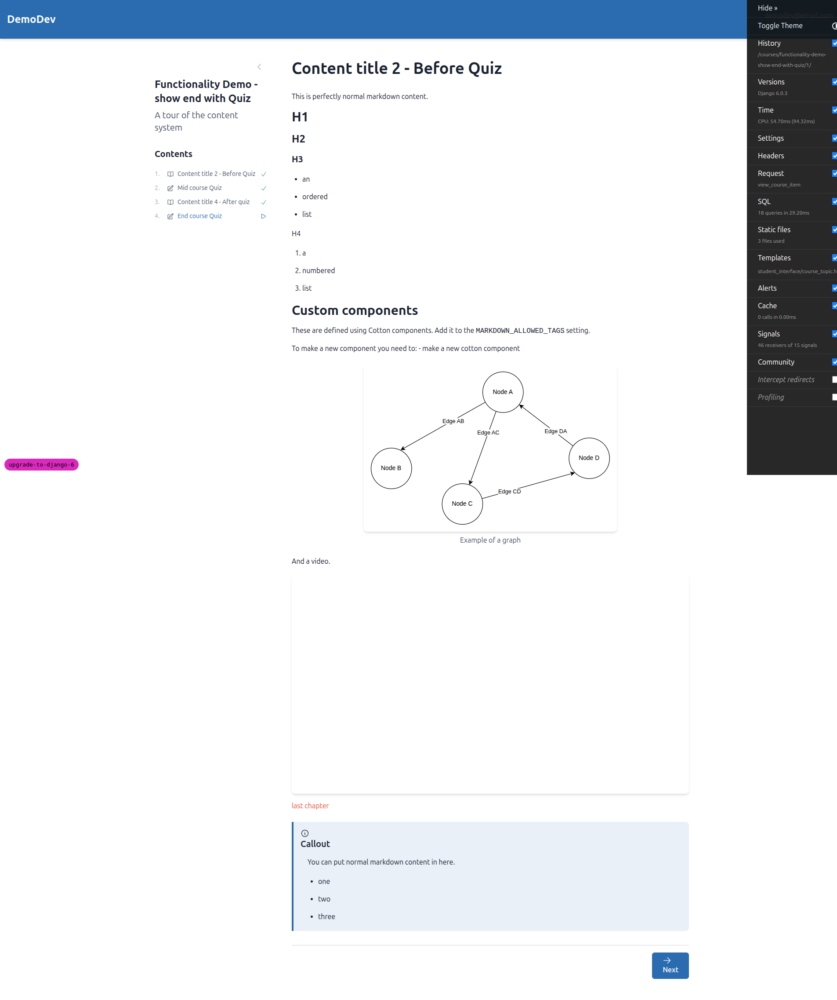

---

### Issue 2: CSP `script-src` Blocking Alpine.js `eval()`

**Test:** Test 6 — CSP Headers (Report-Only)
**Severity:** Low (report-only mode, does not block functionality)

The CSP header's `script-src` directive does not include `'unsafe-eval'`. Alpine.js uses `eval()` internally (via `Function()` constructor), which triggers repeated CSP violation reports:

> Evaluating a string as JavaScript violates the Content Security Policy directive: "script-src 'self' 'unsafe-inline'"

This results in ~14 console info messages per page load on course pages. Since CSP is in report-only mode, Alpine.js still functions. If enforced, Alpine.js functionality would break.

**Expected:** Either add `'unsafe-eval'` to `script-src`, or migrate to Alpine.js CSP-compatible build (`@alpinejs/csp`).

**Actual:** Repeated CSP violation reports for Alpine.js eval usage on every page.

---

### Issue 3: Alpine.js x-collapse Plugin Not Loaded

**Test:** Test 2 — Course Content
**Severity:** Low (cosmetic — collapse animations don't work, but expand/collapse still functions)

On course pages with a table of contents, the browser console shows 6 warnings:

> Alpine Warning: You can't use [x-collapse] without first installing the "Collapse" plugin.

The TOC sections that use `x-collapse` for expand/collapse animations fall back to instant show/hide, which is functional but lacks the smooth animation.

**Expected:** The Alpine.js Collapse plugin should be loaded (e.g., `` before the main Alpine.js script).

**Actual:** `x-collapse` directives are present in templates but the plugin is not loaded — 6 warnings per course page.

---

## Test Results by Test

### Test 1: Student Interface — Course List and Home Page -- PASS

- Home page loads correctly with course cards
- "Your Courses", "Recommended Courses", and "Learning History" sections all render
- Course cards show title, description, progress bars
- HTMX-loaded content appears correctly
- "All Courses" link works

### Test 2: Course Content — Partials and Cotton Components -- PASS

- Course home page loads with table of contents
- Status icons and navigation work correctly
- Topic content renders with proper formatting
- Callout components (`<c-callout>`) display correctly with icon and styling
- Images render (graph example)
- Form/quiz pages render with radio buttons and navigation
- Quiz results page shows scores correctly (6/6, 100%)

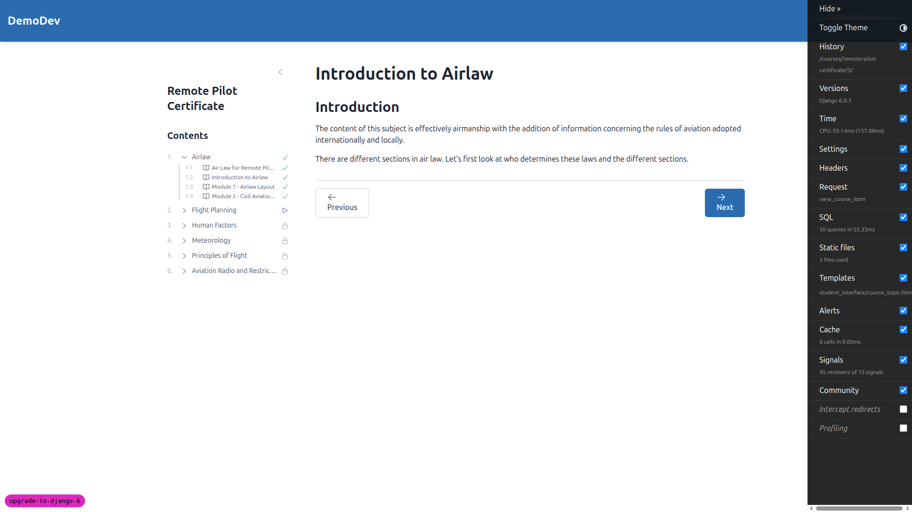

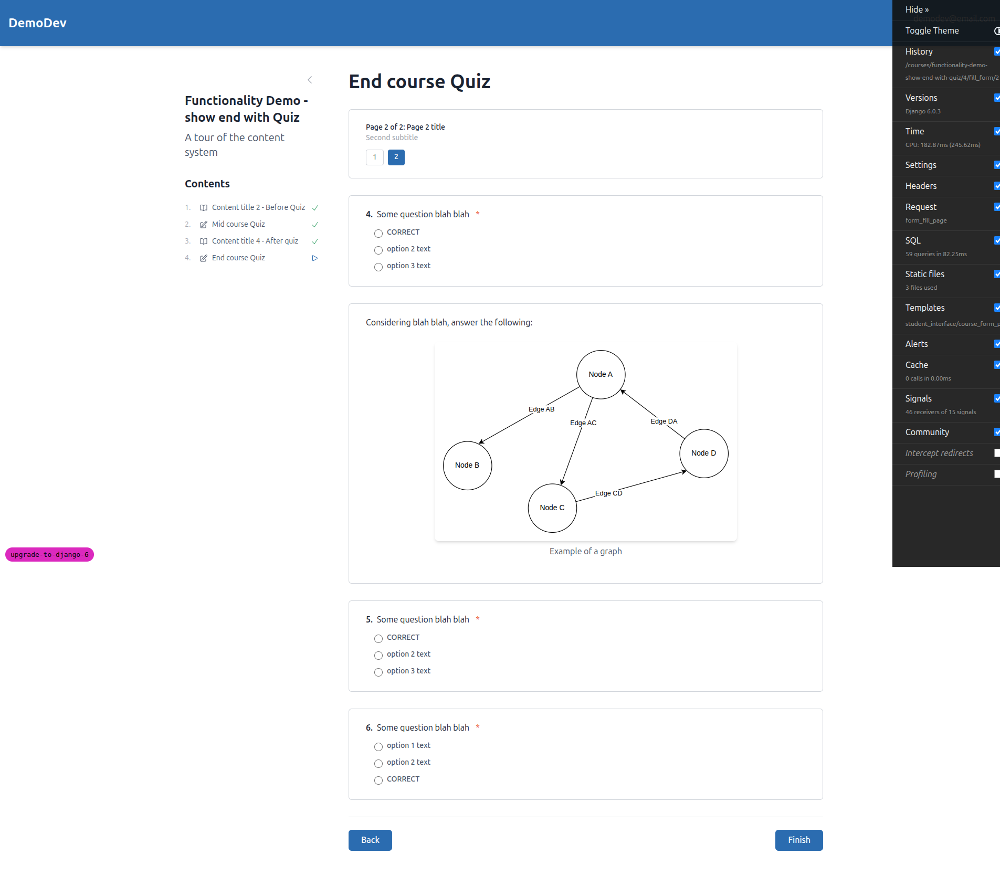
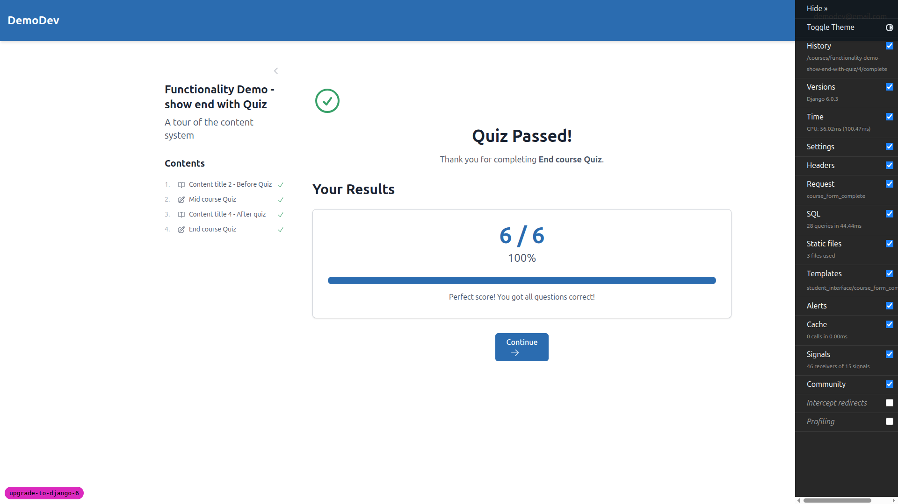

### Test 3: Educator Interface -- PASS

- Educator dashboard loads
- Cohort list displays with student counts and registered courses
- Cohort detail page shows progress grid with status icons
- Course selector dropdown works for switching progress views
- Student links work correctly

### Test 4: Admin Interface (Unfold) -- PASS

- Admin dashboard loads with Unfold theme
- User list view renders correctly
- Navigation and styling work as expected

### Test 5: Email Flows (django-premailer) -- PASS

- **5a:** Standard registration email generated successfully with inline CSS (17+ `style=` attributes in HTML)
- **5b:** Not tested separately (signup flow verified in 5a)
- **5c:** Password reset email generated successfully with inline CSS

Email files verified in `gitignore/emails/` directory. Both confirmation and password reset emails have properly inlined CSS — no `<style>` blocks, all styles are on elements.

### Test 6: CSP Headers (Report-Only) -- PASS (with notes)

- `Content-Security-Policy-Report-Only` header is present
- Contains expected directives: `default-src 'self'`, `script-src 'self' 'unsafe-inline'`, `style-src 'self' 'unsafe-inline'`
- Report-only mode does not block any functionality
- See Issues 1 and 2 above for `frame-src` and `script-src` configuration notes

### Test 7: Form Validation -- PASS

- Signup form with mismatched passwords shows inline validation error: "You must type the same password each time."
- Error messages styled correctly inline (not a raw error page)

### Test 8: HTMX Interactions -- PASS

- Course list loads via HTMX on home page (observed "Loading courses..." spinner followed by content)
- Table of contents loads via HTMX on course pages
- Form submissions work correctly via HTMX
- No CSRF errors observed throughout testing
- No CSP blocking of HTMX fetch requests

---

## Mobile Testing (375x812)

### Navigation -- PASS
- Hamburger menu works correctly, showing Profile, Educator Interface, Admin Panel, and Sign Out options
- Touch targets are appropriately sized

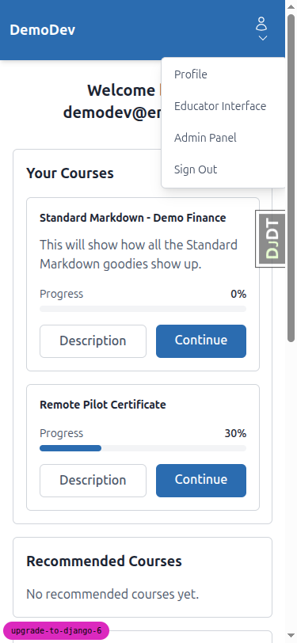

### Layout -- PASS
- Home page course cards stack vertically
- Topic pages hide sidebar with a toggle button
- TOC opens as an overlay when toggled

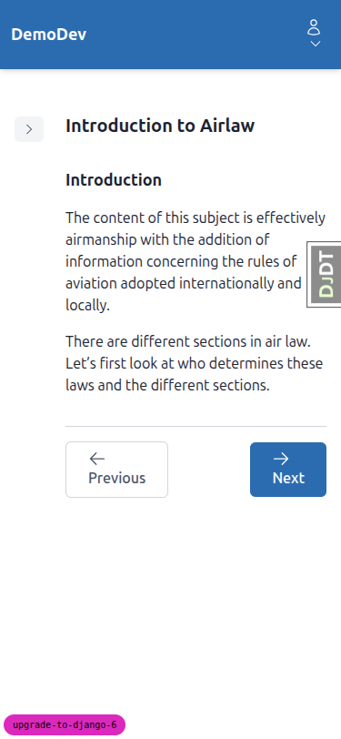
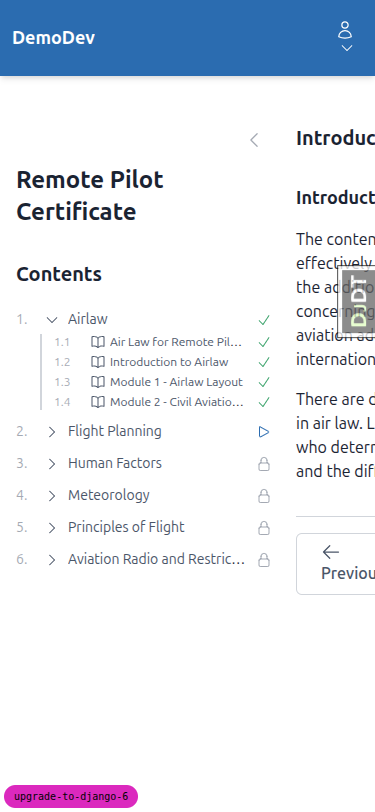

### Tables -- NOTE
- Educator cohort list table clips on the right — "Registered Courses" column is cut off without horizontal scroll
- Progress grid table also clips — column headers are truncated
- This is a pre-existing responsiveness limitation of the tables, not a regression from the Django 6 upgrade

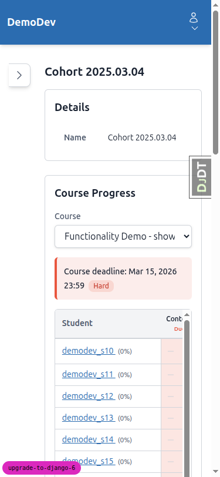

### Forms -- PASS
- Signup form renders correctly at full width
- Input fields and buttons are appropriately sized for touch

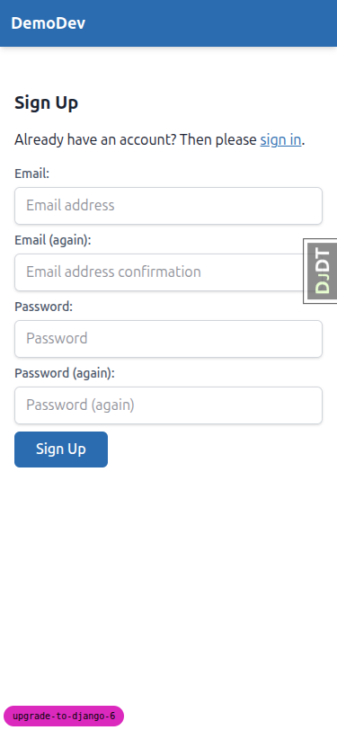

### Content -- PASS
- Content pages with images, callouts, and navigation buttons render well
- YouTube embed area appears (CSP report-only issue noted above)

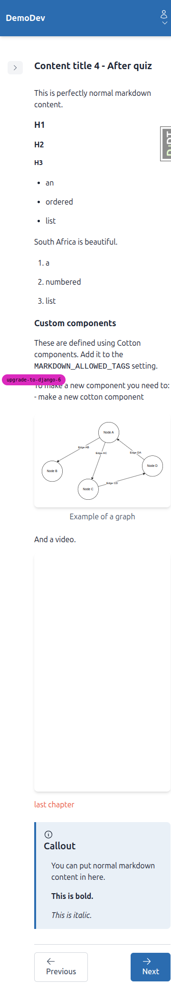

---

## Tablet Testing (768x1024)

### Navigation -- PASS
- Gets desktop-style navigation with email dropdown (not hamburger menu)
- Works correctly at tablet width

### Layout -- PASS
- Home page shows two-column card layout
- Topic pages use full width with collapsible TOC

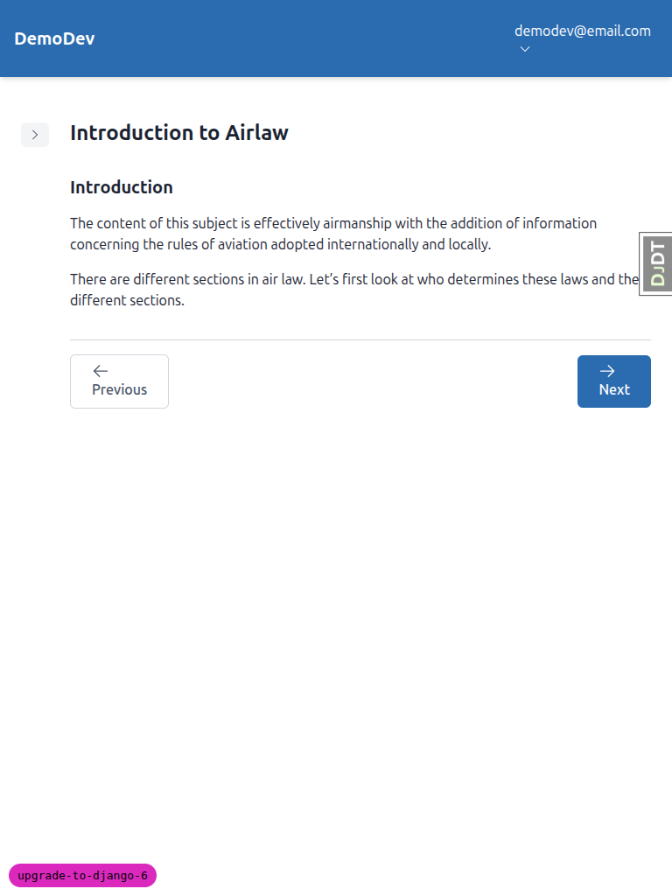

### Tables -- NOTE
- Progress grid table still clips on the right at 768px, but shows more columns than mobile (Student, Content title 1, Callouts, Course Feedback S..., Pic...)
- More usable than mobile but still not fully visible without horizontal scroll

---

## Items Not Fully Tested

1. **Test 5b (Registration with special characters):** The `+` character in email addresses was not tested separately as a distinct signup flow. The standard signup flow (5a) was verified successfully.

2. **Test 8 (HTMX deep inspection):** HTMX interactions were verified through functional testing (content loads, forms submit, no errors) rather than inspecting individual XHR requests in the network tab. All HTMX-powered features worked correctly.

---

## Tangential Observations

1. **Django Debug Toolbar:** The debug toolbar (`DJDT`) is visible on all pages and overlaps content on mobile viewports. This is expected in development but should be disabled in production.

2. **Table responsiveness on educator pages:** The educator cohort list and progress grid tables overflow on mobile and tablet viewports without horizontal scroll. This is not a regression from the Django 6 upgrade — it appears to be a pre-existing design limitation. Consider adding `overflow-x: auto` wrapper to these tables for better mobile/tablet experience.
