# Frontend QA report: allow-course-apply-anon

## Methodology

- Manual walk of the plan (`3. frontend_qa.md`) with the Playwright MCP.
- Viewports: desktop 1920x1080, mobile 375x812 (plus 390 wide for the 429 page), tablet 768x1024.
- A second browser context held the superuser admin. "Fresh browser" means cleared cookies or a new context.
- Screenshots were collected into `screenshots/` beside this report. Every image referenced here exists there.
- The run did not abort.

## Diff scoping

- Class: FULL (75 files changed; `templates/` paths triggered FULL).
- Triggering template files:
  - `freedom_ls/course_applications/templates/course_applications/apply.html`
  - `freedom_ls/course_applications/templates/course_applications/check_your_answers.html`
  - `freedom_ls/course_applications/templates/course_applications/claim_mismatch.html`
  - `freedom_ls/course_applications/templates/course_applications/form_page.html`
  - `freedom_ls/course_applications/templates/course_applications/partials/applicant_email_fields.html`
  - `freedom_ls/form_engine/templates/form_engine/question.html`
- Skipped: nothing.

## Smoke gate

Pass. Pages checked: `/`, `/courses/`, `/admin/freedom_ls_course_applications/courseapplication/`. No failure URL.

## Results

### 1. Anonymous form journey (desktop)

| Test | Viewport | Status | Notes | Screenshot |
|---|---|---|---|---|
| 1.1 | desktop | pass | Apply URL `/applications/apply/<slug>/`, heading "About you", callout text exact (14 days). Page nav: 1 current (not a link), 2 and 3 not links. All blank. No new admin row. | 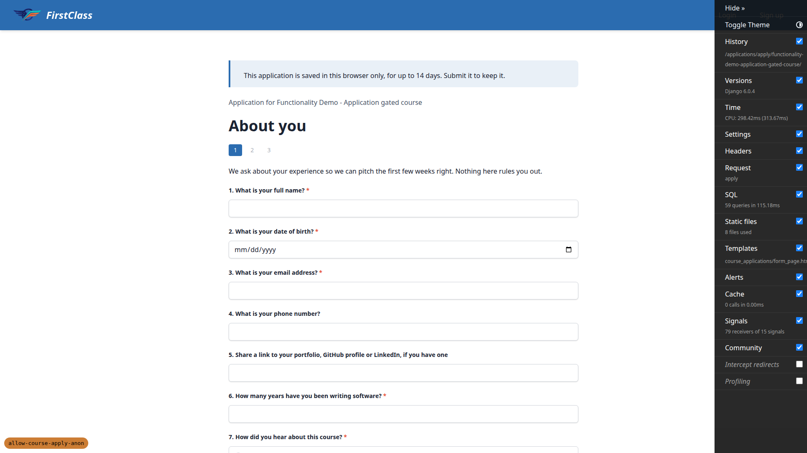 |
| 1.2 | desktop | pass | Browser native `required` validation blocks the submit first. With it bypassed, server returns 422 at the apply URL: "Questions 1, 2, 3, 6 and 7 need answers". Long answer and tick kept. No admin row. | 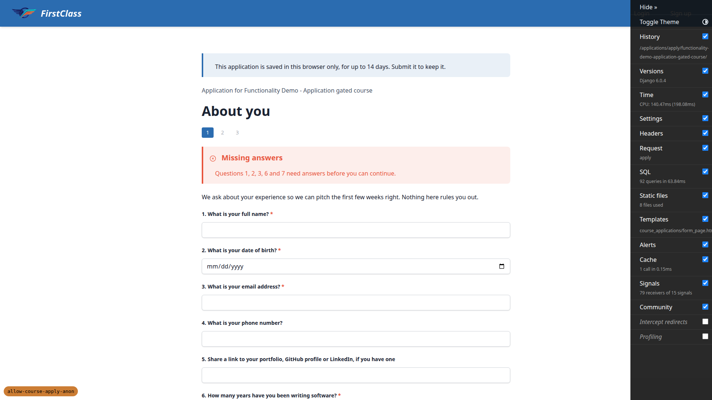 |
| 1.3 | desktop | pass | Next goes to `/applications/application/<uuid>/page/2/` "Supporting documents", callout still shown. Admin row unclaimed and unsubmitted with empty Applicant. Page 1 link shows all answers kept. | none |
| 1.4 | desktop | pass | Upload swaps widget in place (no navigation) to id-scan.png (13.5 KB; source PNG 67 KB) with Download/Replace/Remove. Download returns 200 attachment. Remove shows the exact removed message. Next without a file: 422 "Question 10 needs an answer". Re-attach goes to page 3 Availability. | 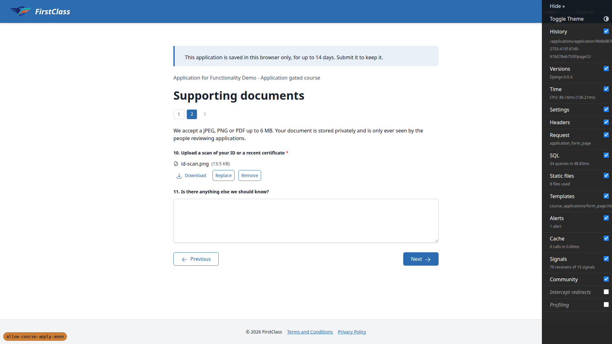 |
| 1.5 | desktop | pass | Check-your-answers lists 3 sections, file Download and callout. Email label and statement exact, with "Read our privacy policy." link. Blank submit: 422 "This field is required.", row unsubmitted. Mixed-case email goes to `/accounts/signup/?email=qa-anon-1%40example.com&next=/applications/claim/`, email prefilled lowercase, toast exact. Admin: email in Applicant, Submitted ticked, Claimed unticked, "Unclaimed: email unverified", answers and file. Mailpit: 0 messages. | 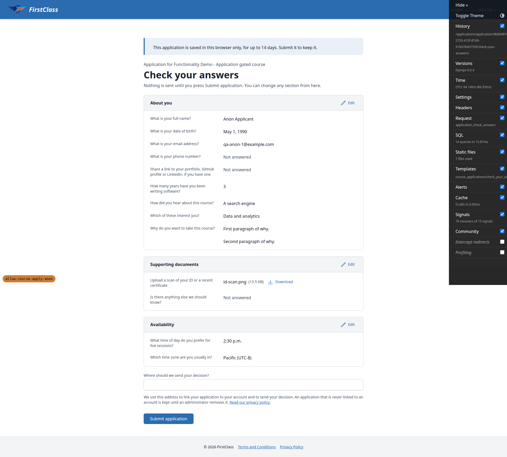 |
| 1.5-signup | desktop | pass | Signup handoff page with prefilled email (toast had auto-dismissed by screenshot time). | 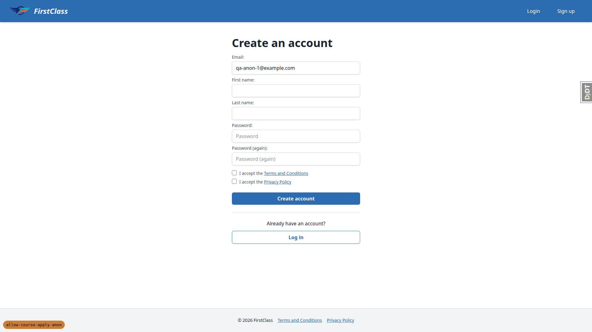 |
| 1.6 | desktop | pass | Apply now again goes to the same signup handoff plus toast, no second row. Check-your-answers renders read-only with submitted callout; "Your application" button goes to the signup handoff. The read-only submitted page still shows the "saved in this browser only... Submit it to keep it." callout (see B1). | none |
| 1.7 | desktop | pass | Signup, then confirm-email page. Confirm link from Mailpit in the same browser goes to `/applications/status/<uuid>/` with "is now on your dashboard" toast. Dashboard "Your applications" lists the course as Pending review. Admin: Applicant email, Claimed ticked, change page links to user 79; Form progress records names the user. Owner download 200 attachment. |  |
| 1.8 | desktop | pass | Signed-in GET `/applications/claim/` goes to dashboard with "We couldn't find an application in this browser."; POST 405; signed out gives 302 to `/accounts/login/?next=/applications/claim/`. | none |

### 2. Course without a form (desktop)

| Test | Viewport | Status | Notes | Screenshot |
|---|---|---|---|---|
| 2.1 | desktop | pass | Apply now shows "Apply to Advanced Product Analytics Masterclass" confirmation with email field, statement, privacy link, Submit application and Cancel. No row created. Blank submit: 422 "This field is required.", no row. | 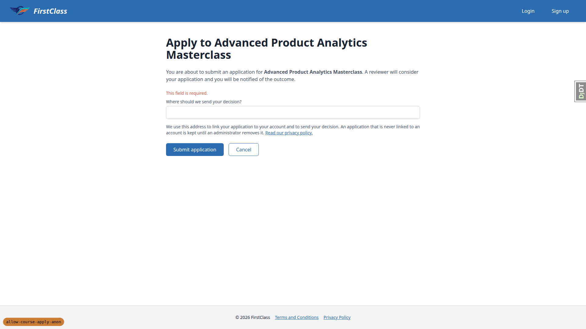 |
| 2.2 | desktop | pass | Submit qa-anon-2 goes to signup handoff with email/next and toast naming the no-form course. One unclaimed submitted row. Apply now again goes to the handoff, no second row. | none |
| 2.3 | desktop | pass | "Log in" switch goes to `/accounts/login/?next=%2Fapplications%2Fclaim%2F`. Login goes to status page with "is now on your dashboard" toast. Admin row claimed. | none |

### 3. Claiming and mismatches (desktop)

| Test | Viewport | Status | Notes | Screenshot |
|---|---|---|---|---|
| 3.1 | desktop | pass | Login as qa.anon.a shows "Link your application" mismatch page: warning callout naming course and qa-anon-3, account email link, stay-signed-in instruction, "Link my application" and "Back to the course". Pressing Link immediately gives the same page, still unclaimed. Add and verify qa-anon-3 in the same browser, then `/applications/claim/`, gives status page and toast; admin change page links user qa.anon.a. After sign out/in: dashboard lists it; apply URL and "View my application" go to its status page. |  |
| 3.2 | desktop | pass | Browser B signup and confirm qa-anon-4 goes to dashboard, no applications panel, row unclaimed; B `/applications/claim/` gives "couldn't find". Browser A login with `next=/applications/claim/` claims it: status page and toast. | none |
| 3.3 | desktop | pass | qa.anon.b signed-in applies (read-only "Your decision will be sent to qa.anon.b@email.com."). Then anonymous apply with same email and login gives status of the FIRST application with "You had already applied to ... This is your application." Anonymous row still unclaimed; `/applications/claim/` again gives "couldn't find". | none |

### 4. Access to unclaimed applications (desktop)

| Test | Viewport | Status | Notes | Screenshot |
|---|---|---|---|---|
| 4 | desktop | pass | Unclaimed application 33c5553a (qa-anon-6, with file bc4f3979): page/1, check-your-answers and `/forms/answer-file/<uuid>/` all 404 (stock DEBUG 404 page, no login redirect), from a sessionless context and from a context signed in as qa.anon.b. `Cache-Control` contains `no-store` and `Referrer-Policy: same-origin` on page 2, check-your-answers and the download. | none |

### 5. Edge courses (desktop)

| Test | Viewport | Status | Notes | Screenshot |
|---|---|---|---|---|
| 5.1 | desktop | pass | Page 1 shows "Save this page to attach a file." with no picker. Next goes to `/applications/application/<uuid>/page/1/?saved=1` with "Your answers are saved. You can now attach your file." above questions, picker present, name kept. Reload without query: no callout. Next without a file: 422 "Question 2 needs an answer". Attach and Next goes to check-your-answers. | 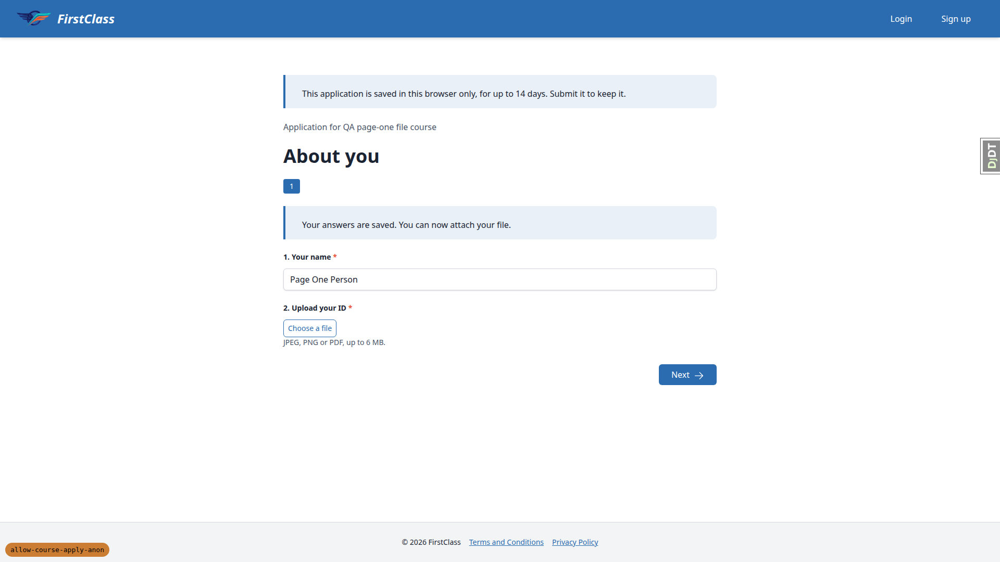 |
| 5.2 | desktop | pass | Anonymous apply URL for page-less course gives 404; signed in as qa.anon.a, Apply now goes to check-your-answers. | none |
| 5.3 | desktop | pass | Hidden course apply URL 404, detail URL 404 (course home `/courses/<slug>/` redirects to login, pre-existing). | none |
| 5.4 | desktop | pass | Form course set coming soon via data helper; anonymous apply URL 302 to course detail (shows Coming soon). Visibility restored to published. | none |

### 6. Signed-in applicant (desktop)

| Test | Viewport | Status | Notes | Screenshot |
|---|---|---|---|---|
| 6 | desktop | pass | Used fresh clean applicant qa.anon.c. Apply now gives page URL of a new draft; no browser-only callout on page 1, 2 or check-your-answers; file widget works. Check-your-answers has no email field, line "Your decision will be sent to qa.anon.c@email.com."; submit goes to dashboard with "... has been submitted and is pending review." toast. No-form confirmation shows the same line; submit goes to status page. Admin rows show qa.anon.c with Claimed ticked. | none |

### 7. Signups closed (desktop)

| Test | Viewport | Status | Notes | Screenshot |
|---|---|---|---|---|
| 7 | desktop | pass | Anonymous apply URL goes to `/accounts/login/?next=/applications/apply/<slug>/`. Signups closed between check-your-answers and submit goes to `/accounts/login/?next=/applications/claim/` with handoff toast, no email in URL. `allow_signups` set back on. Toast still says "Create an account or log in" while signups are closed (see B3). | none |

### 8. Throttles and honeypot (desktop)

| Test | Viewport | Status | Notes | Screenshot |
|---|---|---|---|---|
| 8.1 | desktop | pass | After server restart: 10 anonymous no-form submits from fresh contexts gave signup handoff; 11th gave 429 "You have made too many attempts" with `Retry-After: 3600`. Admin has 10 qa-cap rows. Signed-in qa.anon.b can open a new draft on another gated course straight away. | 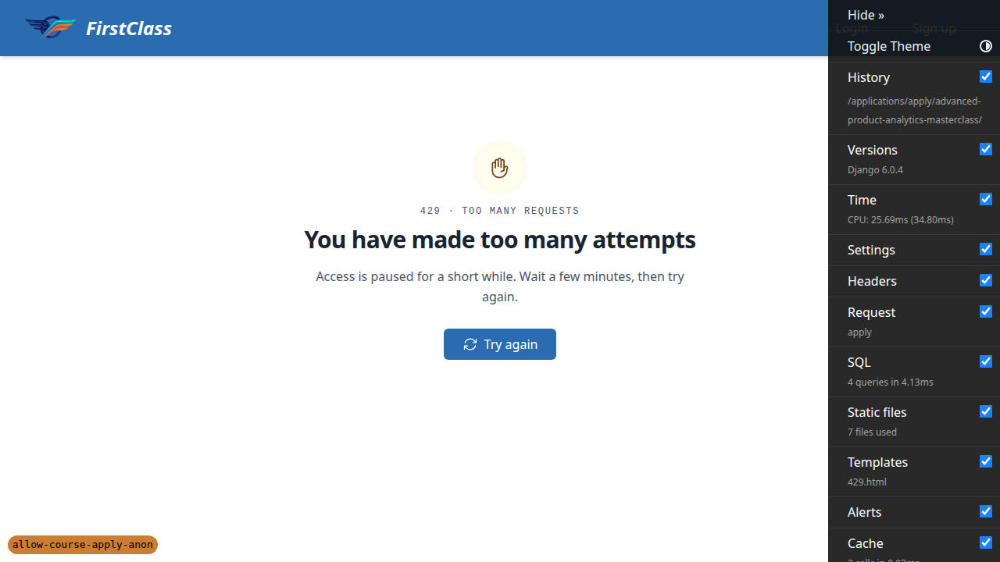 |
| 8.2 | desktop | pass | After another restart: 30 uploads 200, 31st 422. Widget swaps in place to "Too many uploads from your network. Try again in a few minutes." with the previously attached id-scan.png and Download still listed. | 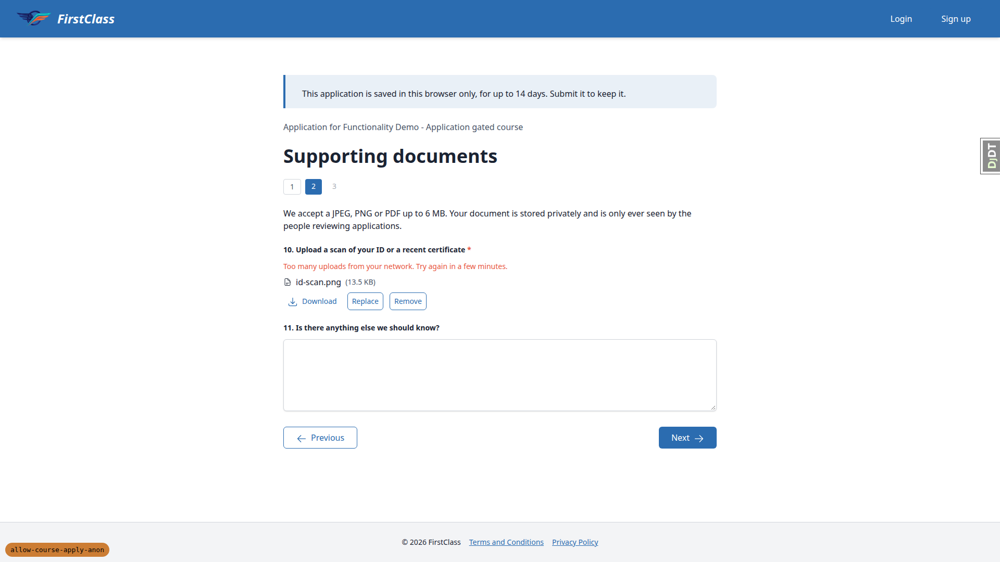 |
| 8.3 | desktop | pass | `fax_number` honeypot (hidden div, tabindex -1, aria-hidden) revealed and filled: submit gives 422 with exact "We couldn't process this application..." form error. Admin row still Submitted unticked, Email "-". | none |

### 9. Admin (desktop)

| Test | Viewport | Status | Notes | Screenshot |
|---|---|---|---|---|
| 9.1 | desktop | fail | Columns render as Applicant, Applicant name, Claimed, Course, Submitted, Submitted time, Created at; spec 5.7, plan slice 4 and test plan put Claimed directly after Applicant (B2). Otherwise pass: unclaimed rows show typed email and "-" name; claimed rows show application email and user name; "By claimed" filter (Claimed/Unclaimed) beside "By submitted" partitions correctly (7/3); search for qa-anon-3 finds the row (now claimed by qa.anon.a per 3.1); qa-anon-6 found unclaimed; no actions dropdown, so no bulk delete. | none |
| 9.2 | desktop | pass | Claimed row: no Delete link, `/delete/` 403. Unclaimed qa-anon-6 row with file: "Delete course application" link, `/delete/` 200. qa_reviewer (view-only staff): no Delete link, `/delete/` 403. | 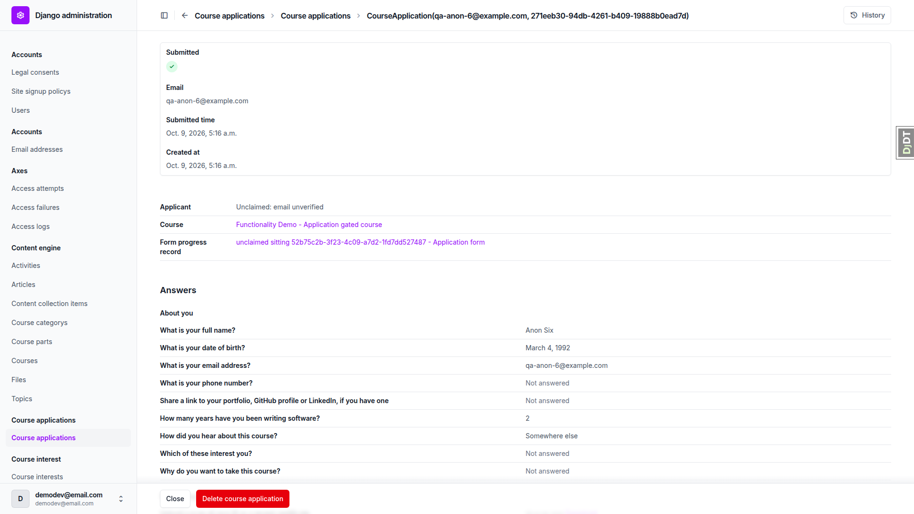 |
| 9.3 | desktop | pass | Confirmation lists application, form progress (unclaimed sitting 52b75c2b), 8 question answers, 2 option links, 1 answer file. After confirm: application, sitting and answer-file rows gone (DB and admin); stored object gone from `media/user_uploads/form_answers/52b75c2b.../` (empty folder remains). Post-delete redirect lands on `/admin/` index rather than the changelist. | 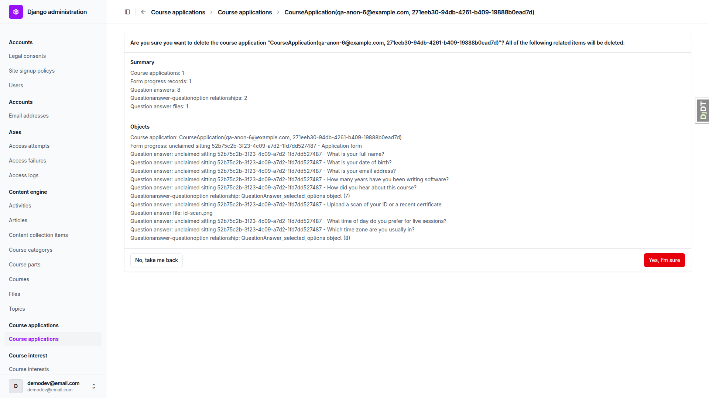 |
| 9.4 | desktop | pass | Form progress records and Question answer files lists render (200) with "Unclaimed" in User/Applicant column; unclaimed sitting change page opens and links to its application. | 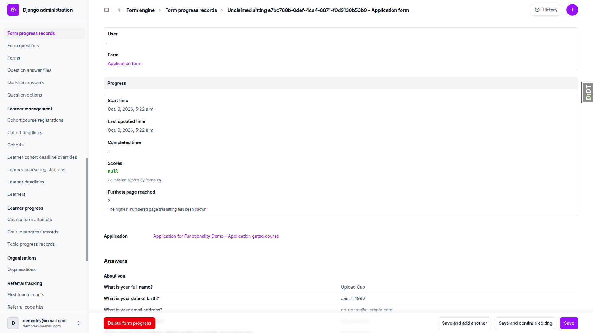 |

### 10. Responsive passes

| Test | Viewport | Status | Notes | Screenshot |
|---|---|---|---|---|
| 10 / 1.1-1.5 | mobile 375x812 | pass | Touch context: course detail, page 1, page 2 (empty and with file), page 3, check-your-answers, signup handoff: document scrollWidth 375 on every page. Callout, page nav, file widget, email field and statement fit. Only targets under 32px tall are inline text links (privacy/terms), acceptable. Header shows Login/Sign up (no hamburger). | 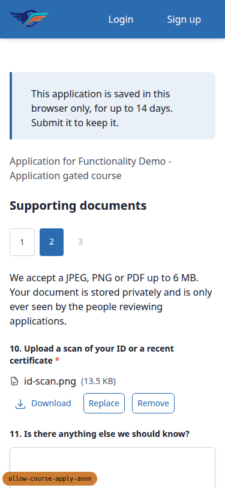 |
| 10 / cya | mobile 375x812 | pass | Full-page check-your-answers: sections stack, Edit links visible, email field, statement, privacy link and Submit fit. | 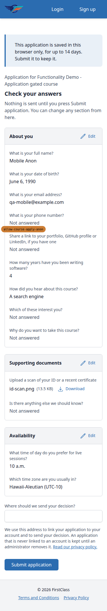 |
| 10 / 3.1 mismatch | mobile 375x812 | pass | Warning callout wraps, buttons stack full-size, no overflow. | 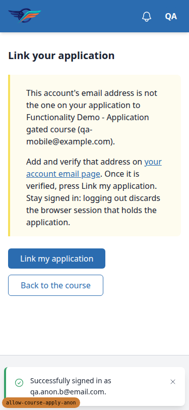 |
| 10 / 8.1 429 | mobile 390 wide | pass | scrollWidth 390, content centred, Try again button fits. | 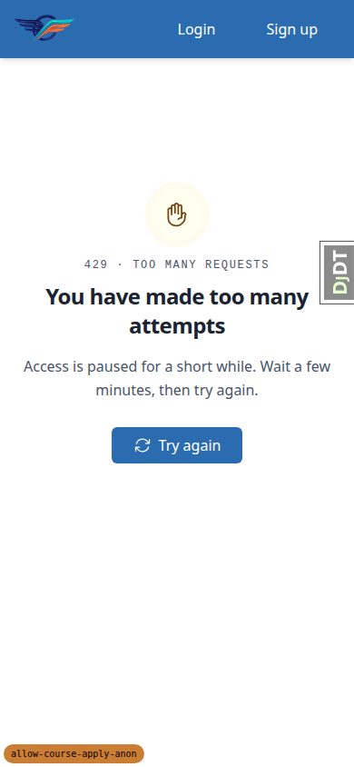 |
| 1.1-1.5, 2.1 | tablet 768x1024 | pass | Desktop-style header (Login/Sign up), page 1, page 2 with file, check-your-answers (full page), signup handoff, no-form confirmation: scrollWidth 768 everywhere, form uses full content width, Previous/Next and Submit/Cancel sized sensibly. | 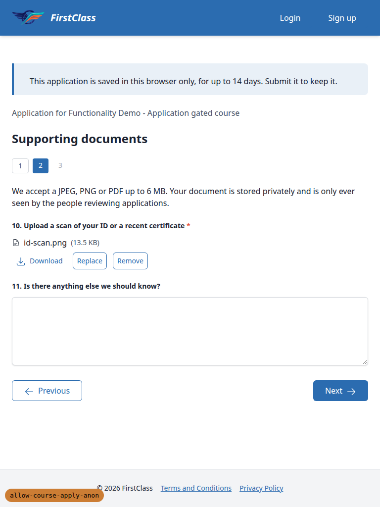 |
| 2.1 | tablet 768x1024 | pass | No-form confirmation: email field, statement, privacy link, Submit application and Cancel fit. | 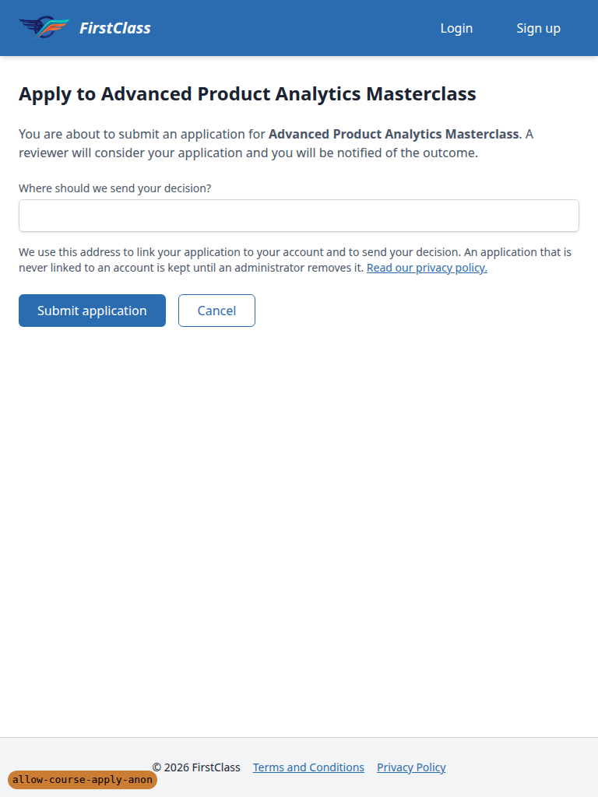 |

Other screenshots collected in `screenshots/` from the mobile and tablet passes:

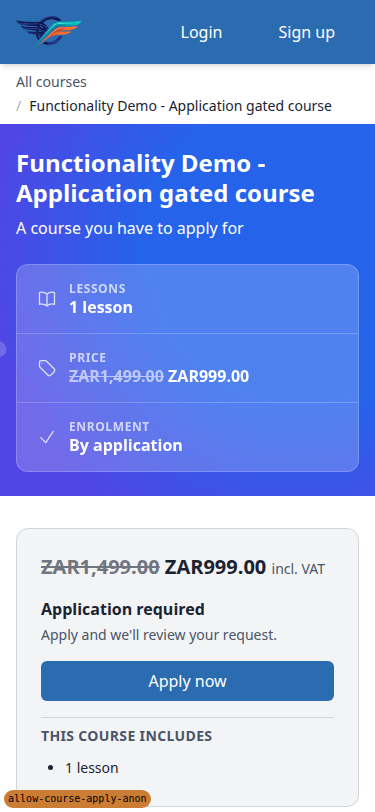
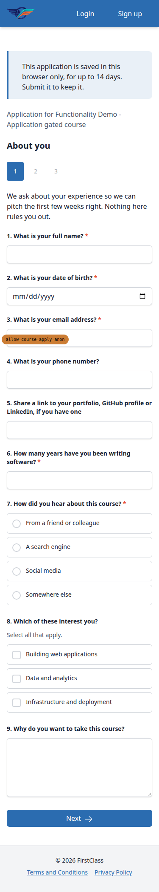
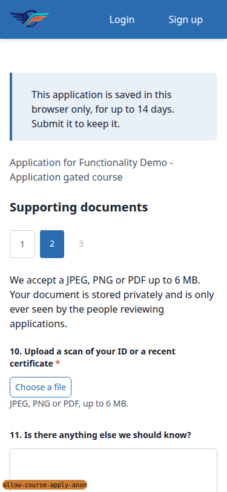
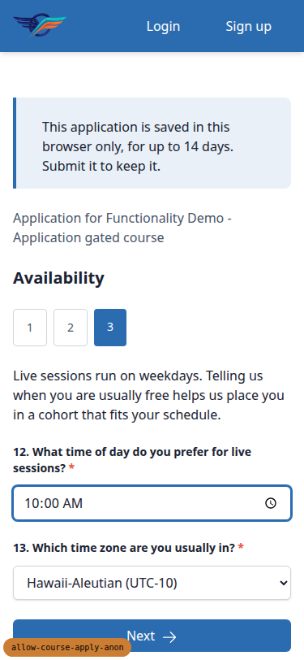
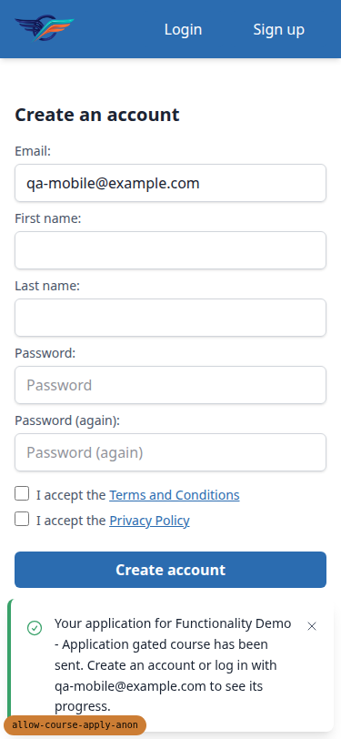
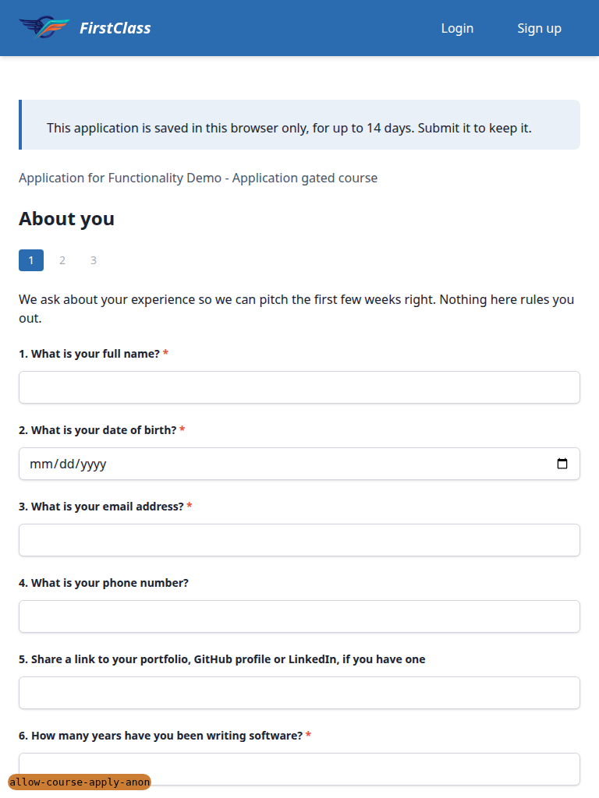
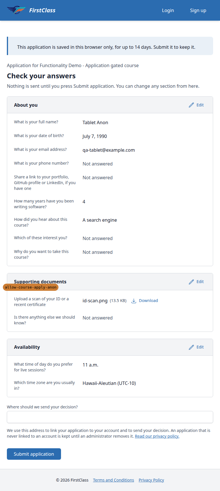
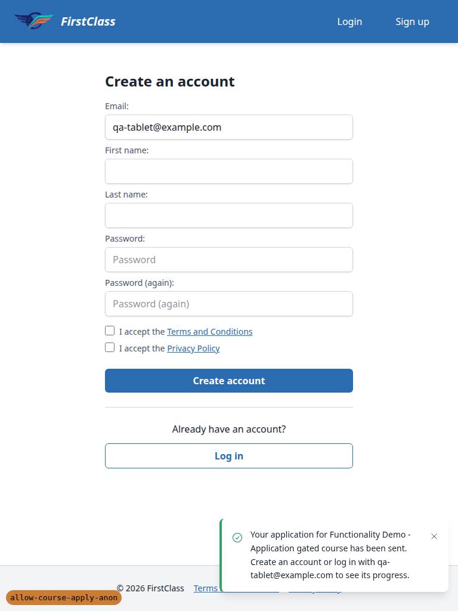

## Design check

No design states tested.

## Bugs

### B1: Submitted anonymous application still says "Submit it to keep it"

- Manifestations: test 1.6, desktop.
- Expected: once the anonymous application is submitted, the read-only check-your-answers page should not tell the visitor to submit it (the application is now held server-side until claimed or removed by an administrator).
- Actual: the read-only check-your-answers page of a submitted, unclaimed application shows the info callout "This application is saved in this browser only, for up to 14 days. Submit it to keep it." directly above "Your application has been submitted. You will hear back once it has been reviewed." The template shows the notice whenever `is_unclaimed`, which matches spec 5.9 and the plan (anonymous form pages and check-your-answers); the post-submit wording is unspecified.
- Screenshots: none.

### B2: Admin "Claimed" column is after "Applicant name" instead of after "Applicant"

- Manifestations: test 9.1, desktop.
- Expected: changelist columns Applicant, Claimed, Applicant name, Course, Submitted, Submitted time, Created (spec 5.7 and plan slice 4: insert `is_claimed` after `applicant_email`).
- Actual: columns are Applicant, Applicant name, Claimed, Course, Submitted, Submitted time, Created at. `list_display` in `freedom_ls/course_applications/admin.py` has `is_claimed` after `applicant_name`.
- Screenshots: none.

### B3: Handoff toast invites "Create an account" when signups are closed

- Manifestations: test 7, desktop.
- Expected: when signups are closed and the visitor is handed to the login page, the toast should not invite them to create an account they cannot create.
- Actual: the toast reads "Your application for ... has been sent. Create an account or log in with qa-anon-5@example.com to see its progress." on the login page with `allow_signups=False`. Spec section 5 defines a single toast for both cases, so the wording for the closed-signup case is a product/copy decision.
- Screenshots: none.

## Bug status

| Bug | Title | Status |
|---|---|---|
| B1 | Submitted anonymous application still says "Submit it to keep it" | **UNRESOLVED** (reason: spec 5.9 shows the notice on anonymous check-your-answers; what, if anything, a submitted unclaimed application should say is a copy decision) |
| B2 | Admin "Claimed" column is after "Applicant name" instead of after "Applicant" | **FIXED** (commit: 4dd4b356). Re-verified: columns now Applicant, Claimed, Applicant name, Course, Submitted, Submitted time, Created at; Form progress records, Question answer files and the application change page still load. 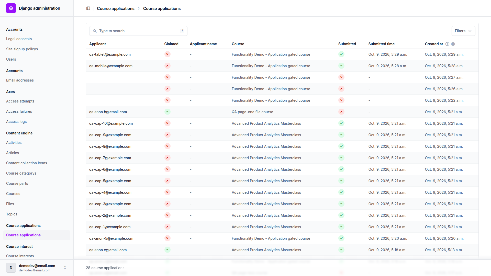 |
| B3 | Handoff toast invites "Create an account" when signups are closed | **UNRESOLVED** (reason: spec defines one handoff toast for both cases; the closed-signup wording is a copy decision) |

## General notes

### (a) Test plan corrections

- Dev `CACHES` is LocMemCache, so `manage.py shell -c cache.clear()` cannot reset the server's throttle counters. Restart runserver instead. This run restarted it before 8.1, 8.2 and the mobile pass.
- qa.anon.a already holds a form-course application after §3.1, so §6 needs a different clean learner. This run used qa.anon.c.
- §9.1 step 3 example `qa-anon-3` is already claimed by then.
- §1.5: `next` is emitted unencoded (`next=/applications/claim/`), semantically equal to the plan's encoded form.
- The demo form's time question has min 09:00 and max 17:00.

### (b) Data set-up

- Fresh DB seeded with `create_demo_data --yes` and `content_save`.
- Edge courses were created by the data helper via the new uncommitted command `freedom_ls/qa_helpers/management/commands/qa_create_anon_apply_edge_courses.py`.
- No `SiteSignupPolicy` row existed, so §7 created one (`allow_signups` re-enabled afterwards, `require_terms_acceptance` on).

### (c) Observations

- Browser native `required` validation stops page submits before the server's 422. The server 422 was verified by bypassing it.
- The uploaded 67 KB PNG is stored as 13.5 KB (re-encoded).
- After deleting an unclaimed application the admin lands on the admin index rather than the changelist (stock Django when `has_change_permission` is False).
- The Django debug toolbar handle intercepts taps at mobile width (dev-only).
- The hidden course's `/courses/<slug>/` home redirects to login (pre-existing).

status: ok
reason: 3 bugs — 1 fixed, 2 unresolved; report rendered, screenshots verified
