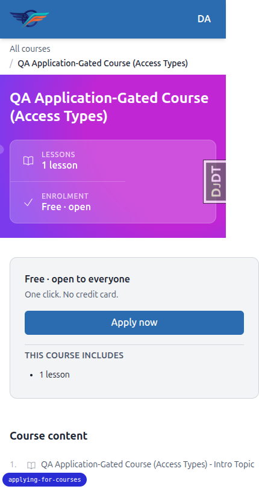
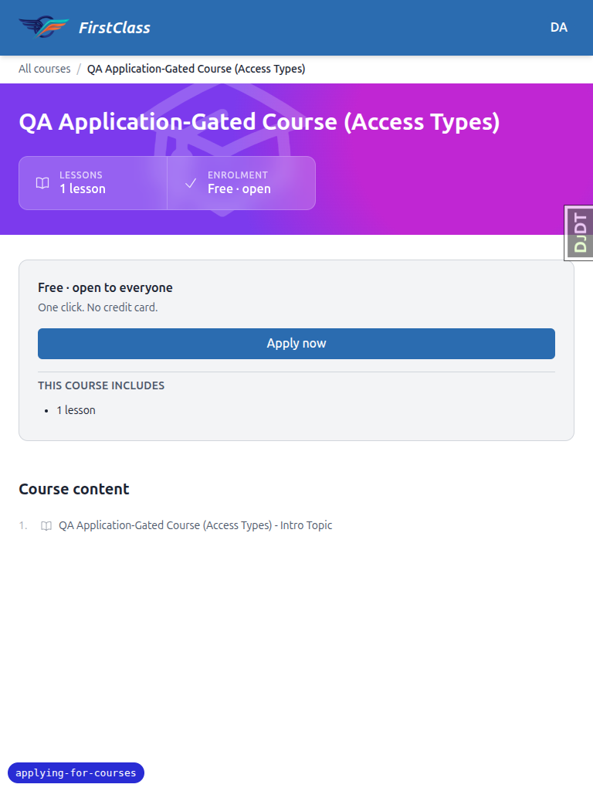
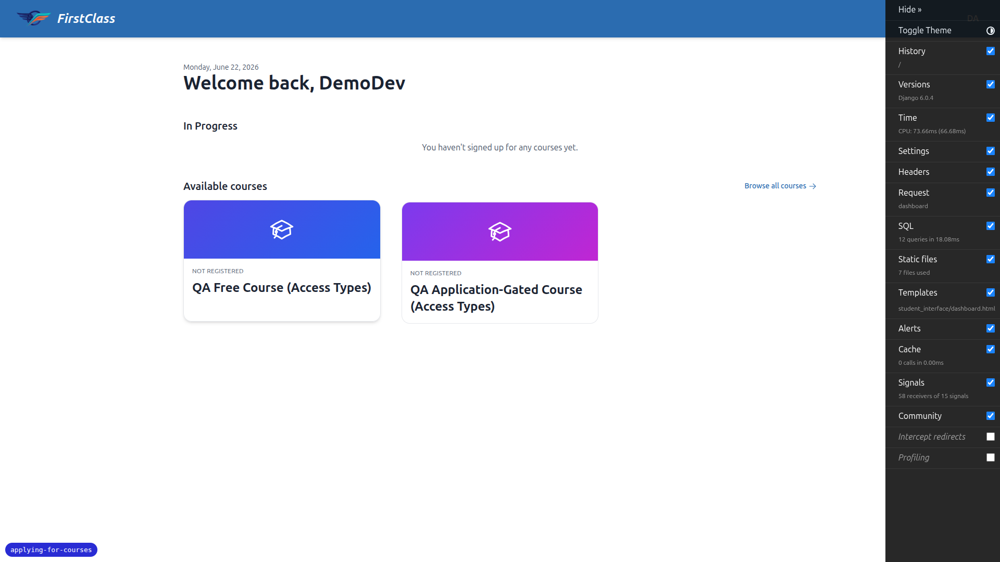
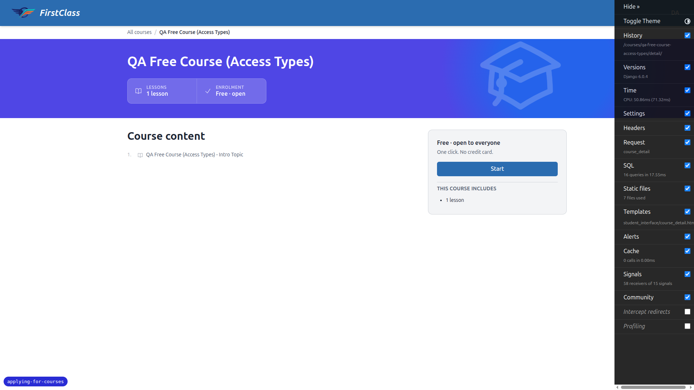
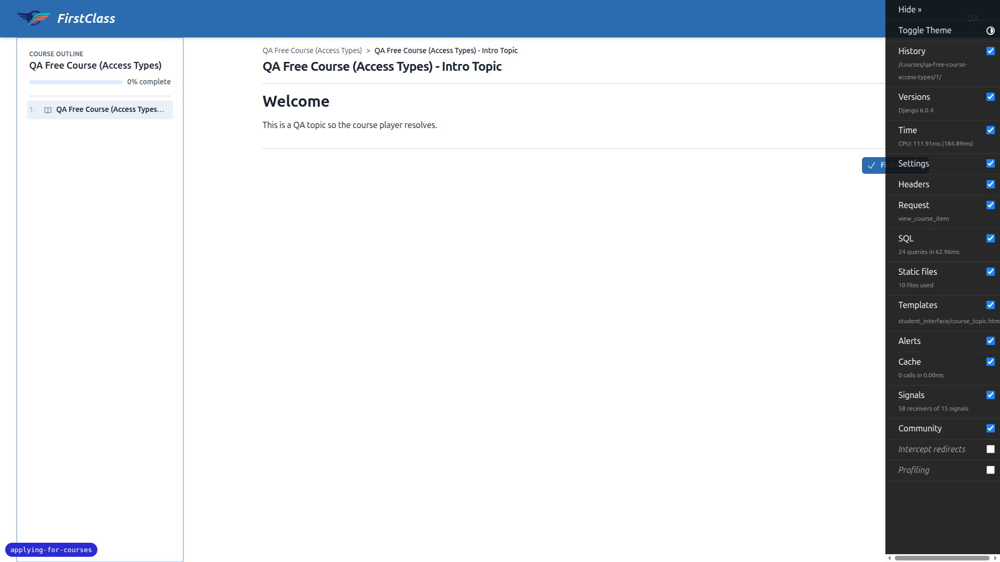
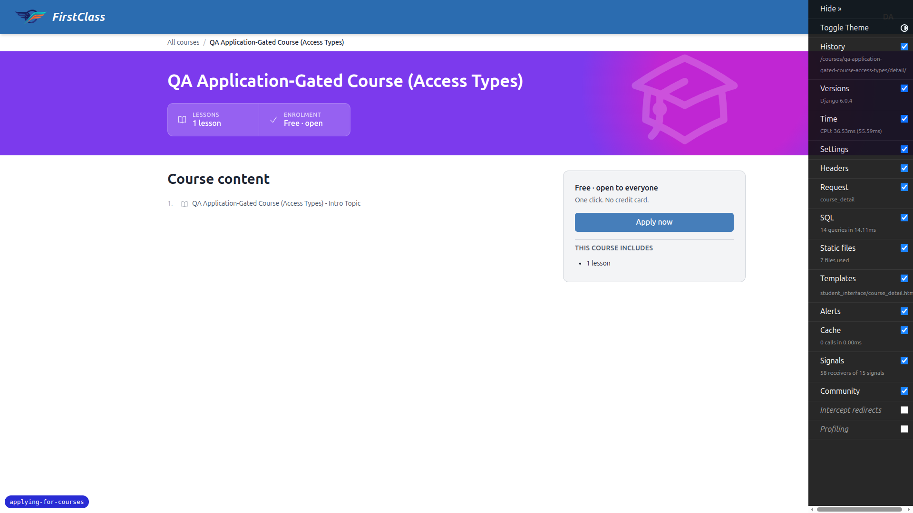
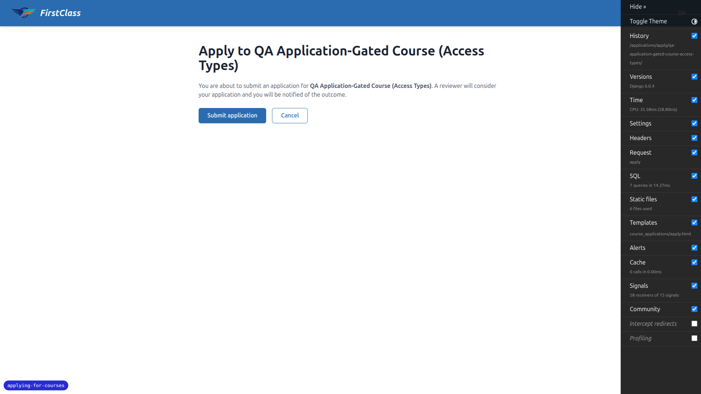
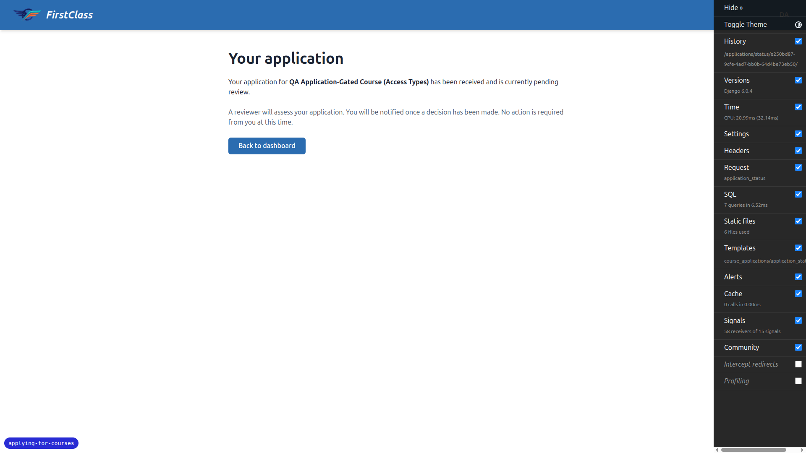
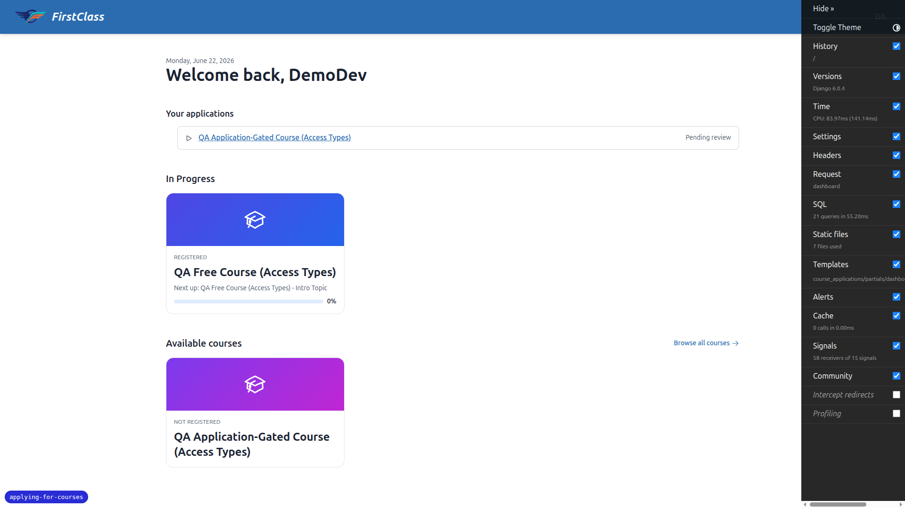
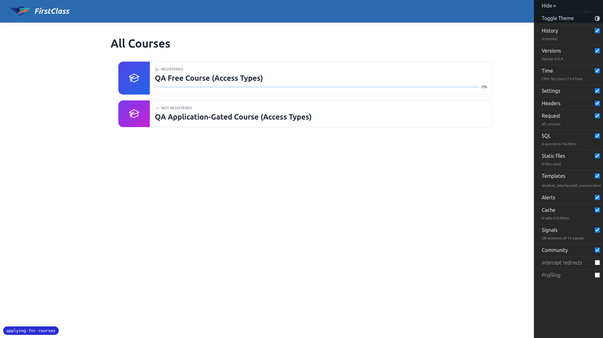

# Frontend QA Report — Course Access Types (Free & Application-Gated)

**Date:** 2026-06-22
**Branch:** `applying-for-courses` (confirmed via debug-branch-badge)
**Site:** DemoDev (dev server forces `FORCE_SITE_NAME = "DemoDev"`; brand header is "FirstClass")
**Tool:** Playwright MCP, desktop 1920×1080 + mobile 375×812 + tablet 768×1024

## Test data (created via `fls:qa-data-helper`)

- Learner `demodev_access_learner@email.com` (verified, zero registrations, zero applications at start).
- Free course `qa-free-course-access-types` — `access_config={"access_type":"free"}`, 1 topic.
- Application-gated course `qa-application-gated-course-access-types` — `access_config={"access_type":"application_gated"}`, 1 topic.

A reusable management command `qa_create_course_access_types DemoDev` was created to reset this scenario.

## Result summary

| Test | Description | Result |
|------|-------------|--------|
| 1 | Free course unchanged — card is plain link, detail CTA "Start", click registers + lands on first item | ✅ Pass |
| 1b | Free-course content requires registration (bare URL + item URL redirect to detail when unregistered; render after registering) | ✅ Pass |
| 2 | Gated course detail shows "Apply now" (card plain link; title/meta visible) | ✅ Pass (CTA correct) — ⚠️ see Bug 1 (surrounding copy) |
| 3 | Self-registration chokepoint enforced server-side (`/register/` → apply; content URL → detail) | ✅ Pass |
| 4 | Applying — confirmation page (no form), submit → status page, re-apply → same status (no duplicate), dashboard lists application | ✅ Pass |
| 8 | Listings unchanged — both courses still listed, none hidden | ✅ Pass |

All explicit test-plan assertions passed. Responsive checks (mobile + tablet) on the gated detail page, dashboard applications panel, and status page showed clean, readable, non-overflowing layouts with full-width touch-friendly CTAs. One content bug and one dev-only observation are recorded below.

---

## Bug 1 — Gated course detail page shows "Free · open" marketing copy next to the "Apply now" CTA

**Related test:** Test 2 (the "Apply now" CTA itself is correct; the *surrounding* funnel copy is not).

**Expected:** On an application-gated course's detail page (the funnel surface this feature introduces), the copy should reflect that the course requires an application — it should not claim the course is free and open with no application step.

**Actual:** The detail page renders, alongside the correct "Apply now" button:
- Enrolment stat card: **"Free · open"**
- Sign-up panel heading: **"Free · open to everyone"**
- Sign-up panel subtext: **"One click. No credit card."**

These three strings are **hardcoded literals** in `freedom_ls/student_interface/templates/student_interface/course_detail.html` (line 101 `stat_value="Free · open"`, line 118 `"Free &middot; open to everyone"`, line 121 `"One click. No credit card."`). Only the CTA label/URL (`{{ cta_label }}` / `{{ start_url }}`) is driven by the access backend; the marketing copy is static and therefore wrong for any non-free access type. The result is self-contradictory on the gated funnel surface: "Apply now" (a reviewed application) sitting under "One click. No credit card."

**Severity:** Cosmetic / content. Functionality is correct (gating, CTA, chokepoint all work) — but the copy misleads applicants. Reproduces identically on desktop, mobile, and tablet.

Desktop:

Mobile:

Tablet:

---

## Passing-test evidence

**Test 1 — free course funnel.** Dashboard cards are plain links to detail; detail CTA reads "Start"; clicking registers and lands on the first item.

**Test 1b — content gate.** Bare course URL and a guessed item URL both 302 to the detail page while unregistered (item content withheld).

**Test 3 — chokepoint.** Hitting the gated `/register/` URL directly redirects to the apply confirmation page (no registration); a gated content URL redirects to the detail page.

**Test 4 — apply flow.** Confirmation page has no form fields; submit lands on the status page ("received and currently pending review"); re-applying returns the same status UUID (no duplicate); dashboard lists the in-flight application linking to its status page.

**Test 8 — listings unchanged.** Both courses remain listed on the all-courses page (free → resume link, gated → detail link); none hidden.

---

## Observations (not bugs in the feature)

- **Django Debug Toolbar overlaps content at narrow widths.** On the 375px mobile viewport the expanded DjDT panel covered the page until collapsed via its "Hide »" control; collapsed, it sits as a small "DjDT" tab on the right edge. This is a dev-only toolbar artifact (not shipped to production) and does not affect the feature. All mobile/tablet screenshots were taken with the toolbar collapsed.

## Not tested / out of scope

- Reviewer actions, the applicant seeing a reviewer message, withdraw, and approval→enrol hand-off are **deferred to the `application-review-ui` spec** (the test plan explicitly excludes them). Nothing here exercises a reviewer.
