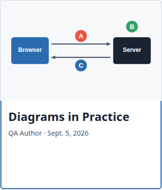
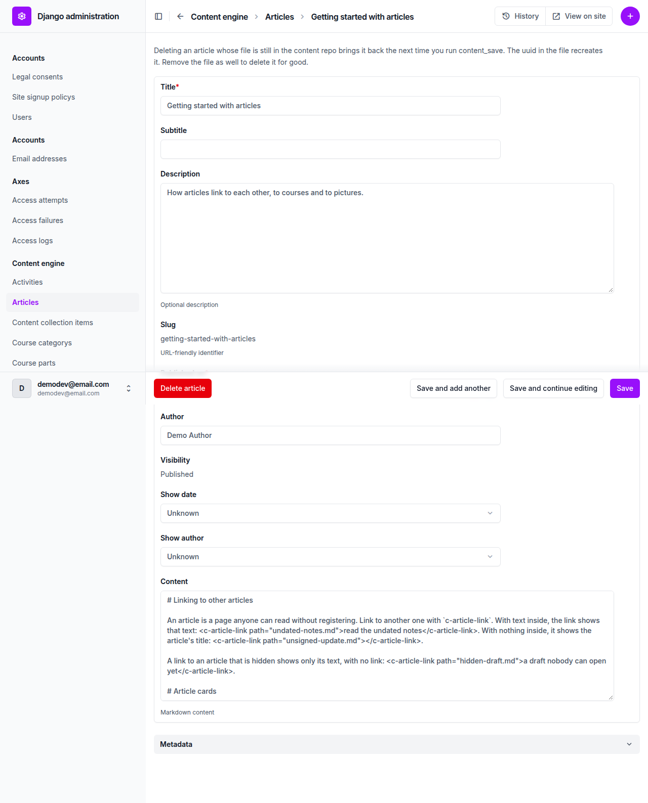
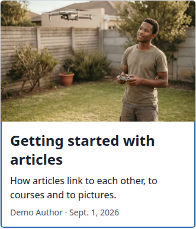

# Frontend QA report: article-images

## Methodology

Manual walk-through of `3. frontend_qa.md` using the Playwright MCP against a local dev server on port 8814. Viewports:

- Desktop 1920x1080 for the functional pass, plus 1280x800 for the design comparison.
- Phone 375x812.
- Tablet 768x1024.

Screenshots are collected in `screenshots/` beside this report. Every image linked below was checked to exist there. Playwright's `.yml` snapshots and console `.log` files also ended up in that directory.

## Diff scoping

- Class: FULL.
- Changed files that triggered it: templates (`blog/article_detail.html`, `blog/article_list.html`, `cotton/article-card.html`), plus `blog/views.py`, the Article model, validator, schema, `content_save`, migration `0007_article_image.py`, demo article markdown, the fls-content plugin schema, and spec docs and design source.
- Nothing was skipped. Desktop, mobile and tablet all ran.

## Smoke gate

Outcome: pass. Pages checked: `http://127.0.0.1:8814/` and `http://127.0.0.1:8814/articles/`.

## Test results

| Test | Viewport | Status | Note | Screenshot |
|---|---|---|---|---|
| 0.2 | n/a | pass | `content_save` succeeded and left demo_content clean. Extra QA articles added. | |
| 1.1-1.5 | desktop | pass | 3-column grid, newest first, draft hidden, 16:10 cover thumbnails, equal row heights, bylines correct. | [shot](screenshots/page-2026-10-04T17-06-07-666Z.png) |
| 1.4 | desktop | pass | Undated card stretched to neighbour height (387px) with title at top. | [shot](screenshots/page-2026-10-04T17-06-31-109Z.png) |
| 1.6 | desktop | pass | Hover causes no layout shift. Stretched link covers the whole card. | |
| 1.7 | desktop | fail | Focus ring is hidden under the thumbnail (see B1). | [shot](screenshots/element-2026-10-04T17-07-13-255Z.png) |
| 2.1-2.2 | desktop | pass | Header image at 2:1 (672x336) between byline and body. | [shot](screenshots/page-2026-10-04T17-07-45-244Z.png) |
| 2.3 | desktop | pass | Undated notes has no image and no placeholder. | [shot](screenshots/page-2026-10-04T17-07-55-565Z.png) |
| 2.4 | desktop | pass | Landscape SVG loads as header image. | [shot](screenshots/page-2026-10-04T17-08-08-236Z.png) |
| 2.6 | desktop | pass | Header img alt matches `image_alt`. | |
| 3.1-3.5 | n/a | pass | og:image absolute with alt, `summary_large_image`. Absent where there is no image (`summary`). | |
| 4.1-4.4, 4.6 | desktop | pass | Row card accent strip, compact card image flush to top, mixed grid equal heights, hidden draft renders nothing. | [shot](screenshots/page-2026-10-04T17-08-20-653Z.png) |
| 4.5 | desktop | pass | Row card with image: 192px image on left, full height. | [shot](screenshots/page-2026-10-04T17-08-55-080Z.png) |
| 4.5 | tablet | pass | Row direction, 192px image. | [shot](screenshots/page-2026-10-04T17-09-03-828Z.png) |
| 4.5 | mobile | pass | Stacked, image 341x213, no horizontal scroll. | [shot](screenshots/page-2026-10-04T17-09-01-354Z.png) |
| 5.1 | n/a | pass | Broken image path reported in the same block shape as a broken widget path. | |
| 5.2 | n/a | pass | Missing `image_alt` fails with a clear message. Cosmetic issues noted below. | |
| 5.3 | n/a | pass | `image_alt: ""` passes validation. | |
| 5.4 | n/a | pass | `category` rejected as not an article field. | |
| 5.5 | desktop | pass | Removing image and alt removes header image and thumbnail. | |
| 6.1 | desktop | fail | Admin form shows no image or image_alt field (see B2). | [shot](screenshots/page-2026-10-04T17-11-01-179Z.png) |
| 6.2 | desktop | pass | Media and Cards topics render with no broken images or errors. | [shot](screenshots/page-2026-10-04T17-14-30-672Z.png), [media](screenshots/page-2026-10-04T17-14-24-726Z.png) |
| 6.3 | n/a | pass | Sitemap lists `/articles/` and 7 published articles, no image entries. | |
| 1.8 | mobile | pass | One column, thumbnails 341x213, no overflow. | [shot](screenshots/page-2026-10-04T17-13-06-076Z.png) |
| 2.5 | mobile | pass | Header image 343x172 (2:1), no horizontal scroll. | [shot](screenshots/page-2026-10-04T17-13-14-112Z.png) |
| 4.7 | mobile | pass | Accent strip hidden, compact image spans card, one column. | [shot](screenshots/page-2026-10-04T17-13-15-255Z.png) |
| 1.8 | tablet | pass | Two columns, equal row heights, 16:10 thumbnails. | [shot](screenshots/page-2026-10-04T17-13-23-294Z.png) |
| 2.x, 4.2-4.4 | tablet | pass | Header image 2:1 at 672px, strip kept, mixed grid two columns. | [shot](screenshots/page-2026-10-04T17-13-37-276Z.png) |
| 1.9 | desktop | pass | Empty state shows H1 and "No articles yet" with no grid. | [shot](screenshots/page-2026-10-04T17-14-56-250Z.png) |

## Design check

| Test | Viewport | This run | Design | Result |
|---|---|---|---|---|
| 1-design | desktop (1280x800) | [shot](screenshots/page-2026-10-04T17-07-36-760Z.png) | [Blog__1280.png](design_screenshots/Blog__1280.png) | pass |
| 1-design | mobile (375x812) | [shot](screenshots/page-2026-10-04T17-12-55-589Z.png) | [Blog__375.png](design_screenshots/Blog__375.png) | pass |

## Bugs

### B1: Article card focus ring is hidden under the thumbnail

Manifestations: 1.7 (desktop). The component is shared, so it applies at every viewport.

- Expected: tabbing to a card on `/articles/` shows a focus ring around the whole card, thumbnail included, not clipped.
- Actual: `freedom_ls/content_engine/templates/cotton/article-card.html` puts `focus-within:ring-2 ring-inset` on the `<article>`. An inset box-shadow paints beneath the children, so the thumbnail `` (and on the row variant, the accent strip) covers it. The ring shows only around the text area below the thumbnail.

### B2: Article admin form does not show image or image_alt

Manifestations: 6.1 (desktop).

- Expected: opening "Getting started with articles" in the Articles admin shows the stored image path and `image_alt`. Nothing else in the form changes.
- Actual: `ArticleAdmin.fieldsets` in `freedom_ls/content_engine/admin.py` lists title, subtitle, description, slug, published_on, author, visibility, show_date, show_author, content, plus Metadata (meta, tags). `image` and `image_alt` are not listed.

## Bug status

- **UNRESOLVED**: B1, Article card focus ring is hidden under the thumbnail. Reason: the fixer's Playwright test passed before any fix, so it reported the bug as not reproducible and committed nothing. QA re-checked on the live server at 1280x800 after Tab focus. Pixels at the card's left edge are the ring colour (43,108,176) beside the text area but image colours along every thumbnail row, so the ring is not drawn over the image. Screenshot: `screenshots/element-2026-10-04T17-36-53-168Z.png`. The run allows one fix attempt per bug.
- **FIXED**: B2, Article admin form does not show image or image_alt. `image` and `image_alt` are now in `ArticleAdmin.fieldsets`, covered by `test_the_article_change_page_shows_the_image_fields`.

## General notes

1. A rebase onto main ran before QA: 13 commits replayed, one add/add conflict in `freedom_ls/content_engine/tests/test_validate.py` resolved by keeping both test sets. The lost-change check was reviewed and found benign. The rebase's own front-end smoke check was folded into this run, which visits the same pages at the same three viewports.
2. The design comparison ran at 1280x800 and 375x812 per section 0 of the plan. The general desktop functional pass ran at 1920x1080.
3. The "index H1 is the blog name" design line passes. `blog_name` renders "Articles"; the design's "Blog" is its own sample name.
4. Validator 5.2 message is correct but cosmetically rough. "Field:" is blank and "Given value:" dumps the whole parsed front matter and article body.
5. `/sitemap.xml` locs use `http://127.0.0.1/` with no port, from the Site domain. Sitemap code is not touched by this branch.
6. Residue articles "Diagrams in Practice" and "Square Thinking" from an earlier QA run were present during the grid tests. `danger_content_delete` in 1.9 removed them and the extra QA articles. Demo content was reloaded afterwards.
7. Card hover has no visual change on the title (no underline or colour). The plan only asked that hover not shift layout, which holds.
8. The screenshots directory also contains Playwright `.yml` snapshots and console `.log` files.

status: ok · reason: 2 bugs, 0 fixed, 2 unresolved; report rendered, screenshots verified
