# QA report — Cohort progress PDF report (report generation)

**Plan:** `frontend_qa_report_generation.md`
**Run date:** 17 August 2026
**Branch:** `basic_reports` (debug-branch-badge confirmed)
**Server:** `uv run python manage.py runserver 8404`, driven through Playwright MCP at 1920×1080
**Setup:** `npm run tailwind_build` ✅, `manage.py migrate` ✅ (no migrations pending),
`uv run manage.py qa_create_report_fixtures --reset` ✅ (all ten fixtures + both permission users)

Desktop only, as the plan directs — every surface here is the Django admin or a PDF.

## Verdict

**3 bugs found.** All ten matrix fixtures generated successfully and the report reads correctly end to
end: the generate flow, permissions, every failure branch and every system check pass. The three
findings are one content bug (a learner class renders an empty section), one styling bug (completion
bar track invisible on banded rows) and one **sign-off blocker for QA 7** — the landscape column
budget is one column too generous and must be lowered from 11 to 10.

| Section | Result |
|---|---|
| QA 0 — build fixture matrix, capture artifacts | ✅ 10/10 fixtures, all `ready` |
| QA 1 — generate end to end | ✅ |
| QA 2 — read the PDF | ⚠️ 2.5 fails (Bug 1); 2.1–2.4, 2.6–2.11 pass |
| QA 3 — page breaks and running headers | ⚠️ passes; Bug 2 surfaces in these tables |
| QA 4 — at-risk flag consistency | ✅ |
| QA 5 — cohort quiz confusions | ✅ |
| QA 6 — greyscale print | ⚠️ 6.2–6.6 pass on greyscale raster; 6.1 (real printer) not run — see *Not executed* |
| QA 7 — landscape column budget | ❌ **Bug 3** — budget is 10, not 11 |
| QA 8 — permissions and access control | ✅ |
| QA 9 — failure branches | ✅ |
| QA 10 — deletion and system checks | ✅ |

---

# Bugs

## Bug 1 — A learner who opened items but completed none gets a completely empty detail section

**Test:** QA 2.5 — *"learners with no activity … must show an explicit **"No activity recorded"** line,
not be omitted."*

**Expected:** every learner at 0% shows an explicit "No activity recorded." line in their own section.

**Actual:** only learners with **zero progress rows at all** get the line. A learner who *opened* a
topic but completed nothing renders a section with a heading, a "No flags" line, a 0% completion bar
— and then nothing. The rest of the page is blank.

Correct branch (Ines Ferreira, p. 10 of `standard-cohort-medium-course.pdf` — no progress rows):

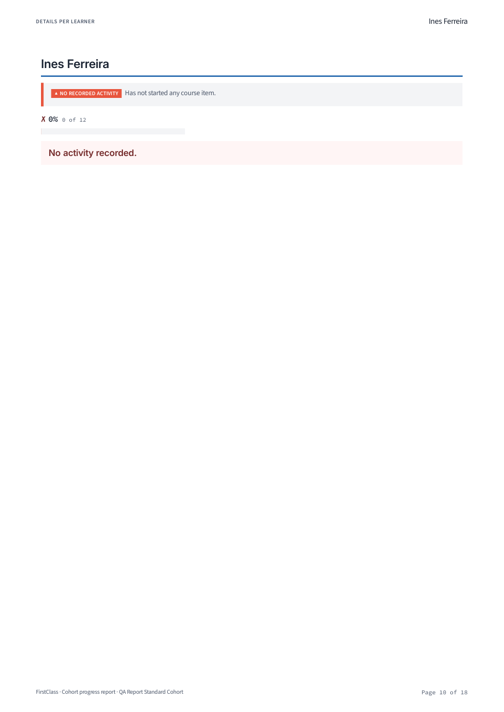

Broken branch (Amara Okonkwo, p. 14 of the same PDF — one `TopicProgress` row, nothing completed):

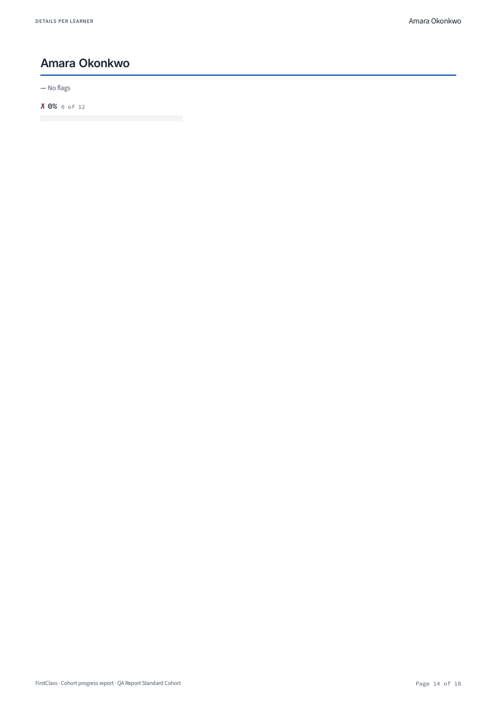

**Root cause.** `freedom_ls/reports/templates/reports/partials/student_detail.html:30` gates the whole
body on `student.has_any_progress`, and `freedom_ls/reports/gather.py:541-569` sets that flag true for
**any** `TopicProgress`/`FormProgress` row, completed or not. Such a learner then has empty
`completed_items`, `quiz_results` and `wrong_answers`, so every inner `` is skipped and the
`` on line 103 that emits "No activity recorded." never runs.

**Scale — this is not one fixture.** The completion ladder the plan describes puts one
opened-but-completed-nothing learner in every cohort, so every non-degenerate fixture is affected:

| Fixture | Learners at 0% | "No activity recorded." lines | Empty sections |
|---|---|---|---|
| `tiny-cohort-short-course` | 2 | 1 | 1 |
| `small-cohort-medium-course` | 2 | 1 | 1 |
| `standard-cohort-medium-course` | 2 | 1 | 1 |
| `no-pass-mark-cohort` | 2 | 1 | 1 |
| `large-cohort-medium-course` | 4 | 2 | 2 |
| `xl-cohort-long-course` | 9 | 6 | 3 |

Confirmed in the database: `qa-report-std-01@email.com` (Amara Okonkwo, QA Report Standard Cohort) has
1 `TopicProgress` row and 0 completed.

`no-progress-cohort.pdf` passes cleanly — all 9 learners have no rows at all and all 9 get the line —
which is why the fixture built for this check does not catch the bug.

**Suggested fix:** gate on "has anything to show" (completed items, quiz results or wrong answers)
rather than on `has_any_progress`, so a started-but-nothing-completed learner falls through to the
"No activity recorded." branch. A separate wording for "started, nothing completed" would be better
still, but the rule the plan states is that the section must never be an empty gap.

---

## Bug 2 — The completion bar's empty track is invisible on every banded row

**Test:** QA 3 (summary tables) and QA 6.2/6.3 (*"Walk every status cell: completion bars …"*).

**Expected:** each learner's completion bar reads consistently against a visible 0–100% track, on
every row.

**Actual:** the bar's track and the table's zebra stripe are the same colour, so on every even row
the track vanishes. Consequences inside a single table:

- a partially-complete learner on a banded row shows a floating blue segment with no reference length;
- a 0% learner on a banded row shows **no bar at all**, while a 0% learner on a white row shows an
  empty track — two identical values drawn two different ways.

Zoom on `standard-cohort-medium-course.pdf` p. 5 — Ines Ferreira (banded, 0%, no bar) against Amara
Okonkwo (white, 0%, empty track); Sanne Bergström's 42% bar has no track while Theo Delacroix's 17%
does:

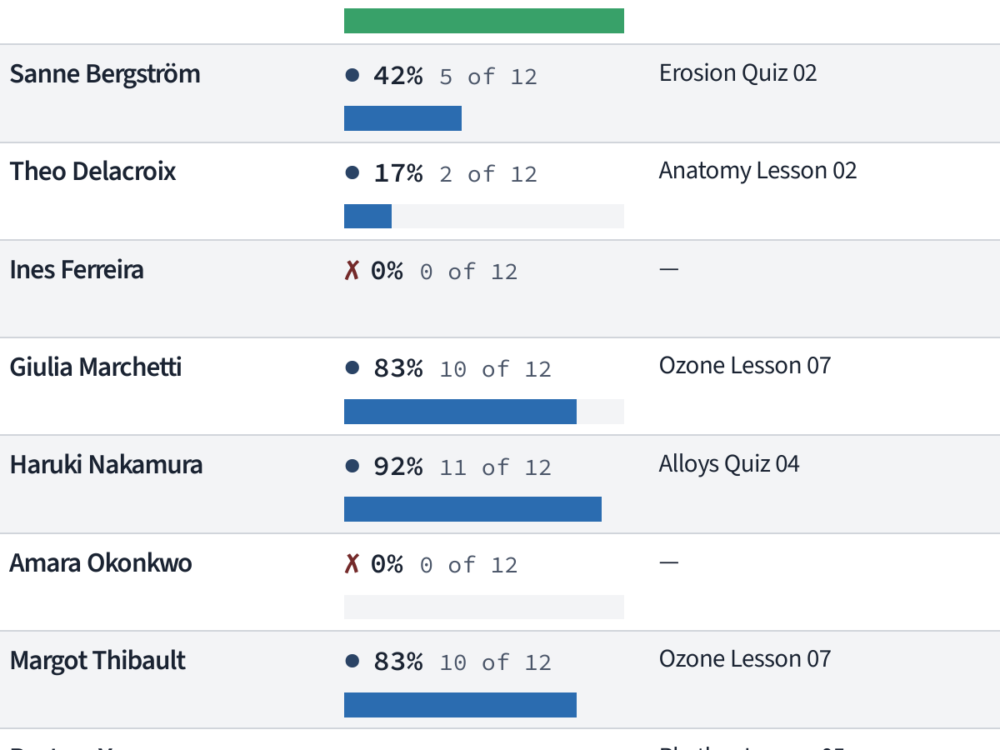

Same effect on the multi-page table (`large-cohort-medium-course.pdf` p. 6) — Thabo Mbeki and Margot
Thibault versus Amara Okonkwo and Anush Sarkissian:

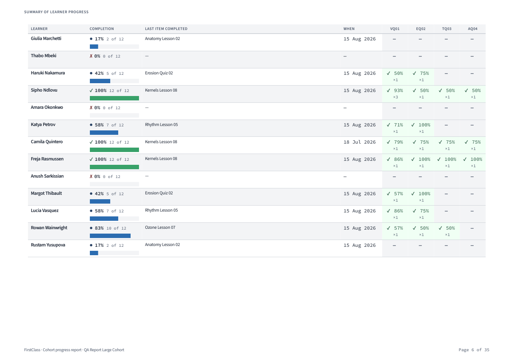

**Root cause.** In `freedom_ls/reports/static/reports/print.css`:

- line 355-361 — `.completion-bar-outer { background: var(--color-surface-2); }`
- line 769-771 — `.summary-tables tbody tr:nth-child(even) td { background: var(--color-surface-2); }`

Identical token. The status tints on line 773-778 are explicitly re-declared to win over the banding;
the bar track is not.

This is worse in greyscale, where the two greys are byte-identical, so QA 6's requirement that
completion bars stay unambiguous in print is only met on half the rows.

**Suggested fix:** give the track its own token (or a border) so it is distinguishable from the row
band, the same way the status cells already re-declare their tint.

---

## Bug 3 — Landscape column budget is 10, not 11: at 11 quiz columns "Last item completed" overflows into "When"

**Test:** QA 7 — the sign-off check. The plan states the previous `REPORTS_MAX_QUIZ_COLUMNS = 11`
sign-off does not carry over and must be re-measured against Source Sans 3 and the new "When" column.

**Expected:** at the configured cap, text is legible and nothing is clipped or overlapping.

**Actual:** the right margin is fine, but at 11 quiz columns the **Last item completed** column is
squeezed below the width a single item-title word needs, and its text bleeds into the **When** column.

`xl-cohort-long-course.pdf` p. 6 — the first table carries 11 quiz columns (VQ01…FQ11); the 12th
(HQ12) correctly splits into a second `QA Report Long Course (continued)` table on p. 9:

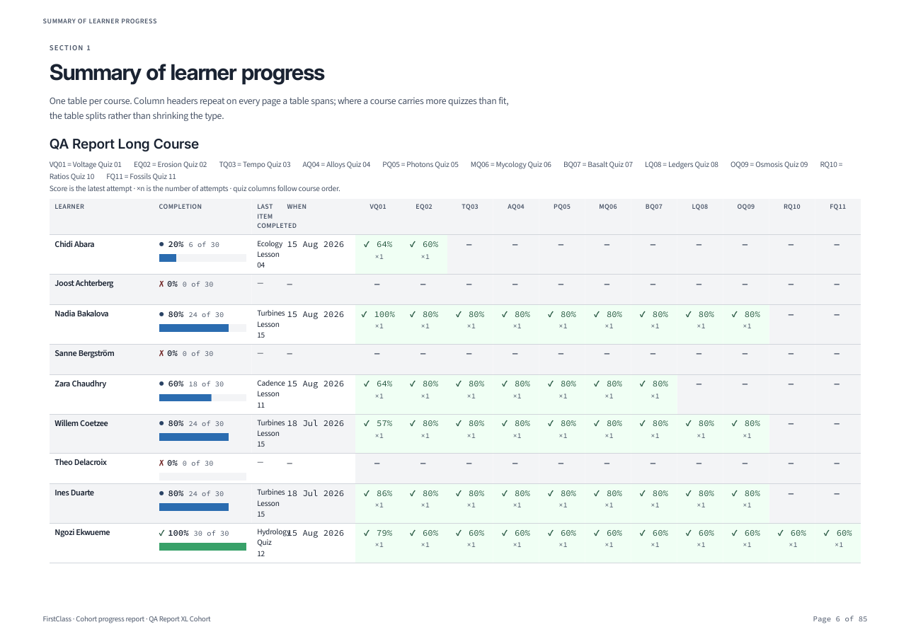

Zoomed — "Hydrology" runs straight into "15 Aug 2026", reading as `Hydrolog15 Aug 2026`; "Turbines"
touches "18 Jul 2026" with no gap:

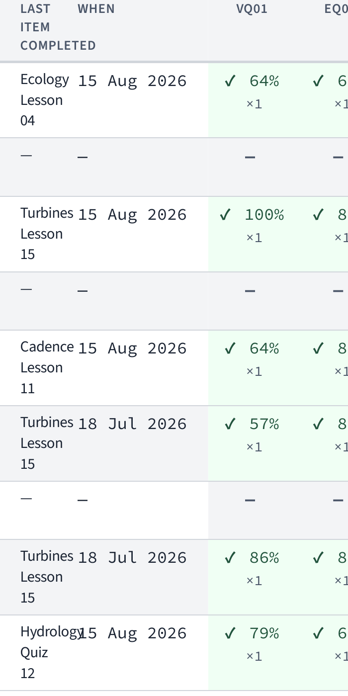

**Measured (PDF text bounding boxes, `pdftotext -bbox`, p. 6 of `xl-cohort-long-course.pdf`):**

| Word | xMin | xMax | Baseline y |
|---|---|---|---|
| `Hydrology` | 237.77 | **268.23** | 487.0 |
| `15` (When column) | **265.46** | 275.06 | 487.7 |

A 2.8pt glyph-on-glyph overlap on the same line. `Turbines` ends at 263.41 with `15` starting at
265.46 — a 2pt gap, i.e. touching.

**Boundary walk.** Built four controlled fixtures (30 items, 4 learners, identical names, only the
quiz count varying) with the plan's own commands:

| Quiz columns | `Last item completed` header | Item title | Gap to `When` | Verdict |
|---|---|---|---|---|
| 1 (`tiny-cohort-short-course`) | one line | one line | wide | ✅ clean |
| 4 (`standard-cohort-medium-course`) | one line | one line | wide | ✅ clean |
| 6 (`QA ColBudget 6`) | one line | one line | wide | ✅ clean |
| 8 (`QA ColBudget 8`) | one line | one line | wide | ✅ clean |
| 9 (`QA ColBudget 9`) | one line | one line | wide | ✅ clean |
| **10** (`QA ColBudget 10`) | wraps to 2 lines | one line | **~12pt** | ✅ **largest clean count** |
| **11** (`QA ColBudget 11`, `xl-cohort-long-course`) | wraps to 3 lines | wraps to 3 lines | **~1.5pt, overflows** | ❌ **smallest broken count** |

10 columns — clean, clear gap before `When`:

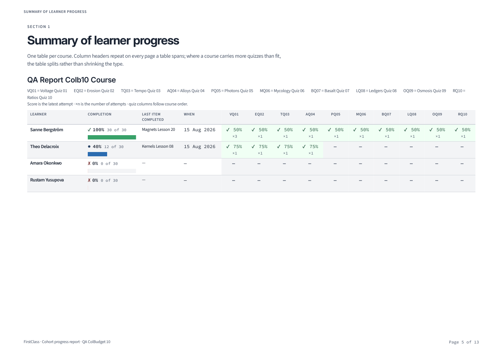

11 columns — header and title both broken onto three lines, gap gone:

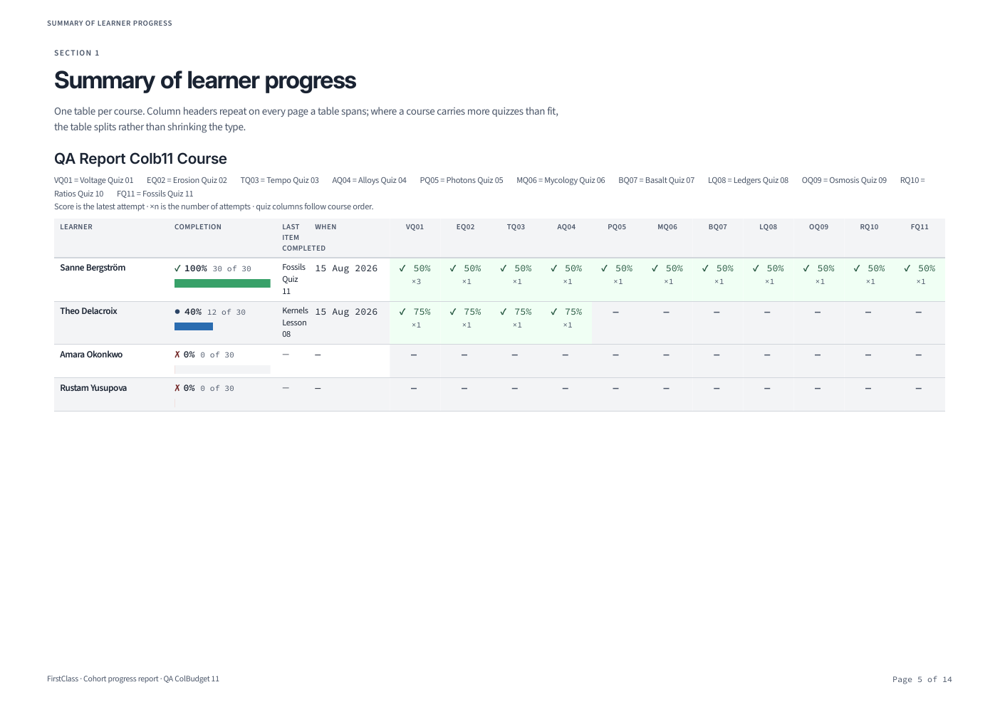

**Sign-off number: 10.** `REPORTS_MAX_QUIZ_COLUMNS` (`freedom_ls/reports/config.py:93`, currently
`Setting(default=11)`) should be lowered to **10**, and the explanatory comment on lines 87-91 updated
— it still cites 11 as "measured on real rendered pages".

**Answer to the plan's QA 7 step 4 question** ("record the number that finally forced a split"): 12
quizzes forced the split at the current cap of 11; `--long-course-quizzes 16` was **not** needed. Once
the cap moves to 10, 11 quizzes will force it.

Evidence kept as `qa-artifacts/xl-cohort-long-course_column-overflow.pdf`,
`qa-artifacts/col-budget-11-overflow.pdf` and `qa-artifacts/col-budget-10-clean.pdf`.

---

# Section-by-section results

## QA 0 — Fixture matrix and artifact set ✅

`qa-artifacts/` deleted and rebuilt. All ten matrix fixtures built by
`qa_create_report_fixtures --reset` and generated **through the admin UI**, one at a time. All ten
came back `ready`; none produced a `failed` row.

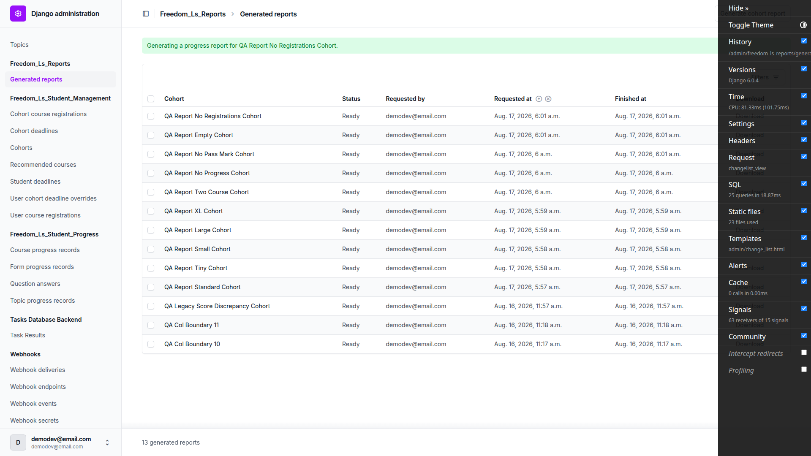

## QA 1 — Generate a report end to end ✅

| Step | Result |
|---|---|
| 1.2 `Freedom_Ls_Reports → Generated reports` present in the admin index | ✅ |
| 1.2 **no** "Generate report" button on the Cohorts changelist | ✅ (no match for `/generate/i` anywhere in `#content`) |
| 1.3 **no** "Add generated report" button | ✅ (`has_add_permission` returns `False`) |
| 1.3 link to **Generate cohort report** present | ✅ `…/generatedreport/generate_report_action/` |
| 1.4 cohort dropdown lists cohorts | ✅ 18 cohorts |
| 1.5–1.6 submit → redirect + success message + new row | ✅ "Generating a progress report for QA Report Standard Cohort." |
| 1.7 row shows cohort / status / requested by / requested at / finished at / Download | ✅ `Ready` on first render (`ImmediateBackend`) |
| 1.8 Download serves a PDF attachment with a slugified filename | ✅ |

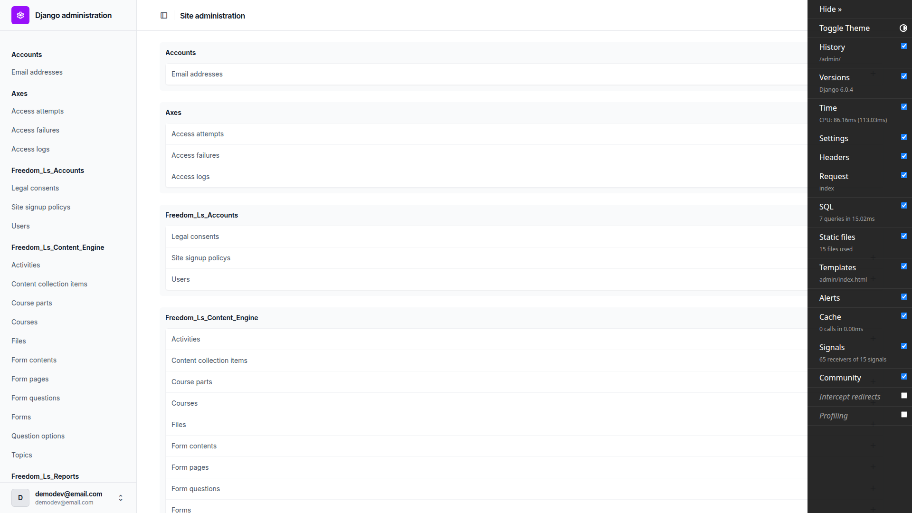

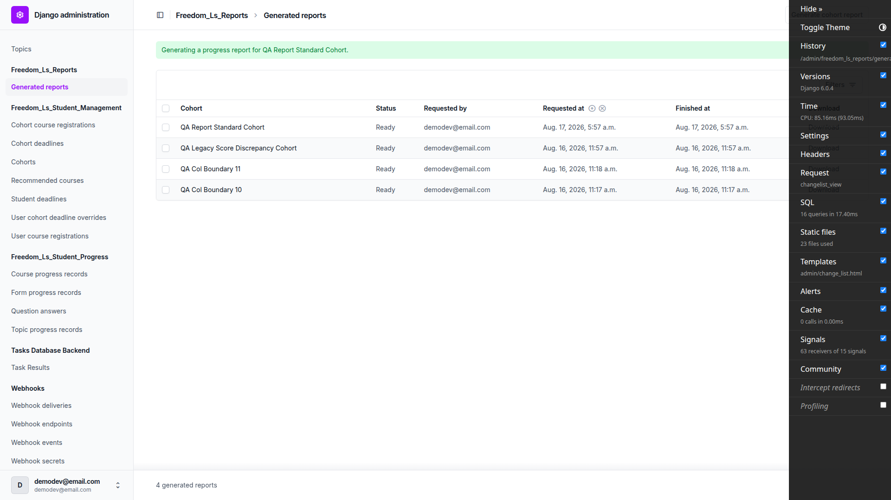

QA 1.8 response headers:

```
content-type: application/pdf
content-disposition: attachment; filename="qa-report-standard-cohort-progress-report.pdf"
cache-control: private, no-store, must-revalidate, max-age=0, no-cache
content-length: 620092        (body starts %PDF-1.7)
```

Filename is slugified, no spaces, no raw cohort name. A real browser download was also observed
(Playwright reported *"Downloaded file qa-report-standard-cohort-progress-report.pdf"*) — not an
inline render, not a media URL.

## QA 2 — Read the PDF — 2.5 fails, rest passes

**Terminology.** Zero occurrences of "student" (case-insensitive) across all ten report PDFs. Every
surface says "learner". ✅

**2.1 Cover page ✅** — tenant name and logo top right, `COHORT PROGRESS REPORT` eyebrow, cohort name,
"Courses covered" card with item/quiz counts, `GENERATED  Monday 17 August 2026 · 05:57 UTC (+0000)`
(timezone present), generated-by, cohort size, the as-of caveat, brand band across the foot. No
running header, footer line or page number on the cover. No organisation named that FLS does not
store.

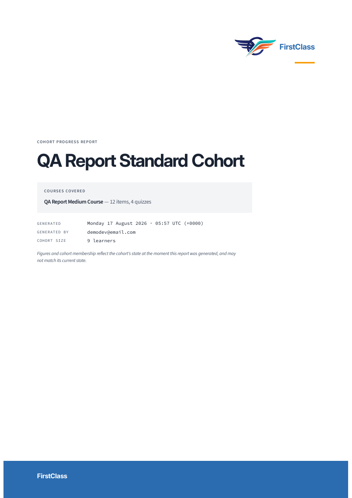

- **Logo unset** — regenerated with `HEADER_LOGO_STATIC_PATH = None`: the name stands alone,
  right-aligned, with the accent rule intact and **no gap** where the logo was. Reads finished. ✅
  Kept as `qa-artifacts/tiny-cohort-short-course_no-logo.pdf`.

  

- **`REPORTS_POWERED_BY_NAME` unset (default)** — "Powered by" appears **nowhere** in any of the ten
  matrix PDFs, cover or footer. ✅
- **Both powered-by settings set** — name and logo appear in the cover brand band, and the name is
  appended to **every** page footer (`FirstClass · Cohort progress report · QA Report Tiny Cohort ·
  Powered by Freedom Learning System`, verified on pages 2–9 of 9). ✅ Kept as
  `qa-artifacts/tiny-cohort-short-course_powered-by.pdf`.

  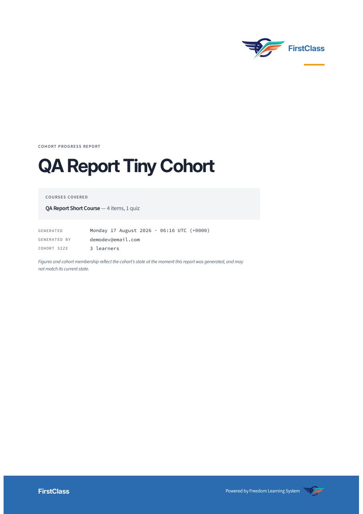

`config/settings_dev.py` was edited temporarily for both variants and **restored** — `git diff` on
that file is now empty.

**2.2 Cohort at a glance ✅** — four stat cards (9 learners / 58% median completion / 2 not started /
1 completed everything), "3 of 9 flagged", and the attention list with a page reference per learner.

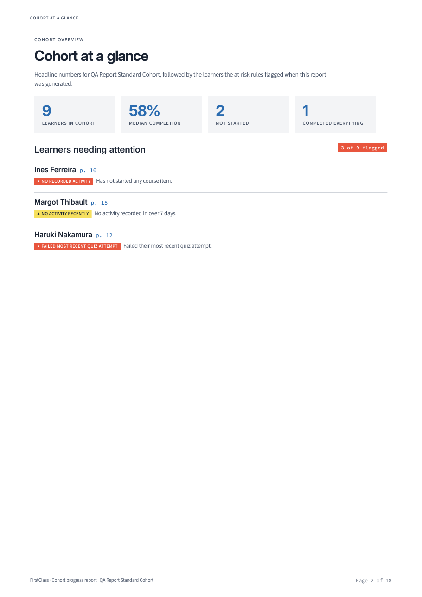

The page references are **real internal PDF links**, and they resolve to the right pages:

| Flagged learner | Printed ref | Link destination resolves to |
|---|---|---|
| Ines Ferreira | p. 10 | page 10 ✅ |
| Haruki Nakamura | p. 12 | page 12 ✅ |
| Margot Thibault | p. 15 | page 15 ✅ |

**2.3 Contents and definitions ✅** — one section carrying both. Real page numbers with dot leaders,
two levels (numbered sections, then courses / learners / quizzes).

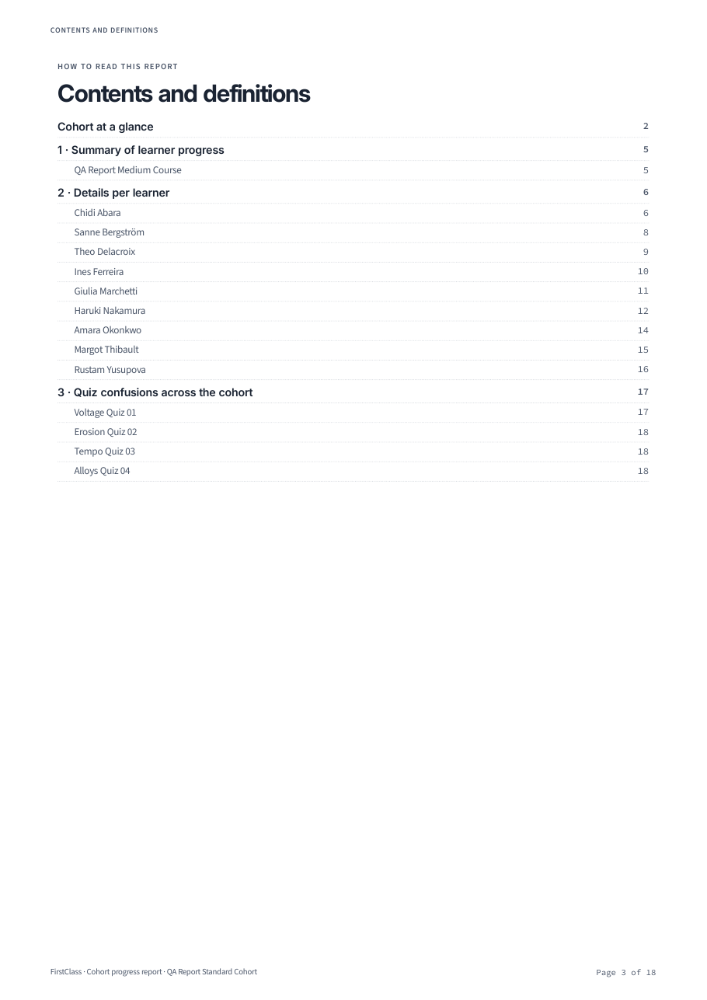

The PDF outline mirrors it exactly (read with `pypdf`): `Cohort at a glance → 2`,
`Contents and definitions → 3`, `Summary of learner progress → 5` (child `QA Report Medium Course → 5`),
`Details per learner → 6` with all nine learners as children at the correct pages,
`Quiz confusions across the cohort → 17` with all four quizzes.

All nine required definitions are present:

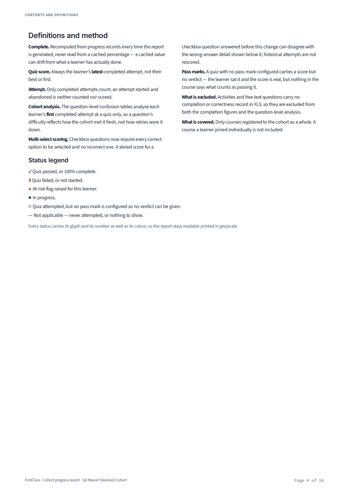

| Required statement | Present |
|---|---|
| "complete" is recomputed, never read from a cached field | ✅ "Recomputed from progress records every time the report is generated, never read from a cached percentage" |
| quiz score means the **latest** attempt | ✅ "Always the learner's latest completed attempt, not their best or first." |
| what counts as an attempt (completed only) | ✅ "Only completed attempts count; an attempt started and abandoned is neither counted nor scored." |
| first-attempt rule for cohort analysis, and why | ✅ "…first completed attempt at a quiz only, so a question's difficulty reflects how the cohort met it fresh, not how retries wore it down." |
| multi-select scoring changed, old stored score can disagree | ✅ "A stored score for a checkbox question answered before this change can disagree with the wrong-answer detail shown below it; historical attempts are not rescored." |
| a quiz with no pass mark carries a score but no verdict | ✅ "Pass marks. A quiz with no pass mark configured carries a score but no verdict…" |
| Activities and free-text excluded, and why | ✅ "…carry no completion or correctness record in FLS, so they are excluded…" |
| individually-registered courses not covered | ✅ "Only courses registered to the cohort as a whole. A course a learner joined individually is not included." |
| RAG legend including the glyphs | ✅ `✓ ✗ ▲ ● ○ —` each with its meaning |

**2.4 Summary per course, inactive registration marked ✅** — `two-course-cohort.pdf` sections both
courses. The inactive one is marked on the cover (`QA Report Second Course — 8 items, 2 quizzes
(inactive registration)`) *and* on its table heading (`QA Report Second Course (inactive
registration)`).

**2.5 Every learner appears with an explicit no-activity line** — ❌ **Bug 1**. Every learner does
appear in both the summary table and the per-learner sections; the failure is the missing
"No activity recorded." line for opened-but-completed-nothing learners.

**2.6 Orientation ✅** — summary tables landscape, everything else portrait, in every fixture:

| Fixture | Landscape pages | Total |
|---|---|---|
| `standard-cohort-medium-course` | 5 | 18 |
| `tiny-cohort-short-course` | 5 | 9 |
| `two-course-cohort` | 5, 6 | 20 |
| `large-cohort-medium-course` | 5, 6 | 35 |
| `xl-cohort-long-course` | 6–10 | 85 |

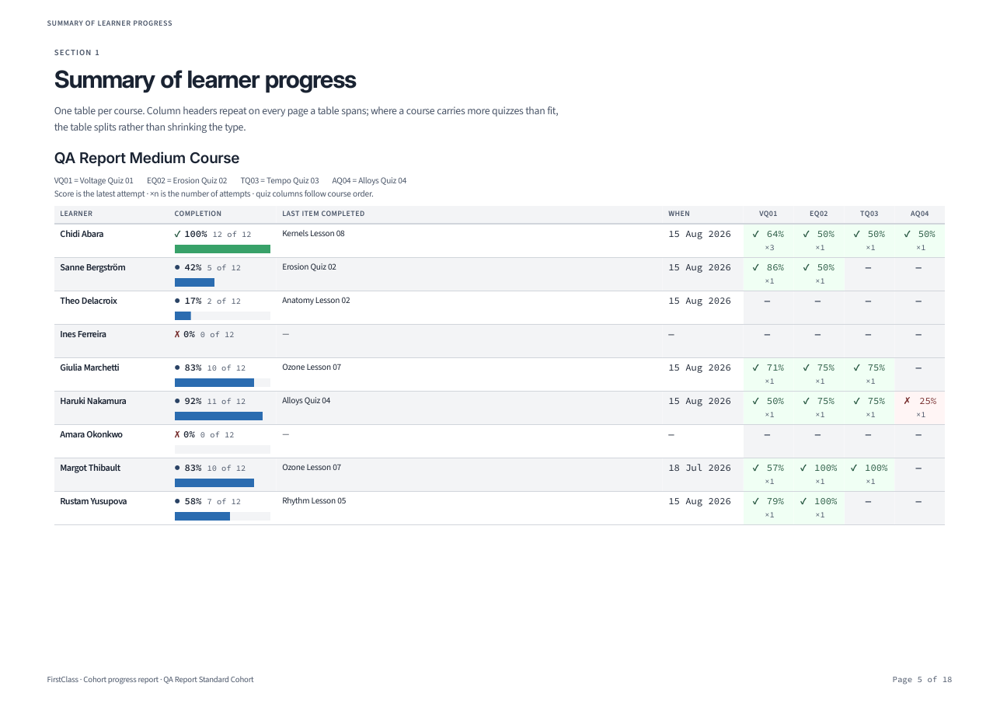

**2.7 Page numbers ✅** — checked programmatically on five reports: page 1 (cover) carries no page
number; every other page does, and the sequence runs 2…N with no gaps or repeats.

**2.8 Quizzes with no pass mark ✅** — `no-pass-mark-cohort.pdf` generated fine (17 pages, `ready`).
Its first quiz's column shows the score with the `○` no-verdict glyph and **no** pass/fail verdict:
`○ 75%`, `○ 50%`, `○ 100%`, `○ 25%` — while the other three quizzes in the same table still show
`✓`/`✗`. The quiz has not silently dropped out of the summary table, and the attempts table shows
`○ 75% 3/4` etc. The definitions block explains it.

**2.9 Page furniture ✅** — on every page but the cover: section title top left, learner name top right
inside section 2, `FirstClass · Cohort progress report · QA Report Standard Cohort` bottom left, page
number bottom right. The section title changes at each boundary
(`COHORT AT A GLANCE` → `CONTENTS AND DEFINITIONS` → `SUMMARY OF LEARNER PROGRESS` →
`DETAILS PER LEARNER` → `QUIZ CONFUSIONS ACROSS THE COHORT`) and stays correct on second and later
pages of a section.

**2.10 Per-learner quiz attempts ✅** — Chidi Abara (`standard-cohort-medium-course.pdf` p. 6) shows
three rows for Voltage Quiz 01, oldest first, attempt 1/2/3, each dated and scored `✓ 64% 9/14`. The
summary cell for VQ01 reads `✓ 64% ×3` — the latest attempt, and it agrees. No abandoned sitting
appears as a row (Amara Okonkwo's incomplete `TopicProgress` produces no attempt row anywhere).

**2.11 Legacy checkbox score shows through unchanged ✅** — data created via the
`fls-dev:qa-data-helper` agent, which found an existing reproducible command:

```
uv run python manage.py qa_create_legacy_checkbox_score --site-name DemoDev
```

`QA Legacy Score Discrepancy Cohort`; learner **Lena Legacy** (`demodev_legacyscore@email.com`) has a
completed `checkboxes` attempt with **all three** options ticked and a stored score of `2/2` (100%),
as the old scoring would have recorded it. The report prints the **stored** score and marks the same
question wrong directly beneath it:

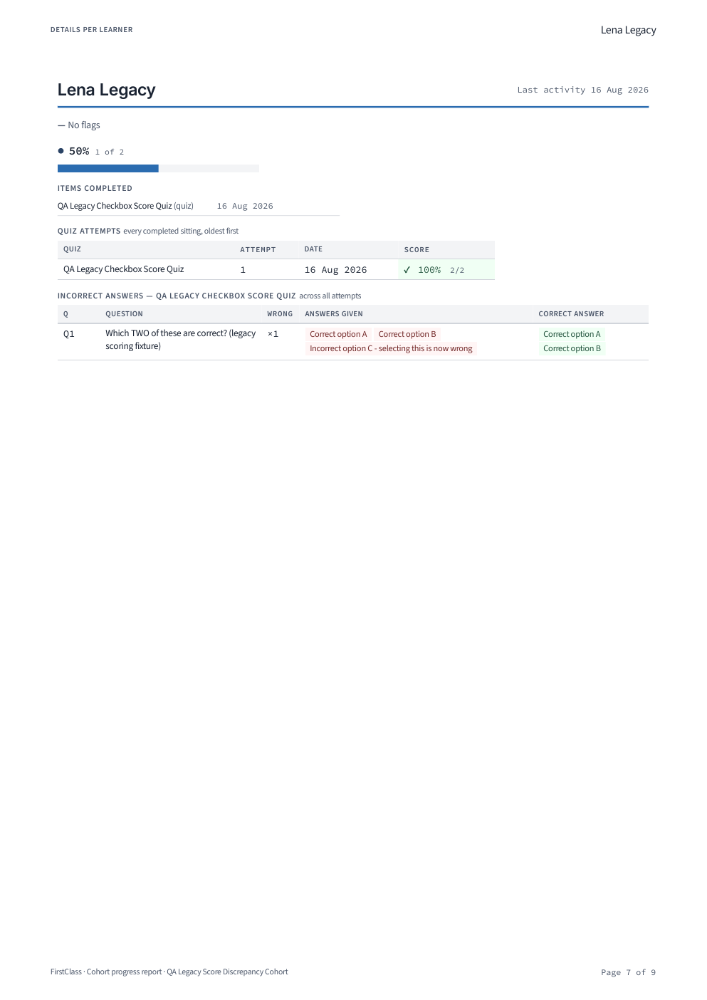

- summary table cell: `✓ 100%`
- quiz attempts row: `✓ 100% 2/2`
- immediately below: `INCORRECT ANSWERS — QA LEGACY CHECKBOX SCORE QUIZ`, Q1 `×1`, answers given
  `Correct option A`, `Correct option B`, `Incorrect option C - selecting this is now wrong`, against
  correct answers `Correct option A`, `Correct option B`
- cohort confusion section counts it wrong for `1 of 2 learners`
- the definitions block's "Multi-select scoring" paragraph explains the discrepancy rather than
  leaving the reader to spot a contradiction

Kept as `qa-artifacts/legacy-score-discrepancy.pdf`.

## QA 3 — Page-break and running-header behaviour ✅

**3.1 Repeated header row ✅** — `large-cohort-medium-course.pdf` p. 5→6 and
`xl-cohort-long-course.pdf` p. 6→10: the header row (`LEARNER · COMPLETION · LAST ITEM COMPLETED ·
WHEN · VQ01 …`) repeats at the top of every continuation page. Nothing clipped; the table continues.
`two-course-cohort.pdf` p. 5→6 shows the same for its second course.


**3.2 No row split across a page boundary ✅** — verified on both boundaries above; each continuation
page opens on a fresh, whole learner row.

**3.3 Per-learner running headers ✅** — this is exactly right, including the failure mode the plan
warns about. Every learner starts on a fresh page (no page carries two learners), and the running
header carries **that** learner's name on second and later pages:

| Report | Multi-page learner sections, header correct throughout |
|---|---|
| `large-cohort-medium-course` | Elsa Lindqvist (18–19), Sipho Ndlovu (23–24) |
| `xl-cohort-long-course` | Nadia Bakalova (13–14), Ngozi Ekwueme (23–25), Declan Halloran (32–34), Elsa Lindqvist (41–43), Camila Quintero (54–56), Erik Solberg (61–63), Enzo Zampieri (76–78) |

No learner's name leaks onto a landscape summary page (XL pages 6–10 show only
`SUMMARY OF LEARNER PROGRESS`) or into the confusions section (XL pages 79–85).

**3.4 Alphabetical by surname ✅** — XL's 40 learners run Abara, Achterberg, Bakalova, Bergström,
Chaudhry, Coetzee, Delacroix, Duarte, Ekwueme, Espinoza, Ferreira, Fontaine, Grimsdóttir, Halloran,
Hartigan, Idowu, Jankowski, Kowalczyk, Lindqvist, Marchetti, Mbeki, Nakamura, Ndlovu, Novotný,
Okonkwo, Petrov, Quintero, Rasmussen, Ravindran, Sarkissian, Solberg, Tanaka, Thibault, Ustinov,
Vasquez, Villalobos, Wainwright, Whitfield, Yusupova, Zampieri.

**3.5 Quiz column order and legend ✅** — columns follow course order, not alphabetical
(`VQ01 EQ02 TQ03 AQ04`, and XL's `VQ01 … FQ11`). The abbreviation legend sits under the table title
(`VQ01 = Voltage Quiz 01   EQ02 = Erosion Quiz 02 …`) with the note
*"Score is the latest attempt · ×n is the number of attempts · quiz columns follow course order."*
**One column per quiz**, carrying glyph, latest score and attempt count together — not split into
separate score and attempts columns.

**Tiny cohort comparison ✅** — the 3-learner table sits on one landscape page (p. 5) and does not
split.

## QA 4 — At-risk flags are consistent ✅

**4.1–4.3 Identical label and reason text ✅** — character-for-character between the at-a-glance list
and each learner's own section, in the same order:

| Learner | At a glance | Own section |
|---|---|---|
| Ines Ferreira | `▲ NO RECORDED ACTIVITY` / "Has not started any course item." | identical |
| Margot Thibault | `▲ NO ACTIVITY RECENTLY` / "No activity recorded in over 7 days." | identical |
| Haruki Nakamura | `▲ FAILED MOST RECENT QUIZ ATTEMPT` / "Failed their most recent quiz attempt." | identical |

**4.4 Glyph and coloured rule ✅** — every flag badge carries `▲` as well as its colour, and the
learner's own flags panel has a coloured rule down its side (visible in the Ines Ferreira screenshot
under Bug 1). Severities remain distinguishable in greyscale, not by shade alone: measuring the
rasterised greyscale, the error badge is a dark fill (grey ≈126) with white text while the warning
badge is a light fill (grey ≈216) with dark text — plus the label text itself differs.

**4.5 "No flags" ✅** — learners with no flags show an explicit `— No flags` line, not an empty gap.

**4.6 Attention list cap ✅** — `xl-cohort-long-course.pdf` lists exactly 12 learners with the
disclosure **"Showing 12 of 18 learners flagged."**, and all 18 flags still appear across the
per-learner detail sections (18 `▲` occurrences in section 2), including the six not on the front page.

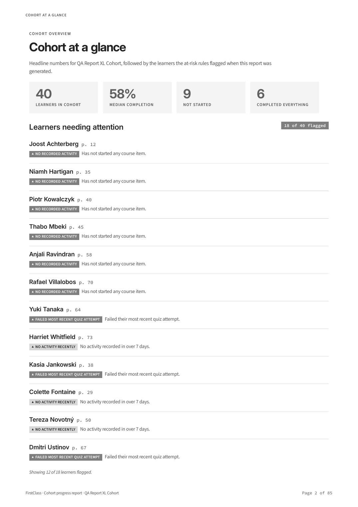

## QA 5 — Cohort quiz confusions ✅

**5.1–5.2 ✅** — the section exists; each question shows the incorrect answers chosen with a count
(`Voltage Q06 option C ×6`), the correct answer alongside, worst-first ranking, wrong and correct
answers as tinted chips, and the proportion who got it wrong as a figure with a bar beside it.

**5.3 No letter or position prefixes ✅** — verified against the database, not just by eye. The stored
option text for Voltage Q08 is exactly `'Voltage Q08 option A (correct)'`, `'Voltage Q08 option B
(correct)'`, `'Voltage Q08 option C'`. The report prints those strings verbatim — the "option A/B/C"
wording is the fixture's own text, and the report adds no letter or position marker of its own,
anywhere in the confusion tables or the per-learner incorrect-answer tables.

**5.4 Cap disclosure ✅** — *"Showing 10 of 14 questions with at least one incorrect answer."*

**5.5 Interpretive caution ✅** — once, under the section heading: *"Read these tables as prompts, not
verdicts. A high error rate can mean a hard but fair question as easily as a broken one. Cross-check a
flagged question against the course material before changing it."*

**5.6 Small-n rule flips at the boundary ✅** — and both halves hold:

| Fixture | Respondents | Rendering | Proportion bar |
|---|---|---|---|
| `tiny-cohort-short-course` | 1 | `1 of 1 learners` | none ✅ |
| `small-cohort-medium-course` | 6 | `3 of 6 learners` | **none** ✅ |
| `standard-cohort-medium-course` | 6 | `2 of 6 learners` | none ✅ |
| `large-cohort-medium-course` | 17 | `35% of 17` | **bar present** ✅ |
| `xl-cohort-long-course` | 31 | `35% of 31` | bar present ✅ |

Small cohort — plain counts, no percentage, no bar:


Large cohort — percentages with bars:

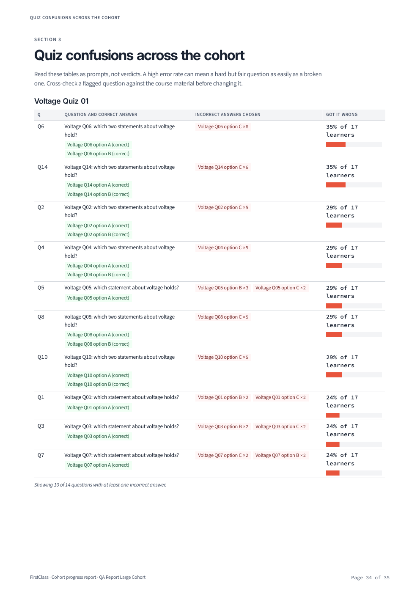

*Note on the denominator:* the threshold keys off the number of learners who actually **attempted**
the quiz (6 for the 9-learner cohorts, 17 for the 25-learner one), not the cohort size — so the plan's
illustrative "7 of 9 learners" reads as "3 of 6 learners" in practice. That is the more defensible
denominator and the rule still flips correctly at the boundary; noting it only so the wording in the
plan is not mistaken for a mismatch.

**5.7 Per-attempt vs first-attempt cross-check ✅** — and the two numbers disagree, as intended. Chidi
Abara (three completed attempts at Voltage Quiz 01, all wrong on the same questions) shows `×3` in his
own section for Q2; the cohort confusion section counts first attempts only and reports
`Voltage Q02 option C ×2` / `2 of 6 learners`. The definitions block's "Cohort analysis" paragraph
explains why.

## QA 6 — Greyscale print — 6.2–6.6 pass, 6.1 not run

**6.1 real office printer — not run.** See *Not executed* below.

**6.2–6.3 ✅** (on a greyscale rasterisation of `xl-cohort-long-course.pdf`, which strips all colour
exactly as a black-and-white print would): every status cell carries its glyph as well as its number —
`✓` complete/passed, `✗` failing/not started, `●` in progress, `—` not applicable, plus `▲` on every
flag badge and `○` in the no-pass-mark report. No status depends on shade alone.

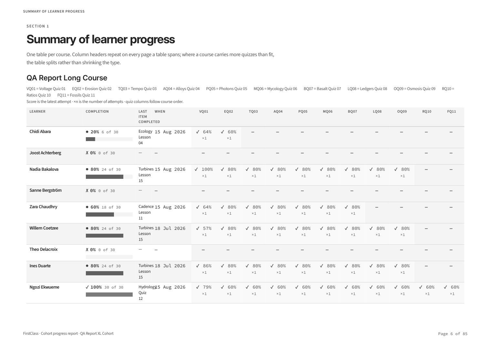

Caveat: Bug 2 means the completion **bar** loses its track on banded rows, and in greyscale the two
greys are identical, so that one cell type is not fully unambiguous. The numeric label beside the bar
still carries the value.

**6.4 No `.notdef` boxes ✅** — every glyph draws as a real glyph in the definitions legend, the
summary cells, the completion bars, the flag badges and the quiz attempts table. No missing-character
rectangles anywhere.

**6.5 No colour emoji ✅** — all glyphs render as monochrome text glyphs.

**6.6 Fonts all embedded and all configured ✅** — `pdffonts` on `xl-cohort-long-course.pdf` lists 17
subsetted faces, **every one `emb yes`**, and every family is one declared in `REPORTS_FONT_FACES`:

| Family | Weights/styles embedded |
|---|---|
| Source Sans 3 | regular, italic, semibold, bold |
| Source Code Pro | regular, medium, semibold, bold |
| Inter | semibold, bold |
| DejaVu Sans | bold (the glyph-carrying fallback) |

No face named as a system font, and no synthesised "bold"/"oblique" of a family whose real weight is
absent — each weight resolves to its own declared `@font-face`.

## QA 7 — Landscape column budget ❌

See **Bug 3**. Sign-off number is **10**, not 11.

## QA 8 — Permissions and access control ✅

Restricted staff user `qa-report-restricted@email.com`; cohort A = *QA Report Standard Cohort*,
cohort B = *QA Report Large Cohort*.

| Step | Expected | Actual |
|---|---|---|
| 8.1 anonymous hits the download URL | redirect to admin login | ✅ `302 → /admin/login/?next=…`, no PDF |
| 8.2 restricted staff, cohort B download URL | 403 | ✅ **403 Forbidden** (not 500) |
| 8.3 restricted staff, generate page dropdown | cohort B absent | ✅ dropdown contains exactly one option, `QA Report Standard Cohort` |
| 8.4 forced POST with cohort B's id (option value edited in the DOM) | rejected, no row created | ✅ **404**, and `GeneratedReport.objects.filter(cohort__name='QA Report Large Cohort').count() == 1` — still only the admin's own report |
| 8.5 no `/media/` link in the changelist source | none | ✅ zero matches for `/media/` in the fetched HTML |
| 8.6 caching and disposition headers | `private, no-store, must-revalidate` + `attachment` | ✅ see below |
| 8.7 direct media URL guess | note the result | ⚠️ serves the file in dev — expected; see below |


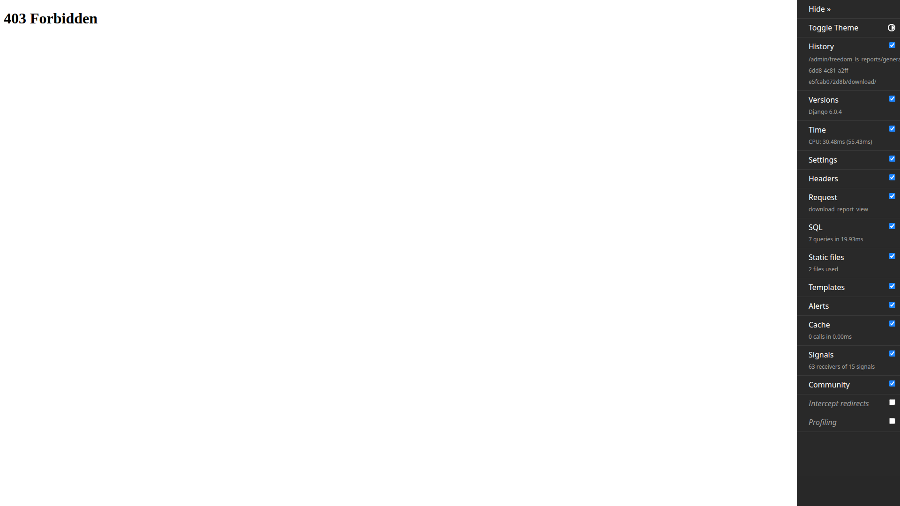
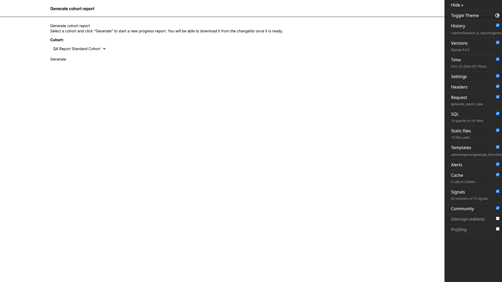
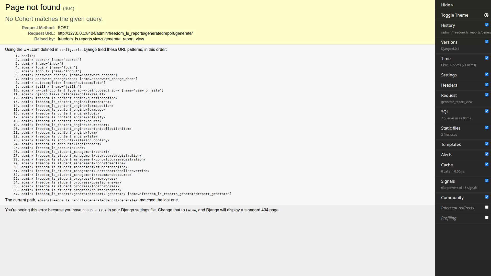

**8.6** — actual header is `private, no-store, must-revalidate, max-age=0, no-cache`, a superset of
what the plan asks for (Django's `never_cache` adds the last two). `Content-Disposition: attachment`
present. Pass.

**8.7** — `GET /media/reports/<uuid>/cohort-report.pdf` **with no cookies at all** returns
`200 application/pdf`, 620,092 bytes. This is the documented dev behaviour the plan anticipates: dev
serves `MEDIA_ROOT` directly and `STORAGES` has only `default` and `staticfiles`, so reports fall back
to the public default storage. The control is working — `manage.py check` raises
`freedom_ls_reports.W001` naming exactly this (QA 10.5). No action beyond making sure the upgrade
notes tell downstream projects to declare a private `reports` storage alias.

The restricted user's *permitted* download was also exercised in passing: logging in with `?next=` set
to cohort A's download URL delivered the PDF, confirming the guardian grant works and is not a blanket
deny.

## QA 9 — Failure branches ✅

**9.1 Concurrent generate ✅** — following the plan's dev recipe, `QA Report Small Cohort`'s report was
set back to `pending` and the generate form resubmitted for that cohort. Result: informational message
**"A report for this cohort is already being generated."**, exactly **one** row for the cohort (still
`Pending`, original `requested_at`), no 500, no second row.

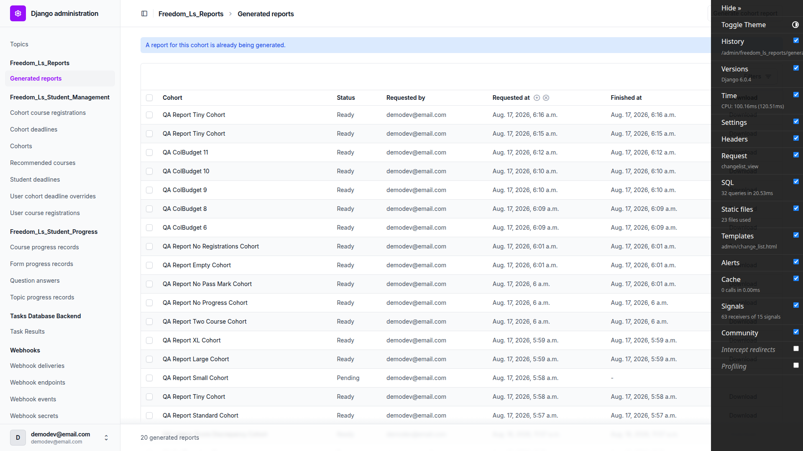

**9.2 Failed render ✅** — `static/vendor/tailwind.output.css` moved aside, then a report generated for
`QA Report Standard Cohort`. Row reads **Failed**, `started_at` and `finished_at` both set, no
Download link, no stuck `running` row, and a genuinely readable error message on the detail view:

> Static asset 'vendor/tailwind.output.css' could not be resolved through the staticfiles finders. Run
> `npm run tailwind_build` if this is the compiled Tailwind bundle; otherwise check the path against
> the setting that names it.

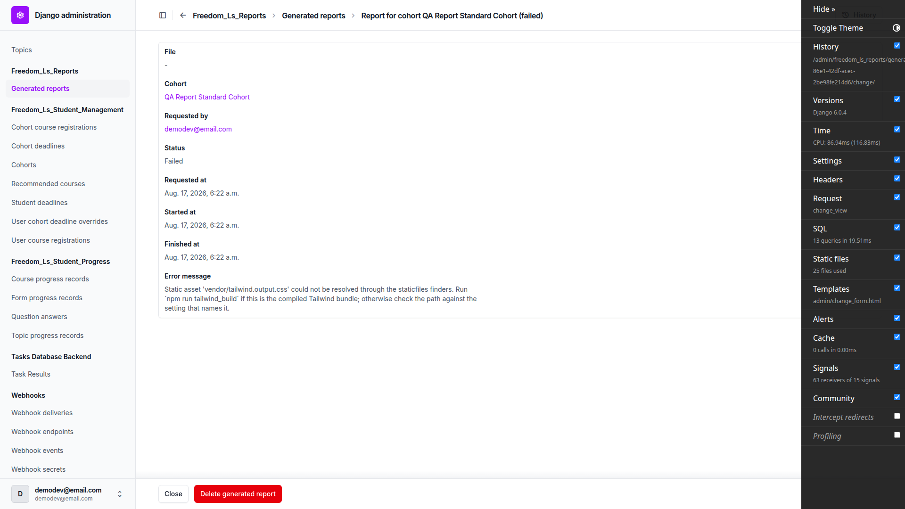

**9.3 Retry after failure ✅** — bundle restored, same cohort regenerated: succeeded immediately. The
failed row did not block the cohort. Result is complete, not truncated — 18 pages, ending on
`Page 18 of 18`, byte-identical in structure to the original. Kept as
`qa-artifacts/standard-cohort-medium-course_retry.pdf`.

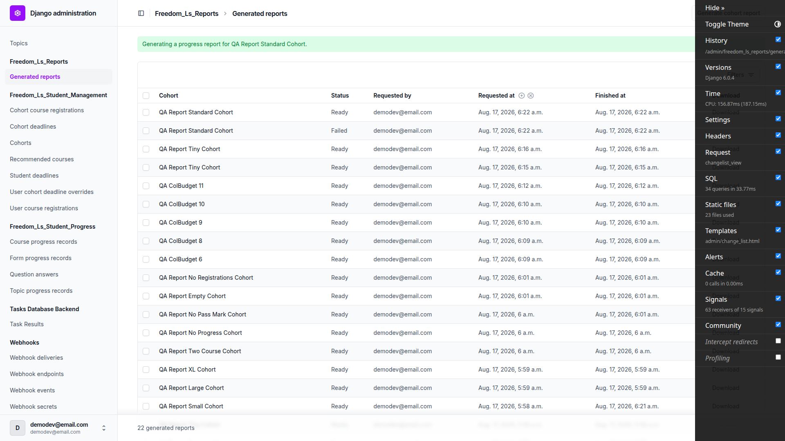

**9.4 Non-ready rows have no download ✅** — checked all three states on the same row:

| Status | Download column | `GET …/download/` |
|---|---|---|
| `pending` | empty | 404 |
| `running` | empty | 404 |
| `failed` | empty | 404 |

**9.5 Cohort with zero students ✅** — `empty-cohort.pdf`, 7 valid pages, saying so explicitly at every
turn rather than crashing or going blank: *"0 LEARNERS IN COHORT"*, *"0 of 0 flagged"*, *"No learners
currently flagged."*, *"This cohort has no learners."* (summary section), *"This cohort has no
learners, so there are no individual sections to show."* (details section), *"No quiz in this report
has any incorrect answers to analyse."* (confusions section).

**9.6 Cohort with no course registrations ✅** — `no-registrations.pdf`, 11 pages: *"No courses are
registered to this cohort."* on the cover, *"There are no course registrations to summarise."* in
section 1, and each of the 5 learners gets `— No course items` plus *"No activity recorded."*

## QA 10 — Deletion and system checks ✅

**10.1–10.2 Single delete ✅** — noted `media/reports/8422fc12-…/cohort-report.pdf` existed, deleted the
report from the admin: row gone, **file gone**, and the per-report directory removed too.

**10.3 Bulk delete ✅** — the admin's `delete_selected` action on two reports (`QA ColBudget 8` and
`QA ColBudget 9`): both rows gone, **both files gone**, both directories gone.

**10.4 Cohort delete cascades to PDFs ✅** — deleting cohort `QA ColBudget 10` from the admin. The
confirmation page correctly listed the collateral (`Generated reports: 1`), and afterwards the report
row, the PDF **and** its directory were all gone. No orphaned PDF with learner names in it.

**10.5 Storage-alias warning ✅**

```
?: (freedom_ls_reports.W001) REPORTS_STORAGE_ALIAS='reports' is not a key in settings.STORAGES.
   Reports will fall back to the default storage, which may be a publicly served MEDIA_ROOT.
   HINT: Declare a private storage alias in settings.STORAGES.
```

**10.6 Tailwind-bundle warning ✅** — with the bundle moved aside:

```
?: (freedom_ls_reports.W002) Compiled Tailwind bundle 'vendor/tailwind.output.css' could not be
   resolved through the staticfiles finders. Reports will fail to render.
   HINT: Run `npm run tailwind_build`.
```

Gone after restoring the file.

**10.7 Missing font face ✅** — full cycle exercised. With
`freedom_ls/reports/static/reports/fonts/SourceSans3-Variable.ttf` renamed:

```
?: (freedom_ls_reports.W004) Report font face 'Source Sans 3' names
   'reports/fonts/SourceSans3-Variable.ttf', which could not be resolved through the staticfiles
   finders. Reports will fail to render.
   HINT: Correct the static_path in REPORTS_FONT_FACES, or add the font file to a static directory
   the finders search.
```

A report generated while it was renamed landed in **`failed`** — it did **not** render in a
substituted face:

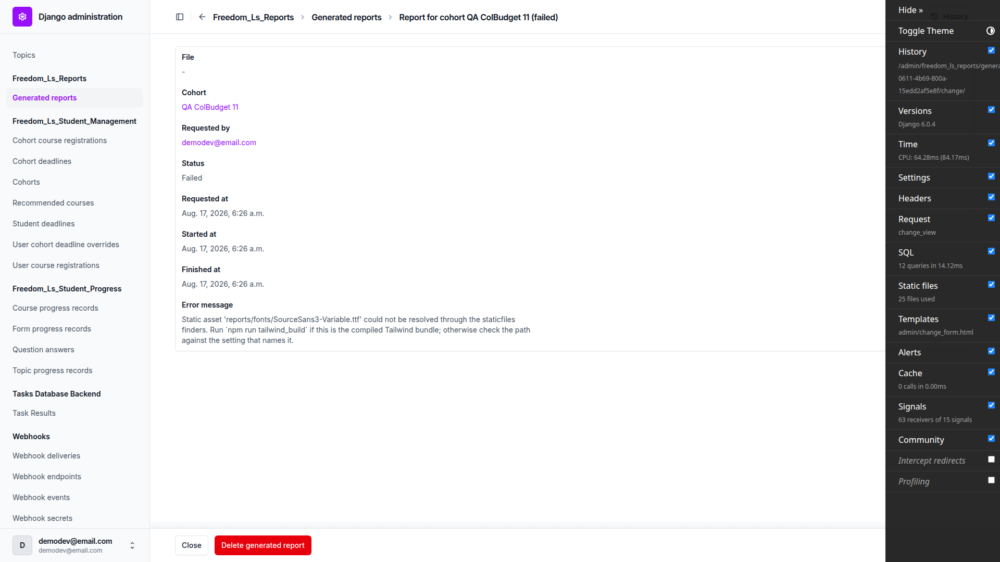

After restoring the file, the W004 warning disappeared and the same cohort generated `Ready`. Both the
warning and the failure go away, as required.

---

# Artifact manifest

`spec_dd/2. in progress/basic_reports/3a. report_generation_qa/qa-artifacts/`

## Fixture matrix — all ten present

| Fixture key | Cohort size | Course length | Filename | Pages | Landscape pages | Quiz columns | Table split | What it demonstrates |
|---|---|---|---|---|---|---|---|---|
| `empty-cohort` | 0 | short | `empty-cohort.pdf` | 7 | 1 | n/a (no table) | no | Zero learners: every section says so explicitly (QA 9.5) |
| `no-registrations` | 5, no registrations | — | `no-registrations.pdf` | 11 | 1 | n/a | no | No course registrations stated on the cover, in section 1 and per learner (QA 9.6) |
| `tiny-cohort-short-course` | 3 | 4 items, 1 quiz | `tiny-cohort-short-course.pdf` | 9 | 1 | 1 | no | Smallest real report; plain counts; a 3-row table that correctly does not split (QA 3, QA 5.6) |
| `small-cohort-medium-course` | 9 | 12 items, 4 quizzes | `small-cohort-medium-course.pdf` | 18 | 1 | 4 | no | Small-n rule: plain counts, **no percentages and no bars** (QA 5.6) |
| `standard-cohort-medium-course` | 9 | medium | `standard-cohort-medium-course.pdf` | 18 | 1 | 4 | no | The baseline read-through (QA 1, QA 2); also the 3-attempt learner for QA 2.10 / QA 5.7 |
| `large-cohort-medium-course` | 25 | medium | `large-cohort-medium-course.pdf` | 35 | 2 | 4 | no | Multi-page table with repeated header rows; percentages and bars in confusions (QA 3, QA 5.6) |
| `xl-cohort-long-course` | 40, 18 flagged | 30 items, 12 quizzes | `xl-cohort-long-course.pdf` | 85 | 5 | 11 + 1 | **yes** | Both caps at once: attention list capped at 12 of 18, quiz columns split 11 + 1 (QA 4.6, QA 7) |
| `two-course-cohort` | 9 | medium + inactive | `two-course-cohort.pdf` | 20 | 2 | 4 + 2 | no | Both courses sectioned, inactive registration marked on cover and table (QA 2.4) |
| `no-progress-cohort` | 9, zero progress | medium | `no-progress-cohort.pdf` | 15 | 1 | 4 | no | All 9 learners take the "No activity recorded." branch (QA 2.5) |
| `no-pass-mark-cohort` | 9 | medium, first quiz no pass mark | `no-pass-mark-cohort.pdf` | 17 | 1 | 4 | no | `○` score with no verdict, report still generates (QA 2.8) |

**No fixture is missing.** All ten built and generated successfully.

## Variants and evidence artifacts

| Filename | Pages | What it demonstrates |
|---|---|---|
| `legacy-score-discrepancy.pdf` | 9 | Stored 100% checkbox score printed beside the wrong-answer detail that contradicts it (QA 2.11) |
| `standard-cohort-medium-course_retry.pdf` | 18 | Successful retry after a forced render failure; complete, not truncated (QA 9.3) |
| `tiny-cohort-short-course_no-logo.pdf` | 9 | Cover with `HEADER_LOGO_STATIC_PATH` unset — name alone, no gap (QA 2.1) |
| `tiny-cohort-short-course_powered-by.pdf` | 9 | `REPORTS_POWERED_BY_*` configured — cover band plus every page footer (QA 2.1) |
| `xl-cohort-long-course_column-overflow.pdf` | 85 | The 11-column overflow at the current cap (QA 7 / Bug 3) |
| `col-budget-11-overflow.pdf` | 14 | Controlled 11-quiz fixture: header and title both break to 3 lines, gap to `When` gone (Bug 3) |
| `col-budget-10-clean.pdf` | 13 | Controlled 10-quiz fixture: clean, ~12pt gap — the sign-off number (Bug 3) |

**Deliberate absence:** the QA 9.2 forced failure produces **no PDF by design** — the render aborts
and the row lands in `failed`. Its stand-in is
`screenshots/desktop_9.2_failed_report_error_message.png` (the failed row's detail view with the error
message). The QA 10.7 font failure likewise produces no PDF; its stand-in is
`screenshots/desktop_10.7_missing_font_failed_report.png`.

---

# Not executed

**QA 6.1 — printing to a real office printer.** Not run. A printer *is* reachable from this machine
(`MG2500`, idle), but sending 85 pages to the physical printer consumes the user's paper and ink and is
not reversible, so it was not done unprompted.

What was done instead: `xl-cohort-long-course.pdf` was rasterised to **true greyscale** (`pdftoppm
-gray`), which removes colour information exactly as a black-and-white print does, and QA 6.2–6.6 were
walked against that. Every glyph, embedded face and status distinction was verified this way, and the
findings are recorded above. The one thing the greyscale raster cannot substitute for is toner
behaviour on paper — very light tints (the `--color-surface-2` bar track, the pass/fail cell tints)
may print lighter or drop out entirely on an office laser. That matters directly for **Bug 2**, so a
real print run is still worth doing.

To run it: `lp -d MG2500 -o ColorModel=Gray "qa-artifacts/xl-cohort-long-course.pdf"` — happy to
trigger it on request.

Everything else in the plan was executed.

---

# Tangential observations

None of these are failures of the feature under test; recording them because the plan asks for
anything that looked out of place.

1. **The per-learner "Answers given" column tints correct selections as errors.** In the incorrect-answer
   table every option the learner selected is drawn as a red `chip-error`, including the ones that
   were correct — so `Correct option A` appears in error red next to the same text in success green in
   the "Correct answer" column. Visible in the QA 2.11 screenshot. Defensible as "these were the
   answers on an attempt scored wrong", and the adjacent column disambiguates, but a reader may take
   the red tint to mean each of those options was itself wrong. Worth considering tinting only the
   options that were actually incorrect.

2. **`freedom_ls_reports.W004` is emitted once per declared weight, not once per missing file.** One
   renamed font file produced **four** identical warnings, because `DEFAULT_REPORT_FONT_FACES` declares
   400/500/600/700 all pointing at the same variable file. The message is correct; deduplicating by
   `static_path` would make `manage.py check` output easier to read.

3. **The definitions block's two-column flow leaves the right column opening on a sentence fragment.**
   The "Multi-select scoring" paragraph breaks across the column boundary, so the right column starts
   with *"checkbox question answered before this change can disagree with…"*. Reading order is correct
   and this is ordinary CSS column behaviour, but a reader who scans the right column first meets an
   orphan. Keeping definition items unbroken (`break-inside: avoid`) would read better.

4. **Admin app label renders as `Freedom_Ls_Reports`, not `Reports`.** The plan says to find
   "Reports → Generated reports". Every app in this admin shows an underscored label
   (`Freedom_Ls_Accounts`, `Freedom_Ls_Student_Management`, …), so this is a pre-existing project-wide
   cosmetic thing, not something the reports app introduced. Mentioning it only because the plan's
   wording does not match what is on screen.

5. **django-debug-toolbar intercepts clicks on the admin delete-confirm button.** On the unfold
   delete-confirmation page the "Yes, I'm sure" button sits bottom-right, under the toolbar's overlay,
   and Playwright could not click it until `#djDebug` was hidden. Dev-only, and a human can collapse
   the toolbar, but it is a real click-blocker on that page.

6. **Stale data from earlier QA runs is still in the dev database.** `QA Col Boundary 6/8/10/11`
   cohorts and their reports, plus a `QA Multi-Select Quiz Scoring Cohort`, survive from previous runs;
   `qa_create_report_fixtures --reset` deliberately only clears its own fixture cohorts. Harmless, but
   the Generated reports changelist and the generate dropdown are noisier than they need to be. This
   run also added `QA ColBudget 6/8/9/11` (the QA 7 boundary walk) and deleted `QA ColBudget 10` as part
   of QA 10.4.

---

# Environment notes for the next run

- `config/settings_dev.py` was edited twice (logo unset, then powered-by set) and **restored**;
  `git diff config/settings_dev.py` is empty.
- `static/vendor/tailwind.output.css` was moved aside and **restored**.
- `freedom_ls/reports/static/reports/fonts/SourceSans3-Variable.ttf` was renamed and **restored**;
  `manage.py check` now reports only the expected `W001`.
- The dev server started for this run was stopped at the end.
- Test data was created only through the plan's documented management commands
  (`qa_create_report_fixtures`, `qa_create_report_course`, `qa_create_report_cohort`) plus the
  `fls-dev:qa-data-helper` agent for QA 2.11, which reused the existing reproducible
  `qa_create_legacy_checkbox_score` command rather than patching rows by hand.
