# QA report — Cohort progress PDF report (report generation)

**Plan:** `frontend_qa_report_generation.md`
**Run date:** 17 August 2026
**Branch:** `basic_reports` (confirmed via `debug-branch-badge`)
**Server:** `uv run python manage.py runserver 8000`, base URL `http://127.0.0.1:8000`
**Viewport:** desktop 1920x1080 only — mobile and tablet passes do not apply (every surface is Django admin or a PDF)
**Tooling:** Playwright MCP for all browser interaction; `pdftotext` / `pdftoppm` / `pdffonts` / `pypdf` for PDF inspection

## Note on the port

The plan's setup block calls `find_available_port.sh`, which returned **8450**. I did not use it. This
project resolves its tenant `Site` from the request host **including the port**, and the only `Site`
rows in the dev database are `127.0.0.1`, `127.0.0.1:8000`–`127.0.0.1:8003`. A server on 8450 would
have no `Site` to resolve, so the whole plan would fail on the first page. Port 8000 was verified free
before starting, and it maps to the `DemoDev` site the admin credentials belong to. The
`debug-branch-badge` read `basic_reports`, confirming no port collision with another worktree.

This is worth folding back into the plan: on this project, `find_available_port.sh` and the site-aware
host resolution disagree, and the plan should say to pick a port that has a `Site` row.

---

## Summary

**1 bug found.** Everything else in the plan passed, including every branch that carries a data-loss or
data-exposure risk: permissions, deletion cascade, failure handling and the system checks.

| Section | Result |
|---|---|
| QA 0 — build fixture matrix, capture artifact set | Pass — all 10 fixtures built and generated |
| QA 1 — generate end to end | **Fail (QA 1.4)** — generate page is unstyled |
| QA 2 — read the PDF | Pass |
| QA 3 — page breaks and running headers | Pass |
| QA 4 — at-risk flag consistency | Pass |
| QA 5 — cohort quiz confusions | Pass |
| QA 6 — greyscale legibility | Pass |
| QA 7 — landscape column budget | Pass — budget of 10 holds, no drift |
| QA 8 — permissions and access control | Pass |
| QA 9 — failure branches | Pass |
| QA 10 — deletion and system checks | Pass |

Nothing was skipped for missing data. The one delegation to `fls-dev:qa-data-helper` (QA 2.11) reported
the fixture was already correct and created nothing.

---

## Bug 1 — The "Generate cohort report" page renders with no admin styling at all

**Test failed:** QA 1.4 (and visible throughout QA 0, 8.3, 9.1, 9.2, 9.3, 10.4, since every generate
step goes through this page).

**Expected:** the generate page is part of the Django admin and should look like it — the same
django-unfold chrome as every other admin page: sidebar, breadcrumbs, styled form controls, a styled
submit button.

**Actual:** the page loses the admin shell entirely. No sidebar, no breadcrumbs, no CSS. The cohort
`<select>` is a raw browser dropdown positioned by an inline `style=` attribute, and the **Generate
button renders as plain unstyled text** — it does not read as a button at all. The page also emits
**two `<h1>` elements** both reading "Generate cohort report".

The generate page as it renders:


The Generated reports changelist, one click away, for contrast — this is what the admin actually looks
like on this project:

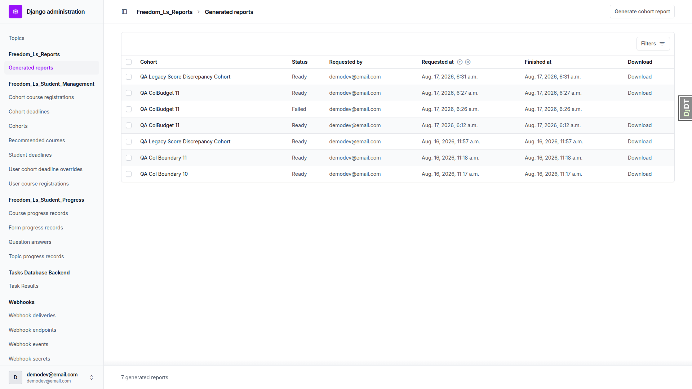

**Root cause:** `freedom_ls/reports/templates/admin/reports/generate_form.html` opens with
``. This project runs django-unfold, so `admin/base.html` resolves to a
bare skeleton carrying none of unfold's styling; the unfold layouts are what the rest of the admin
extends. The duplicate `<h1>` is the second symptom of the same template: it renders its own
`<h1>{{ title }}</h1>` inside `` on top of the title `admin/base.html` already
emits.

**Not affected:** the form *works*. It submits, it filters the cohort list by permission correctly, and
every functional check that runs through it passed. This is presentation only — but it is the one page
in the feature a human is asked to use, and it currently looks broken.

---

## Minor issues

These are not test failures against the plan's stated expectations, but they are worth a ticket.

### M1 — `freedom_ls_reports.W004` fires four times for one missing font file

During QA 10.7, renaming a single file (`Inter-Variable.ttf`) produced **four identical W004 warnings**:

```
?: (freedom_ls_reports.W004) Report font face 'Inter' names 'reports/fonts/Inter-Variable.ttf', which could not be resolved through the staticfiles finders. Reports will fail to render.
	HINT: Correct the static_path in REPORTS_FONT_FACES, or add the font file to a static directory the finders search.
   ... x4, verbatim
```

`_variable_face_weights("Inter", ...)` expands one variable font into four weight entries that all share
the same `static_path`, and the check emits one warning per entry. One missing file should produce one
warning; deduping by `static_path` would fix it. The check itself is correct — it caught the fault and
named the path.

### M2 — The asset-resolution error message leads with a Tailwind hint even for fonts

The same message string serves both the missing-Tailwind-bundle case and the missing-font case. When a
font is missing, the failed report reads:

> Static asset `'reports/fonts/Inter-Variable.ttf'` could not be resolved through the staticfiles finders.
> Run `` `npm run tailwind_build` `` if this is the compiled Tailwind bundle; otherwise check the path against
> the setting that names it.

The advice is conditional and the second clause does cover the font case, so it is not wrong — but a
reader hitting a font failure is told about Tailwind first. The `manage.py check` warnings get this
right (W002 and W004 have distinct, targeted hints); only the render-time exception is generic.

### M3 — "1 of 1 learners"

In `tiny-cohort-short-course.pdf`, the confusions section prints `1 of 1 learners`. Singular denominator,
plural noun. Only shows up on very small cohorts.

### M4 — The `(continued)` summary table stretches its columns across the full page

In `xl-cohort-long-course.pdf` p.10, the continuation table carries only the two quizzes past the cap
(FQ11, HQ12) but still fills the landscape width, so the LEARNER column becomes enormous and the two
data columns sit far apart:

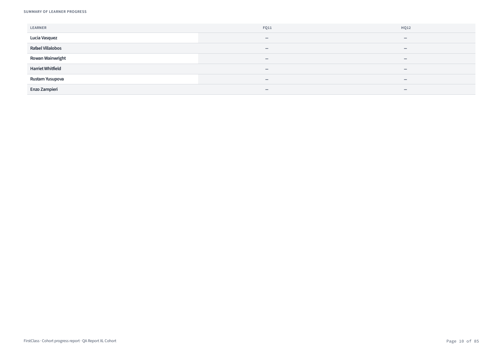

Readable and correct, just loose. Constraining the continuation table's width to its content would read
better.

---

## Noted — expected behaviour, recorded because the plan asks for it

### QA 8.7 — the direct media URL serves the PDF to an anonymous user in dev

Guessing `http://127.0.0.1:8000/media/reports/<report-uuid>/cohort-report.pdf` while **logged out**
returns **200 OK** and the PDF:

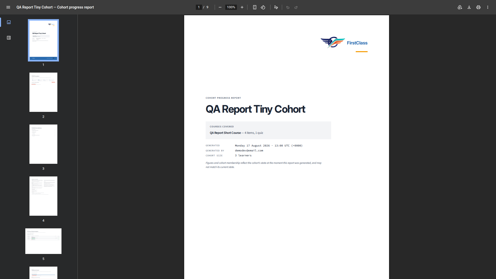

This is exactly what the plan predicts for dev with local file storage, and it is why the storage-alias
system check exists. The control is in place and firing:

```
?: (freedom_ls_reports.W001) REPORTS_STORAGE_ALIAS='reports' is not a key in settings.STORAGES.
   Reports will fall back to the default storage, which may be a publicly served MEDIA_ROOT.
	HINT: Declare a private storage alias in settings.STORAGES.
```

Recording it plainly because the consequence is real: these PDFs carry named learners' progress and
wrong answers, and the UUID is the only thing standing between an anonymous request and the file. A
deployment that ignores W001 leaks them. The admin download path itself is correctly locked down
(QA 8.1–8.6 all pass), so this is purely about the storage backend.

---

## Section-by-section results

### QA 0 — Build the fixture matrix and capture the artifact set — PASS

`qa_create_report_fixtures --reset` built all ten matrix rows plus the two permission users in one pass.
All ten were then generated **through the admin UI**, not the shell. All ten reached `ready`; none
landed in `failed`. See the artifact manifest at the end for page counts.

### QA 1 — Generate a report end to end — FAIL (1.4 only)

| Step | Result |
|---|---|
| 1.2 Reports section present in admin index | Pass — `Freedom_Ls_Reports → Generated reports` |
| 1.2 No "Generate report" button on Cohorts changelist | Pass — no object-tools on that changelist at all |
| 1.3 No "Add generated report" button | Pass |
| 1.3 Link to the Generate cohort report page | Pass |
| 1.4 Generate page usable | **Fail — see Bug 1**; the cohort dropdown does list cohorts |
| 1.6 Redirect + success message + new row | Pass — "Generating a progress report for QA Report Standard Cohort." |
| 1.6 Row reads `ready` immediately | Pass (`ImmediateBackend`) |
| 1.7 Row shows cohort, status, requested by, requested at, finished at, Download | Pass |
| 1.8 Download gives a PDF with a slugified filename | Pass — `qa-report-standard-cohort-progress-report.pdf` |


The download response is a real attachment, not an inline render or a media redirect:

```
content-type: application/pdf
content-disposition: attachment; filename="qa-report-standard-cohort-progress-report.pdf"
cache-control: private, no-store, must-revalidate, max-age=0, no-cache
```

### QA 2 — Read the PDF — PASS

Read `standard-cohort-medium-course.pdf` in full; spot-checked `tiny-cohort-short-course.pdf` and
`xl-cohort-long-course.pdf`.

**Wording.** No PDF in the artifact set contains the word "student" anywhere in reader-facing text —
checked across all 14 artifacts. "Learners" throughout.

**2.1 Cover.** Tenant name and logo top right, report title, cohort name, "Courses covered" card with
item and quiz counts, generated-at timestamp **with timezone** (`Monday 17 August 2026 · 12:46 UTC
(+0000)`), generated by, cohort size, the as-of caveat, and the brand band across the foot. No running
header, footer line or page number on the cover.

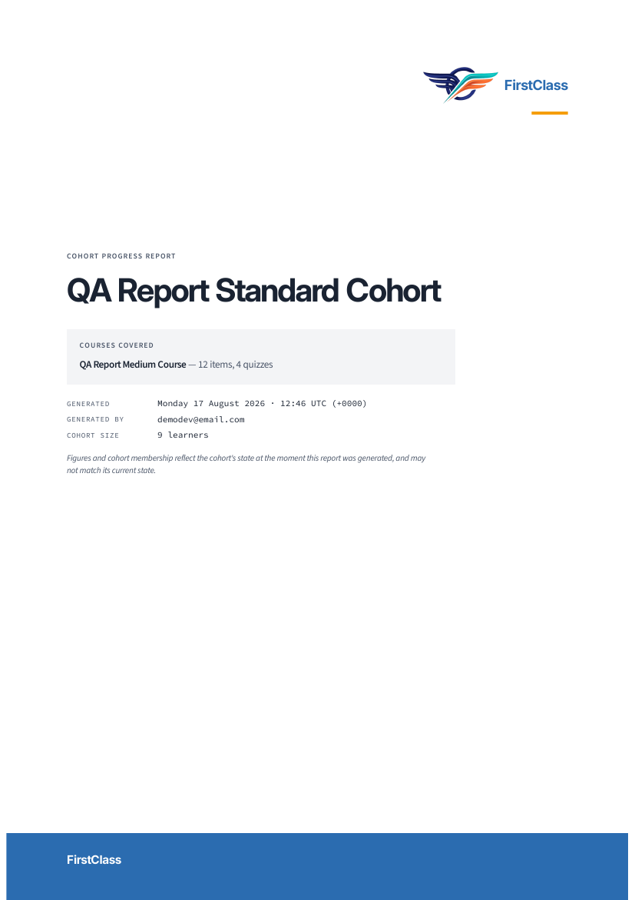

*Logo unset* — cover renders with the name alone and the accent rule beneath it, no gap where the logo
was. Reads as finished:


*"Powered by" unset (the default)* — zero occurrences of "Powered by" anywhere in
`standard-cohort-medium-course.pdf`, `tiny-cohort-short-course.pdf` or `xl-cohort-long-course.pdf`.

*"Powered by" set* — name and logo appear in the cover band, and the name is appended to **every** page
footer (pages 2–9 of a 9-page report, all verified):


No organisation appears anywhere that FLS does not store. Settings were restored afterwards;
`git diff config/settings_dev.py` is clean.

**2.2 Cohort at a glance.** Four stat cards, "3 of 9 flagged", the attention list with page references.

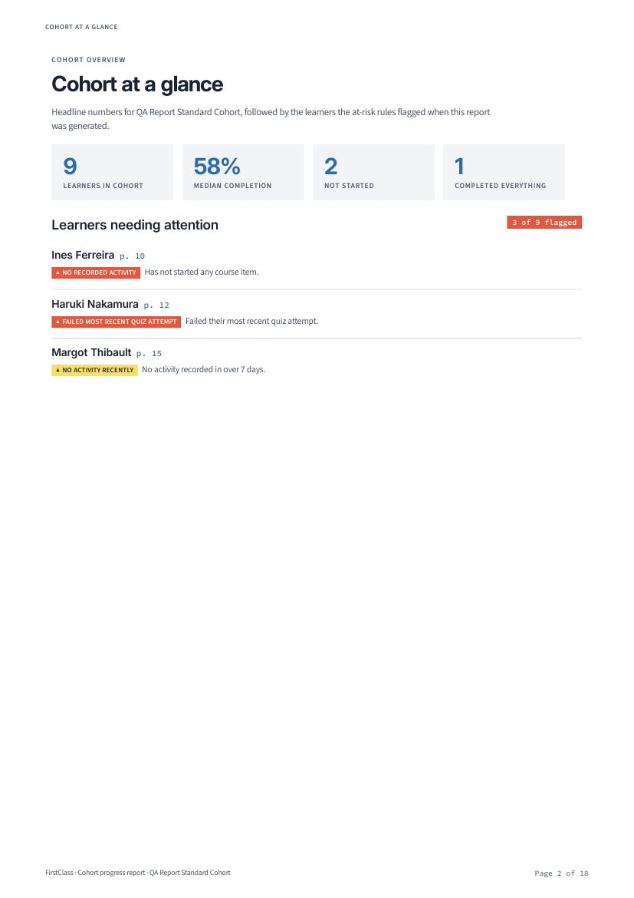

The page references are **live PDF link annotations**, not just printed text. Resolved with `pypdf`:
`Ines Ferreira p. 10 → page 10`, `Haruki Nakamura p. 12 → page 12`, `Margot Thibault p. 15 → page 15` —
all three match both the printed number and the learner's actual section.

**2.3 Contents and definitions.** Real page numbers with dot leaders, two levels (numbered sections, then
courses / learners / quizzes). Every contents row is clickable. The PDF outline mirrors the contents
exactly:

```
- Cohort at a glance -> 2        - Details per learner -> 6
- Contents and definitions -> 3      - Chidi Abara -> 6
- Summary of learner progress -> 5   - Sanne Bergström -> 8   ... (all 9 learners)
  - QA Report Medium Course -> 5 - Quiz confusions across the cohort -> 17
```

The definitions block covers all nine required points — complete/recomputed, latest attempt, completed
attempts only, the first-attempt rule and why, multi-select rescoring, no-pass-mark means no verdict,
Activities and free-text excluded and why, individually-registered courses not covered, and the RAG
legend with glyphs.

**2.4 Summary of learner progress.** One landscape table per course. In `two-course-cohort.pdf` both
courses get a section and the inactive one is marked — on the cover
(`QA Report Second Course — 8 items, 2 quizzes (inactive registration)`) and on its summary heading
(`QA Report Second Course (inactive registration)`).

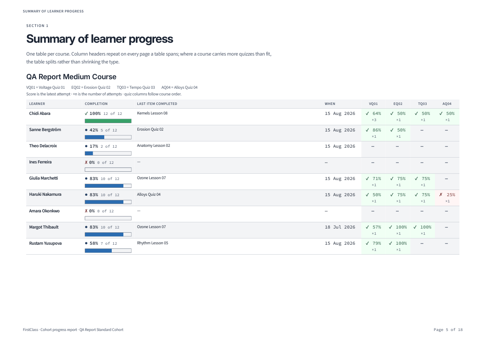

**2.5 Every learner appears.** In `no-progress-cohort.pdf` all 9 learners appear in both the summary table
and their own sections, each showing an explicit **"No activity recorded."** line. Nine learners, nine
such lines.

**2.6 Orientation.** Verified page-by-page: summary tables landscape (841.89 x 595.276), everything else
portrait (595.276 x 841.89).

**2.7 Page numbers.** Every page but the cover, exactly:

| Report | Pages | Pages carrying a number | Expected |
|---|---|---|---|
| standard | 18 | 17 | 17 |
| xl | 85 | 84 | 84 |
| tiny | 9 | 8 | 8 |
| empty | 7 | 6 | 6 |

**2.8 Quizzes with no pass mark.** In `no-pass-mark-cohort.pdf`, VQ01's column shows the score with the
`○` glyph and **no** pass/fail verdict — `○ 75% ×1`, `○ 50% ×1`, `○ 100% ×1`. The quiz does not drop out
of the summary table, the report generates `ready` (17 pages), and the attempts table shows
`○ 75% 3/4` rather than a verdict. The definitions block states the rule.

**2.9 Page furniture.** Section title top left, page number bottom right, and
`FirstClass · Cohort progress report · QA Report Standard Cohort` bottom left. The section title changes
correctly at every boundary and stays correct on continuation pages — verified across all 85 pages of the
XL report.

**2.10 Per-learner quiz attempts.** Chidi Abara's Voltage Quiz 01 shows three rows (attempts 1, 2, 3),
oldest first, each with date and score. The latest (64%) matches the summary table cell `✓ 64% ×3`.
No abandoned sitting appears.

**2.11 Legacy checkbox score shows through unchanged.** The contradiction renders exactly as intended.
Summary table, Lena Legacy → QLCS: `✓ 100% ×1` (the stored score). Her own section, same quiz:

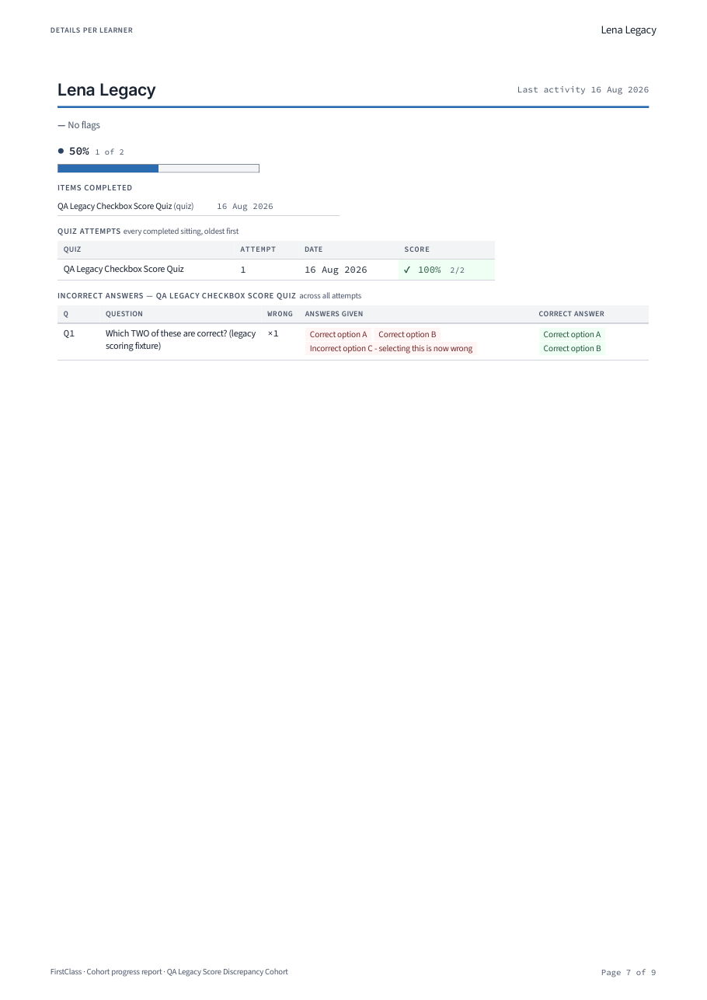

`✓ 100% 2/2` in the attempts table, and immediately beneath it the incorrect-answers table marks the same
question wrong (`×1`, answers given `Correct option A, Correct option B, Incorrect option C - selecting
this is now wrong`). The definitions block explains it rather than leaving the reader to spot it. Kept as
`qa-artifacts/legacy-score-discrepancy.pdf`.

The same cohort carries a clean control — Cari Current made the exact-match selection and scores an honest
`✓ 100% 2/2` with an empty incorrect-answers block.

### QA 3 — Page-break and running-header behaviour — PASS

**3.1 Repeated header rows.** `large-cohort-medium-course.pdf` splits its summary table across pages 5–6
with the full header row repeated, columns aligned identically:


**3.2 No split rows.** Page 5 ends on a complete Elsa Lindqvist row; page 6 opens on Giulia Marchetti.

**3.3 Running headers.** This is the check with the nastiest failure mode, so I dumped the header of every
page of both multi-page reports. Every learner starts on a fresh page, and **every continuation page
carries that learner's own name, not the previous one's**:

- Large (35 pages): Elsa Lindqvist p18–19, Sipho Ndlovu p23–24 — both correct on the second page.
- XL (85 pages): six three-page learners (Ngozi Ekwueme p23–25, Declan Halloran p32–34, Elsa Lindqvist
  p41–43, Camila Quintero p54–56, Erik Solberg p61–63, Enzo Zampieri p76–78) — all correct on pages two
  and three.

No learner name leaks onto a landscape summary page (p5–6 large, p6–10 XL) or into the confusions section
(p34–35 large, p79–85 XL).

**3.4 Alphabetical by surname.** Verified across page boundaries for all 25 large-cohort learners
(Abara … Yusupova) and all 40 XL learners.

**3.5 Quiz column order and legend.** Columns follow course order (VQ01, EQ02, TQ03, AQ04 — not
alphabetical), with the abbreviation legend under the table title. One column per quiz carrying glyph,
latest score and attempt count together.

**Tiny cohort comparison.** `tiny-cohort-short-course.pdf`: 3-learner table on one landscape page, no
split, zero `(continued)` tables, each learner one page.

### QA 4 — At-risk flags are consistent — PASS

**4.1–4.3** Flag label and reason text are byte-identical between the at-a-glance list and the learner's
own section:

| Learner | At a glance | Own section |
|---|---|---|
| Ines Ferreira | `▲ NO RECORDED ACTIVITY — Has not started any course item.` | identical |
| Haruki Nakamura | `▲ FAILED MOST RECENT QUIZ ATTEMPT — Failed their most recent quiz attempt.` | identical |
| Margot Thibault | `▲ NO ACTIVITY RECENTLY — No activity recorded in over 7 days.` | identical |

**4.4** Every badge carries the `▲` glyph as well as its colour, and severities differ by colour (red vs
amber) on top of the glyph.

**4.5** Unflagged learners show an explicit `— No flags` line, not an empty gap. Worth noting the fixture
distinguishes two zero-progress states correctly: Ines Ferreira ("No activity recorded." → flagged) and
Amara Okonkwo ("Started, but nothing completed yet." → not flagged) both read `✗ 0% 0 of 12` in the
summary but are genuinely different states, and the rules treat them differently.

**4.6** In `xl-cohort-long-course.pdf` the at-a-glance list is capped at exactly 12 entries with the
disclosure **"Showing 12 of 18 learners flagged."** All 18 flagged learners still carry their flags in
their own detail sections — counted directly: 6 × NO RECORDED ACTIVITY, 6 × FAILED MOST RECENT QUIZ
ATTEMPT, 6 × NO ACTIVITY RECENTLY = 18, plus 22 × `— No flags` = 40 learners. The six not on the front
page are all present in their own sections. Every printed page reference matches the learner's actual
page.

### QA 5 — Cohort quiz confusions — PASS

**5.2** Each question shows the incorrect answers chosen with counts, the correct answer alongside, ranked
worst-first. Wrong answers and correct answers render as tinted chips.

**5.3** No option anywhere carries a letter or position prefix. (The fixture's option *text* literally
reads "Voltage Q02 option A (correct)" — that string comes from the seeded data, confirmed against
`QuestionOption.text` in the DB, not from the report adding a marker.)

**5.4** Cap disclosure present: *"Showing 10 of 14 questions with at least one incorrect answer."*

**5.5** The interpretive caution appears once, under the section heading: *"Read these tables as prompts,
not verdicts. A high error rate can mean a hard but fair question as easily as a broken one."*

**5.6** The small-n rule flips correctly at the boundary — and importantly the **bar disappears with the
percentage**, which is the part most likely to regress:

| Fixture | Respondents | Renders |
|---|---|---|
| tiny (3 learners) | 1 | `1 of 1 learners`, no bar |
| small (9 learners) | 6 | `3 of 6 learners`, no bar |
| large (25 learners) | 17 | `35% of 17 learners` **with** proportion bar |

Small — plain counts, no bar:

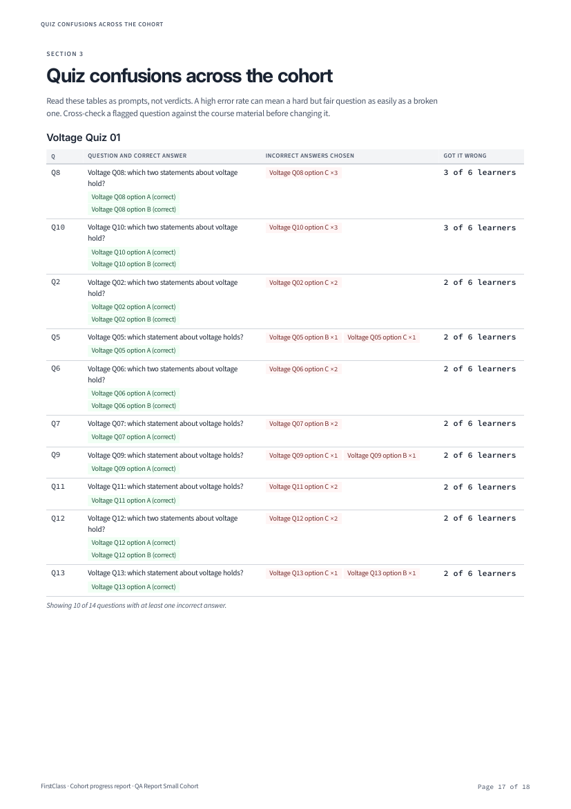

Large — percentages with bars:

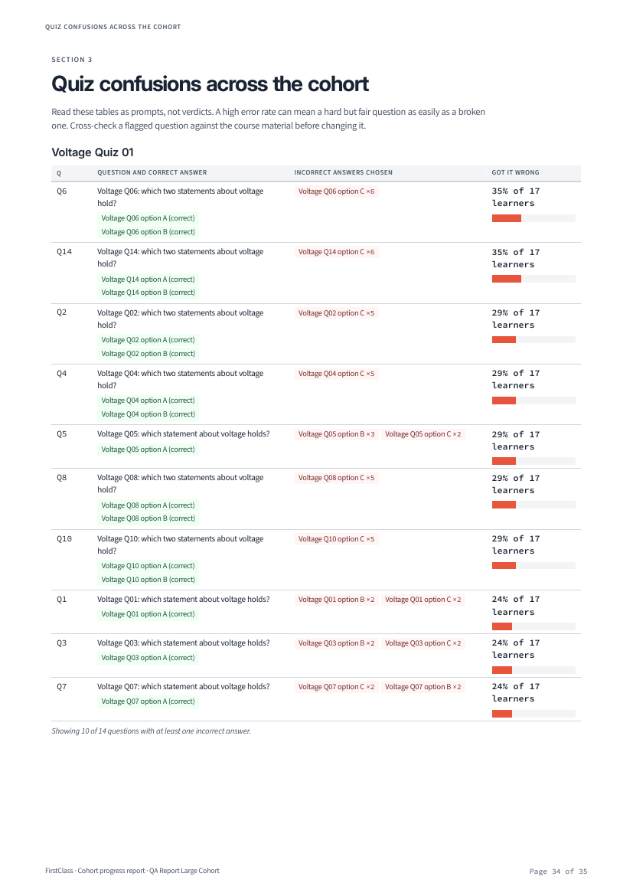

Note the threshold is per-question respondent count, not cohort size: in the 25-learner report, quizzes
only 9 or 4 learners reached still print plain counts (`3 of 9 learners`, `2 of 4 learners`). That is the
right behaviour — the rule is about small n, not about cohort size.

**5.7** Cross-check confirmed disagreeing, correctly. Chidi Abara's Voltage Q02 reads `×3` in his own
section (counted per attempt, three sittings) while the cohort confusions section counts him once
(`Voltage Q02 option C ×2 / 2 of 6 learners`, first attempts only). The definitions block explains why.

### QA 6 — Greyscale legibility — PASS

Rasterised `xl-cohort-long-course.pdf` at 150 dpi greyscale.

**6.2–6.3** Every status cell carries a glyph as well as its number: `✓` complete/passed, `✗` failed/not
started, `●` in progress, `○` attempted-no-verdict, `—` not applicable, `▲` flag. No two statuses are
distinguishable by shade alone. Completion bars stay legible.


**6.4** No `.notdef` boxes or missing-character rectangles anywhere — checked the definitions legend, the
summary cells, the completion bars, the flag badges and the quiz attempts table:


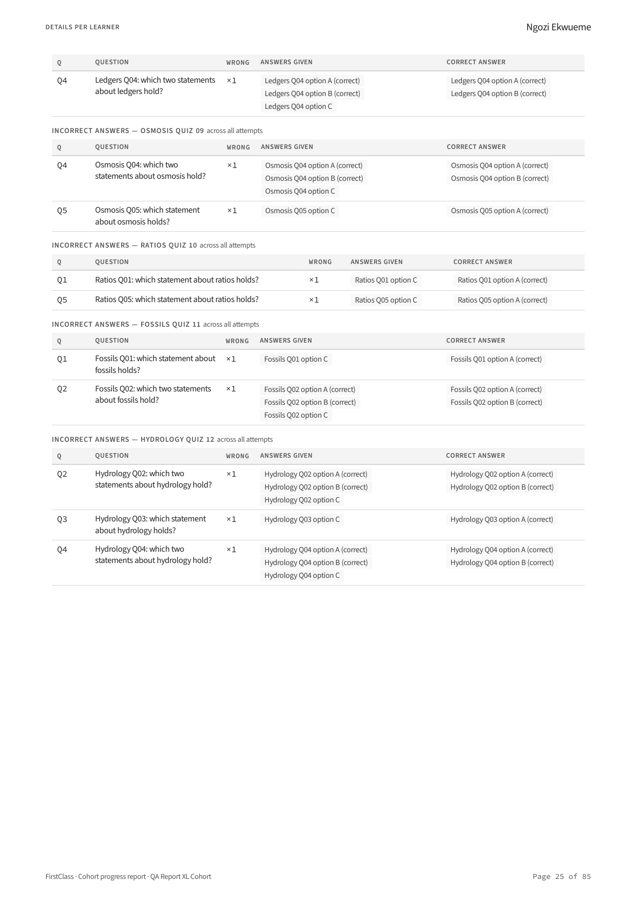

**6.5** No glyph renders as a colour emoji.

**6.6** `pdffonts` lists 17 faces. **All embedded, all subsetted**, and every one belongs to a configured
family — Inter, Source Sans 3, Source Code Pro, DejaVu Sans. No system font, no synthesised bold/oblique
of an unembedded weight:

```
QTPUDH+Source-Code-Pro            emb yes  sub yes
ZRAHXU+Inter-Bold                 emb yes  sub yes
APDWCE+Source-Sans-3-Semi-Bold    emb yes  sub yes
SOQRSN+Source-Sans-3-Italic       emb yes  sub yes
UWGIWA+DejaVu-Sans-Bold           emb yes  sub yes   ← the glyph fallback face
... 17 total, all emb=yes
```

### QA 7 — Landscape column budget — PASS, budget of 10 holds

Used `xl-cohort-long-course.pdf` (long course, **12 quizzes**, past the cap).

**7.3** Nothing is clipped at the right margin, type is not shrunk, and the two quizzes past the cap move
into a `QA Report Long Course (continued)` table carrying `FQ11 = Fossils Quiz 11` and
`HQ12 = Hydrology Quiz 12`.

**7.4 The boundary still holds.** The first table carries exactly **10** quiz columns (VQ01…RQ10, 14
columns in all), and every item title under "Last item completed" keeps a clear gap before "When" —
including the longest ones present (`Turbines Lesson 15`, `Cadence Lesson 11`, `Hydrology Quiz 12`,
`Ecology Lesson 04`). Nothing touches or overlaps the date column.

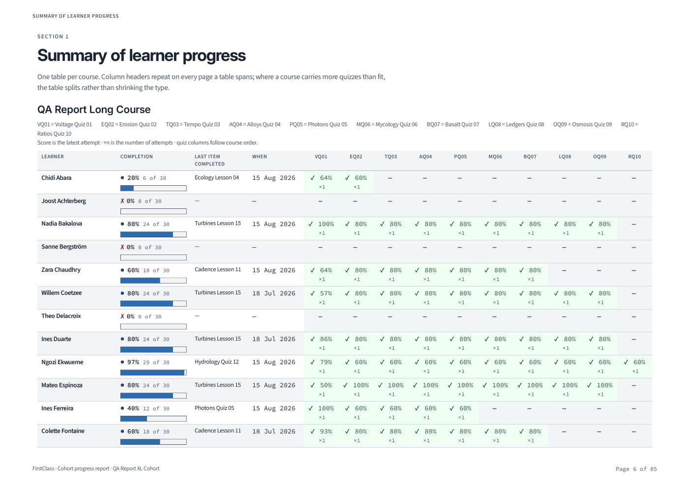

**7.5 No re-measure needed.** The budget has not drifted, so per the plan this stays a regression check
rather than an open sign-off. `REPORTS_MAX_QUIZ_COLUMNS` remains 10 and no `--long-course-quizzes`
escalation was required — the fixture's 12 quizzes were enough to force the split. No
`xl-cohort-long-course_column-overflow.pdf` was produced this run, deliberately: that artifact only exists
to evidence a budget *change*, and there was none.

### QA 8 — Permissions and access control — PASS

| Check | Result |
|---|---|
| 8.1 Anonymous hits download URL | **Pass** — 302 to `/admin/login/?next=…`, never the PDF |
| 8.2 Restricted staff, cohort B download | **Pass** — 403, not the PDF, not a 500 |
| 8.2b Same user, cohort A download | **Pass** — serves the PDF (permission works both ways) |
| 8.3 Cohort B absent from generate dropdown | **Pass** — dropdown contains exactly one option |
| 8.4 Forced POST with cohort B's id | **Pass** — 404, and no row created |
| 8.5 No `/media/` link in changelist source | **Pass** — zero matches in the rendered HTML |
| 8.6 Caching and disposition headers | **Pass** |
| 8.7 Direct media guess | Serves the file in dev — see "Noted" above |


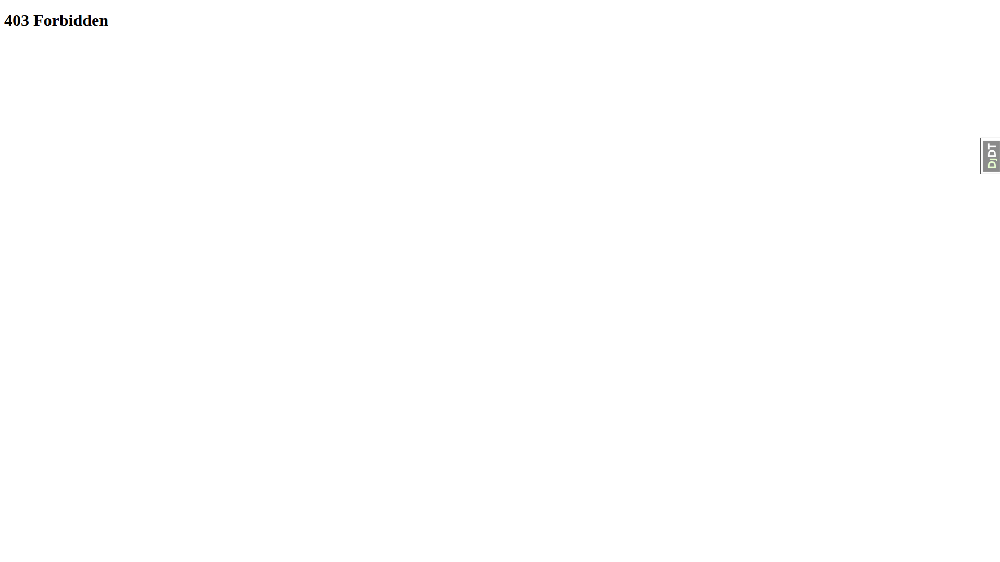

The restricted user's dropdown, holding `view_cohort` on one cohort only:

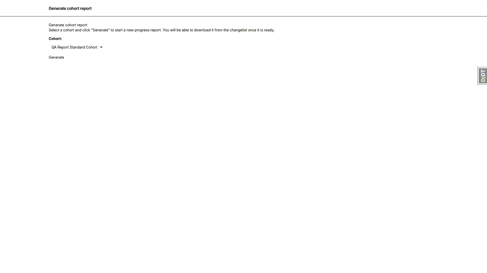

**8.4** I injected an extra `<option>` carrying the XL cohort's id via devtools and submitted. The request
was rejected with 404:

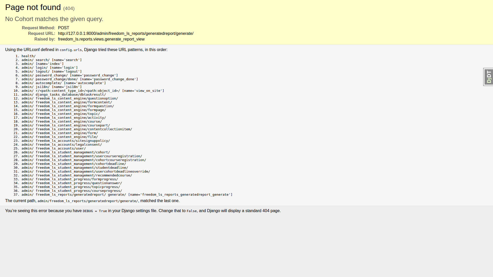

Verified as admin afterwards that no row was created — the XL cohort still has exactly one report, the one
the admin generated at 12:48.

**8.6** Headers on the download response:

```
cache-control: private, no-store, must-revalidate, max-age=0, no-cache
content-disposition: attachment; filename="qa-report-standard-cohort-progress-report.pdf"
content-type: application/pdf
```

The plan asks for `private, no-store, must-revalidate`; the response is a strict superset of that (Django's
`never_cache` adds `max-age=0, no-cache`), which is stronger, not weaker.

### QA 9 — Failure branches — PASS

**9.1 Concurrent generate.** Set an existing report's status back to `pending` in the shell, then submitted
the generate form for that cohort. Result: the informational message **"A report for this cohort is already
being generated."**, no new row (the cohort's report count was unchanged), and no 500:


**9.2 Failed render.** Moved `static/vendor/tailwind.output.css` aside and generated. The row went to
**failed** with `finished_at` set, an empty Download column, no stuck `running` row, and a genuinely
readable error message:

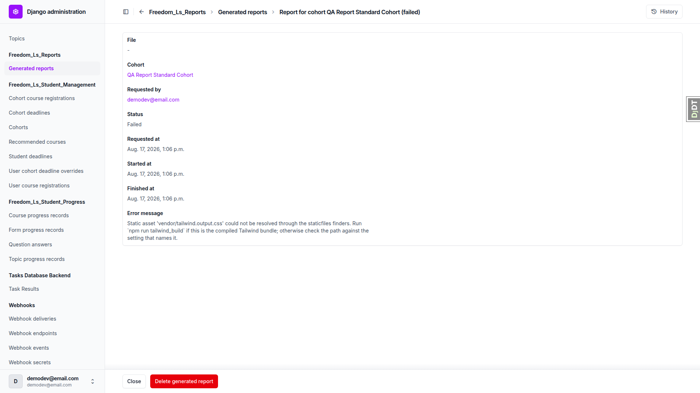

> Static asset 'vendor/tailwind.output.css' could not be resolved through the staticfiles finders. Run
> `npm run tailwind_build` if this is the compiled Tailwind bundle; otherwise check the path against the
> setting that names it.

**9.3 Retry after failure.** Restored the file and regenerated for the same cohort. It succeeded
immediately — a failed report does not block the cohort. The retry PDF is complete, not truncated: 18
pages, matching the original's 18, ending correctly on "Page 18 of 18". Kept as
`standard-cohort-medium-course_retry.pdf`.

**9.4 No download link for non-ready rows.** The `pending`, `running` and `failed` rows all show an empty
Download column, and hitting their download URLs directly returns **404** (verified against both a
`pending` and a `failed` report).

**9.5 Cohort with zero students.** Generated a valid 7-page PDF that says so explicitly rather than
crashing or rendering blank:

- Summary section: *"This cohort has no learners."*
- Details section: *"This cohort has no learners, so there are no individual sections to show."*
- Attention list: *"No learners currently flagged."*
- Confusions: *"No quiz in this report has any incorrect answers to analyse."*

**9.6 Cohort with no course registrations.** Generated a valid 11-page PDF stating it:

- Cover, Courses covered card: *"No courses are registered to this cohort."*
- Summary section: *"There are no course registrations to summarise."*

All five learners still get their own detail sections, each showing `— No course items` and
*"No activity recorded."*

### QA 10 — Deletion and system checks — PASS

**10.1–10.2 Single delete.** Noted a ready report's on-disk path and confirmed it existed, then deleted the
row from the admin. Afterwards: `row exists: False`, `file exists: False`, and the containing directory was
removed too.

**10.3 Bulk delete.** Selected two reports and ran the admin's *Delete selected generated reports* action.
Both rows and both files gone from disk.

**10.4 Cohort delete cascade.** Generated a report for a throwaway cohort, confirmed its PDF on disk, then
deleted the **Cohort** from the admin. Afterwards: cohort gone, report row gone, and the PDF gone from
disk. No orphaned PDF containing learner names — this is the failure the check exists to catch, and it did
not occur.

**10.5 Storage alias check.** `manage.py check` emits `freedom_ls_reports.W001` naming the unconfigured
`reports` storage alias and warning about the publicly served MEDIA_ROOT fallback.

**10.6 Tailwind bundle check.** With the bundle moved aside, `manage.py check` emits
`freedom_ls_reports.W002` naming `npm run tailwind_build`. Restoring the file clears it.

**10.7 Font check.** Renaming `Inter-Variable.ttf` produced `freedom_ls_reports.W004` naming that exact
path, **and** a report generated while it was renamed landed in `failed` with a matching error rather than
rendering in a substituted face. Restoring the file cleared both the warning and the failure — the next
generation came back `ready` with no error. (Warning duplication noted as M1 above.)

---

## Artifact manifest

All PDFs in `qa-artifacts/`. The directory was deleted by hand before the run, as the plan requires, so
everything below is this run's output.

| Fixture key | Cohort size | Course length | File | Pages | What it demonstrates |
|---|---|---|---|---|---|
| `empty-cohort` | 0 | short (4 items, 1 quiz) | `empty-cohort.pdf` | 7 | Zero learners stated explicitly in every section, no crash (QA 9.5) |
| `no-registrations` | 5, no registrations | — | `no-registrations.pdf` | 11 | "No courses are registered to this cohort" on the cover and in the summary (QA 9.6) |
| `tiny-cohort-short-course` | 3 | short (4 items, 1 quiz) | `tiny-cohort-short-course.pdf` | 9 | Smallest real report; single landscape page, no table split, plain counts at n=1 |
| `small-cohort-medium-course` | 9 | medium (12 items, 4 quizzes) | `small-cohort-medium-course.pdf` | 18 | Small-n rule: plain counts, **no percentage and no bar** (QA 5.6) |
| `standard-cohort-medium-course` | 9 | medium | `standard-cohort-medium-course.pdf` | 18 | The baseline read-through; three-attempt quiz history (QA 2.10) |
| `large-cohort-medium-course` | 25 | medium | `large-cohort-medium-course.pdf` | 35 | Summary table spanning two pages with repeated header; percentages and bars in confusions |
| `xl-cohort-long-course` | 40, 18 flagged | long (30 items, 12 quizzes) | `xl-cohort-long-course.pdf` | 85 | Both caps at once — attention list capped at 12, quiz columns split at 10; the greyscale and font source |
| `two-course-cohort` | 9 | medium + inactive second | `two-course-cohort.pdf` | 20 | Both courses sectioned, inactive registration marked in both places (QA 2.4) |
| `no-progress-cohort` | 9, zero progress | medium | `no-progress-cohort.pdf` | 15 | Every learner takes the "No activity recorded" branch (QA 2.5) |
| `no-pass-mark-cohort` | 9 | medium, first quiz no pass mark | `no-pass-mark-cohort.pdf` | 17 | Score with `○` and no verdict; report generates rather than failing (QA 2.8) |

### Variants

| File | Pages | What it demonstrates |
|---|---|---|
| `standard-cohort-medium-course_retry.pdf` | 18 | QA 9.3 — regeneration after a forced failure; complete, matches the original page count |
| `tiny-cohort-short-course_no-logo.pdf` | 9 | QA 2.1 — cover with `HEADER_LOGO_STATIC_PATH` unset; name alone, no gap |
| `tiny-cohort-short-course_powered-by.pdf` | 9 | QA 2.1 — `REPORTS_POWERED_BY_*` configured; cover band plus every page footer |
| `legacy-score-discrepancy.pdf` | 9 | QA 2.11 — stored full-marks score above, same question marked wrong below |

### Deliberate absences

| Fixture / variant | Why it is missing |
|---|---|
| QA 9.2 forced-failure PDF | By design — the failed render produces no file. Recorded instead by the `failed` row screenshot, `desktop_9.2_failed_report_detail_error_message.png`. |
| `xl-cohort-long-course_column-overflow.pdf` | Not produced. That artifact is the evidence behind a **change** to `REPORTS_MAX_QUIZ_COLUMNS`. The budget did not drift (QA 7.4 passed at 10), so there was nothing to evidence and the setting was not touched. |

Every fixture in the matrix produced a PDF. None failed to build.

---

## Anything unrelated or tangential that looked off

None of these are report bugs; they are pre-existing and project-wide, noted because the plan asks.

- **Admin app labels read as `Freedom_Ls_Reports`.** The admin index and breadcrumbs show
  `Freedom_Ls_Reports`, `Freedom_Ls_Accounts`, `Freedom_Ls_Content_Engine`,
  `Freedom_Ls_Student_Management`, `Freedom_Ls_Student_Progress` — the raw app labels with underscores
  title-cased. The plan calls the section "Reports"; it is there, just labelled awkwardly. Consistent
  across all five FLS apps, so this is a project-wide `verbose_name` gap, not something the reports app
  introduced.
- **Admin login page title reads "Log in | None".** The admin site header is unset, so `None` renders in
  the `<title>`. Visible on the QA 8.1 screenshot.
- **`/favicon.ico` 404s on every admin page load** — the one console error present throughout the run.

## Difficulties and deviations

- **Port choice** — see the note at the top. The plan's `find_available_port.sh` output could not be used.
- **Screenshot compression (Step 8)** — `compress_screenshots.py` must be run from the project root (it
  looks for `spec_dd/` relative to cwd) and only touches PNGs over 1024 KB. No screenshot this run exceeded
  that, so it reported "No PNG files over 1024KB found" and compressed nothing. The 29 screenshots total
  3.1 MB.
- **PDF review method** — no PDF viewer GUI was available, so the PDFs were read via `pdftotext -layout`
  for content and `pdftoppm` for visual rendering, with `pypdf` used to resolve link annotations and the
  document outline. The "click a page reference and check it jumps" check (QA 2.2) was therefore verified
  by resolving each link annotation's named destination to its page number rather than by clicking in a
  viewer — a stricter check, since it confirms the target as well as the jump.
- **QA 2.11 delegation** — `fls-dev:qa-data-helper` reported the `QA Legacy Score Discrepancy Cohort`
  fixture (built by the existing `qa_create_legacy_checkbox_score` command) was already correct against the
  current gather/render code and created nothing. Its attempt timestamps read 16 Aug 2026 because the data
  genuinely predates this run; that is cosmetic and does not affect the check.
- **Environment restored** — `config/settings_dev.py`, `static/vendor/tailwind.output.css` and
  `freedom_ls/reports/static/reports/fonts/Inter-Variable.ttf` were all temporarily modified or moved for
  QA 2.1, 9.2 and 10.7, and all were restored. `git status` shows no changes to any of them.
