# QA report — Cohort progress PDF report (report generation)

**Plan:** `3a. report_generation_qa/frontend_qa_report_generation.md`
**Run date:** 2026-08-21
**Branch:** `basic_reports` (debug-branch-badge confirmed)
**Server:** `http://127.0.0.1:8114/` — own `runserver`, started and killed by this run
**Driver:** Playwright MCP, desktop 1920×1080. Mobile and tablet passes do not apply to this plan
(every surface is Django admin or a PDF), as the plan states.

**Trigger for this re-run:** the organisation changes. QA 2.1 and QA 8 both changed, and QA 8.8–8.11
are new. Those sections were the focus, but the whole plan was executed.

## Result

**No functional bugs found.** Every section of the plan was executed and passed, including all four
new organisation checks (QA 8.8–8.11) and the reworked cover/footer in QA 2.1.

Three low-severity findings are recorded below: one behavioural deviation from a written expectation
(QA 8.9), one cosmetic duplication in `manage.py check` output (QA 10.7), and one grammar nit. None
of them blocks the feature.

Four observations that are not defects in this feature are recorded separately, including one
pre-existing dev-database housekeeping issue and one stale sentence in the plan itself.

---

## Findings

### 1. QA 8.9 — a foreign-organisation user gets a redirect, not the 404 the plan specifies

**Test:** QA 8.9 — "**Expect** an empty changelist, an empty generate dropdown, a **404** on any
fixture report's change page, and a **403** on any fixture report's download URL."

**Expected:** HTTP 404 on the change page.

**Actual:** HTTP 302 to `/admin/`, carrying Django's standard message
*"generated report with ID “09d3c55d-…” doesn't exist. Perhaps it was deleted?"*

The other three halves of QA 8.9 all pass: the changelist is empty, the generate dropdown is empty
(zero options), and the download URL returns **403**.

**Severity: low — this is not an information leak.** The response is byte-identical to what the same
user gets for a UUID that has never existed, so it discloses neither the report's existence nor the
cohort's name (verified: the response body does not contain `QA Report Standard Cohort`). It is
Django's default `ModelAdmin` behaviour for an object outside the admin's queryset.

The gap is between the code and the plan's wording, and either side could move: raise `Http404` in
the admin's `get_object`, or soften QA 8.9 to accept "404 or redirect-with-generic-message". Worth a
decision rather than a silent mismatch.

### 2. QA 10.7 — one missing font file produces four identical `W004` warnings

**Test:** QA 10.7 — rename a file under `freedom_ls/reports/static/reports/fonts/` and run
`manage.py check`.

**Expected:** a `freedom_ls_reports.W004` warning naming that path.

**Actual:** the warning is correct and names the path, but it is emitted **four times**, identically:

```
?: (freedom_ls_reports.W004) Report font face 'Inter' names 'reports/fonts/Inter-Variable.ttf',
   which could not be resolved through the staticfiles finders. Reports will fail to render.
   HINT: Correct the static_path in REPORTS_FONT_FACES, or add the font file to a static
   directory the finders search.
   [× 4]
System check identified 5 issues (0 silenced).
```

The Inter family declares four weights in `REPORTS_FONT_FACES` that all resolve to the same variable
font file, and the check tests each face independently. Technically each face *is* unresolvable, but
the operator sees one problem reported four times and an inflated issue count.

**Severity: cosmetic.** Deduplicating by `static_path` before reporting would make the output read
truthfully. The rest of QA 10.7 passes fully — see the pass table.

### 3. QA 5.6 — "1 of 1 learners" is not pluralised

**Test:** QA 5.6, `tiny-cohort-short-course.pdf`.

**Expected:** plain counts at small n (which is correct).

**Actual:** the count renders as `1 of 1 learners` where `1 of 1 learner` is correct English. Only
reachable when exactly one learner attempted the quiz, so it shows up on the smallest fixtures.

**Severity: cosmetic.**

---

## Observations (not defects in this feature)

### A. QA 8.7 — the media URL does serve the PDF anonymously in dev

`GET /media/reports/<uuid>-cohort-report.pdf` while logged out returns **200, `application/pdf`,
622,555 bytes**. The plan anticipates exactly this ("In dev with local file storage this may serve
the file — that is why the storage-alias system check exists") and names the `manage.py check`
warning as the control. That control fires:

```
?: (freedom_ls_reports.W001) REPORTS_STORAGE_ALIAS='reports' is not a key in settings.STORAGES.
   Reports will fall back to the default storage, which may be a publicly served MEDIA_ROOT.
   HINT: Declare a private storage alias in settings.STORAGES.
```

Recording it here because a downstream project that ignores W001 publishes every learner's name,
score and wrong answers at a guessable URL. The admin download path itself is clean — QA 8.5
confirms no changelist link contains `/media/`.

### B. `media/reports/` holds 508 PDFs against 13 report rows — historical, not a live leak

The dev database's media directory contains 508 report PDFs and 187 empty directories (the latter
left by the older per-report-directory layout that was since fixed).

**This run created none of them.** Deletion was verified working on all three paths:

| Path | Row removed | File removed |
|---|---|---|
| Single delete from the changelist (QA 10.2) | yes | yes |
| Bulk `delete_selected` on two reports (QA 10.3) | yes | yes |
| Cohort deleted, reports cascade (QA 10.4) | yes | yes |

The newest orphaned file predates this run's first generate. So the 508 are debris accumulated by
earlier QA runs before the deletion fix landed. A `manage.py` housekeeping command to sweep
report files with no matching row would clean up dev boxes, but nothing in the current code leaks.

### C. The plan contradicts itself about the running footer

QA 2.1 (rewritten for organisations) requires the footer to read
`<site> · <organisation> · Cohort progress report · <cohort>`.
QA 2.9 still says it must read `{site} · Cohort progress report · {cohort}` **"and nothing else"**.

The build matches QA 2.1 — every non-cover page carries
`FirstClass · DemoDev · Cohort progress report · QA Report Standard Cohort`. QA 2.9's sentence is a
leftover from before the organisation work and should be updated to match QA 2.1.

### D. `tiny-cohort-short-course_powered-by.pdf` was not regenerated, by design

The plan notes this artifact predates the removal of the `REPORTS_POWERED_BY_*` settings and cannot
be regenerated. It is absent from this run's `qa-artifacts/`. Confirmed instead by search: **none**
of the 13 PDFs generated this run contains the string "Powered by", on the cover or in any footer.

---

## Section-by-section results

### QA 0 — fixture matrix and artifact set — PASS

`uv run manage.py qa_create_report_fixtures --reset` built all eleven fixtures plus the four
permission users in one pass, with no manual data work needed. The `fls-dev:qa-data-helper` agent was
**not** required: every scenario the plan calls for, including the QA 2.11 legacy-score cohort and
the QA 8.8–8.11 organisation-role users, was already reproducible from the seeding commands.

Ten matrix fixtures plus `blank-answer-cohort` were generated through the admin UI and all reached
**ready**. Page counts and column counts are in the manifest below.

### QA 1 — generate end to end — PASS

- Reports → Generated reports present in the admin index; **no** "Generate report" button on the
  Cohorts changelist (confirmed by text search of the changelist content region).
- **No** "Add generated report" button; a "Generate cohort report" link is present.
- Cohort dropdown populated; submit redirects to the changelist with
  *"Generating a progress report for QA Report Standard Cohort."*
- Row shows organisation, cohort, status **Ready**, requested-by `demodev@email.com`, requested-at,
  finished-at and a **Download** link.
- Download returns a real PDF (`%PDF-`, 622,555 bytes) as an attachment named
  `qa-report-standard-cohort-progress-report.pdf` — slugified, not the raw cohort name.

The generate page renders with full unfold styling — sidebar, breadcrumbs, styled Generate button,
single `<h1>`. The previously-reported unstyled-page bug is fixed.

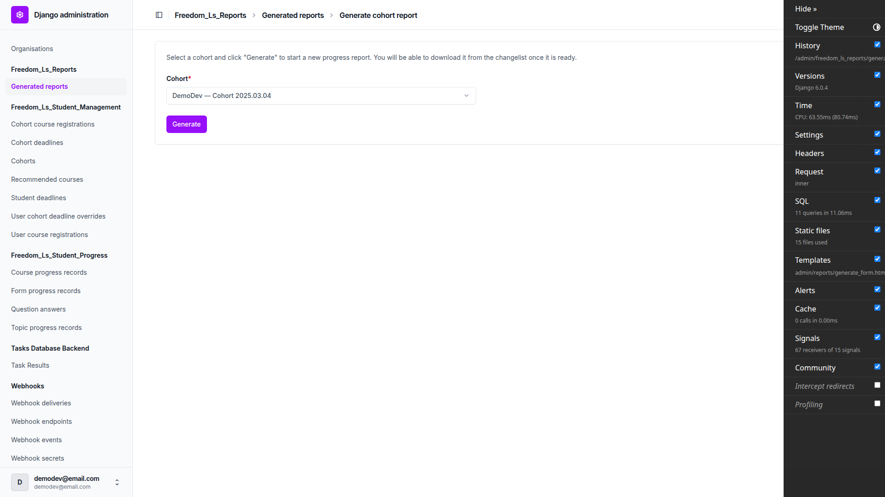

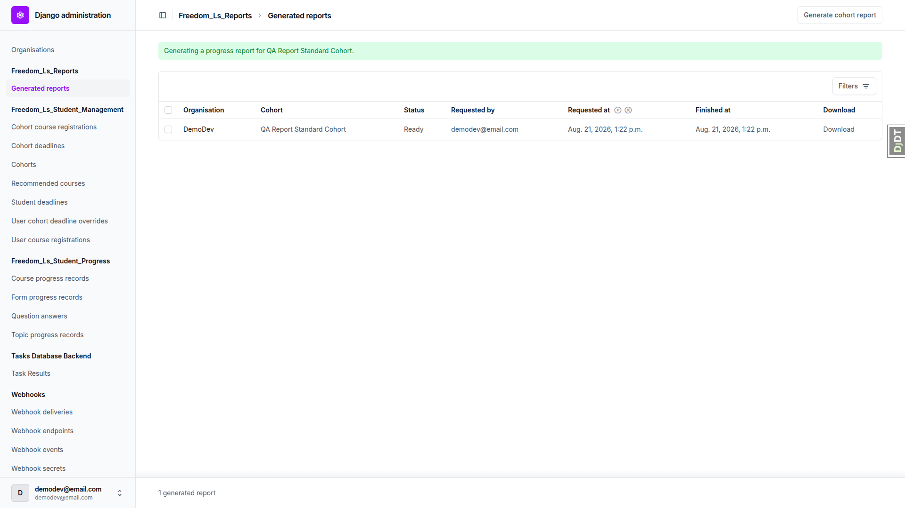

### QA 2 — reading the PDF — PASS (all 12 sub-checks)

Read `standard-cohort-medium-course.pdf` in full; spot-checked `tiny-` and `xl-`.

**2.1 Cover — PASS, including the new organisation line.** Cover carries tenant name (`FirstClass`)
and logo top right, the title, the cohort name, the "Courses covered" card with item and quiz counts,
**ORGANISATION DemoDev**, a timestamped generated-at *with timezone*
(`Friday 21 August 2026 · 13:22 UTC (+0000)`), generated-by, cohort size, the as-of caveat and the
brand band. No running header, footer or page number on the cover. Running footer on every other page
reads `FirstClass · DemoDev · Cohort progress report · <cohort>`. Nothing on the cover names anything
FLS does not store; the organisation's logo is correctly absent.

Logo-unset sub-check: with `HEADER_LOGO_STATIC_PATH = None` the cover renders the name alone with
**no gap where the logo was** — it reads as finished, not as missing a piece.

| with logo | without logo |
|---|---|
| 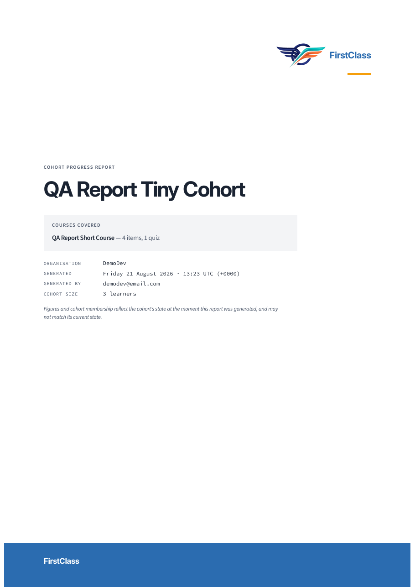 | 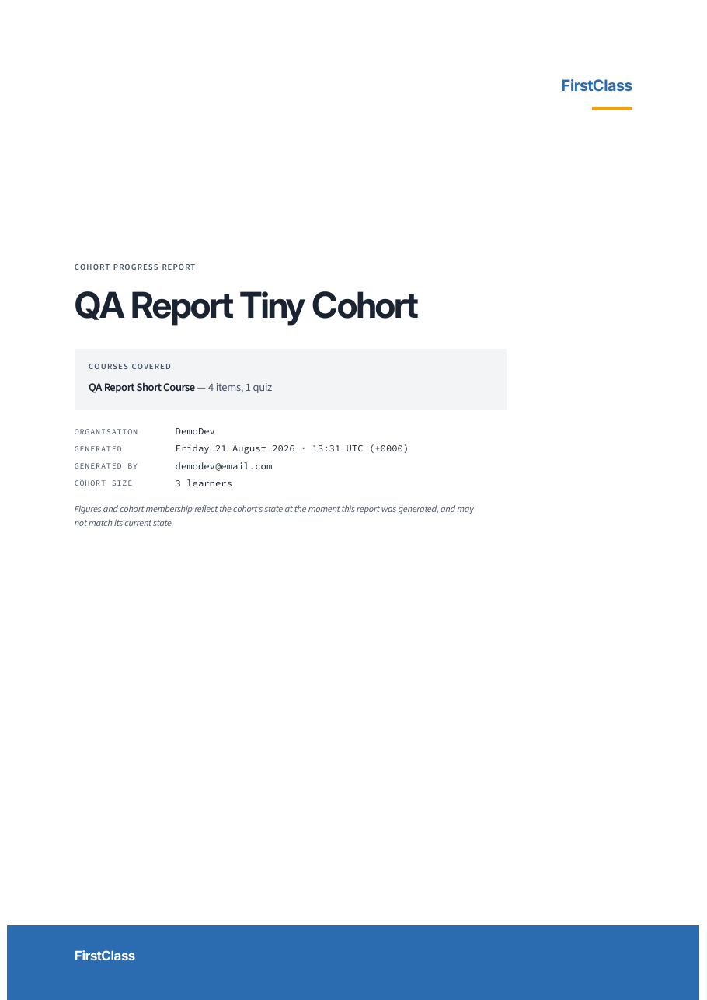 |

**2.2 Cohort at a glance — PASS.** Four stat cards (9 / 58% / 2 / 1 — median independently verified
against the nine completion values), "3 of 9 flagged", and the attention list with page references.
The references are real PDF link annotations: `student-239 → page 10`, `student-238 → page 12`,
`student-237 → page 15`, each matching the printed `p. 10` / `p. 12` / `p. 15`.

**2.3 Contents and definitions — PASS.** Real page numbers with dot leaders, two levels. The PDF
outline mirrors the contents exactly — 18 entries, every learner present once, none duplicated. All
nine required definitions are present: recomputed completion, latest-attempt scoring, completed-only
attempts, the first-attempt rule *and its reason*, the multi-select rescoring caveat, the no-pass-mark
rule, the Activities/free-text exclusion *and its reason*, individually-registered courses, and the
RAG legend with glyphs.

**2.4 Per-course summary tables — PASS.** `two-course-cohort.pdf` sections both courses, and the
inactive one is marked `(inactive registration)` on the cover, in the contents and on the table
heading.

**2.5 Every learner appears — PASS.** `no-progress-cohort.pdf`: all 9 learners appear in the summary
table and each shows an explicit `No activity recorded.` (9 occurrences, one per learner).

**2.6 Orientation — PASS.** Page 5 (summary) is 841.89×595.276 landscape; all other pages are
595.276×841.89 portrait.

**2.7 Page numbers — PASS.** Present on every page but the cover.

**2.8 No pass mark — PASS.** `no-pass-mark-cohort.pdf` renders VQ01 as `○ 75%`, `○ 50%`, `○ 100%`,
`○ 25%` — score present, no verdict, no pass/fail glyph, quiz still in the table, report **ready**.

**2.9 Page furniture — PASS.** Section title top left changes correctly at each boundary
(glance → contents → summary → details → confusions) and holds across multi-page sections. Page
number bottom right. Footer bottom left — see observation C on the footer's format.

**2.10 Quiz attempts table — PASS.** Chidi Abara's section lists all three Voltage Quiz 01 sittings,
oldest first, each with attempt number, date and score. The last row (`✓ 64% 9/14`) agrees with the
summary table's latest-attempt cell (`✓ 64% ×3`). No abandoned sittings appear.

**2.11 Legacy checkbox score — PASS.** `legacy-score-discrepancy.pdf`: Lena Legacy's summary cell
shows the **stored** `✓ 100%`, while her incorrect-answer table marks the same question wrong,
rendering the ticked incorrect option as `✗ Incorrect option C` beside the two `✓` correct ones. The
definitions block explains the discrepancy explicitly. The two numbers appear side by side without
the reader being left to spot a contradiction.

**2.12 Incorrect answers and per-option counts — PASS.** Five columns as specified. The count rule
holds exactly: Chidi Abara missed the same question on all three sittings, so every option reads
`×3`; a learner who missed a question once carries bare chips with **no** count. No count exceeds its
row's "Wrong" figure. Unanswered questions read `Not answered` rather than leaving an empty cell
(verified on `blank-answer-cohort.pdf`).

The report says "learners" throughout — the string "student" appears **nowhere** in any of the
artifacts checked.

### QA 3 — page breaks and running headers — PASS

Header row repeats on every continuation page; no row is split across a boundary.

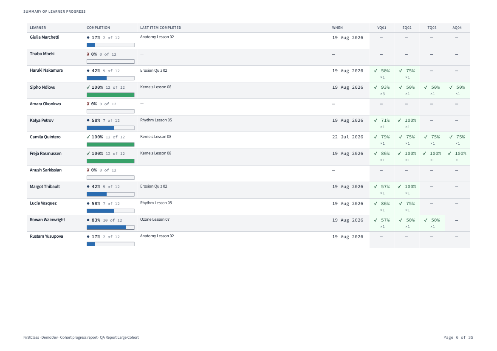

- Each learner starts on a fresh page, and the running header top right carries **that** learner's
  name, including on second and later pages of a long section (Chidi Abara's pages 6 and 7 both).
- No learner's name leaks onto a landscape summary page or into the confusions section.
- Learners are ordered alphabetically by surname in every fixture checked (Abara → Yusupova at n=9;
  Abara → Zampieri at n=40).
- Quiz columns follow course order, with the abbreviation legend under the table title. One column
  per quiz carrying glyph, latest score and attempt count together. Abbreviations keep the quiz
  number (`VQ01`, not `VQ0`).
- `tiny-cohort-short-course.pdf` correctly does *not* split at 3 learners and 1 quiz.

### QA 4 — at-risk flag consistency — PASS

Flag label and reason text are **character-identical** between the at-a-glance page and each
learner's own section:

| Learner | Badge | Reason |
|---|---|---|
| Ines Ferreira | `▲ NO RECORDED ACTIVITY` | Has not started any course item. |
| Haruki Nakamura | `▲ FAILED MOST RECENT QUIZ ATTEMPT` | Failed their most recent quiz attempt. |
| Margot Thibault | `▲ NO ACTIVITY RECENTLY` | No activity recorded in over 7 days. |

Every badge carries the `▲` glyph as well as its colour; the flags panel has a coloured side rule.
An unflagged learner shows an explicit `— No flags` line.

**4.6 caps — PASS.** `xl-cohort-long-course.pdf` lists 12 of 18 with the disclosure
*"Showing 12 of 18 learners flagged."* All 18 flagged learners carry their flag in their own detail
section — the 6 omitted from the front page (Willem Coetzee, Ines Duarte, Ngozi Ekwueme,
Elsa Lindqvist, Erik Solberg, Enzo Zampieri) each have one, and all 12 front-page page references
resolve to the right page.

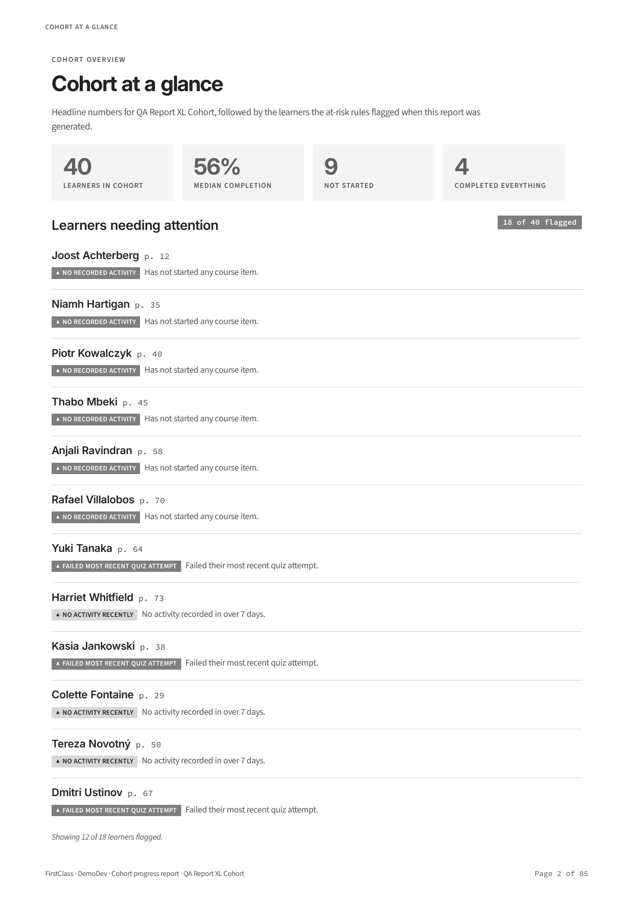

### QA 5 — cohort quiz confusions — PASS

Worst-first ranking, tinted chips for wrong and correct answers, the proportion as a figure with a
bar, the cap disclosure (*"Showing 10 of 14 questions with at least one incorrect answer."*), and the
interpretive caution once under the section heading. No option anywhere is prefixed with a letter or
position marker — the `option A` / `option B` text is the fixture's own option wording, not a
report-added ordering.

**5.6 small-n boundary — PASS, in both directions.**

| Fixture | Learners who attempted | Rendering |
|---|---|---|
| `tiny-cohort-short-course.pdf` | 1 | `1 of 1 learners` — plain count, no bar |
| `small-cohort-medium-course.pdf` | 6 | `3 of 6 learners` — plain count, **no bar** |
| `standard-cohort-medium-course.pdf` | 6 | `3 of 6 learners` — plain count, no bar |
| `large-cohort-medium-course.pdf` | 17 | `35% of 17 learners` — percentage **with** bar |

Percentages carry their denominator, and the bar appears only on the percentage side of the boundary.

| small n — plain counts, no bar | large n — percentages and bars |
|---|---|
| 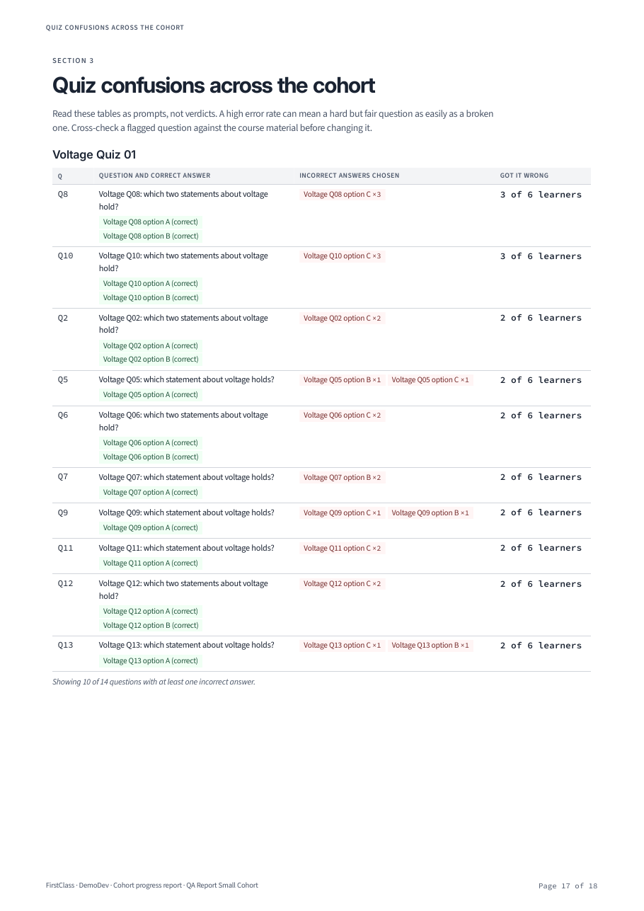 |  |

**5.7 cross-check — PASS.** Chidi Abara's own section counts Voltage Q02 option C at `×3` (per
attempt) while the cohort table counts the same distractor at `×2` across `2 of 6 learners` (first
attempts only). The two disagree, which is correct, and the definitions block explains why.

### QA 6 — greyscale legibility — PASS

Rasterised with `pdftoppm -gray -r 150` from `xl-cohort-long-course.pdf`.

Every status stays unambiguous because each cell carries a glyph as well as a number: `✓` complete,
`✗` failing/not started, `▲` warning, `●` in progress, `○` attempted-no-verdict, `—` not applicable.
No status is distinguishable by shade alone. Completion bars fill proportionally, and the empty track
is visible on banded rows as well as unbanded ones — the previously-reported zebra-stripe collision
is fixed.

No glyph renders as a `.notdef` box or as a colour emoji, anywhere: definitions legend, summary
cells, completion bars, flag badges or the quiz attempts table.

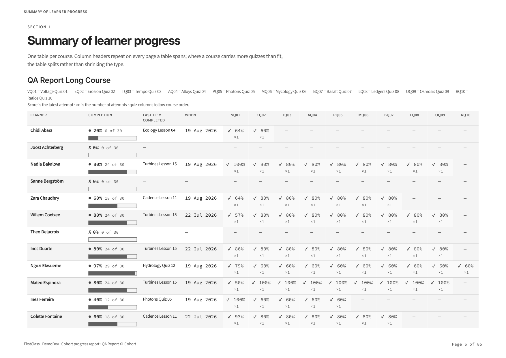

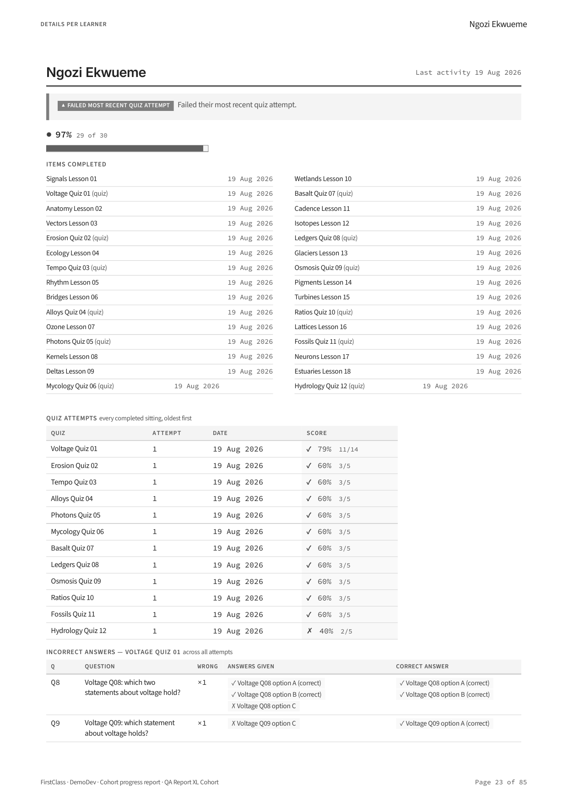

**Fonts — PASS.** All 17 listed faces are embedded and subset, and every one belongs to a configured
family (Inter, Source Sans 3, Source Code Pro, and DejaVu Sans, which is the declared fallback in all
three stacks and carries the glyphs the others lack). No face is a system font, and no weight is a
synthesised bold or oblique of a family whose real weight is not embedded.

### QA 7 — landscape column budget — PASS, budget holds at 10

`xl-cohort-long-course.pdf` carries 12 quizzes, past the cap of 10.

- The first table carries exactly **10** quiz columns (VQ01…RQ10), 14 columns in all.
- The two quizzes past the cap (FQ11, HQ12) move into a `QA Report Long Course (continued)` table,
  which is a second landscape table with its own repeated header row. The type does not shrink and
  nothing is clipped at the right margin.
- The boundary still holds: at 10 quiz columns every "Last item completed" title keeps a clear gap
  before "When" — verified visually at actual size on the rendered page. No title touches or overlaps
  the date.

**The budget has not drifted, so `REPORTS_MAX_QUIZ_COLUMNS = 10` needs no change and no
`xl-cohort-long-course_column-overflow.pdf` artifact was produced.** Re-measurement was not required.
The long course's 12 quizzes remain enough to force the split.

### QA 8 — permissions and access control — PASS (all 11, with finding 1 on 8.9)

| # | Check | Result |
|---|---|---|
| 8.1 | Anonymous hits the download URL | Redirected to admin login, no PDF — **PASS** |
| 8.2 | Restricted staff, cohort B download | **403** (cohort A download still 200 PDF) — **PASS** |
| 8.3 | Restricted staff, generate dropdown | Only `DemoDev — QA Report Standard Cohort` — **PASS** |
| 8.4 | Restricted staff, forced POST with cohort B | **404**, no row created (verified in DB) — **PASS** |
| 8.5 | No `/media/` link on the changelist | None — **PASS** |
| 8.6 | Caching headers on download | `private, no-store, must-revalidate, max-age=0, no-cache` + `attachment` — **PASS** |
| 8.7 | Direct media guess | Serves in dev — expected; see observation A |
| 8.8 | **Organisation role, no per-cohort grant** | Sees all 12 reports, all 15 cohorts in the dropdown, generate succeeds, download streams — **PASS** |
| 8.9 | **Foreign organisation role** | Empty changelist, empty dropdown, 403 on download — **PASS**; change page redirects rather than 404s — see finding 1 |
| 8.10 | **Forced POST from a foreign organisation** | **404**, no row created (verified in DB) — **PASS** |
| 8.11 | **Cohort labels and Organisation column/filter** | Options read `DemoDev — <cohort>`; changelist has an Organisation column and a "By organisation" filter — **PASS** |

QA 8.8 is the check that matters most for the organisation work, and it passes cleanly: a user
holding only `organisation_staff` on the cohorts' organisation, with **no** guardian `view_cohort`
grant anywhere, sees every report, generates a new one and downloads it. An empty list here would
have meant the admin had fallen back to a bare `view_cohort` lookup. It did not.

The generated row is attributed to `qa-report-orgstaff@email.com`, so the requesting-user attribution
also holds on the organisation path.

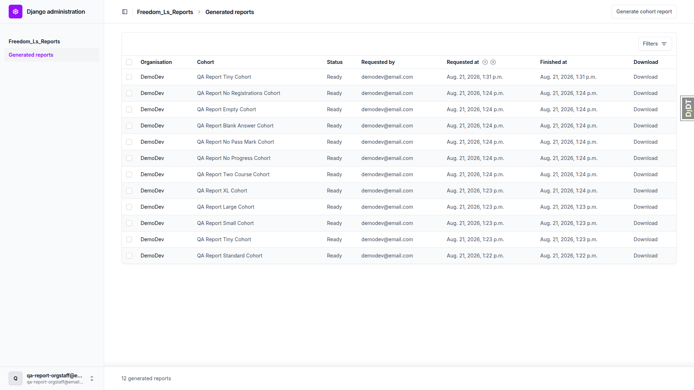

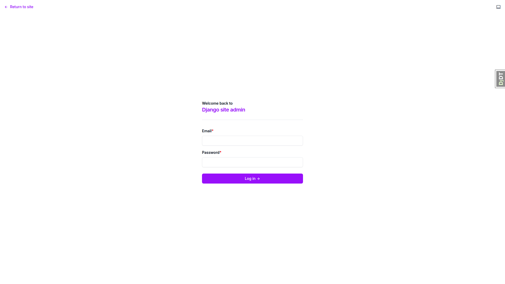

The restricted staff user still sees exactly one report (cohort A only) — the previously-reported
"restricted user sees every cohort" bug stays fixed under the organisation refactor.

### QA 9 — failure branches — PASS

**9.1 Concurrent generate — PASS.** With a report forced to `pending`, resubmitting the same cohort
produces the message *"A report for this cohort is already being generated."* and **exactly one** row
remains. No 500, no duplicate.

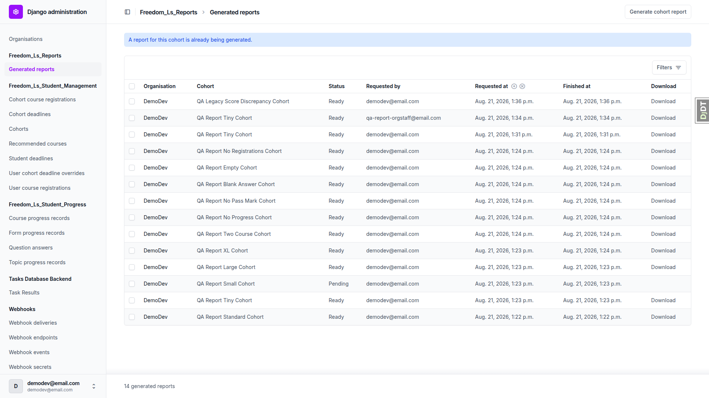

**9.2 Forced render failure — PASS.** With `static/vendor/tailwind.output.css` moved aside and the
server restarted, the report lands in **failed** with `finished_at` set, no download link, no stuck
`running` row, and a readable, actionable error:

> Static asset 'vendor/tailwind.output.css' could not be resolved through the staticfiles finders.
> Run `npm run tailwind_build` if this is the compiled Tailwind bundle; otherwise check the path
> against the setting that names it.

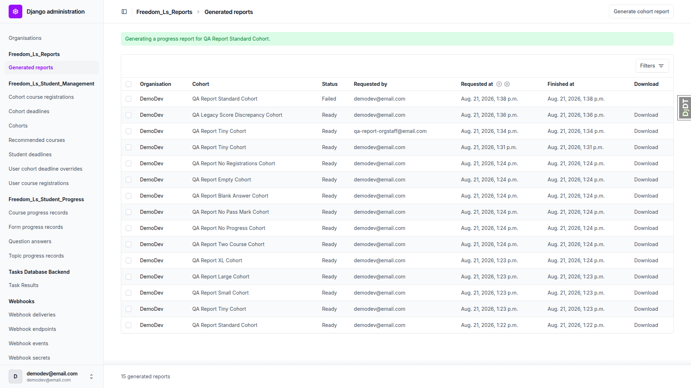

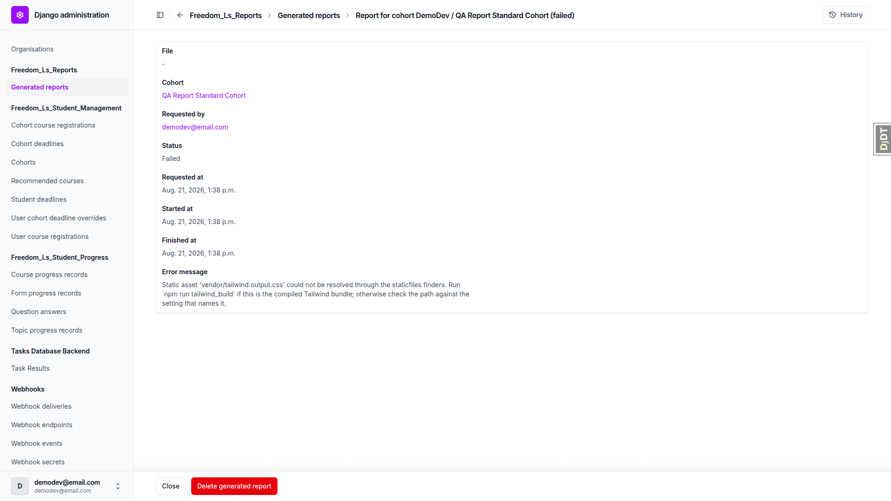

**9.3 Retry after failure — PASS.** With the bundle restored, regenerating the *same* cohort succeeds
immediately and produces a complete 18-page report identical in length to the pre-failure one — not a
truncated re-render. A failed report does not block its cohort. Saved as
`standard-cohort-medium-course_retry.pdf`.

**9.4 No download link for non-ready rows — PASS.** Download column empty for `pending` and `failed`
rows, and the download URL returns **404** for a pending report.

**9.5 Zero-student cohort — PASS.** `empty-cohort.pdf` is a valid 7-page report that states the
situation in every section rather than leaving bare headings: *"This cohort has no learners."*,
*"This cohort has no learners, so there are no individual sections to show."*, *"No quiz in this
report has any incorrect answers to analyse."*

**9.6 No course registrations — PASS.** `no-registrations.pdf` states it on the cover (*"No courses
are registered to this cohort."*), in the summary (*"There are no course registrations to
summarise."*), and per learner (*"— No course items"*).

### QA 10 — deletion and system checks — PASS (with finding 2 on 10.7)

| # | Check | Result |
|---|---|---|
| 10.1–10.2 | Single delete removes row **and** file | **PASS** — both gone |
| 10.3 | Bulk `delete_selected` on two reports | **PASS** — both rows and both files gone |
| 10.4 | Delete the Cohort, reports cascade | **PASS** — cohort, report row and PDF all gone; no orphaned PDF with learner names |
| 10.5 | `manage.py check` storage-alias warning | **PASS** — `W001` fires and names `settings.STORAGES` |
| 10.6 | `manage.py check` with the Tailwind bundle moved | **PASS** — `W002` fires naming `npm run tailwind_build` |
| 10.7 | Renamed font file | **PASS** on substance — `W004` fires naming the path, and a report generated while it is renamed lands in **failed** rather than rendering in a substituted face; both clear when restored. See finding 2 on the duplicated message. |

The delete confirmation screens name the report as
*"Report for cohort DemoDev / QA Report Blank Answer Cohort (ready)"* — organisation and cohort, no
raw UUID. The `__str__` fix holds under organisations.

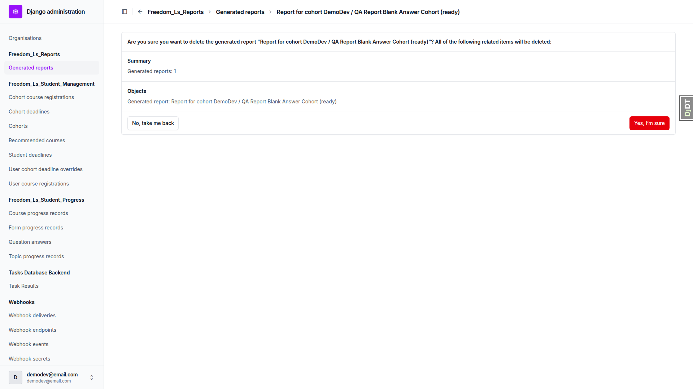

---

## Artifact manifest

All PDFs are in `3a. report_generation_qa/qa-artifacts/`.

| Fixture key | Cohort size | Course length | File | Pages | What it demonstrates |
|---|---|---|---|---|---|
| `empty-cohort` | 0 | short | `empty-cohort.pdf` | 7 | Zero learners stated explicitly in all three sections, not a crash or a blank page (QA 9.5) |
| `no-registrations` | 5 | none | `no-registrations.pdf` | 11 | No course registrations stated on the cover, in the summary and per learner (QA 9.6) |
| `tiny-cohort-short-course` | 3 | 4 items, 1 quiz | `tiny-cohort-short-course.pdf` | 9 | Smallest real report; single landscape page, no split, plain counts |
| — | 3 | 4 items, 1 quiz | `tiny-cohort-short-course_no-logo.pdf` | 9 | Cover with `HEADER_LOGO_STATIC_PATH` unset — name alone, no gap (QA 2.1) |
| `small-cohort-medium-course` | 9 | 12 items, 4 quizzes | `small-cohort-medium-course.pdf` | 18 | Small-n plain counts with no percentages and no bars (QA 5.6) |
| `standard-cohort-medium-course` | 9 | 12 items, 4 quizzes | `standard-cohort-medium-course.pdf` | 18 | The baseline read-through; 3-attempt quiz table and `×3` option counts (QA 2.10, 2.12) |
| — | 9 | 12 items, 4 quizzes | `standard-cohort-medium-course_retry.pdf` | 18 | Complete re-render after a forced failure (QA 9.3) |
| `large-cohort-medium-course` | 25 | 12 items, 4 quizzes | `large-cohort-medium-course.pdf` | 35 | Multi-page tables with repeated header rows; percentages and bars at n=17 (QA 3, 5.6) |
| `xl-cohort-long-course` | 40, 18 flagged | 30 items, 12 quizzes | `xl-cohort-long-course.pdf` | 85 | Both caps at once — attention list capped at 12, quiz columns split at 10 (QA 4.6, 6, 7) |
| `two-course-cohort` | 9 | medium + inactive | `two-course-cohort.pdf` | 20 | Both courses sectioned, the inactive registration marked (QA 2.4) |
| `no-progress-cohort` | 9 | 12 items, 4 quizzes | `no-progress-cohort.pdf` | 15 | Every learner takes the "No activity recorded." branch (QA 2.5) |
| `no-pass-mark-cohort` | 9 | first quiz unset | `no-pass-mark-cohort.pdf` | 17 | Score with `○` and no verdict; report renders rather than failing (QA 2.8) |
| `blank-answer-cohort` | 9 | 2 items, 2 quizzes | `blank-answer-cohort.pdf` | 15 | Unanswered questions read "Not answered", not an empty cell (QA 2.12) |
| — | 3 | legacy quiz | `legacy-score-discrepancy.pdf` | 9 | Stored full-marks score beside a wrong-answer listing, with the methodology explaining it (QA 2.11) |

**Deliberate absences:**

- **The QA 9.2 forced failure produces no PDF by design.** The `failed` row stands in for it —
  `screenshots/desktop_9.2_failed_row_changelist.png` and
  `screenshots/desktop_9.2_failed_error_message.png`.
- **`xl-cohort-long-course_column-overflow.pdf` was not produced**, because the column budget did not
  drift. The plan calls for it only as evidence behind a change to `REPORTS_MAX_QUIZ_COLUMNS`, and no
  change is needed — 10 still holds.
- **`tiny-cohort-short-course_powered-by.pdf` is absent** and cannot be regenerated; see
  observation D.

Every fixture in the plan's matrix produced a PDF. None was skipped.

---

## Notes on execution

- **No test data had to be created by hand, and `fls-dev:qa-data-helper` was not needed.**
  `qa_create_report_fixtures --reset` built the whole matrix, both permission users and both
  organisation-role users in one idempotent pass. The QA 2.11 legacy-score cohort was already present
  and intact from its own seeding command. Nothing in the plan was blocked on missing data.
- **The dev site is pinned to one Site by `FORCE_SITE_NAME = "DemoDev"`** in `config/settings_dev.py`,
  so running on port 8114 rather than a port that matches a `Site.domain` row has no effect on site
  resolution. Worth knowing for future runs, since the `Site` table keys on `127.0.0.1:8000`–`:8003`.
- **Two settings were temporarily edited and both restored**, verified clean with `git diff`:
  `HEADER_LOGO_STATIC_PATH` (for QA 2.1) and the moved/restored
  `static/vendor/tailwind.output.css` and `freedom_ls/reports/static/reports/fonts/Inter-Variable.ttf`
  (for QA 9.2 and QA 10.7). The server was restarted around each so the staticfiles finders saw the
  change.
- **Greyscale checking used rasterisation, not a physical printer**, as the plan directs.
- Screenshot compression was a no-op — every screenshot was already under the script's 1024 KB
  threshold.
- The Django Debug Toolbar was hidden after the first few screenshots, so early images show it in the
  right margin and later ones do not.
