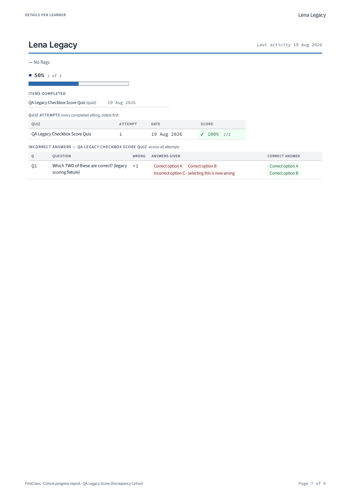
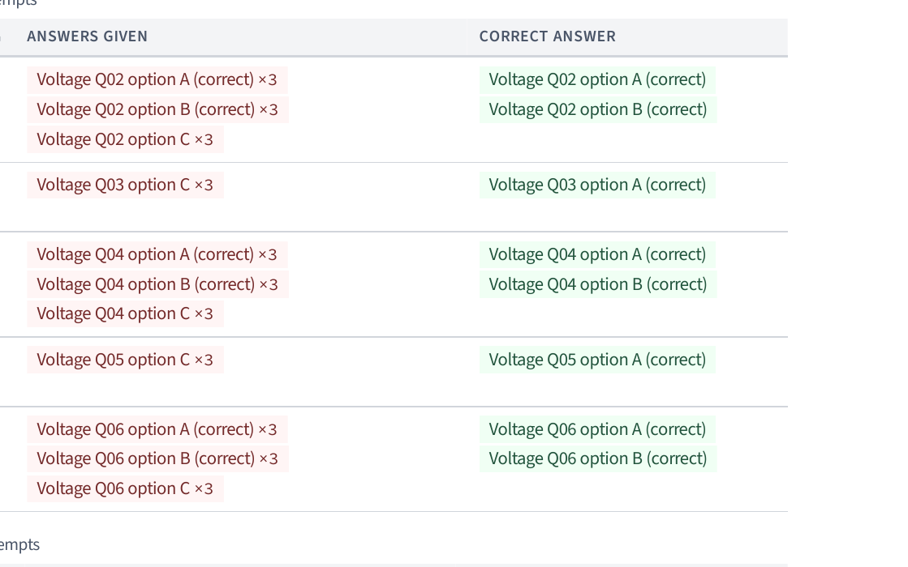
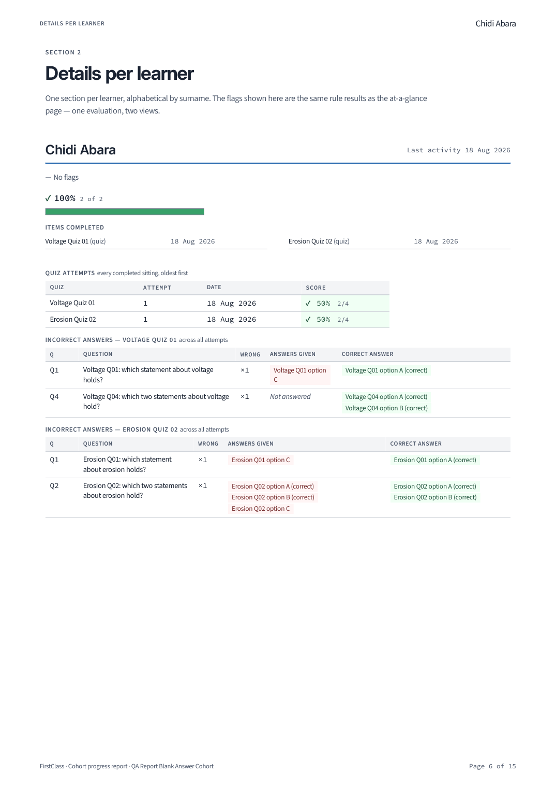
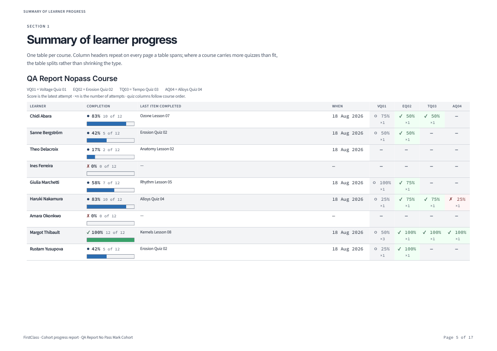
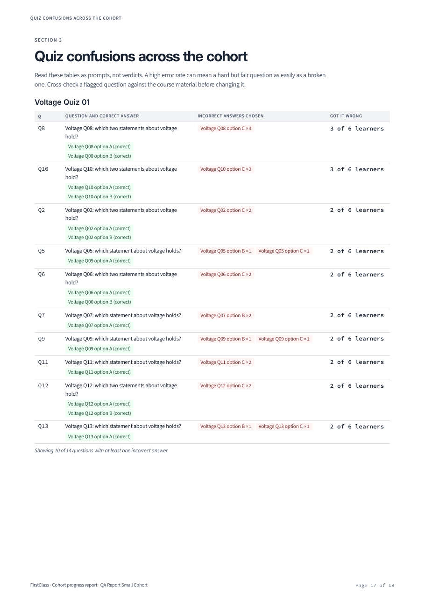
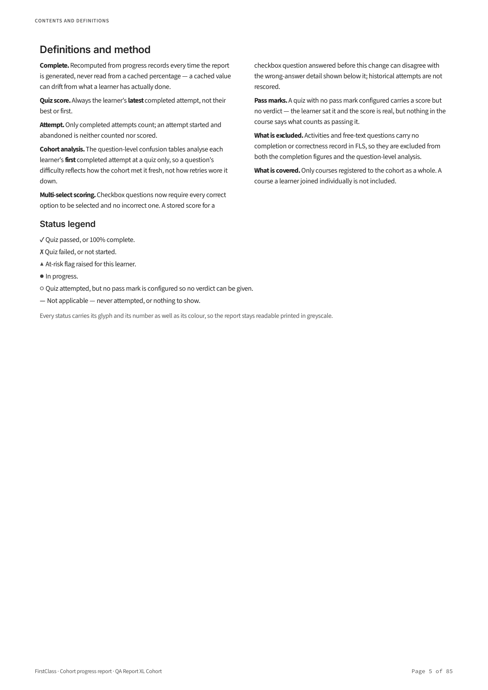
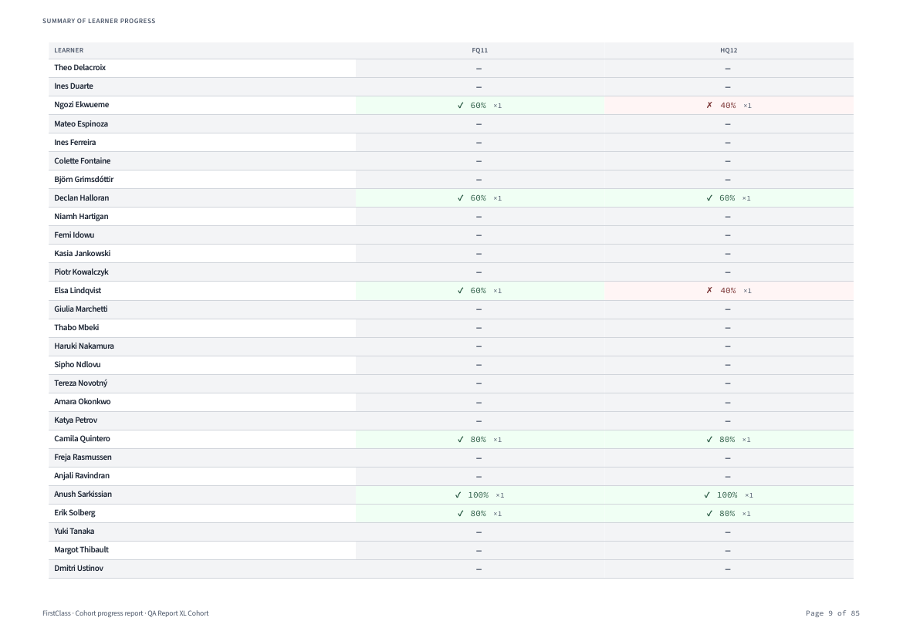
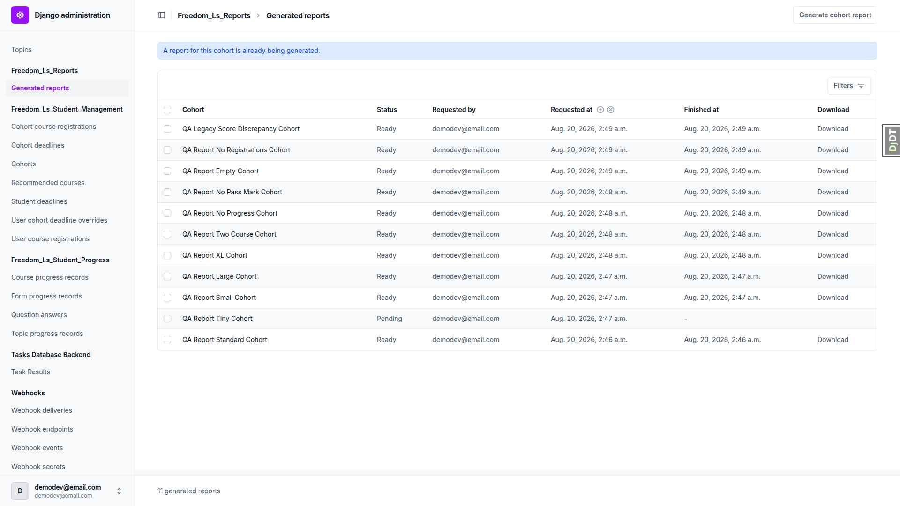

# QA report — cohort progress PDF report (report generation)

**Plan:** `frontend_qa_report_generation.md` (QA 0–10)
**Run date:** 2026-08-20
**Branch:** `basic_reports` (confirmed via `debug-branch-badge`)
**Server:** `http://127.0.0.1:8537/` — own `runserver`, started for this run
**Browser:** Playwright MCP, desktop 1920×1080
**Build state:** `npm run tailwind_build` run before QA 0; `manage.py migrate` clean (no pending migrations)

Mobile and tablet passes were **not** run, as the plan directs — every surface in this plan is
either the Django admin or a PDF.

## Verdict

**1 bug found.** Every other check in QA 0–10 passes. QA 2.12's blank-answer clause was initially
unexecutable against the fixture matrix; a new fixture was commissioned during the run and the
clause then passed — see "Fixture gap closed during the run" below.

| Section | Result |
|---|---|
| QA 0 — fixture matrix and artifact set | Pass — 11 fixtures + 3 variants, 14 PDFs |
| QA 1 — generate end to end | Pass |
| QA 2 — read the PDF | Pass, except **2.12's chip tinting (bug below)** |
| QA 3 — page breaks and running headers | Pass |
| QA 4 — at-risk flag consistency | Pass |
| QA 5 — cohort quiz confusions | Pass |
| QA 6 — greyscale legibility | Pass |
| QA 7 — landscape column budget | Pass — budget holds at 10, no drift |
| QA 8 — permissions and access control | Pass |
| QA 9 — failure branches | Pass |
| QA 10 — deletion and system checks | Pass |

---

## Bug 1 — Options the learner ticked *correctly* are painted as wrong answers in the per-learner "Incorrect answers" table

**Test failed:** QA 2.12 (per-learner incorrect answers). Also visible in the QA 2.11 artifact.

**Where:** every per-learner "Incorrect answers — {quiz}" table, on any `checkboxes` question.

**Expected:** the "Answers given" column distinguishes the options that were wrong to select from the
ones that were right. The report's own colour language is red = wrong, green = correct, and the
"Correct answer" column two inches to the right uses green for exactly these options.

**Actual:** *every* option the learner selected on a wrong sitting is rendered as a red `chip-error`,
including the ones that are correct. The same option text therefore appears **red on the left and
green on the right of the same table row**, with nothing to explain the contradiction.

The clearest case is the QA 2.11 legacy-scoring fixture, whose options are literally named for their
correctness. "Correct option A" and "Correct option B" are red, indistinguishable from
"Incorrect option C — selecting this is now wrong":



The same defect in the baseline report, where the learner ticked A, B and C on a "which two" question
— A and B were correct, only C was not:



**Scope.** Single-select (`multiple_choice`) questions are unaffected: the one option chosen on a
wrong sitting really is a distractor, so red is right. The bug is specific to **`checkboxes`**
questions — that is, precisely the question type whose scoring this spec changed. A learner who got
a multi-select question wrong by ticking one extra option is shown all their correct ticks as errors.

**Root cause (confirmed in code, not inferred):**

- `freedom_ls/reports/gather.py` — the tallies loop adds *every* selected option to
  `wrong_selected_counts` with no filter on `option.correct`:
  ```python
  for option in sat.selected_options_by_pair.get((attempt_id, question.id), []):
      wrong_selected_counts[wrong_key][option.text] += 1
  ```
- `freedom_ls/reports/templates/reports/partials/student_detail.html:106` — renders all of them with
  the same class: `<span class="chip chip-error">{{ text }}...`

**The cohort-wide section gets this right**, which is what makes the per-learner table inconsistent
with the rest of the document. `freedom_ls/reports/indexes.py: load_distractor_rows()` deliberately
filters correct options out, with a comment explaining the nullable-field subtlety:

```python
# `.exclude(correct=True)`, never `.filter(correct=False)`: correct is
# nullable, and a correct=None option must still count as a distractor.
QuestionOption.objects.exclude(correct=True)
```

So on the same quiz, the cohort confusions table lists only genuine distractors while the learner's
own table lists everything they ticked, all in red.

**Extra severity in greyscale.** QA 6 requires status to survive greyscale printing because every
status carries a glyph as well as a colour. These chips carry **no glyph** — tint is their only
signal — so in greyscale the "Answers given" and "Correct answer" columns become completely
indistinguishable from one another.

**The student results page already does this correctly, and is the reference implementation.** The
sibling plan's run (`../3b. quiz_marking_qa/qa_report.md`, QA 11 and QA 12.6) walked the same data on
the student-facing results page, where "Your answer" marks each ticked option individually — the
correct ticks green, the wrong one red. The fix that delivered that on the student page was not
carried across to the report. The two renderings of the identical legacy attempt sit side by side in
the two reports, which makes the intended output unambiguous.

---

## Fixture gap closed during the run

### QA 2.12 — the *Not answered* branch — **now passes**

The last clause of QA 2.12 says a question the learner left blank must read *Not answered* rather
than showing an empty cell. The template branch exists
(`student_detail.html:106`, `<span class="no-answer">Not answered</span>`), but the string
appeared in **none** of the first 13 PDFs — no fixture in the matrix created a learner with a
completed attempt in which an option-backed question was scored wrong with nothing selected.

Per the plan's rules this was not marked skipped. `fls-dev:qa-data-helper` extended
`qa_create_report_fixtures` with a `blank-answer-cohort` fixture (plus an
`--optional-last-question` flag on `qa_create_report_course`), so the branch is now reproducible from
the command rather than patched into the database by hand:

```bash
uv run python manage.py qa_create_report_fixtures --only blank-answer-cohort
```

Generating that cohort's report through the admin produced `qa-artifacts/blank-answer-cohort.pdf`,
in which **"Not answered" renders 4 times**, in italic, clearly distinct from an empty cell — and,
usefully, alongside ordinary chip rows in the same table so the two renderings can be compared
directly (Chidi Abara's Voltage Quiz 01 has Q1 with a chip and Q4 blank):



**QA 2.12's blank-answer clause therefore passes.** (The same screenshot also shows Bug 1 again:
Erosion Q02's "option A (correct)" and "option B (correct)" are red on the left and green on the
right.)

---

## Observations (tangential — not failures of this plan)

### A. 26 MB of orphaned report PDFs in `media/reports/`

`media/reports/` holds **397 orphaned flat PDFs** and **808 empty directories** left over from the
pre-flat storage layout — 26 MB in total, against only 9 live report files.

Every deletion path was tested this run and **all of them clean up correctly**:

| Path | Result |
|---|---|
| Single delete from the admin (QA 10.2) | row and file both removed |
| Bulk delete action (QA 10.3) | both rows and both files removed |
| Deleting the parent Cohort (QA 10.4) | cohort, report row and file all removed |
| `qa_create_report_fixtures --reset` | file removed |

So this is **residue, not a live defect** — but the orphans post-date commit `ec038fae`
(2026-08-17 20:16, "Store reports flat"), so they were not all produced by the old nested layout, and
their origin between 17 and 19 August could not be reconstructed. They are worth sweeping regardless:
these are cohort progress reports, so they contain learner names.

The reports test suite is **not** the source — `freedom_ls/reports/tests/conftest.py` has an autouse
`isolated_reports_storage` fixture pointing storage at `tmp_path`, and it landed on 2026-08-13,
before the earliest orphan.

### B. QA 8.7's URL in the plan is stale

The plan tells the tester to try `/media/reports/<report-uuid>/cohort-report.pdf`. That path 404s,
because `ec038fae` moved reports to flat storage. The real path is
`/media/reports/<report-uuid>-cohort-report.pdf`, and it **does** serve the PDF in dev — which is the
outcome the plan anticipates ("expected to be blocked in a correctly configured deployment"). The
`freedom_ls_reports.W001` storage-alias warning fires as the control (QA 10.5). Worth correcting the
URL in the plan so the next run does not read the 404 as a pass.

### C. The QA fixtures bake correctness into the option text

Fixture options are named `Voltage Q02 option A (correct)` / `Voltage Q02 option C`. That is the
option's own text in the database — the report is not adding a letter prefix or a `(correct)` suffix,
so **QA 5.3 passes**. But it reads as though the report were annotating options, and it cost real
time to rule out as a false positive; it also makes the "Correct answer" column look redundantly
suffixed. Worth renaming the fixture options to something neutral.

### D. Admin login page title reads "Log in | None"

Unrelated to reports — the admin site header renders `None` where a site name is expected. Noticed
while testing QA 8.1.

---

## Section notes

### QA 0 — fixture matrix and artifact set

`uv run manage.py qa_create_report_fixtures --reset` built all ten fixtures in one pass, plus the two
permission users. One transient `OperationalError: the database system is shutting down` on the first
invocation; the retry succeeded and nothing else in the run hit it.

All ten fixtures generated **ready** through the admin UI — including both degenerate cohorts, so
QA 9.5 and QA 9.6 passed on the way through. The long course carries **12** quizzes, which was enough
to clear the 10-column cap and force the table split, so QA 7 did not need a rebuild.

### QA 1 — generate end to end

- Reports live under **Freedom_Ls_Reports → Generated reports**; the Cohorts changelist carries **no**
  "Generate report" button (its only "generate" text is the sidebar nav link).
- The changelist has **no "Add generated report"** button and does carry a **Generate cohort report**
  link.
- The generate page renders with full unfold styling — sidebar, breadcrumbs, styled Generate button,
  a single `<h1>`. The previously-reported unstyled-admin-page bug is fixed.

  

- Submitting redirects to the changelist with "Generating a progress report for QA Report Standard
  Cohort." and a new row showing cohort, status, requested by, requested at, finished at and Download.
- Download returns `Content-Type: application/pdf` and
  `Content-Disposition: attachment; filename="qa-report-standard-cohort-progress-report.pdf"` —
  slugified, no spaces, not a media URL.

### QA 2 — reading the PDF

Cover carries the tenant name and logo, title, cohort name, the Courses-covered card with item and
quiz counts, a timestamped `GENERATED` line **with timezone** (`02:46 UTC (+0000)`), who generated it,
cohort size, the as-of caveat, and the brand band. No running header, footer or page number on the
cover.

With `HEADER_LOGO_STATIC_PATH` unset the cover renders with the name alone and **no gap** where the
logo was — it reads as finished:


- **No "Powered by"** string in any of the 13 PDFs.
- **No occurrence of the word "student"** in any of the 13 PDFs — the report says "learners"
  throughout.
- Page-reference links are live internal jumps: `p. 10`, `p. 12`, `p. 15` resolve to pages 10, 12, 15.
- The PDF outline mirrors the contents exactly — two levels, all 9 learners, all 4 quizzes, correct
  page numbers.
- The definitions block states all nine required points, including the multi-select rescoring caveat
  and the no-pass-mark rule.
- Page numbers appear on pages 2–18 and **not** on page 1.
- Quiz attempts table shows one row per completed sitting, oldest first; the last row agrees with the
  summary table's latest-attempt cell (`✓ 64% ×3`).
- The `×n` counting rule is exactly right: an option chosen on all three wrong sittings reads `×3`,
  and an option on a question missed once carries **no** count at all.

**QA 2.8 — no pass mark.** The quiz with `quiz_pass_percentage` unset renders `○` with the score, no
verdict and no pass/fail tint, while its sibling quizzes show `✓`/`✗`. The report generated normally.



**QA 2.11 — legacy checkbox score.** Passes on its own terms: the summary table shows the **stored**
100%, the learner's detail marks the same question wrong, and the definitions block explains that
historical attempts are not rescored. (This artifact is also the clearest evidence for Bug 1.)

### QA 3 — page breaks and running headers

25-learner summary table spans pages 5–6 with the header row repeated and no row split across the
boundary:


Running header audited on **every** page of the 25-learner detail section. Each learner starts on a
fresh page, and the two learners whose sections run to a second page (Elsa Lindqvist pp. 18–19, Sipho
Ndlovu pp. 23–24) carry **their own** name on the continuation page. No learner name leaks onto the
landscape summary pages or into the confusions section. Learners are ordered alphabetically by
surname throughout.

### QA 4 — at-risk flags

Flag label and reason text are **character-identical** between the at-a-glance list and the learner's
own section for all three flagged learners in the standard cohort. Every badge carries `▲`.
Unflagged learners show an explicit "— No flags".

On the XL cohort: the at-a-glance list is capped at 12 with "Showing 12 of 18 learners flagged.", and
all **18** flagged learners — including the six not listed on the front page — carry their flags in
their own detail sections (18 flags across 18 distinct learners, plus 22 "No flags" = 40).

### QA 5 — cohort confusions

Worst-first ranking, tinted chips, correct answer alongside, and the interpretive caution once under
the heading. Cap disclosure reads "Showing 10 of 14 questions with at least one incorrect answer."

The small-n rule flips correctly at both ends:

| Fixture | Respondents | Rendering |
|---|---|---|
| `tiny-cohort-short-course` | 1 | `1 of 1 learners` — plain count, no bar |
| `small-cohort-medium-course` | 6 | `3 of 6 learners` — plain counts, **no** percentages, **no** bars |
| `large-cohort-medium-course` | 17 | `35% of 17 learners` — percentages **and** bars |



QA 5.7's deliberate disagreement holds: Voltage Q02's distractor reads `×3` in the learner's own
section (all three sittings) and `×2` in the cohort table (first attempts only), and the definitions
block explains why.

No option anywhere carries a report-added letter or position prefix.

### QA 6 — greyscale

Rasterised at 150 dpi. All six glyphs (`✓ ✗ ▲ ● ○ —`) render correctly, none as `.notdef` boxes or
colour emoji, and every status stays unambiguous without colour:




`pdffonts` shows **17 faces, all embedded and subsetted**, all from the four configured families
(Inter, Source Sans 3, Source Code Pro, DejaVu Sans). No system fonts and no synthesised weights —
every bold/semibold/italic is a real embedded face.

### QA 7 — landscape column budget

**The budget holds at 10; no drift, no re-measure needed.** The 12-quiz long course produces a first
table of exactly 10 quiz columns (14 in all), and the two quizzes past the cap move into a
`QA Report Long Course (continued)` table carrying `FQ11` and `HQ12`. Type is not shrunk and nothing
is clipped at the right margin. Item titles under "Last item completed" keep a clear gap before
"When".



The abbreviation legend sits under the table title and preserves quiz numbers
(`VQ01 = Voltage Quiz 01` … `RQ10 = Ratios Quiz 10`).

### QA 8 — permissions

| Check | Result |
|---|---|
| 8.1 Anonymous hits download URL | Redirected to `/admin/login/?next=…` — never the PDF |
| 8.2 Restricted staff, cohort B download | **403**, not the PDF and not a 500 |
| 8.3 Restricted staff, generate dropdown | Only cohort A listed; cohort B absent entirely |
| 8.4 Forced POST with cohort B's id | **404**; total reports stayed at 11 and no row created for cohort B |
| 8.5 No media URL in changelist | Zero `/media/` strings in the page source |
| 8.6 Caching headers | `Cache-Control: private, no-store, must-revalidate, max-age=0, no-cache` + `Content-Disposition: attachment` |
| 8.7 Direct media guess | Serves in dev — expected; see Observation B |

The restricted user's changelist also shows **only** cohort A's report, so the previously-reported
changelist-scoping bug stays fixed.


### QA 9 — failure branches

**9.1 Concurrent generate.** With a report forced to `pending`, resubmitting for the same cohort gave
"A report for this cohort is already being generated.", exactly one row for that cohort, and no 500.



**9.2 Failed render.** With the Tailwind bundle moved aside the report landed in **failed** with
`finished_at` set, no download link, no stuck `running` row, and a genuinely actionable message:

> Static asset 'vendor/tailwind.output.css' could not be resolved through the staticfiles finders.
> Run `npm run tailwind_build` if this is the compiled Tailwind bundle; otherwise check the path
> against the setting that names it.


**9.3 Retry.** After restoring the bundle, regenerating the same cohort succeeded immediately — the
failed report did not block it. The retry PDF is **byte-identical** to the original (18 pages,
620,815 bytes), so it is a complete render, not a truncated one.

**9.4 Pending has no download.** The `pending` row's Download cell is empty and its download URL 404s.

**9.5 / 9.6 Degenerate cohorts.** Both produce valid PDFs that state the situation in every section
rather than showing bare headings:

- `empty-cohort` (7 pp): "This cohort has no learners." / "No learners currently flagged." / "This
  cohort has no learners, so there are no individual sections to show." / "No quiz in this report has
  any incorrect answers to analyse."
- `no-registrations` (11 pp): "No courses are registered to this cohort." on the cover, "There are no
  course registrations to summarise." in section 1, "— No course items" per learner.

### QA 10 — deletion and system checks

Deletion results are in Observation A. System checks:

| Check | Result |
|---|---|
| 10.5 Storage alias | `freedom_ls_reports.W001` fires, naming the fallback to default storage |
| 10.6 Tailwind bundle moved aside | `freedom_ls_reports.W002` fires, hinting `npm run tailwind_build` |
| 10.7 Font file renamed | `freedom_ls_reports.W004` fires naming `reports/fonts/DejaVuSans.ttf`; a report generated while renamed landed in **failed** rather than substituting a face. Restoring the file cleared both the warning and the failure. |

The delete confirmation screen names the report as
"Report for cohort QA Report Standard Cohort (ready)" — no raw UUID, so that fix holds.

---

## Artifact manifest

All PDFs are in `qa-artifacts/`.

| Fixture key | Cohort size | Course length | File | Pages | Demonstrates |
|---|---|---|---|---|---|
| `empty-cohort` | 0 | short | `empty-cohort.pdf` | 7 | Every section states the cohort is empty rather than crashing (QA 9.5) |
| `no-registrations` | 5, no registrations | — | `no-registrations.pdf` | 11 | Report states there are no course registrations (QA 9.6) |
| `tiny-cohort-short-course` | 3 | 4 items, 1 quiz | `tiny-cohort-short-course.pdf` | 9 | Smallest real report; plain counts at the low end of the small-n rule |
| `small-cohort-medium-course` | 9 | 12 items, 4 quizzes | `small-cohort-medium-course.pdf` | 18 | Small-n rule: plain counts, no percentages, no bars (QA 5.6) |
| `standard-cohort-medium-course` | 9 | medium | `standard-cohort-medium-course.pdf` | 18 | The baseline read-through; three-attempt learner for QA 2.10 / 2.12 / 5.7 |
| — variant | — | — | `standard-cohort-medium-course_retry.pdf` | 18 | Retry after a forced render failure; byte-identical to the original (QA 9.3) |
| `large-cohort-medium-course` | 25 | medium | `large-cohort-medium-course.pdf` | 35 | Multi-page table with repeated headers; percentages and bars at n≥10 |
| `xl-cohort-long-course` | 40, 18 flagged | 30 items, 12 quizzes | `xl-cohort-long-course.pdf` | 85 | Both caps at once: attention list capped at 12, table split at 10 quiz columns (QA 4.6, QA 7); greyscale source |
| `two-course-cohort` | 9 | medium + inactive | `two-course-cohort.pdf` | 20 | Both courses sectioned, inactive registration marked (QA 2.4) |
| `no-progress-cohort` | 9, zero progress | medium | `no-progress-cohort.pdf` | 15 | All 9 learners take the "No activity recorded." branch (QA 2.5) |
| `no-pass-mark-cohort` | 9 | medium, first quiz unset | `no-pass-mark-cohort.pdf` | 17 | Score with `○` and no verdict; no crash, no dropped column (QA 2.8) |
| — variant | 3 | short | `tiny-cohort-short-course_no-logo.pdf` | 9 | Cover with `HEADER_LOGO_STATIC_PATH` unset — no gap (QA 2.1) |
| legacy fixture | 3 | 2 items, 1 quiz | `legacy-score-discrepancy.pdf` | 9 | Stored pre-fix checkbox score shown unchanged beside wrong-answer detail (QA 2.11); also the clearest evidence for Bug 1 |
| `blank-answer-cohort` | 9 | 2 items, 2 quizzes | `blank-answer-cohort.pdf` | 15 | Built during this run: an optional question left blank renders *Not answered*, not an empty cell (QA 2.12) |

**Deliberate absences:**

- The QA 9.2 forced failure produces **no** PDF by design. Its evidence is
  `screenshots/desktop_9.2_failed_report_detail.png`.
- `tiny-cohort-short-course_powered-by.pdf` is not regenerable — the `REPORTS_POWERED_BY_*` settings
  it demonstrated were removed. Its absence is the plan's own expectation.
- `xl-cohort-long-course_column-overflow.pdf` was **not** produced: it is only required if the column
  budget has drifted, and QA 7 confirmed it has not.

## Difficulties

- The plan file the command was pointed at (`3. frontend_qa.md`) is a signpost that says not to run
  it. This run executed `3a. report_generation_qa/frontend_qa_report_generation.md`, per the user.
- The django-debug-toolbar overlay intercepts clicks on admin links in the bottom-left region; hiding
  it once via `#djHideToolBarButton` cleared this for the rest of the run.
- Report generation for the 25- and 40-learner cohorts exceeds Playwright's 5 s click timeout. The
  submissions all completed server-side; the timeout is a client-side wait, not a failure, and the
  resulting rows were verified `ready` on the changelist.
- Downloads could not be saved directly through the browser (the admin session cookie is HttpOnly, so
  it is unavailable to page scripts). Download behaviour was verified through the admin view — status,
  content type, disposition and cache headers — and the artifact copies were taken from each report's
  own `file.path`, so the archived bytes are the same bytes the view serves.
- `QA Report No Progress Cohort` and `QA Report Two Course Cohort` were deleted during QA 10.4 and the
  `--reset` verification. This is expected; both are rebuilt by
  `uv run manage.py qa_create_report_fixtures`, and their PDFs were archived first.
