# QA report — multi-select quiz scoring fix (student-facing)

**Plan:** `frontend_qa_quiz_marking.md` (QA 11–13)
**Run date:** 2026-08-20
**Branch:** `basic_reports` (confirmed via `debug-branch-badge`)
**Server:** `http://127.0.0.1:8537/` — own `runserver`, started for this run
**Browser:** Playwright MCP — desktop 1920×1080, mobile 375×812, tablet 768×1024
**Build state:** `npm run tailwind_build` run before the pass; `manage.py migrate` clean

## Verdict

**The multi-select scoring fix itself is correct on every surface tested.** Every row of QA 11's
scoring matrix behaves as specified, and none of the knock-on surfaces in QA 12 break.

**1 bug found** — and it is *not* in the scoring change. QA 12.1's progression check exposed that a
course item shown as **Locked** is not actually protected: its URL serves the content, and visiting
it permanently clears the lock. Details below.

| Section | Result |
|---|---|
| QA 11 — checkbox scoring, student view | Pass (see note on the unreachable "tick nothing" row) |
| QA 12.1 — pass/fail and navigation | Scoring half passes; **lock enforcement fails (bug below)** |
| QA 12.2 — unset pass mark | Pass — no 500 anywhere, no lockout |
| QA 12.3 — single-select unchanged | Pass |
| QA 12.4 — free-text in a non-scored form | Pass |
| QA 12.5 — educator live panel | Pass (desktop and tablet) |
| QA 12.6 — historical attempts not rescored | Pass |
| QA 13 — demo content sanity | Pass |
| Mobile pass (375×812) | Pass |
| Tablet pass (768×1024) | Pass |

---

## Bug 1 — A "Locked" course item serves its content on direct access, and the lock never comes back

**Test failed:** QA 12.1 (pass/fail and navigation).

**Expected:** failing the quiz at item 2 leaves item 3 blocked — the plan's fixture says so in the
topic body itself: *"If you can read this, the quiz at item 2 was passed. Failing that quiz must
leave this topic BLOCKED (locked icon, no link) in the course index."*

**Actual:** the course index does show item 3 as **Locked** with no link — but that is the whole of
the enforcement. Requesting `/courses/qa-progression-block-course/3/` directly returns **200 and the
full topic content**, on a quiz the learner has just failed at 75% against an 80% pass mark.

Worse, the visit is not merely a one-off bypass. The item view writes
`course_progress.last_accessed_item = current_item` on the way through, so afterwards the outline
shows item 3 as **"In progress" with a live link** — the lock is gone from the UI too, and does not
return even though the quiz is still "Needs retry":

Before — failed quiz, item 3 correctly Locked:

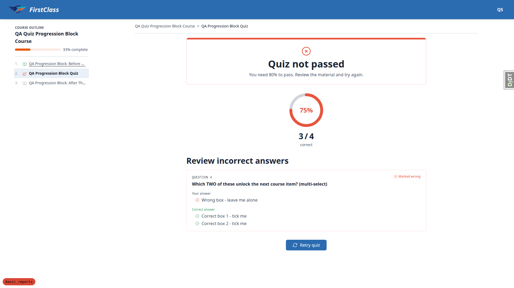

After one direct visit — item 3 now "In progress", linked, quiz still failed:

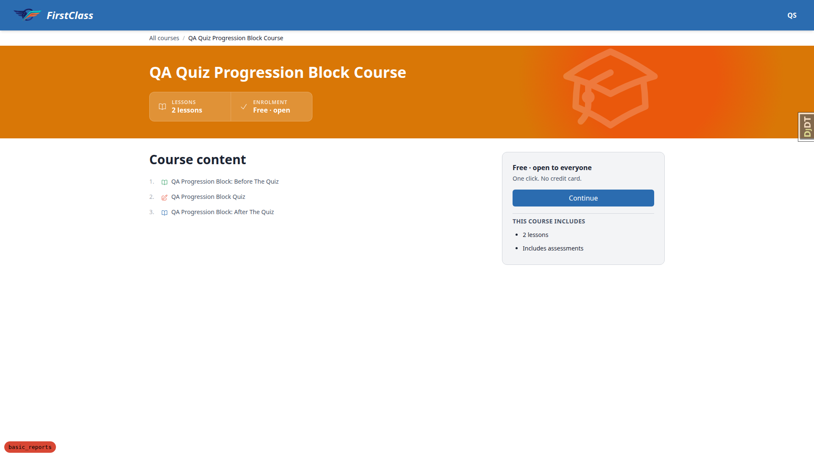

The topic content itself, served despite the failed gate:

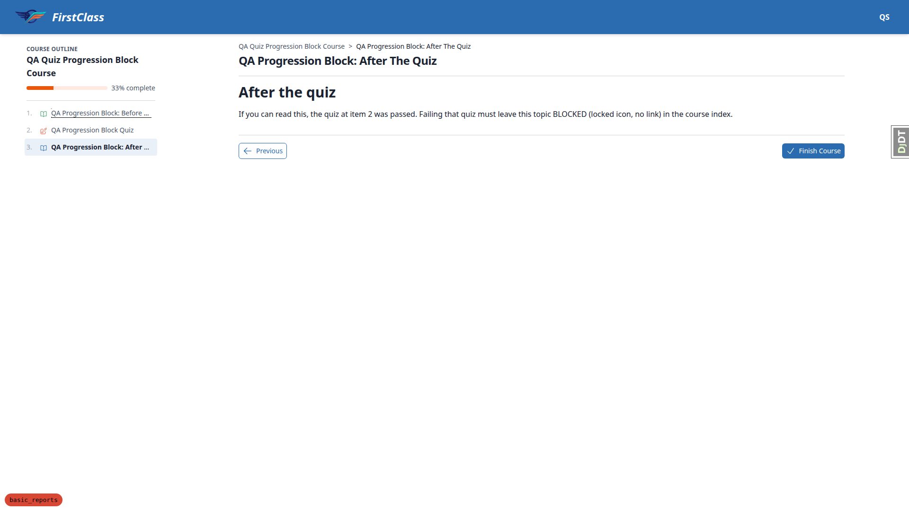

**Root cause (confirmed in code).** `view_course_item` in
`freedom_ls/student_interface/views.py` gates on exactly three things — hidden-course 404,
`decision.can_access_content` (registration / access backend), and hard **deadline** locks:

```python
decision = get_course_access_backend().get_access(user=request.user, course=course)
if not decision.can_access_content:
    return redirect("student_interface:course_detail", course_slug=course_slug)
...
if config.DEADLINES_ACTIVE and request.user.is_authenticated:
    if is_item_locked_by_deadline(...):
        return redirect("student_interface:course_detail", course_slug=course_slug)
```

There is **no** check for a quiz-progression lock. The Locked state comes from `get_course_index()`,
which is display-only. The comment directly above the access gate notes that this exact hole was
closed for unregistered learners — "the TOC hides the links as BLOCKED, but the URL was previously
unguarded" — and the same hole is still open for progression locks.

**Reproduced twice, independently.** The second instance came from QA 13: in
`functionality-demo-course-parts` the part "Core Concepts" and its topics 2.1 and 2.2 all showed
**Locked**, yet item 5 (`Knowledge Check`, inside that locked part) was reachable by URL and could be
completed for 100%. So this is not specific to the failed-quiz gate — any index-level lock is
advisory.

**Not a regression from this spec.** Nothing in the multi-select scoring change touches progression
gating; QA 12.1 is simply the test that walks it. The pass/fail arithmetic driving the gate is
correct in both directions (see below) — it is the enforcement of the resulting lock that is missing.

---

## QA 11 — Checkbox scoring, student view

**Fixture arithmetic.** `qa_create_multiselect_quiz_scoring` builds `qa-all-question-types-form` as a
`strategy: QUIZ` form with **4 questions** — one `multiple_choice`, one `checkboxes` (3 options,
2 correct), one `short_text` and one `long_text` — and a **50% pass mark**.

Per the plan's instruction ("either drop them from the fixture or compute expected percentages
excluding them"), note that **`max_score` is 4 but the option-backed ceiling is 2**, because the two
free-text questions count toward the denominator and can never be scored correct. So the highest
attainable score on this form is **50%** — exactly the pass mark. Every percentage below is computed
on that basis. (See Observation B: this is a fixture-realism issue, not a scoring defect.)

All runs kept the `multiple_choice` question answered **correctly**, so the checkbox question is the
only variable:

| What was ticked | Checkbox scored | Total | % | Verdict | Listed under "Review incorrect answers"? |
|---|---|---|---|---|---|
| **All three options** | **0 — wrong** | 1 / 4 | 25% | Quiz not passed | **Yes** ✓ |
| The two correct options only | 1 — right | 2 / 4 | 50% | Quiz passed! | No ✓ |
| One of the two correct options | 0 — wrong | 1 / 4 | 25% | Quiz not passed | Yes ✓ |
| Both correct plus the incorrect one | — identical to row 1 for a 3-option / 2-correct question | | | | |
| Nothing | not reachable — blocked by required-question validation (see below) | | | | |

**The headline regression is closed: ticking everything no longer scores full marks.** It scores 0,
the quiz fails, and the question is listed as incorrect.

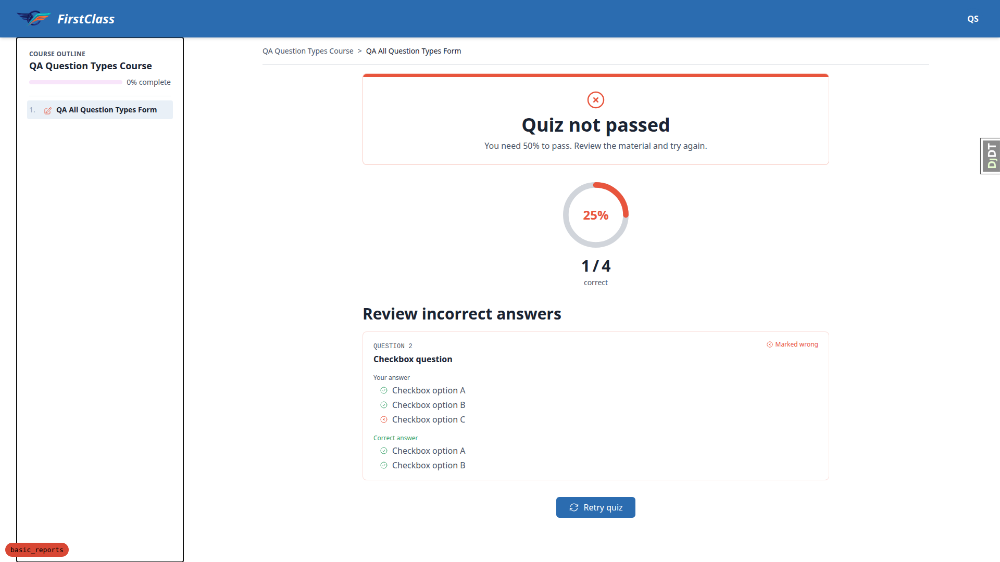

**Score and incorrect-answer list agree in every case** — no row where a question counted wrong is
missing from the list, and none where a question counted right appears in it.

**The results page marks each ticked option individually.** On the all-three case, "Your answer"
shows `⊘ Checkbox option A`, `⊘ Checkbox option B` in **green** and `⊗ Checkbox option C` in **red**,
so the learner can see which of their ticks was the mistake. This is worth recording explicitly
because the PDF report does **not** do this — see Bug 1 in the sibling report
(`../3a. report_generation_qa/qa_report.md`), where the same data renders with all three options
tinted as errors. The student page is the correct reference implementation.

**"Tick nothing" is unreachable here, correctly.** The checkbox question is `required=True`, and
submitting with nothing ticked is blocked client-side with "Select at least one option." under the
group, with the counter reading "3 of 4 answered" and the submit dialog refusing to proceed:

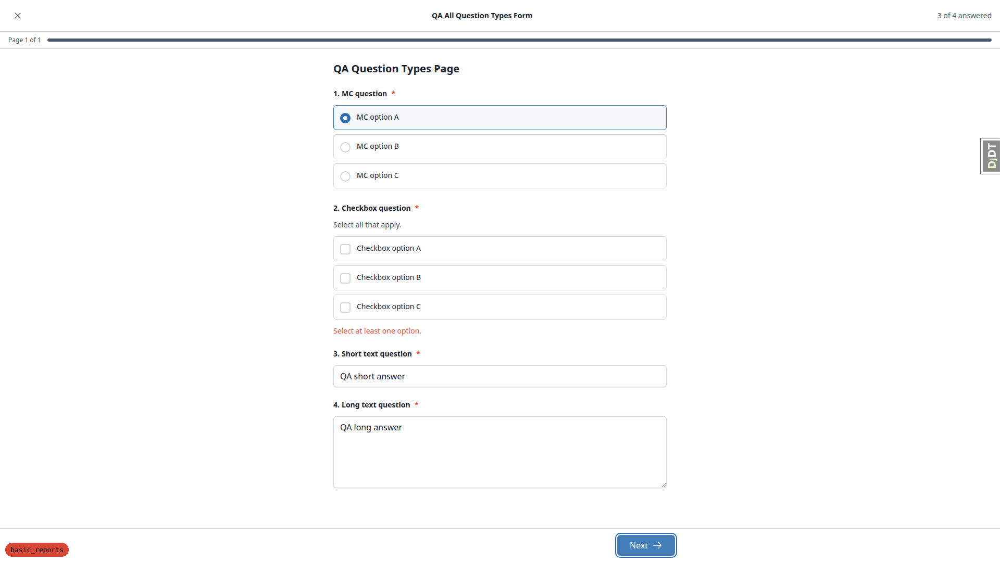

That is correct product behaviour, so the row's expected outcome (scores 0, listed as incorrect) was
verified on the **report** side instead, where an *optional* question left blank is scored wrong and
rendered — see the sibling plan's QA 2.12 and its `blank-answer-cohort` fixture.

**Radio vs checkbox stay distinguishable** — round controls for single-select, square for
multi-select, with "Select all that apply." on the checkbox group:

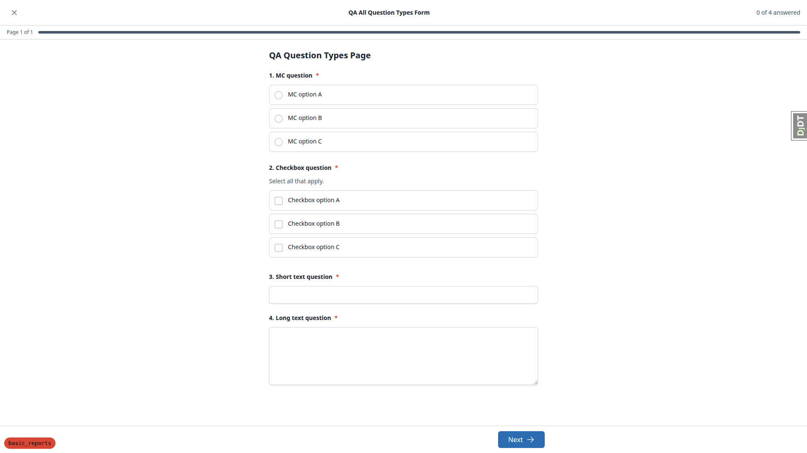

## QA 12.1 — Pass/fail and navigation

Using `qa_create_quiz_progression_block` (3 items: topic → quiz at 80% → topic).

The scoring half is **correct in both directions**, and matches the fixture's predicted arithmetic
exactly:

| Checkbox answer | Score | % | Verdict | Item 2 | Item 3 in the index |
|---|---|---|---|---|---|
| Only the wrong box ticked | 3 / 4 | 75% | Quiz not passed | Needs retry | **Locked** |
| Both correct boxes, nothing else | 4 / 4 | 100% | Quiz passed! | Completed | Unblocked, linked |

So the multi-select fix drives progression correctly. The failure is that "Locked" is not enforced —
Bug 1 above.

## QA 12.2 — Unset pass mark

**Passes throughout, including the lockout scenario.** After completing
`qa-quiz-no-pass-pct-form` (`quiz_pass_percentage = None`):

The results page shows the score and explicitly states there is no verdict — *"QA Quiz Without Pass
Percentage Form has no pass mark, so there is no pass or fail — here is how you scored."* — with no
error page:

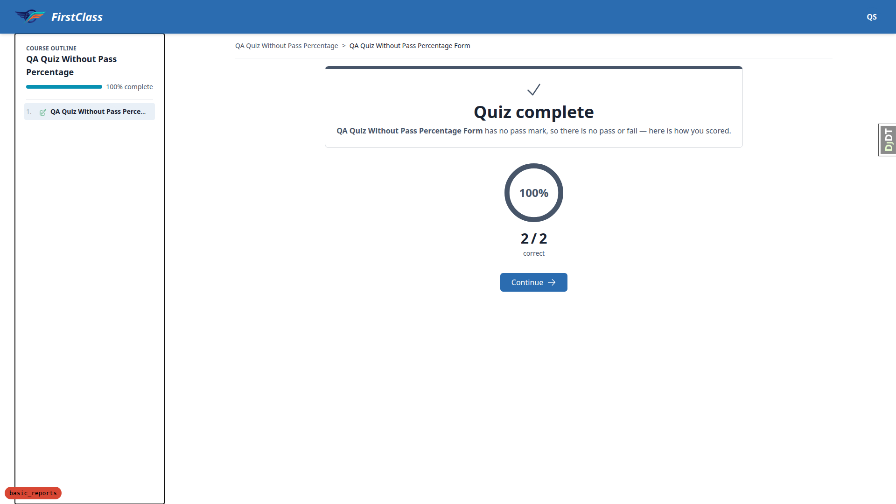

Every page in the plan's walk returned **200**:

| Page | Status |
|---|---|
| `/courses/qa-quiz-no-pass-pct-course/1/complete` (results) | 200 |
| `/courses/qa-quiz-no-pass-pct-course/1/` (course player) | 200 |
| `/courses/qa-quiz-no-pass-pct-course/detail/` | 200 |
| `/courses/` (course home) | 200 |
| **`/` (student dashboard)** | 200 |
| `/courses/qa-question-types-course/detail/` (second course) | 200 |
| `/courses/qa-question-types-course/1/` (second course player) | 200 |

Logging out and back in redirects to the dashboard, which renders normally — **no lockout**:

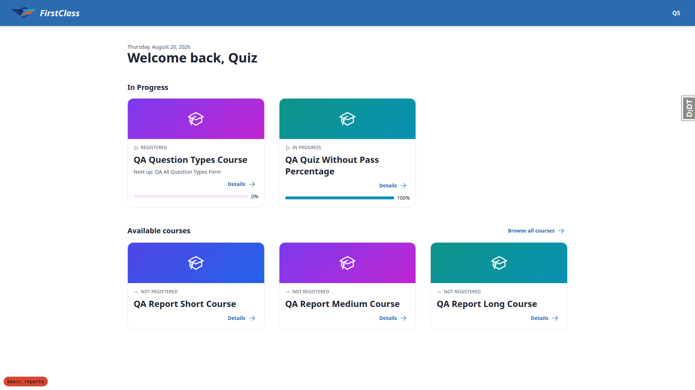

The second, unrelated course opens normally, so nothing is globally broken.

**Course completion is also guarded.** The no-pass-mark course reaches its finish page and completes
cleanly — `unpassed_forms()` does not call `passed()` unguarded, so no `ValueError`:

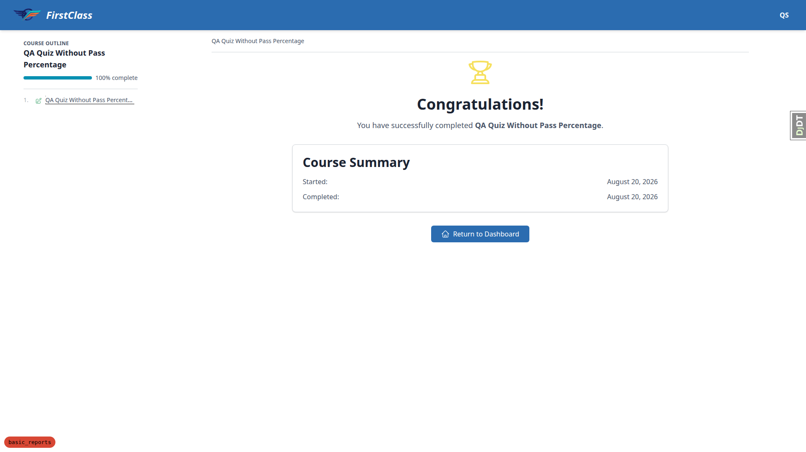

## QA 12.3 — Single-select multiple choice is unchanged

Answering the `multiple_choice` question **incorrectly** lists exactly that question as
"Marked wrong", with "Your answer: MC option B" against "Correct answer: MC option A", and drops the
score to 1/4. Answering it correctly scores it and omits it from the list. Behaviour is unchanged:

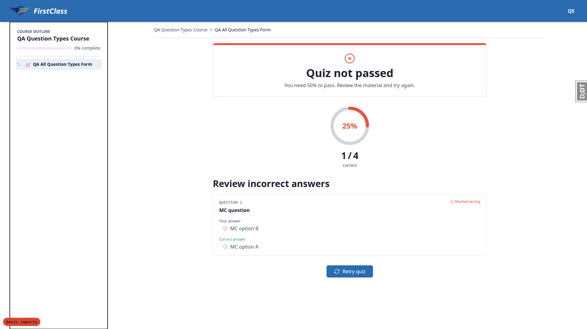

## QA 12.4 — Free-text questions

In a **non-scored** form (`qa-free-text-survey-form`, `strategy: CATEGORY_VALUE_SUM`, no pass mark),
the form completes with *"Form complete! Thank you for completing QA Free Text Survey. Your answers
have been recorded."* — **no score, no pass/fail, no incorrect-answer machinery at all**:

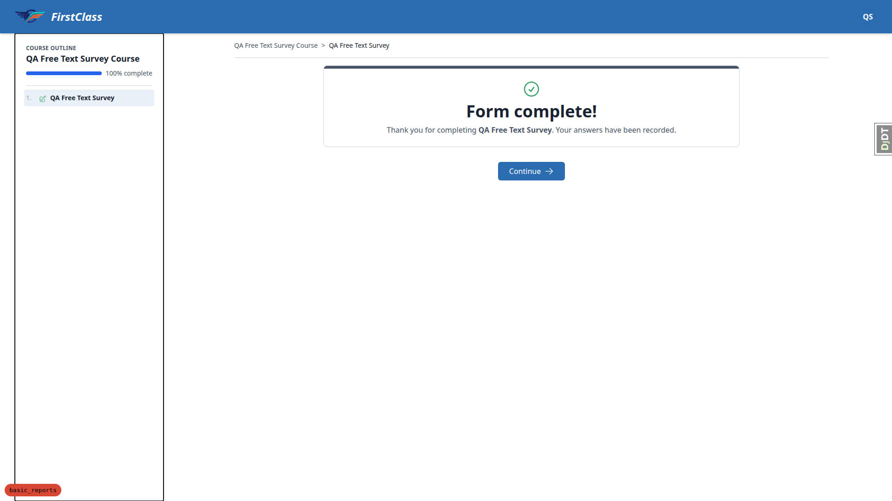

All four answers were saved, including both optional questions (verified directly against
`FormProgress.answers`):

| Question | Stored answer |
|---|---|
| In one line, what was the most useful thing you learned? | "The scoring rules for multi-select questions." |
| How would you explain this course to a colleague? | "It walks you through each question type and shows how answers are marked." |
| If you could change one thing…? *(optional)* | "More worked examples." |
| Any other comments…? *(optional)* | "No further comments." |

**Defensive check (free-text inside a scored quiz).** `qa-all-question-types-form` does contain
free-text, so the branch was exercised: both free-text questions **score 0** and **neither appears in
the incorrect-answers list**, and no broken card with empty "Your answer" / "Correct answer" blocks is
rendered. This is the robust outcome the plan asks for. The configuration itself is a fixture
artefact rather than authored content — see Observation B.

## QA 12.5 — Educator live panel

The cohort course-progress panel renders for both courses, with percentages and attempt counts.

With a pass mark, verdicts appear (`50% Pass ×4`, `0% Fail ×1`). With **no** pass mark, the same
panel shows the score and attempt count and **no verdict**, and does not error:

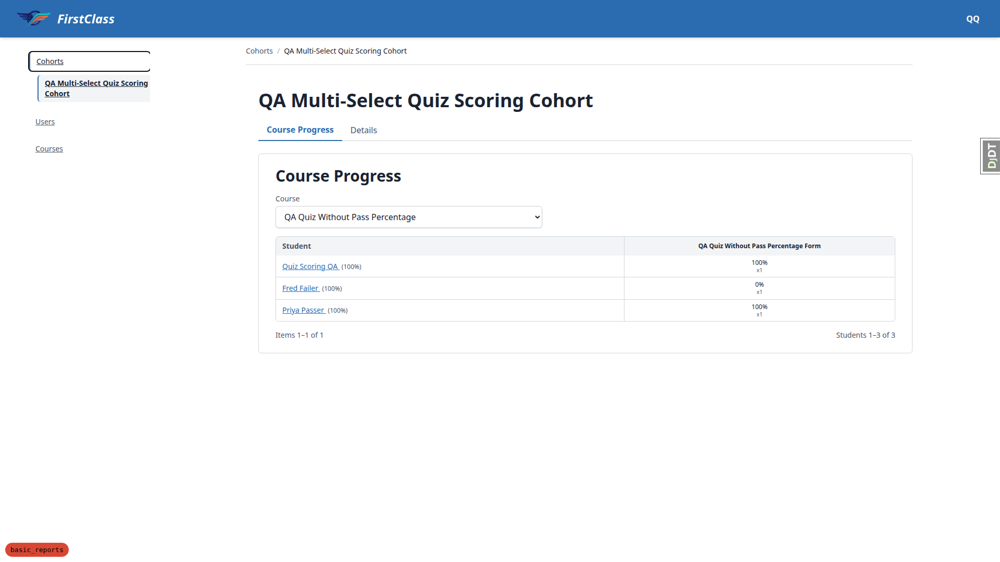

At tablet width the panel keeps its tabs, course selector and table; the table sits in an
`overflow-x: auto` wrapper and the page itself does not scroll horizontally (`scrollWidth` 768 =
`clientWidth` 768):


## QA 12.6 — Historical attempts are not rescored

**Passes, and the page does better than the plan requires.** The crafted pre-fix attempt (every
option ticked, stored score 2/2) shows:

- the **stored** score unchanged — 100%, 2 / 2, "Quiz passed!"
- the same question listed under "Review incorrect answers" as "Marked wrong" (derived at read time)
- and an explicit reconciliation note between them: *"This quiz has changed since you sat it. Your
  attempt has not been re-marked, so the score above is the one you were given at the time."*

The plan asks only that nothing on the page claim otherwise; the page actively explains the
discrepancy.

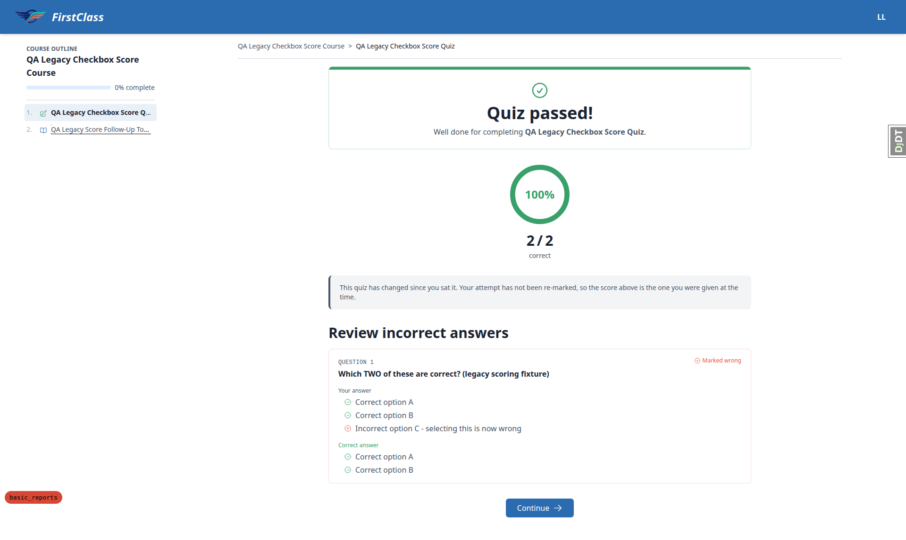

This is the same underlying data as the sibling plan's `legacy-score-discrepancy.pdf`, which makes
the pair a direct A/B: here the learner's correct ticks are green and the wrong one red; in the PDF
all three are red.

## QA 13 — Demo content sanity

The dev database had **no demo content loaded** (zero `functionality_demo_*` courses). Loaded via the
project's own loader rather than by hand:

```bash
uv run manage.py content_save demo_content/functionality_demo_end_with_quiz DemoDev
uv run manage.py content_save demo_content/functionality_demo_course_parts DemoDev
```

| Demo quiz | Pass mark | Result |
|---|---|---|
| `functionality-demo-show-end-with-quiz` — Mid course Quiz | 80% | **100% (6/6)** — passed |
| `functionality-demo-show-end-with-quiz` — End course Quiz | 50% | **100% (6/6)** — passed |
| `functionality-demo-course-parts` — Knowledge Check | 80% | **100% (3/3)** — passed |

Every demo quiz remains completable and reaches 100%; no demo question has become unanswerable.

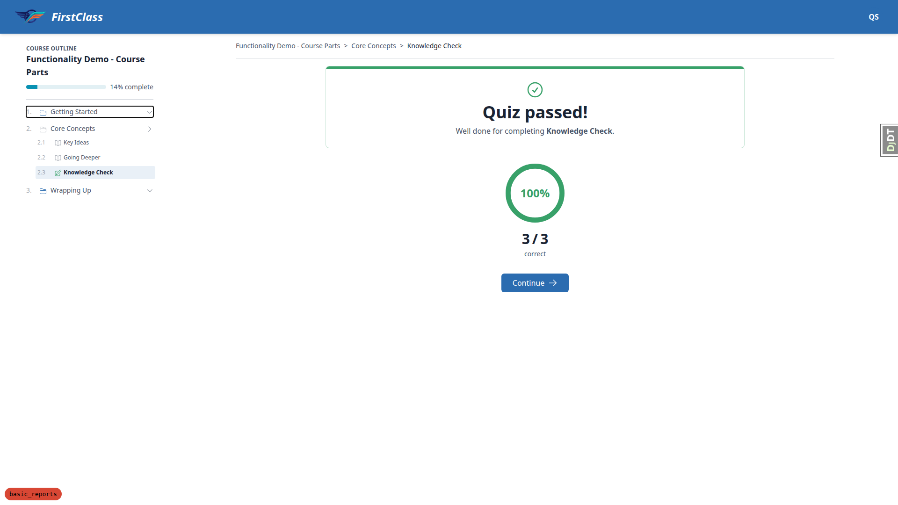

**QA 13.3 — no authoring finding.** A database-wide scan found **no** `multiple_choice` question with
more than one correct option, in demo content or anywhere else. Nothing needs calling out in the
upgrade notes on this axis.

## Mobile pass (375×812)

- **No horizontal overflow** on the runner or the results page (`scrollWidth` 375 = `clientWidth`).
- Radio and checkbox controls stay clearly distinguishable — round vs square — at this width.
- Option touch targets are **343 × 48 px**, above the 44 px guideline. The sticky "Next" button is
  343 × 40 px — full width but 4 px under the guideline height; minor.
- The course outline collapses to a hamburger; the results page's incorrect-answer card stacks
  readably with its per-option glyphs intact.

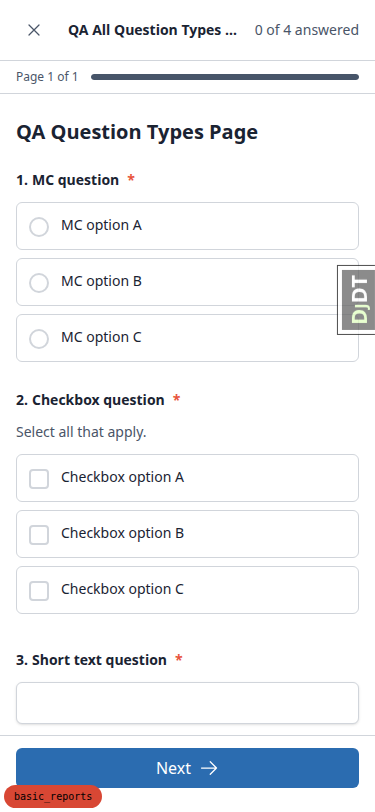

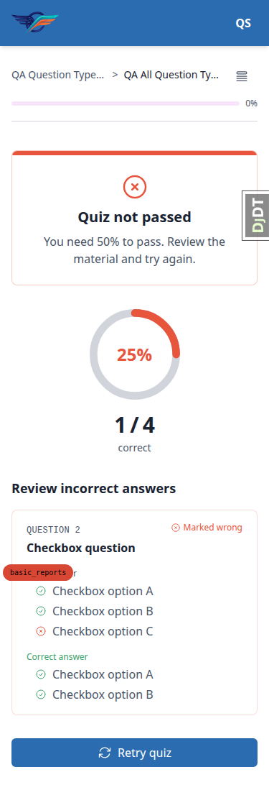

## Tablet pass (768×1024)

- The tablet gets the **mobile-style collapsed nav**, not the desktop sidebar. The outline opens as a
  bottom-sheet drawer over a dimmed backdrop and works correctly.
- No horizontal overflow on any surface tested; the educator table scrolls inside its own wrapper.
- The results page and its incorrect-answer card render at a comfortable width.

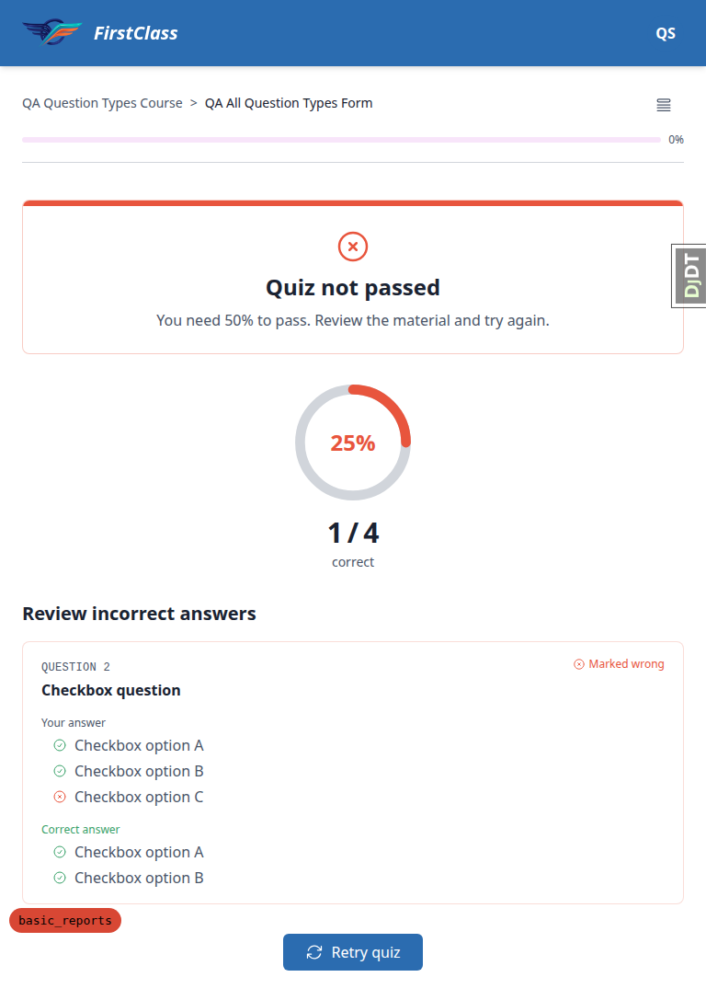

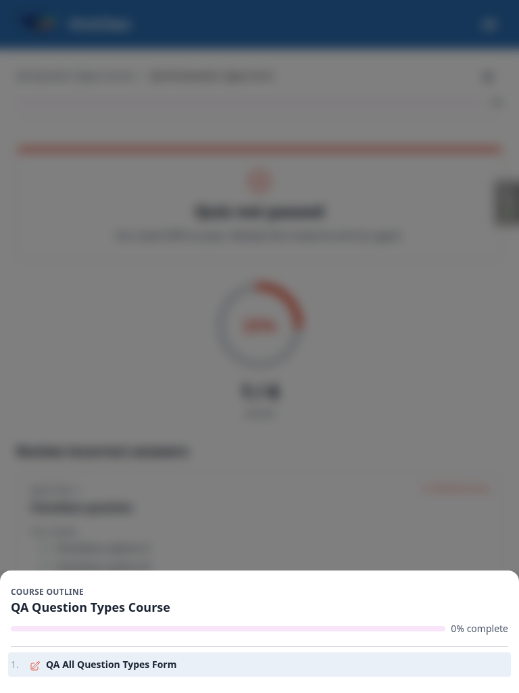

---

## Observations (tangential — not failures of this plan)

### A. Free-text answers are saved but the learner can never re-read them

QA 12.4 asks that a free-text answer be "saved and shown back". The answers are definitely **saved**,
and the completion page correctly shows no scoring machinery — but there is no route in the UI back
to the submitted text. Revisiting the form shows only a "Previous attempts / 20 Aug 2026 / Completed"
row with no link, and the completion page does not echo the answers. For a reflective or feedback
form, a learner may reasonably expect to re-read what they wrote. Worth a product decision rather
than a defect.

### B. The QA fixture mixes free-text into a scored quiz

`qa-all-question-types-form` is `strategy: QUIZ` yet contains `short_text` and `long_text` questions
— exactly the pattern the plan says should not exist in authored content. The consequence is a score
ceiling of 50% on a form whose pass mark is 50%, so "answer every option-backed question perfectly"
and "scrape a pass" are the same outcome, and no attempt can ever exceed the pass mark. That made
QA 11's percentages awkward to reason about and would make a genuine off-by-one in scoring hard to
spot.

It is a **fixture** problem, not authored content (the scan in QA 13.3 found no such form in demo
content), so it is not an upgrade-notes item — but `qa_create_multiselect_quiz_scoring` would be
better splitting the free-text questions into a separate non-scored form, which would also let QA 11
use round percentages.

### C. The dev database had no demo content

QA 13 could not start until the two demo courses were loaded (see above). Not a product defect, but
worth knowing that a fresh QA run of this plan needs the `content_save` step, which the plan's Setup
section does not currently mention.

### D. The form runner's "Leave site?" prompt

Navigating away from a part-filled form fires a native `beforeunload` prompt. This is **correct**
here — there were genuinely unsaved changes. Noted only to record that the previously-reported
spurious-prompt bug did not reappear: no prompt fired when navigating away from an untouched form.

---

## Difficulties

- Report generation and quiz submission for the larger fixtures occasionally exceed Playwright's 5 s
  click timeout. The submissions all completed server-side; the timeout is a client-side wait, and
  each result was verified on the following page.
- The django-debug-toolbar overlay intercepts clicks in the bottom-left region; hiding it once
  cleared this for the rest of the run.
- Option `<input>` elements are `sr-only` behind their labels, so `browser_click` on the input is
  intercepted by the label. Selections were made by clicking through the same elements a user's tap
  would activate; the resulting checked state was asserted before every submit.
