# QA report: multi-select quiz scoring fix (student-facing)

**Plan:** `frontend_qa_quiz_marking.md`
**Run date:** 17 August 2026
**Branch:** `basic_reports` (confirmed via `debug-branch-badge`)
**Server:** `http://127.0.0.1:8046`, site `DemoDev`
**Viewports:** desktop 1920×1080, mobile 375×812, tablet 768×1024
**Tooling:** Playwright MCP, driven interactively (no test scripts)

## Headline

**The fix works.** Ticking every option on a `checkboxes` question no longer scores full marks — the
regression this spec exists to close is closed, on every surface tested: the quiz runner, the results
page, the course player's progression gate, the student dashboard and the educator live panel. No
page returned a 500 at any point, including every no-pass-mark page the plan flagged as a critical
risk.

Six findings are recorded below. **None of them is a regression introduced by this change** — the
scoring fix itself passed every assertion the plan makes about it. Five are pre-existing behaviours
that this plan's checks happened to surface, and one (Finding 2) is an inherent consequence of the
deliberate decision not to rescore history.

## Result summary

| Test | Result | Note |
|---|---|---|
| QA 11 — checkbox scoring, 5-case matrix | **4 of 5 pass** | Row 5 ("tick nothing") fails the score/list-agreement check → Finding 1 |
| QA 12.1 — pass/fail and navigation | **Pass** | Fail keeps item 3 locked; pass unlocks it |
| QA 12.2 — unset pass mark, full page walk | **Pass** | No 500 anywhere, incl. dashboard and re-login |
| QA 12.3 — single-select unchanged | **Pass** | |
| QA 12.4 — free-text in a non-scored form | **Pass** | Defensive free-text-in-a-quiz check also passes |
| QA 12.5 — educator live panel | **Pass** | Incl. no-pass-mark course and tablet width |
| QA 12.6 — historical attempts not rescored | **Pass, with a caveat** | Stored score correctly unchanged, but the page contradicts itself → Finding 2 |
| QA 13 — demo content sanity | **Pass** | 13.3 has nothing to find — see Observation D |

### QA 11 matrix as observed

The scored quiz used was `qa-checkbox-scoring-course` — option-backed questions only, so 100% is
reachable. **Maximum score: 2** (one `multiple_choice`, one `checkboxes` with 2 correct of 3).
**Pass mark: 80%**, `quiz_show_incorrect: true`. The multiple-choice question was answered correctly
in every row except the QA 12.3 run, so the checkbox question alone drives the difference.

| What was ticked on the checkbox question | Score | % | Verdict | In incorrect list? | Agree? |
|---|---|---|---|---|---|
| All three options | 1 / 2 | 50% | Not passed | Yes | ✅ |
| The two correct options only | 2 / 2 | 100% | **Passed** | No | ✅ |
| One of the two correct options | 1 / 2 | 50% | Not passed | Yes | ✅ |
| Only the incorrect option *(extra case, see Observation E)* | 1 / 2 | 50% | Not passed | Yes | ✅ |
| Both correct plus the incorrect one *(= row 1 here)* | 1 / 2 | 50% | Not passed | Yes | ✅ |
| Nothing | 1 / 2 | 50% | Not passed | **No — section absent** | ❌ Finding 1 |

Row 1 is the headline regression check and it passes:

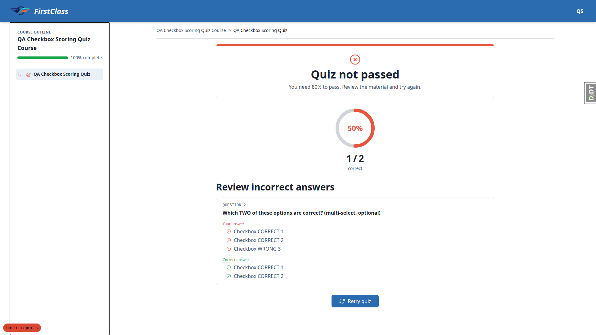

Row 2 confirms the quiz is still winnable — a clean 100% with no incorrect-answer section:

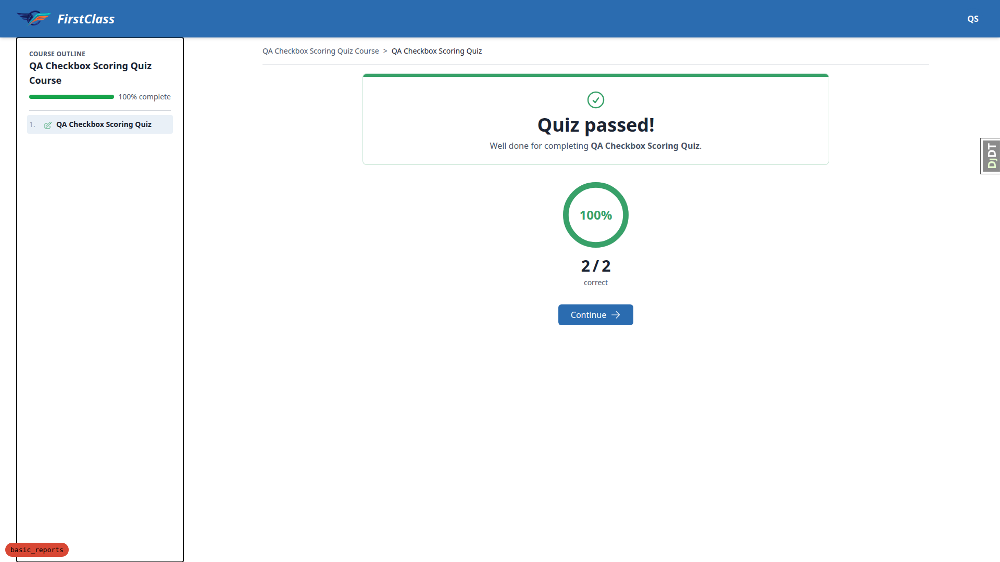

---

## Finding 1 — A question left blank is scored wrong but vanishes from the incorrect-answer list

**Test:** QA 11, matrix row 5 ("Nothing" ticked).
**Severity:** Medium — a learner who fails is told nothing about *why*.
**Regression introduced by this change?** No. Pre-existing "unanswered ≠ incorrect" behaviour.

**Expected:** the plan requires that "a question counted wrong in the score must appear in the
incorrect list, and vice versa", and states that a disagreement "is the exact bug this fix exists to
close".

**Actual:** the checkbox question is correctly scored 0 (score 1/2, 50%, "Quiz not passed"), but the
**entire "Review incorrect answers" section is absent from the page**. The learner is told they need
80% to pass and given no indication which question they got wrong:

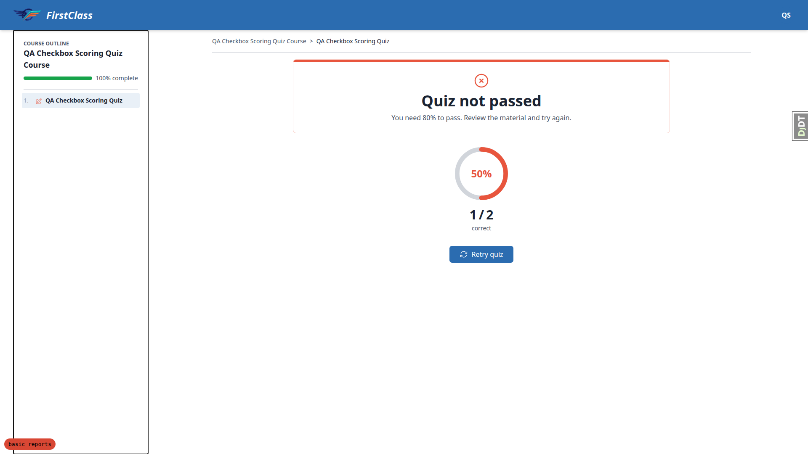

Compare row 3, where the same 1/2 score *does* produce a review section:

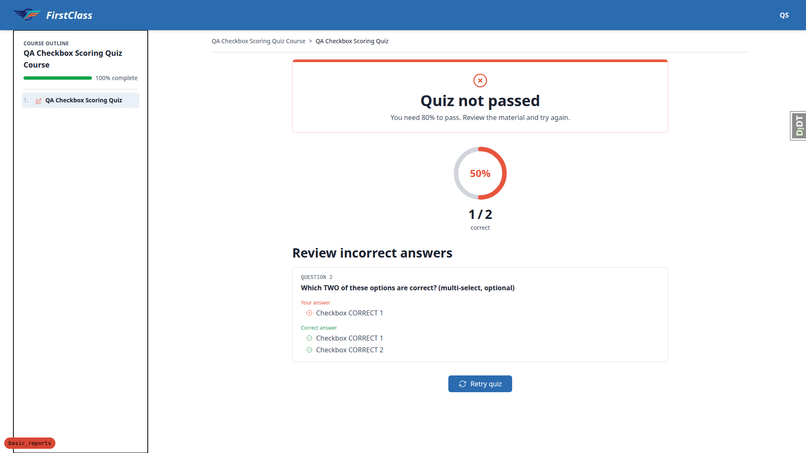

**Cause:** `save_answers` writes no `QuestionAnswer` row when a question has no submitted answer, and
`get_incorrect_quiz_answers()` iterates stored answer rows — so a blank question is invisible to it.
The score comes from `max_score`, which counts the question regardless.

**Scope note:** reaching this state needs an **optional** question inside a scored quiz. A `required`
question left blank is rejected with HTTP 422 by the runner, so the runner already guards the common
case. The submit dialog does warn "1 Answered / 2 Total questions" beforehand:

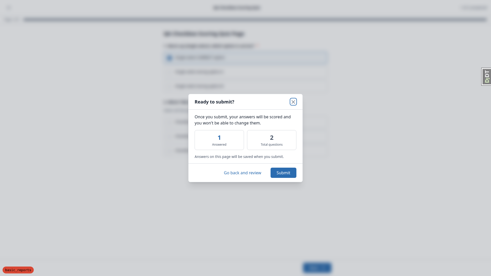

This is genuinely out of scope for the checkbox fix, but it is the one place where the plan's
score/list-agreement rule is violated, so it is recorded as a finding rather than an observation.

## Finding 2 — Legacy attempt page claims "2 / 2 correct" and lists a wrong answer, with no explanation

**Test:** QA 12.6 (historical attempts are not rescored).
**Severity:** Low–Medium — affects only the finite set of attempts submitted before the fix.
**Regression introduced by this change?** No — this is the intended non-rescoring behaviour becoming
visible. The design decision is right; the page just does not explain itself.

**Expected:** the plan expects the stored score to be unchanged while the incorrect-answer list,
derived at read time, marks the question wrong — and asks me to "confirm nothing on the page claims
otherwise".

**Actual:** both halves behave exactly as specified — the stored score is untouched at 2/2 and the
review section correctly recomputes the checkbox question as wrong. But something on the page *does*
claim otherwise: the figure **"2 / 2 correct"** asserts that both questions were answered correctly,
directly above a section stating that Question 1 was not. On a two-question quiz the contradiction is
unmissable, and the page carries no methodology note:

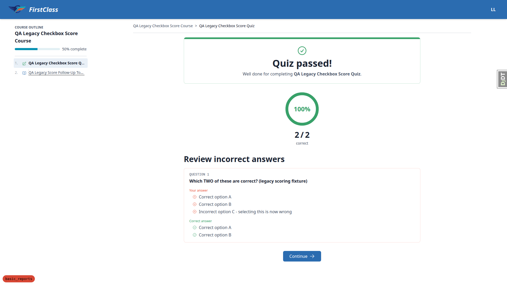

The sibling plan's QA 2.11 prints both numbers in the report *with* an explanatory note. The
student-facing page has no equivalent. A one-line explainer shown only when the stored score and the
recomputed list disagree would close this.

The educator panel reads the stored score and shows "100% Pass" for the same attempt. It surfaces no
per-question detail, so no contradiction is visible there:

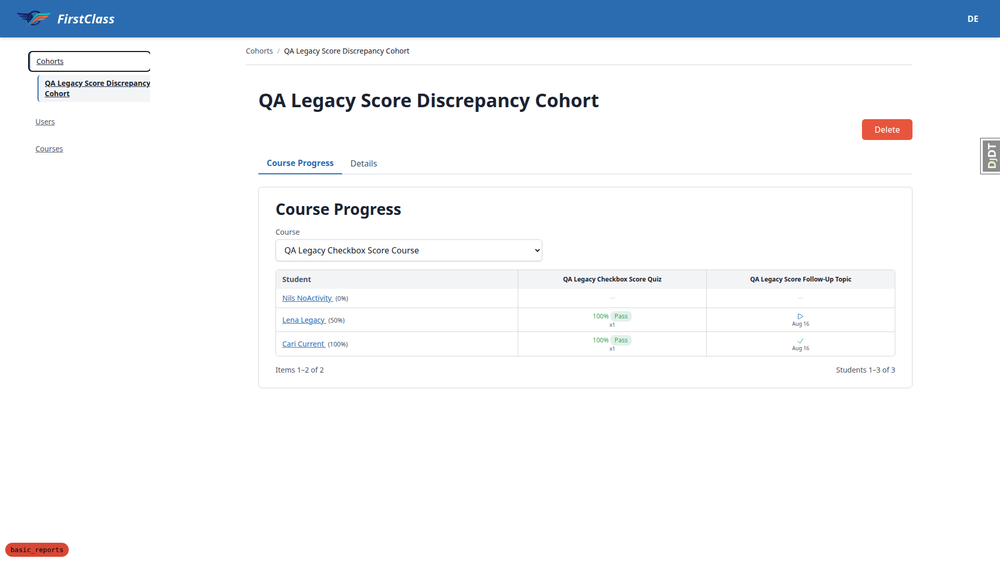

## Finding 3 — "Your answer" marks correctly-ticked options with a red error glyph

**Test:** QA 11, rows 1 and 4.
**Severity:** Low — cosmetic, but actively confusing on exactly the question type this spec changed.

**Expected:** a learner reviewing a wrong multi-select answer can tell which of their ticks were the
problem.

**Actual:** every option the learner ticked gets a red ✗, including the two that *are* correct. Those
same two options then appear with a green ✓ in the "Correct answer" block two lines below. "Checkbox
CORRECT 1" is simultaneously marked wrong and right:

Under exact-match scoring the *answer as a whole* is wrong, so a single wrong-answer marker on the
question is defensible — but per-option ✗ glyphs that contradict the block underneath are not. The
"only the wrong option" case reads correctly, because there the learner's single tick genuinely was
wrong:

Marking the answer wrong at question level, or ✗-ing only the options that were wrongly ticked or
wrongly omitted, would both read better.

## Finding 4 — Spurious "Leave site?" prompt when nothing has been changed

**Severity:** Low.
**Regression introduced by this change?** Almost certainly not — the guard is in the form runner.

**Expected:** an unsaved-changes guard fires when there are unsaved changes.

**Actual:** it fires on every navigation away from the form runner, including immediately after a
fresh page load with **no option ticked and no text typed**. Verified deliberately: loaded
`/courses/qa-checkbox-scoring-course/1/fill_form/1`, touched nothing, navigated to `/` — the
`beforeunload` dialog appeared and blocked navigation until dismissed. Reproduced on the survey runner
too. A learner who opens a quiz and changes their mind gets a browser warning they have not earned.

## Finding 5 — A failed quiz counts as complete for the course progress bar

**Severity:** Low.

**Expected:** progress reflects work actually completed.

**Actual:** an item whose status is "Needs retry" is counted toward the completion percentage. The
single-item checkbox course reads **"100% complete"** while its only item shows "Needs retry"
(visible in the sidebar of most screenshots above). The progression-block course reads **67%** —
2 of 3 — with the failed quiz among the two:

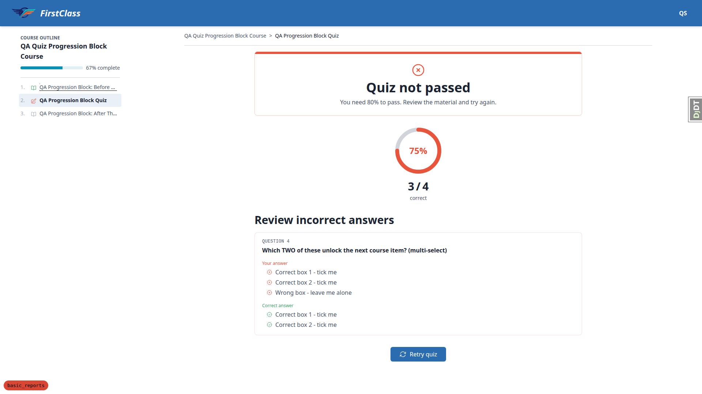

The progression gate itself is correct: item 3 stayed locked. Only the percentage is generous.

## Finding 6 — A never-marked survey tells the learner "marking is in progress"

**Test:** QA 12.4.
**Severity:** Low (copy).

**Expected:** per the plan, "no pass/fail or incorrect-answer machinery appears at all".

**Actual:** the form completes cleanly with no score and no verdict — correct — but the confirmation
reads "Your responses are being reviewed — **marking is in progress**." The form is
`CATEGORY_VALUE_SUM` with no pass mark and will never be marked, so the learner is promised a result
that will never arrive:

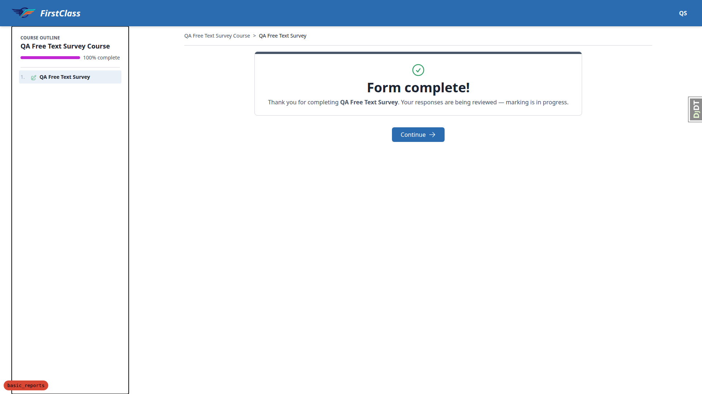

---

## Detail on the passing tests

### QA 12.1 — progression blocking (pass)

`qa-progression-block-course`: topic, quiz, topic. Pass mark 80, four questions, the `checkboxes`
question worth the difference.

Baseline — item 3 locked, rendered with no link at all:

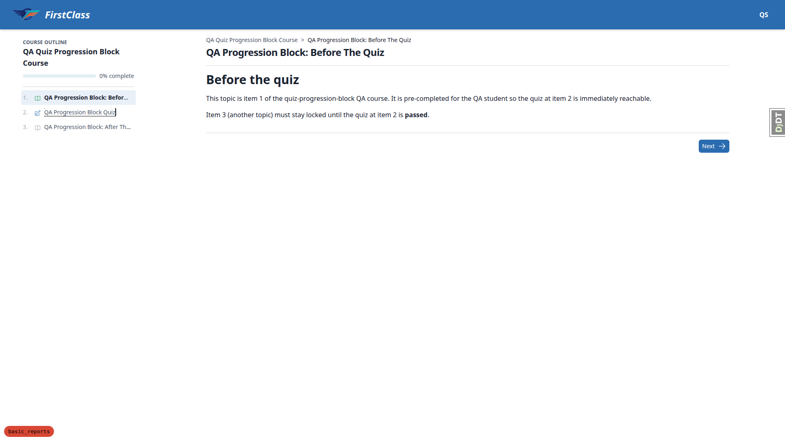

All three multiple-choice answers right, checkbox question wrong → **3/4 = 75%, not passed**, item 2
"Needs retry", item 3 still "Locked" and still unlinked. Retaken with the checkbox question right →
**4/4 = 100%, passed**, item 3 flips to "Not started" and becomes linked:

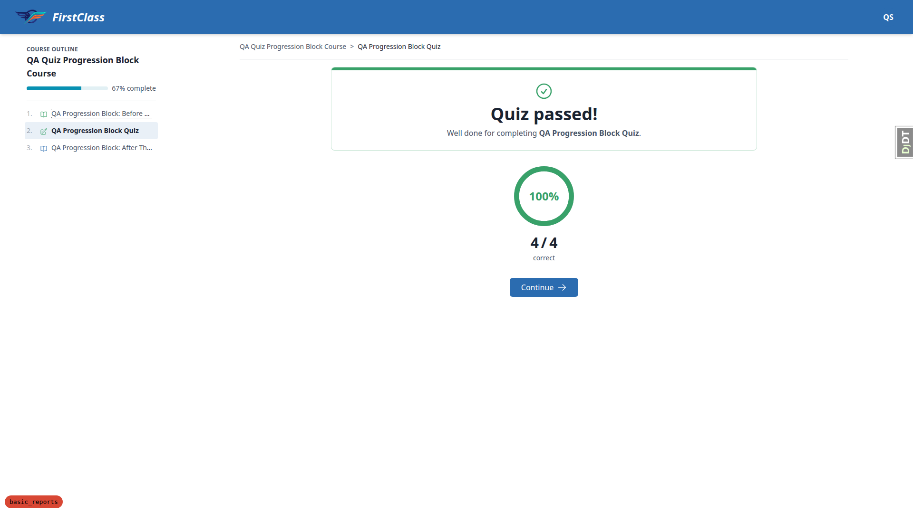

I confirmed the lock by checking the rendered `href` in the outline rather than by URL-guessing —
direct GETs of a blocked item return 200 and create progress, so the outline is the honest signal.

### QA 12.2 — unset pass mark (pass, and this was the critical one)

`qa-quiz-no-pass-pct-course`, `quiz_pass_percentage = None`. Submitted with all three checkbox
options ticked (correct answer: A + B), giving 1/2.

The results page shows the score and explicitly declines to judge — "**Quiz complete** … has no pass
mark, so there is no pass or fail — here is how you scored":

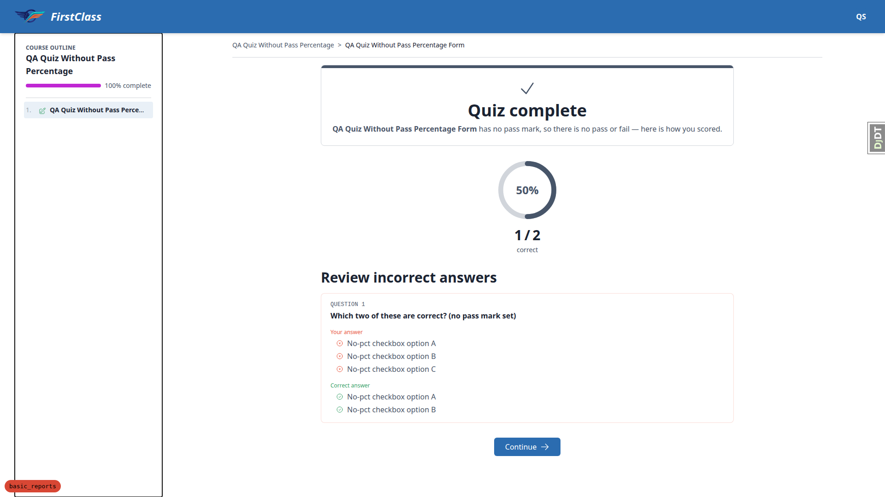

Every page in the plan's walk list then rendered, with no 500 anywhere:

| Page | Result |
|---|---|
| `/courses/qa-quiz-no-pass-pct-course/1/complete` | 200 — score, no verdict |
| `/courses/qa-quiz-no-pass-pct-course/1/` | 200 — "Previous attempts: 50% (1/2)", no verdict |
| `/courses/qa-quiz-no-pass-pct-course/detail/` | 200 |
| `/courses/` | 200 |
| **`/` (student dashboard)** | **200 — all 7 registered courses listed** |
| Log out → log back in | 200 — login redirect lands on a working dashboard |
| Second, unrelated course | 200 |

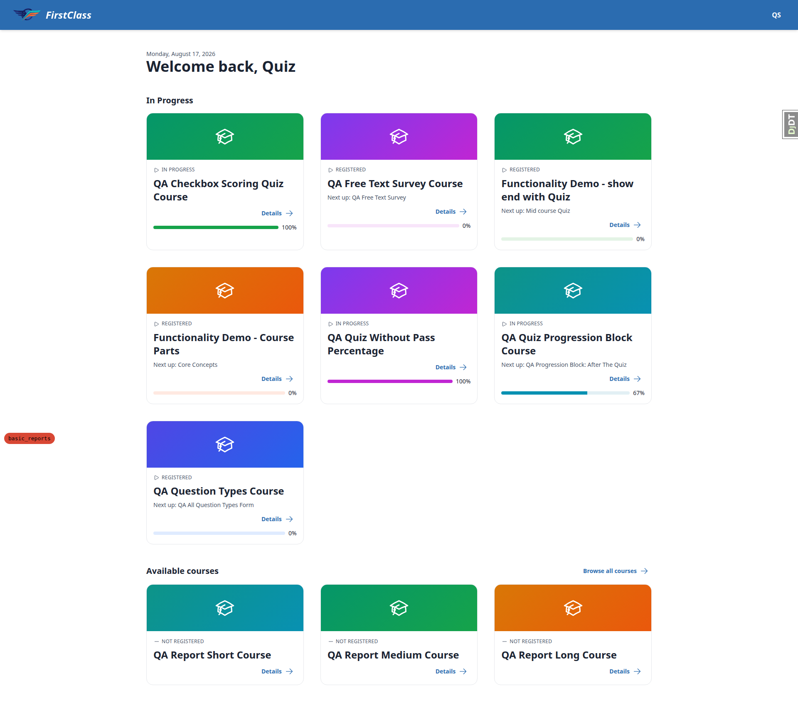

The item's status is "Completed", not "Failed" — a missing pass mark reads as "no verdict" rather
than as a failure, which is what the plan requires.

### QA 12.3 — single-select unchanged (pass)

Multiple-choice answered wrongly with the checkbox question right: 1/2 = 50%, not passed, and
**Question 1 — the multiple-choice one — listed as incorrect** while the checkbox question is
correctly absent:

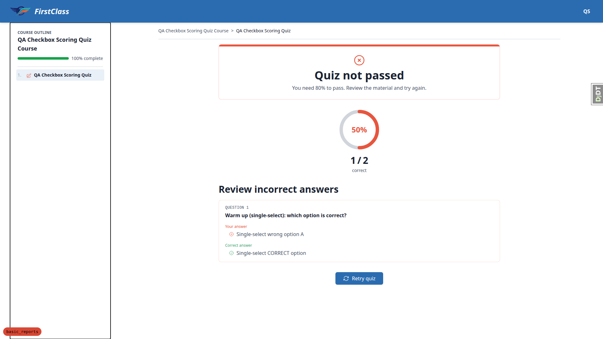

### QA 12.4 — free-text (pass, both halves)

Non-scored survey `qa-free-text-survey-course`: `short_text` and `long_text` answers saved across a
page boundary and shown back verbatim when navigating back with "Previous":

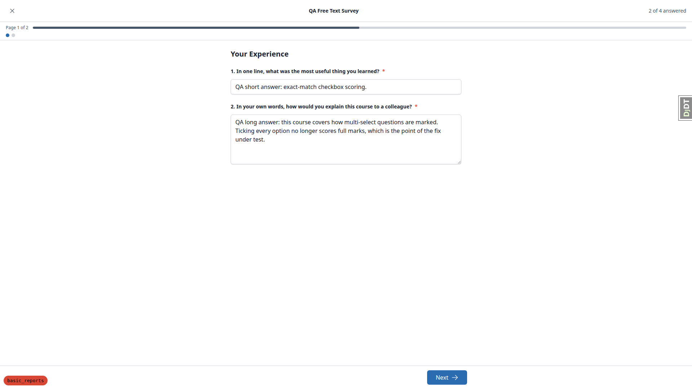

Defensive half — free-text *inside* a `strategy: QUIZ` form (`qa-all-question-types-form`): the
free-text questions score 0 and are **excluded** from the incorrect-answers list, so no broken cards
with empty "Your answer" / "Correct answer" blocks appear. 2/4 = 50%, which is that form's ceiling
(see Observation C):

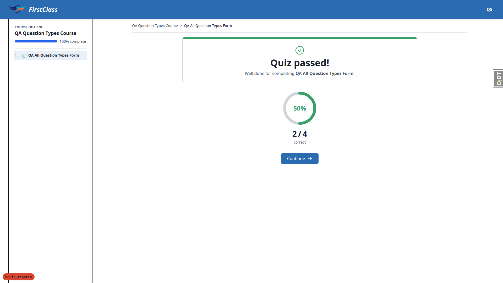

### QA 12.5 — educator live panel (pass)

Cohort *QA Multi-Select Quiz Scoring Cohort*, as `demodev@email.com`. Percentages render, attempt
counts render, and where a pass mark exists a Pass/Fail badge accompanies the figure:

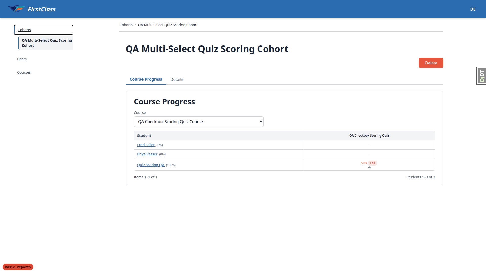

Switching the course selector to the **no-pass-mark** course is the crash risk the plan calls out. It
renders percentages (50%, 0%, 100%) with **no verdict badge at all** and no error:

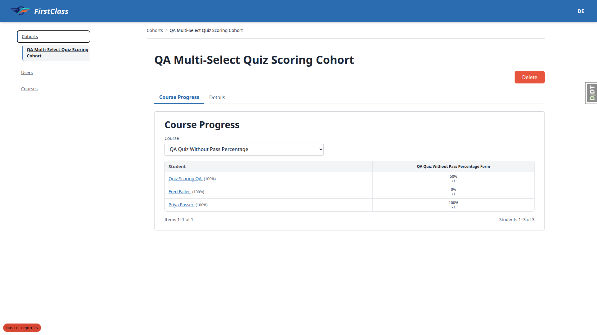

The Details tab and the legacy cohort's panel also render. HTMX tab and sub-panel URLs both returned
200.

### QA 13 — demo content (pass)

All three demo quizzes completable and passable at 100%:

| Quiz | Result |
|---|---|
| `functionality_demo_end_with_quiz` → Mid course Quiz | 6/6 = 100%, passed |
| `functionality_demo_end_with_quiz` → End course Quiz | 6/6 = 100%, passed |
| `functionality_demo_course_parts` → `02. Core Concepts/03. knowledge-check` | 3/3 = 100%, passed |

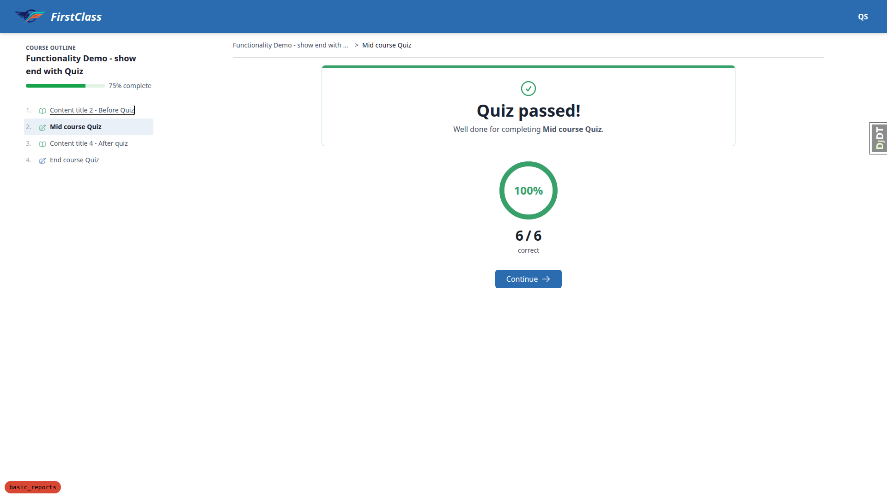

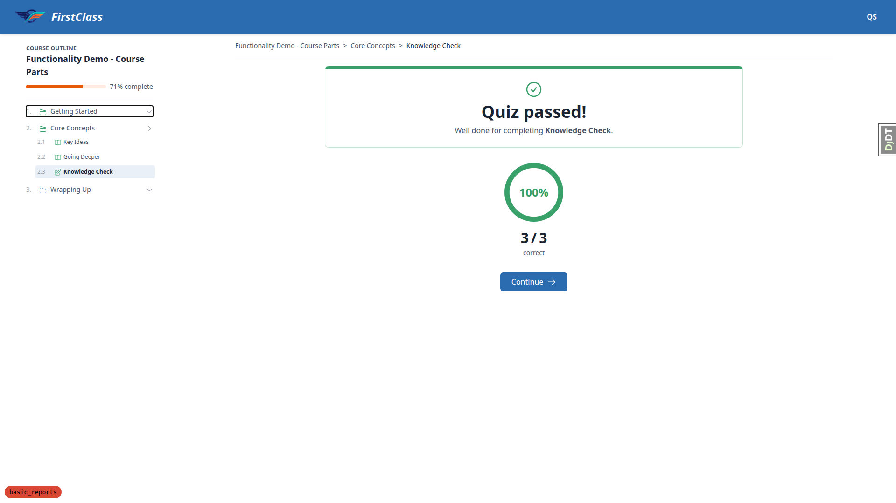

No demo question has become unanswerable. QA 13.3 found nothing to report — see Observation D.

## Mobile (375×812)

The plan's priority here is that radio and checkbox controls stay distinguishable. They do —
circles for single-select, squares for multi-select, with the "Select all that apply." hint on the
multi-select group:

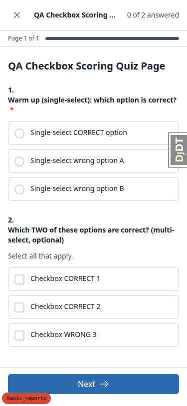

| Check | Result |
|---|---|
| Radio vs checkbox distinguishable | Pass — circle vs square, plus the hint text |
| Option touch targets | Pass — 46px tall, full width (above the 44px guideline) |
| Horizontal overflow | None — `scrollWidth` 375 = viewport on every page checked |
| Incorrect-answer cards | Pass — readable, no clipping, no overflow |
| Course outline navigation | Pass — collapses to a bottom-sheet drawer |
| Dashboard | Pass — no overflow, all courses reachable |
| Free-text form | Pass |

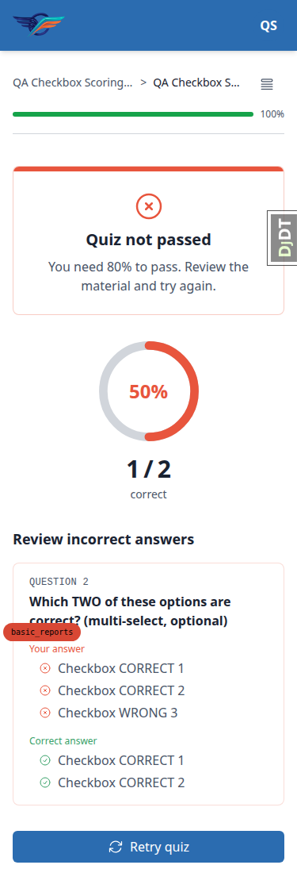

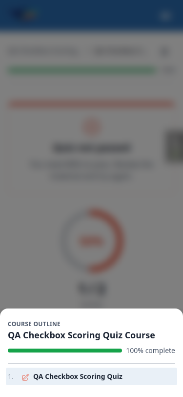

Minor: the "Exit test" (36px) and "Next" (40px) buttons are slightly under the 44px touch-target
guideline. Not raised as a finding — they are comfortably usable and unrelated to this change.

## Tablet (768×1024)

The tablet gets the **mobile** navigation treatment — the course outline collapses to a drawer rather
than showing the desktop sidebar. That is a coherent choice and it works.

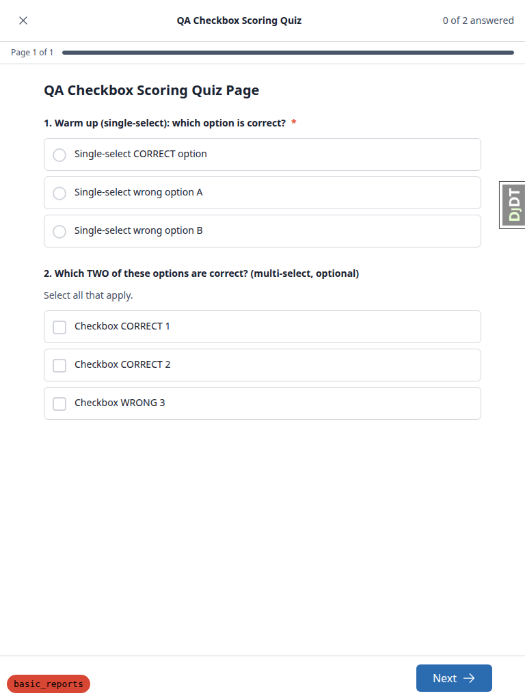

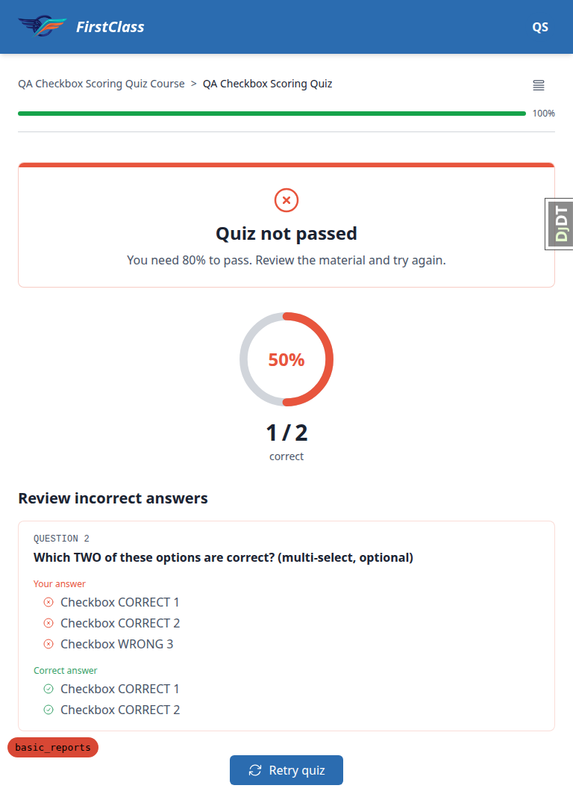

The educator panel — the plan's specific tablet ask — renders cleanly:

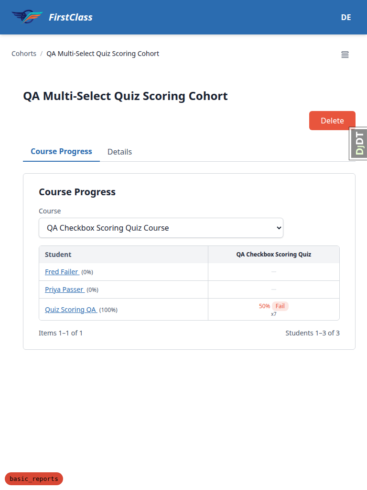

The QA cohort's table is only one item wide, so it cannot exercise column overflow. I checked a
genuinely wide one (*QA Col Boundary 11*, 16 columns, 1930px of table in a 768px viewport) and the
responsive pattern is correct: **the table scrolls inside its own `overflow-x: auto` container and
the page body does not overflow** (`document.scrollWidth` 768 = viewport):

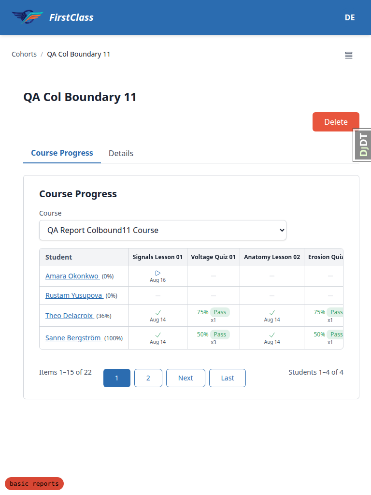

## Tangential observations

These are outside the feature under test. None blocks the spec.

**A. A form-only course reads "0 lessons".** `qa-quiz-no-pass-pct-course` has one item — the quiz —
and its detail page shows "LESSONS: 0 lessons" and "THIS COURSE INCLUDES: 0 lessons" alongside
"Includes assessments" and a course-content list containing that one item. The count appears to
exclude forms.

**B. A 100%-complete course is still labelled "IN PROGRESS" on the dashboard.** Visible on
`qa-quiz-no-pass-pct-course` and `qa-checkbox-scoring-course` in the dashboard screenshot above.
Partly a consequence of Finding 5.

**C. `qa-all-question-types-form` cannot reach 100%, exactly as the plan predicted.** Four questions
give `max_score = 4`, but its `short_text` and `long_text` questions can never be scored correct, so
the ceiling is 2/4 = 50%. Its pass mark is 50, so a learner who answers everything they possibly can
scores exactly the pass mark. This is the unrealistic-fixture trap the plan warns about, not a
scoring bug — which is why the QA 11 matrix was run against a purpose-built option-only quiz
instead. Per the plan's instruction, **free-text inside a `strategy: QUIZ` form is worth calling out
in the upgrade notes as an authoring anti-pattern.**

**D. The demo content contains no `checkboxes` questions at all.** `mid-course-quiz`,
`end-course-quiz` and `knowledge-check` are 100% single-select `multiple_choice` with exactly one
correct option each. So QA 13 verifies "nothing became unanswerable" but cannot exercise the
checkbox fix. Relatedly, **QA 13.3 found nothing**: a scan of the DemoDev site turned up no
`multiple_choice` question with more than one correct option, so there is no authored-content defect
of that kind to escalate. Two consequences worth noting: the demo content does not demonstrate
multi-select at all, and `end-course-quiz` has `quiz_show_incorrect: false`, so it shows no incorrect
list by design.

**E. The plan's matrix rows 1 and 4 coincide.** On a question with 2 correct options and 1 incorrect
one, "all three options" and "both correct plus the incorrect one" are the same submission. Row 4 is
therefore verified by row 1. I ran "only the incorrect option" as a distinct fifth combination to
keep five real data points; it passes.

## Difficulties and deviations

**Playwright was blocked at the start of the run.** A peer Claude session in this same worktree held
the shared Chrome profile (`~/.cache/ms-playwright-mcp/mcp-chrome-66560ed`), and Chrome refuses a
second instance on one profile. I stopped and asked rather than proceeding; on your instruction I
killed the headless Chrome holding the lock (PID 3679269) and the run proceeded normally. **If
parallel sessions in this worktree are routine, giving each Playwright MCP server its own
`--user-data-dir` (or `--isolated`) would remove this collision permanently.**

**Quiz option inputs are `sr-only` behind their labels.** Clicking the `<input>` directly times out
because the wrapping `<label>` intercepts the pointer event. All option selections were made by
clicking labels, which is what a real user does; every submission was verified against the DOM's
`checked` state before submitting.

**Test data was created by the `fls-dev:qa-data-helper` agent, not by hand.** It ran the two fixture
commands the plan names plus `qa_create_quiz_progression_block`, `qa_create_free_text_survey`,
`qa_create_legacy_checkbox_score` and `content_save demo_content`. Two gaps needed new `qa_helpers`
commands, both added by that agent with no application code touched:

- `qa_create_checkbox_scoring_quiz.py` — the clean option-only scored quiz QA 11 needs, since the
  existing all-question-types fixture caps at 50% (Observation C).
- `qa_reset_student_progress.py` — the QA student carried 21 stale `FormProgress` rows from an
  earlier pass, including a passed progression-block quiz that had already unlocked item 3, which
  would have invalidated QA 12.1.

**No test was skipped for missing data,** and nothing was marked PARTIAL or N/A.

**Screenshot compression was a no-op** — the largest capture is 407KB, well under the 1024KB
pre-commit limit, so `compress_screenshots.py` correctly found nothing to do.

**No PDF artifacts were produced,** as this plan specifies. The `legacy-score-discrepancy.pdf`
artifact belongs to the sibling plan's QA 2.11. Nothing outside this directory was written, read or
cleaned.

**One caveat on the educator panel's attempt counts.** Because QA 11 deliberately submits the same
quiz repeatedly, the panel shows "x7" attempts for the QA student by the end of the run. That is the
QA process, not a defect.

---

# Fixes applied

All six findings are fixed. Each landed failing-test-first; the full suite passes and every fix was
re-checked in the browser against the fixtures this run built.

| Finding | Fixed in | What changed |
|---|---|---|
| 1 — blank question missing from the review list | `student_progress/models.py`, `course_form_complete.html`, `reports/gather.py`, `reports/partials/student_detail.html` | A missing answer row is now judged as an empty selection rather than skipped |
| 2 — legacy attempt contradicts itself | `student_progress/models.py`, `student_interface/views.py`, `course_form_complete.html` | The page explains the stale score instead of leaving the learner to spot it |
| 3 — correct ticks marked with a red ✗ | `course_form_complete.html` | Each tick is marked on its own merit; the verdict moves to the question |
| 4 — spurious "Leave site?" prompt | `student_interface/.../alpine-components.js` | The guard waits for a real edit |
| 5 — failed quiz counts as complete | `student_progress/models.py`, `student_interface/utils.py` + `views.py`, `reports/gather.py`, `recalculate_progress_percentages` | A learner has to pass to complete |
| 6 — survey promises marking | `course_form_complete.html` | Copy matches what actually happens |

## Where the fixes went beyond the finding

**Finding 1 was fixed on the report too, not only the student page.** The root cause — `save_answers`
deliberately storing no row for a blank question — blinds *every* read-time correctness derivation,
and `reports/gather.py` walked the stored rows the same way. Its per-student wrong-answer detail and
its confusion tally now pair each completed sitting with every question it covered.

**The report's confusion denominators moved as a result.** `respondent_count` now counts the learners
who *sat* a question rather than those who answered it, so error rates on quizzes containing optional
questions will read differently from the 3a run's artifacts. That is the correct denominator for an
error rate, but it means the 3a report artifacts want regenerating before sign-off.

**Finding 5 also guards `course_finish`.** Changing only the percentage would have left a direct GET
of the finish URL stamping `CourseProgress.completed_time` over a failed quiz, so the dashboard would
still have said "Complete". The finish page now withholds the completion — it still renders, so the
learner is not locked out, they simply are not credited. The rule throughout is: a form counts as
finished when the learner has a completed attempt and, for a scored quiz, their **latest** completed
attempt passed. A quiz with no pass mark has no bar to clear and counts on completion, matching what
the course outline already showed.

**Finding 5 needs a backfill.** Stored `progress_percentage` values are stale under the new rule —
`uv run manage.py recalculate_progress_percentages` brings them in line (verified on the dev
database: 81 of 142 records moved, and a second run is a no-op). Already-stamped `completed_time`
values are left alone; history is not rewritten, consistent with the spec's non-rescoring stance.

**Finding 2 shows its note whenever the stored and re-derived scores disagree**, not only when the
incorrect-answer list is visible. The score and the verdict banner above it are stale either way, so
gating the explanation on `quiz_show_incorrect` would hide it exactly where the learner has the least
other information. `score_quiz()` split into a non-storing `compute_quiz_scores()` so the page can
re-derive without writing — one code path, so the live derivation cannot drift from what a fresh
attempt would score.

**Finding 3 treats `correct=None` as neither.** An option nobody marked up is not evidence either
way, so it carries a neutral glyph rather than being blamed alongside genuinely wrong ticks.

## What was not changed

**`save_answers` still writes no row for a blank question.** That behaviour is deliberate and correct
— a blank row would count toward the runner's answered tally and hide which questions are still
outstanding. The fix belongs in the readers, and that is where it went.

**Observation C is still open.** Free-text questions inside a `strategy: QUIZ` form still count toward
`max_score` while never being scorable. That is an authoring anti-pattern to call out in the upgrade
notes, not a scoring bug, and it remains an open todo item.

**Observations A, B, D and E** are unrelated to this spec and were left alone. Observation B ("a
100%-complete course is still labelled IN PROGRESS") was noted as partly a consequence of Finding 5;
with Finding 5 fixed, the failed-quiz half of it is gone.
