# QA report: Cohort progress PDF report + multi-select quiz scoring fix

**Date:** 2026-08-16
**Branch:** `basic_reports` (verified via `debug-branch-badge`)
**Server:** `http://127.0.0.1:8000` (own `runserver`, started for this run)
**Tooling:** Playwright MCP, desktop 1920×1080, mobile 375×812, tablet 768×1024

---

## Executive summary

| Section | Result |
|---|---|
| QA 0–9 (report generation, PDF, permissions, failure branches) | **Not executable — feature not implemented** |
| QA 10.1–10.4 (report deletion hygiene) | **Not executable — feature not implemented** |
| QA 10.5–10.6 (system checks) | **PASS** |
| QA 11 (checkbox scoring, all 5 rows) | **PASS** |
| QA 12.1 (pass/fail + navigation) | **PARTIAL** — see limitations |
| QA 12.2 (unset pass mark) | **FAIL — critical, see BUG-1** |
| QA 12.3 (single-select unchanged) | **PASS** |
| QA 12.4 (free-text questions) | **FAIL on a non-representative fixture — see BUG-2 (low)** |
| QA 12.5 (educator live panel) | **PASS** |
| QA 12.6 (historical attempts not rescored) | **Not executable** |
| QA 13 (demo content sanity) | **Not executable — no demo content loaded** |

**The headline regression this work exists to close is fixed.** Ticking every option on a
multi-select question no longer scores full marks, and the score agrees with the
incorrect-answer list in every case tested.

**Two bugs were found.** BUG-1 is critical and user-blocking and needs a fix. BUG-2 turned out to
rest on a fixture that mixes free-text into a scored quiz, which is not a real authoring pattern,
so it is recorded as a low-priority robustness finding. Neither was *introduced* by the
multi-select fix — both are pre-existing behaviours.

---

## Blocking issue: the report feature is not implemented

**QA 0 through QA 9, and QA 10.1–10.4, could not be executed at all.**

The `freedom_ls/reports` app contains no `admin.py`, `views.py`, `urls.py` or `tasks.py`.
Phase 5 of the implementation plan ("Trigger, task, admin, download" — plan lines 1157–1362) has
not been written. `/sdd:implement_plan` is still unticked in `todo.md`, and the branch's last
commit is `[batch 6]`, which is mid-Phase-4. `render.py` and `test_render.py` are present but
uncommitted.

Verified in the browser rather than only in the source:

- The admin index at `/admin/` has **no Reports section** at all. The word "report" does not
  appear anywhere on the page.
- `/admin/freedom_ls_reports/generatedreport/` returns **404**.

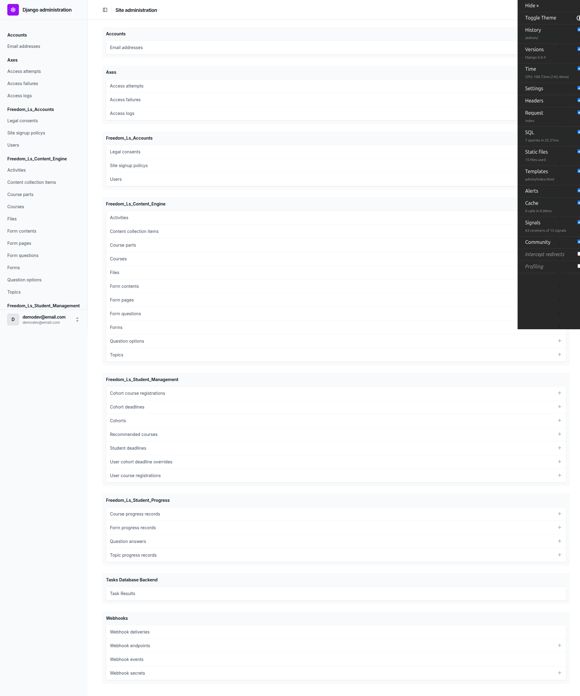
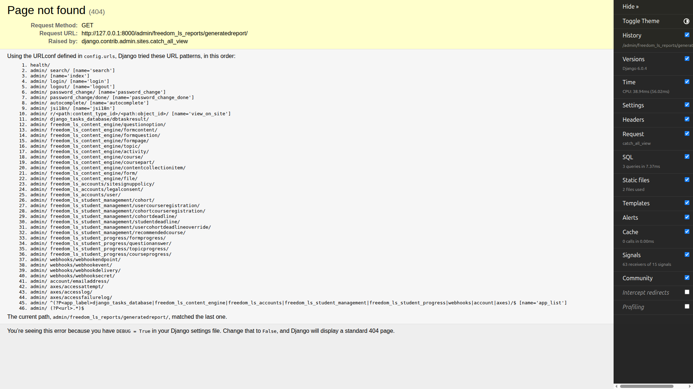

Because there is no generate trigger, no task runner and no download view, every check that
depends on producing or reading a PDF is unreachable: the whole fixture matrix (QA 0), the
end-to-end generate flow (QA 1), all PDF content checks (QA 2–5), greyscale print (QA 6), the
landscape column budget sign-off (QA 7), permissions and access control (QA 8), and all failure
branches (QA 9).

### Artifact manifest

The QA plan requires a `qa-artifacts/` directory with nine PDFs plus a manifest.

**No PDFs were produced, and `qa-artifacts/` was not created.** Every fixture in the matrix is
missing for the same single reason: there is no implemented code path that can generate a report.

| Fixture key | Status | Reason missing |
|---|---|---|
| `empty-cohort` | Missing | No report generation code path exists (Phase 5 unimplemented) |
| `no-registrations` | Missing | As above |
| `tiny-cohort-short-course` | Missing | As above |
| `small-cohort-medium-course` | Missing | As above |
| `standard-cohort-medium-course` | Missing | As above |
| `large-cohort-medium-course` | Missing | As above |
| `xl-cohort-long-course` | Missing | As above |
| `two-course-cohort` | Missing | As above |
| `no-progress-cohort` | Missing | As above |
| `no-pass-mark-cohort` | Missing | As above (fixture added to the plan during this run) |
| `xl-cohort-long-course_column-overflow` | Missing | As above |
| `legacy-score-discrepancy` | Missing | As above |

The fixture *data* was also not built, since building nine cohort/course fixtures has no value
until something can consume them. That work should be done as part of the QA re-run once Phase 5
lands.

**QA 7 explicitly requires sign-off before the 10–12 column constant is accepted. That sign-off
cannot be given from this run.**

---

## BUG-1 (Critical): a quiz with no pass mark 500s the results page, the course player, and the student's dashboard

**Test:** QA 12.2 — "take a quiz whose `quiz_pass_percentage` is `None`. **Expect** the results
page renders with a score and **no** pass/fail verdict, and **no** error page."

**This is not a misconfiguration to be designed away.** `Form.quiz_pass_percentage` is
`blank=True, null=True`, and leaving it unset is a normal authoring choice — a questionnaire, a
survey, a self-assessment, or a practice quiz that should report a score without ever pronouncing
the learner passed or failed. Authors will do this routinely, so every surface has to treat "no
pass mark" as an ordinary state meaning *no verdict*, never as an error. The QA plan has been
updated to say so explicitly (see "Forms with no pass mark are a supported configuration").

**Expected:** results page renders a score with no verdict.

**Actual:** `HTTP 500 ValueError`. The damage is not confined to the results page.

Reproduction (student `demodev_quizqa@email.com`, course `qa-quiz-no-pass-pct-course`, form
`qa-quiz-no-pass-pct-form` with `quiz_pass_percentage=None`):

1. Start the quiz, answer it, submit.
2. `/courses/qa-quiz-no-pass-pct-course/1/complete` → **500**
3. `/courses/qa-quiz-no-pass-pct-course/1/` (the course player) → **500**
4. `/` (the student's dashboard) → **500**
5. Log out and log back in → login succeeds, then redirects to `/` → **500**

**The student is locked out of the platform entirely.** After completing one such quiz they cannot
reach their dashboard at all; the only pages that still work are other courses reached by typing
the URL directly.

Error text:

> `ValueError at /courses/qa-quiz-no-pass-pct-course/1/complete`
> Quiz 'QA Quiz Without Pass Percentage Form' (ID: 00195635-…) does not have a pass percentage
> configured. Set quiz_pass_percentage on the Form to use this method.

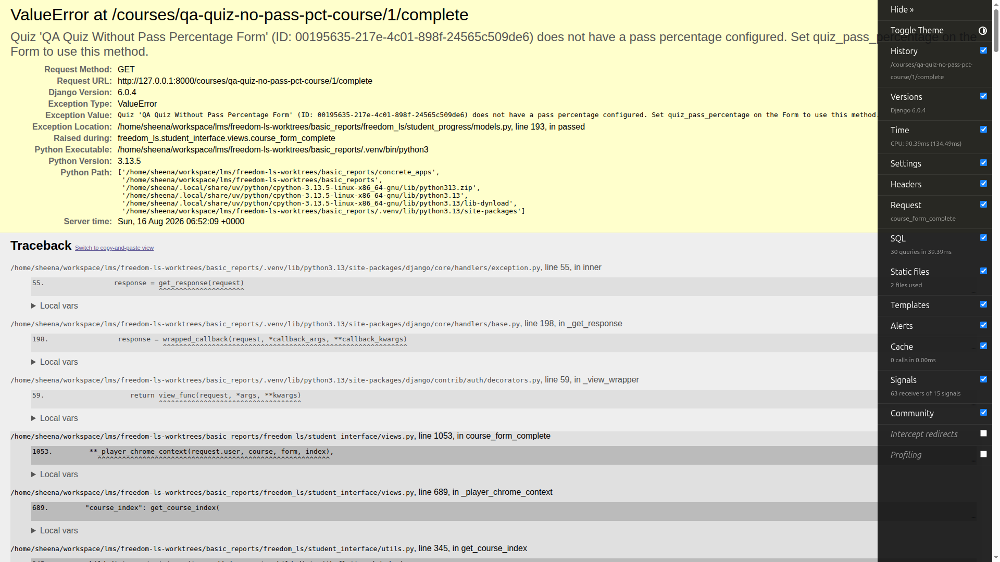

The dashboard, after a single completed attempt:

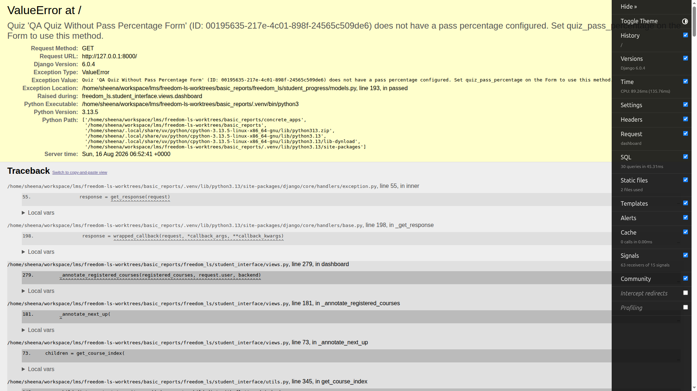

### Cause

`FormProgress.passed()` (`freedom_ls/student_progress/models.py:193`) raises `ValueError` when
`quiz_pass_percentage` is `None`. Two call sites in the student interface invoke it without
guarding:

- `freedom_ls/student_interface/utils.py:144` — `if form_progress.passed():` inside the
  course-index status calculation. This is the one in the traceback, and it is why the dashboard
  and course player both fail: they build the course index for every registered course.
- `freedom_ls/student_interface/views.py:1013` — `is_failed_quiz = not form_progress.passed()`

Worth noting: **the code added by this feature guards correctly.** Both
`freedom_ls/reports/gather.py:303` and `freedom_ls/educator_interface/views.py:489` use the
`if ... quiz_pass_percentage is not None` guard, which is why QA 12.5 passes. The two unguarded
call sites are the older student-facing ones.

### Suggested fix

Guard both student-interface call sites the same way the reports and educator code already does —
treat `None` as "no verdict" (render the score, and for the course index treat a completed
no-pass-mark quiz as COMPLETE/READY rather than calling `passed()` at all).

---

## BUG-2 (Low — robustness only): free-text questions are listed under "Review incorrect answers" with empty answer blocks

**Test:** QA 12.4 — "answer a `short_text` / `long_text` question. **Expect** it still scores 0 and
still does **not** appear in the incorrect-answers list."

**Downgraded after review.** Free-text questions are not an authoring pattern inside scored
quizzes — they belong in questionnaires, surveys and reflective forms, which produce no mark. The
fixture that surfaced this (`qa-all-question-types-form`, built by `qa_create_form_question_types`
to exercise every question type in one form) is therefore **not representative of real authored
content**, and this defect should not reach learners. It is recorded as a robustness finding, not
a user-facing bug. The QA plan has been updated to say so, and to build scored-quiz fixtures from
option-backed questions only.

**Expected:** free-text questions score 0 but are absent from the incorrect-answers list.

**Actual:** both the `short_text` and the `long_text` question appear in the "Review incorrect
answers" section on **every** attempt, each rendered as a card with an empty "Your answer" block
and an empty "Correct answer" block. The learner's typed text is not shown, and no correct answer
can be shown because none exists.

This reproduced on all five QA 11 attempts. Visible as "QUESTION 3 / Short text question" and
"QUESTION 4 / Long text question" in every results screenshot, e.g.:

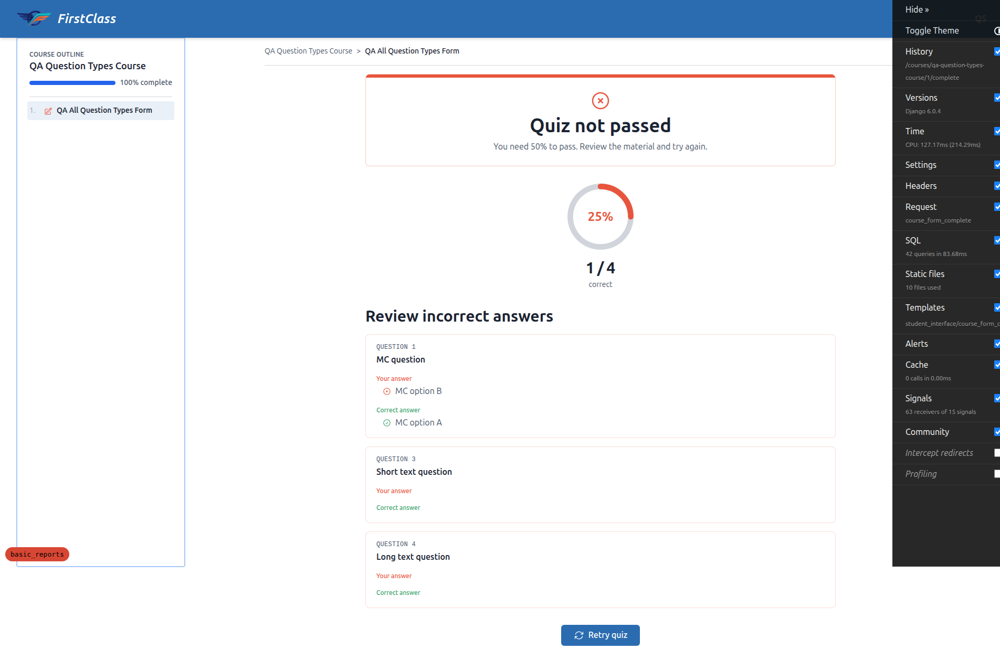

### Cause

`FormProgress.get_incorrect_quiz_answers()`
(`freedom_ls/student_progress/models.py:497–552`) iterates every `FormQuestion` and does not
filter by question type. A free-text question has no options, so `is_quiz_answer_correct()`
returns `False` (correctly — its docstring says a question with no correct option cannot be
answered correctly), and the question is appended to the incorrect list. The template
(`student_interface/templates/student_interface/course_form_complete.html:56`) does not filter by
type either, so it renders empty option loops.

This is **pre-existing** — the previous `any(option.correct for option in selected_options)`
predicate also returned `False` for free-text — so the multi-select fix did not cause it. But the
fix's own docstring calls out free-text scoring zero as intended behaviour, and QA 12.4 tests the
list membership specifically, so it belongs in this pass.

### Suggested fix

Skip questions with no options (or restrict to `multiple_choice`/`checkboxes`) in
`get_incorrect_quiz_answers()`.

---

## Passing sections, in detail

### QA 10.5 / 10.6 — system checks — PASS

Both checks behave exactly as specified.

`uv run manage.py check` with the Tailwind bundle present emits exactly one warning:

```
(freedom_ls_reports.W001) REPORTS_STORAGE_ALIAS='reports' is not a key in settings.STORAGES.
Reports will fall back to the default storage, which may be a publicly served MEDIA_ROOT.
        HINT: Declare a private storage alias in settings.STORAGES.
```

With `static/vendor/tailwind.output.css` moved aside, a second warning appears naming the build
command, as required:

```
(freedom_ls_reports.W002) Compiled Tailwind bundle 'vendor/tailwind.output.css' could not be
resolved through the staticfiles finders. Reports will fail to render.
        HINT: Run `npm run tailwind_build`.
```

The file was restored and W002 confirmed gone.

### QA 11 — checkbox scoring — PASS (all five rows)

Fixture: form `qa-all-question-types-form` (`strategy=QUIZ`, `quiz_show_incorrect=True`,
`quiz_pass_percentage=50`). Checkbox question has options A (correct), B (correct), C (incorrect).
The form has 4 questions; only 2 are option-backed, so the maximum achievable score is 2/4 = 50%.
(That mix is unrealistic — a scored quiz would not contain free-text — but it does not affect the
checkbox verdicts below, which are what QA 11 tests. A future run should use an option-only quiz
so the percentages read naturally.)

| What was ticked | Expected | Score seen | In incorrect list? | Result |
|---|---|---|---|---|
| All three (A+B+C) | 0 | 25% (1/4) — checkbox scored 0 | Yes | **PASS** |
| Both correct only (A+B) | 1 | 50% (2/4) — "Quiz passed!" | No | **PASS** |
| One correct only (A) | 0 | 25% (1/4) | Yes | **PASS** |
| Both correct + incorrect | 0 | Same as row 1 (identical selection on a 3-option question) | Yes | **PASS** |
| Nothing | 0 | 25% (1/4) | Yes | **PASS** |

**The headline regression is closed:** ticking everything scores 0, not full marks.

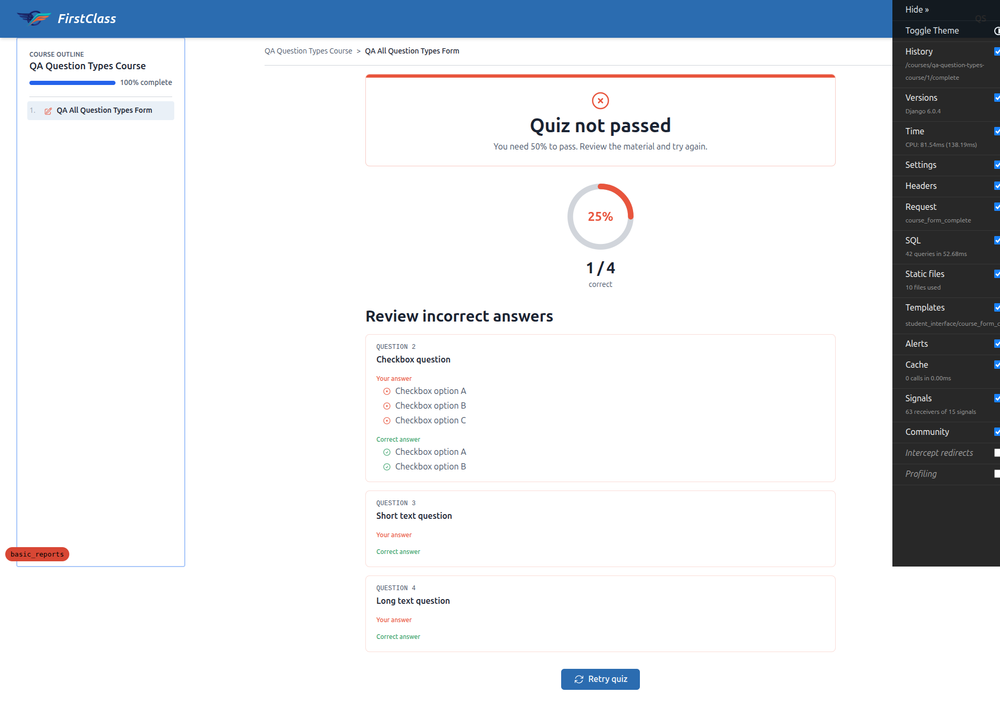

Both correct options only — the one passing case:

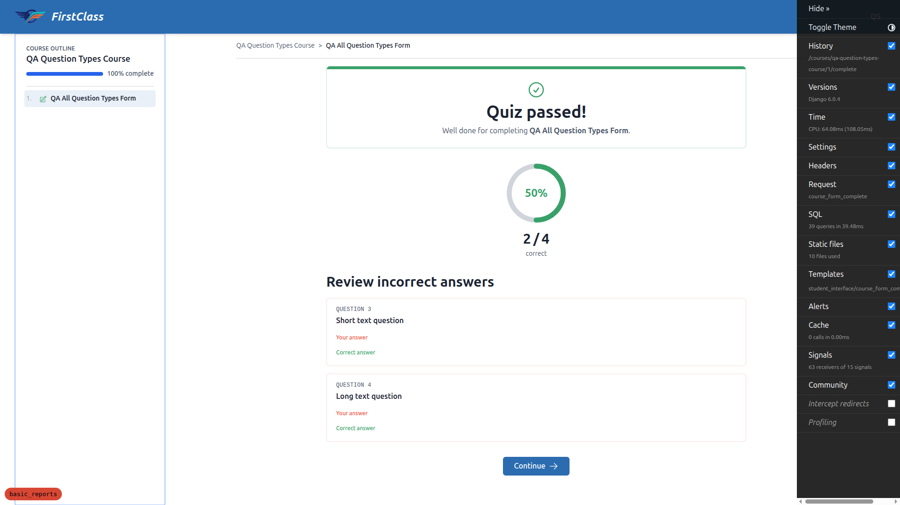

One correct option only:

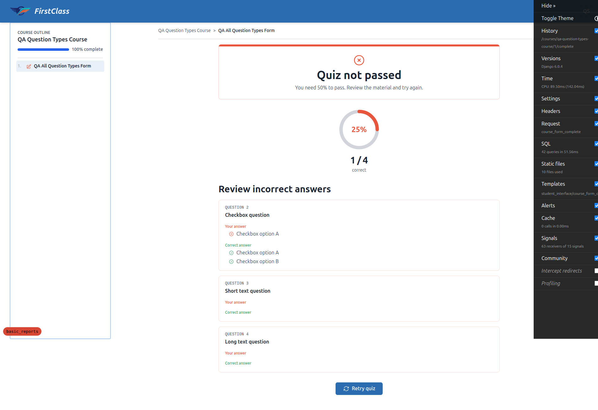

Nothing ticked:


In every row the score and the incorrect-answer list agreed for the checkbox question — the exact
disagreement this fix exists to close did not occur. This is structurally guaranteed by the fix:
both `score_quiz()` and `get_incorrect_quiz_answers()` now call the same
`is_quiz_answer_correct()` predicate.

The automated suite for this area also passes: `freedom_ls/student_progress/tests/
test_form_progress_score_quiz.py` → **16 passed**. (The coverage gate fails only because a single
file was run in isolation.)

### QA 12.3 — single-select multiple choice unchanged — PASS

Answering the `multiple_choice` question incorrectly (option B when A is correct) listed it under
incorrect answers with "Your answer: MC option B / Correct answer: MC option A", while the
correctly-answered checkbox question was absent from the list. Answering it correctly scored 1 in
every other attempt. Behaviour matches pre-change expectations — for a single-select question with
exactly one correct option, exact-match scoring is equivalent to the old "any correct" rule.

### QA 12.5 — educator live panel — PASS

Cohort "QA Multi-Select Quiz Scoring Cohort" at
`/educator/cohorts/3e13dbe3-96ca-4368-9c25-0b1d749ad825/__tabs/course_progress`, viewed as
`demodev_quizqa_educator@email.com`.

Quiz percentages render, the panel does not error, and — the specific risk — **the quiz with no
pass mark shows percentages with no verdict rather than crashing**:

| Course | Learner | Cell |
|---|---|---|
| QA Question Types Course (pass mark 50) | Priya Passer | `50% Pass` |
| | Fred Failer | `0% Fail` |
| | Quiz Scoring QA | `25% Fail` ×4 |
| QA Quiz Without Pass Percentage (no pass mark) | Priya Passer | `100%` — no verdict |
| | Fred Failer | `0%` — no verdict |
| | Quiz Scoring QA | `100%` — no verdict |

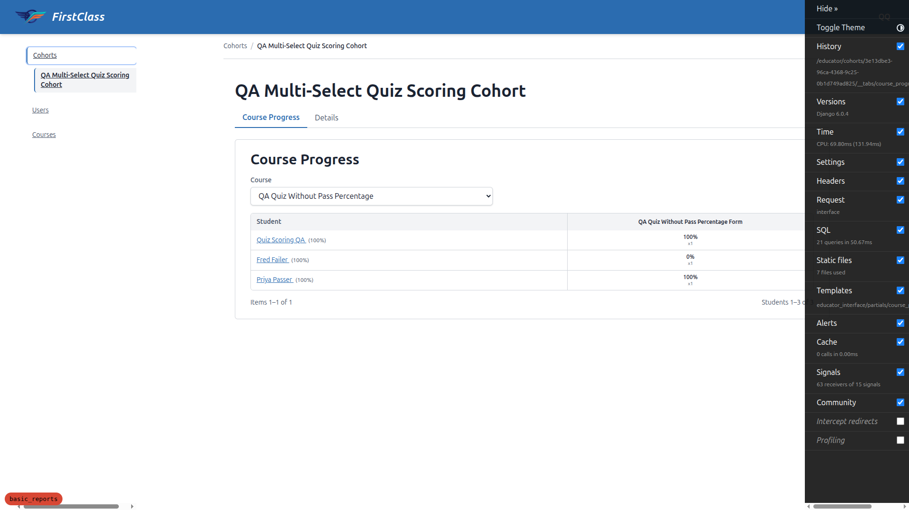

This is the direct contrast with BUG-1: the same underlying data renders safely for the educator
because `educator_interface/views.py:489` guards the `passed()` call, and crashes for the student
because `student_interface/utils.py:144` does not.

### Responsive checks — PASS

| Viewport | Page | Horizontal overflow | Touch targets |
|---|---|---|---|
| 375×812 | Quiz runner | None (375/375) | 328×46px — above 44px minimum |
| 375×812 | Quiz results | None (360/375) | n/a |
| 375×812 | Educator progress panel | None (375/375) | n/a |
| 768×1024 | Quiz runner | None (768/768) | 640×46px |
| 768×1024 | Educator progress panel | None (768/768) | Table scrolls inside its own container |

The educator progress table is correctly wrapped in an `overflow-x: auto` container, so it scrolls
within itself rather than pushing the page sideways.

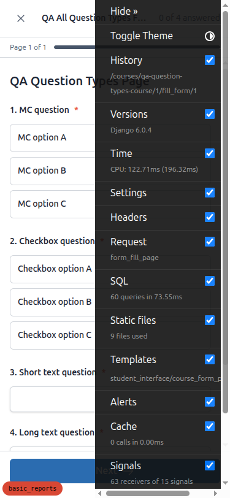
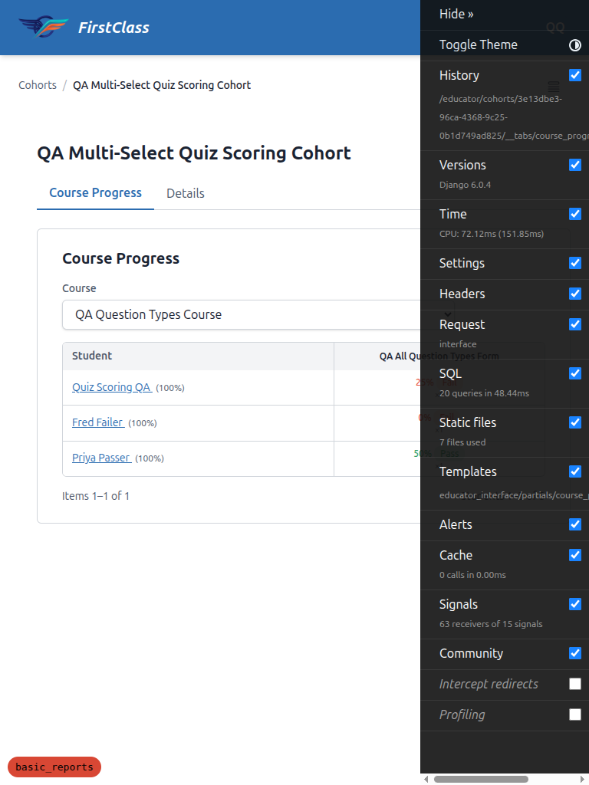

---

## Not executed, and why

### QA 12.1 — pass/fail and navigation — PARTIAL

The pass/fail half was verified: failing shows "Quiz not passed / You need 50% to pass" and marks
the item **"Needs retry"**; passing shows "Quiz passed!" and marks it **"Completed"**, with a
"Continue" button. The status logic that blocks progression is present in
`student_interface/utils.py:142–149` (`FAILED, BLOCKED` vs `COMPLETE, READY`).

What could **not** be demonstrated end-to-end is progression to *the next item* being blocked,
because both QA fixture courses contain exactly one item. Testing this properly needs a
multi-item course with a quiz that is not the last item.

### QA 12.6 — historical attempts are not rescored — NOT EXECUTED

Requires generating a report to compare a stored pre-fix score against the wrong-answer detail,
and to check the methodology block explains the discrepancy. Report generation does not exist
(see the blocking issue above). The `legacy-score-discrepancy.pdf` artifact cannot be produced.

### QA 13 — demo content sanity — NOT EXECUTED

**No demo content is loaded in this dev database.** The entire database contains only the two
courses created for this QA run (`qa-question-types-course`, `qa-quiz-no-pass-pct-course`) and two
forms. `functionality_demo_end_with_quiz` and `functionality_demo_course_parts` do not exist, on
any site.

For QA 13.3 specifically I ran a database scan for `multiple_choice` questions authored with more
than one correct option — the authored-content trap that exact-match scoring would make
unanswerable. **Zero offenders were found.** But this result covers only the six questions that
exist in this database, all of them QA fixtures, so it is **not** evidence about demo content.
QA 13 needs a re-run against a database with demo content loaded.

---

## Other observations (tangential to the feature under test)

1. **Checkbox questions marked "(required)" can be submitted blank.** The UI labels the checkbox
   question `* (required)`, but the rendered `<input type="checkbox">` elements all have
   `required=false`, so the form submits with nothing ticked. This is what let me test QA 11 row 5
   at all, so it was useful here — but the label and the enforcement disagree.

2. **A form containing free-text questions can never score 100%** — `score_quiz()` counts every
   `FormQuestion` toward `max_score`, including `short_text`/`long_text`, which are unscoreable by
   design, so the 4-question fixture has a ceiling of 2/4 = 50%. **This is a fixture artefact, not
   a defect:** free-text does not belong in a scored quiz, so no real authored quiz should hit
   this ceiling. It is noted only because it makes `qa_create_form_question_types` a poor basis for
   percentage-based expectations — the QA plan now says to build scored-quiz fixtures from
   option-backed questions only. Same root cause as BUG-2.

3. **The Django debug toolbar overlays page controls at mobile width**, intercepting clicks on
   buttons in the lower-right of the viewport. Dev-only, not a product defect, but it obstructs
   mobile QA.

4. **Test-run artifact, not a product bug:** two form submissions early in the run bounced to the
   login page and lost the in-progress attempt. This coincided with the `fls-dev:qa-data-helper`
   agent resetting user passwords in the background, which rotates Django's session auth hash and
   invalidates live sessions. It did not recur once data creation finished, and all QA 11 results
   above were gathered cleanly afterwards.

---

## Test data created for this run

Created by the `fls-dev:qa-data-helper` agent on Site 3 / DemoDev (`127.0.0.1:8000`), via a new
idempotent command `freedom_ls/qa_helpers/management/commands/qa_create_multiselect_quiz_scoring.py`:

| Purpose | Detail |
|---|---|
| Student | `demodev_quizqa@email.com` (password = email) |
| Educator | `demodev_quizqa_educator@email.com` (password = email), granted `view_cohort` |
| Learners with attempts | `demodev_quizqa_pass@email.com`, `demodev_quizqa_fail@email.com` |
| Pass-mark quiz | course `qa-question-types-course`, form `qa-all-question-types-form`, pass 50% |
| No-pass-mark quiz | course `qa-quiz-no-pass-pct-course`, form `qa-quiz-no-pass-pct-form`, pass `None` |
| Cohort | "QA Multi-Select Quiz Scoring Cohort", registered for both courses |

**Note on database state:** the student `demodev_quizqa@email.com` now has a completed attempt on
the no-pass-mark quiz, which means **their dashboard currently 500s** (BUG-1). Deleting that
`FormProgress` row restores them, or re-running the command above.

### A note on site selection

Site resolution is by host header (no `SITE_ID` is set), and `demodev@email.com` belongs to the
Site whose domain is `127.0.0.1:8000`. The QA command's instruction to pick an arbitrary free port
would have resolved to a different Site — or none — and made the admin credentials unusable. Port
8000 was free, so this run used it. Anyone re-running this QA should do the same, or add a Site row
matching their chosen port.
