# QA report — Cohort progress PDF report + multi-select quiz scoring

**Run date:** 2026-08-16
**Branch:** `basic_reports` (confirmed via `debug-branch-badge`)
**Server:** `uv run python manage.py runserver 8000`
**Driver:** Playwright MCP, desktop 1920×1080, mobile 375×812, tablet 768×1024

`npm run tailwind_build` was run before the pass, and `uv run manage.py migrate` reported no pending
migrations.

## Why port 8000 rather than a random port

`find_available_port.sh` returned 8656, but this project resolves the current `Site` from the request
host, and the admin user `demodev@email.com` belongs to `Site` id 3, domain `127.0.0.1:8000`. On any
other port Django falls back to `Site` id 2 (`127.0.0.1`, "Demo"), which is a different tenant and
would have made every fixture invisible. Port 8000 was free (nothing was listening on it), so the run
used it. The branch badge confirmed no collision with another worktree's server.

## Headline

The generate → task → download flow, the permission failure branches, the failure/retry branches, the
deletion cascade and **the multi-select scoring fix itself** all work. There were **zero HTTP 500s in
the entire run**, including the QA 12.2 "unset pass mark" walk that the plan flags as the critical
failure mode.

The problems are concentrated in **PDF layout and presentation**, plus one access-control gap and one
verdict bug on the student results page. Twenty findings are listed below, three of them high
severity.

---

# Failures

## F1 — Landscape summary table is clipped instead of splitting once quiz columns exceed the budget

**Severity: High.** Test: **QA 7** (requires sign-off), also QA 2.6, QA 3.

The plan estimated a 10–12 data-column cap and asked for that cap to be validated against a real
rendered A4 landscape page. It is not enforced at all: past the budget the table simply **runs off the
right edge and the overflowing columns are lost**. It never splits into a second table, and nothing in
the PDF tells the reader that data is missing.

**`xl-cohort-long-course.pdf` (12 quizzes)** — the `HQ1` column (Hydrology Quiz 12) is absent
entirely and `FQ1` is cut through the middle of its cells:

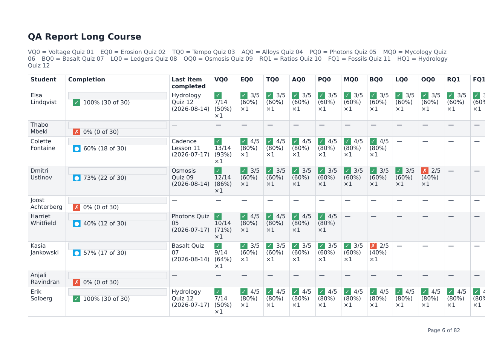

**16 quizzes** — three columns (`NQ1`, `DQ1`, `GQ1` = Nutrients Quiz 14, Dialects Quiz 15, Gearing
Quiz 16) never appear, and `CQ1` is sheared at the page edge:

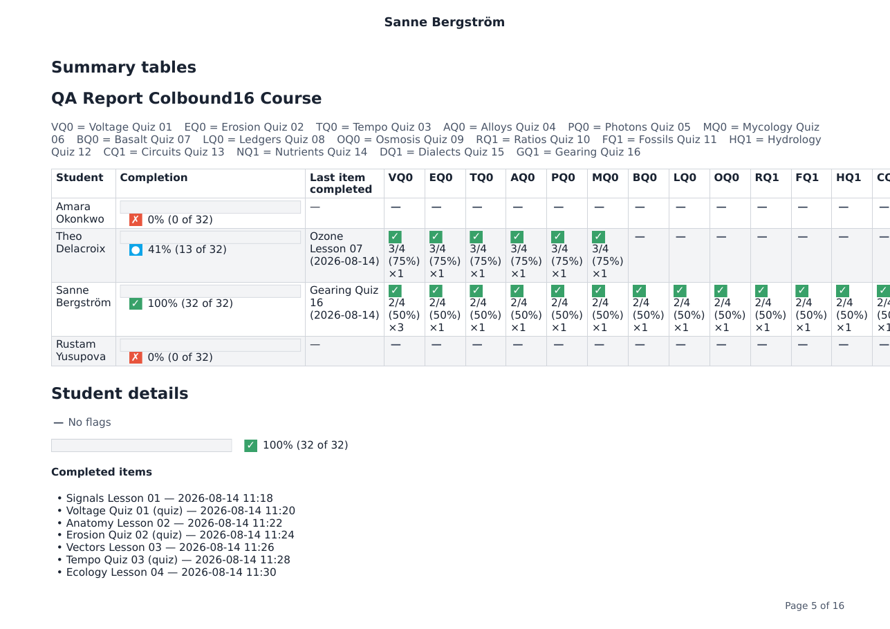

**Expected:** text legible at 100%, nothing clipped at the right margin, the table splits into a
second table rather than shrinking the type.
**Actual:** no split, no type reduction, columns silently truncated at the page edge.

### The boundary QA 7 asks for

I built dedicated fixtures at 6, 8, 10, 11 and 16 quizzes (`qa_create_report_course` +
`qa_create_report_cohort`) and rendered each summary page at actual size.

| Quiz columns | Total data columns | Result |
|---|---|---|
| 1 (short course) | 4 | clean |
| 4 (medium course) | 7 | clean |
| 6 | 9 | clean |
| 8 | 11 | clean |
| 10 | 13 | clean, tight — glyph wraps above the score |
| **11** | **14** | **clean — largest that still renders correctly** |
| **12** | **15** | **first failure — 1 column lost, 1 sheared** |
| 16 | 19 | 3 columns lost, 1 sheared |

**Answer for the sign-off: the real usable budget is 11 quiz columns (14 total columns).** The
smallest count that fails is 12. Eleven at actual size:

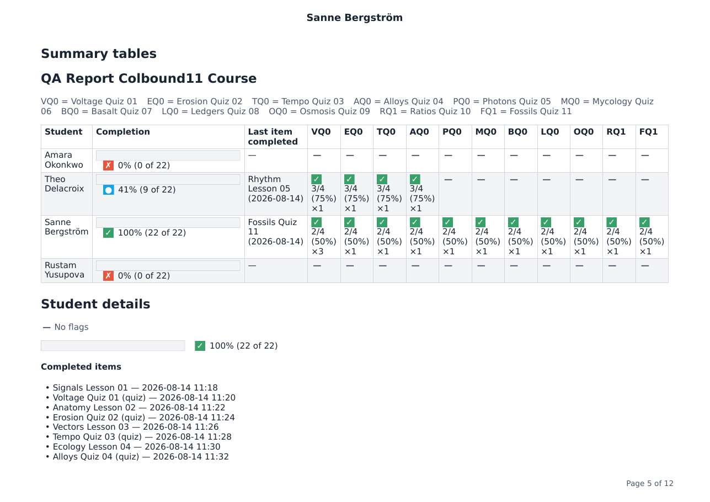

The overflow evidence is kept as `qa-artifacts/xl-cohort-long-course_column-overflow.pdf` and
`qa-artifacts/column-boundary-16-quizzes.pdf`.

A large part of the budget is spent on the **Completion column, which occupies roughly 21% of the
landscape page width** for a bar that never fills (F2) plus a short label. Reclaiming it would buy
several quiz columns before any splitting logic is needed.

## F2 — Completion bars never fill; 0% and 100% are visually identical

**Severity: High.** Tests: **QA 2**, **QA 6**.

Every completion bar in every report renders as an empty grey outline, whatever the percentage. On
page 5 of `standard-cohort-medium-course.pdf`, Amara Okonkwo (0%) and Chidi Abara (100%) have
identical bars:

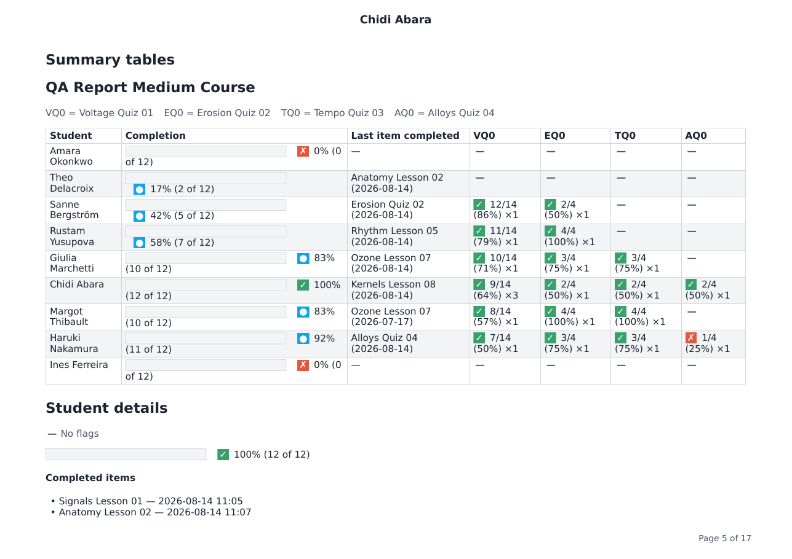

In greyscale — the QA 6 condition — the bar is pure decoration; the only way to read completion is the
number beside it:

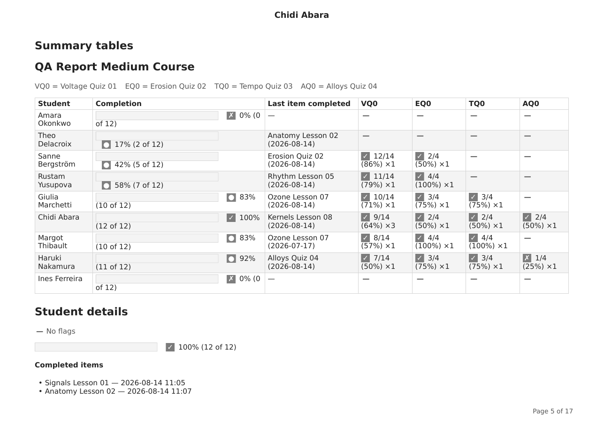

**Expected:** the bar communicates completion at a glance.
**Actual:** the bar communicates nothing at any completion level.

## F3 — A restricted staff user sees every cohort's reports in the changelist and can open their detail pages

**Severity: High.** Test: **QA 8** (spec §12.1).

`qa-report-restricted@email.com` holds `is_staff`, every `GeneratedReport` model permission, and
guardian `view_cohort` on **QA Report Standard Cohort only**. The download view and the generate
dropdown are both correctly scoped (QA 8.2 and 8.3 pass). The **changelist and the change view are
not.**

Logged in as that user, all 16 report rows are listed — cohort names, requester email, timestamps,
and a Download link on every row:

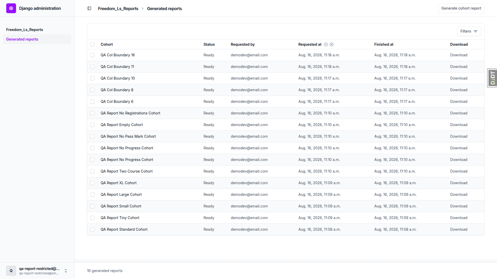

Opening the change view for a cohort-B report returns HTTP 200 with the full record:

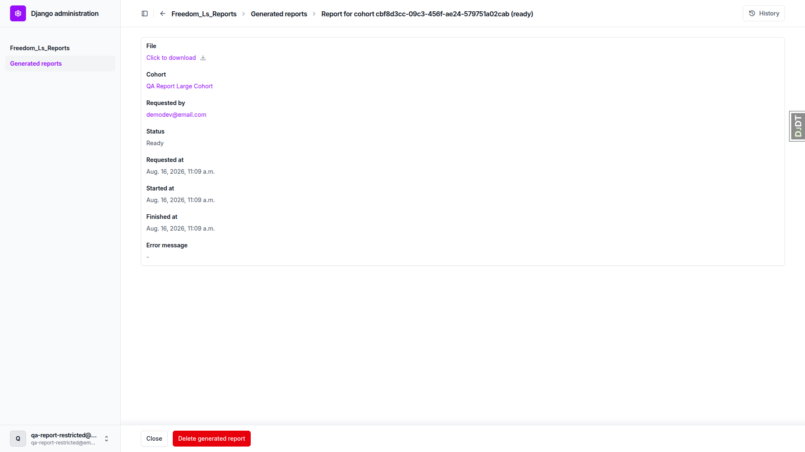

**Expected** (from spec §12.1's intent, that this user can only act on cohort A): the changelist is
filtered to cohorts the user holds `view_cohort` on, and the detail view 403s for the rest.
**Actual:** the listing and detail views are unscoped; only the byte-serving download 403s. A staff
user learns the full cohort inventory, who is running reports on which cohort, and when.

This one goes slightly beyond the literal QA 8 steps (which only exercise the download URL, the
dropdown and the forced POST) but is squarely within what §12.1 is trying to guarantee, so it is
recorded as a failure rather than an observation.

## F4 — Student detail sections do not start on a fresh page, and portrait content bleeds onto the landscape summary page

**Severity: Medium-High.** Tests: **QA 2.6**, **QA 3.3**.

In **every one of the 17 reports generated this run**, the first student's detail section begins part
way down the last landscape summary page, directly under the summary table. See the "Student details"
heading and Chidi Abara's completion bar and "Completed items" list at the bottom of the landscape
page in the F2 screenshot above.

Programmatic check across the whole artifact set — every report has at least one landscape page
carrying `Student details` / `Completed items` / `Quiz results` content:

| Report | Landscape pages | Landscape pages carrying student-detail content |
|---|---|---|
| `standard-cohort-medium-course.pdf` | 5 | 5 |
| `large-cohort-medium-course.pdf` | 5, 6, 7 | 7 |
| `two-course-cohort.pdf` | 5, 6 | 6 |
| `xl-cohort-long-course.pdf` | 5–10 | 10 |
| …and all 13 others | — | yes |

**Expected:** "the summary tables are landscape and everything else is portrait" (QA 2.6); "each
student starts on a fresh page" (QA 3.3).
**Actual:** the first student of every report starts mid-page, on a landscape page.

Students *after* the first do get a fresh page, and multi-page student sections behave correctly — so
this is specifically a missing page break between the summary section and the first student.

## F5 — The running page header shows a student's name on pages that are not theirs

**Severity: Medium-High.** Test: **QA 3.3** — this is the exact failure mode the plan says to watch
for.

Two distinct leaks:

1. **Onto the summary table.** Page 5 of `standard-cohort-medium-course.pdf` is the summary table, but
   its running header reads **"Chidi Abara"** (the next student). Same on page 7 of
   `large-cohort-medium-course.pdf`, page 6 of `two-course-cohort.pdf`, page 5 of every boundary
   fixture, and page 5 of `no-registrations.pdf` (header "Sanne Bergström" over a "Summary tables"
   heading).
2. **Onto the cohort-wide confusions section.** Pages 16 and 17 of
   `standard-cohort-medium-course.pdf` are "Question-level confusions" — a cohort-wide section — and
   both carry the header **"Rustam Yusupova"**, the last student. Page 32 of the large-cohort report
   does the same.

Within a single student's own multi-page section the header is **correct** — pages 23, 24 and 25 of
`xl-cohort-long-course.pdf` all read "Ngozi Ekwueme" and page 26 correctly switches to "Mateo
Espinoza". The bug is that the header persists across a section boundary rather than clearing.

## F6 — The PDF bookmarks/outline does not mirror the contents

**Severity: Medium-High.** Test: **QA 2.3** ("Open the viewer's bookmarks/outline panel: it should
mirror the contents").

The printed Contents page is correct — 14 entries, correct page numbers, all clickable, all resolving
to the right page. The **outline panel** is not:

- **Theo Delacroix is missing entirely** — he is on the Contents page at p. 8 but has no bookmark.
- **Chidi Abara appears twice** (p. 5 and p. 6), **Haruki Nakamura twice** (p. 11 and p. 12),
  **Rustam Yusupova three times** (p. 15, 16 and 17).
- Two of the Rustam Yusupova entries sit over the cohort-wide "Question-level confusions" section.
- `Student details` and `Completed items` are nested under `Summary tables`, before any student.

This is a direct consequence of F5: the outline is evidently built from heading elements that include
the per-page running header, so a leaked header becomes a spurious bookmark and a real section heading
gets shadowed.

## F7 — The results page announces "Quiz passed!" for a quiz that has no pass mark

**Severity: Medium.** Test: **QA 12.2**.

Taking `qa-quiz-no-pass-pct-form` (`quiz_pass_percentage = None`) as `demodev_quizqa@email.com`, with
the checkbox question answered **wrongly** (all three options ticked), scoring 1/2 = 50%:

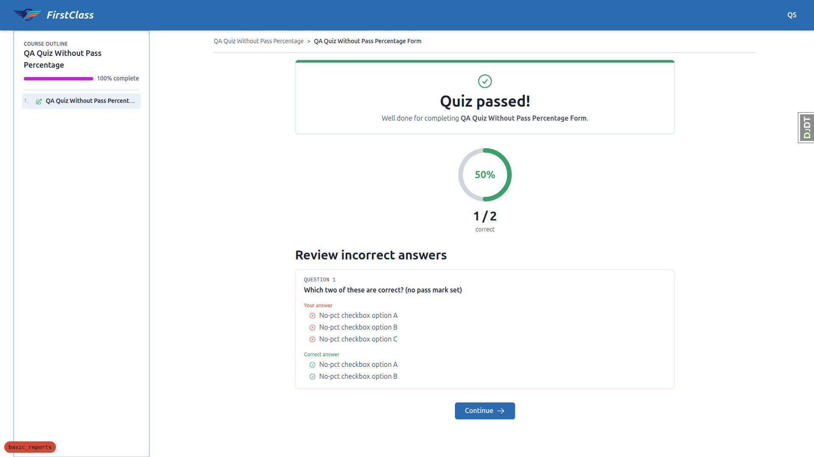

**Expected:** "the results page renders with a score and **no** pass/fail verdict".
**Actual:** a green "Quiz passed!" banner with "Well done for completing …", for a form that has no
pass mark to be measured against — and on an attempt where the student got the multi-select question
wrong.

Worth stressing that the **other two surfaces get this right**: the PDF report shows `○ 2/4 (50%)`
with no verdict (see F-free section "QA 2.8 passed" below), and the educator live panel shows a bare
percentage with no Pass/Fail chip. Only the student results page invents a verdict, so the three
surfaces disagree with each other.

No 500 was produced, and the full QA 12.2 walk (results page, course player, course home, course
detail, dashboard, logout/login, plus a second unrelated registered course) rendered cleanly
throughout — the critical failure mode the plan warns about is **not** present.

## F8 — The title page attributes every report to "the system"

**Severity: Medium.** Test: **QA 2.1** ("who generated it").

Every report's title page reads `Generated 2026-08-16 11:08 UTC by the system.`

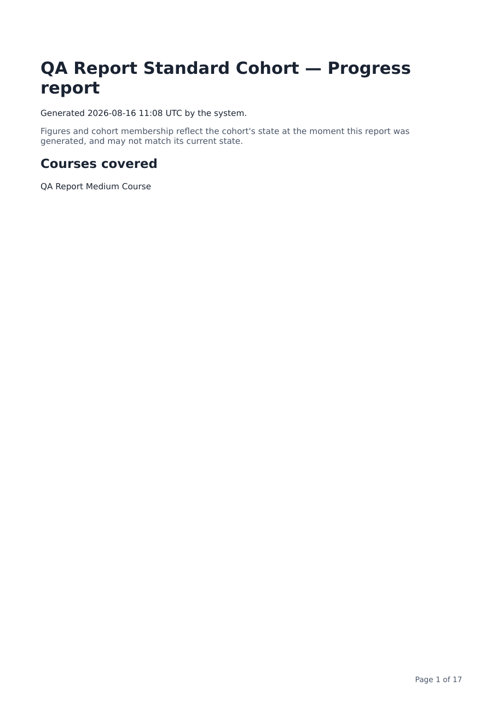

**Expected:** the requesting user.
**Actual:** the literal string "the system", even though `requested_by` is populated and the admin
changelist displays `demodev@email.com` for the same report. The data is available; the title page
just does not use it.

## F9 — Degenerate cohorts render bare headings instead of stating the situation

**Severity: Medium.** Tests: **QA 9.5**, **QA 9.6**.

Neither degenerate case crashes and both produce a valid PDF — the important half passes. But neither
"says so explicitly", which is what the plan requires.

**`empty-cohort.pdf` (0 students, 5 pages).** The at-a-glance page reports `Cohort size: 0` and
"No students currently flagged" (good), but page 5 is an **empty table with only its header row**,
followed by a bare `Student details` heading and a bare `Question-level confusions` heading, each with
nothing under it. The Contents page shows a `Students` heading with no entries.

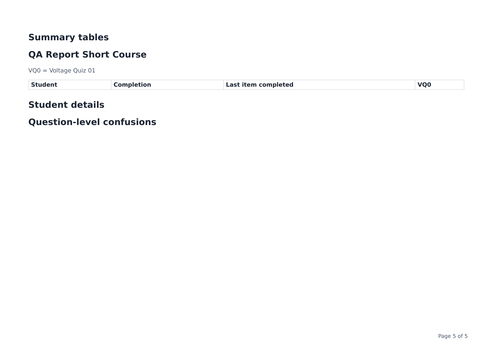

**`no-registrations.pdf` (5 students, no course registrations, 9 pages).** The title page prints
`Courses covered` followed by **nothing at all**:

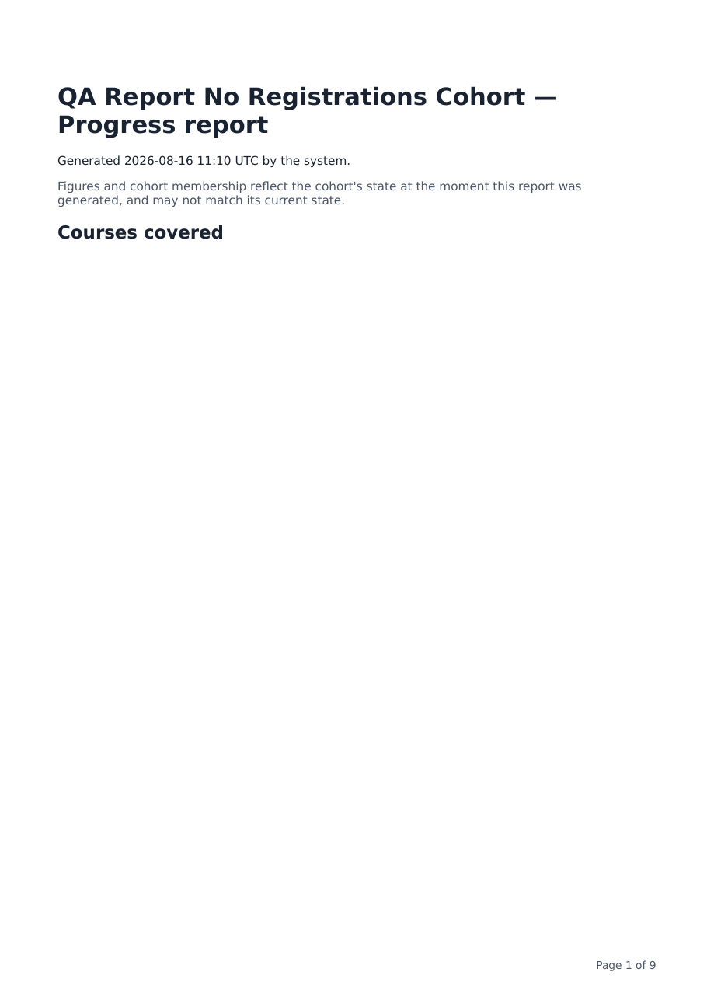

Page 5 prints a `Summary tables` heading with nothing under it, then jumps straight into student
details. Every student shows `✗ 0% (0 of 0)` — a meaningless denominator — and all five are flagged
"No recorded activity", which is true but misattributes the cause: there is nothing for them to do.

**Expected:** "a valid PDF that says so explicitly", "a report that states it".
**Actual:** empty scaffolding the reader has to interpret.

## F10 — Summary table rows are not ordered alphabetically by surname

**Severity: Medium.** Test: **QA 3.4**.

The Contents page and the per-student sections are correctly alphabetical by surname (Abara,
Bergström, Delacroix, Ferreira, Marchetti, Nakamura, Okonkwo, Thibault, Yusupova). The **summary
table** in the same report is in an unrelated order:

> Okonkwo, Delacroix, Bergström, Yusupova, Marchetti, Abara, Thibault, Nakamura, Ferreira

That is neither alphabetical nor sorted by completion (0%, 17%, 42%, 58%, 83%, 100%, 83%, 92%, 0%) —
it looks like fixture insertion order. Cross-referencing a student between the summary table and their
detail section means scanning the whole table.

## F11 — Completion column content overflows its cell

**Severity: Medium.** Test: **QA 2**.

Where the completion label is long, the text wraps **out of the Completion cell**: `0% (0` sits beside
the bar and `of 12)` drops below and outside the cell borders; `(10 of 12)` and `(12 of 12)` render
below the bar and to the left, spilling into the Student column's visual space. Clearly visible in the
F2 screenshots, in both colour and greyscale.

## F12 — Radio and checkbox options are visually indistinguishable in the quiz runner

**Severity: Medium.** Test: **QA 11** — knock-on of the scoring change.

In the quiz runner, a single-select `multiple_choice` question and a multi-select `checkboxes` question
render identically: plain bordered pills that tint blue when selected. There is no radio circle, no
checkbox square, and no "select all that apply" hint.

Desktop, with all three checkbox options selected — nothing distinguishes Q1 (single-select) from Q2
(multi-select):

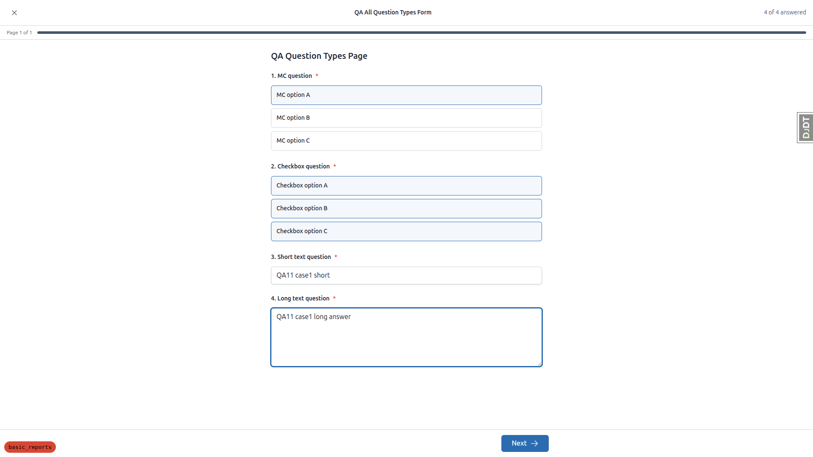

Same at mobile and tablet widths:

**Why this now matters more:** before the fix, a learner who misread a multi-select question and
ticked one correct option still scored the mark. Under exact-set matching they score zero. The
affordance gap has gone from cosmetic to costly. The only reason the QA fixtures read clearly is that
their question text says "(multi-select)" — real authored content will not.

## F13 — A student's section repeats "Wrong answers" with no indication of which quiz

**Severity: Low-Medium.** Test: **QA 2**.

Haruki Nakamura's section in `standard-cohort-medium-course.pdf` contains **four consecutive blocks
each headed simply "Wrong answers"**, one per quiz, with nothing naming the quiz. The reader has to
infer it from the question prefixes ("Voltage Q08…", "Erosion Q03…"). Same shape in every student's
section in every report.

Relatedly, the wrong-answer text annotates selected options with "(correct)" inside both lists, so a
line reads:

> Selected: Voltage Q08 option A (correct), Voltage Q08 option B (correct), Voltage Q08 option C.
> Correct: Voltage Q08 option A (correct), Voltage Q08 option B (correct).

The "(correct)" suffix is pure noise inside a list already labelled "Correct:", and inside "Selected:"
it makes a wrong answer look partly right without saying so.

## F14 — `GeneratedReport.__str__` prints the raw cohort UUID on destructive confirmation screens

**Severity: Low-Medium.** Test: **QA 10**.

The bulk-delete confirmation lists the objects about to be destroyed as:

> Generated report: Report for cohort 07b96f53-717f-4c09-9d04-b78aed379590 (ready)

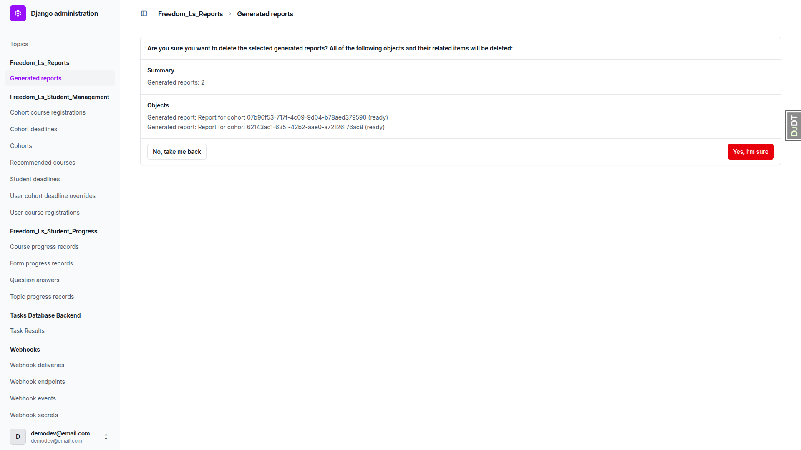

**Expected:** the cohort name, so an admin can confirm what they are deleting.
**Actual:** a UUID. The same string appears in the cohort-delete cascade summary and in the browser
tab title of the report change view (`Report for cohort 179330fc-… (failed)`) — though the change
view's body does show the cohort name correctly.

## F15 — Orphaned "Summary tables" heading on an otherwise blank page

**Severity: Low.** Test: **QA 3**.

Page 5 of `large-cohort-medium-course.pdf` contains the heading "Summary tables", the page number, and
roughly 90% white space; the table itself begins on page 6.

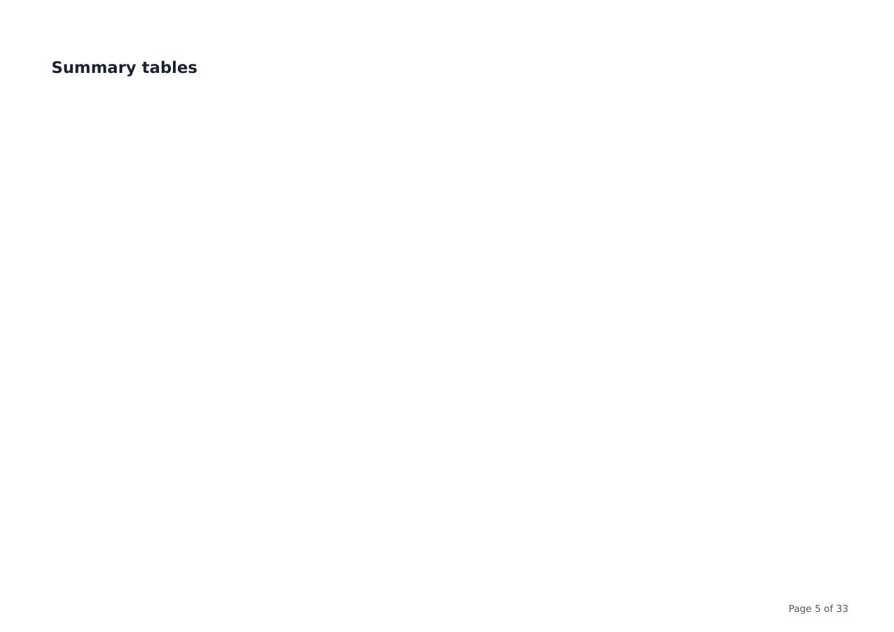

## F16 — Quiz column abbreviations truncate the quiz number

**Severity: Low.** Test: **QA 3.5**.

The abbreviation legend is present and correct in position (QA 3.5's main requirement passes), but the
abbreviations drop the last digit of the quiz number: `VQ0 = Voltage Quiz 01`, `EQ0 = Erosion Quiz 02`,
`RQ1 = Ratios Quiz 10`, `HQ1 = Hydrology Quiz 12`. The trailing character carries no information, and
two quizzes in the same course whose titles share a first letter and whose numbers share a leading
digit would collide (e.g. "Algebra Quiz 01" and "Anatomy Quiz 02" both → `AQ0`). No collision occurred
in the fixtures I built — all 16 abbreviations in the 16-quiz course were distinct — so the collision
is an inferred risk from the naming scheme, not something I reproduced.

## F17 — Large-n confusion percentages drop the denominator

**Severity: Low.** Test: **QA 5.5**.

The small-n / large-n rule itself **passes** (see below). But the two forms are not equally
informative: at ≤10 students the table reads `3 of 6 students`, while at 25 students it reads
`35% of students` with no denominator anywhere. The reader cannot tell how many students the
percentage is over (it is 6 of 17 — the students who made a first attempt, not the 25 in the cohort).

## F18 — Free-text questions in a scored quiz render empty incorrect-answer cards

**Severity: Low (robustness).** Test: **QA 12.4**, defensive branch.

The plan says this configuration should not exist in authored content and asks for it to be recorded
as a robustness finding rather than a user-facing bug. Confirmed, and slightly worse than described:
the `short_text` / `long_text` questions in `qa-all-question-types-form` appear under "Review incorrect
answers" with **both** "Your answer" and "Correct answer" blocks empty — the student's typed answer is
not echoed back even though it was saved.

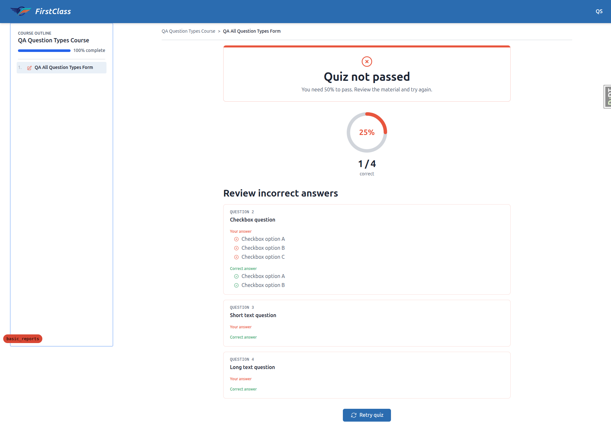

Confirmed unrealistic-fixture, not a content problem: I scanned all demo content and found **no**
free-text question inside any `strategy: QUIZ` form.

## F19 — Empty report directories are left behind after deletion

**Severity: Low.** Test: **QA 10.2**.

Single delete, bulk delete and cohort-cascade delete all correctly remove the PDF from disk. The
containing directory `media/reports/<report-uuid>/` is left behind empty. No data leaks; it is
housekeeping.

## F20 — Required-question validation is not enforced on submit

**Severity: Low.** Test: **QA 11**, row 5 ("tick nothing").

All four questions on `qa-all-question-types-form` are `required=True`. Leaving the checkbox question
blank, the confirmation dialog correctly reported **"3 Answered / 4 Total questions"** — and then
submitted successfully anyway. This is tangential to the scoring change (the scoring itself was
correct: 0 for the blank question, listed as incorrect) but it means "required" is advisory.

---

# What passed

## QA 1 — Generate a report end to end

All eight steps pass.

- `Generated reports` is present under `Freedom_Ls_Reports` in the admin index; the Cohorts changelist
  has **no** "Generate report" button (`hasGenerate: false`).

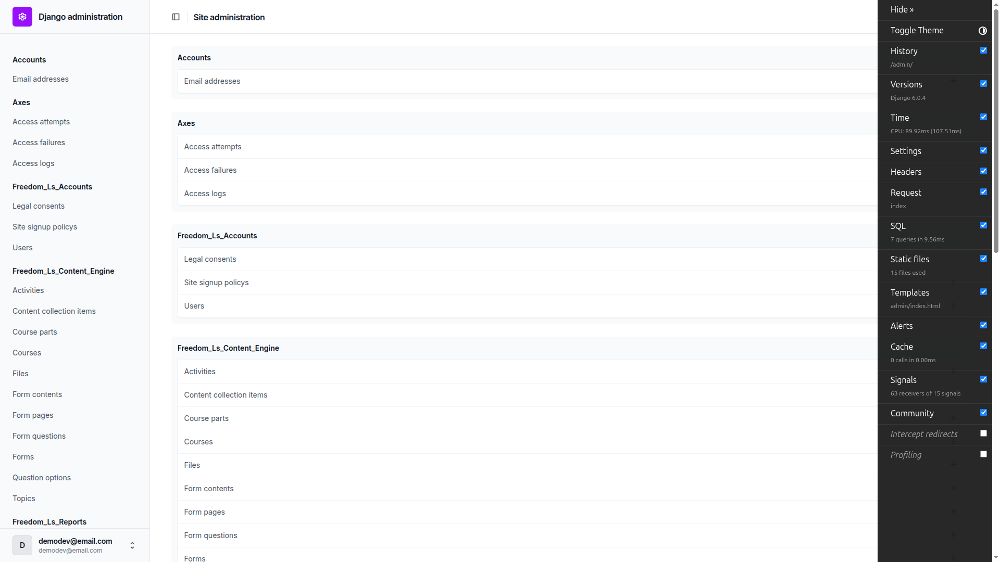

- The Generated reports changelist has **no "Add generated report"** button (`a.addlink` absent) and
  does carry a **Generate cohort report** button linking to `…/generatedreport/generate_report_action/`.

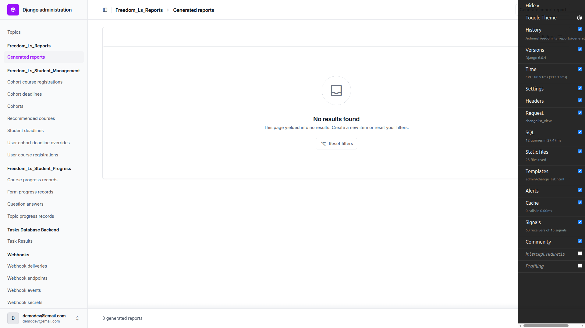

- The cohort dropdown lists 13 cohorts.

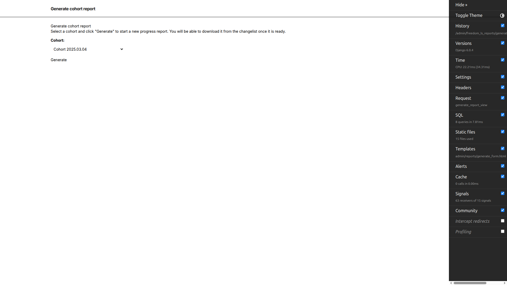
- Submitting for `standard-cohort-medium-course` redirected to the changelist with the message
  **"Generating a progress report for QA Report Standard Cohort."** and one new row, already `Ready`.
- The row shows cohort name, status, requested by (`demodev@email.com`), requested at, finished at and
  a Download link.

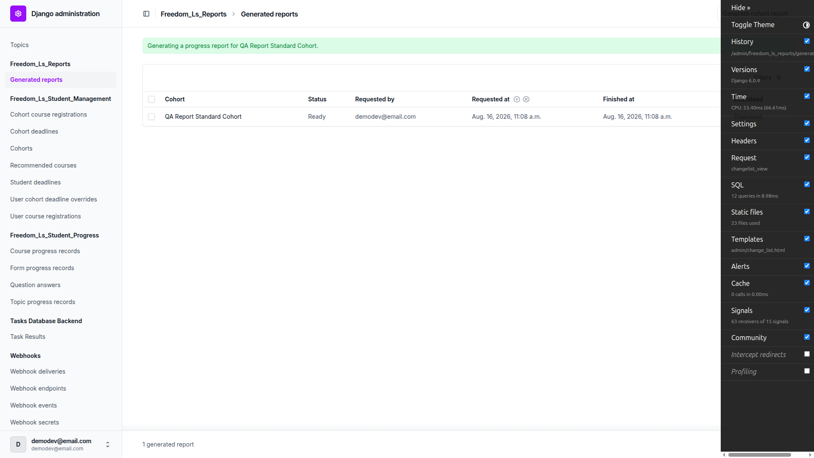

- Download produced a real PDF attachment named
  **`qa-report-standard-cohort-progress-report.pdf`** — slugified, no spaces, not a media URL, not an
  inline render.

## QA 2 — Reading the PDF

Passing points (failures are F1, F4, F5, F6, F8, F11, F13):

- **2.1** cohort name, courses covered, generated-at timestamp **with timezone** (`UTC`), and the
  as-of-generation-time caveat all present.
- **2.2** at-a-glance shows cohort size, median completion, not started, complete, and the flagged
  list with page references. The references are **real PDF link annotations** and resolve correctly —
  Ines Ferreira → p. 9, Margot Thibault → p. 14, Haruki Nakamura → p. 11, all matching the printed
  numbers.
- **2.3** Contents shows real page numbers (not 0/blank) and all 14 entries are clickable and resolve
  correctly. The methodology block covers **every** required point: what "complete" means and that it
  is recomputed not cached; latest-attempt scoring; completed attempts only; the first-attempt rule
  for cohort analysis and why; that multi-select scoring changed and old stored scores can disagree;
  that Activities and free-text are excluded and why; that individually-registered courses are not
  covered; and a RAG legend with glyphs.
- **2.4** `two-course-cohort.pdf` sections both courses, with the inactive one marked
  **"QA Report Second Course (inactive registration)"** on the title page and above its summary table.
  (Minor: the Contents page lists it without the inactive marker, and lists the confusion quizzes for
  both courses under identical names with no course qualifier.)
- **2.5** every student appears in both the summary table and the per-student sections. Students with
  no activity show an explicit **"No activity recorded."** — verified in `no-progress-cohort.pdf`,
  where all 9 take that branch.
- **2.7** page numbers on **every** page of every report (checked programmatically across 5 reports,
  146 pages — none missing).
- **2.8** **passes.** In `no-pass-mark-cohort.pdf` the no-pass-mark quiz column renders as
  `○ 2/4 (50%) ×1` — score present, no pass/fail verdict, no RAG pass/fail glyph, column not dropped,
  report not `failed`. The legend explains it: "○ Quiz attempted, but no pass mark is configured so no
  verdict can be given."

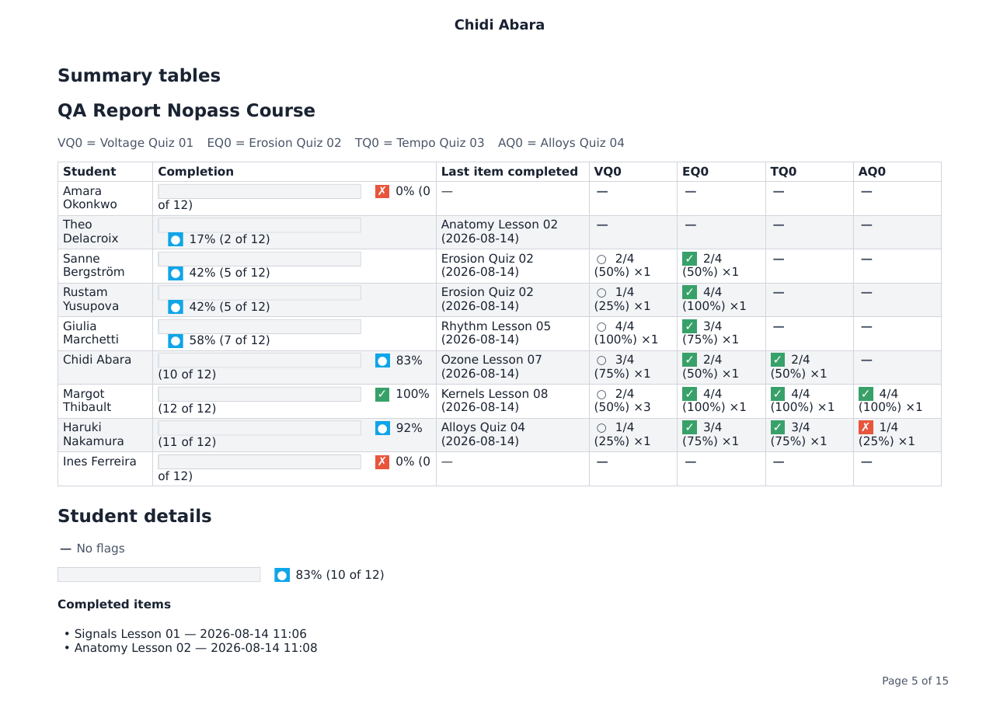

## QA 3 — Page breaks and running headers

- **3.1 passes.** The 25-student summary table spans pages 6–7 and the **header row is repeated** at
  the top of page 7.

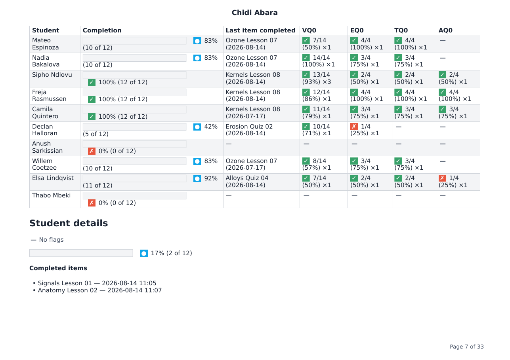

- **3.2 passes.** No table row is split across a page boundary in any report.
- **3.3 partially passes.** Multi-page student sections carry the correct name throughout (Ngozi
  Ekwueme across pages 23–25, switching correctly at 26). The failures are F4 and F5.
- **3.5 passes.** Quiz columns are ordered by course position (Voltage 01, Erosion 02, Tempo 03,
  Alloys 04 …), not alphabetically, and the abbreviation legend sits directly under the table title.
  Abbreviation quality is F16.
- `tiny-cohort-short-course.pdf` (3 students) has a single landscape page and does not split — correct
  for its size.

## QA 4 — At-risk flags are consistent

**All five steps pass.**

- Flag label and reason text are **byte-identical** between the at-a-glance list and the student's own
  section, in the same order — verified for all three flagged students in the standard cohort:
  "▲ No recorded activity — Has not started any course item.", "▲ No activity recently — No activity
  recorded in over 7 days.", "▲ Failed most recent quiz attempt — Failed their most recent quiz
  attempt."
- Unflagged students show an explicit **"— No flags"** line (21 students in the XL report).
- **4.5 passes.** `xl-cohort-long-course.pdf` caps the at-a-glance list at 12 with the disclosure
  **"Showing 12 of 18 students flagged."**, and a programmatic sweep of all 40 student sections found
  **exactly 18** carrying flags — including all six not listed on the front page (Elsa Lindqvist, Enzo
  Zampieri, Erik Solberg, Ines Duarte, Ngozi Ekwueme, Willem Coetzee).

## QA 5 — Cohort quiz confusions

**All six steps pass** (F17 is a readability note, not a failure).

- Each question lists the incorrect options chosen with counts, the correct option alongside, ranked
  worst-first.
- Cap disclosure present: **"Showing 10 of 14 questions with at least one incorrect answer."**
- Interpretive caution present: **"A high error rate can mean a hard-but-fair question, not a broken
  one."**
- **5.5 passes — the boundary flips correctly.** 3 students → `1 of 1 students`; 9 students →
  `3 of 6 students`; **25 students → `35% of students`**. No percentage appears in any small-n
  section.
- **5.6 passes.** Chidi Abara has three completed attempts at Voltage Quiz 01, all wrong on the same
  questions; their own section reads **"wrong 3 times"** while the cohort table counts that student
  once (`2 of 6 students` for Q2). The two disagree, which is correct, and the methodology block
  explains why.

## QA 6 — Greyscale legibility

**Passes, with the caveat that this was done by greyscale rendering, not on a physical printer** — see
"Not tested" below.

Converting the summary pages to greyscale, every status stays unambiguous because each carries a
distinct glyph as well as its number: `✓` complete, `✗` failing/not started, `●` in progress, `○`
attempted-no-verdict, `—` not applicable. Two statuses are never distinguishable by shade alone.

- **No `.notdef` boxes or missing-character rectangles.** Embedded fonts are `DejaVu-Sans`,
  `DejaVu-Sans-Bold` and `DejaVu-Sans-Oblique`, all embedded and subsetted.
- **No colour emoji.** Zoomed to 400 dpi, the glyphs are real DejaVu text characters rendered white on
  a coloured chip — not emoji-font substitutions. No emoji font is embedded at all.

The one greyscale failure is F2, the completion bars.

## QA 8 — Permissions and access control

Five of seven pass outright; F3 is the failure; 8.7 behaves as the plan predicts for dev.

- **8.1 passes.** Anonymous GET of a download URL → `302` to
  `/admin/login/?next=…`, never the PDF.
- **8.2 passes.** Restricted staff user → **403** on a cohort-B download. Not the PDF, not a 500.

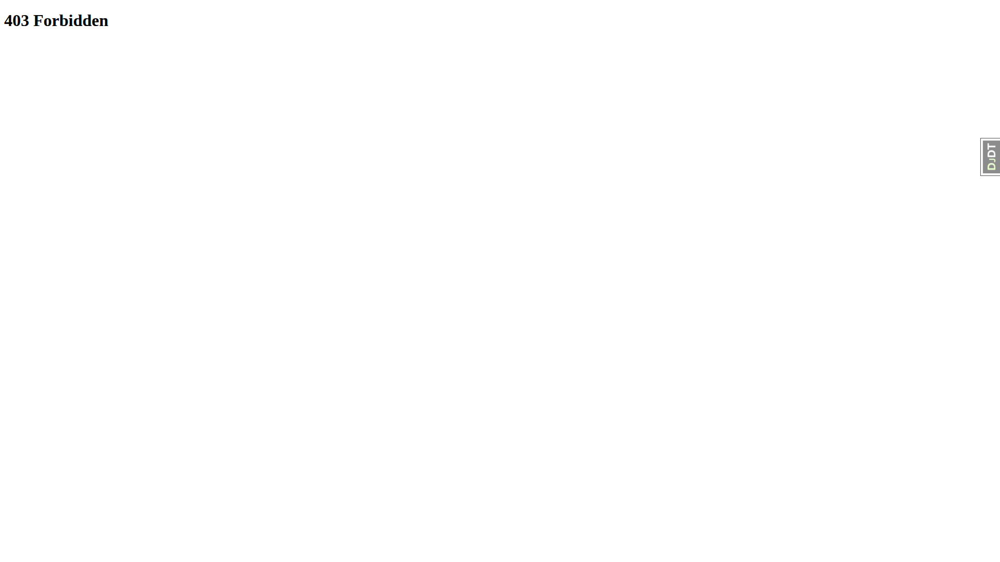

- **8.3 passes.** The generate dropdown for that user contains **exactly one** option, QA Report
  Standard Cohort.

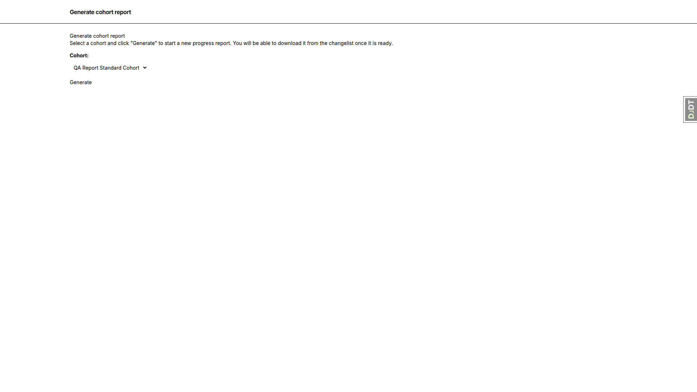

- **8.4 passes.** Rewriting the option value to cohort B's UUID in devtools and submitting → **404**,
  and **no** report row was created (confirmed: QA Report Large Cohort still has exactly one report,
  the one the admin made at 11:09).

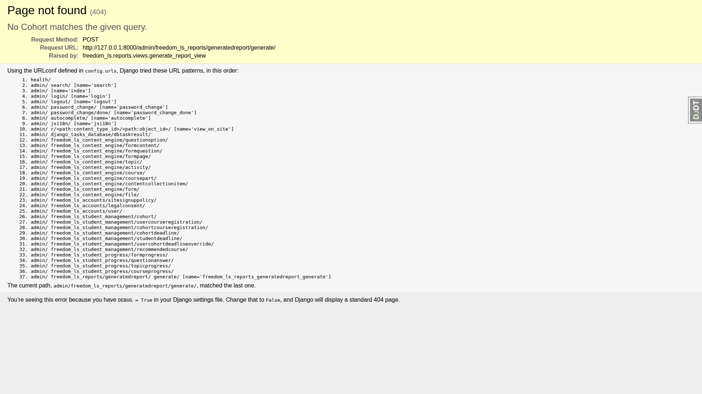

- **8.5 passes.** The changelist HTML contains **zero** occurrences of `/media/`; all 16 download
  links route through the admin view.
- **8.6 passes.** Download response headers:
  `cache-control: private, no-store, must-revalidate, max-age=0, no-cache` and
  `content-disposition: attachment; filename="qa-report-standard-cohort-progress-report.pdf"`.
- **8.7 — behaves as the plan predicts.** `GET /media/reports/<uuid>/cohort-report.pdf` with no session
  returns **200, `application/pdf`, 766 KB**. This is the documented dev behaviour with local file
  storage, and the `manage.py check` W001 warning (QA 10.5, passing) is the control. Not counted as a
  failure, but it is exactly why the storage alias must be configured before deployment.

## QA 9 — Failure branches

**All six pass** (9.5 and 9.6 pass on "does not crash"; their presentation gap is F9).

- **9.1 passes.** With a report forced back to `pending`, submitting generate for that cohort produced
  the message **"A report for this cohort is already being generated."**, exactly one row for that
  cohort, still pending — no 500, no second row.

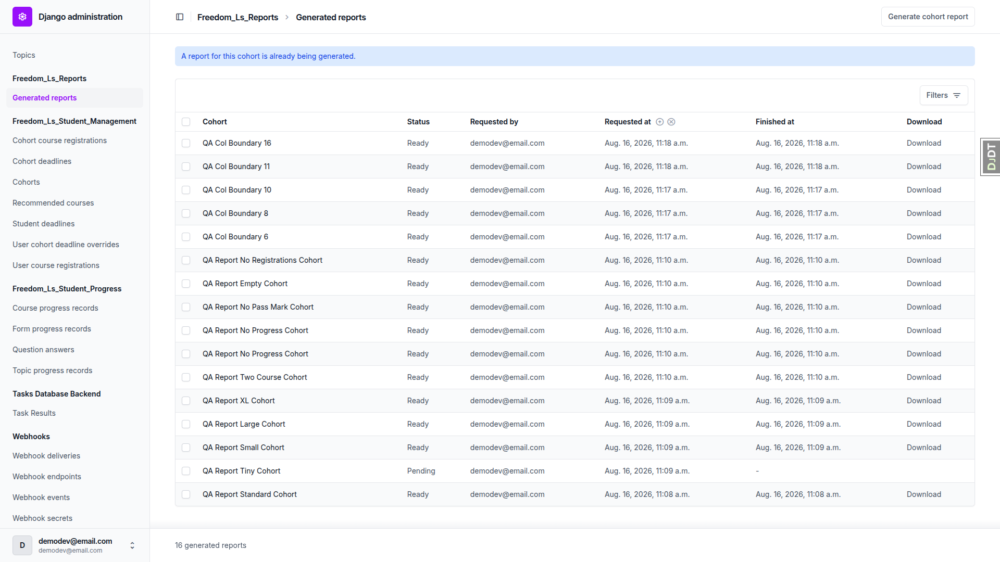

  Separately, an accidental Playwright double-click sent two POSTs one second apart for the No Progress
  cohort and produced **two ready rows**. That is the documented `ImmediateBackend` behaviour the plan
  calls out (the first request completes synchronously before the second arrives), not a defect — the
  guard is proven by the forced-pending test above.
- **9.2 passes.** Moving `static/vendor/tailwind.output.css` aside and generating produced status
  **Failed**, `finished_at` set, no Download link, no stuck `running` row, and a genuinely readable
  error message:

  > Static asset 'vendor/tailwind.output.css' could not be resolved through the staticfiles finders.
  > Run `npm run tailwind_build` if this is the compiled Tailwind bundle.

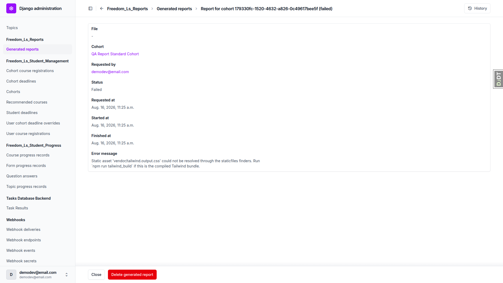

- **9.3 passes.** Restoring the file and generating for the **same cohort** succeeded immediately — a
  failed report does not block the cohort. Saved as
  `qa-artifacts/standard-cohort-medium-course_retry.pdf`; it is complete (17 pages, identical to the
  original), not a truncated re-render.

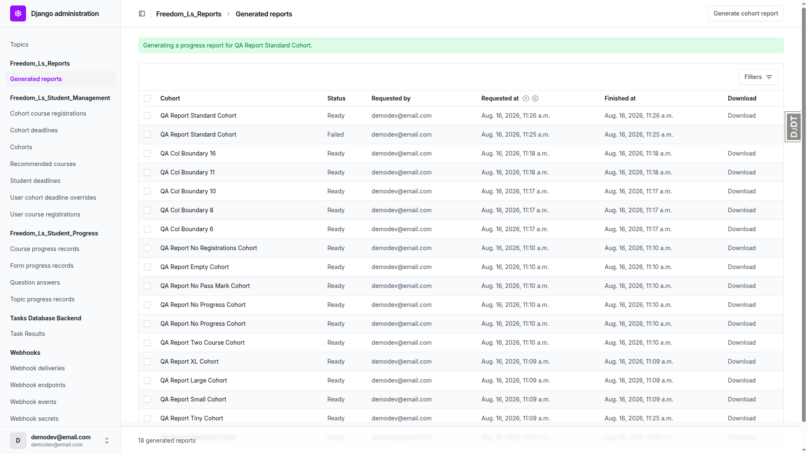

- **9.4 passes.** `pending` and `failed` rows have an empty Download column, and hitting their download
  URLs while authenticated as admin returns **404**. (A `running` row could not be produced with
  `ImmediateBackend` — see "Not tested".)
- **9.5 / 9.6 pass on the crash criterion.** Both degenerate cohorts produce valid, complete PDFs
  (5 and 9 pages). Kept as `qa-artifacts/empty-cohort.pdf` and `qa-artifacts/no-registrations.pdf`.

## QA 10 — Deletion and system checks

**All six pass.**

- **10.1/10.2** Single delete from the admin removed the row **and** the PDF from disk.
- **10.3** Bulk delete of two reports removed **both** PDFs from disk.
- **10.4** Deleting a **Cohort** cascaded correctly: the confirmation listed
  "Generated reports: 1", and after deleting, the cohort, the report row and the PDF were all gone. No
  orphaned PDF with student names in it.
- **10.5** `manage.py check` emits
  `(freedom_ls_reports.W001) REPORTS_STORAGE_ALIAS='reports' is not a key in settings.STORAGES…`
- **10.6** With the Tailwind bundle moved aside, `manage.py check` additionally emits
  `(freedom_ls_reports.W002) Compiled Tailwind bundle 'vendor/tailwind.output.css' could not be
  resolved… HINT: Run \`npm run tailwind_build\`.` — and the warning disappears once the file is
  restored.

## QA 11 — Checkbox scoring, student view

**All five rows pass. The headline regression is fixed.**

Fixture note the plan asks for: `qa-all-question-types-form` is `strategy: QUIZ`, pass mark 50%,
`quiz_show_incorrect: true`, and contains **4 questions — 1 `multiple_choice`, 1 `checkboxes`, 1
`short_text`, 1 `long_text`**. Because free-text can never be scored correct, **`max_score` is 4 but
the reachable ceiling is 2/4 = 50%.** All percentages below are computed on that basis. This is the
"score ceiling below 100%" the plan warns about — an unrealistic fixture, not a scoring bug (F18).

| What was ticked | Checkbox question scored | Total | Listed as incorrect? | Result |
|---|---|---|---|---|
| All three options | **0 — wrong** | 1/4 = 25% | **yes** | pass |
| The two correct options only | **1 — right** | 2/4 = 50% | **no** | pass |
| One of the two correct options | **0 — wrong** | 1/4 = 25% | **yes** | pass |
| Both correct plus the incorrect one (= row 1) | **0 — wrong** | 1/4 = 25% | **yes** | pass |
| Nothing | **0 — wrong** | 1/4 = 25% | **yes** | pass |

**Row 1 is the regression the fix exists to close, and it is closed:** ticking everything scores zero
and the question is listed under incorrect answers.

Ticking exactly the two correct options passes the quiz and the question is absent from the incorrect
list:

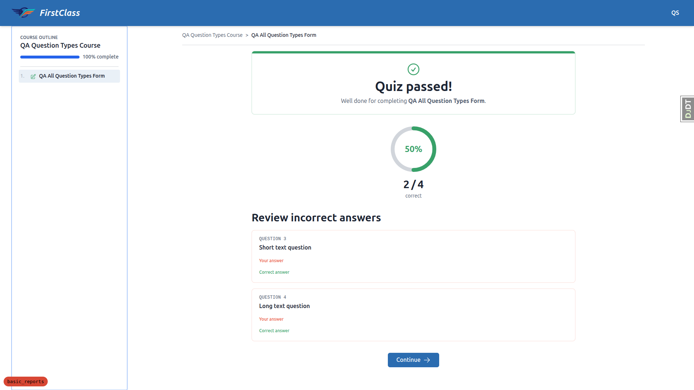

**In every one of the five cases the score and the incorrect-answer list agreed** — a question counted
wrong appeared in the list and vice versa. That is the exact disagreement the fix was written to
eliminate, and it did not occur once.

## QA 12 — Knock-on effects

- **12.1 passes, twice over.**

  Using the purpose-built `qa-progression-block-course` (4 questions, pass mark 80, the `checkboxes`
  question being the pass/fail difference): answering all three multiple-choice correctly but the
  checkbox wrongly scored **3/4 = 75% → "Quiz not passed"**, the quiz item showed **"Needs retry"**
  (FAILED, not COMPLETE), and the next item stayed **Locked**:

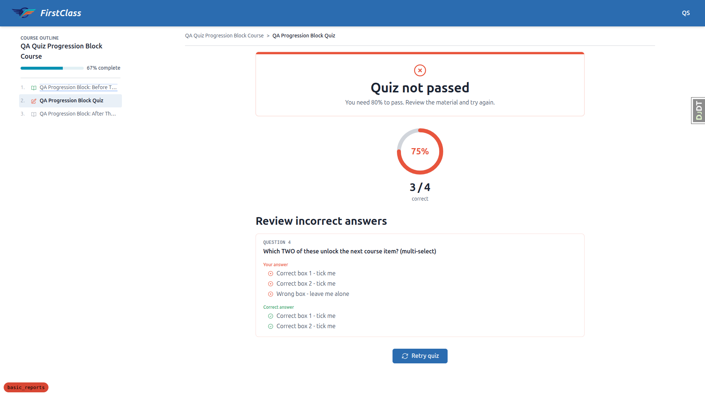

  Retaking with the checkbox correct scored **4/4 = 100% → "Quiz passed!"**, the quiz item became
  **Completed** and the next item unlocked to **"Not started"**.

  Independently confirmed on demo content: failing `mid-course-quiz` (33% vs an 80% pass mark) left
  item 3 Locked; passing it at 100% unlocked item 3.

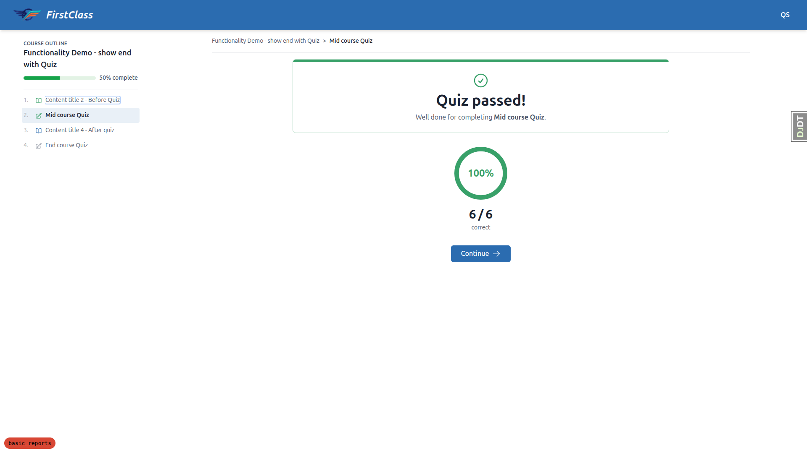

- **12.2 — no 500s anywhere; the critical failure mode is absent.** After completing the no-pass-mark
  quiz as `demodev_quizqa@email.com`, every page the plan lists rendered: the results page, the course
  player for that item, the course detail page, the course home, **the student dashboard (`/`)**, and a
  logout/login round trip (which redirects to the dashboard). The student's **second registered
  course** also still opened, so nothing was scoped-broken either. **The server log records zero 5xx
  responses for the entire QA run.** The verdict wording is F7.
- **12.3 passes.** Single-select `multiple_choice` is unchanged: answering correctly scored the mark
  and the question was absent from the incorrect list; answering incorrectly scored zero and produced
  a correct card ("Your answer: MC option B / Correct answer: MC option A").
- **12.4 passes.** Answering a `short_text` and a `long_text` question in a **non-scored** form
  (`qa-free-text-survey-form`, strategy `CATEGORY_VALUE_SUM`, four free-text questions across two
  pages): the answers were saved, and navigating back to page 1 re-rendered both stored values
  verbatim. The completion page shows a plain **"Form complete!"** banner with **no** pass/fail
  verdict, **no** score ring and **no** "Review incorrect answers" section — verified
  programmatically, the page text contains none of "Quiz passed", "Quiz not passed" or "incorrect".

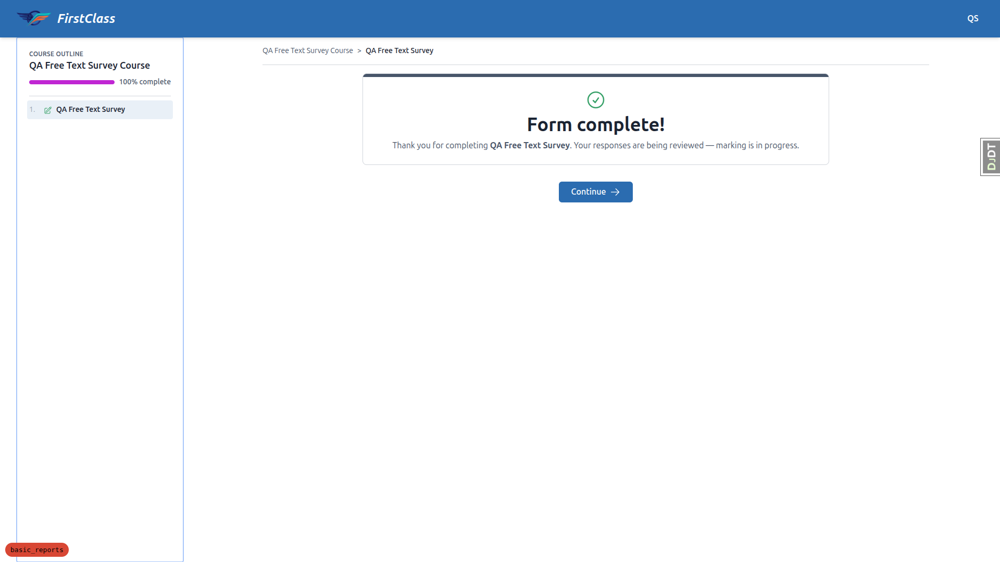

  The defensive branch (free-text inside a `strategy: QUIZ` form) is F18, recorded as a robustness
  finding as the plan directs.
- **12.5 passes.** The educator cohort course-progress panel renders quiz percentages, does not error,
  and — importantly — **shows no verdict for the no-pass-mark course**, in contrast to the student
  results page (F7).

  With a pass mark: `25% Fail ×10`, `0% Fail ×1`, `50% Pass ×1`.

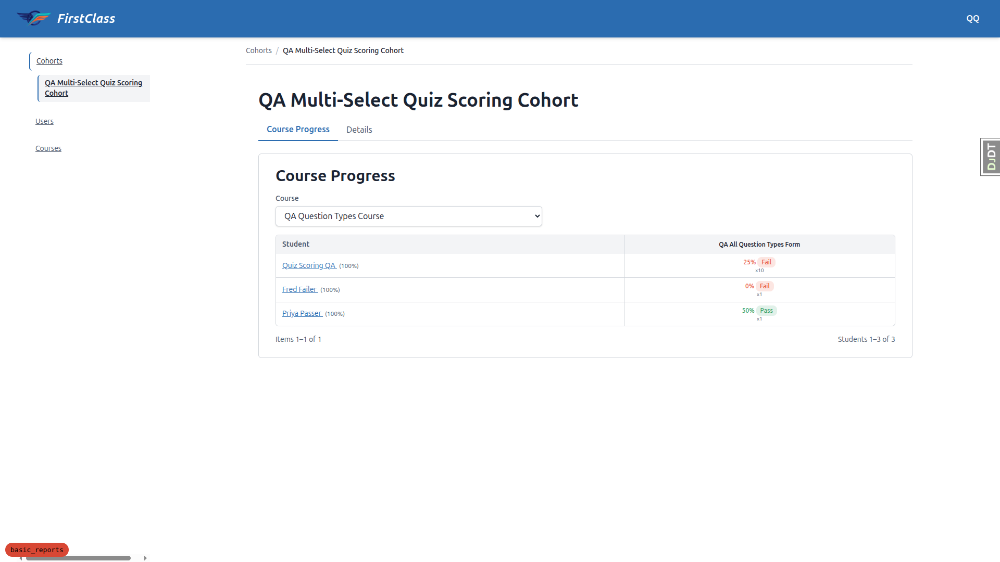

  Without a pass mark: `50%`, `0%`, `100%` — bare percentages, no Pass/Fail chip, no crash.

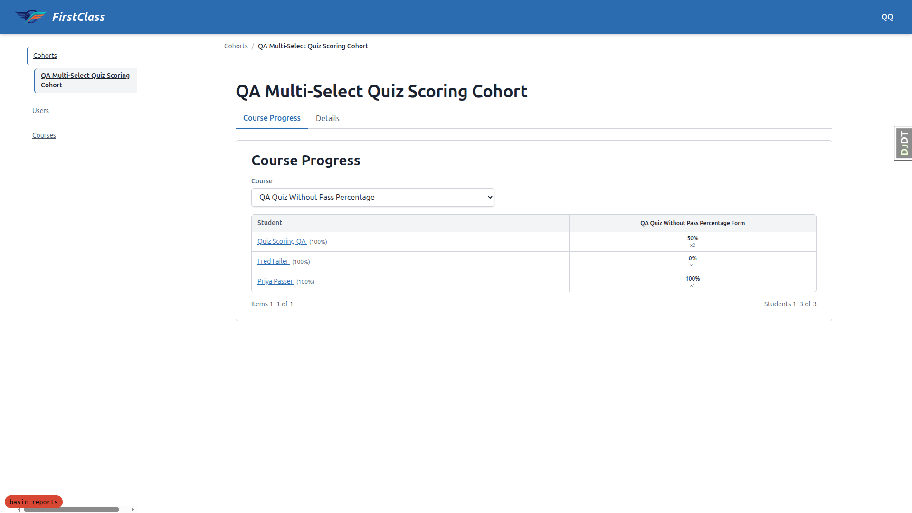

- **12.6 passes.** No legacy attempt existed in the dev database — I recomputed exact-set-match scoring
  for every completed `FormProgress` and found **zero** rows where the stored score disagreed with
  today's rule — so one was crafted (see "Test data added" below).

  `demodev_legacyscore@email.com` has a completed attempt at `qa-legacy-score-quiz-form` (pass mark
  80%) where the checkbox question was answered by ticking **all three** options — the shape that used
  to earn full marks:

  | | |
  |---|---|
  | **Stored (pre-fix) score** | `{"score": 2, "max_score": 2}` = **100% → PASS** |
  | **Recomputed under today's exact-match rule** | `1 / 2` = **50% → would FAIL** |

  **The stored score is unchanged after the fix.** The results page still reads "Quiz passed! 100%
  2/2 correct" — *and on the same page* lists Q1 under "Review incorrect answers" with "Incorrect
  option C - selecting this is now wrong" among the selected options. Historical attempts are not
  rescored:

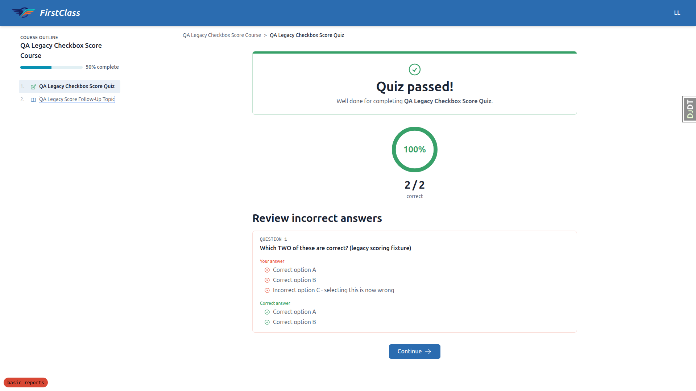

  Generating a report for **QA Legacy Score Discrepancy Cohort** reproduces the same disagreement in
  print: the summary table cell reads `✓ 2/2 (100%) ×1` for Lena Legacy, while her detail section
  carries "Quiz results: ✓ 2/2 (100%)" immediately above a "Wrong answers" entry for the same
  question. The methodology block's multi-select bullet explains why. Kept as
  `qa-artifacts/legacy-score-discrepancy.pdf`. The cohort also contains a contrast row — Cari Current,
  who answered honestly (A+B only) and whose stored 2/2 agrees with the detail.

## QA 13 — Demo content sanity

**All three steps pass.**

Demo content had to be loaded first — the dev database contained only QA fixture courses. Loaded with
`uv run manage.py content_save demo_content/<dir> DemoDev` for `functionality_demo_end_with_quiz`,
`functionality_demo_course_parts` and `functionality_demo_content_widgets`.

- **13.1/13.2** Walked `functionality_demo_end_with_quiz` (Mid course Quiz, End course Quiz) and
  `functionality_demo_course_parts/02. Core Concepts/03. knowledge-check` as a student. **All three
  demo quizzes are completable and passable at 100%** (6/6, 6/6, 3/3). No demo question has become
  unanswerable.
- **13.3 passes — nothing to call out in the upgrade notes.** A programmatic scan of every demo form
  found **no `multiple_choice` question with more than one correct option**, and in fact **no
  `checkboxes` question at all**, so demo content is untouched by the scoring change. The only
  questions with zero correct options are the two in `course-feedback`, which is a
  `CATEGORY_VALUE_SUM` survey — correct and expected.
- Bonus check against the plan's "free-text does not belong in a scored quiz" rule: **no free-text
  question appears in any `strategy: QUIZ` demo form.**

## Mobile (375×812) and tablet (768×1024)

Per the plan, the Django-admin surfaces (report trigger, changelist, generate page) were **not**
re-tested at these widths. The student- and educator-facing surfaces were.

Everything checked renders correctly. No horizontal page overflow at either width
(`document.scrollWidth === window.innerWidth`), touch targets on quiz options are ~54 px tall, and the
course outline collapses into a drawer on mobile.

- Quiz runner, mobile — clean, sticky Next button:
  
- Quiz results, mobile:
  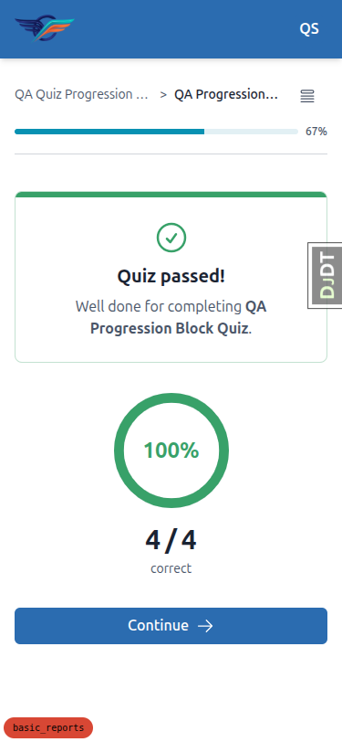
- Student dashboard, mobile:
  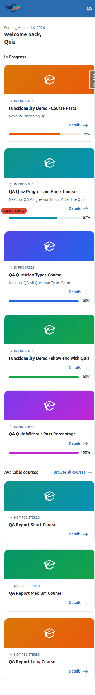
- Educator course-progress panel, mobile — the table sits in its own `overflow-x: auto` container
  (table 320 px inside a 299 px parent) so the page itself never scrolls sideways:
  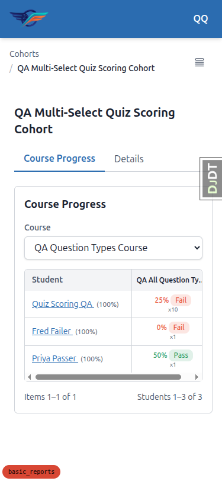
- Educator panel, tablet — table fits without horizontal scroll, tabs and selector usable:
  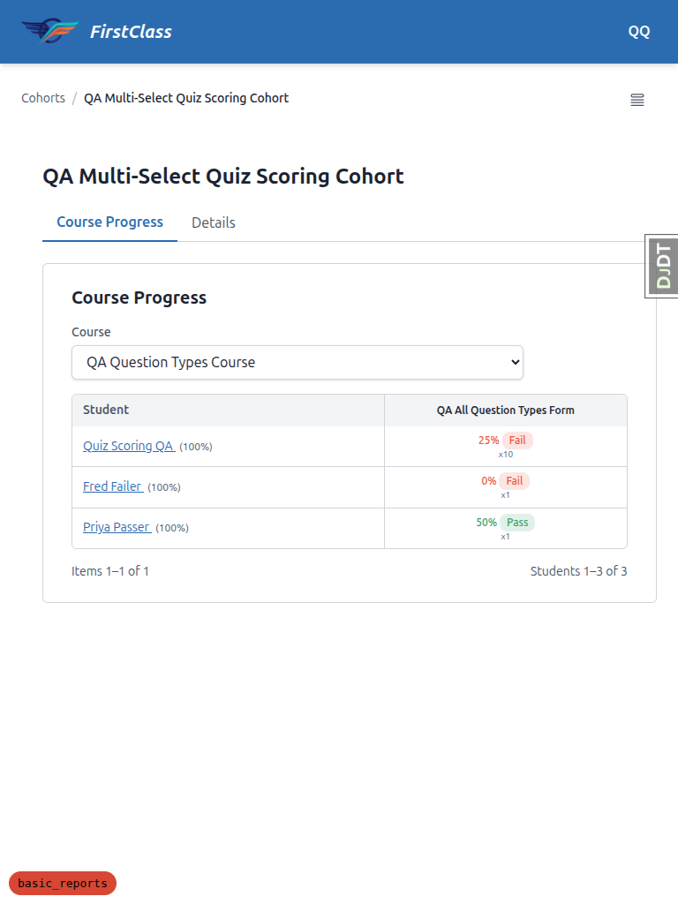
- Quiz results with incorrect-answer cards, tablet:
  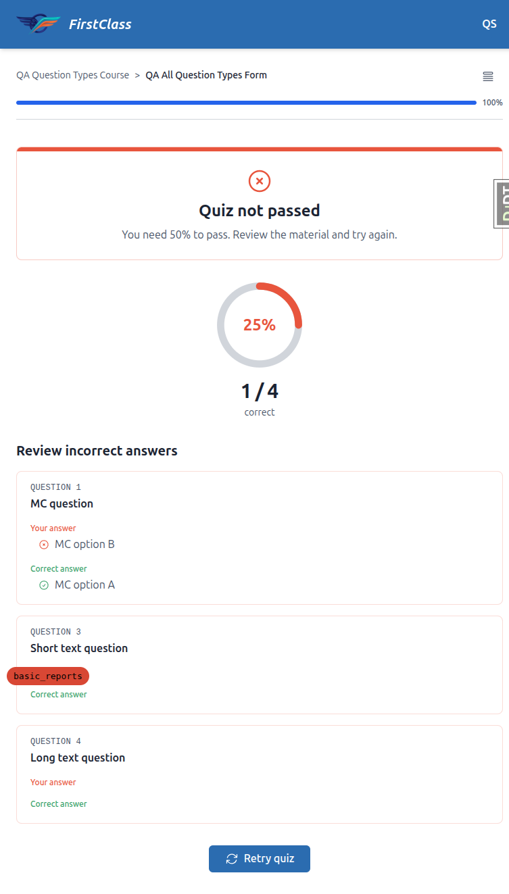
- Quiz runner, tablet:
  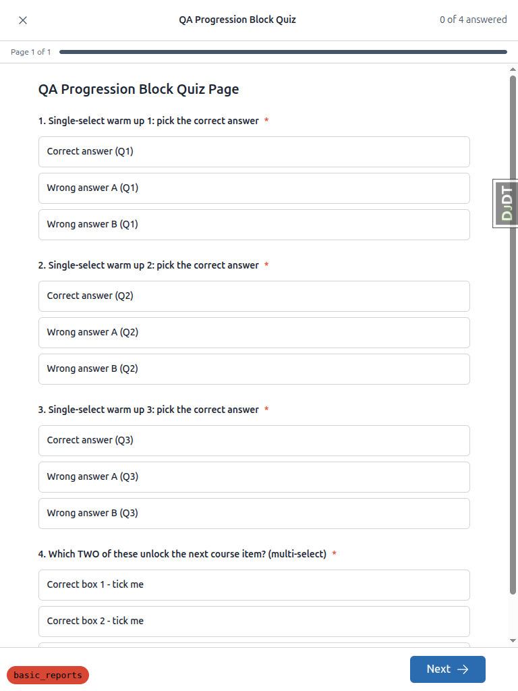

The only cross-width finding is F12, which is a design issue rather than a responsive one.

---

# Observations — unrelated or tangential to the feature under test

1. **Admin app label reads `Freedom_Ls_Reports`.** The plan says to look for a "Reports" section. The
   app renders with its raw label, as do all the other FLS apps (`Freedom_Ls_Content_Engine`,
   `Freedom_Ls_Student_Management`, …), so this is a project-wide `verbose_name` gap rather than
   anything this feature introduced.
2. **A failed quiz counts toward course completion percentage.** After failing the mid-course quiz,
   the outline read "50% complete" with item 1 Completed and item 2 "Needs retry" — i.e. the failed
   quiz counted as 1 of 2 completed items. The single-item QA courses show the sharper version: "100%
   complete" beside "Quiz not passed". The PDF report inherits this notion of "complete" (Haruki
   Nakamura shows `● 92% (11 of 12)` with a failed Alloys Quiz 04 counted in the 11). Arguably correct
   — "attempted the item" and "passed the quiz" are different things, and the report shows quiz
   verdicts separately — but worth a decision.
3. **The course player does not gate BLOCKED items at the URL level.** A direct GET of a locked item's
   URL returns 200 and creates that item's progress row; the blocking is enforced in the table of
   contents and the quiz start/results buttons only. Pre-existing `student_interface` behaviour,
   surfaced while building the QA 12.1 fixture.
4. **The dev `media/reports/` tree holds 64 orphaned 26-byte PDFs** from an automated test run earlier
   the same day (timestamps 09:18–09:23 UTC, before this session started). Not produced by the
   deletion path — every delete I performed removed its file correctly — but the test suite writing
   into the dev `MEDIA_ROOT` is worth a look.
5. **The quiz runner registers a `beforeunload` guard**, which is correct behaviour but blocked
   Playwright navigation mid-form once. Noted only so the next run expects it.

---

# Not tested, and why

1. **QA 6 on a physical printer.** The plan states this "cannot be done on screen", and I have no
   access to an office printer from this environment. I substituted a **true greyscale rasterisation**
   of the PDF (`pdftoppm -gray -r 150`), which reproduces what a black-and-white print driver does to
   the colour channels, and additionally verified font embedding (`pdffonts`) and inspected glyphs at
   400 dpi to rule out `.notdef` boxes and emoji substitution. That covers steps 3–5 of QA 6 with high
   confidence. **Step 1–2 on real paper still needs a human**, particularly to confirm the chip
   backgrounds do not muddy at the printer's dithering.
2. **A `running` report row (QA 9.4).** With the dev `ImmediateBackend` the task completes
   synchronously, so a row is never observably `running`. I verified the Download column is empty and
   the download URL 404s for both `pending` (forced via the shell, as the plan suggests for QA 9.1) and
   `failed`. The `running` case shares the same status guard, but it was not observed directly.
3. **QA 7 sign-off decision.** I measured the boundary (11 columns good, 12 bad) and kept the evidence
   PDFs, but changing the constant is an implementation decision, not a QA one.

**Nothing in the plan was skipped for want of test data.** Where the dev database could not support a
check, the `fls-dev:qa-data-helper` agent built the fixture and the check was then executed in full —
see below.

---

# Test data added this run

`qa_create_report_fixtures --reset` built the whole matrix as documented, and
`qa_create_multiselect_quiz_scoring` built the scoring fixtures. Three gaps could not be covered by
existing commands, so `fls-dev:qa-data-helper` added new ones (all idempotent, all in `qa_helpers`,
none committed):

| Command | Why it was needed |
|---|---|
| `qa_create_quiz_progression_block` | QA 12.1 needs a **next item to be blocked**. Both multi-select fixture courses are single-item, so there was nothing for a failed quiz to gate. Builds `qa-progression-block-course`: Topic → checkbox quiz (pass mark 80, the checkbox question being the pass/fail difference: 3/4 = 75% fail vs 4/4 = 100% pass) → Topic. |
| `qa_create_free_text_survey` | QA 12.4 needs free-text in a **non-scored** form. Demo `course-feedback` is non-scored but has only `multiple_choice`; the only free-text questions in the database were inside a `strategy: QUIZ` form. Builds `qa-free-text-survey-course` with a 4-question `CATEGORY_VALUE_SUM` form across two pages. |
| `qa_create_legacy_checkbox_score` | QA 12.6 needs a **pre-fix** checkbox attempt. `FormProgress.complete()` always scores with today's rule, so no such row could exist. Completes an attempt normally, then re-stamps the pre-fix score via `.update()` so nothing rescores. Builds `qa-legacy-score-course` and **QA Legacy Score Discrepancy Cohort** (`831ca50d-6e8a-4841-a87f-f43a5ae85c57`). |

I also ran `content_save` for three `demo_content/` directories, because the dev database contained no
demo courses at all — QA 13 could not otherwise have been executed.

The report-fixture matrix was additionally extended with five throwaway column-boundary courses
(`qa-report-colbound{6,8,10,11,16}-course` and matching cohorts) to answer QA 7's boundary question.

Two fixture cohorts were consumed by the QA 10 deletion tests and no longer exist: **QA Col Boundary
16** (deleted whole, to prove the cohort→report→file cascade) and the report rows for **QA Col Boundary
6** and **QA Col Boundary 8** (bulk delete). Re-run the commands above to restore them.

---

# Artifact manifest

All PDFs live in `spec_dd/2. in progress/basic_reports/qa-artifacts/`. Every one was downloaded through
the admin download view, not copied off disk.

| Fixture key / file | Cohort size | Course length | Pages | Landscape pages | Size | What it demonstrates |
|---|---|---|---|---|---|---|
| `empty-cohort.pdf` | 0 | short (4 items, 1 quiz) | 5 | 1 | 134 KB | Zero students: valid PDF, no crash — but bare headings and an empty table rather than an explicit statement (**F9**) |
| `no-registrations.pdf` | 5 | none | 9 | 1 | 256 KB | Students with no course registrations: "Courses covered" heading with nothing under it, every student `✗ 0% (0 of 0)` (**F9**) |
| `tiny-cohort-short-course.pdf` | 3 | short | 7 | 1 | 257 KB | Smallest real report; single landscape page, correctly does not split; confusions in plain counts (`1 of 1 students`) |
| `small-cohort-medium-course.pdf` | 9 | medium (12 items, 4 quizzes) | 17 | 1 | 541 KB | The small-n rule: plain counts, **no percentages** anywhere in the confusions section |
| `standard-cohort-medium-course.pdf` | 9 | medium | 17 | 1 | 541 KB | The baseline read-through for QA 2, QA 4 and QA 5; also the evidence for F2, F4, F5, F6, F8, F10, F11 |
| `standard-cohort-medium-course_retry.pdf` | 9 | medium | 17 | 1 | 541 KB | QA 9.3 — regenerated for the same cohort after a forced failure; complete, not truncated (identical page count to the original) |
| `large-cohort-medium-course.pdf` | 25 | medium | 33 | 3 | 1038 KB | Multi-page summary table with the **header row correctly repeated** on the continuation page; the large-n confusion rule (`35% of students`); also the orphaned heading of F15 |
| `xl-cohort-long-course.pdf` | 40 (18 flagged) | long (30 items, 12 quizzes) | 82 | 6 | 1825 KB | Both caps at once: attention list capped at 12 of 18, and the landscape table exceeding its column budget |
| `xl-cohort-long-course_column-overflow.pdf` | 40 | long | 82 | 6 | 1825 KB | **The QA 7 sign-off evidence** — byte-identical to the above, kept under the plan's required name. Page 6 shows `HQ1` lost and `FQ1` sheared |
| `two-course-cohort.pdf` | 9 | medium + one inactive | 19 | 2 | 635 KB | Both courses sectioned, the inactive one marked "(inactive registration)" on the title page and above its table |
| `no-progress-cohort.pdf` | 9 (zero progress) | medium | 13 | 1 | 408 KB | Every student takes the "No activity recorded." branch |
| `no-pass-mark-cohort.pdf` | 9 | medium, first quiz has no pass mark | 15 | 1 | 537 KB | **QA 2.8** — the no-pass-mark column renders `○ 2/4 (50%)`: score present, no verdict, column not dropped, report not failed |
| `legacy-score-discrepancy.pdf` | 3 | 2 items, 1 quiz | 7 | 1 | 256 KB | **QA 12.6** — Lena Legacy's stored pre-fix score `✓ 2/2 (100%)` in the summary table next to a "Wrong answers" entry for the same question; Cari Current is the agreeing contrast row |
| `column-boundary-6-quizzes.pdf` | 4 | 12 items, 6 quizzes | 10 | 1 | 441 KB | QA 7 sweep — 9 data columns, clean |
| `column-boundary-8-quizzes.pdf` | 4 | 16 items, 8 quizzes | 12 | 1 | 503 KB | QA 7 sweep — 11 data columns, clean |
| `column-boundary-10-quizzes.pdf` | 4 | 20 items, 10 quizzes | 12 | 1 | 564 KB | QA 7 sweep — 13 data columns, clean but tight |
| `column-boundary-11-quizzes.pdf` | 4 | 22 items, 11 quizzes | 12 | 1 | 594 KB | QA 7 sweep — **14 data columns: the largest that still renders correctly** |
| `column-boundary-16-quizzes.pdf` | 4 | 32 items, 16 quizzes | 16 | 1 | 748 KB | QA 7 sweep — 19 data columns; three columns lost entirely, one sheared |

## Deliberate absences

- **The QA 9.2 forced failure produces no PDF by design.** The report row for QA Report Standard Cohort
  at 11:25 has status `failed`, `finished_at` set and no file. Its stand-in evidence is
  `screenshots/desktop_9.2_failed_report_error_message.png` (the readable error message) and
  `screenshots/desktop_9.3_failed_row_and_successful_retry.png` (the failed row sitting beside the
  successful retry).
- **No fixture in the matrix is missing.** All ten matrix rows produced a PDF, plus the retry, the
  overflow copy, the legacy-discrepancy report and five boundary reports — 18 files in total.
- **The 12-quiz long course did force a split-worthy overflow but the report did not split.** The plan
  asked me to record "the number that finally forced a split": **no number does.** The table never
  splits at any column count; it clips. That is F1.
