# Frontend QA report — better form start page

## Summary

This report covers manual QA of the restyled learner-facing form start page: `course_form.html`,
deletion of the `exam_meta_grid.html` partial, and a restyle of the `exam_previous_attempts.html`
partial. 26 tests were executed against the test plan's nine sections (golden path, previous
attempts, every start-page state, real content, both themes, responsive, HTMX navigation,
failure/permission branches, accessibility). Every executed test recorded status **pass**: the
restyle itself holds up across both themes, all three viewports and all five CTA states, and the
`bg-white` row problem it set out to fix is genuinely fixed.

One bug is open, and it is not a regression in the new markup. Bug **B1** records that the fact-pill
icon contrast under the `first_class` theme still measures 1.75:1, the same figure a previous QA run
filed as bug B3, even though the `todo.md` item covering it is ticked as decided and applied. No
commit on this branch changed that colour. It needs a human decision, so it was not auto-fixed.

A separate set of observations (pre-existing issues, a test-data gap, a by-design navigation
behaviour, and a tooling deviation) is recorded in General notes below; none of those are regressions
caused by this change.

## Methodology

Testing was done manually through Playwright MCP against a dev server running on port 8066.
Screenshots were collected into `screenshots/` beside this report; every image referenced by this
report exists in that directory. Sections 1–4 and 6–9 ran under the `default` theme. For section 5,
the CSS was rebuilt and the server restarted under `FLS_THEME=first_class`, checked, then rebuilt
and restarted back under `default` to confirm the reverse.

## Diff scoping

Scoping class: **FULL**.

Changed files that triggered this class:

- `freedom_ls/learner_interface/templates/learner_interface/course_form.html`
- `freedom_ls/learner_interface/templates/learner_interface/partials/exam_meta_grid.html`
- `freedom_ls/learner_interface/templates/learner_interface/partials/exam_previous_attempts.html`
- `freedom_ls/learner_interface/tests/test_form_runner_views.py`
- `freedom_ls/qa_helpers/management/commands/qa_create_form_count_edge_cases.py`

Because the class is FULL, nothing was skipped: desktop, mobile and tablet passes all ran.

## Smoke gate

Status: **pass**. Pages checked before the full matrix:

- `http://127.0.0.1:8066/`
- `http://127.0.0.1:8066/courses/qa-progression-block-course/2/`

No failure was recorded.

## Results by test-plan section

### §1 Golden path

| Test | Viewport | Verdict |
| --- | --- | --- |
| 1.1 Golden path start page | desktop | pass |
| 1.2 No attempts, no subtitle, no intro | desktop | pass |
| 1.3 Singular pluralisation | desktop | pass |

**1.1** — Centred column measured at 576px (`mx-auto max-w-xl`), inside the 560–580px expectation.
Rounded-square badge with a solid slate secondary fill and a single white outline pencil icon: no
gradient, no coloured glow. Eyebrow "KNOWLEDGE CHECK" renders small, monospace, uppercase, widely
tracked, muted grey. Large bold display title, authored intro paragraph centred beneath it. Pills "4
questions" and "1 page" each carry a small muted icon; counts were verified against the fixture (3
single-select + 1 checkbox on 1 page). A single centred primary "Start Form" button. The old two-cell
bordered meta grid is gone; there is no left-aligned page title at top-left. The badge glyph (pencil)
differs from the questions pill glyph (document), so it is not the same icon appearing twice.

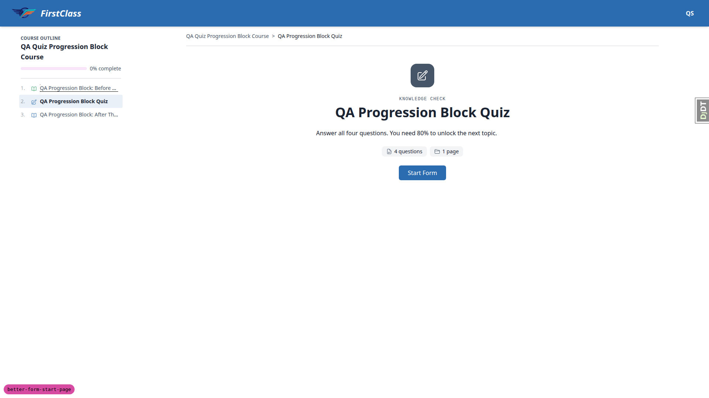
Golden path start page: badge, eyebrow, title, intro, pills, centred "Start Form" button.

**1.2** — A fresh learner (after `qa_reset_learner_progress`) sees the "Start Form" CTA and no
previous-attempts section at all, not an empty heading. Layout stayed balanced with no subtitle and
no intro present at this point.

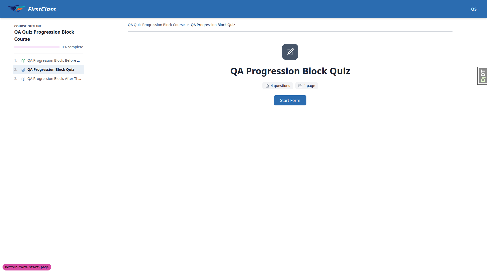
Fresh learner state: no previous-attempts section.

**1.3** — `qa-single-question-course` renders "1 question" / "1 page", the correct singular rather
than "1 questions". Fixture seeded by `qa_create_form_count_edge_cases` (added on this branch).

### §2 Previous attempts

| Test | Viewport | Verdict |
| --- | --- | --- |
| 2.1 Previous attempts present | desktop | pass |
| 2.2 Row background follows the surface token | desktop | pass |
| 2.3 List grows then slices to 5 | desktop | pass |

**2.1** — The previous-attempts section is present below the card and is left-aligned (section class
`text-left`, computed `textAlign: left` on the rows) rather than centred. Each row shows the date on
the left and, for the QUIZ, the percentage plus the raw score/max_score on the right, e.g. "7 Sep
2026  100% (4/4)". Rows are ordered newest first. The heading keeps its
`aria-labelledby="previous-attempts-heading"` association.

Previous attempts list, left-aligned rows with date and score.

**2.2** — This is the specific fix under test. Attempt rows now carry `border border-border
bg-surface` instead of a hardcoded `bg-white`. Under the default theme `--color-surface` is `#FFFFFF`
so the computed background is white, correct token behaviour rather than a hardcoded value; the
first_class theme check in §5 confirms the row follows the theme rather than staying white.

**2.3** — Six attempts were taken in sequence. After three the list showed three rows (25%, 50%,
75%) and stayed readable. After six attempts exactly five rows render (100%, 50%, 0%, 25%, 50%): the
oldest 75% attempt drops off, confirming the view's slice to 5. This was independently corroborated
at session start, where seven attempts left in the database by an earlier run also rendered exactly
five rows.

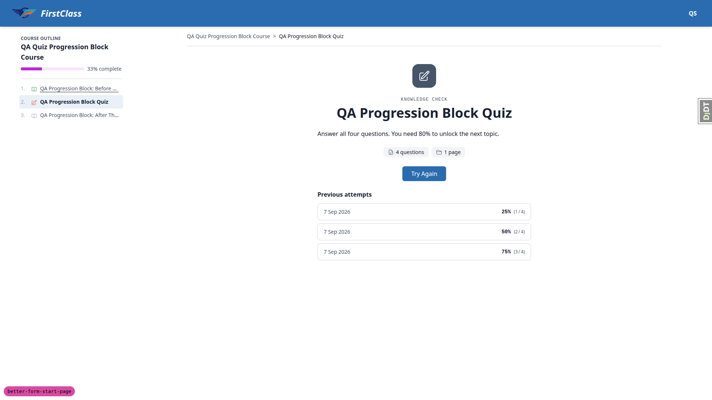
Previous-attempts list after six attempts, sliced to the five most recent rows.

### §3 Every start-page state

| State | Test | Viewport | Verdict |
| --- | --- | --- | --- |
| Mid-attempt | 3.1 | desktop | pass |
| Failed quiz | 3.2 | desktop | pass |
| Passed quiz | 3.3 | desktop | pass |
| Last item / finish course | 3.4 | desktop | pass |

**3.1** — Started the quiz, answered a question, left without submitting (the runner raises its own
`beforeunload` confirm, which is expected). Back on the start page the CTA reads "Continue Form" and
links to `/fill_form/1`; clicking it resumes on the correct page. No previous-attempts section shows
while the attempt is still open. Card layout is unchanged and never looks half-empty.

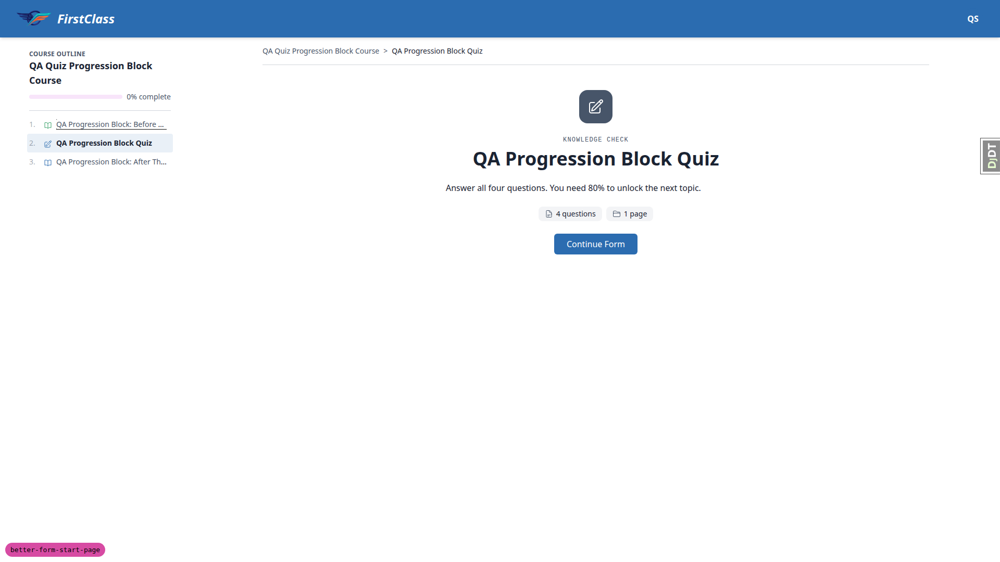
Mid-attempt state: "Continue Form" CTA.

**3.2** — Submitted 3/4 = 75% against a pass mark of 80%. CTA becomes "Try Again", single and
centred. The outline marks item 2 "Needs retry" and item 3 stays "Locked" and is not a link, so the
restyle did not change unlocking.

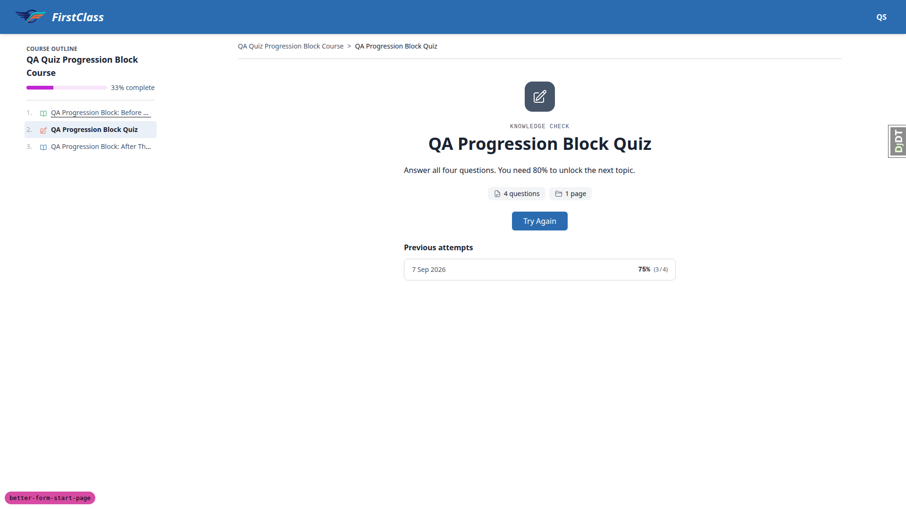
Failed quiz: "Try Again" CTA, following topic locked in the outline.

**3.3** — Submitted 4/4 = 100%. CTA becomes "Next", single and centred, linking to
`/courses/qa-progression-block-course/3/`. The outline then shows item 2 "Completed" and item 3
unlocked.

Passed quiz: "Next" CTA, five attempt rows visible below.

**3.4** — `qa-single-question-course` has a single item which is the form, so the form is the last
item. After completing it the CTA reads "Finish Course", single and centred, and clicking it goes to
`/courses/qa-single-question-course/finish/` ("Course complete"). The card holds its shape with no
subtitle and no intro: badge, title, pills, CTA, one attempt row, and never looks half-empty.

Last item in the course: "Finish Course" CTA.

### §4 Real content, not lorem

| Test | Viewport | Verdict |
| --- | --- | --- |
| 4.1/4.2 Long content | desktop | pass |
| 4.3 No subtitle | desktop | pass |
| 4.4 No content | desktop | pass |

**4.1/4.2** — The form was given a 12-word title, a long subtitle and intro markdown containing a
heading, bullet list, numbered list, code block and blockquote. The long title wraps cleanly inside
the 576px column with no overflow. The eyebrow wraps rather than pushing the page sideways. The
bullet list, code block and blockquote are all left-aligned (computed `textAlign: left`); the specific
failure mode of centred list items does not occur. The intro heading is centred, which is the
intended design (per "Left-align form start intro body, centre only its headings"). No horizontal
scrolling occurred: `documentElement.scrollWidth == innerWidth` at every width tested.

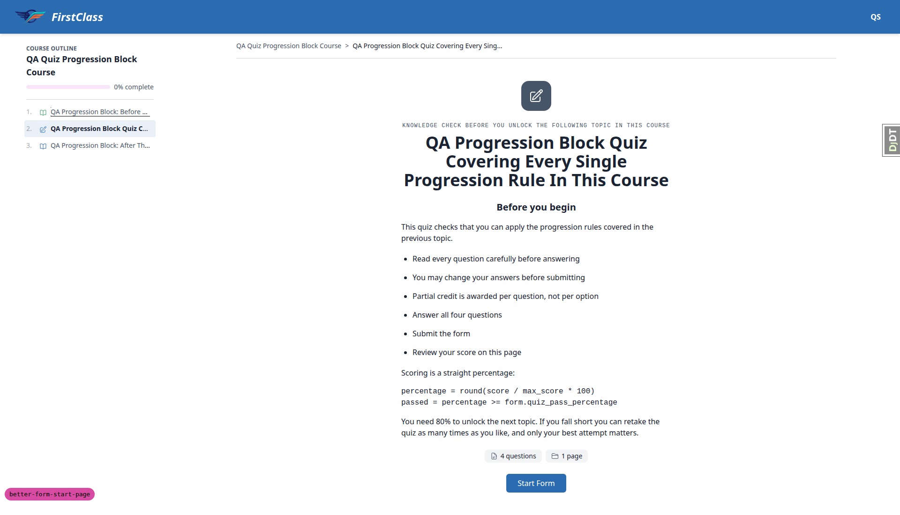
Long-content form: wrapped title, left-aligned list/code/blockquote, centred intro heading.

**4.3** — Subtitle cleared: the eyebrow paragraph is not rendered at all, and there is no empty gap
where it was. The title block's measured height (120px) equals the h1's height exactly, and the
badge-to-title gap is the normal 24px space-y step, so the title moves up cleanly. No zero-height
children anywhere in the card.

**4.4** — Intro markdown cleared: the `` guard drops the markdown
container entirely rather than leaving an empty box. The card renders exactly four children — badge
(64px), title block (120px), pills row (28px), CTA (40px) — with no stray empty container between the
title and the pills and no zero-height elements.

### §5 Both themes

| Test | Viewport | Verdict |
| --- | --- | --- |
| 5.1 first_class theme | desktop | pass |
| 5.2 Row follows theme | desktop | pass |
| 5.3 default theme (rebuilt back) | desktop | pass |

**5.1** — Rebuilt and served under `FLS_THEME=first_class`. The indigo/teal brand comes through:
badge fill `#00CEC9` teal (`--color-secondary`) with a `#1A1A2E` dark-navy icon
(`--color-on-secondary`), button `#283593` indigo (`--color-primary`), h1 in Outfit and body in DM
Sans, and chunkier radii — pills fully rounded (`9999px`) and button `8px`. The badge is a solid fill
with `background-image: none` and `box-shadow: none`, so no gradient and no coloured glow.

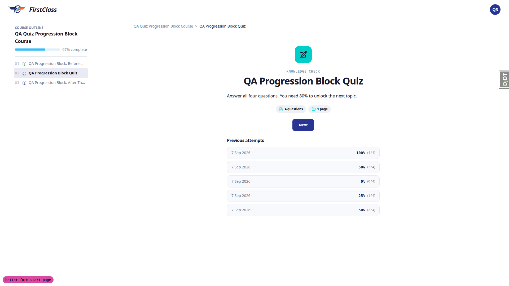
first_class theme: teal badge, indigo button, Outfit/DM Sans type.

**5.2** — This is the decisive check for the `bg-white` fix. Under first_class, `--color-surface` is
`#F8F9FC` and the attempt rows compute to `rgb(248,249,252)`, following the theme instead of staying
white. Under default, `--color-surface` is `#FFFFFF` and the same rows compute to white. A hardcoded
`bg-white` would have stayed `rgb(255,255,255)` in both cases. Nothing on the page kept a colour from
the other theme: badge, button, pill icon, row background and both fonts all changed.

**5.3** — Rebuilt and served back under the default theme. The blue/slate brand is restored: badge
`#475569` slate with a white icon, button `#2B6CB0` ocean blue, system font stack, tighter radii
(pill `8px`, button `6px`). Every element is legible and nothing disappears into its background.
Foreground/background pairs are correct in both themes; the badge uses `--color-secondary` with
`--color-on-secondary` rather than a fixed ink colour.

default theme rebuilt back: slate badge, ocean-blue button, system font.

### §6 Responsive

| Test | Viewport | Width | Verdict |
| --- | --- | --- | --- |
| 6.1 mobile | mobile | 375px | pass |
| 6.2 tablet | tablet | 768px | pass |
| 6.3 desktop, outline open | desktop | 1440px | pass |

**6.1** — At 375x812 with the long-content form: the card is 343px wide with even 16px side padding.
No horizontal scrollbar (`scrollWidth 375 == innerWidth 375`). Both pills fit on one line inside the
column and neither squashes nor overflows; the container is flex-wrap so they would wrap if
narrower. Button is 128x40, centred, fully reachable and not clipped. The eyebrow wraps to two lines.
The code block scrolls inside its own box (`scrollWidth 461 > clientWidth 343`, `overflow-x: auto`)
exactly as the template intends, so it never widens the page.

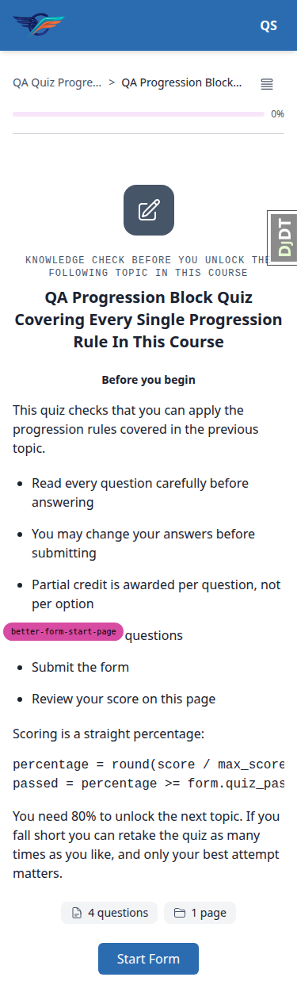
375px mobile viewport: card at 343px with 16px side padding.

**6.2** — At 768x1024, the course outline is collapsed behind the toggle button in the content
header, and the card stays centred in the content area. Long title, lists, code block and blockquote
all render at a comfortable width with no clipping and no horizontal scroll.

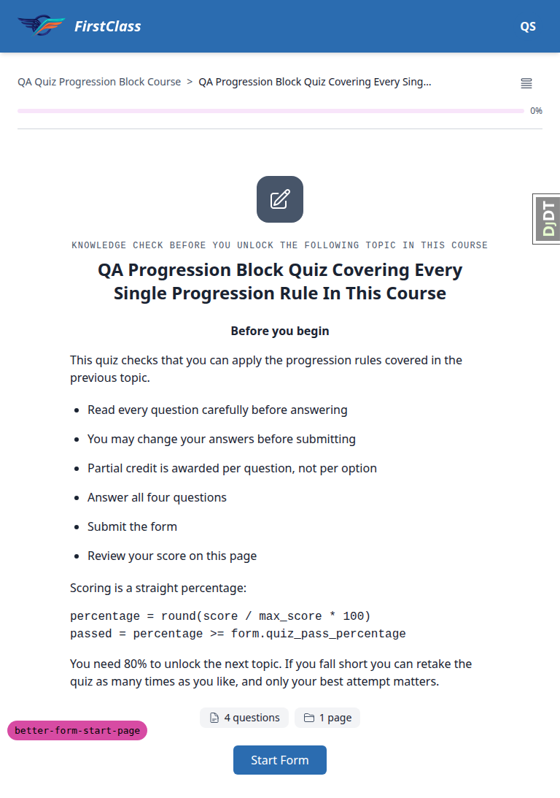
768px tablet viewport: outline collapsed, card centred.

**6.3** — At 1440x900 with the course outline panel open, the card stays a narrow 576px column: it
does not stretch to fill the wide content well, so the max-width survived. The card centre measured
at x=904, exactly the centre of the remaining content well (400..1408), not the viewport centre
(720). The card therefore re-centres in the space left by the outline rather than appearing
off-centre.

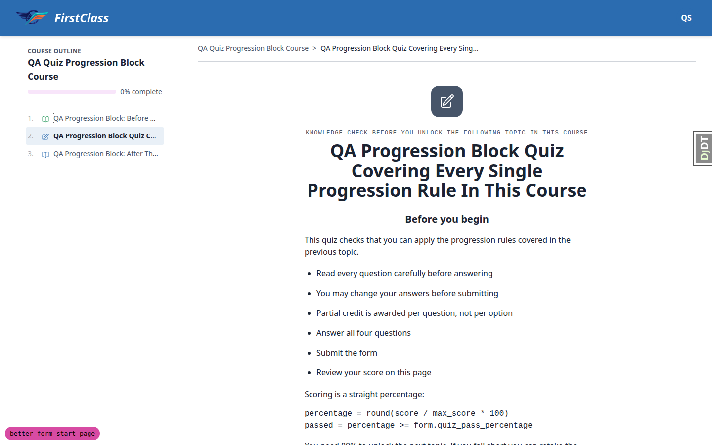
1440px desktop viewport with outline open: card re-centred in the remaining content well.

### §7 HTMX navigation

| Test | Viewport | Verdict |
| --- | --- | --- |
| 7.1 HTMX boost navigation | desktop | pass |
| 7.2 Browser back button | desktop | pass |
| 7.3 Direct reload (F5) | desktop | pass |

**7.1** — A window-level marker was set on the start page, then the "Next" CTA inside `c-player-nav`
was clicked (`hx-boost="true"`, `hx-target`/`hx-select="#interface-main"`,
`hx-select-oob="#course-toc-region"`). The marker survived the navigation, proving only the content
column swapped and the document was never replaced, so no full white flash occurred. The URL updated
to `/3/` and the outline updated its highlight out of band (item 2 flipped to "Completed" and became
a link).

**7.2** — Browser back from the topic lands on the start page fully rendered: badge, eyebrow, title,
intro, both pills, the centred CTA and all five attempt rows. Nothing was blank or half-rendered, so
the boost target and select are intact. Loading the same URL directly rendered identically.

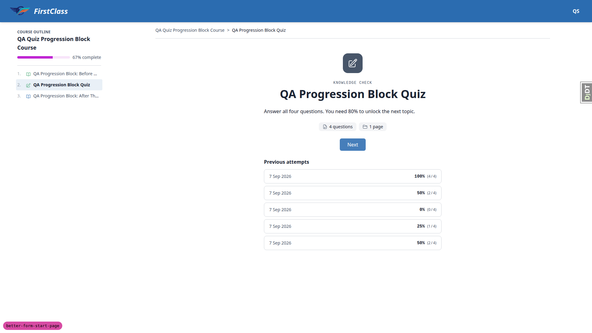
Start page after browser back navigation, fully rendered.

**7.3** — Pressed F5 on the start page (performance navigation type "navigate"). The page comes back
identical: badge, eyebrow, title, both pills, the "Next" CTA and all five attempt rows, six card
children in total. No blank or half-rendered state.

### §8 Failure and permission branches

| Test | Viewport | Verdict |
| --- | --- | --- |
| 8.1 Not registered | desktop | pass |
| 8.2 Logged out | desktop | pass |
| 8.3 Locked item | desktop | pass |
| 8.4 Zero counts | desktop | pass |

**8.1** — Logged in as `demodev_s1@email.com`, a plain non-staff learner with no registration for
`qa-progression-block-course`, and hit the quiz URL directly. The existing access behaviour holds:
redirected to the course detail/preview page showing the outline and an "Enrol for free" CTA. No
broken start page and no server error.

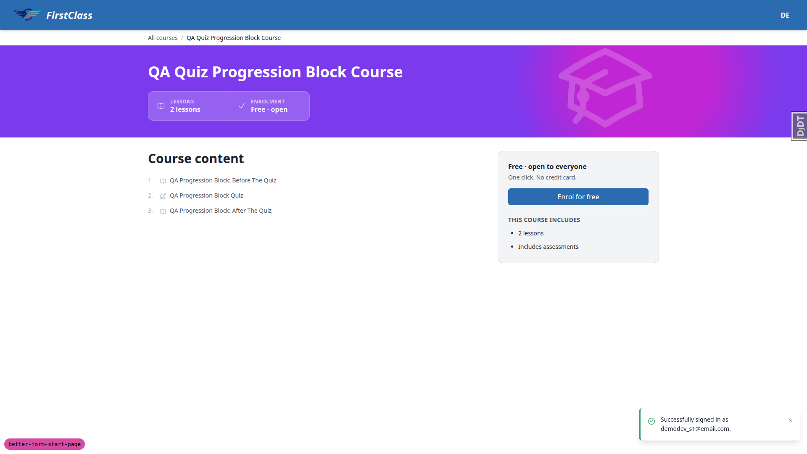
Unregistered learner redirected to course preview.

**8.2** — Signed out and requested the quiz URL: clean redirect to
`/accounts/login/?next=/courses/qa-progression-block-course/2/` with the sign-in form rendered. No
stack trace.

**8.3** — With a failed quiz on `qa-progression-block-course`, the following topic renders as "3.
Locked" and is not a link, so it cannot be clicked through. After passing, the same item unlocks. The
restyle did not change unlocking. The first observation of this looked wrong because a
`TopicProgress` from an earlier QA run survived a form-only reset; it was re-run after
`qa_reset_learner_progress --include-topics` and behaved correctly.

**8.4** — `qa-empty-form-course` (0 pages, 0 questions) renders "0 questions" / "0 pages" without
crashing and without a mangled layout; CTA is "Start Form". Note: first load showed "Continue Form"
because a stale in-progress `FormProgress` row was left by an earlier QA run; this was cleared with
`qa_reset_learner_progress` and re-checked (a test-data issue, not a defect).

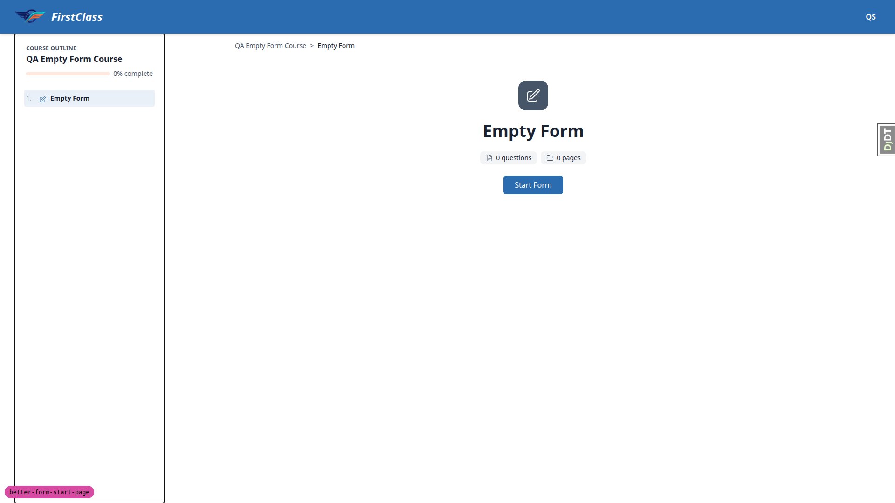
Zero-count form: "0 questions" / "0 pages", "Start Form" CTA.

### §9 Accessibility spot-check

| Test | Viewport | Verdict |
| --- | --- | --- |
| 9.1 Focus ring | desktop | pass |
| 9.2 Heading association | desktop | pass |
| 9.3 Decorative badge | desktop | pass |
| 9.4 200% zoom | desktop | pass |

**9.1** — A real Tab keypress from the preceding focusable moves focus to the primary CTA (an anchor
with `tabIndex 0`, in natural document order). The focus indicator is clearly visible: a two-tone
ring drawn with `box-shadow`, white 2px inner plus primary blue 4px outer.

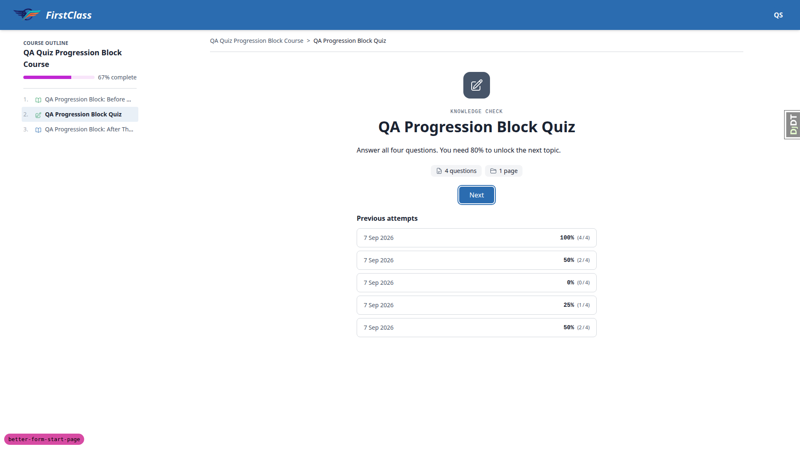
Focus ring on the primary CTA after Tab.

**9.2** — The previous-attempts section is a `<section aria-labelledby="previous-attempts-heading">`
and that id resolves to the `<h2>` reading "Previous attempts", so the heading/section association
survived the restyle.

**9.3** — The badge wrapper carries `aria-hidden="true"` and contains no text, so the decorative icon
does not announce itself next to the title that already names the form.

**9.4** — At the 200% zoom equivalent (960 CSS px viewport) the card reflows rather than clipping: no
horizontal scroll (`scrollWidth 960 == innerWidth 960`), every attempt row fits its box, and no
descendant of the card overflows a visible-overflow container.

## Bugs

### B1 — Fact-pill icon contrast under first_class is still 1.75:1, though the todo item covering it is ticked as applied

Manifestation: test 5.1 (`first_class` theme), desktop.

**Expected.** The previous QA run filed this as bug B3, and `todo.md` §9 carries a **ticked** item
reading "Decide the replacement colour for the form start page's fact-pill icons (QA bug B3:
text-secondary on a muted chip measures 1.75:1 under the first_class theme, below the 3:1 WCAG
non-text minimum), then apply it". A ticked item implies a colour was chosen and applied, so the
icons should no longer measure 1.75:1.

**Actual.** Both fact-pill icons still carry `class="size-4 text-secondary"` (`course_form.html`
lines 43 and 47). Under `FLS_THEME=first_class` that resolves to teal `#00CEC9` on the chip's
`#EDF2F7` background, measured at **1.75:1** — the exact figure the earlier report cited.
`git log main...HEAD -- course_form.html` returns four commits and none of them changed the pill icon
colour; `text-secondary` has been on those icons since the first batch commit `8c210ad0`.

So either the decision was to keep `text-secondary` and the todo wording is now stale, or the fix was
never applied. Under the default theme the same token is slate `#475569` and contrast is strong, so
this affects the first_class theme only.

Worth noting for whoever picks this up: the icons are decorative and sit beside their own text labels
("4 questions", "1 page"), which is a recognised WCAG 1.4.11 exemption, so classing this as a hard
accessibility failure is arguable. The part that is not arguable is the mismatch between a ticked
todo and unchanged code.

first_class theme: the teal pill icons at 1.75:1 against the chip background.

**Triage.** Red lane, not auto-fixed: picking the replacement colour is a product/UX decision, which
fails the green-lane gate. No fixer was spawned.

## Bug status

**UNRESOLVED** — Fact-pill icon contrast under first_class is still 1.75:1 though its todo item is
ticked as applied (reason: needs a colour decision, so red lane; no auto-fix attempted)

## General notes

**Pre-existing: numbered lists render as bullets.** Authored markdown containing an ordered list
renders with disc bullets, not numbers. This is not caused by the restyle: the `content_engine`
markdown renderer emits no `<ol>` at all — `Form.rendered_content()` for a source containing "1. /
2. / 3." after a bullet list returns a single merged `<ul>` with six `<li>`. This was verified
directly against the model, with no template involved. The restyle's own requirement (list items
must be left-aligned, not centred) is met. Affects all authored markdown site-wide, not just the form
start page.

**Pre-existing: markdown blockquote and code block have no visual styling.** The renderer does emit
`<blockquote>` and `<pre><code>`, but they render with no left border, no background, no indent and
no italic, visually identical to body copy apart from the monospace face. The cause is that
`c-markdown-container` (`freedom_ls/base/templates/cotton/markdown-container.html`) is just `
` with no prose/typography styles, and that component is untouched by this branch
— the old template used the same component. Pre-existing and site-wide. The restyle's own
requirement (these blocks must be left-aligned) is met, and long code lines correctly scroll inside
their own box via `[&_pre]:overflow-x-auto` rather than widening the page.

**Pre-existing: focus outline drawn around the course outline panel.** On a direct page load the
course-outline side panel sometimes shows a thin black rectangle around it. It is the user-agent
default focus ring (`outline: 1px auto rgb(16,16,16)`) on the `<dialog class="side-panel-dialog">`,
which has `tabIndex -1` and becomes `document.activeElement` when opened. That component lives in the
course player shell, not in any file this branch changed, and it appears on topic pages too.
Cosmetic and pre-existing.

**Low-contrast pill icon under the first_class theme.** Measured at 1.75:1 and raised as bug B1
above, because `todo.md` §9 carries a ticked item saying a replacement colour was chosen and applied.
See the B1 section for the full evidence.

**Test-data gap: no seeded form exercises the eyebrow or the intro.** Every seeded form
(`qa-progression-block-quiz`, `qa-free-text-survey-form`, `qa-all-question-types-form`,
`qa-single-question-form`, `qa-empty-form`) ships with `subtitle=''` and `content=''`. The eyebrow and
the authored-intro branches of the new template are therefore unreachable from the fixtures as
seeded. These fields were set by hand to run §1 and §4, then restored to the fixture state. Worth
closing in the fixtures so a future run gets these states for free.

**start_form CTA does a full page load, by design.** Clicking "Start Form"/"Try Again" issues a
boosted HTMX request (`hx-request: true`, `hx-boosted: true`) to `/start_form`, which 302-redirects
into the form runner. The runner is a separate full-screen shell with no `#interface-main`, so the
browser completes a normal document navigation. That is architectural, not a regression — the "Next"
CTA, which links straight to a player URL, swaps in place with the document preserved (verified with
a window-level marker that survived, see §7.1). The restyle did not change `c-player-nav`'s boost
attributes.

**Screenshot collection deviation.** This Playwright MCP build writes accessibility snapshots
(`.yml`) and console logs (`.log`) into the same `qa-screenshots/` output directory as the PNGs, 66
and 32 of them respectively this run. `qa_collect_screenshots.sh` moves every regular file, so run
as-is it would have committed 98 transient files into the spec directory. The `.yml` and `.log` files
were deleted from `qa-screenshots/` first (targeted `find -delete` on those two extensions, no
recursive or force flags) so only the 20 report screenshots were collected. Worth teaching the script
to filter by extension.

status: ok · reason: 26 tests recorded across 3 viewports, all pass; 1 bug — 0 fixed, 1 unresolved (red lane, needs a colour decision); report rendered, screenshots verified
