# Frontend QA report — better form start page

## Methodology

The run drove a real browser through Playwright MCP against a dev server on port 8229, under the
`DemoDev` site, logged in as the seeded QA learners (`demodev_quizqa@email.com`, `demodev@email.com`,
`demodev_s1@email.com`). CSS was rebuilt with `npm run tailwind_build` before testing began, and
rebuilt again per theme for the theme pass (`FLS_THEME=first_class npm run tailwind_build`, then
plain `npm run tailwind_build` to return to `default`), with the server restarted each time so the
regenerated CSS was actually served.

Screenshots were collected into `screenshots/` beside this report. Every image this report
references exists there. Screenshot compression ran over the batch and found no PNG over the size
threshold, so nothing needed compressing.

## Diff scoping

The scoping gate fired the **FULL** class — the full matrix ran, nothing was skipped. Triggering
changed files:

- `freedom_ls/learner_interface/templates/learner_interface/course_form.html`
- `freedom_ls/learner_interface/templates/learner_interface/partials/exam_meta_grid.html`
- `freedom_ls/learner_interface/templates/learner_interface/partials/exam_previous_attempts.html`
- `freedom_ls/learner_interface/tests/test_form_runner_views.py`
- `freedom_ls/qa_helpers/management/commands/qa_create_form_count_edge_cases.py`
- `.claude/agent-memory/fls-dev-qa-data-helper/MEMORY.md`
- `spec_dd/2. in progress/better-form-start-page/*`

Nothing was skipped as a result of scoping: desktop, mobile and tablet passes all executed, as did
both themes.

## Smoke gate

Passed. Pages checked before the full matrix was allowed to run:

- `http://127.0.0.1:8229/`
- `http://127.0.0.1:8229/courses/qa-progression-block-course/2/`

No failure URL, no failure reason. Full matrix proceeded.

## Results by test-plan section

### §1 The first-time start page — the golden path

| Test | Viewport | Status |
| --- | --- | --- |
| 1.1 | desktop | pass |
| 1.2 | desktop | fail |
| 1.3-pluralisation | desktop | pass |
| 1.4-eyebrow | desktop | pass |

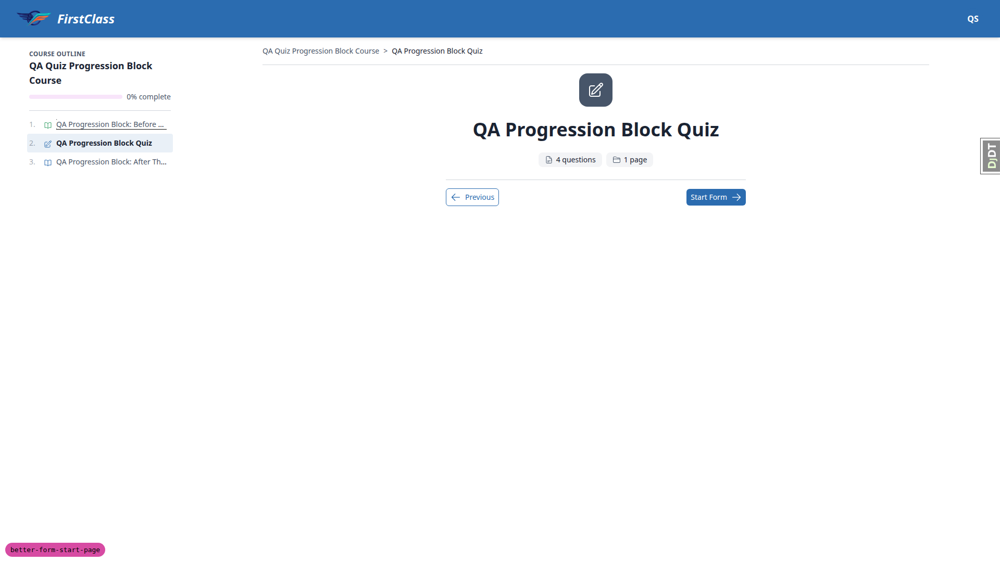
*The centred card at 1920px — badge, title and pills correct; the CTA footer at the bottom of the
card is the CTA-alignment failure (1.2 / bug B1).*

**1.1 — pass.** The centred column measured 576px (`mx-auto max-w-xl`), with `textAlign: center`.
The badge is 64px square, 16px radius, a solid `rgb(71,85,105)` secondary fill, no `backgroundImage`,
no `boxShadow`, white icon — a solid fill, not a gradient, casts no glow. The `h1` is 36px/700 and
centred. The fact pills read "4 questions" and "1 page" with secondary-coloured icons; the counts
were checked against the fixture (3 single-select + 1 checkbox = 4 questions, 1 page) and "page" is
correctly singular. The old two-cell meta grid is absent, as is any left-aligned page title. The
badge glyph is "form" (pencil) and the questions-pill glyph is "notes" — they are not the same icon
repeated. No horizontal scroll: `document.scrollWidth` 1920 equals `innerWidth` 1920.

**1.2 — fail.** The CTA is not centred. See bug **B1** below — this is the sole test record backing
that bug, though the bug's manifestations extend the finding to mobile and tablet.

**1.3-pluralisation — pass.** `qa_create_form_count_edge_cases`'s singular-count course renders
"1 question" / "1 page" — both correctly singular via the `pluralize` filter.

**1.4-eyebrow — pass.** With a subtitle set on the progression-block quiz, the eyebrow renders above
the title as "PROGRESSION CHECK": small, monospace, uppercase, widely tracked, muted grey, under both
themes.

### §2 The returning learner — previous attempts still work

| Test | Viewport | Status |
| --- | --- | --- |
| 2.3-row-colour | desktop | pass |
| 2.4-five-row-slice | mobile | pass |

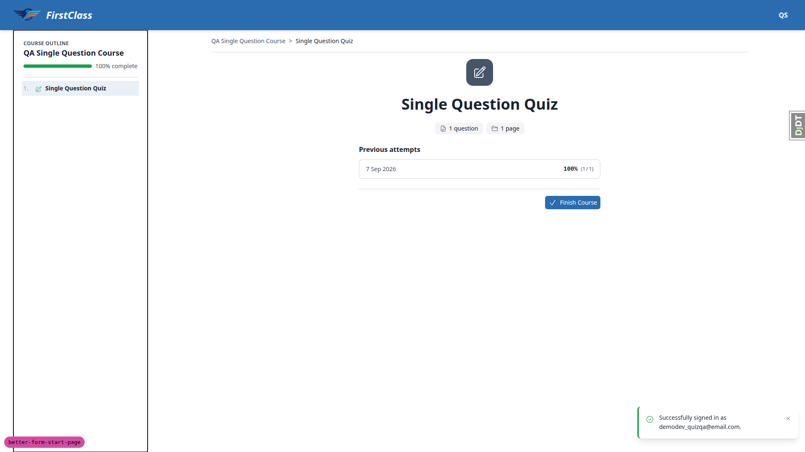
*Attempt row on the default theme — surface-token background, left-aligned section.*

**2.3-row-colour — pass.** The attempt row background is `rgb(255,255,255)`, but that resolves from
the theme token `--color-surface: #FFFFFF` via `bg-surface`, not a hardcoded `bg-white` — querying
`.bg-white` inside the section returns nothing, so the old hardcoded class is gone. Row border is
`rgb(209,213,219)` from `border-border`. The section's computed `textAlign` is `left`, as required.

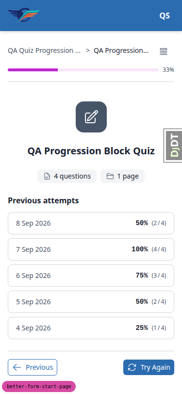
*Five-row slice at mobile viewport — six attempts seeded, oldest sliced off.*

**2.4-five-row-slice — pass** (executed at mobile viewport per the test record). Six completed
attempts were seeded on consecutive days with distinct scores. The start page lists exactly five,
newest first: 8 Sep 50% (2/4), 7 Sep 100% (4/4), 6 Sep 75% (3/4), 5 Sep 50% (2/4), 4 Sep 25% (1/4).
The oldest attempt (3 Sep, 0% (0/4)) is sliced off, confirming the view's `[:5]` and that ordering is
by date, not score. The list stays readable as it grows. The CTA reads "Try Again" because the
newest attempt scored 50%, below the 80% pass mark.

### §3 Every start-page state

| Test | Viewport | Status |
| --- | --- | --- |
| 3.1-no-attempts | desktop | pass |
| 3.2-mid-attempt | desktop | pass |
| 3.3-failed-quiz | desktop | pass |
| 3.4-passed-quiz | desktop | pass |
| 3.5-last-item | desktop | pass |

**3.1-no-attempts — pass.** After `qa_reset_learner_progress --include-topics`: CTA reads
"Start Form", and there is no previous-attempts section in the DOM at all (not an empty heading).
Outline: item 2 "Not started", item 3 "Locked" and not a link.

*Mid-attempt state — CTA reads "Continue Form" and resumes at the correct page.*

**3.2-mid-attempt — pass.** Starting the quiz and navigating away without submitting flips the CTA
to "Continue Form" (`data-testid continue-form-button`), linking to `fill_form/1`. Verified again on
the multi-page `qa-free-text-survey-course`: answered page 1, moved to page 2, left; CTA read
"Continue Form" and resumed at `fill_form/2` — the correct page. Its pills read "4 questions" /
"2 pages", matching the fixture.

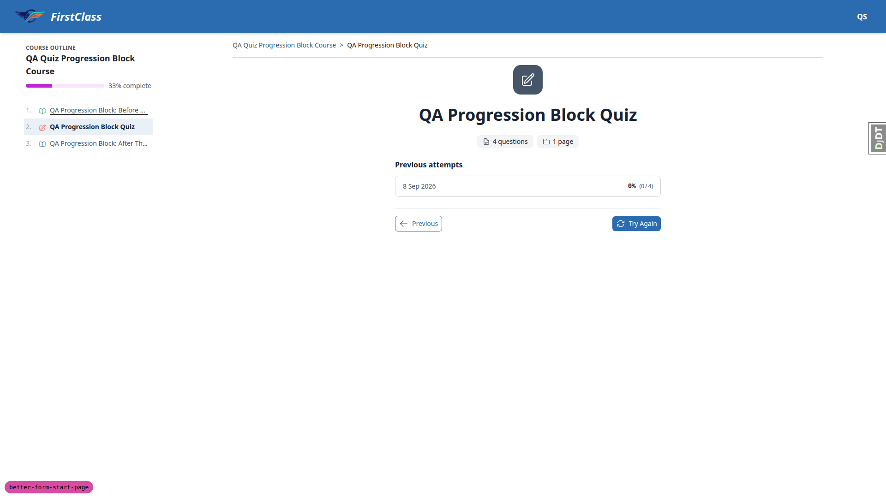
*Failed-attempt state — 0% (0/4), CTA reads "Try Again".*

**3.3-failed-quiz — pass.** Submitting all-wrong answers scored 0/4 = 0%, below the 80% pass mark.
CTA becomes "Try Again" with the retry icon. The attempt row shows "8 Sep 2026" and "0% (0/4)". The
outline marks item 2 "Needs retry".

**3.4-passed-quiz — pass.** Submitting all-correct answers scored 4/4 = 100%, at or above the 80%
pass mark. CTA becomes "Next" (`data-testid next-button`), linking to
`/courses/qa-progression-block-course/3/`. The outline flips item 2 to "Completed" and item 3 from
"Locked" to "Not started" with a working link. The attempts list grew to six and re-sliced to the
five newest.

*Last-item state — CTA reads "Finish Course" with the check icon.*

**3.5-last-item — pass.** The Single Question Quiz is the only item in its course; the CTA correctly
reads "Finish Course" with the check icon, and the layout holds. (CTA alignment is tracked separately
as bug B1.)

### §4 Real content, not lorem

| Test | Viewport | Status |
| --- | --- | --- |
| 4.1-long-content | desktop | pass |
| 4.3-no-subtitle | desktop | pass |
| 4.4-no-content | desktop | pass |

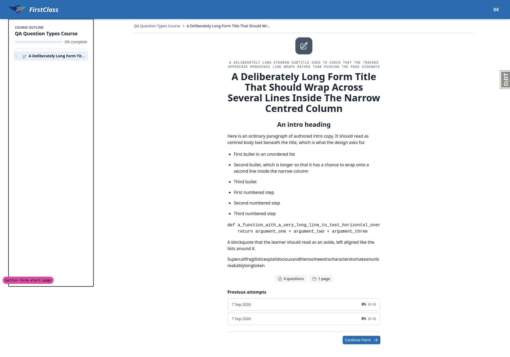
*16-word title, 136-char subtitle, and intro markdown with a heading, lists, code block and
blockquote — everything left-aligned except headings.*

**4.1-long-content — pass.** `qa-all-question-types-form` was given a 16-word title, a 136-char
subtitle, and intro markdown with a heading, bullet list, numbered list, code block, blockquote and
an unbreakable long token. The title wraps to 4 centred lines inside the 576px column. The eyebrow
wraps to 2 lines and stays uppercase/monospace/tracked/muted. The container classes resolve to
`text-left` with only `h1`–`h6` centred, so the list, code block and blockquote all compute
`textAlign: left` — the centred-bullets failure mode does not occur. The `pre` block computes
`overflow-x: auto` with `scrollWidth` 1047 > `clientWidth` 576, so the long code line scrolls inside
its own block rather than the page. `document.scrollWidth` 1920 equals `innerWidth` 1920: no
page-level horizontal scroll, and `break-words` wraps the long token.

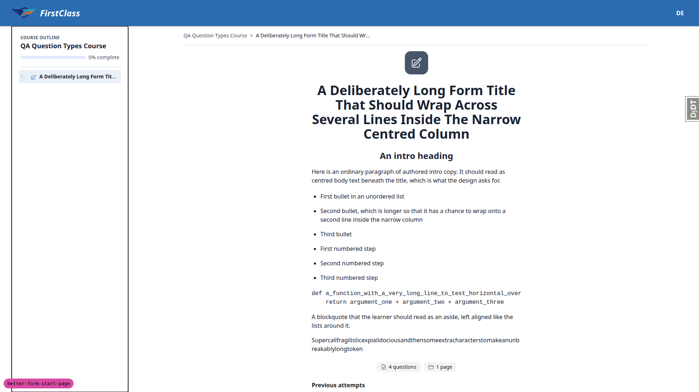
*Subtitle cleared — the eyebrow wrapper collapses exactly onto the title, no leftover gap.*

**4.3-no-subtitle — pass.** With the subtitle cleared, no eyebrow renders and the `space-y-2` wrapper
collapses onto the `h1` exactly — the wrapper's bounding box (y 229, height 160) is identical to the
`h1`'s, so there is no empty paragraph and no leftover gap. The title moves up cleanly.

**4.4-no-content — pass.** With the form content cleared, the markdown container is absent from the
DOM entirely (the `` guard holds); the card's children are the badge,
title wrapper, pills, previous-attempts section and footer — no stray empty container between title
and pills. The one empty `div` in the card is the player-footer's documented empty left slot that
holds the forward button flush right.

### §5 Both themes

| Test | Viewport | Status |
| --- | --- | --- |
| 5.1-default-theme | desktop | pass |
| 5.2-first-class-theme | desktop | fail |

*Default theme — badge, pills and CTA all resolve from theme tokens.*

**5.1-default-theme — pass.** Under `FLS_THEME=default`: badge fill `rgb(71,85,105)` equals
`--color-secondary #475569`, badge icon white, contrast 7.58:1. Pill background `rgb(243,244,246)`,
pill icon `rgb(71,85,105)` (secondary), icon-on-pill contrast 6.89:1, label contrast 14.34:1. CTA
`rgb(43,108,176)` equals `--color-primary #2B6CB0` with white text, 5.42:1. Attempt row background
equals `--color-surface #FFFFFF`. Fonts are the system sans stack. Everything resolves from theme
tokens.

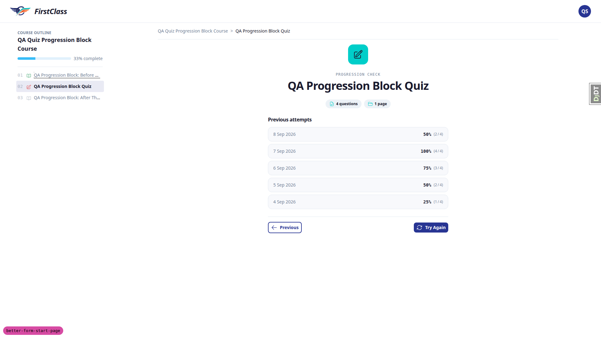
*first_class theme — teal badge and indigo CTA correctly swap; the pill icons (barely visible) are
the B2 contrast failure.*

**5.2-first-class-theme — fail.** CSS rebuilt and server restarted under `FLS_THEME=first_class`.
Almost everything swaps correctly with nothing hardcoded: badge fill becomes teal `rgb(0,206,201)`
(`--color-secondary #00CEC9`) with icon `rgb(26,26,46)` (`--color-on-secondary`), a correctly paired
8.67:1; CTA becomes indigo `rgb(40,53,147)` (`--color-primary #283593`) at 10.39:1; attempt rows
become `rgb(248,249,252)` (`--color-surface #F8F9FC`), proving the old hardcoded `bg-white` really is
gone; fonts become Outfit (headings) and DM Sans (body); radii get chunkier (pill 9999px, button
8px). The eyebrow "PROGRESSION CHECK" renders uppercase/tracked/muted as expected. The failure: the
fact-pill icons use `text-secondary`, so under `first_class` they render teal `rgb(0,206,201)` on the
muted chip background `rgb(237,242,247)` — a contrast ratio of 1.75:1, barely visible. See bug **B2**.

### §6 Responsive

| Test | Viewport | Status |
| --- | --- | --- |
| 6.1-mobile-375 | mobile | pass |
| 6.2-tablet-768 | tablet | pass |
| 6.3-desktop-1440 | desktop | pass |

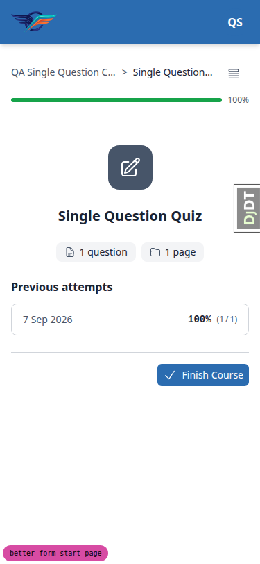
*375×812 — card fills the width with side padding, both pills fit on one line, CTA fully reachable.*

**6.1-mobile-375 — pass.** At 375×812 the card is 343px wide at left offset 16px, filling the width
with sensible side padding. `document.scrollWidth` 375 equals `innerWidth` 375: no horizontal
scrollbar. Both pills fit on one line (115px + 91px inside 343px), so `flex-wrap` is not forced and
nothing squashes or overflows. The CTA is 133×32 with its right edge at 359 < 375 — fully reachable
and not clipped. The previous-attempts row stays readable, date left and score right. The course
outline sits behind the "Open course outline" toggle.

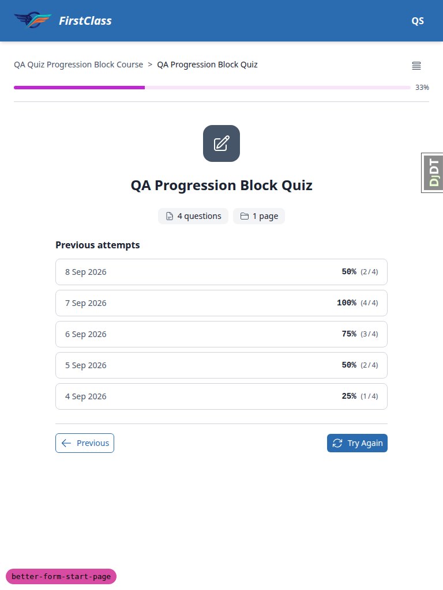
*768×1024 — outline behind the toggle, card still centred at 576px, five attempt rows full-width.*

**6.2-tablet-768 — pass.** At 768×1024 the course outline is behind the toggle (mobile nav, not the
desktop sidebar) and the card is still centred in the content area at its 576px max width. The five
attempt rows render full-width inside the card, date left and score right, with no crowding and no
horizontal scroll.

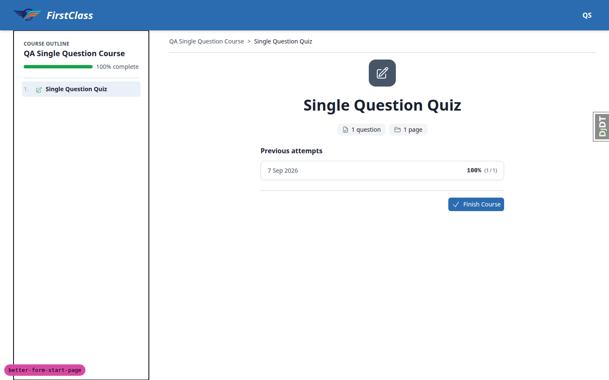
*1440×900 with the outline panel open — the card re-centres in the remaining space (216px gap each
side) rather than staying centred to the full viewport.*

**6.3-desktop-1440 — pass.** At 1440×900 the card stays 576px — it does not stretch to fill the wide
content well, so the max-width held. With the outline panel open the content well runs 400–1408 and
the card sits 616–1192, i.e. 216px of gap on each side: the card re-centres in the remaining space
rather than staying centred to the full viewport. At desktop widths the outline toggle is
`lg:hidden`, so the panel is always open there and there is no second state to check.

### §7 Navigation still behaves (HTMX)

| Test | Viewport | Status |
| --- | --- | --- |
| 7.1-htmx-boost | desktop | pass |
| 7.2-back-button | desktop | pass |
| 7.3-direct-reload | desktop | pass |

**7.1-htmx-boost — pass.** A window-scoped marker was set, then a footer nav control was clicked. The
marker survived the navigation, proving the page was swapped by `hx-boost` rather than fully reloaded
(no white flash). The URL updated to `/courses/qa-progression-block-course/1/`, `document.title`
updated, and the sidebar outline came through the `hx-select-oob` swap intact.

**7.2-back-button — pass.** Browser back returns to the start page fully rendered: card present,
badge present, pills "4 questions"/"1 page", title, CTA and outline highlight all correct. Nothing
blank or half-rendered.

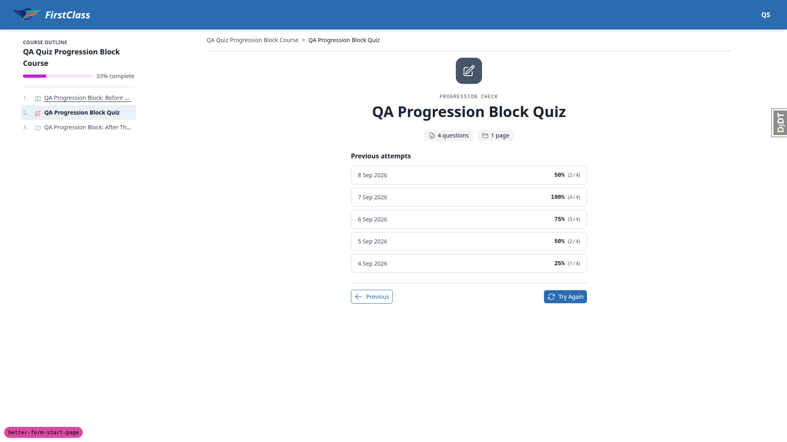
*Direct reload — the cold-loaded page agrees with the boosted one.*

**7.3-direct-reload — pass.** Every `browser_navigate` in this run was a full document load of the
start page URL, and each rendered the complete card — badge, eyebrow, title, pills, attempts and CTA.
The boosted and the cold-loaded page agree.

### §8 Failure and permission branches

| Test | Viewport | Status |
| --- | --- | --- |
| 8.1-not-registered | desktop | pass |
| 8.2-logged-out | desktop | pass |
| 8.3-locked-item | desktop | pass |
| 8.4-zero-counts | desktop | pass |

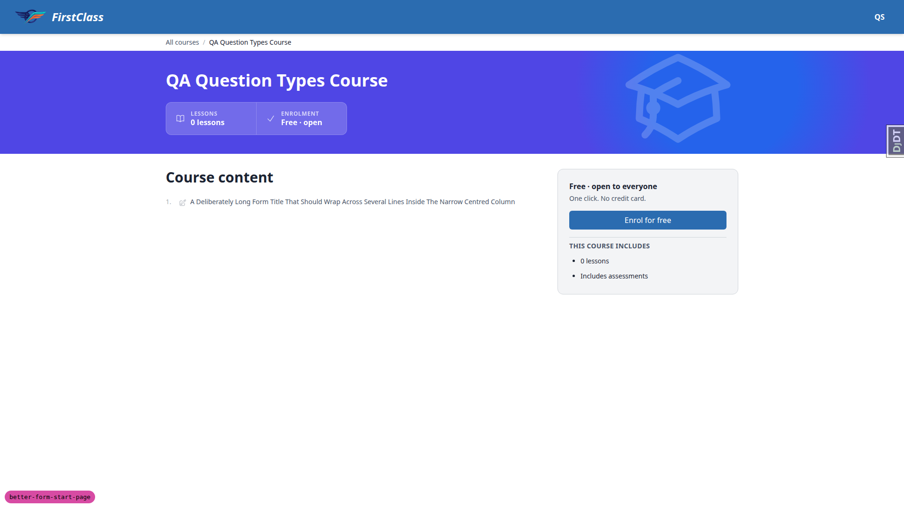
*Unregistered learner hitting the form URL — redirected to the enrolment preview, no broken page.*

**8.1-not-registered — pass.** `demodev_quizqa@email.com` is not registered for
`qa-question-types-course`. Hitting the form URL directly redirects to the course
detail/enrolment-preview page with an "Enrol for free" panel. No broken start page, no server error.

**8.2-logged-out — pass.** Signed out, then hit `/courses/qa-progression-block-course/2/` directly.
Redirected to `/accounts/login/?next=/courses/qa-progression-block-course/2/`. No stack trace.

**8.3-locked-item — pass.** With no attempt, and again with a failed attempt, outline item 3 renders
as "Locked" with no anchor at all, so it cannot be clicked through — unlocking is unchanged by the
restyle. It only became a link after a passing attempt.

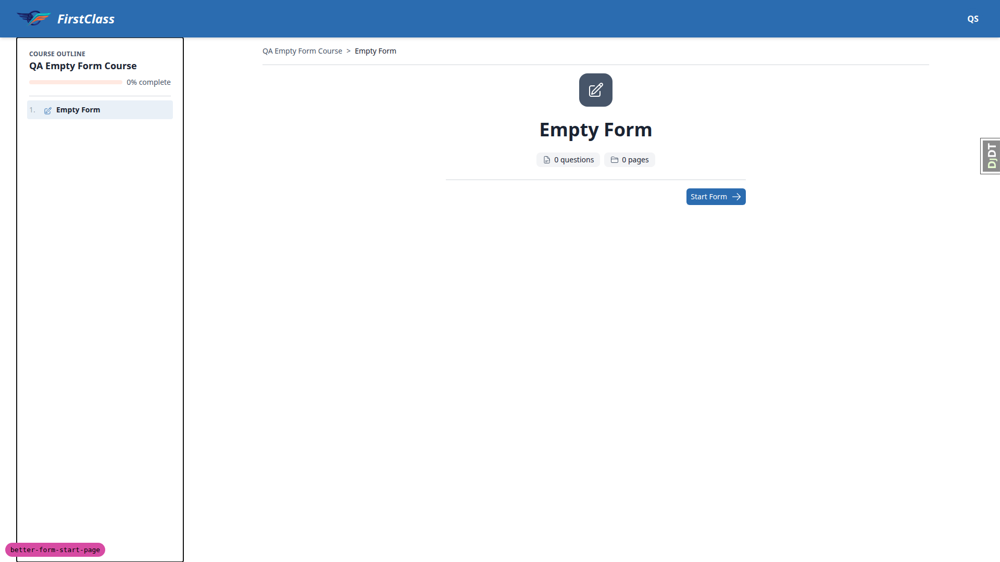
*Zero-count form — "0 questions" / "0 pages", no crash, no mangled layout.*

**8.4-zero-counts — pass.** `qa-empty-form-course` renders "0 questions" / "0 pages" with correct
plurals. Badge, title, pills and CTA all render; no crash, no mangled layout, no previous-attempts
section. (The fixture itself documents that following Start Form on a form with no pages 404s from
`form_fill_page` — a pre-existing view behaviour outside the start page's scope.)

### §9 Accessibility spot-check

| Test | Viewport | Status |
| --- | --- | --- |
| 9.1-focus-ring | desktop | pass |
| 9.2-heading-association | desktop | pass |
| 9.3-decorative-badge | desktop | pass |
| 9.4-zoom-200 | desktop | pass |

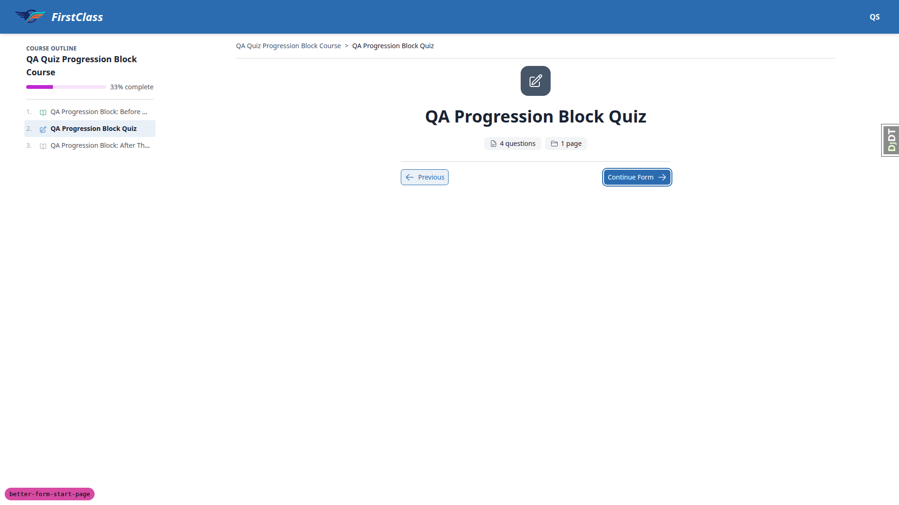
*Tabbed focus on the CTA — visible double-ring box-shadow from the theme's .btn style.*

**9.1-focus-ring — pass.** Tabbing with real key presses from the top of the document, the CTA is the
6th and last focusable element and takes focus. The visible focus ring is a box-shadow double ring
(white 2px inner, `rgb(43,108,176)` 4px outer) from the theme's `.btn` style — clearly visible in the
screenshot.

*Previous-attempts section, aria-labelledby resolving to the "Previous attempts" heading.*

**9.2-heading-association — pass.** On a page with attempts, the previous-attempts block is
`<section aria-labelledby="previous-attempts-heading">` and that id resolves to the `<h2>` reading
"Previous attempts" — the association survives the restyle.

**9.3-decorative-badge — pass.** The badge wrapper carries `aria-hidden="true"`, so although the inner
`svg` has `role="img"`, the whole subtree is removed from the accessibility tree. Confirmed in the
Playwright accessibility snapshot: the badge does not appear on the start page at all, while the
`h1` title does.

**9.4-zoom-200 — pass.** Emulated 200% zoom by halving the 1920 viewport to 960×540. The card
reflows rather than clipping: still 576px, centred at 192–768, nothing past the viewport edge. All
five attempt rows render inside the card, the CTA is not clipped, and `document.scrollWidth` 960
equals `innerWidth` 960, so there is no horizontal scrollbar.

## B1: Start-page CTA is not the centred solo button the design specifies

**Manifestations:** 1.2 (desktop), 1.2 (mobile), 1.2 (tablet)

**Expected:** Per the idea, plan.md's addendum and test plan sections 1, 2 and 3: a single primary
button, centred under the card, with no `border-t` divider above it. Plan.md: "c-button-group
variant=space-between becomes variant=centered; there is only ever one button in the list, and the
design centres it" and "Drop `pt-4 border-t border-border` from `c-player-nav`".

**Actual:** The CTA sits flush right inside `c-player-footer`, beside a "Previous" button flush left,
under a `pt-4 border-t` divider. At 1920 the Start Form button measures x 1318–1432, hard against the
card's right edge rather than centred. The implementation kept the shared `c-player-footer`, which
predates this branch: it is already in `main`'s `course_form.html` at the merge-base `ca84fc82`, and
its own docstring says topics, form start pages and form completion pages all use it "so the three
footers stay identical". This is a deliberate divergence from the plan rather than an accidental
regression, but it leaves the new centred card sitting above an asymmetric footer and contradicts
every written statement of the design. Which one wins is a product/UX call.

## B2: Fact-pill icons use text-secondary and drop to 1.75:1 contrast under the first_class theme

**Manifestations:** 5.2 (desktop)

**Expected:** Test plan §5: every element legible in both themes, nothing disappearing into its
background, with the pill icon checked specifically against the pill background.

**Actual:** The pills are new in this change and set their icons to `text-secondary` on a
`c-chip variant=muted` background. Under the default theme, secondary is the dark neutral #475569 on
#F3F4F6, which measures 6.89:1 and reads fine. Under first_class, secondary is the bright accent
#00CEC9 on #EDF2F7, which measures 1.75:1 — below the 3:1 WCAG 1.4.11 non-text minimum, and visibly
faint on screen. No colour is hardcoded (the token swaps correctly), so the defect is the choice of
token: `text-secondary` is a fill colour meant to sit behind `text-on-secondary`, not a foreground for
a neutral surface. The badge gets this right by pairing `bg-secondary` with `text-on-secondary`
(8.67:1 under first_class). Picking the replacement token is a design call governed by the brand
guidelines.

## Bug status

| Bug | Status |
| --- | --- |
| B1 | **UNRESOLVED** — Start-page CTA is not the centred solo button the design specifies (reason: needs a product/UX decision — keep the shared player footer or restore the centred CTA) |
| B2 | **UNRESOLVED** — Fact-pill icons use text-secondary and drop to 1.75:1 contrast under the first_class theme (reason: needs a design decision on the replacement brand token) |

## General notes

These came out of the run and are **not regressions from this change**:

1. The markdown renderer merges an ordered list into an immediately preceding unordered list. Intro
   markdown containing a `-` bullet list followed by a blank line and a `1.` numbered list rendered
   as a single six-item `<ul>` with disc markers and no `<ol>` at all. `main` renders the intro
   through the same `c-markdown-container` + `form.rendered_content` pipeline, so this is upstream
   content-rendering behaviour, untouched by the restyle.
2. A bare `>` blockquote renders with no left border, no indent and no italic — visually identical to
   a paragraph. There is no CSS for a bare blockquote anywhere in the project; quotes have a
   dedicated `c-pull-quote` component. Also pre-existing and project-wide.
3. The CTA uses `size="small"`, giving a 32px-high touch target on mobile (confirmed in 6.1-mobile-375
   at 133×32). That clears WCAG 2.2's 24px minimum but is below the 44px both Apple and Material
   recommend. It follows from the shared footer's button size rather than from the card restyle.
4. The intro body copy is left-aligned with only headings centred (confirmed in 4.1-long-content). The
   test plan says "a centred paragraph is fine and expected," but commit afd543ec ("Left-align form
   start intro body, centre only its headings") deliberately changed this after the test plan was
   written, and the template comment documents the intent. The current behaviour is correct and the
   test plan's wording is simply older.
5. Test data the run had to repair before it could test: the branch's earlier QA run left a passing
   attempt and topic progress behind, so `qa_reset_learner_progress` had to be re-run with
   `--include-topics` before the locked-item and no-attempts states could be observed (test 3.1). Six
   dated attempts were seeded to exercise the five-row slice (test 2.4).

status: ok
reason: 2 bugs - 0 fixed, 2 unresolved (both red-lane: each needs a design or product decision, so no auto-fix was attempted); report rendered, screenshots verified
