# Frontend QA report — better form start page

This run manually exercised the restyled form start page (the screen a learner sees before
beginning a `Form` in the course player) against the test plan in `3. frontend_qa.md`. 34 tests
were executed across desktop, tablet and mobile viewports and both project themes: 30 passed and
4 failed. The 4 failures group into 4 distinct root-cause bugs (one bug per failing test, 1:1 in
this run): a markdown descendant-selector bug that over-centres blockquote and loose-list content,
a horizontal-overflow bug triggered by long code lines and unbreakable URLs, a WCAG non-text
contrast failure on the fact-pill icons under the `first_class` theme, and a decorative badge icon
that announces itself redundantly to screen readers.

## Methodology

The run was driven manually through the Playwright MCP against a dev server on `127.0.0.1:8229`.
Screenshots were collected into `screenshots/` beside this report; every image referenced below
exists in that directory. Screenshot compression was run afterwards and reported `ok`: no PNG in
`spec_dd/` exceeded 1024KB, so nothing needed compressing.

## Diff scoping

Scoping class: **FULL**. Changed files that triggered it:

- `freedom_ls/learner_interface/templates/learner_interface/course_form.html`
- `freedom_ls/learner_interface/templates/learner_interface/partials/exam_meta_grid.html`
- `freedom_ls/learner_interface/templates/learner_interface/partials/exam_previous_attempts.html`
- `freedom_ls/learner_interface/tests/test_form_runner_views.py`
- `spec_dd/2. in progress/better-form-start-page/2. plan.md`
- `spec_dd/2. in progress/better-form-start-page/3. frontend_qa.md`
- `spec_dd/2. in progress/better-form-start-page/research_design_source.md`
- `spec_dd/2. in progress/better-form-start-page/todo.md`

Skipped: nothing. Because the class was FULL, the desktop, mobile and tablet passes all ran in
full — nothing was skipped on account of scoping.

## Smoke gate

Result: **pass**. Pages loaded during the gate:

- `http://127.0.0.1:8229/`
- `http://127.0.0.1:8229/courses/qa-progression-block-course/2/`

No failure URL or failure reason was recorded.

## Results by test-plan section

### §1 The first-time start page — the golden path

- **1.1** — pass. First-time start page, default theme, 1920x1080. Centred column measured at
  exactly 576px (`mx-auto max-w-xl`), inside the 560-580px expectation; `scrollWidth == clientWidth`,
  no horizontal overflow. Rounded-square badge (`size-16`, `rounded-lg`, `bg-secondary`/
  `text-on-secondary`) holds a single outline "form" pencil icon, solid fill, no gradient, no glow.
  Title renders as a large bold display heading. Pills read "4 questions" and "1 page", verified
  against the DB (1 page, 4 questions); singular "page" confirms the pluralize filter works. Single
  centred primary "Start Form" button. Old two-cell meta grid is gone (`exam_meta_grid.html` deleted,
  zero remaining references in the tree) and there is no left-aligned page title above the card.

  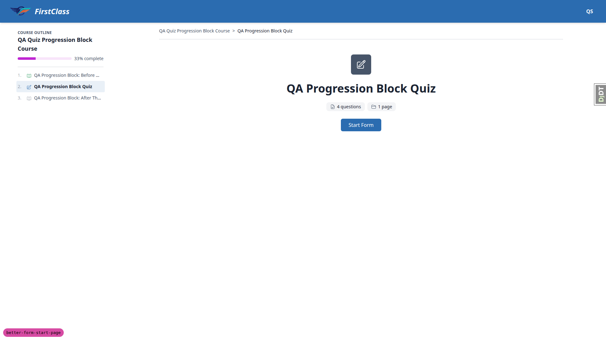

- **1.2-icons** — pass. Badge uses `c-icon name='form'`, the questions pill uses `notes` and the
  pages pill uses `course_part` — three distinct glyphs, so the duplicate-glyph failure mode the
  plan warns about does not occur.

- **1.3-pluralisation** — pass. Built a form with exactly one page and one question
  (`qa-single-question-course`). Pills read "1 question" and "1 page" — singular in both cases, so
  the pluralize filter is applied to both counts, not just one.

### §2 The returning learner — previous attempts still work

- **2.1** — pass. Returning learner after one deliberately-failed attempt. Previous attempts
  section renders below the card and is left-aligned (computed `text-align: left` on the section)
  while the card above stays centred. Row shows the date on the left and "0%" plus "(0 / 4)" on the
  right. Section keeps `aria-labelledby='previous-attempts-heading'` and the `h2` carries that id,
  so the heading association survived the restyle. CTA changed to "Try Again" and is still centred.

  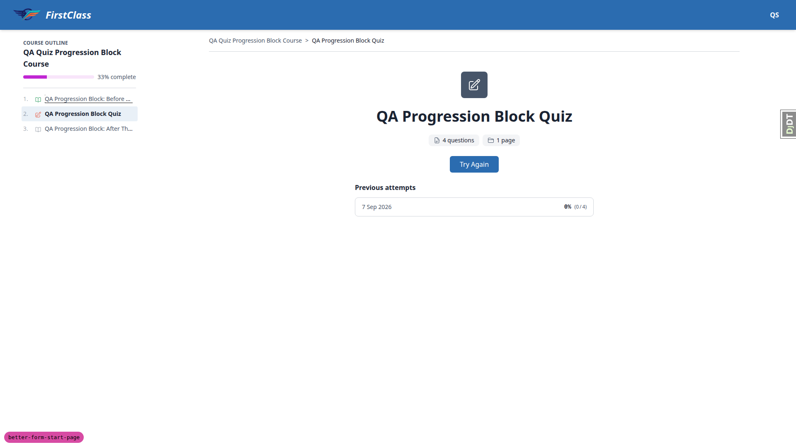

- **2.2-row-bg** — pass. Row background is the class `bg-surface` (was hardcoded `bg-white`).
  Computed to `rgb(255,255,255)` under the default theme, which is that theme's surface token — so
  it matches the page ground rather than fighting it. Token-vs-hardcode is confirmed for real in the
  `first_class` theme pass (5.2), where the same class must resolve to a different colour.

- **2.3-slice** — pass. Took six real attempts through the runner with deliberately varied scores.
  The list grows as attempts accumulate and, after the sixth, exactly five rows render — the oldest
  (0%) has dropped off, confirming the view's slice to 5. Rows read newest-first (25/25/25/75/50)
  and stay readable: date left, percentage and raw score right, consistent row height, no horizontal
  overflow (`scrollWidth == clientWidth`).

  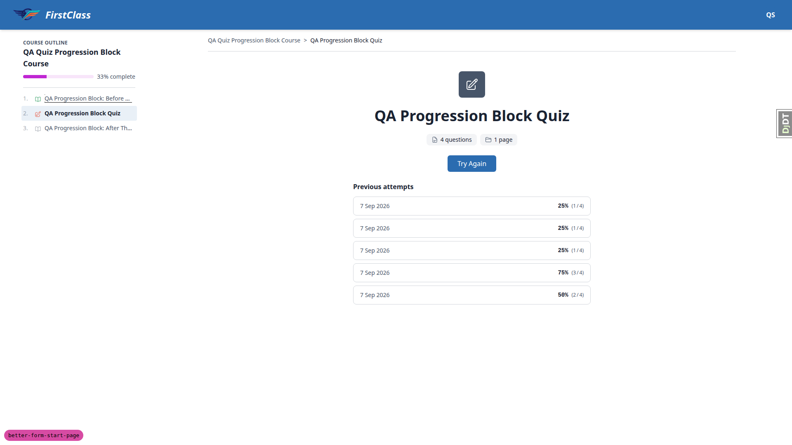

### §3 Every start-page state

- **3.1-no-attempts** — pass. Fresh learner with no attempts: CTA is "Start Form" and the
  previous-attempts section is absent from the DOM entirely (the partial's
  `` guard holds) — not an empty heading. Card does not look
  half-empty; the `space-y-6` stack collapses cleanly.

  

- **3.2-mid-attempt** — pass. Started the two-page survey, answered page 1, advanced to page 2, then
  left without submitting. Returning to the start page gives CTA "Continue Form"
  (`data-testid=continue-form-button`) pointing at `/courses/qa-free-text-survey-course/1/fill_form/2`.
  Clicking it lands on page 2 with the indicator reading "Page 2 of 2", so it resumes on the right
  page. Layout holds and no previous-attempts section shows for an unsubmitted attempt.

  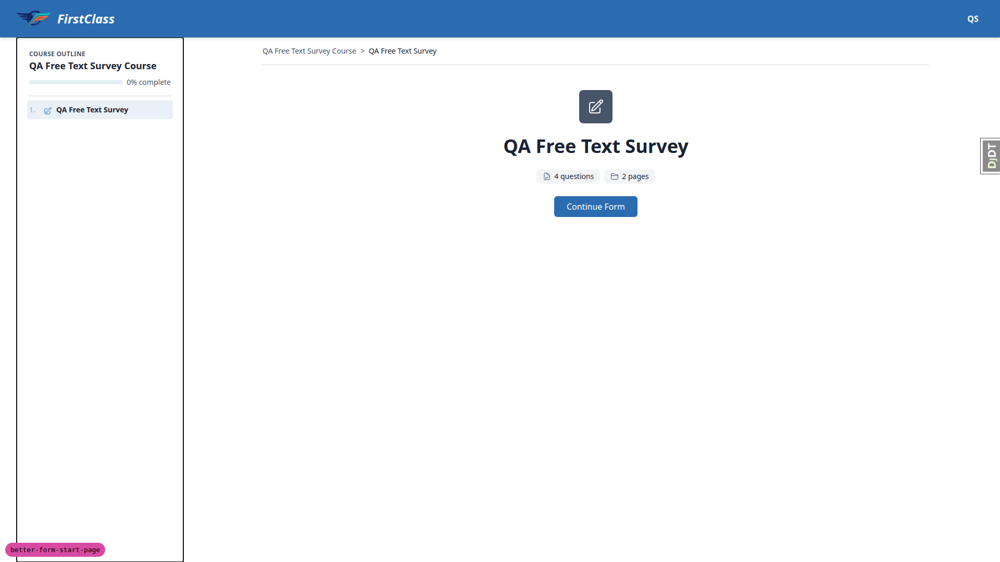

- **3.3-failed-quiz** — pass. Failed-quiz branch: CTA is "Try Again". Outline shows item 2 as "Needs
  retry" and item 3 as "Locked" with no link element at all. Hitting
  `/courses/qa-progression-block-course/3/` directly redirects to the course detail page, so the
  restyle did not weaken unlocking.

- **3.4-passed-quiz** — pass. Submitted all-correct answers: 100% (4/4). CTA becomes "Next" (href
  `/courses/qa-progression-block-course/3/`) and item 3 flips from Locked to "Not started" and
  becomes a link. Card stays centred with the five-row attempt list below it.

  

- **3.5-last-item** — pass. `qa-free-text-survey-course` has the form as its only item. After
  submitting, the CTA reads "Finish Course" (href `/courses/qa-free-text-survey-course/finish/`),
  single and centred. This also exercises the non-QUIZ branch of the attempts partial: the
  `CATEGORY_VALUE_SUM` strategy renders a green check plus "Completed" instead of a percentage,
  which is the intended else branch.

  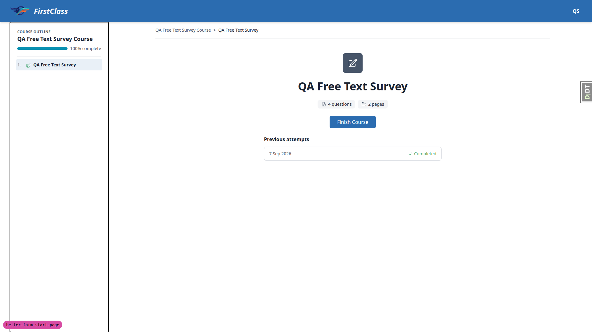

### §4 Real content, not lorem

- **4.1-long-content** — pass. Gave the form a 17-word title, a 139-character subtitle and rich
  intro markdown. The title wraps to 4 lines inside the 576px column with
  `scrollWidth == clientWidth` (no overflow). The eyebrow wraps to 3 lines and computes to
  uppercase, `ui-monospace`, 1.2px letter-spacing, muted — it does not push the page sideways. Page
  has no horizontal scrollbar (`documentElement scrollWidth` 1920 == `clientWidth` 1920). Heading,
  code block and the `ul`/`ol` elements themselves are left-aligned.

  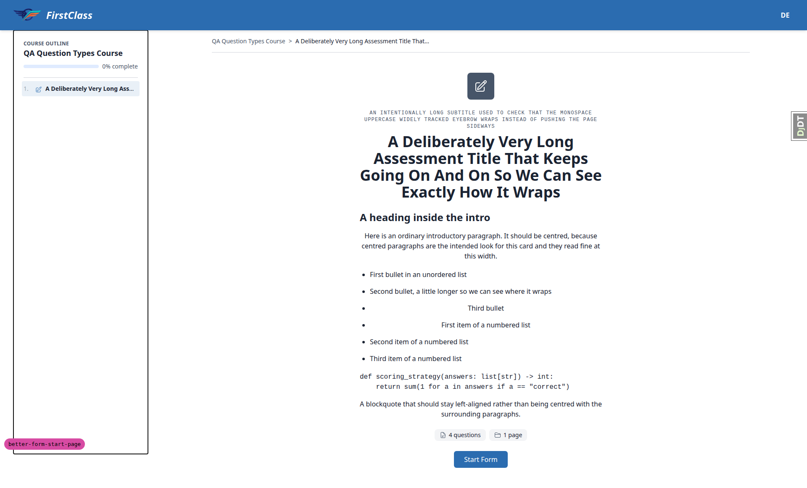

- **4.2-block-alignment** — **fail** (see bug B1). `course_form.html` applies `[&_p]:text-center` to
  `c-markdown-container`, a descendant selector, so it centres every `
` anywhere inside the
  authored intro, not just top-level paragraphs. Confirmed via `getComputedStyle`: the `
` inside
  `<blockquote>` computes `text-align:center`, and the `
` the markdown renderer emits inside loose
  `<li>` elements also computes center. Result: the blockquote body is centred, and list items
  rendered as loose (wrapped in `
`) are centred while tight ones are not — a single list appears
  half-centred and half-left. The `<ul>`/`<ol>`/`<li>`/`<pre>` elements themselves are correctly
  `text-align:left`; only their nested `
` children are wrong.

  

- **4.3-no-subtitle** — pass. Cleared the subtitle. The eyebrow `
` is absent from the DOM and the
  `space-y-2` wrapper's height collapses to exactly the `h1` height (160px == 160px), so there is no
  empty gap — the title moves up cleanly and the badge-to-title gap is the normal 24px of the
  `space-y-6` stack.

- **4.4-no-content** — pass. Cleared the form's markdown content. The card's direct children are
  exactly badge, title wrapper, pills row and CTA — the `c-markdown-container` is not emitted at
  all, so there is no stray empty container between the title and the pills. Horizontal overflow
  also disappears with the content removed, which confirms the 4.5 overflow comes from authored
  content rather than from the card layout itself.

- **4.5-overflow** — **fail** (see bug B2). Authored intro containing a long code line and an
  unbreakable URL makes the whole page scroll horizontally: `documentElement scrollWidth` 2018 vs
  `clientWidth` 1920. The `<pre>` computes `white-space:pre` with `overflow-x:visible` and a
  `scrollWidth` of 1162px inside a 576px column, so it spills out of the card and widens the
  document. The long URL paragraph also overflows (`scrollWidth` 784 in a 576px box,
  `overflow-wrap:normal`). `c-markdown-container` is only `space-y-4` and has never carried overflow
  handling, so the underlying weakness predates this change — but the old start page gave that
  container the full 1280px content column, where a 1162px code line still fitted. Narrowing to
  576px is what makes it reachable, and the plan explicitly requires no horizontal scrolling.

  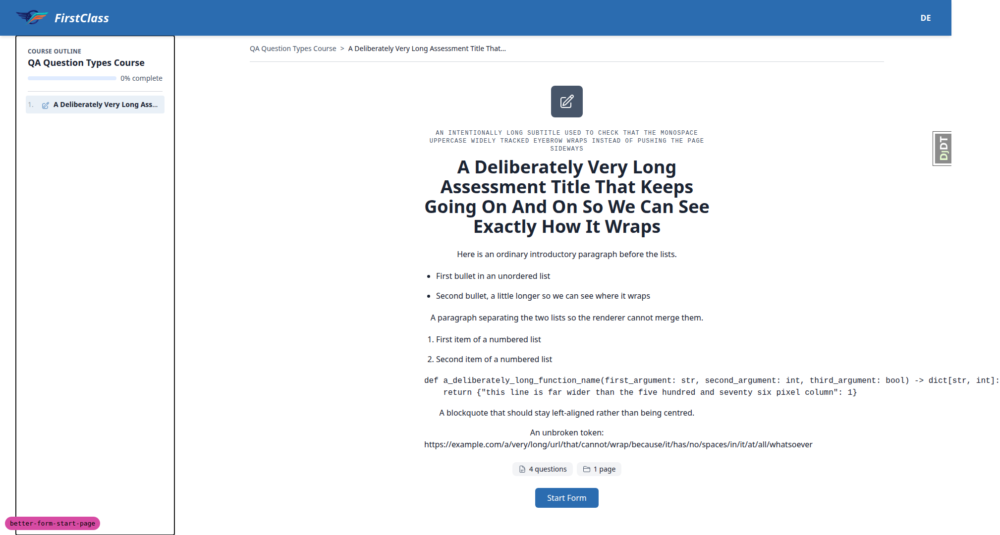

### §5 Both themes

- **5.1-first-class-theme** — pass. Rebuilt CSS and restarted the server under
  `FLS_THEME=first_class`. Every token followed the theme, with no value stranded from the default
  brand: badge fill `rgb(71,85,105)` slate -> `rgb(0,206,201)` teal; badge foreground white ->
  `rgb(26,26,46)` navy; badge radius 8px -> 12px; pill radius 8px -> 9999px; pill icon slate -> teal;
  button `rgb(43,108,176)` ocean -> `rgb(40,53,147)` indigo with radius 6px -> 8px; heading font
  `ui-sans-serif` -> Outfit and body -> DM Sans. Badge is a flat fill in both themes
  (`background-image none`, `box-shadow none`), so no gradient and no coloured glow. Card width
  stays 576px.

  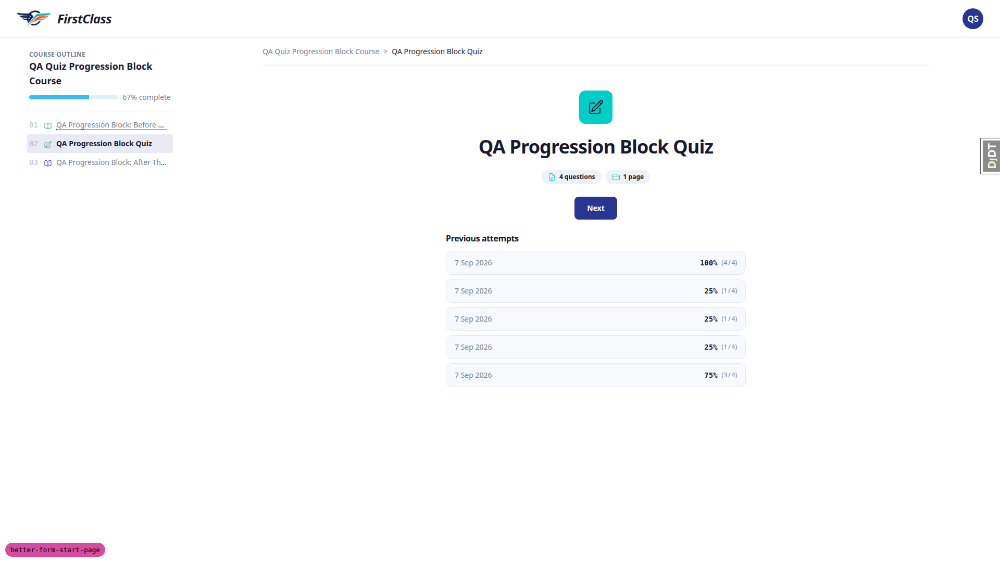

- **5.2-surface-token** — pass. This is the fix the plan singles out. The previous-attempt row
  background moved from `rgb(255,255,255)` under default to `rgb(248,249,252)` under `first_class`,
  and its border from `rgb(209,213,219)` to `rgb(226,232,240)`. A hardcoded `bg-white` would have
  stayed pure white; `bg-surface` tracks the theme, so the rows sit on the page ground instead of
  reading as a hard white block.

  

- **5.3-icon-contrast** — **fail** (see bug B3). The pill icon / pill background pair is mismatched
  under `first_class`. The icons carry `text-secondary` while `c-chip variant='muted'` supplies a
  near-white background, so under `first_class` a teal `rgb(0,206,201)` glyph sits on
  `rgb(237,242,247)`: a computed contrast ratio of 1.75:1, far below the 3:1 WCAG 1.4.11 threshold
  for non-text contrast, and the icons visibly wash out. The same pairing is fine under default
  because that theme's secondary is dark slate. The badge is the opposite and correct: its icon is
  `text-on-secondary` against `bg-secondary`, measuring 8.67:1 under `first_class`. Pill text
  (15.14:1) and button text (10.39:1) are both fine.

  

- **5.4-default-theme** — pass. Rebuilt and restarted under the default theme. Everything returned
  to the blue/slate brand: badge `rgb(71,85,105)` slate, button `rgb(43,108,176)` ocean blue, system
  font (`ui-sans-serif`), rows back to `rgb(255,255,255)`. Nothing carried over from `first_class`.
  Contrast under default is healthy on both pairs the plan names: badge icon vs badge fill 7.58:1
  and pill icon vs pill background 6.89:1, which is what makes the 1.75:1 `first_class` pill result a
  theme-specific defect rather than a general one.

  

### §6 Responsive

- **6.1-mobile-375** — pass. At 375x812 the card fills the width at 343px with an even 16px gutter
  each side. No horizontal scrollbar (`scrollWidth` 375 == `clientWidth` 375). Both pills sit on one
  row (122px + 91px + gap inside 343px) without squashing or overflowing; the row carries `flex-wrap`
  so longer labels would wrap rather than overflow. CTA is 83x40, fully inside the viewport and not
  clipped. The five attempt rows stay full-width and readable with date left and score right.

  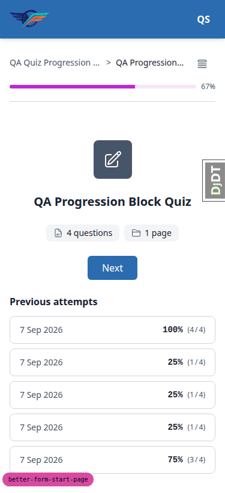

- **6.1b-mobile-nav** — pass. The course outline collapses behind a 44x48 toggle at this width.
  Tapping it opens the outline as a bottom sheet over a dimmed backdrop, with the progress bar and
  all three items listed and the current item highlighted. Touch targets in the drawer are
  full-width rows.

  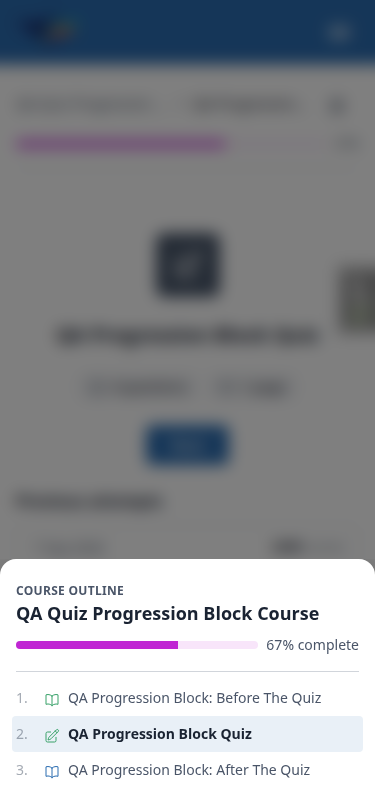

- **6.2-tablet-768** — pass. At 768x1024 the course outline is behind the toggle (the persistent
  `lg` sidebar is not in flow, measured width 0) and the card is still centred in the content area —
  card centre 384px against content-well centre 384px. Card holds its 576px width inside the 720px
  well, pills stay on one row, the attempt rows keep date-left/score-right and do not crowd. No
  horizontal scrollbar. Forms and the CTA render at a sensible width rather than stretching.

  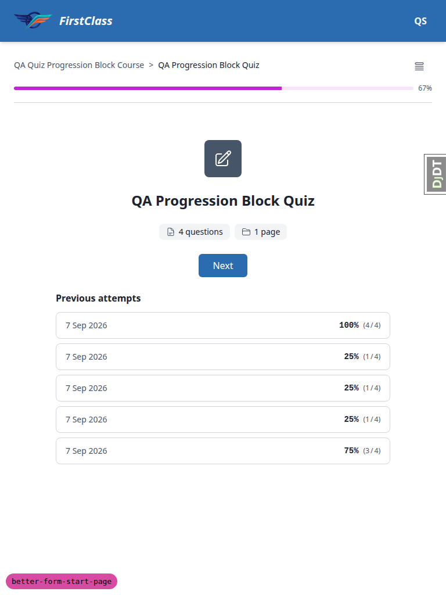

- **6.3-desktop-1440** — pass. At 1440x900 the card stays a narrow 576px column — it does not
  stretch to fill the 1008px content well, so the max-width survived. The course outline is a
  permanent 320px sidebar at this width (its toggle button is `lg:hidden`). Measured card centre
  904px against content-well centre 904px: the card re-centres in the space remaining beside the
  outline rather than centring to the full viewport, whose centre would be 720px. No horizontal
  scrollbar.

  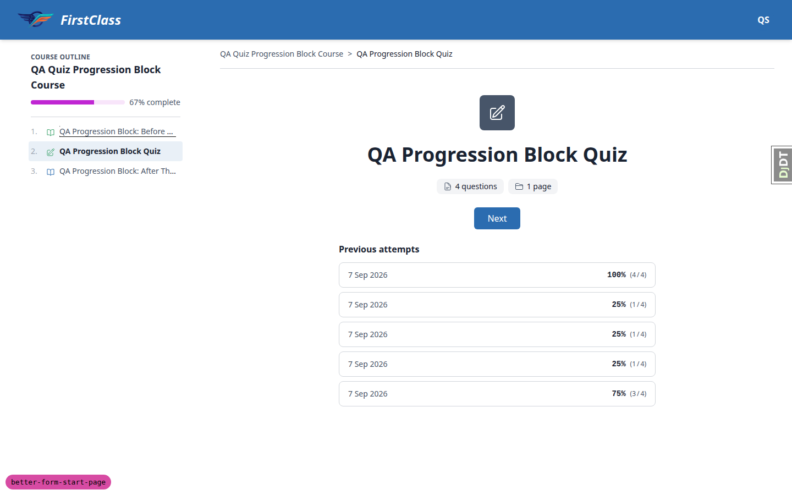

### §7 Navigation still behaves (HTMX)

- **7.1-htmx-boost** — pass. The CTA's boost ancestor carries `hx-boost=true`,
  `hx-target=#interface-main`, `hx-select=#interface-main`,
  `hx-swap='outerHTML show:window:top'`. Set a window-scoped marker before clicking "Next"; after
  navigation the marker was still present, which proves the swap happened in place rather than as a
  full document load (a full reload would have discarded it). URL updated to `/3/` and the outline
  highlight moved to item 3.

- **7.2-back-and-reload** — pass. Browser back returns to the start page fully rendered — badge SVG
  present, heading, both pills, CTA and all five attempt rows, card still measured at 576px. A
  direct reload of the same URL produces an identical page. No blank or half-rendered card, so the
  boost target/select pair is intact.

### §8 Failure and permission branches

- **8.1-unregistered** — pass. Hit a form start page for a course the logged-in learner is not
  registered for (`demodev_quizqa@email.com` against `qa-question-types-course`). The app redirects
  to `/courses/qa-question-types-course/detail/` and renders that page normally — no broken start
  page, no traceback, no 500. Used this learner/course pair rather than the plan's `demodev_s1`
  because `qa_create_course_player_learner` is not in the §0 seed list; it exercises the same
  registration-check branch.

- **8.2-logged-out** — pass. Signed out and requested the quiz start page directly. Redirected to
  `/accounts/login/?next=/courses/qa-progression-block-course/2/` — the normal login redirect with
  the `next` parameter preserved, not a stack trace.

- **8.3-locked-item** — pass. Locked following topic is not clickable in the outline and direct URL
  access redirects to `/courses/qa-progression-block-course/detail/` rather than rendering the item.

- **8.4-zero-counts** — pass. Built a form with zero pages and zero questions
  (`qa-empty-form-course`). The start page renders "0 questions" / "0 pages" without crashing,
  plurals correct, and the layout is not mangled — badge, title, pills and CTA stay centred in the
  576px column with the stack simply shorter.

  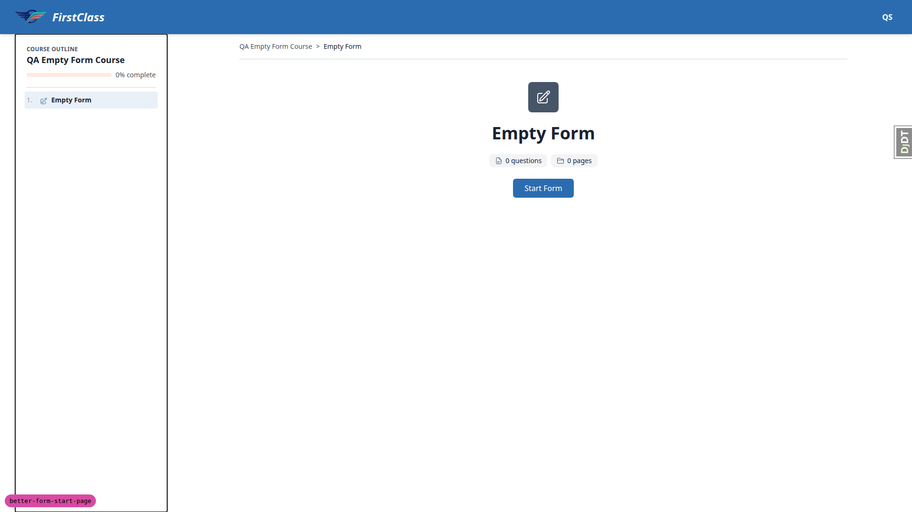

### §9 Accessibility spot-check

- **9.1-focus-ring** — pass. Tabbing from the top of the document reaches the primary CTA. It
  matches `:focus-visible` and paints a two-layer ring via `box-shadow` — white 2px then
  `rgb(43,108,176)` 4px — so the ring is clearly visible against the card. `outline` is suppressed
  in favour of that `box-shadow`, which is the project's normal pattern.

- **9.2-heading-association** — pass. The previous-attempts `<section>` keeps
  `aria-labelledby='previous-attempts-heading'` and the `h2` inside it still carries that exact id,
  so the heading is still programmatically associated with the section after the restyle.

- **9.3-decorative-badge** — **fail** (see bug B4). The new badge icon announces itself as
  meaningful content. `c-icon` renders through `freedom_ls/icons/backend.py`, which always emits
  `role='img'` `aria-label='<semantic name>'` and offers no decorative mode. The badge therefore
  announces "form, image" immediately before the `h1` that already names the form — exactly the
  redundancy the plan says to watch for. The badge is a new element introduced by this change, so
  the redundant announcement is new even though the icon component's always-labelled behaviour is
  pre-existing. Fixable in this template alone by putting `aria-hidden='true'` on the badge wrapper
  div.

- **9.4-zoom-200** — pass. Simulated 200% zoom by halving the 1920 viewport to 960 CSS px. The card
  reflows rather than clipping: it keeps its 576px max-width, sits fully inside the viewport (192px
  to 768px), the CTA is entirely within bounds, no attempt row is clipped past the right edge, and
  `scrollWidth` still equals `clientWidth`.

## Bugs

### B1 — Blockquote and loose list items are centred by the `[&_p]:text-center` descendant selector

Manifestations:
- `4.2-block-alignment` (desktop)

Screenshots:

**Expected:** Only top-level paragraphs of the authored intro are centred. Bullet lists, numbered
lists, code blocks and blockquotes stay left-aligned, per section 4 of the test plan.

**Actual:** `course_form.html` applies `[&_p]:text-center` to `c-markdown-container`. Being a
descendant selector it also matches `
` inside `<blockquote>` and `
` inside loose `<li>`
elements, so the blockquote body renders centred and any list item the markdown renderer wraps in
`
` renders centred. A single list ends up half-centred and half-left, which looks broken. The
child selector `[&>p]:text-center` would centre only top-level paragraphs.

### B2 — Long code blocks and unbreakable URLs in the intro make the page scroll horizontally

Manifestations:
- `4.5-overflow` (desktop)

Screenshots:

**Expected:** No horizontal scrolling on the start page whatever the authored intro contains, per
section 4 of the test plan.

**Actual:** With a long code line and an unbreakable URL in the intro, `documentElement scrollWidth`
reaches 2018px against a 1920px `clientWidth`. The `<pre>` is `white-space:pre` with
`overflow-x:visible` and a 1162px `scrollWidth` inside the 576px column, so it escapes the card and
widens the document; the long-URL paragraph overflows too (784px in a 576px box).
`c-markdown-container` is only `space-y-4` and has never had overflow handling, so the weakness
predates this change — but the old start page gave that container the full 1280px content column,
where the same code line still fitted. Narrowing to `max-w-xl` is what exposes it. Fixing it needs a
scope decision: constrain it locally in `course_form.html`, or give the shared
`c-markdown-container` proper overflow handling for every markdown surface.

### B3 — Pill icons wash out under the first_class theme (1.75:1 contrast)

Manifestations:
- `5.3-icon-contrast` (desktop)

Screenshots:

**Expected:** Every element stays legible in both themes; in particular the pill icon reads clearly
against the pill background, per section 5 of the test plan.

**Actual:** The fact-pill icons carry `text-secondary` while `c-chip variant=muted` gives them a
near-white background. Under `first_class` that is teal `rgb(0,206,201)` on `rgb(237,242,247)` — a
measured 1.75:1, well under the 3:1 WCAG 1.4.11 non-text minimum — and the icons visibly wash out.
Under default the same pairing measures 6.89:1 because that theme's secondary is dark slate, so the
bug only appears when the theme is swapped. The badge does it correctly with `text-on-secondary` on
`bg-secondary` (8.67:1 under `first_class`). Choosing the replacement colour is a visual design call.

### B4 — Decorative badge icon announces itself to screen readers

Manifestations:
- `9.3-decorative-badge` (desktop)

Screenshots: none captured for this bug.

**Expected:** The badge is purely decorative next to a title that already names the form, so it
should not announce itself as meaningful content, per section 9 of the test plan.

**Actual:** `c-icon` always renders `role=img` with an `aria-label` taken from the semantic name, so
the new badge announces "form, image" immediately before the `h1` that names the form. The badge
element is new in this change, so the redundant announcement is new even though the icon
component's always-labelled behaviour is pre-existing. It can be fixed in this template alone by
putting `aria-hidden=true` on the badge wrapper div.

## Bug status

- **FIXED** (commit: 04d1ae19) — B1 Blockquote and loose list items are centred by the `[&_p]:text-center` descendant selector
- **UNRESOLVED** — B2 Long code blocks and unbreakable URLs in the intro make the page scroll horizontally (reason: needs a scope decision — constrain it locally in `course_form.html` or give the shared `c-markdown-container` overflow handling for every markdown surface)
- **UNRESOLVED** — B3 Pill icons wash out under the first_class theme (1.75:1 contrast) (reason: choosing the replacement icon colour is a visual design decision)
- **FIXED** (commit: 28698e76) — B4 Decorative badge icon announces itself to screen readers

### Verification of the two fixes

Both fixes were made under TDD (failing test first) and each ran the full pytest suite green — 3375 passed for B1, 3376 passed for B4. Both were then re-driven in the browser against the running dev server:

- **B1** — with an intro containing a top-level paragraph, a loose list item and a blockquote, `getComputedStyle` now reports `text-align: center` for the container's direct-child `
` and `text-align: left` for the `
` nested inside `<li>` and inside `<blockquote>`. That is exactly the intended split.
  Note: the new `[&>p]:text-center` class only reaches the browser after `npm run tailwind_build`, because Tailwind generates arbitrary-variant classes by scanning template source at build time. The re-verification above was done after rebuilding. The built CSS is gitignored, so this is a build-step consequence rather than anything missing from the commit.
- **B4** — the badge wrapper now carries `aria-hidden="true"` while remaining visually present and still filled with the theme's secondary colour. The two fact-pill icons were deliberately left untouched.

Re-checking each fix after the other had landed confirmed neither regressed the other.

## General notes

These are observations from the run, not bugs, and are not counted against the change:

- The empty-form fixture's "Start Form" button leads to a 404 at
  `/courses/qa-empty-form-course/1/fill_form/1`. This is pre-existing view logic:
  `FormProgress.get_current_page_number()` returns 1 for a form with no pages, and
  `form_fill_page` then raises `Http404` because `page_number` (1) > `total_pages` (0). No Python
  changed in this diff, so it is not a regression from this work — but a zero-page form is currently
  unstartable.
- `c-markdown-container` is only `space-y-4` and carries no overflow handling anywhere in the app;
  bug B2 is where that first becomes visible.
- `c-icon` always emits `role="img"` with an `aria-label` from the semantic name and has no
  decorative mode, so every icon in the app announces itself. The pill icons announce "notes" and
  "course_part" ("course_part" leaking an internal slug), but the deleted meta-grid partial used
  those same two icon names, so that part is not a regression.
- Two markdown lists written back-to-back with only a blank line between them get merged into a
  single `<ul>` by the markdown renderer. Separating them with a paragraph produces a correct
  `<ol>`. This is markdown-renderer behaviour upstream of this template, unrelated to this diff.
- The dev database for this worktree was empty at the start of the run and had to be seeded from
  scratch (`create_demo_data` plus the plan's §0 fixtures). The `DemoDev` Site's domain was
  repointed from `127.0.0.1:8000` to `127.0.0.1:8229` so host-based site resolution would work on
  the run's port.
- Two edge-case fixtures were built for this run because no existing fixture covered them:
  `qa-single-question-course` (1 page, 1 question) and `qa-empty-form-course` (0 pages, 0
  questions). They are seeded by a new reusable command `qa_create_form_count_edge_cases`.

---

status: ok · reason: 4 bugs — 2 fixed (B1, B4) and re-verified in the browser, 2 unresolved (B2, B3) pending decisions; report rendered, 17 screenshots verified
