# Frontend QA report: better-learner-dashboard-course-display

Manual QA pass on branch `better-learner-dashboard-course-display`, run 2026-09-09. 48 checks were
recorded against the test plan in `3. frontend_qa.md`. Every check passed. No bugs were found.

## Methodology

The pass was driven manually through the Playwright MCP against a dev server on port 8973, running
against the DemoDev site. Screenshots were collected into `screenshots/` beside this report; every
image referenced below exists there. Nothing aborted during the run, so every step of the test plan
executed — desktop, mobile and tablet passes all ran to completion.

## Diff scoping

The scoping gate classified the change as **FULL**, triggered by these changed files:

- `freedom_ls/learner_interface/templates/learner_interface/dashboard.html`
- `freedom_ls/learner_interface/templates/cotton/course-section-pagination.html`
- `freedom_ls/learner_interface/templates/learner_interface/partials/course_list.html`
- `freedom_ls/learner_interface/static/learner_interface/js/alpine-components.js`
- `freedom_ls/learner_interface/views.py`
- `freedom_ls/learner_interface/dashboard_sections.py`
- `freedom_ls/content_engine/models/courses.py`
- `freedom_ls/content_engine/admin.py`
- `freedom_ls/content_engine/validate.py`
- `freedom_ls/educator_interface/views.py`
- `demo_content/course_categories.yaml`

Templates, static JS and CSS all changed, so nothing was in-scope to skip. Desktop, mobile and
tablet passes all ran: nothing was omitted from the plan.

## Smoke gate

The smoke gate passed. Pages checked: `http://127.0.0.1:8973/` and
`http://127.0.0.1:8973/courses/functionality-demo-show-end-with-topic/detail/`.

## Results by plan section

### 0. Setup

Seeding ran clean: `migrate`, `content_save ./demo_content DemoDev`, then
`qa_create_rich_dashboard_learner`. `git status` was clean afterwards — the demo declaration's
uuids were not rewritten by the content load.

### 1. Anonymous home page

Anonymous visitor: hero, then Start here (description "New to the platform? Begin with these.",
holding show-end-with-Topic and Standard Markdown), Assessment (show-end-with-Quiz), Available
courses (Content Widgets then Course Parts, alphabetical, with a Browse all courses link). No
Reference section, no Coming soon, no In progress, no Learning history. Content Widgets carries no
Coming soon chip, because the visibility override is on. Every heading is sentence case; nothing on
the page reads in title case. Every section shows position text plus both arrows, greyed on
single-page sections. Each of the five courses appears exactly once, and show-end-with-Topic sits
under Start here, not Assessment.

### 2. Signed-in learner with a course in progress

Signed in as `demodev_s1`: greeting, then In progress (show-end-with-Topic, 43% bar, "Next up:
Pictures"), Start here (Standard Markdown only), Recommended courses (Content Widgets), Available
courses (Course Parts only), Learning history (show-end-with-Quiz). Assessment is absent, as
expected, because its only course is completed. The wrapper ids `#current-courses`,
`#recommended-courses`, `#available-courses` and `#learning-history` are all present. No title-case
heading anywhere on the page.

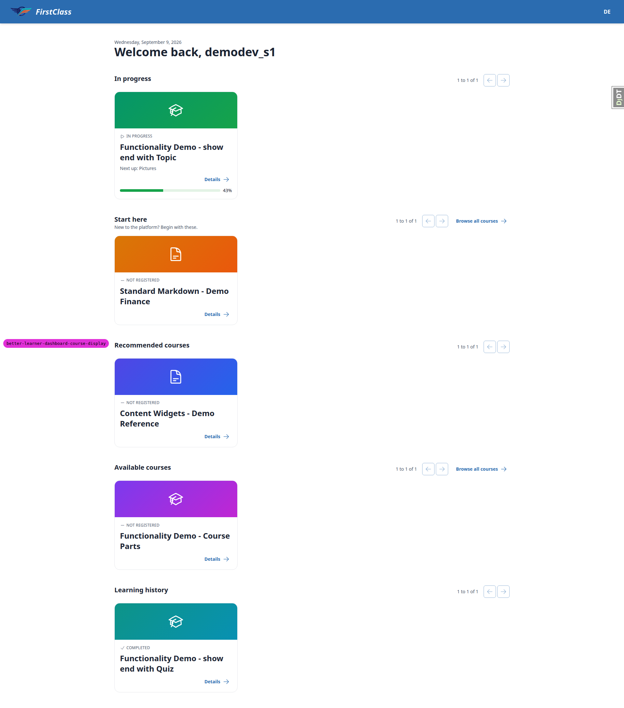

### 3. Nothing in progress

Signed in as `demodev_history`: sections run Start here, Assessment, Available courses, In
progress, Learning history. In progress has moved below the discovery sections and renders its
empty copy, "No courses in progress — everything you're signed up for is finished and waiting in
your Learning History below." Learning history lists most recently completed first: Pagination B (1
day ago), Standard Markdown (2 days), Pagination A (6 days). This learner's fixture completes four
courses rather than the two the plan describes, so Learning history reads "1 to 3 of 4" and pages —
a deviation from the plan's stated seed, not a defect (see General notes).

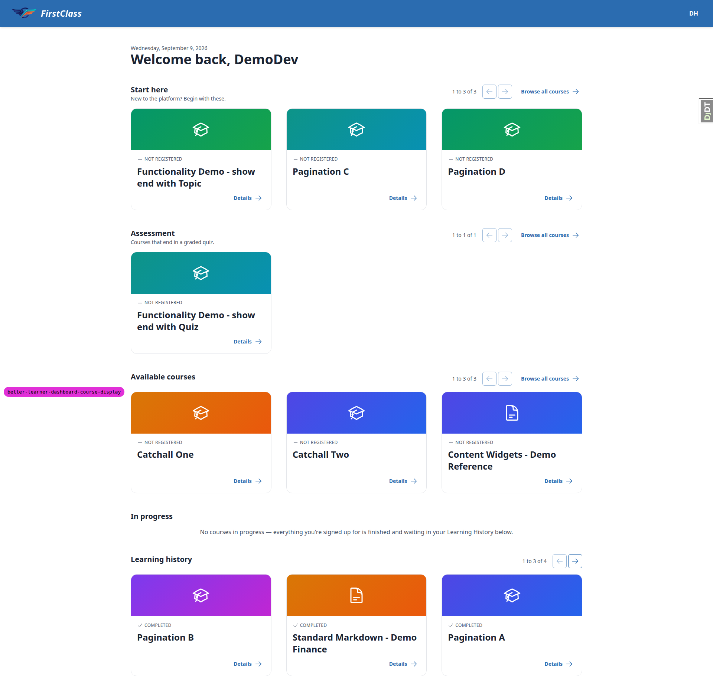

Signed in as `demodev_empty` (no registrations): same layout — Start here, Assessment, Available
courses, then In progress reading "You haven't signed up for any courses yet." No Learning history
section at all.

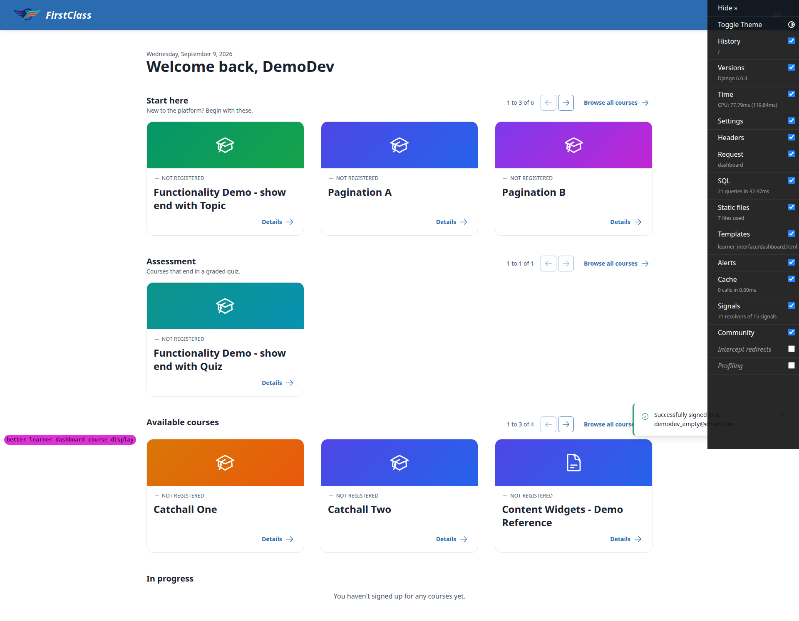

### 4. Paging with the mouse

Seed A in place, anonymous. Start here reads "1 to 3 of 6" with show-end-with-Topic, Pagination A,
Pagination B; previous greyed, next live. Clicking next swaps to Pagination C/D and Standard
Markdown, "4 to 6 of 6", previous live, next greyed — with no page reload: the `<h2>` node kept a
data attribute set before the click and its bounding rect was byte-identical afterwards, so the
heading neither moved nor flickered. The address bar stayed at `/` with no query string, and
pressing browser Back left the paged state entirely rather than stepping back through section
pages. Previous returns page one. A dispatched click on the greyed previous arrow fired zero htmx
requests and changed nothing — Playwright itself refuses the click, since `aria-disabled` makes it
"not enabled". Assessment and Available courses were untouched throughout.

### 5. Paging without JavaScript, and by URL

The live next arrow's href on Start here is exactly `/?page_start-here=2`; opening it renders a
complete dashboard with Start here on page two and every other section on page one.

With JavaScript disabled in the Playwright context, clicking next on Start here does a full page
load to `/?page_start-here=2` and shows page two (Pagination C, Pagination D, Standard Markdown);
other sections stay on page one. Progressive enhancement holds.

All five probe URLs return HTTP 200 with a sensible page: `?page_start-here=abc` / `=0` / `=-1` all
give page one ("1 to 3 of 6"); `=9999` clamps to the last page ("4 to 6 of 6"); `?page_nonsense=3`
is ignored and every section shows page one.

On `/?page_start-here=2&utm_source=qa`, the Available courses next arrow is
`/?page_start-here=2&utm_source=qa&page_available=2` — it keeps the other section's page state and
the unrelated query parameter. The Start here previous arrow is `/?utm_source=qa` — it keeps
`utm_source` and drops `page_start-here` entirely because the target is page one. `href` and
`hx-get` agree on both. Two extra uncategorised courses (Catchall One and Catchall Two) were seeded
so that Available courses paged at all; with the plan's seed alone that section holds two courses
and has no live arrow to inspect.

### 6. In progress order and paging

Signed in as `demodev_paging` (Seed B): In progress is the first section and reads "1 to 3 of 6".
Page one is Pagination C (started, most recently accessed), Pagination A (started earlier), then
Pagination B; page two is Pagination D, show-end-with-Topic, Standard Markdown. Every card carries a
progress bar, and started courses come before unstarted ones. The plan's own wording for the
unstarted block ("alphabetically first") does not match spec line 522 ("registrations with no
progress, newest registration first; slug as the tie-breaker") — the render matches the spec, not
the plan's prose; see General notes.

Opening Pagination C, viewing its content and returning to `/` leaves Pagination C first. Signing
out and back in gives an identical In progress order on both visits.

### 7. Recommended courses and Learning history paging

With Seed E's four `RecommendedCourse` rows, `demodev_s1`'s Recommended courses reads "1 to 3 of 5"
(Content Widgets, Pagination D, Pagination C — newest recommendation first), and next shows the
remaining two ("4 to 5 of 5"). Start here for this learner holds only Standard Markdown: the four
Pagination courses have left the discovery pool because they are recommended.

`demodev_history`'s Learning history reads "1 to 3 of 4" and pages to a second page holding Course
Parts, most recently completed first throughout. The plan's stated seed (two completions) would
give "1 to 2 of 2" with both arrows greyed; the fixture completes four courses instead, so the
section pages — which is what the plan's own second sentence describes, reached without the helper
adding anything.

### 8. Keyboard, focus and screen-reader text

Both branches of the focus handler were confirmed. Live branch: with Start here grown to nine
courses (three pages), focusing the next arrow and pressing Enter swaps to "4 to 6 of 9" and leaves
focus on the next arrow of Start here itself, still live with no `aria-disabled`. Fallback branch:
on a two-page section the same keypress lands on the last page where next becomes disabled, and
focus goes to the "Start here" `<h2>` instead. In both cases `scrollY` stayed 0, so focus never
dropped to the top of the page, and the live region tracked the swap.

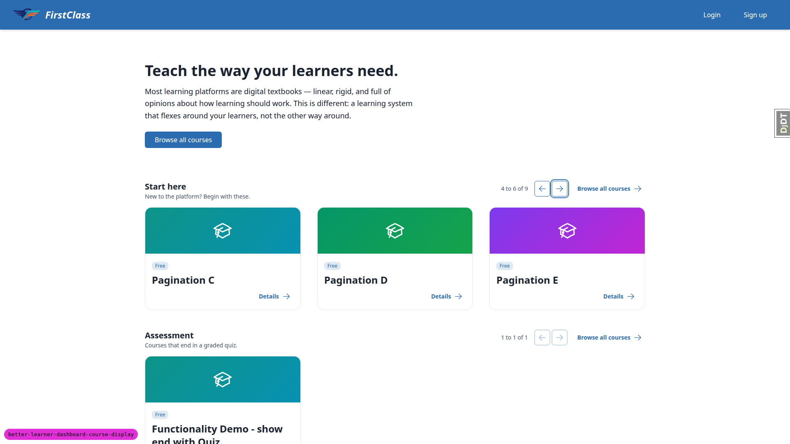

Focusing previous on page two and pressing Enter returns page one, and focus lands on the "Start
here" `<h2>`, since previous is now greyed and unfocusable. `scrollY` stayed 0.

`#dashboard-section-status` carries `role="status"` and `aria-atomic="true"`, reads "Start here:
showing 4 to 6 of 6" after the swap, and there is exactly one such element on the page.

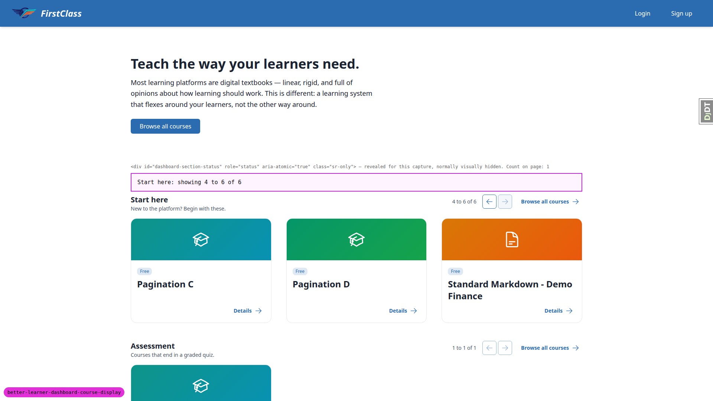

Each section's arrows sit in a `<nav>` labelled for that section — "Start here pages", "Assessment
pages", "Available courses pages" — all unique. Greyed arrows carry `aria-disabled="true"`,
`tabindex="-1"` and no `href`, and carry no `disabled` attribute. Live arrows carry `href` and a
matching `hx-get`.

For all three sections the `<h2>` sits outside its `section-page-<slug>` swap element, so the
heading survives the swap.

At 375px wide, `scrollWidth` equals `clientWidth` (zero horizontal overflow), no element extends
past the viewport, the heading row wraps so the controls sit below the heading, and the position
text stays visible. At an emulated 200% zoom the page still reports zero horizontal overflow with
every arrow and position readout laid out and reachable:

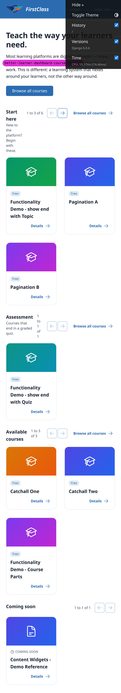

At 375×812, one card renders per row; every section's cards, eyebrows and Details links render
cleanly; tapping next on Start here swaps to "4 to 6 of 6" with no horizontal overflow introduced.
Arrow hit targets measure 38×38 CSS px — above the WCAG 2.5.8 AA minimum of 24×24, below the
44×44 AAA/mobile-platform guideline. On the three sections that also carry a Browse all courses
link, the position text wraps onto two lines; Coming soon, which has no such link, keeps it on one
line (cosmetic, see General notes).

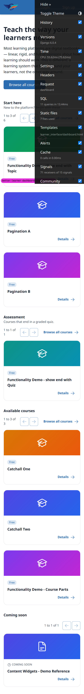

At 768×1024, two cards render per row, zero horizontal overflow, no offscreen elements, the desktop
nav renders, and every section keeps its controls on the same row as its heading with the position
text on one line. Clicking next on Start here pages to "4 to 6 of 6" as on desktop.

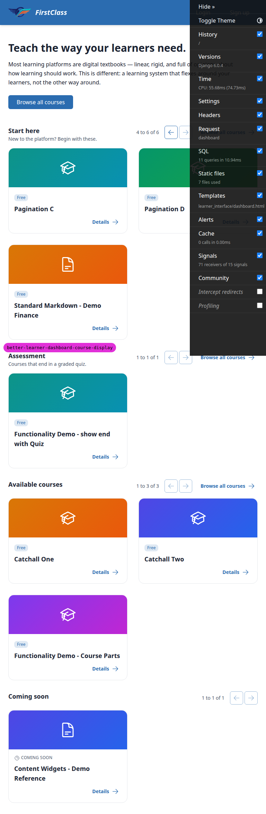

### 9. Content authoring round trips

| Check | Result | Notes |
| --- | --- | --- |
| 9.1 Title edit keeps slug and section | Pass | Renaming start-here's title to "Begin here" and reloading content renames the section heading; wrapper id stays `#category-start-here` with the same three courses. `git status` stayed clean and the yaml on disk was identical apart from the one edited line. |
| 9.2 Reordering the list reorders the sections | Pass | Moving the `assessment` entry above `start-here` renders Assessment first for an anonymous visitor. For `demodev_s1`, Recommended sits immediately after the first rendered category section (Begin here), because Assessment does not render for this learner at all — its only course is completed. This matches spec line 464, not the plan's own wording (see General notes). |
| 9.3 Turning a section off | Pass | `show_on_dashboard: false` on assessment removes the Assessment section entirely; show-end-with-Quiz appears in Available courses in alphabetical position (page two); show-end-with-Topic stays under Start here, so belonging to the hidden category has no effect. |
| 9.4 First load writes uuids | Pass | A first load into a site without these slugs writes one uuid per entry, and repeated saves on a file that already carries its uuids leave it byte-identical (md5 stable across two consecutive saves). The plan's "other lines are untouched" does not hold literally — the writer round-trips the document through `yaml.safe_load`/`yaml.dump`, re-serialising it (keys alphabetised, `content_type` moved, leading `---` dropped, indentation changed). This is recorded on todo.md as adjudicated and closed won't-fix (see General notes). Separately, the plan's literal step (delete the uuids, reload into DemoDev) is refused by the taken-slug guard with an actionable message naming the owning uuid, before writing. |
| 9.5 Unknown slug | Pass | `content_validate` exits 1 on `assesment`. The message names the course file, quotes the value, says `Field: categories[0]`, lists `assessment`/`reference`/`start-here` under the repo's `course_categories.yaml` path, and offers "Fix the slug, or add an entry declaring it in course_categories.yaml." |
| 9.6 Retired key | Pass | Retired `category:` key rejected: "'category' is no longer a course field. Use 'categories' (a list of category slugs), and 'dashboard_category' when there is more than one." |
| 9.7 Two categories, no dashboard key | Pass | Removing `dashboard_category` from a two-category course fails with "dashboard_category is required" and `Candidates: assessment, start-here`. |
| 9.8 Dashboard key outside the course's list | Pass | `dashboard_category: reference` on a start-here/assessment course fails: "the dashboard category has to be one the course belongs to". |
| 9.9 Duplicate/reserved/bad slug, second declaration | Pass | Duplicate slug names `reference` (and the shared uuid); reserved slug names `available` and lists the five reserved slugs; bad slug names "Not A Slug!" and the allowed characters; a second declaration file names both file paths. |
| 9.10 Category file inside a course directory | Pass | `content_validate` fails naming the file and saying "Move it to the repo root." |
| 9.11 Several errors at once | Pass | 9.5 + 9.6 + 9.7 combined produce all three messages in one run, header "Validation failed for 3 file(s)", exit 1. |
| 9.12 Restore real content | Pass | `content_save ./demo_content DemoDev` restores the real content after the §9 experiments; `git status` shows `demo_content` clean. |

### 10. Django admin

Course categories changelist shows the three demo rows with Title, Slug, Order and Show on
dashboard columns (start-here 0 yes, assessment 1 yes, reference 2 no) and carries no Add course
category button. The Start here change page renders Slug as a read-only display and leaves Title,
Subtitle, Description, Order and Show on dashboard editable; there is no Delete button.

Saving the title as "Start here (edited)" in admin changes the dashboard heading immediately;
running `content_save ./demo_content DemoDev` restores "Start here" — the file wins over the admin
edit.

On the Course change page, beside Visibility: show-end-with-Topic reads Dashboard category "Start
here" and Categories "Start here, Assessment"; Course Parts reads "Reference" and "Reference";
Content Widgets shows both empty ("-"). All are read-only displays with no editable control, and no
field labelled "Category" exists on any of the three pages.

### 11. Course detail page and educator panel

Course detail hero chip (`data-testid="course-category-chip"`): show-end-with-Topic renders exactly
one chip reading "Start here" and never "Assessment"; Course Parts renders "Reference", so a
category with `show_on_dashboard` false still names the course's placement here; Content Widgets
renders no chip at all, and the hero title simply sits where the chip's own box would have been,
with nothing else displaced.

The educator course page for show-end-with-Topic shows "Dashboard Category: Start here" in the
Details panel. The word "Category" occurs exactly once on the page, so the old row labelled plain
"Category" is gone.

### 12. Catalogue and other pages did not move

`/courses/` lists all eleven courses alphabetically by title. Every Browse all courses link on the
dashboard — on both category sections and on Available courses — points at `/courses/`. Card
targets by status: the in-progress card resumes at `/courses/functionality-demo-show-end-with-topic/4/`,
the completed card opens `/courses/functionality-demo-show-end-with-quiz/finish/`, and every
discovery card (category, recommended and available alike) opens `/detail/`.

The educator course page for show-end-with-Topic carries two tables, and both were seeded past the
DataTable base page size of 5 so that both paginators actually render. Cohort Registrations holds 8
rows and Direct Registrations 8. Page one shows cohorts Cohort 2025.04.06 and QA Course Reg Cohort
01–04, and direct rows demodev_paging, demodev_s1 and QA DirectReg 01–03. Page two shows cohorts 05,
06 and QA Pagination Cohort, and direct rows QA DirectReg 04–06. Both tables page correctly, and the
dashboard's `page_<slug>` scheme does not disturb either. The educator courses list separately pages
across three pages with its own `?page=` links.

The two tables do not page independently: they share a single `?page=` parameter, so moving one moves
both. That is pre-existing `panel_framework` behaviour rather than anything this branch changed — see
General notes.

Page two of the educator course page, with both tables on their second page:

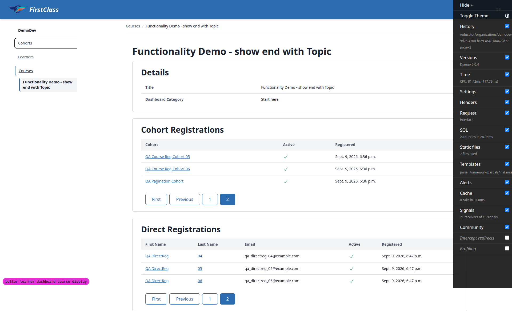

### 13. Coming soon, with the visibility override off

With `OVERRIDE_COURSE_VISIBILITY_TO_VISIBLE = False`, the anonymous dashboard runs Start here,
Assessment, Available courses, Coming soon. Coming soon holds Content Widgets with its COMING SOON
eyebrow; Available courses drops it and shows Catchall One, Catchall Two, Course Parts. Coming soon
carries position text "1 to 1 of 1" with both arrows greyed, like every other section, and its card
links to the Content Widgets detail page. A page-wide duplicate scan found no course card rendered
twice.

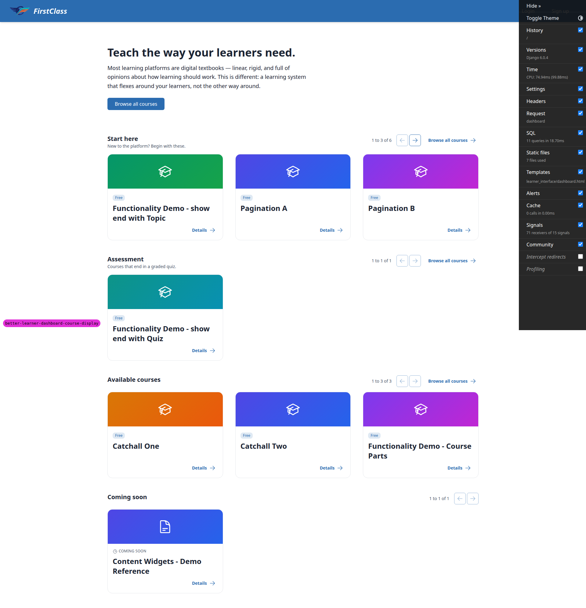

With `dashboard_category` set to start-here and that category added to its categories m2m, Content
Widgets still renders under Coming soon and nowhere else: Start here holds exactly its usual six
courses across both pages, and a page-wide duplicate scan is empty. Coming soon wins over a
category, as the spec's split rule requires. Reverted afterwards by `content_save`, since the
course's frontmatter declares no categories.

`demodev_s1` with the override off: Content Widgets sits under Recommended courses and there is no
Coming soon section at all, because a recommended course leaves the discovery pool. `demodev_history`:
sections run Start here, Assessment, Available courses, Coming soon, In progress, Learning history —
In progress sits between Coming soon and Learning history.

`config/settings_dev.py` was restored to `OVERRIDE_COURSE_VISIBILITY_TO_VISIBLE = True` and
`git status` shows no change to it. `OVERRIDE_COURSE_ACCESS_TO_FREE` was left alone throughout. The
file arrived at this run already modified — both overrides were False, left behind by an earlier
run — and was reset to the committed state before testing began (see General notes).

### 14. Second site

The dev database already carries a second site, Bloom, with its own start-here `CourseCategory`
(distinct uuid from DemoDev's) and one course, Bloom Only Course. The DemoDev dashboard and the
DemoDev catalogue mention Bloom nowhere and carry no link to `bloom-only-course`. Pointing the dev
server at the second site (via `settings_dev` `FORCE_SITE_NAME`, restored afterwards, since that
setting — not the port — is what selects the site here) renders only Bloom's own Start here section
holding only Bloom Only Course, with no Assessment or Reference section and no DemoDev course
anywhere.

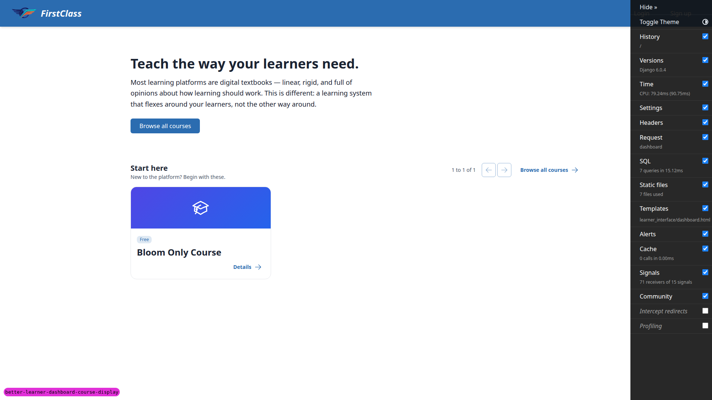

### Additional checks

Two checks ran outside the plan's numbered sections.

`nav-label-uniqueness`: on the busiest signed-in dashboard the section `<nav>` labels (Start here
pages, Assessment pages, Available courses pages, Learning history pages) are all distinct, every
`h2` id is unique, and each rendered section has exactly one matching `section-page-<slug>` swap
element. The empty In progress section has a heading but no swap element, which is correct — it
renders the empty-state partial.

`console-health`: a run over the dashboard, two htmx section swaps, a course detail page and the
catalogue produced no console errors, no warnings and no uncaught page errors. No page in the run
returned a 500 or a 404.

## Bug status

No bugs were found this run. All 48 recorded checks passed.

## General notes

#### Test-plan wording that disagrees with the spec

Three places where the render is right and the plan's prose is not, all verified against
`1. spec.md`. (a) The plan's §6.2 says the unstarted block of In progress is ordered
"alphabetically"; spec line 522 specifies "registrations with no progress, newest registration
first; slug as the tie-breaker", which is what renders. (b) The plan's §9.2 expects Recommended
courses between Assessment and the next category; spec line 464 places it after "the first rendered
category section", and for `demodev_s1` Assessment does not render at all. (c) The plan's §9.4 says
a uuid write-back leaves "the other lines untouched"; it re-serialises the document. Worth
correcting in `3. frontend_qa.md` before the next run so these do not read as regressions.

#### Fixture drift from the plan's §0

The plan's §0 describes Seed C as a learner with two completed courses, and §7.2 expects Learning
history to read "1 to 2 of 2" with both arrows greyed. The committed fixture command
`qa_create_dashboard_paging_fixtures` completes four courses for that persona, so Learning history
reads "1 to 3 of 4" and pages. The paging behaviour is correct and is what §7.2's own second
sentence asks for; only the stated counts are stale.

#### Coverage gaps the plan's seed cannot reach on its own

Three scenarios needed data beyond §0 and were seeded during the run rather than skipped. (1)
Available courses holds two courses under the plan's seed, so it never pages and §5.4's
cross-section page-state check has no live arrow to inspect — two uncategorised courses, Catchall
One and Catchall Two, were added. (2) Every section is exactly two pages at `SECTION_PAGE_SIZE` 3,
so §8.1's primary assertion (focus stays on the pressed arrow) is unreachable; Pagination E, F and G
were added to take Start here to nine courses and three pages. (3) No cohort on DemoDev had course
registrations, so §12.4's cohort table never paged — eight cohort registrations were added against a
page size of 5, and the Direct Registrations table on the same page had only 2 rows, so six neutral
fixture learners with individual registrations were added to take it to 8. Consider folding all four
into the fixture command so the next run needs no ad-hoc seeding.

One detail for anyone asserting on row order in that table later: `CourseLearnerRegistrationDataTable`
orders by the learner's first and last name, not by email, so the fixture learners share the first
name "QA DirectReg" and carry zero-padded last names 01–06.

#### Pre-existing: educator panel tables share one page parameter

With both tables on the educator course page seeded past their page size, `?page=2` moves Cohort
Registrations and Direct Registrations to their second page together. `DataTable` reads a bare
`request.GET.get("page")` (`freedom_ls/panel_framework/tables.py:58`), so every paginated table on a
page answers to the same parameter and they cannot be paged independently. `panel_framework` is not
in this branch's diff, so this is pre-existing behaviour and not a regression — but it is worth
recording, because it is precisely the collision the new dashboard work avoids by giving each section
its own `page_<slug>` parameter. The educator panels could adopt the same approach if anyone wants
those tables to page separately.

#### Cosmetic: the heading-row control cluster

On a wide desktop the position text and arrows sit hard right of a large empty area, and they do not
line up vertically between sections: a section carrying "Browse all courses" ends further left than
one without it, so the arrows step left and right down the page. At 375px the same asymmetry makes
the position text wrap onto two lines ("1 to 3 of" / "6") on every section that has the Browse-all
link, while Coming soon, which has none, keeps it on one line. Legible and within the plan's §8.6
requirements either way; noted as polish, not filed.

#### Arrow hit-target size

The pagination arrows measure 38×38 CSS pixels. That clears the WCAG 2.5.8 AA minimum of 24×24
comfortably and falls short of the 44×44 AAA/mobile-platform guideline. Flagged for awareness only;
the plan sets no target-size threshold.

#### Spec nuance: Browse all courses on category sections

Spec line 130 attributes the Browse all courses link to the catch-all specifically, and the
section-order table at line 470 repeats it only against Available courses. In the implementation
`_category_section` also sets `browse_all_url` (`views.py:373`), so every category section carries
the link too. The plan's §12.2 explicitly expects it on a category section and both links land on
`/courses/`, so this is intended — but the spec text names only the catch-all and could be
tightened.

#### Working-tree residue this run did not create

`config/settings_dev.py` arrived already modified, with both
`OVERRIDE_COURSE_VISIBILITY_TO_VISIBLE` and `OVERRIDE_COURSE_ACCESS_TO_FREE` set to False — left
behind by an earlier run that did not restore them. It was reset to the committed state before
testing and is clean again now. Separately, the qa-data-helper agent left four new untracked
management commands behind: `qa_create_catchall_courses.py`,
`qa_create_course_cohort_registrations.py`, `qa_extend_start_here_section.py` and
`qa_create_direct_course_registrations.py`, all under
`freedom_ls/qa_helpers/management/commands/`, plus several files under
`.claude/agent-memory/fls-dev-qa-data-helper/`. The four commands are idempotent and are what the
"coverage gaps" note above suggests folding into the main fixture. They are outside this QA commit
and are the user's to keep or discard.

#### Already-adjudicated behaviour, deliberately not re-filed

The YAML round-trip observed under §9.4 — `update_file_with_category_uuids` re-serialising the whole
document — is recorded on `todo.md` line 54 as "QA bug B2 (whole-file YAML reformat on uuid write)
is cosmetic, not a bug, closed as won't-fix". The taken-slug case observed alongside it is recorded
on line 55, where the decision was to refuse with an authoring error; the run confirmed that error
now fires with the owning uuid named, in place of the raw `IntegrityError`. Neither is re-filed.

#### Page health

A pass over the dashboard, two htmx section swaps, a course detail page and the catalogue produced
no console errors, no warnings and no uncaught page errors. No page in the run returned a 500 or a
404.

---

status: ok · reason: 48 checks reported across all 15 plan sections, 0 bugs, 13 screenshots verified
