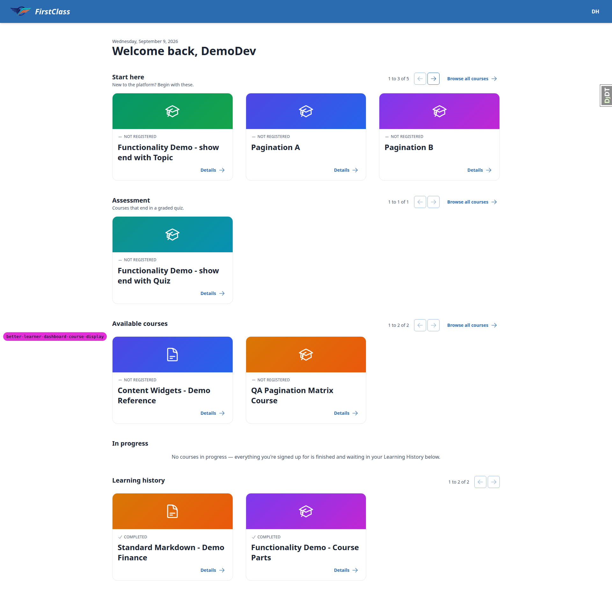
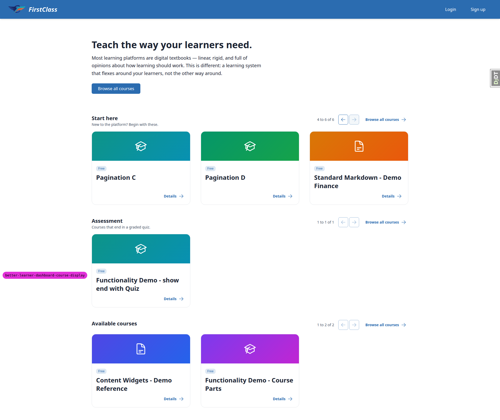
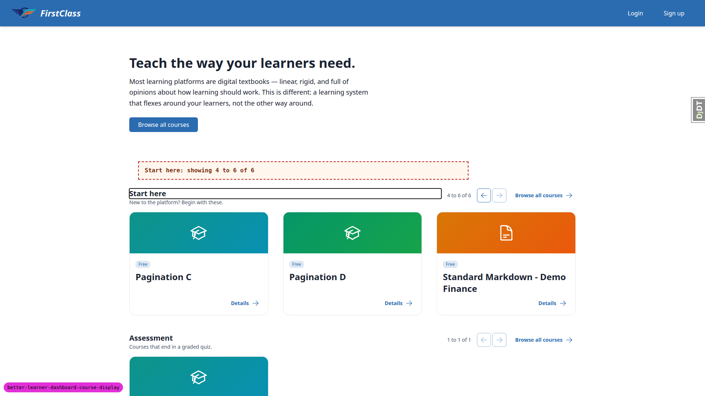
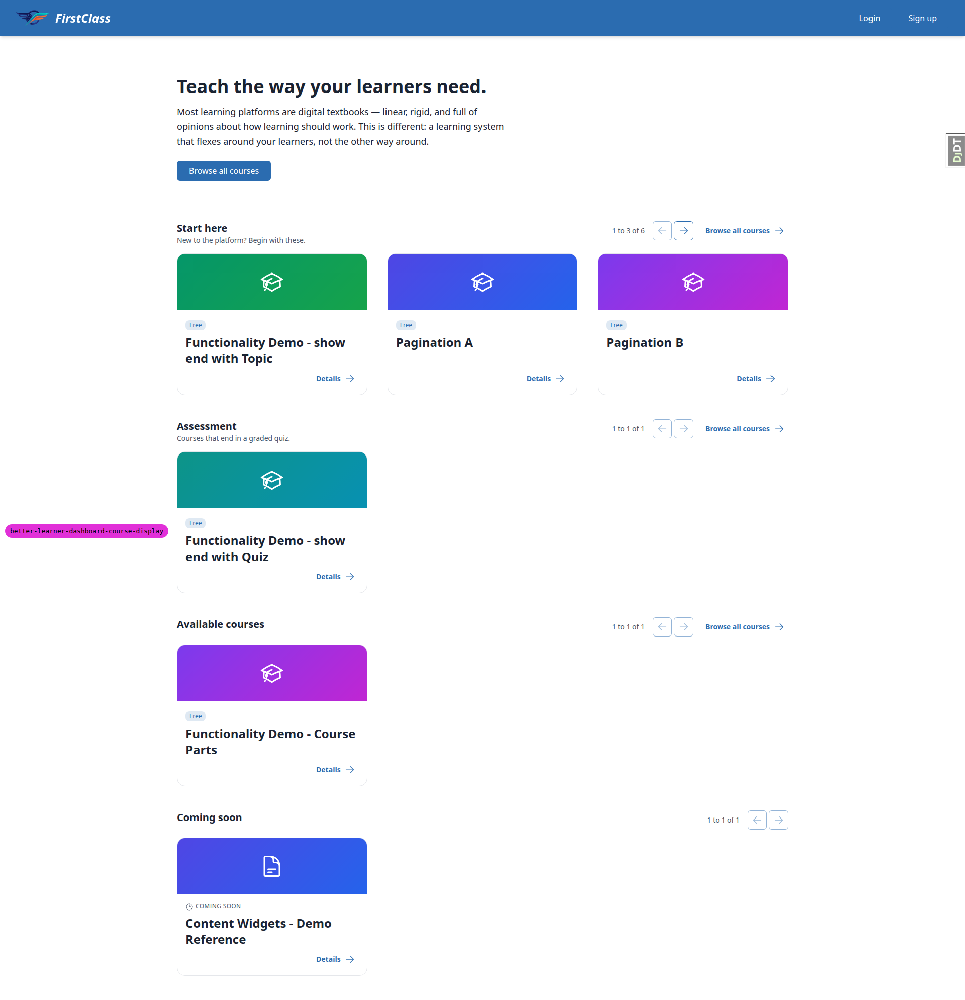
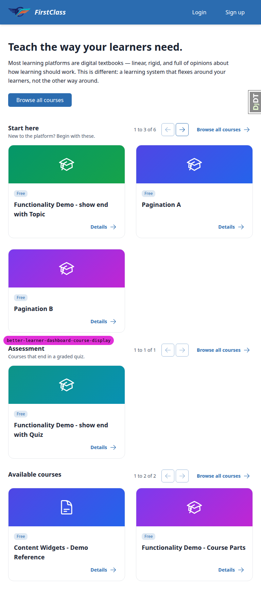

# Frontend QA report: better learner dashboard course display

This pass manually exercised the learner dashboard category grouping, three-per-page pagination,
section ordering and coming-soon split, plus the course detail chip, educator panel and Django
admin changes that ship with them, on branch `better-learner-dashboard-course-display`. 77 test
records were executed; 75 passed and 2 failed, consolidating into 3 distinct bugs (B1, B2, B3).

## Methodology

Testing was driven manually through the Playwright MCP tool against a dev server on
`http://127.0.0.1:8000/`. Port 8000 was chosen because the DemoDev `Site` row's domain is
`127.0.0.1:8000`; the `site-pinning` observation below explains why that turned out not to matter
for any result in this run. Screenshots were collected into
`spec_dd/2. in progress/better-learner-dashboard-course-display/screenshots/`, and every image
referenced in this report exists beside it. The run did not abort at the smoke gate, so the full
test matrix ran. A screenshot compression pass ran afterwards and found no PNG over 1024KB.

## Diff scoping

The scoping gate fired class **FULL**, triggered by changes across:

- `freedom_ls/learner_interface/templates/learner_interface/dashboard.html`
- `freedom_ls/learner_interface/templates/cotton/course-section-pagination.html`
- `freedom_ls/learner_interface/templates/learner_interface/course_detail.html`
- `freedom_ls/learner_interface/templates/learner_interface/partials/course_list.html`
- `freedom_ls/learner_interface/templates/learner_interface/partials/course_status_eyebrow.html`
- `freedom_ls/learner_interface/static/learner_interface/js/alpine-components.js`
- `freedom_ls/learner_interface/views.py`
- `freedom_ls/learner_interface/dashboard_sections.py`
- `freedom_ls/content_engine/models/courses.py`
- `freedom_ls/content_engine/admin.py`
- `freedom_ls/content_engine/validate.py`
- `freedom_ls/educator_interface/views.py`
- `demo_content/course_categories.yaml`

Skipped: nothing. Because the class was FULL, the desktop, mobile and tablet passes all ran.

## Smoke gate

Passed. Pages checked before the full matrix started:

- `http://127.0.0.1:8000/`
- `http://127.0.0.1:8000/courses/functionality-demo-show-end-with-topic/detail/`

No failure URL, no failure reason.

## Results by test-plan section

### 1. Anonymous home page

| test_id | status | observed |
| --- | --- | --- |
| 1.2 | pass | Hero, then Start here (desc "New to the platform? Begin with these.", Standard Markdown - Demo Finance + Functionality Demo - show end with Topic), Assessment (show end with Quiz), Available courses (Content Widgets then Course Parts, alphabetical) with Browse all courses link. No other sections. |
| 1.3 | pass | No Reference, no Coming soon, no In progress, no Learning history. |
| 1.4 | pass | Headings sentence case ("Start here", "Assessment", "Available courses"); no title-case "In Progress"/"Recommended Courses" anywhere. |
| 1.5 | pass | Every heading row carries position text ("1 to 2 of 2", "1 to 1 of 1", "1 to 2 of 2") plus previous/next arrows, both greyed on every single-page section. |
| 1.6 | pass | Full-page screenshot at 1920x1080. |
| 1.7 | pass | Each of the five courses appears exactly once; show end with Topic renders only under Start here, not Assessment, despite belonging to both. |

Anonymous dashboard: Start here, Assessment, Available courses sections at desktop width.

### 2. Signed-in learner with a course in progress

| test_id | status | observed |
| --- | --- | --- |
| 2.2 | pass | demodev_s1 order: greeting, In progress (show end with Topic, 43% bar, "Next up: Pictures"), Start here (Standard Markdown only), Recommended courses (Content Widgets), Available courses (Course Parts only), Learning history (show end with Quiz). Assessment absent. |
| 2.3 | pass | Full-page screenshot. |
| 2.4 | pass | `#current-courses`, `#recommended-courses`, `#available-courses`, `#learning-history` all present in the DOM. |

demodev_s1 dashboard: In progress, Start here, Recommended courses, Available courses, Learning history.

### 3. Signed-in learner with nothing in progress

| test_id | status | observed |
| --- | --- | --- |
| 3.2 | pass | demodev_history (Seed C): Start here, Assessment, Available courses, In progress, Learning history. In progress copy exactly "No courses in progress - everything you're signed up for is finished and waiting in your Learning History below." Learning history: Standard Markdown - Demo Finance (completed 2026-09-07) before Functionality Demo - Course Parts (2026-08-30), most recent first. |
| 3.3 | pass | demodev_empty (no registrations): same layout; In progress reads "You haven't signed up for any courses yet."; no Learning history section. |

demodev_history dashboard: In progress collapsed message, Learning history with two completions.

### 4. Paging a section with the mouse

| test_id | status | observed |
| --- | --- | --- |
| 4.1 | pass | Seed A: Start here reads "1 to 3 of 6", cards show end with Topic, Pagination A, Pagination B (alphabetical); previous greyed (aria-disabled=true, no href), next live. |
| 4.2 | pass | Next swaps to Pagination C, Pagination D, Standard Markdown, text "4 to 6 of 6", previous live/next greyed. Window sentinel survived (no reload). Heading top stayed at identical 439.75px, description unchanged — no flicker. |
| 4.3 | pass | Address bar still `/` with no query string after the swap; no `hx-push-url` on the component, so no history entry is pushed; Back performs a full document navigation away rather than stepping through section pages. |
| 4.4 | pass | Previous returns "1 to 3 of 6" with original cards; previous re-disabled. |
| 4.5 | pass | Forcing a dispatched click on the disabled previous arrow (fetch/XHR instrumented) fired 0 requests; section innerHTML byte-identical; URL and position text unchanged. |
| 4.6 | pass | While Start here on page two, Assessment still "1 to 1 of 1" (show end with Quiz), Available courses still "1 to 2 of 2" (Content Widgets, Course Parts). |

Start here after clicking next: Pagination C, Pagination D, Standard Markdown, "4 to 6 of 6".

### 5. Paging without JavaScript, and by URL

| test_id | status | observed |
| --- | --- | --- |
| 5.1 | pass | Live next arrow's href and hx-get both `/?page_start-here=2`; opened directly, returns a complete page with Start here "4 to 6 of 6" and the other two sections on page one. |
| 5.2 | pass | With `javaScriptEnabled: false`, next arrow performs a full navigation to `/?page_start-here=2` showing Pagination C/D/Standard Markdown and "4 to 6 of 6" — anchors degrade gracefully. |
| 5.3 | **fail** | All five URLs return 200 with no traceback, but two land on the wrong page — see bug B1. `?page_start-here=abc` → "1 to 3 of 6" (correct). `?page_start-here=0` → "4 to 6 of 6" (should be page one). `?page_start-here=-1` → "4 to 6 of 6" (should be page one). `?page_start-here=9999` → "4 to 6 of 6" (correct). `?page_nonsense=3` → "1 to 3 of 6" everywhere, ignored (correct). |
| 5.4 | pass | On `/?page_start-here=2&utm_source=qa`, Start here's previous href is `/?utm_source=qa` (page_start-here dropped since target is page one, utm_source kept). Pagination C/D were temporarily uncategorised to give Available courses a live next arrow; its href was `/?page_start-here=2&utm_source=qa&page_available=2`. Fixture restored via `qa_create_dashboard_paging_fixtures DemoDev`. |

### 6. In progress order and paging

| test_id | status | observed |
| --- | --- | --- |
| 6.1 | pass | demodev_paging (Seed B): In progress is the first section, "1 to 3 of 6". |
| 6.2 | pass | Page one order: Pagination C (last_accessed 2026-09-09, most recent), Pagination A (last_accessed 2026-09-01), Pagination B. Started courses precede unstarted ones. See General notes for the plan-vs-spec discrepancy on the third card. |
| 6.3 | pass | Next gives "4 to 6 of 6": Pagination D, show end with Topic, Standard Markdown. Every card has a native `<progress>` element with `aria-label="Progress for <course>"`, value 0, max 100, and a visible "0%" label. |
| 6.4 | pass | After visiting `/courses/pagination-c/1/` and returning, In progress still leads Pagination C, A, B at "1 to 3 of 6". |
| 6.5 | pass | Sign out and back in as demodev_paging: order byte-identical across both visits. |

### 7. Recommended courses and Learning history paging

| test_id | status | observed |
| --- | --- | --- |
| 7.1 | pass | After 4 RecommendedCourse rows added for demodev_s1: Recommended courses reads "1 to 3 of 5" (Content Widgets, Pagination D, Pagination C — newest recommendation first); next gives "4 to 5 of 5" (Pagination B, Pagination A); live region announces "Recommended courses: showing 4 to 5 of 5". The four Pagination courses drop out of Start here for this learner (down to Standard Markdown only). |
| 7.2 | pass | Two-course state already verified at 3.2 ("1 to 2 of 2", both greyed). With two extra completions, demodev_history's Learning history reads "1 to 3 of 4" (Pagination B 09-08, Standard Markdown 09-07, Pagination A 09-03); next gives "4 to 4 of 4" (Course Parts 08-30). Most recently completed first across both pages. |

### 8. Keyboard, focus and screen-reader text

| test_id | status | observed |
| --- | --- | --- |
| 8.1 | pass | Focused Start here's next arrow, pressed Enter: swap to "4 to 6 of 6", focus landed on `#section-heading-start-here` (tabindex=-1) because the pressed control became aria-disabled; never on body; scrollY stayed 0. |
| 8.2 | pass | On `/?page_start-here=2`, focused previous, pressed Enter: returned to "1 to 3 of 6", focus landed on the Start here heading since previous is greyed on page one; scrollY stayed 0. |
| 8.3 | pass | `#dashboard-section-status` reads exactly "Start here: showing 4 to 6 of 6"; single element (`querySelectorAll` length 1), `div role="status" aria-atomic="true" class="sr-only"`. Page also has an unrelated pre-existing `#toast-region-polite` `role="status"` — two `role=status` nodes total, one dashboard live region. |
| 8.4 | pass | Three navs with `aria-label`s "Start here pages", "Assessment pages", "Available courses pages", all unique. Greyed arrows carry `aria-disabled="true"` and `tabindex="-1"`, no href, no `disabled` attribute (`hasAttribute('disabled')` false on all six arrows); live arrows carry an href. |
| 8.5 | pass | Section page containers `#section-page-start-here`, `#section-page-assessment`, `#section-page-available`; for all three, the h2 sits outside the swapped element. |
| 8.6 | pass | At 200% zoom (960x540 CSS viewport, body zoom 2), `documentElement.scrollWidth === clientWidth` (960) — no horizontal scroll — and the next arrow is reachable. At 375px, `scrollWidth === clientWidth` (375), the heading row wraps (controls top 503px, below heading bottom 466px), position text and both arrows stay visible/reachable. |

Focus ring on the "Start here" heading after the section swap (sr-only live region temporarily unmasked for capture).

### 9. Content authoring round trips

| test_id | status | observed |
| --- | --- | --- |
| 9.1 | pass | Title edit to "Begin here" via `content_save`: heading updates, element id stays `section-heading-start-here`, same three courses held. Diff against the pristine yaml shows only the one edited line; `git status` clean under `demo_content/`. |
| 9.2 | pass | Moving the `assessment` entry above `start-here` reorders the anonymous page to Assessment, Start here, Available courses. See General notes for the demodev_s1 half of this step. |
| 9.3 | pass | `show_on_dashboard: false` on assessment removes the section; Available courses becomes Content Widgets, Course Parts, show end with Quiz (alphabetical); show end with Topic stays under Start here — belonging to a switched-off category has no effect on its placement. |
| 9.4 | **fail** | Two problems, see bugs B2 and B3. (a) `content_save` on a uuid-less declaration whose slugs already exist on the target site dies with an unhandled `IntegrityError: duplicate key value violates unique constraint "unique_course_category_slug_per_site" DETAIL: Key (site_id, slug)=(3, start-here) already exists`; nothing written. (b) On a genuine first load (Bloom site, no CourseCategory rows), uuids ARE minted, but the whole file is re-serialised: keys re-sorted alphabetically per entry (description, slug, title, uuid instead of the authored slug, title, description, uuid), sequence indentation changes from `  - slug:` to `- description:`, and `content_type` moves from top to bottom of the document. Section 0.3 passes only because the shipped file already carries its uuids, so no write happens at all. |
| 9.5 | pass | `content_validate` exits 1 and prints: `❌ Unknown category in <path>/functionality_demo_end_with_quiz/course.md / Content type: COURSE / Field: categories[0] / Problem: no category is declared with this slug in this content repo / Given value: 'assesment' / Categories declared in this repo (<path>/course_categories.yaml): assessment, reference, start-here / Fix the slug, or add an entry declaring it in course_categories.yaml.` `content_save` with the same edit also exits 1, fails before writing, dashboard byte-identical before and after. See General notes on the traceback wrapping this message. |
| 9.6 | pass | `category: Assessment` fails with: `Field: category / Problem: Value error, 'category' is no longer a course field. Use 'categories' (a list of category slugs), and 'dashboard_category' when there is more than one.` Names both replacement keys. |
| 9.7 | pass | Removing `dashboard_category` from the Topic course fails with `❌ dashboard_category is required`, Problem "this course belongs to two or more categories, so dashboard_category must name which one the dashboard uses", Given value "(not set)", Candidates listing exactly `assessment` and `start-here`. |
| 9.8 | pass | `dashboard_category: reference` on that course fails with `❌ dashboard_category not in categories`, Problem "'reference' is not one of this course's categories ['assessment', 'start-here']: the dashboard category has to be one the course belongs to", plus the declared-category list and fix hint. |
| 9.9 | pass | All four cases produce their own failure. Duplicate reference entry: "Duplicate category slug 'reference' in \<file\>: every entry needs its own slug" plus a second message about the shared uuid. Slug renamed to `available`: "Category slug 'available' in \<file\> is reserved for the dashboard's built-in sections: ['available', 'coming-soon', 'history', 'in-progress', 'recommended']". Slug `Not A Slug!`: "Invalid category slug 'Not A Slug!' in \<file\>: a slug may only contain letters, digits, hyphens and underscores". Copied to `second_categories.yaml`: "Multiple COURSE_CATEGORIES declarations found: \<file1\>, \<file2\>. A content repo may declare its categories only once." See General notes on the cascade and the noisy "Given value:" dump. |
| 9.10 | pass | Moving `course_categories.yaml` into `functionality_demo_course_parts/` fails with `❌ COURSE_CATEGORIES declaration inside a course directory: <path>/functionality_demo_course_parts/course_categories.yaml. Move it to the repo root.` |
| 9.11 | pass | Combining 9.5, 9.6 and 9.7 in one repo gives exit 1 and `❌ Validation failed for 3 file(s)` with all three messages printed together, one block per file, separated by rules: the retired `category` key on Course Parts, the unknown `assesment` slug on the Quiz course, the missing `dashboard_category` on the Topic course. |
| 9.12 | pass | `content_save ./demo_content DemoDev` restored the real content. Dashboard back to Start here / Assessment / Available courses with the right courses; `git status` shows nothing under `demo_content/` — only the untracked qa_helpers command from the data helper. |

### 10. Django admin

| test_id | status | observed |
| --- | --- | --- |
| 10.1 | pass | Course categories changelist shows the three demo rows (Start here/start-here/0/yes, Assessment/assessment/1/yes, Reference/reference/2/no) with Title, Slug, Order, Show on dashboard columns; no "Add course category" button. |
| 10.2 | pass | Start here change form: slug read-only text "start-here" (no input); title/subtitle/description/order/show_on_dashboard are editable; no Delete button or link. |
| 10.3 | pass | Saved title "Start here (edited)" in admin, dashboard h2 became "Start here (edited)". Ran `content_save ./demo_content DemoDev`; dashboard h2 reverted to "Start here" — the file wins. |
| 10.4 | pass | Course change form for show end with Topic: read-only "Dashboard category" = "Start here" and read-only "Categories" = "Start here, Assessment"; no form input named `dashboard_category` or `categories`. |
| 10.5 | pass | Course Parts: Dashboard category "Reference", Categories "Reference". Content Widgets: Visibility "Coming soon", Dashboard category and Categories both the admin empty marker "-". |

### 11. Course detail page and educator panel

| test_id | status | observed |
| --- | --- | --- |
| 11.1 | pass | Anonymous detail page for show end with Topic: exactly one chip above the h1, reading "Start here"; no "Assessment" chip. |
| 11.2 | pass | Course Parts detail hero chip reads "Reference" — a `show_on_dashboard=false` category still names the placement on the detail page. |
| 11.3 | pass | Content Widgets detail page renders no chip element; the h1 sits directly under the breadcrumb. |
| 11.4 | pass | Educator course page Details panel has exactly two rows: "Title" and "Dashboard Category" = "Start here"; no row labelled just "Category". Label renders Title Case ("Dashboard Category"), matching neighbouring labels ("Cohort Registrations", "First Name"), rather than the sentence case the plan spells — see General notes. |

### 12. Catalogue and other pages did not move

| test_id | status | observed |
| --- | --- | --- |
| 12.1 | pass | `/courses/` lists all five demo courses alphabetically by title (Content Widgets, Course Parts, end with Quiz, end with Topic, Standard Markdown); page otherwise unchanged. |
| 12.2 | pass | Every "Browse all courses" link on the dashboard, on category sections and Available courses alike, has href `/courses/`; clicking lands on the catalogue. |
| 12.3 | pass | In progress card title links to `/courses/functionality-demo-show-end-with-topic/4/`, resuming to "Pictures" rather than the detail page. Completed card title links to `/courses/<slug>/finish/`. Discovery cards (Start here, Recommended, Available) link to `/courses/<slug>/detail/`. Every card also carries a separate "Details" link. The coming-soon case is covered at 13.4. |
| 12.4 | pass | Seeded via `qa_create_paginated_progress_matrix DemoDev --organisation-slug demodev`. The cohort course-progress matrix runs two independent paginators — `col_page` over 26 items, `page` over 32 learners — each link carrying the other's current value. Clicking column page 2 HTMX-swapped columns to Topic 16-26 with the learner paginator intact. |

### 13. Coming soon, with the visibility override off

| test_id | status | observed |
| --- | --- | --- |
| 13.2 | pass | With `OVERRIDE_COURSE_VISIBILITY_TO_VISIBLE = False`, the dev server auto-reloaded. Anonymous page runs Start here, Assessment, Available courses, then Coming soon showing Content Widgets - Demo Reference with a "COMING SOON" eyebrow chip; Available courses drops to Course Parts only. |
| 13.3 | pass | Coming soon carries position text "1 to 1 of 1" and both arrows aria-disabled="true", like every other single-page section. |
| 13.4 | pass | The Content Widgets card in Coming soon links to `/courses/content-widgets-demo-reference/detail/`; clicking opens that detail page. |
| 13.5 | pass | Setting `dashboard_category` and `categories` on Content Widgets to the start-here row: reloading left it under Coming soon; Start here stayed at "1 to 3 of 6" unchanged — Coming soon wins over a category. Both fields reverted afterwards. |
| 13.6 | pass | Signed in as demodev_s1 with the override off: Content Widgets appears under Recommended courses; no Coming soon section, since a recommended course leaves the discovery pool. |
| 13.7 | pass | Signed in as demodev_history with the override off: sections run Start here, Assessment, Coming soon, In progress, Learning history — In progress sits between Coming soon and Learning history. |
| 13.8 | pass | Restored `OVERRIDE_COURSE_VISIBILITY_TO_VISIBLE = True`; `git diff -- config/settings_dev.py` is empty; `OVERRIDE_COURSE_ACCESS_TO_FREE` was never touched. |

Anonymous dashboard with the visibility override off: Coming soon section holding Content Widgets with its "COMING SOON" chip.

### 14. Second site

| test_id | status | observed |
| --- | --- | --- |
| 14 | pass | Site isolation verified, not by the plan's host-based method — `FORCE_SITE_NAME = 'DemoDev'` pins every dev request regardless of host/port, so a second `runserver` on 127.0.0.1:8001 still served DemoDev; the setting was toggled instead, the same way §13 toggles the visibility override. Data helper created on Bloom a CourseCategory slug `start-here` title "Start here" uuid `0289e4cc-2d44-4aec-b4be-375e3ab1d099` (DemoDev's is `9d099094-0a82-475c-98d5-e576e3b52dbe` — same slug independently on two sites) plus one published course "Bloom Only Course". Pinned to DemoDev: renders start-here/assessment/available with the nine demo courses, "bloom" appears nowhere in the HTML. Pinned to Bloom: renders only a start-here section holding only bloom-only-course, no demo course present. `FORCE_SITE_NAME` restored to "DemoDev"; `git diff` on the file empty. |

### Mobile viewport (375px)

| test_id | status | observed |
| --- | --- | --- |
| 1.2-mobile | pass | 375x812 anonymous dashboard: cards stack to a single column; all three sections render in order with headings, descriptions, position text, both arrows and the Browse all courses link; no horizontal overflow. Header collapses to inline Login / Sign up with no hamburger needed at this width. |
| 4.2-mobile | pass | Tapping Start here's next arrow at 375px swaps to "4 to 6 of 6" (Pagination C, D, Standard Markdown); no horizontal scroll; focus still lands on `#section-heading-start-here`, matching desktop. |
| 8.6-touch-targets | pass | Observation, not a plan requirement — see General notes. |

375x812 anonymous dashboard, single-column card stack.

### Tablet viewport (768px)

| test_id | status | observed |
| --- | --- | --- |
| 1.2-tablet | pass | 768x1024 anonymous dashboard: two-column card grid (344px/344px); heading row stays on one line with position text, both arrows and Browse all courses; tablet gets the desktop header (inline Login / Sign up), no horizontal scroll. |
| 4.2-tablet | pass | Clicking next at 768px swaps Start here to "4 to 6 of 6" with the correct three cards, no horizontal scroll, focus lands on `#section-heading-start-here` as on desktop. |
| grid-gap-tablet | pass | Observation, not a plan requirement — see General notes. |

768x1024 anonymous dashboard, two-column card grid.

### Cross-cutting

| test_id | status | observed |
| --- | --- | --- |
| 8.1-live-control | pass | The other branch of 8.1, which no shipped section is large enough to reach natively: demodev_s1's recommendations were temporarily raised to 7 (three pages). Focused next arrow, pressed Enter: moved to "4 to 6 of 7", next stayed live, `document.activeElement` was the next arrow inside that same nav — focus returned to the equivalent control rather than the heading, matching `courseSectionPagination` in `alpine-components.js:478-505`. Extra recommendations deleted afterwards, restoring the count to 5. |
| 9.4-idempotency | pass | The second half of 9.4 holds: after the file has been written once, a second `content_save` leaves it byte-identical (md5 `2ea9d0db0fd725b383ebb1291288ec14` before and after, diff empty). |
| 12.1-recheck | pass | Re-checked `/courses/` after Seed A: all nine courses list alphabetically by title (Content Widgets, Course Parts, end with Quiz, end with Topic, Pagination A-D, Standard Markdown); the catalogue is unaffected by the category work. |
| console-clean | pass | Browser console across every dashboard load in this run carried no errors or warnings. The only console error anywhere in the run was a 404 for `/favicon.ico` on the Django admin, pre-existing site chrome unrelated to this branch. |

## B1: Dashboard page numbers below 1 jump to the last page instead of page one

**Manifestations:** 5.3 (desktop)

**Screenshots:** none.

**Expected:** Per test plan section 5.3, `/?page_start-here=0` and `/?page_start-here=-1` both return a 200 showing page ONE of the Start here section ("1 to 3 of 6"), the same clamp a non-integer like "abc" gets. Only an above-range number such as 9999 should land on the last page.

**Actual:** Both land on the LAST page ("4 to 6 of 6"). `page_for()` in `freedom_ls/learner_interface/dashboard_sections.py:84` calls `Paginator(...).get_page()`. Django's `get_page` maps `PageNotAnInteger` to page 1, but maps `EmptyPage` — which `validate_number` raises for any number below 1 as well as for numbers past the end — to `num_pages`, so 0 and -1 are both treated as "past the end". The existing test at `freedom_ls/learner_interface/tests/test_dashboard_pagination.py:56-64` parametrises over "abc", "0", "-1", "9999" but only asserts a 200 and a non-empty section, so it passes without pinning which page comes back.

**Fix:** commit `8d90b653`. `page_for()` now normalises an integer page value below 1 to `"1"` before handing it to `get_page()`, leaving non-integers and above-range numbers on their existing clamp path, and the docstring records why. The parametrised test was strengthened to assert which page each bad value actually returns rather than only that the response is a 200.

**Re-verification:** driven against the running dev server after the auto-reload. `?page_start-here=0` and `?page_start-here=-1` now both return "1 to 3 of 6"; `abc` still returns page one, `9999` still returns "4 to 6 of 6", and `?page_nonsense=3` is still ignored. Because `page_for()` is shared by every section, adjacent paging was spot-checked: Learning history paged to "4 to 4 of 4" with focus landing on `#section-heading-history` and the live region announcing "Learning history: showing 4 to 4 of 4", and the course detail page and catalogue both still return 200.

## B2: content_save reformats the whole course_categories.yaml when it writes uuids

**Manifestations:** 9.4 (desktop)

**Screenshots:** none.

**Expected:** Per test plan section 9.4, running `content_save` on a declaration with the uuid lines deleted adds one `uuid:` line per entry and leaves the other lines untouched.

**Actual:** The uuids are minted, but the whole document is re-serialised through a plain YAML dumper. Keys are re-sorted alphabetically inside every entry (description, slug, title, uuid instead of the authored slug, title, description, uuid), the sequence indentation changes from `  - slug:` to `- description:`, and the `content_type` key moves from the top of the document to the bottom. An author who deletes a uuid to force a re-mint gets their whole file rewritten, and the diff buries the one line that actually changed. Section 0.3 passes only because the shipped file already carries its uuids, so no write happens at all. Reproduced by loading a uuid-stripped copy of `demo_content` onto a site with no CourseCategory rows (Bloom). A second `content_save` after the rewrite is byte-identical, so the instability is one-shot rather than a loop.

## B3: A uuid-less category entry whose slug already exists dies with a raw IntegrityError

**Manifestations:** 9.4 (desktop)

**Screenshots:** none.

**Expected:** Every other category authoring mistake in section 9 produces a targeted, actionable message naming the file, the field and the fix. This case should either adopt the existing row by slug or fail the same way, with a message naming the slug and the file.

**Actual:** Running `content_save` on a declaration whose uuid lines have been deleted, against a site whose CourseCategory rows already exist, dies with an unhandled `django.db.utils.IntegrityError: duplicate key value violates unique constraint "unique_course_category_slug_per_site" DETAIL: Key (site_id, slug)=(3, start-here) already exists.` plus a full Python traceback. Nothing is written and the author gets a database error rather than authoring guidance. Whether the right behaviour is to adopt the existing row or to refuse with a clear message is a product decision about content-authoring semantics.

## Bug status

**FIXED** (commit: `8d90b653`) — Dashboard page numbers below 1 jump to the last page instead of page one

**UNRESOLVED** — content_save reformats the whole course_categories.yaml when it writes uuids (reason: the fix is a change of YAML write strategy — a format-preserving writer or a targeted line insert, possibly a new dependency — which is a design decision, not a minimal repair)

**UNRESOLVED** — A uuid-less category entry whose slug already exists dies with a raw IntegrityError (reason: whether such an entry should adopt the existing row by slug or refuse with an authoring error is a product decision about content-authoring semantics)

## General notes

- The test plan contradicts the spec at section 6.2. The plan's third expectation for the In progress order is "the alphabetically first of the never-started registrations", but `1. spec.md:522` and `:699-701` specify that the unstarted bucket orders by newest registration first, with slug as tie-breaker. `_in_progress_sort_key` in `utils.py:838` implements the spec rule, and Seed B's registration dates (B 09-06 > D 09-05 > show end with Topic 09-04 > Standard Markdown 09-03) put Pagination B third under the spec rule, which is what was observed. Scored against the spec, not the plan's wording; the plan's wording needs correcting.
- The test plan's section 9.2 asks to observe Recommended courses sitting "between Assessment and the next category" when signed in as demodev_s1, but that learner has completed the only Assessment course, so the section is absent for them — the plan's own section 2 says so. What is verifiable held: for demodev_s1 the order was In progress, Start here, Recommended courses, Available courses, Learning history, so Recommended sits after the category block and before the catch-all regardless of category order. The plan's wording needs correcting.
- Section 14 could not be tested by the plan's host-based method because `config/settings_dev.py:118` sets `FORCE_SITE_NAME = 'DemoDev'`, which pins every dev request to one tenant whatever host or port it arrives on. It was tested by toggling that setting instead, the same way section 13 toggles the visibility override. Site isolation held under that method.
- The educator panel label renders "Dashboard Category" in Title Case, matching its neighbouring labels ("Cohort Registrations", "First Name"), where the plan spells it sentence case ("Dashboard category").
- Mobile touch targets (the pagination arrows) measure 38x38 CSS px, under the 44x44 WCAG 2.5.5 (AAA) / Apple HIG target size guidance; they are still comfortably tappable and the plan sets no numeric threshold. Separately, the position text box is only 58px wide at 375px, so it wraps mid-phrase ("1 to 3 of" / "6"), which reads awkwardly on a phone.
- On tablet (768px, two-column grid) the page size of 3 leaves the third card of every section alone on a second row with a card-sized gap beside it. Nothing overflows or overlaps; it is purely a whitespace effect of 3 items in a 2-up grid.
- `content_validate` and `content_save` deliver their (otherwise excellent) authoring error messages wrapped in an unhandled Python traceback (a `ValueError` raised from `validate.py:525`) rather than a clean `CommandError`, so the author has to read past roughly 25 lines of stack frames to reach the useful text. Separately, when the declaration file itself fails validation, the whole declaration is discarded, so all five demo courses then also report "Unknown category" — 7 failing files reported for one root cause, which buries the real one. The "Given value:" line also dumps the entire parsed document, including every category entry and the PosixPath, which is very noisy in a terminal.
- Test data the run created and left behind is expected and fine, because the dev database is a per-branch disposable fixture: the Pagination A-D courses (Seed A), the demodev_paging / demodev_history / demodev_empty learners, the extra RecommendedCourse rows and completions added for section 7, and the Bloom site-isolation fixture (a second `Site`, a `CourseCategory` with slug `start-here`, and "Bloom Only Course") from section 14. Two new untracked QA commands under `freedom_ls/qa_helpers/management/commands/` — `qa_create_dashboard_paging_fixtures.py` and `qa_create_site_isolation_fixture.py` — make those fixtures reproducible.
- `git status` is clean apart from those two untracked QA command files. `demo_content/` was never modified by this run, and `config/settings_dev.py` was restored after both of its temporary toggles (`OVERRIDE_COURSE_VISIBILITY_TO_VISIBLE` for section 13, `FORCE_SITE_NAME` for section 14).
- **The pytest suite is unstable in this environment, independently of this branch.** Confirming the B1 fix needed four suite runs and the results did not agree with each other: one randomised run gave 78 failed / 45 errors, a deterministic run (`-p no:randomly`) of the same code gave 9 failed / 3600 passed / 16 errors, and an earlier run was clean through 88% before exiting. The failures cluster in Playwright browser tests and in the webhook, signup and deferred-login tests, and the underlying causes are all infrastructural — `guardian.exceptions.MixedContentTypeError`, `django_content_type` foreign-key violations against ids that are not in the table, `psycopg.errors.DeadlockDetected`, and `Database test_db_… couldn't be flushed`. None of them touch `page_for()` or any dashboard pagination code. The same isolated subset was run with the fix reverted in the working tree and with it restored: pre-fix gave 1 failed / 12 errors, post-fix gave 2 failed / 9 errors. Counts that move between runs over identical code is the signature of flakiness, not of a regression, so the B1 fix is not the cause. This is worth its own investigation, but it predates this branch and is outside the scope of this QA pass.

status: ok — reason: 3 bugs — 1 fixed, 2 unresolved; report rendered, screenshots verified
