# Frontend QA Report: better-looking-notifications (phase 2)

The frontend QA run for phase 2 of better-looking-notifications ran against the dev server on port 8589, on branch `better-looking-notifications`. The run covered the header bell and badge, the notification panel, the notification centre, and the empty and all-read states. It also covered isolation between learners. Every test and every design check passed, and no bugs were found.

## Methodology

- The Playwright MCP was driven by hand against http://127.0.0.1:8589/.
- Screenshots were collected into `screenshots/` beside this report. Every image referenced here exists in that folder. Design reference images are in `design_screenshots/`.
- Seeding used the `qa_create_notification_scenarios` command. It was re-run before each section that needed fresh unread rows. The `notify.empty` learner was created by the qa-data-helper agent.
- Viewports: desktop 1280x900, mobile 375x812, tablet 768x1024.

## Diff scoping

Class: **FULL**. Nothing was skipped.

Changed files:

- freedom_ls/comms/templates/comms/notification_list.html
- freedom_ls/comms/templates/comms/partials/notification_badge.html
- freedom_ls/comms/templates/comms/partials/notification_panel.html
- freedom_ls/comms/templates/comms/partials/notification_row.html
- freedom_ls/comms/models.py
- freedom_ls/base/notification_categories.py
- freedom_ls/icons/mappings.py
- freedom_ls/icons/semantic_names.py

Everything ran: desktop, mobile and tablet.

## Smoke gate

Result: **pass**. Pages checked:

- http://127.0.0.1:8589/
- http://127.0.0.1:8589/notifications/

## Results

| Test | Viewport | Status | Notes | Screenshot |
|---|---|---|---|---|
| 1.1 | desktop | pass | Bell sits immediately left of the avatar. Badge reads 3 with a ring. Tab focuses the bell with a visible two-layer focus ring. Accessible name is "Notifications, 3 new". | 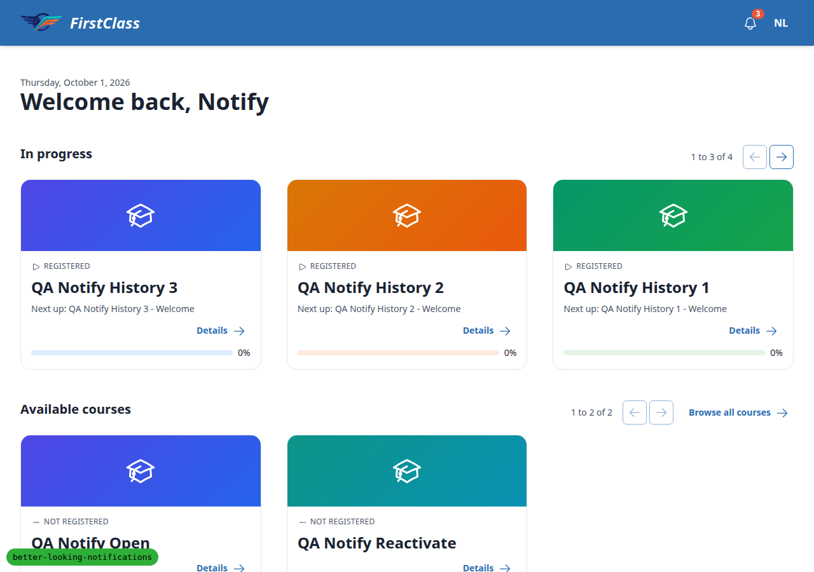 |
| 1.4 | desktop | pass | Avatar menu opens beside the bell and Escape closes it. The course player page shows the same bell and badge. Anonymous home shows Login/Sign up and no bell. | 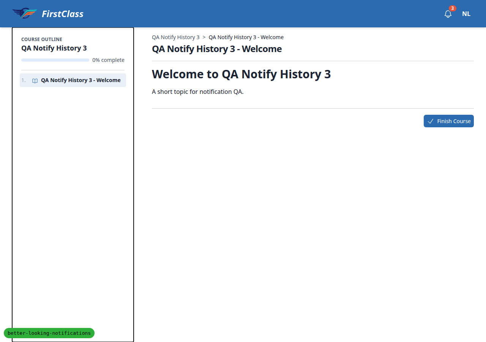 |
| 1.2 | desktop | pass | Learner C badge reads 99+ (name "Notifications, 120 new"). `notify.empty` has the badge hidden and the bell alone (name "Notifications, none new"). |  |
| 1.3 | mobile | pass | At 375 the 99+ ringed pill sits next to the avatar. `notify.empty` shows the bell alone. No horizontal scroll. |  |
| 4.2 | desktop | pass | Empty centre has only the filter in the toolbar, a centred bell tile, "Nothing yet." and an explanation line. The Unread filter shows "No unread notifications." in the same card. Pills have no underline. | 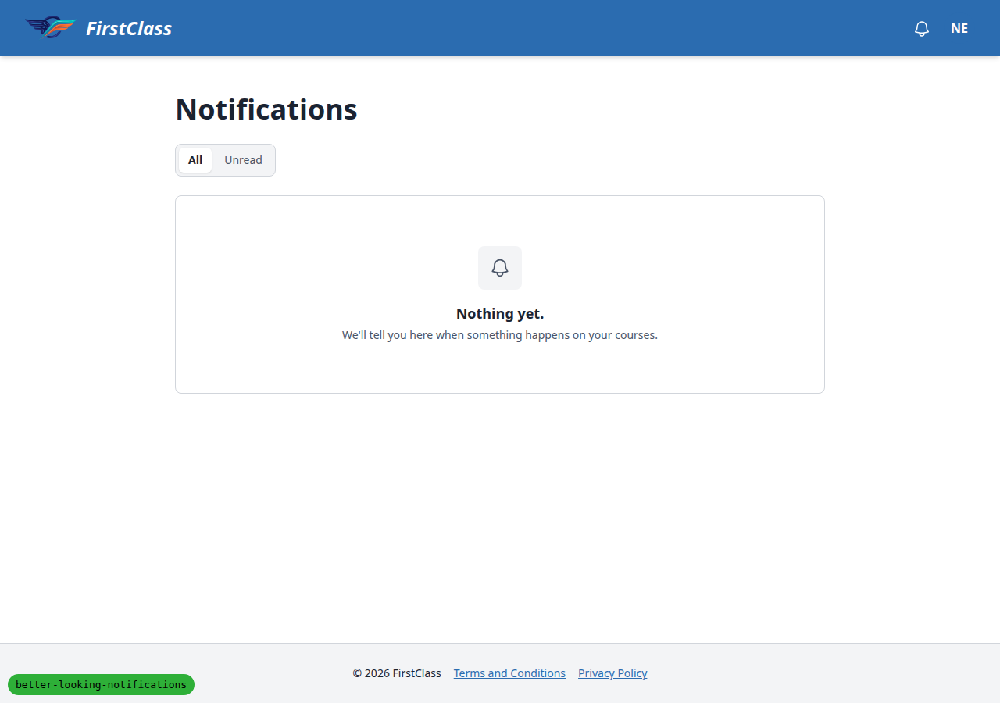 |
| 4.3 | mobile | pass | Empty card fills the width at 375 with the tile, heading and explanation centred. Filter present, no horizontal scroll. | 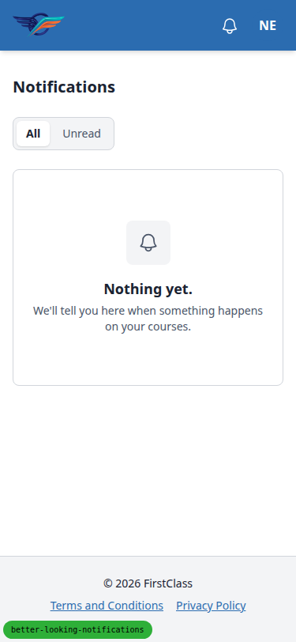 |
| 2.1 | desktop | pass | Clicking the bell hides the badge. The popover is anchored to the bell's right edge, with a border, rounded corners and shadow. It shows 8 rows newest first, with neutral icon tiles, 2-line clamp and meta line. Unread rows are tinted with a dot and "Unread". The footer has "Mark all as read" and "See all". The whole row is a stretched link. | 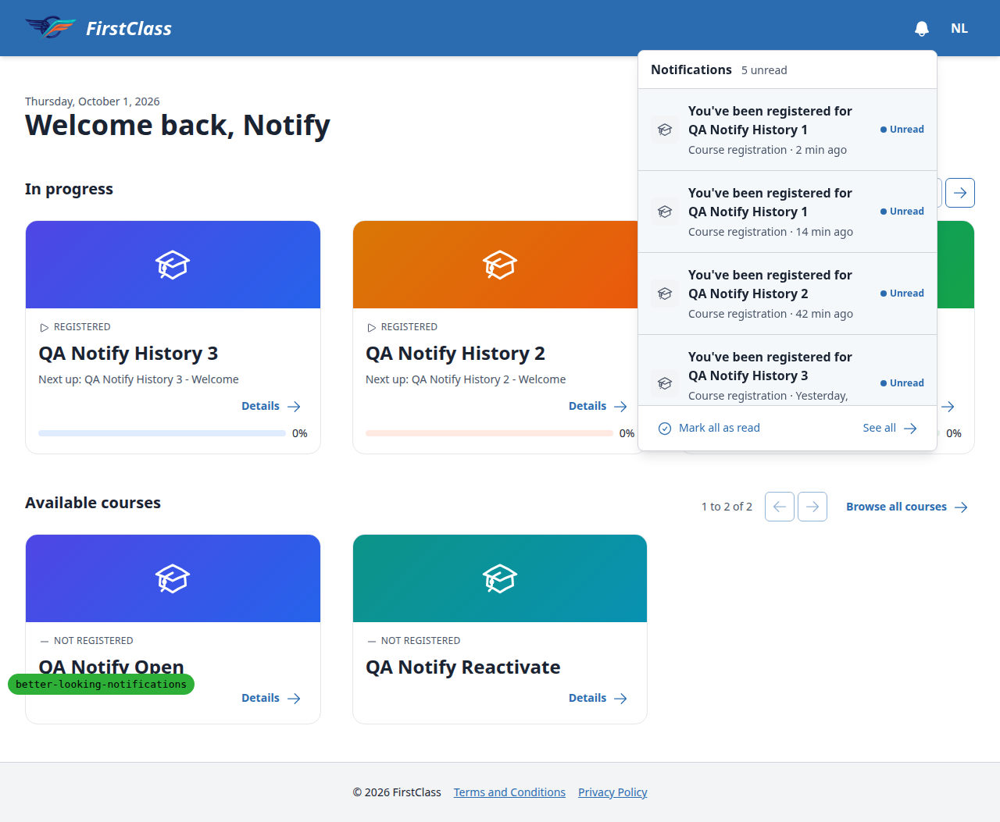 |
| 2.2 | desktop | pass | Clicking a row's icon tile or meta line navigates to the course. On return the row reads as read and the heading count drops to 4 unread. | 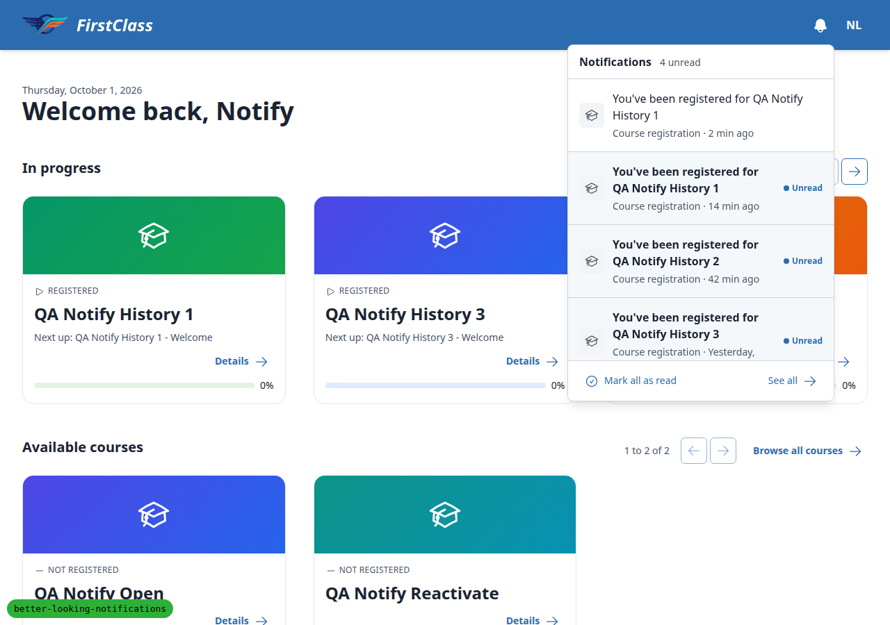 |
| 2.3 | desktop | pass | Mark all as read clears tint, dot and bold. The button becomes disabled and the badge stays hidden. The keyboard path works, and focus lands on the panel heading. See all goes to /notifications/. | 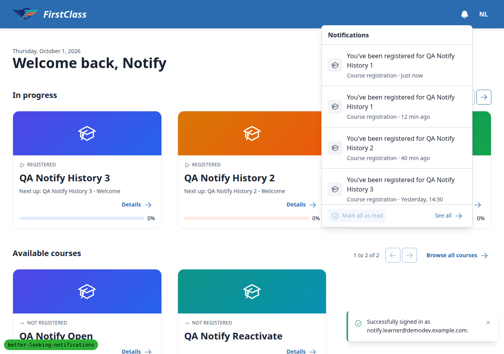 |
| 2.4 | mobile | pass | At 375 the panel is a full-viewport sheet with a close button. Rows span the full width and the footer is pinned at the bottom. Closing returns focus to the bell. Tapping a row's tile navigates. The Learner A header shows the ringed 3 badge. | 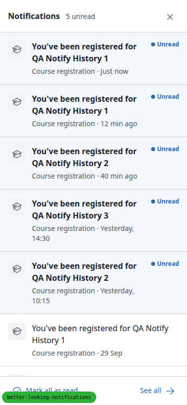 |
| 2.5 | desktop | pass | With the badge at 0, a raised notification updated the badge to 1 about 35s later without a reload. The new row shows first in the panel, tinted, with "Just now". |  |
| 3.1 | desktop | pass | Segmented filter on a tinted strip, with "All" lifted. Day headings are uppercase, tracked and muted. Every row has a tile. Unread rows have a tint, dot, "Unread" and "Mark read". Read rows have "Mark unread". No underlines. | 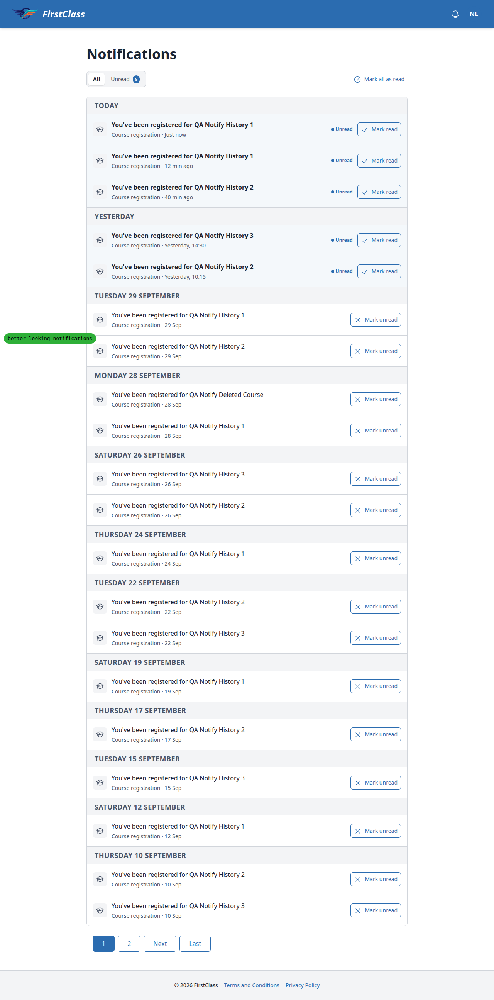 |
| 3.2 | desktop | pass | Page 1 has 20 rows in 12 day groups with no gaps and aligned columns. FLS pagination sits below the card. Page 2 has 5 rows with their own day headings. Back returns to 20 rows. | , [page 2](screenshots/page-centre-page2.png) |
| 3.3 | desktop | pass | Row link navigates and marks the row read. Mark read and Mark unread toggle in place with no navigation, and the Unread pill count updates. A deleted-course row has no link. The keyboard focus ring is visible, and the link and toggle are separate tab stops. | 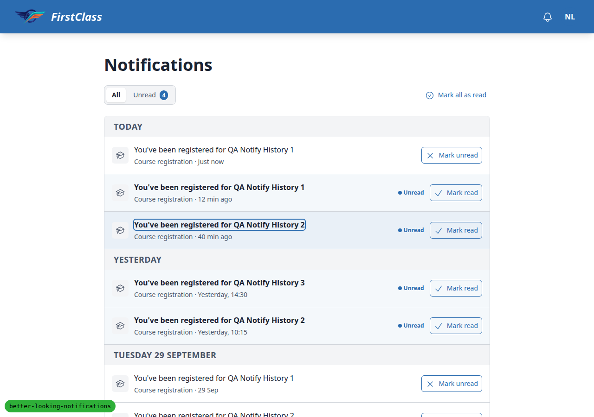 |
| 3.4 | desktop | pass | Unread filter lifts the Unread pill (URL `filter=unread`). Mark read removes the row and moves focus to the next row's button. After the last removal, "No unread notifications." shows and focus is on its heading. All returns 20 untinted rows. | 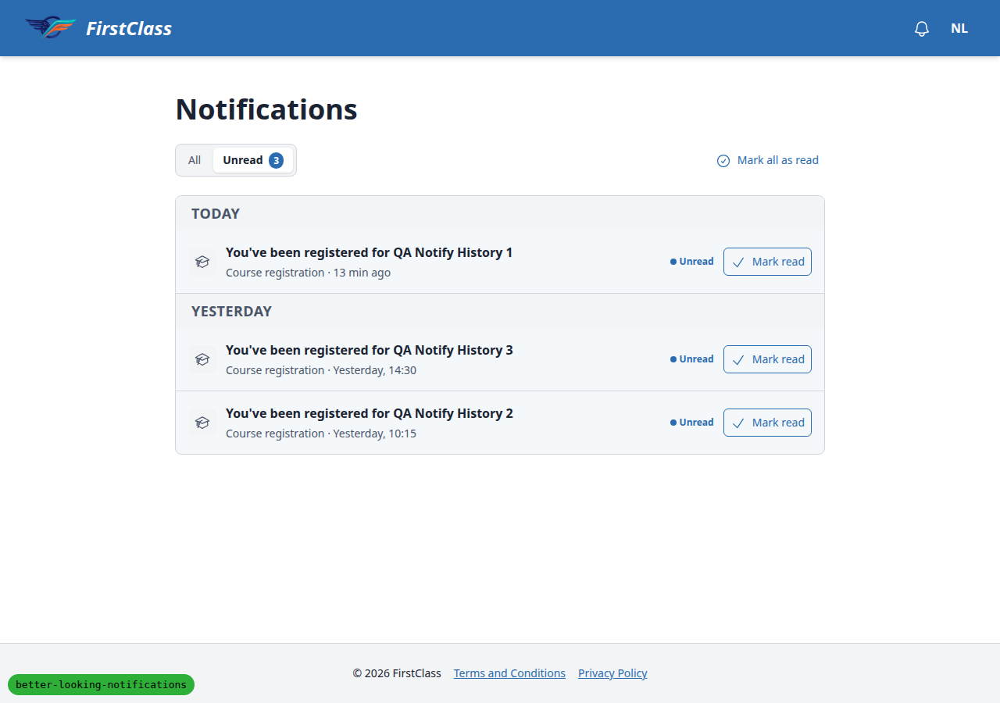, [empty state](screenshots/page-centre-unread-empty.png) |
| 3.5 | mobile | pass | At 375 the filter and "Mark all as read" fit on one line. Rows keep the tile at left, and the mark buttons are icon-only with full accessible names. Tapping the tick marks read with no navigation. Pagination collapses to "Page 1 of 2 / Next". No horizontal scroll. | 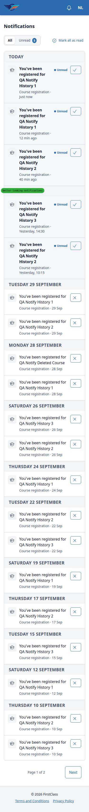 |
| 3.6 | tablet | pass | At 768 the centre has 20 rows with tiles, the segmented filter, and text-labelled Mark read and Mark unread. The header panel is the desktop popover (384px), not the sheet. No horizontal scroll. | 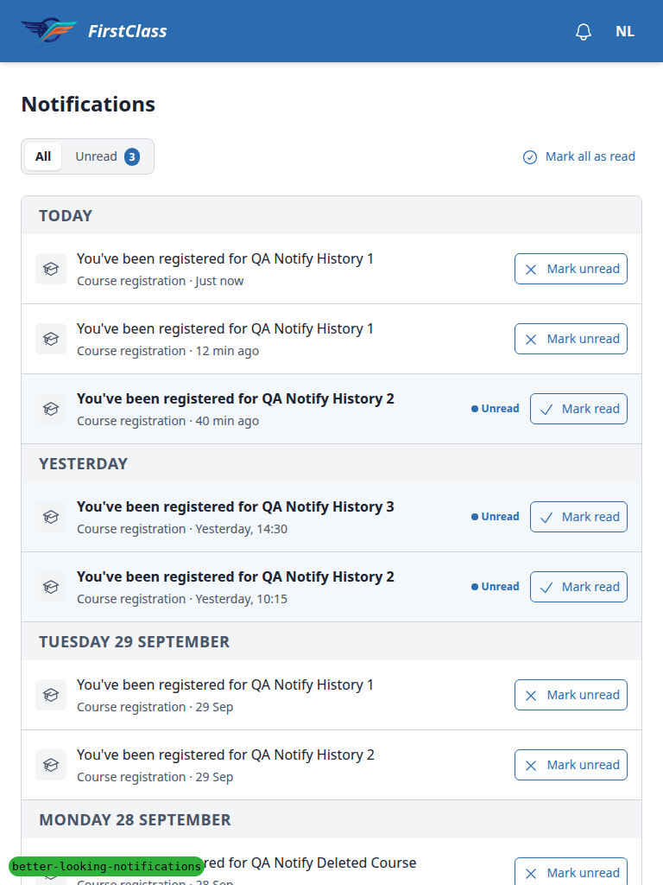, [panel at 768](screenshots/page-panel-768.png) |
| 4.1 | desktop | pass | Mark all as read shows a success banner "You're up to date. Everything has been read." as the first strip. Focus moves to the banner, all rows show "Mark unread" and Mark all is disabled. Marking one row unread removes the banner and restores the row marker. | 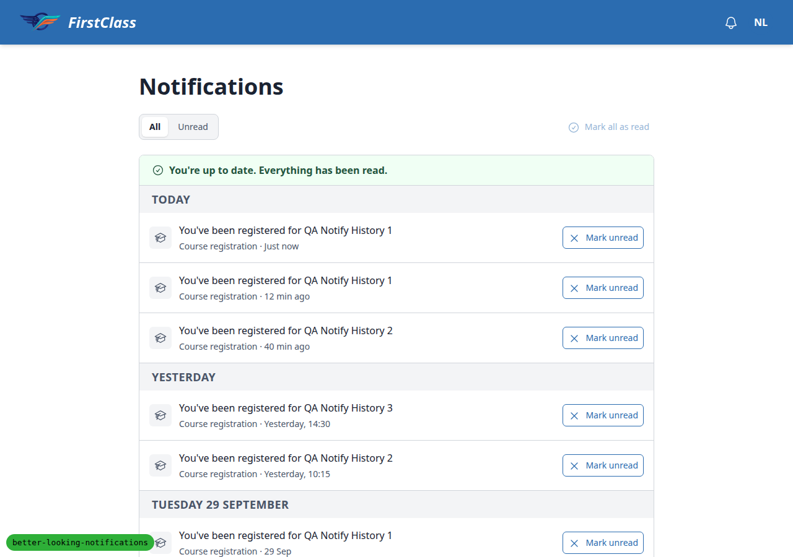 |
| 5 | desktop | pass | Learner B sees only their own 2 unread rows. Opening Learner A's notification as B returns 404 and A's row is unchanged. Anonymous /notifications/ redirects to login. | 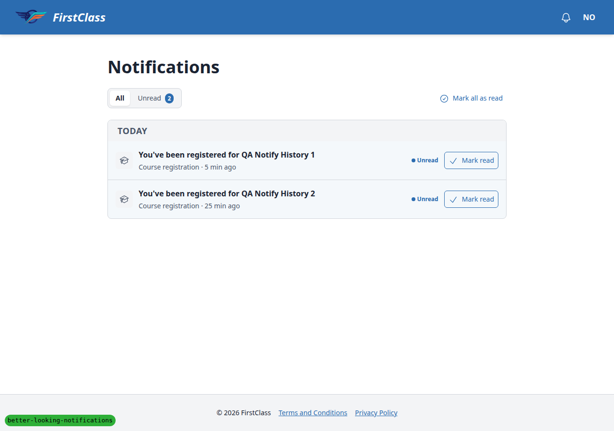 |

## Design check

| Test | Viewport | This run | Design | Result |
|---|---|---|---|---|
| 1.1-design | desktop | [screenshots/element-2026-10-01T14-58-52-370Z.png](screenshots/element-2026-10-01T14-58-52-370Z.png) | [design_screenshots/uc-1-bell__hd.png](design_screenshots/uc-1-bell__hd.png) | pass |
| 1.2-design | desktop | [screenshots/element-2026-10-01T14-59-35-053Z.png](screenshots/element-2026-10-01T14-59-35-053Z.png) | [design_screenshots/uc-1-bell__hd.png](design_screenshots/uc-1-bell__hd.png) | pass |
| 4.2-design | desktop | [screenshots/page-2026-10-01T15-00-09-415Z.png](screenshots/page-2026-10-01T15-00-09-415Z.png) | [design_screenshots/uc-2-centre__empty.png](design_screenshots/uc-2-centre__empty.png) | pass |
| 4.3-design | mobile | [screenshots/page-2026-10-01T15-00-20-518Z.png](screenshots/page-2026-10-01T15-00-20-518Z.png) | [design_screenshots/uc-2-centre__emptym.png](design_screenshots/uc-2-centre__emptym.png) | pass |
| 2.1-design | desktop | [screenshots/page-2026-10-01T15-00-52-738Z.png](screenshots/page-2026-10-01T15-00-52-738Z.png) | [design_screenshots/uc-1-bell__pop.png](design_screenshots/uc-1-bell__pop.png) | pass |
| 1.3-design | mobile | [screenshots/page-375-header-learnerA.png](screenshots/page-375-header-learnerA.png) | [design_screenshots/uc-1-bell__hdm.png](design_screenshots/uc-1-bell__hdm.png) | pass |
| 2.4-design | mobile | [screenshots/page-2026-10-01T15-02-27-823Z.png](screenshots/page-2026-10-01T15-02-27-823Z.png) | [design_screenshots/uc-1-bell__popm.png](design_screenshots/uc-1-bell__popm.png) | pass |
| 3.1-design | desktop | [screenshots/page-2026-10-01T15-03-57-316Z.png](screenshots/page-2026-10-01T15-03-57-316Z.png) | [design_screenshots/uc-2-centre__pop.png](design_screenshots/uc-2-centre__pop.png) | pass |
| 3.2-design | desktop | [screenshots/page-2026-10-01T15-03-57-316Z.png](screenshots/page-2026-10-01T15-03-57-316Z.png) | [design_screenshots/uc-2-centre__long.png](design_screenshots/uc-2-centre__long.png) | pass |
| 3.5-design | mobile | [screenshots/page-centre-375.png](screenshots/page-centre-375.png) | [design_screenshots/uc-2-centre__popm.png](design_screenshots/uc-2-centre__popm.png) | pass |
| 4.1-design | desktop | [screenshots/page-2026-10-01T15-06-38-212Z.png](screenshots/page-2026-10-01T15-06-38-212Z.png) | [design_screenshots/uc-2-centre__read.png](design_screenshots/uc-2-centre__read.png) | pass |

## Bugs

No bugs found.

## Bug status

No bugs recorded.

## General notes

- Desktop tests ran at 1280x900, the width the test plan's design states use, rather than 1920x1080.
- Full-page screenshots of the 375px panel sheet distort because the sheet is `position: fixed`. The viewport screenshot `page-2026-10-01T15-02-27-823Z.png` is the representative one.
- The Django debug toolbar and the debug branch badge overlap content on narrow viewports. This is dev-only. The toolbar was removed per the plan before clicks.
- An early browser console log showed repeated badge-poll `ERR_CONNECTION_REFUSED` errors to http://127.0.0.1:8000/notifications/badge/. These came from a stale tab of an earlier server on port 8000, not from this run's pages. This run's badge uses a relative `hx-get` and polled successfully on port 8589.
- On the course player page the course outline sidebar showed a dark outline. It is likely focus or pre-existing styling, unrelated to notifications.
- The 375px toolbar in test 3.5 never needed to wrap. The filter and "Mark all as read" fit on one line, which matches the design.

status: ok · reason: report rendered, 0 bugs documented
