# Better Registration — QA Report

QA performed against branch `better-registration` (HEAD=`c57e16e`) on the
DemoDev site (`127.0.0.1`) using Playwright MCP. Dev server ran on port 8107.

All 12 tests in `3. frontend_qa.md` passed. Two pre-existing/tooling
observations are noted below; neither is a regression introduced by this
spec, but they are worth flagging.

## Test results

| #   | Test                                             | Result | Notes                                                                                                                            |
| --- | ------------------------------------------------ | ------ | -------------------------------------------------------------------------------------------------------------------------------- |
| 1   | Signup defaults (`require_name=True`)            | Pass   | Fields = email/first_name/last_name/password/password2. No email-confirmation field. Empty first_name blocked by HTML5 `required`. |
| 2   | `require_name=False`                             | Pass   | First-name field labelled "First name (optional)" and not required; signup with empty first_name succeeds.                       |
| 3   | `require_terms_acceptance=True`                  | Pass   | Both checkboxes shown with links to `/accounts/legal/terms/` and `/accounts/legal/privacy/`. Privacy doc explicitly mentions IP capture and 7-year retention. Two `LegalConsent` rows recorded with non-empty git_hash, IP, timestamp, and `consent_method=signup_checkbox`. Admin inline is fully read-only — no editable fields, no "Add another" link. |
| 4   | Terms doc missing                                | Pass   | After `git mv` of `terms.md` → `terms.md.disabled`, system check emits `freedom_ls_accounts.W001` warning; signup form omits the Terms checkbox while keeping Privacy. |
| 5   | Path-traversal on legal-doc view                 | Pass   | `/accounts/legal/../../etc/passwd/` and `/accounts/legal/something/` both return 404. No filesystem leak in error page. |
| 6   | Completion view middleware                       | Pass   | Verified user redirects to `/accounts/complete-registration/` after email verification and on subsequent login. `/`, other internal pages → redirected back. `/accounts/legal/terms/` and `/accounts/logout/` exempt. After form submit → `LOGIN_REDIRECT_URL`. |
| 7   | Superuser bypass                                 | Pass   | Superuser sees no completion redirect. Visiting `/accounts/complete-registration/` directly → redirect to `LOGIN_REDIRECT_URL` (per spec, this is acceptable). |
| 8   | Open-redirect on completion view                 | Pass   | `?next=https://evil.example.com/` ignored, redirect → `/`. `?next=/some-internal-path/` honoured, redirect → `/some-internal-path/` (404 page rendered, expected since the path doesn't exist). |
| 9   | Password reset not blocked                       | Pass   | Logged-in user with incomplete forms can reach `/accounts/password/reset/` and the reset-from-key page; flow completes. After reset, allauth re-auths the user, so middleware then correctly sends them back to the completion view. |
| 10  | Visual / responsive                              | Pass   | Desktop, tablet, and mobile screenshots captured for signup, legal-doc, and completion views. Layouts adapt sensibly; checkboxes hit-target ≥ 24×24; legal-doc page readable. No console errors recorded. |
| 11  | Webhook regression                               | Pass   | `WebhookEvent` table shows exactly one `user.registered` event per signup with payload `{user_id, user_email, first_name, last_name}`. No duplicate firings when the consent flow is in play. |
| 12  | `allow_signups=False`                            | Pass   | `/accounts/signup/` renders "Sign Up Closed" page (title `Sign Up Closed`, body "We are sorry, but the sign up is currently closed."). Re-enabling makes signup reachable again. |

## Screenshots

### Desktop (1920×1080)

- Signup with consent — `screenshots/desktop_3_signup_with_consent.png`

  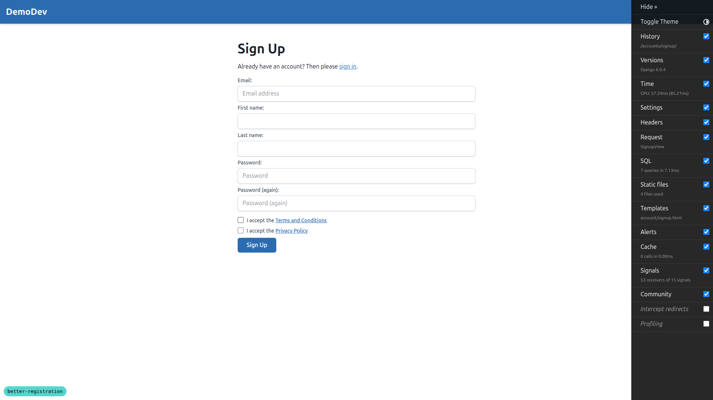

- Terms page — `screenshots/desktop_3_terms_page.png`

  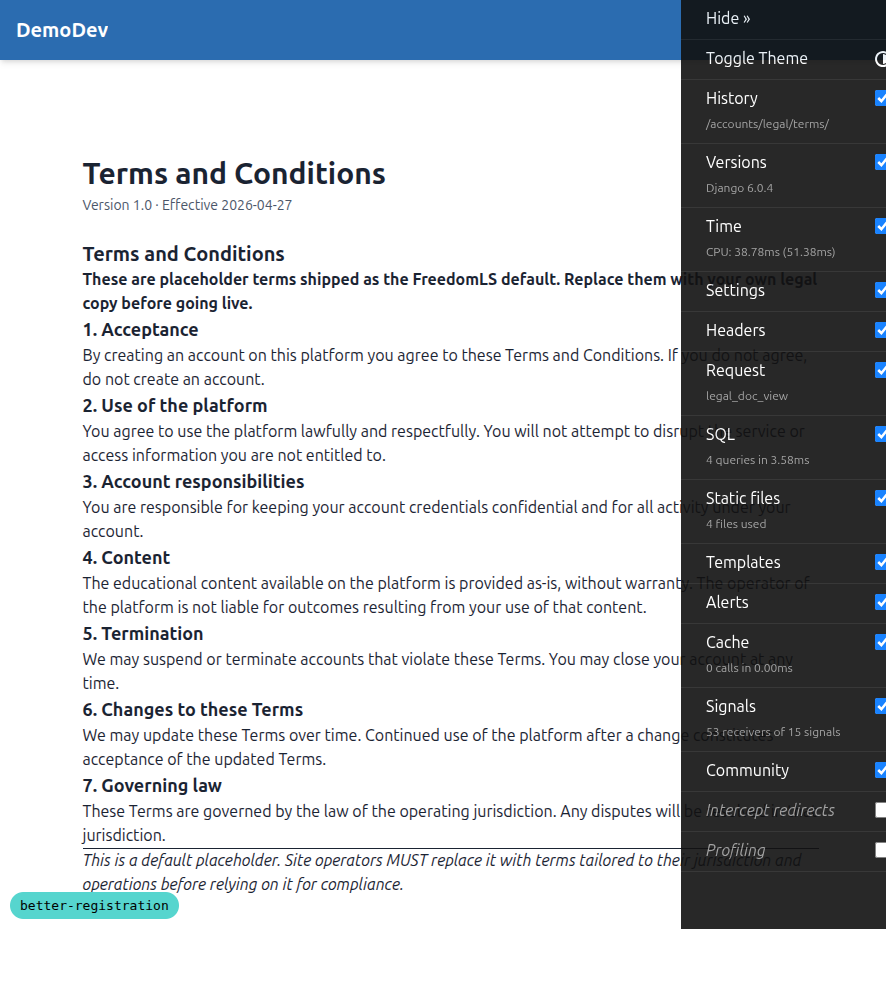

- Privacy page — `screenshots/desktop_3_privacy_page.png`

  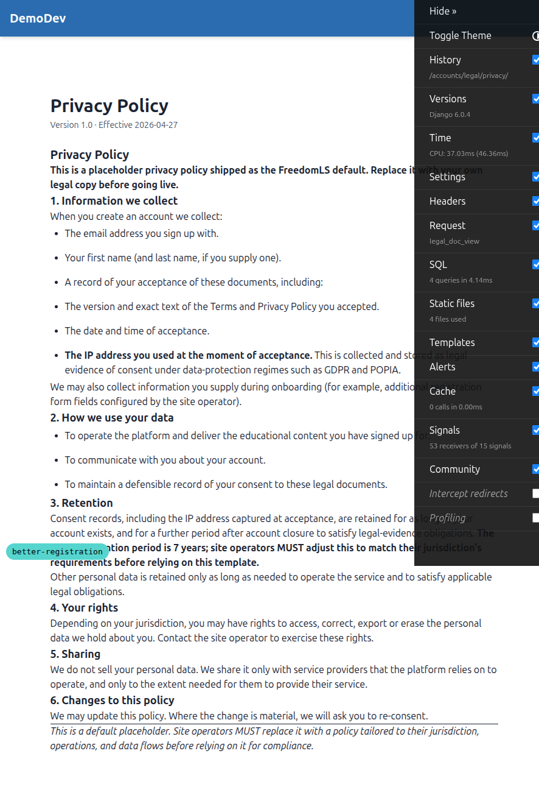

- Completion view — `screenshots/desktop_6_completion_view.png`

  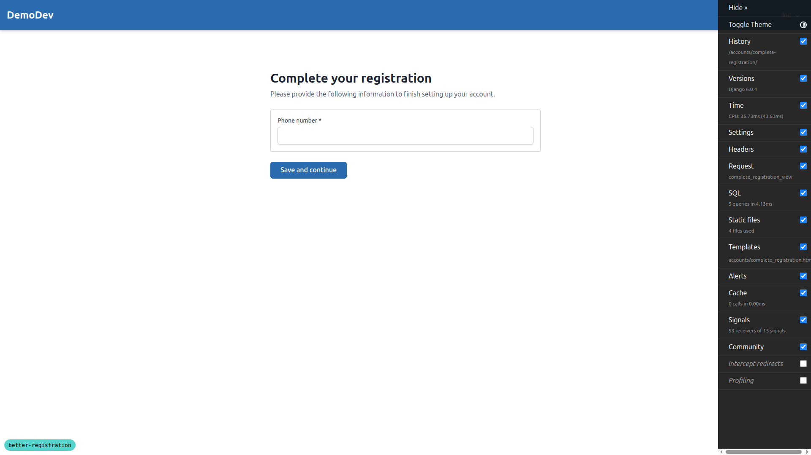

- Signup defaults (Test 1) — `screenshots/desktop_1_signup_defaults.png`

  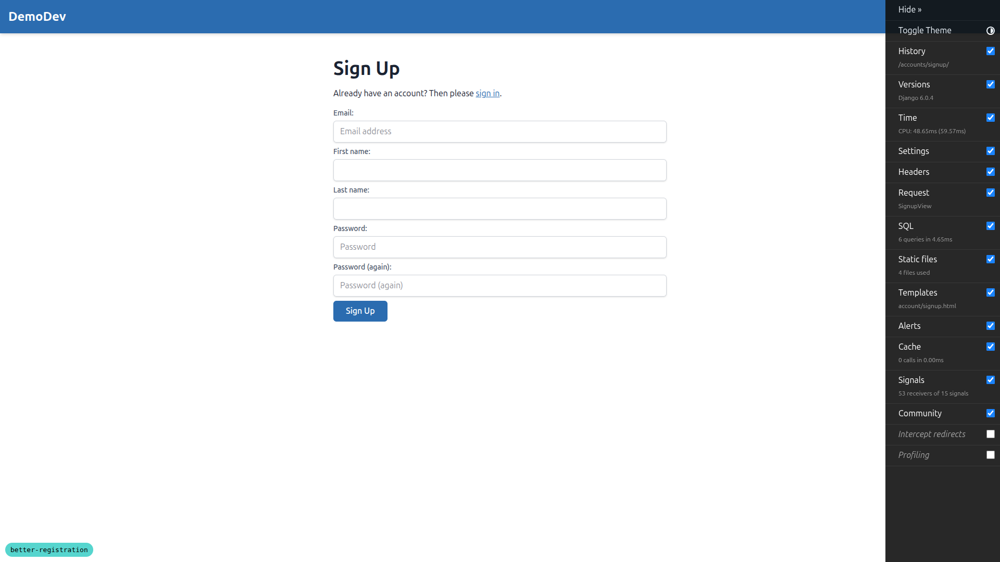

### Mobile (375×812)

- Signup with consent — `screenshots/mobile_3_signup_with_consent.png`

  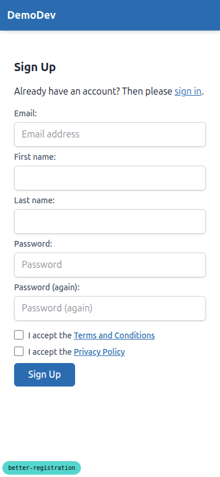

- Terms page — `screenshots/mobile_3_terms_page.png`

  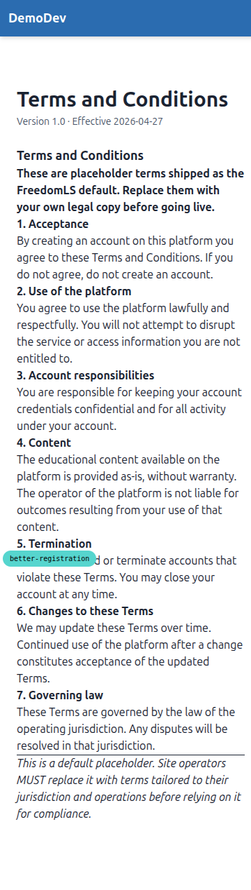

- Completion view — `screenshots/mobile_6_completion_view.png`

  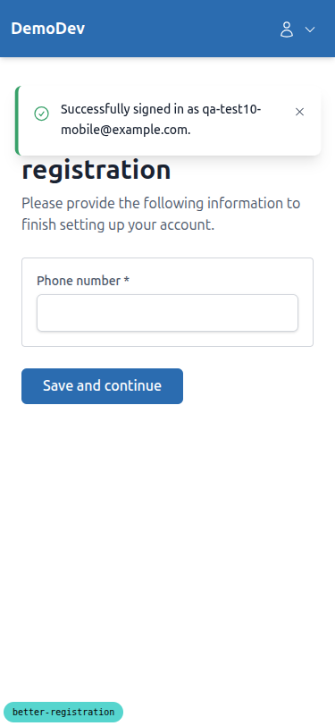

### Tablet (768×1024)

- Signup with consent — `screenshots/tablet_3_signup_with_consent.png`

  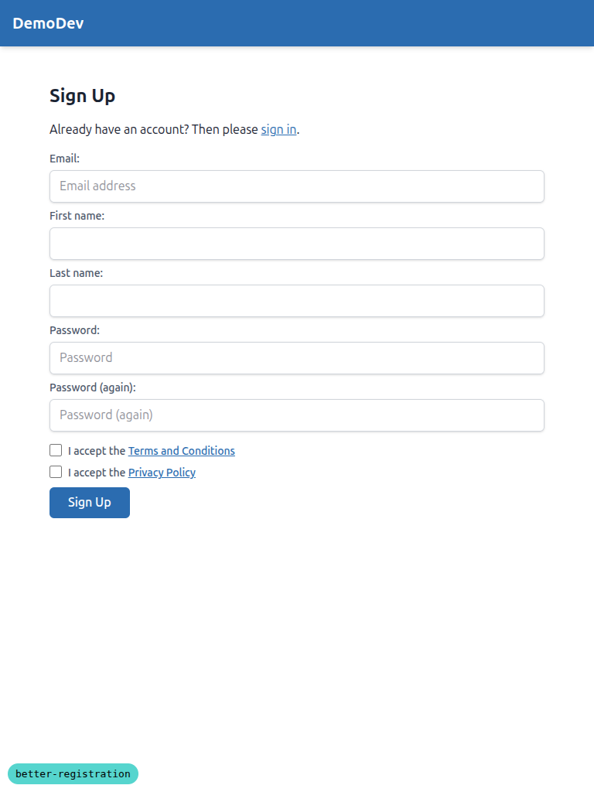

- Terms page — `screenshots/tablet_3_terms_page.png`

  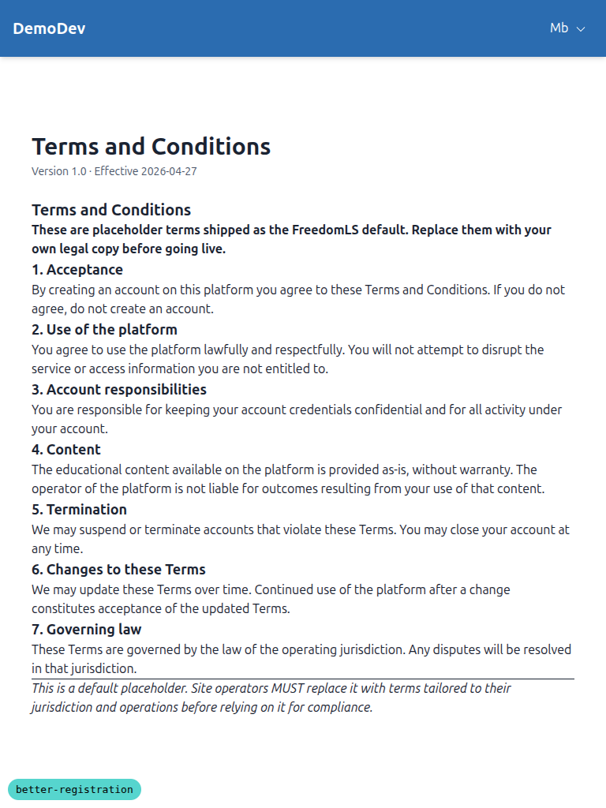

- Completion view — `screenshots/tablet_6_completion_view.png`

  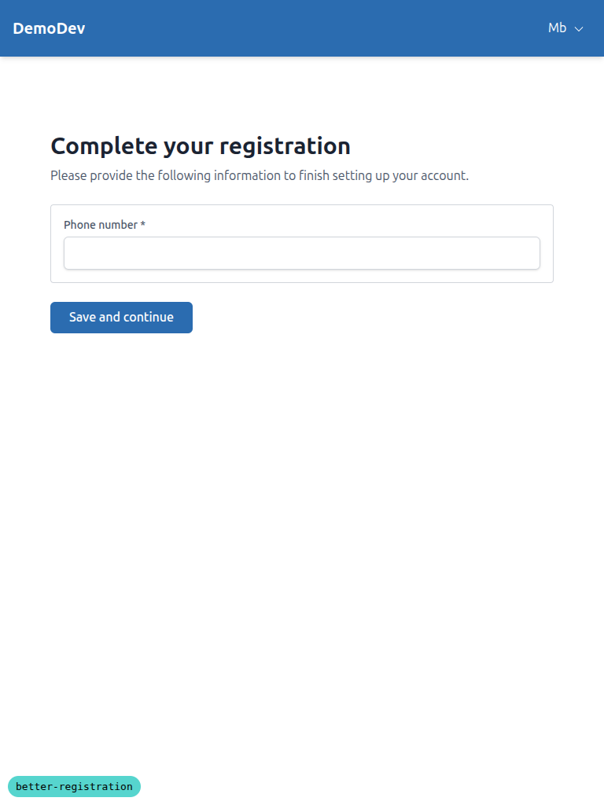

## Observations (not failures)

### 1. Mobile completion view: success toast overlaps the page heading

Visible in `screenshots/mobile_6_completion_view.png` — immediately after
landing on the completion view, the "Successfully signed in as …" toast is
positioned over the top of the "Complete your registration" heading. The
heading is partly obscured ("registration" line is visible, "Complete your"
is hidden behind the toast).

This is a layout/z-index issue with the toast banner on small viewports
rather than a feature regression. Not caused by this spec — same toast
component is used elsewhere — but worth flagging.

### 2. Transient signup-form anomaly observed during runserver reload

After committing the legal-doc rename for Test 4 and before fully restarting
the dev server, a single reload-in-flight render of `/accounts/signup/`
displayed the default allauth fields (email + email confirmation +
password + password confirmation) instead of the FLS site-aware fields
(first_name / last_name / no email confirmation). After explicitly killing
the server and starting a fresh `manage.py runserver`, the form rendered
correctly and stayed correct for the rest of the session.

I could not reproduce this on demand. It looks like a stat-reloader race
where the AppConfig that wires up `ACCOUNT_FORMS["signup"] =
SiteAwareSignupForm` had not been re-imported yet. No persistent bug, but
an item to keep an eye on if it shows up again — the consent / first-name
work in this spec touches the signup form, so if the form falls back to
allauth's default we lose both name capture and consent capture.

### 3. mypy pre-commit hook crashes (pre-existing tooling issue)

When committing files of any kind (used to seed test data — see "QA setup
notes" below), the `mypy` hook fails with
`error: INTERNAL ERROR ... Error constructing plugin instance of
NewSemanalDjangoPlugin`. This affects every commit that includes Python
files, regardless of content. Direct `uv run mypy …` works. This is a
django-stubs / mypy plugin loading issue in the local toolchain, not
something introduced by this spec, and should be tracked separately.

## QA setup notes

- The `legal_docs/_default/terms.md` and `legal_docs/_default/privacy.md`
  files were untracked at the start of this run. The legal-doc loader
  reads `git show HEAD:legal_docs/...`, so untracked files are invisible
  to it and the W001 system check fired even though the files existed on
  disk. To enable the QA, the docs were committed to the worktree branch
  in commit `218a72d`. Test 4 used a follow-up rename commit (`776397a`)
  and revert (`c57e16e`).
- Created via the shell: a `SiteSignupPolicy` for the DemoDev site, plus
  several QA users (`qa-test1-blank@`, `qa-test2-noname@`,
  `qa-test3-tcs@`, `qa-test6-incomplete@`, `qa-test8…@`, `qa-test9-pw@`,
  `qa-test10-mobile@`).
- `additional_registration_forms` was pointed at the existing test fixture
  `freedom_ls.accounts.tests._completion_view_fixtures.PhoneNumberForm`.
  The fixture stores accepted phone numbers in process-local state; this
  is fine for QA but means the data does not persist past a server
  restart.

## Pass criteria

All 12 tests passed. Screenshots captured at the three required
viewports. No browser console errors at any step.
