# QA report — 3a. seam_qa

Plan: `frontend_qa_seam.md` — where the `form_engine` split and the `CourseProgress` re-key meet.

---

## Methodology

Manual Playwright MCP walkthrough at desktop 1920x1080. No mobile or tablet interaction occurred in
this run. Screenshots were collected into `screenshots/` beside this report as the walkthrough
proceeded; every image this report references by basename exists in that directory.

Before any test step, the database was dropped, recreated, migrated and re-seeded per the plan's
§0.1. The rebuild was necessary rather than a formality: the worktree's database held residue from
the sibling `3c. form_engine_regression_qa` run and was missing the standard-markdown course. After
the rebuild, `showmigrations freedom_ls_form_engine` showed all three migrations applied, and the
stale-content-type check returned an empty list. All §0.1 seed commands exited 0 with no traceback,
and `qa_create_report_cohort` / `qa_complete_form` no longer hit the 0.1b `site_id` `IntegrityError`.

The database was rebuilt and re-seeded a second time after §S8, as the plan requires: `danger_content_delete
--yes` clears the whole content/progress chain, so §0.1 was re-run in full afterward, and
`recalculate_progress_percentages` finished with "Recalculated 25 records, updated 0", leaving the
database in the documented fixture state for the next plan.

## Diff scoping

Scoping class: **FULL**. Changed files driving that classification included template partials
(`course_progress_panel.html`, `course_finish.html`, `course_topic.html`, `course_list.html`,
`delete_confirmation.html`, `reports/partials/*.html`) plus roughly 120 `.py` files across
`learner_progress`, `form_engine`, `learner_interface`, `reports` and `educator_interface`.

Despite the FULL classification, **mobile (plan step 8) and tablet (plan step 9) passes were not
run.** The test plan states plainly, at the top: "Viewports: desktop only. The mobile and tablet
passes for all three QA runs are owned by `3c. form_engine_regression_qa/`." The plan's own viewport
scope governs here, not the diff class, so those passes were deliberately skipped rather than missed.

## Smoke gate

Result: **pass**. Two pages were loaded before the matrix began: the dashboard
(`http://127.0.0.1:8352/`, logged in as `demodev@email.com`) and the primary changed page, the course
player at `http://127.0.0.1:8352/courses/qa-question-types-course/`. No failure URL or reason was
recorded.

---

## Results by section

### S1. The join row exists, and the recalculation credits it

Run as `demodev@email.com` against `qa-question-types-course`.

- **S1.1** (pass) — Dashboard card and course outline both read 0% before any attempt. CourseProgress
  `faacfa4f-fad5-449d-aa5f-4215dfc4fcf8`, granted by individual `learner_registration`
  `0a686711-1067-40cf-99b6-b5c45fa24670`, no cohort registration involved.
- **S1.2** (pass) — Answered all four question types twice. First sitting scored 25% (1/4), "Quiz not
  passed" (pass mark 50%), with a "Review incorrect answers" panel. Retried, scored 50% (2/4), "Quiz
  passed!".
  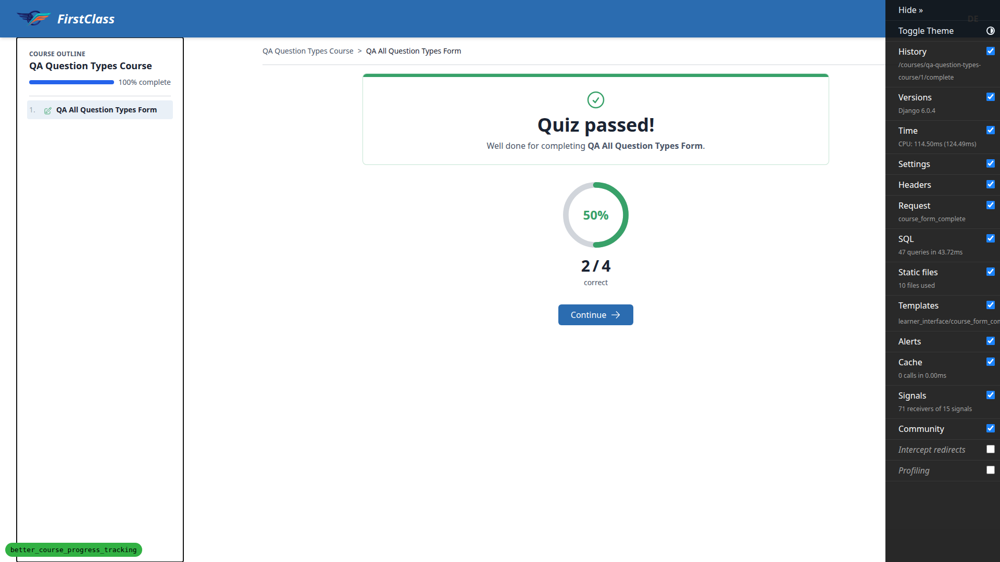
- **S1.3** (pass) — Percentage moved 0% → 100% on the course outline immediately after the passing
  sitting. After the earlier failed sitting it had stayed at 0%, correctly reading "Needs retry" — a
  failed quiz is not progress.
  
- **S1.4** (pass) — Admin's Course form attempts list shows exactly one row per sitting, not two per
  sitting. Each row names CP `faacfa4f`, the placement ("QA Question Types Course - QA All Question
  Types Form (order=0)"), and the form. CFA `803fe73c` (fp `1eb01236`, passed) and CFA `419188ab`
  (fp `e443d7a9`, failed). Every FormProgress for demodev has exactly one join row in the DB.
  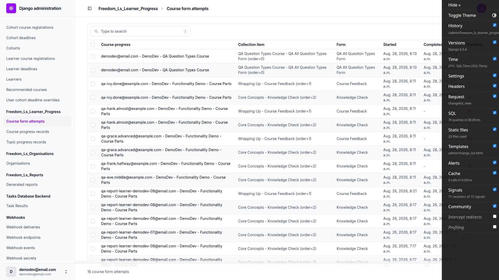
- **S1.5** (pass) — CP `faacfa4f` shows `progress_percentage=100`, matching the browser. Its
  `last_accessed_time` stayed frozen at `2026-08-28 08:12:02.542754+00:00`, the moment the item page was
  opened, and was **not** bumped by either submission (08:13:36, 08:14:08). Read-timestamp semantics
  hold as documented.

### S2. Two grants, one course, one quiz — the core of the overlap

Cara Learner (`cohort.learner@example.com`), who holds a `Learner` row in both RPAS Training and
Northside, was given a second grant on `functionality-demo-course-parts` so both organisations reach
the same course.

- **S2.1** (pass) — Added a LearnerCourseRegistration (learner = Cara's Northside Learner
  `af147f4b-04b3-4750-ad7b-476640b6033c`, collection = `functionality-demo-course-parts`), reg
  `e710cb16-0614-4ff2-ad92-e498fca57b74`. This produced two CourseProgress rows for that course:
  cohort-granted CP `84f2a89b-f95a-4064-8bfc-b62290916c0e` (cohort_registration `20b8522b`, Year 9
  Maths) and Northside individual CP `e5913fe3-607a-4308-9f97-0dcef3e6cae2` (learner_registration
  `e710cb16`), both at 0% with no attempts.
  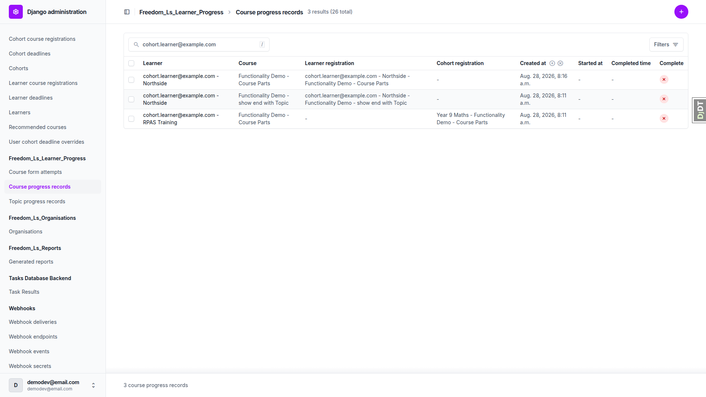
- **S2.2** (pass) — Logged in as Cara. The course outline panel carries an explicit "RPAS Training"
  organisation badge, so the resolved grant is visible to the learner. Answered the Knowledge Check
  correctly and scored 100% (>= 80% pass mark).
  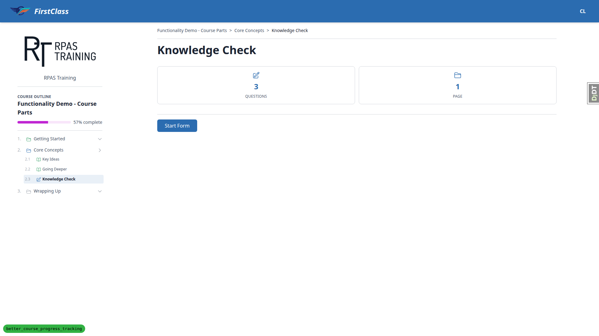
- **S2.4** (pass) — **The core check.** Exactly one new CourseFormAttempt, `dde81345-907f-40f5-bad8-8b8d18a04d34`
  (fp `7a48ae72`, form `knowledge-check`, collection item `6bf5784d` order=2), and its course_progress
  is the cohort-granted CP `84f2a89b`. No row against the Northside record, and not two rows — the
  failure this whole change exists to prevent did not occur.
  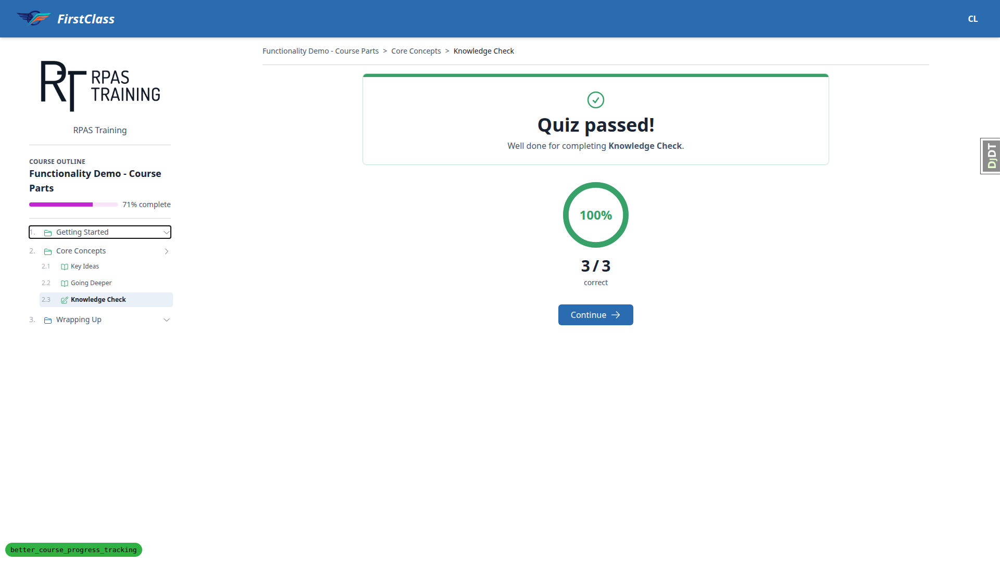
- **S2.5** (pass) — CP `84f2a89b` moved 0% → 71%, `started_at` 08:17:32, fresh `last_accessed_time`
  08:17:52, `last_accessed_item` `6bf5784d`. CP `e5913fe3` (Northside) is completely untouched: 0%,
  `started_at=None`, `completed_time=None`, `last_accessed_item=None`. Perfect isolation between the
  two grants.
  
- **S2.6** (pass) — Cara's dashboard lists "Functionality Demo - Course Parts" exactly once despite two
  active grants and two CourseProgress rows, showing 71% (the RPAS record she is actually working in,
  not the untouched 0% Northside one). "In progress", "Next up: Wrapping Up".
  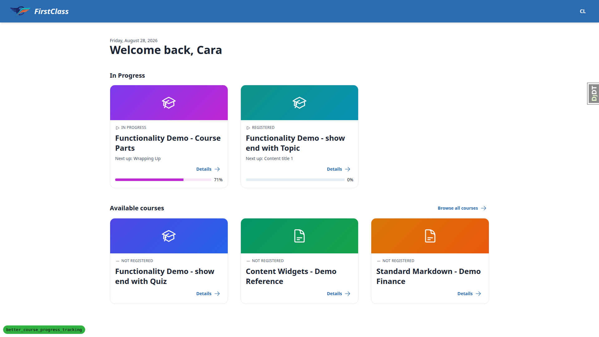
- **S2.7** (pass) — The Knowledge Check's "Previous attempts" list shows exactly the one sitting Cara
  just took (28 Aug 2026, 100%, 3/3); nothing from another record leaked in. Noted at the time as a
  weak test of record scoping on its own, since only one attempt existed anywhere — the stronger case,
  where Cara resolves to a different record entirely and must see an **empty** list, is covered by
  S4.4 and reconfirmed incidentally under S10 (see General notes).
  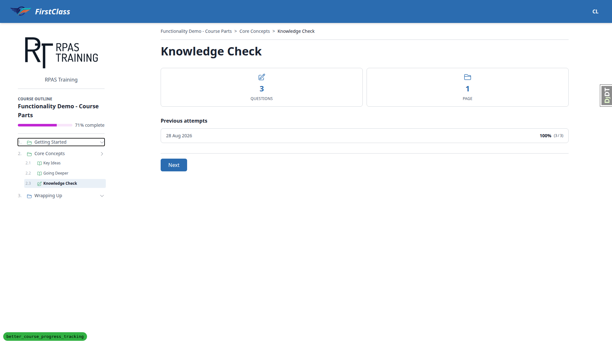

### S3. Attempts are keyed on placement, not on the form

- **S3.1** (pass) — Added a second ContentCollectionItem placing the same Knowledge Check form
  (`eec5dcb1`) into Core Concepts at order=3: item `29000136-c932-476e-983e-4956addd4da1`.
- **S3.2** (pass) — As Cara, the outline shows Knowledge Check twice: item 2.3 "Completed" (the
  placement she passed) and item 2.4 "Not started" (the new placement). One tick marking both would be
  the defect; it did not happen. Core Concepts correctly reverted to "In progress" and Wrapping Up
  re-locked.
  
- **S3.3** (pass) — Visiting `/courses/functionality-demo-course-parts/finish/` without sitting the
  second placement rendered "Course not complete" / "Not finished yet", with a "Still to do" list
  naming the outstanding Knowledge Check and a link to it. Passing one placement did not satisfy the
  other.
  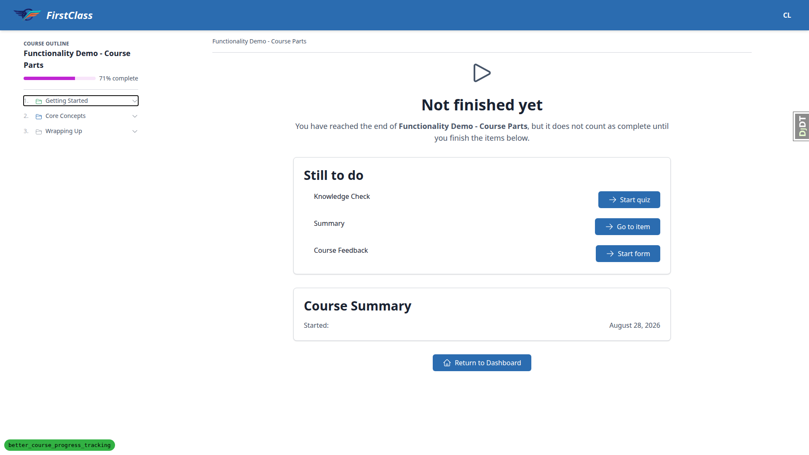
- **S3.4** (pass) — Sat and passed the second placement; the finish page then rendered "Course
  complete". Course form attempts now shows two knowledge-check rows against the same record CP
  `84f2a89b`, each with its own collection item: CFA `dde81345` → item `6bf5784d` (order=2) and CFA
  `b5f9b424` → item `29000136` (order=3), plus CFA `3f64afad` for course-feedback at item `3e6c86a9`.
  Attempts are keyed on placement, not on the form. Northside CP `e5913fe3` remained 0% and untouched
  throughout.
  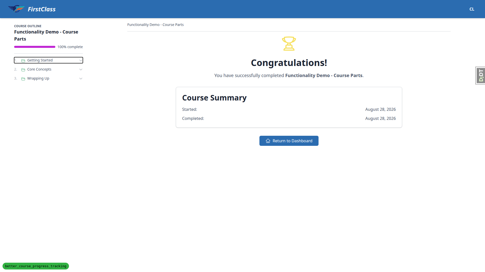
- **S3.5** (pass) — Removed the extra collection item `29000136` afterward to restore the documented
  fixture. The admin **allowed** this delete (unlike the S7 PROTECT cases), cascade summary listing
  only "Content collection items: 1". `CourseFormAttempt.collection_item` is `null=True,
  on_delete=SET_NULL`, so CFA `b5f9b424` survived with `collection_item=NULL` rather than being erased
  or blocking the delete. Verified this broke nothing: the RPAS cohort report generated to Ready, the
  educator cohort panel and admin both rendered, the runserver log held zero Traceback and zero
  RelatedObjectDoesNotExist. CP `84f2a89b` correctly recomputed back to 100% over the restored 7-item
  course.

### S4. Resume is scoped to the record, and the credit is frozen at the start

- **S4.setup** (pass) — `functionality-demo-show-end-with-quiz` had no registrations of any kind, so
  S4 could not run as written. Created CohortCourseRegistration
  `fcff523b-d1b6-4aa8-ae11-bbcd38673a56` (RPAS Training / Year 9 Maths) and LearnerCourseRegistration
  `f7694bc5-6618-497b-a5b9-fa854af50d3d` (Cara's Northside Learner), minting CP `a1e13559-7b88-4e56-9039-721293490502`
  (cohort-granted) and CP `175586cd-5338-420b-ae5f-fe6a57fcfed8` (individual).
- **S4.1** (pass, plan drift corrected) — The plan named the Mid course Quiz for the resume test, but
  that form is `submit_on_exit=True`, so navigating away auto-submits it (the attempt came back
  complete at 50%, 3/6, "Try Again"). Re-ran S4's substance on the End course Quiz (item 4, 2 pages,
  `submit_on_exit=False`): answered page 1's three questions, advanced to page 2, navigated away
  without finishing.
- **S4.2** (pass) — Returning to item 4, the start screen offers "Continue Form" linking to
  `/4/fill_form/2` — the page left, not a fresh attempt. Page 1 shows "3 of 6 answered" with all three
  page-1 radios still checked.
  
- **S4.3** (pass) — Deactivated CohortCourseRegistration `fcff523b` in the admin, confirmed
  `is_active=False`.
- **S4.4** (pass, wording deviation, essence held) — Cara now resolves to Northside CP `175586cd`. The
  half-finished attempt is not offered. Requesting `/4/` directly redirects to the course detail page,
  outline entirely "Not started / Locked" (item 4 Locked). The plan's wording expects "a fresh start
  screen"; what actually happens is a redirect to course detail, because the new record has no
  progress and sequential unlocking gates item 4. The essential assertion holds regardless: none of the
  other record's work is visible. FormProgress `c973a05a-7f5b-4b6b-9d78-1ccb2d2e09e2` still exists,
  `completed_time=None`, all 3 QuestionAnswer rows intact, and its CFA
  `6fcb60a2-b482-423d-8818-10708be962a8` still points at CP `a1e13559` and item `5741408c`.
  Re-resolving destroyed nothing.
  
- **S4.5** (pass) — Reactivated the cohort registration. Cara is back on the RPAS record (badge "RPAS
  Training", 75% complete), item 4 again offers "Continue Form" → `/4/fill_form/2`, the original
  half-finished attempt at the exact page she left. Credit stayed frozen to the record the attempt was
  minted against across a full deactivate/reactivate cycle.
  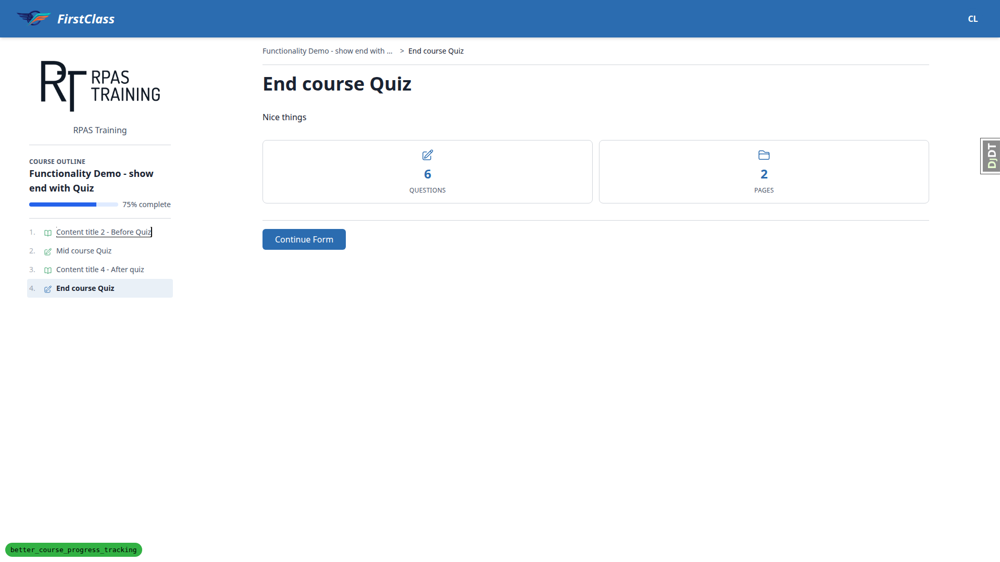

### S5. No registration means no attempt is minted

- **S5.1** (pass) — Logged in as Nell Unregistered (`no.reg.learner@example.com`), a Learner in RPAS
  Training with no enrolment of any kind. Login succeeded, dashboard rendered.
- **S5.2** (pass) — Guessed `/courses/functionality-demo-course-parts/5/start_form` directly; turned
  away with a redirect to that course's detail page. Not a 500, not a 404, no questions shown.
  Repeated for `/courses/functionality-demo-show-end-with-quiz/2/start_form` with the same clean
  redirect.
  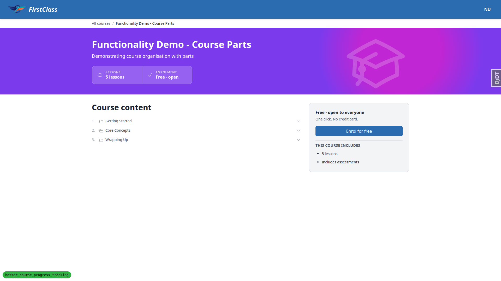
- **S5.3** (pass) — After all four URL guesses, Nell has CourseProgress 0, FormProgress 0,
  CourseFormAttempt 0, TopicProgress 0. `form_start`'s refusal to mint an attempt without a course
  progress record holds; nothing was written speculatively.
- **S5.4** (pass) — Guessed a later item's player URL,
  `/courses/functionality-demo-course-parts/5/`; redirected to course detail with no progress row
  written, consistent with the S5.3 counts.

The runserver log checked at the end of S5 held zero Traceback and zero RelatedObjectDoesNotExist
lines, and no 500 responses; the only 404 seen was `/favicon.ico`.

### S6. A sitting outside a course must not raise

- **S6.1** (pass) — Created FormProgress `38c9fa28-e8af-483e-980e-8e869c72ee27` by hand in the admin
  (user `solo.learner@example.com`, form "Course Feedback Survey" — placed in no course), no
  CourseFormAttempt. Saved cleanly, no traceback, no RelatedObjectDoesNotExist, `site_id=3` populated
  correctly (the 0.1b `site_id` `IntegrityError` did not return). `completed_time` is deliberately
  read-only on `FormProgressAdmin` — a source comment states only `FormProgress.complete()` may finish
  an attempt, because that is what sends `form_attempt_completed` — so it was completed through that
  real path instead of by editing the admin form.
- **S6.2** (pass) — `FormProgress.complete()` on the join-row-less attempt returned silently — no
  RelatedObjectDoesNotExist, no exception of any kind — and stamped `completed_time`. No percentage
  moved anywhere: solo.learner's only CourseProgress (`bdcc4962`, a different course) stayed at 0%, and
  Cara's five CourseProgress records were byte-identical before and after (100 / 0 / 75 / 0 / 0). A
  standalone sitting credits nothing.
- **S6.3** (pass) — runserver log across the whole step: zero occurrences of Traceback and zero of
  RelatedObjectDoesNotExist, no exception swallowed into a 500.

### S7. Deleting content that has been answered is refused

- **S7.1** (pass) — Deleting the Knowledge Check form in the admin is refused: "Cannot delete form",
  body naming every dependent FormProgress row, each linked. No confirm button, no cascade; answers
  were not erased. `FormProgress.form` PROTECT is doing its job.
  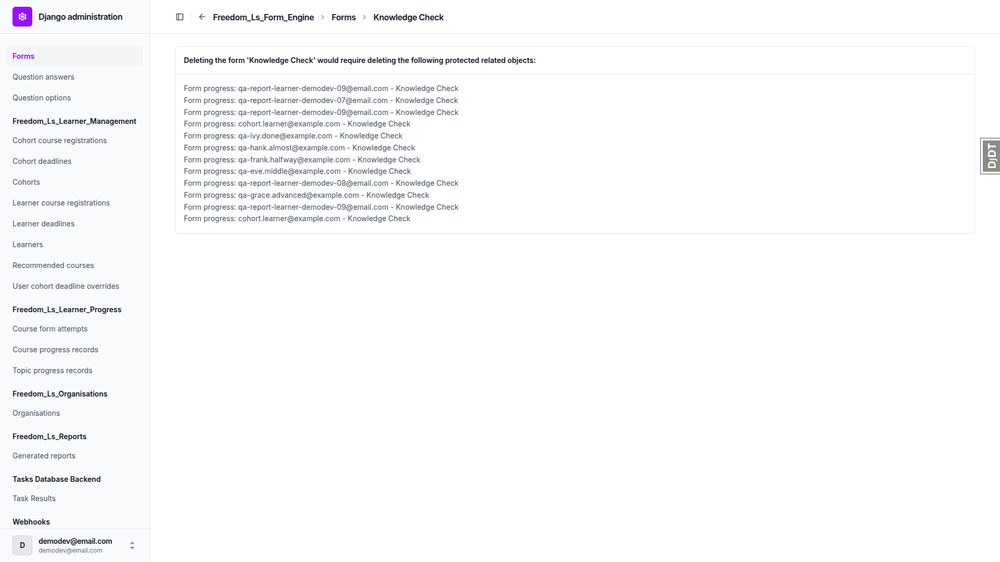
- **S7.2** (pass) — Deleting the topic "Welcome" (`0eb87da8`), which has TopicProgress against it, is
  refused: "Cannot delete topic", protected-object list of 17 Topic progress records, including Cara's
  RPAS one.
- **S7.3** (pass) — Deleting LearnerCourseRegistration `e710cb16` (Cara's Northside grant on Course
  Parts) is refused, naming the exact CourseProgress record it granted: "Course progress record:
  cohort.learner@example.com - Northside - Functionality Demo - Course Parts", linking to CP
  `e5913fe3`.
- **S7.4** (pass) — Deleting the RPAS Training "Year 9 Maths" cohort (`53f3c505`) is refused with a
  protected-object message listing all 6 course progress records it granted — not a 500. Includes
  Cara's CP `84f2a89b` and CP `a1e13559`.
  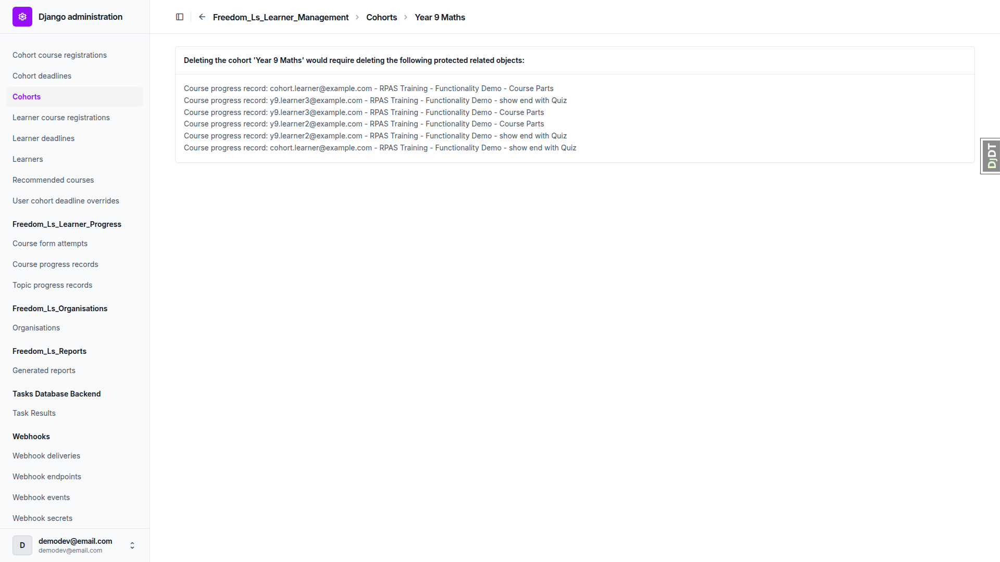
- **S7.5** (pass) — Educator interface delete dialog on that cohort renders the exact plain sentence
  the plan specifies: "This cohort cannot be deleted because it still has 6 course progress records."
  No Delete button — only Close — and no cascade list. The count matches the admin's protected-object
  list exactly.
  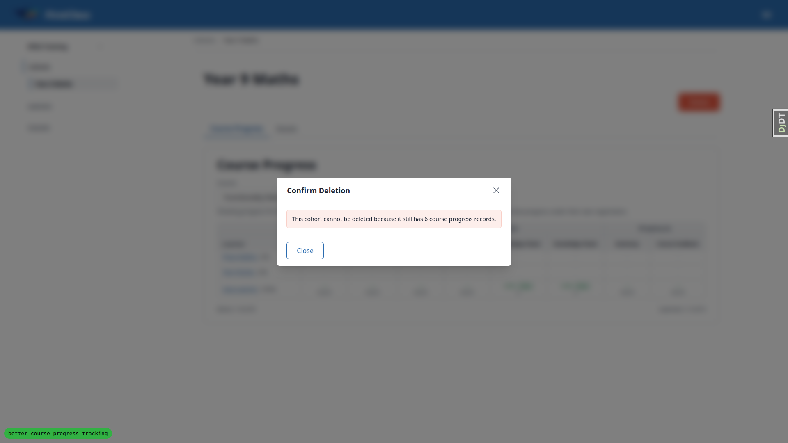
- **S7.6** (pass) — A cohort with no granted progress (RPAS Training / Year 10 Science, `2d895366`)
  gets the ordinary dialog instead: "Are you sure you want to delete Year 10 Science?" with Cancel and
  a working Delete button. The blocked message is correctly not shown for everything. The delete was
  not confirmed, to preserve the fixture.
  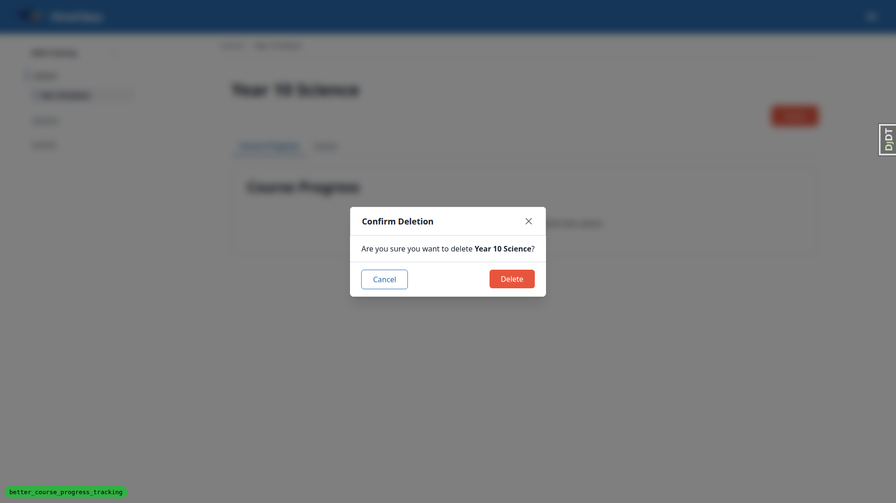

### S8. `danger_content_delete` clears the whole new chain

- **S8** (pass) — Run last, after every other step, with 29 FormProgress, 28 CourseFormAttempt and 31
  CourseProgress rows in the database. Completed without a ProtectedError — the regression this step
  exists to catch did not occur. Verified afterward that Course, Topic, ContentCollectionItem, Form,
  FormProgress, QuestionAnswer, CourseProgress, CourseFormAttempt and TopicProgress are all at 0, while
  Learner (92), Cohort (15) and User (100) survived — the documented contract for a content reset. The
  whole of §0.1 was then re-seeded: all commands exited 0 with no traceback, and
  `recalculate_progress_percentages` finished with "Recalculated 25 records, updated 0".

### S9. Cohort reports only see attempts sat under the cohort registration

- **S9.1** (pass) — `qa_complete_form DemoDev --cohort-name "QA Report Cohort" --form-slug
  knowledge-check` exited 0: "Created 6 completions for form Knowledge Check in cohort QA Report
  Cohort." No traceback, no `site_id` IntegrityError. Minor plan drift, cosmetic only: the plan expects
  the command to also report how many learners it skipped; it prints only the created count.
- **S9.2** (pass) — As superuser, ran "Generate cohort report" against QA Report Cohort. Generated
  without error, reached status Ready (report `147e3f2d-f541-472f-b64d-7f525b847e72`), downloaded as a
  478 KB PDF. Extracted text confirms the S9.1 quiz answers and scores are present: a per-learner
  matrix for "Functionality Demo - Course Parts" with all 9 learners and their completion percentages
  (12%, 38%, 88%, 100%, 0%, ...), last item completed, and dates. The two Knowledge Check placements
  added in S3 appear as separate quiz columns, legended "KC = Knowledge Check" and "KC-2 = Knowledge
  Check" — the report is placement-keyed, consistent with S3.
  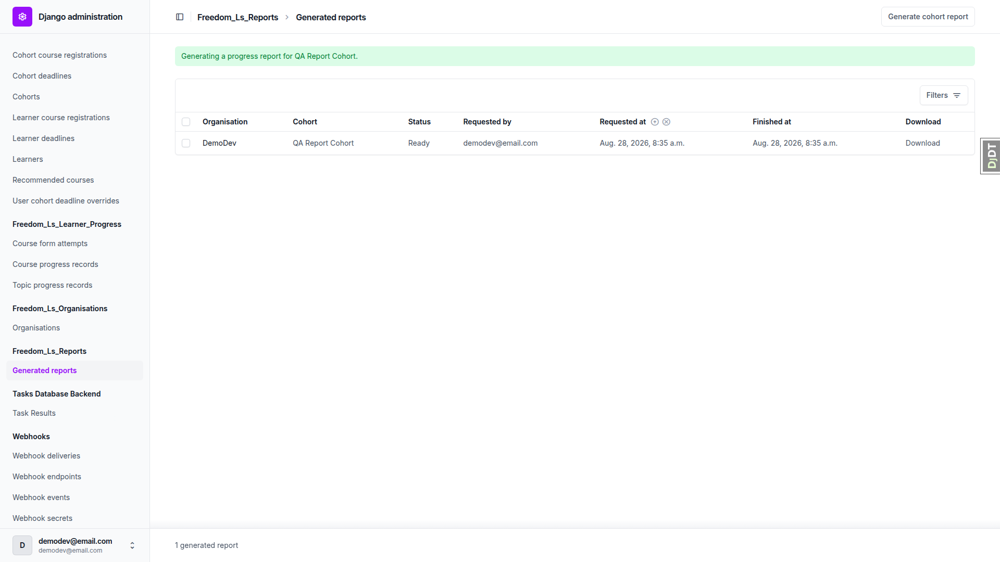
- **S9.3** (pass) — Gave cohort member `qa-report-learner-demodev-01@email.com` (Amara Okonkwo) an
  individual LearnerCourseRegistration `44373d08` for `functionality-demo-course-parts`, minting CP
  `d58760da`. `CohortMembership` has no `is_active` flag and is not registered in the admin, so
  deactivating her cohort route required deleting membership `3aec5135` (delegated to
  `fls-dev:qa-data-helper` per Rule 2: 9 → 8 memberships, no ProtectedError, nothing else touched).
  With the membership gone, opening the course stamped `started_at` on the individual record `d58760da`,
  not on the cohort record `228b21d6`. Sat and passed the Knowledge Check: new CFA `de3d3135`
  (fp `82a82877`, `passed=True`) landed on the individual record `d58760da` (`cohort_registration=None`),
  which moved to 62%. The cohort record `228b21d6` kept only its old failed attempt and stayed at 0%.
- **S9.4** (pass) — Regenerated the cohort report. It still generated: status Ready (report
  `807f1461`), downloaded cleanly. The individual-route sitting does not appear — absent is correct, the
  cohort did not authorise that work. No crash; runserver log held zero RelatedObjectDoesNotExist and
  zero Traceback, so `fold_form_progress_rows` handled the row set without a join row reaching it. The
  learner disappears from the report entirely, rather than appearing with cohort-only figures, because
  the report enumerates `CohortMembership` and deleting the membership was the only per-learner way to
  deactivate the cohort route. The absence of the sitting is confirmed either way.
- **S9.5** (**FAIL**) — Cross-check fails for 3 of 8 learners. Educator Course Progress matrix vs
  cohort report PDF, same cohort, same course: Margot Thibault 75% vs 88% (7 of 8), Haruki Nakamura 75%
  vs 88% (7 of 8), Ines Ferreira 88% vs the report's tick-marked 100% (8 of 8). The other five agree.
  Staleness was ruled out: `recalculate_progress_percentages` was run, the stored values confirmed at
  75/75/88 and `completed_collection_item_ids` returning 6/6/7 of the course's 8 items, then a third
  report was generated — it still reads 88/88/100. The disagreement is in the report's own counting,
  not stale storage. See Bug B1.
  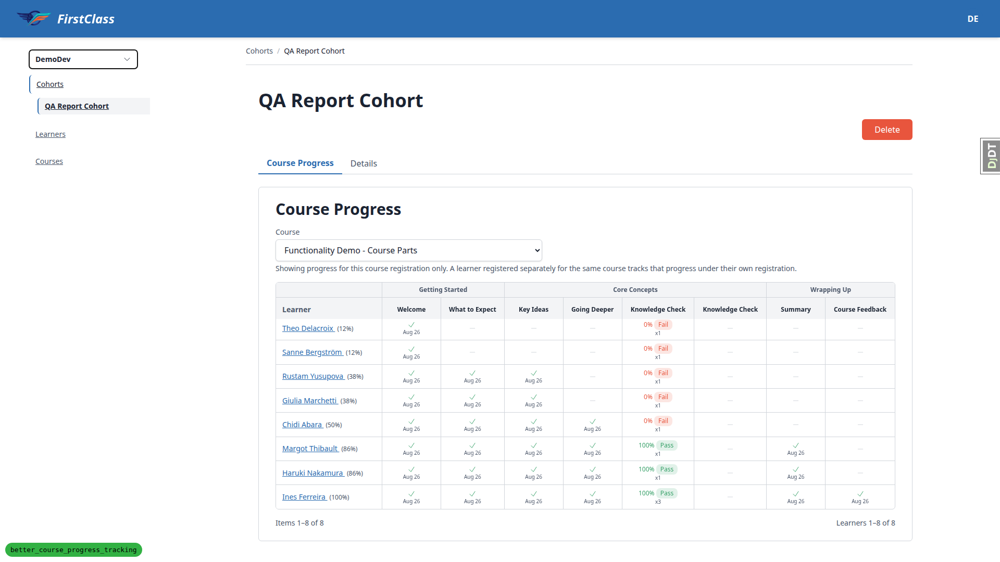

### S10. Deadlines and progress are keyed at different grains

- **S10.1** (pass) — `qa_create_soft_deadline DemoDev --cohort-name "Year 9 Maths" --course-slug
  functionality-demo-course-parts --item-slug knowledge-check --days-from-now 7` exited 0: "Created
  soft deadline on Knowledge Check: 2026-09-04 08:38." The two same-named "Year 9 Maths" cohorts did
  not make the command ambiguous, because only the RPAS one holds a registration for that course.
- **S10.2** (pass) — As Cara, the course table of contents shows a deadline icon reading "04 Sep"
  against the Knowledge Check, tooltip "Year 9 Maths" naming the granting cohort.
  
- **S10.3** (pass, documented design) — S3's second placement still existed, and the same "04 Sep /
  Year 9 Maths" badge showed against both placements — outline item 2.3 and item 2.4 — because
  `CohortDeadline` stores the form's pk while progress and attempts are keyed on the collection item.
  One deadline, two independent progress streams: the grain mismatch the plan asks to be recorded, not
  filed as a defect.
  
- **S10.4** (pass) — Set a hard past deadline (2026-08-25, -3 days) on the End course Quiz through
  Cara's resolved organisation (the RPAS Year 9 Maths cohort registration), on item 4, which she had
  not completed. Opening `/courses/functionality-demo-show-end-with-quiz/4/` directly redirected her to
  the course detail page, outline showing item 4 "Locked" with a "25 Aug / Year 9 Maths" deadline
  badge. Causally confirmed against S4.5, where the same URL served the "Continue Form" start page
  before this deadline existed.
  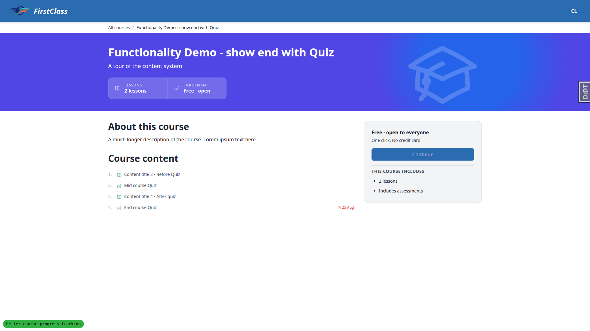
- **S10.5** (pass, the adversarial case) — Added a second hard past deadline (2026-08-25) through the
  RPAS cohort registration on item 1's topic, then deactivated the RPAS cohort registration so Cara
  resolves to her Northside individual grant, leaving both RPAS deadlines in place. Opening item 1
  served the content — no lockout. Outline header badge read "Northside" at 0% complete, no deadline
  badge against item 1. Item 1 was chosen deliberately because it is unlocked by sequence on the fresh
  Northside record, so a redirect could not be confused with a sequential lock. Deadline resolution is
  correctly scoped to the organisation Cara is actually studying through.
  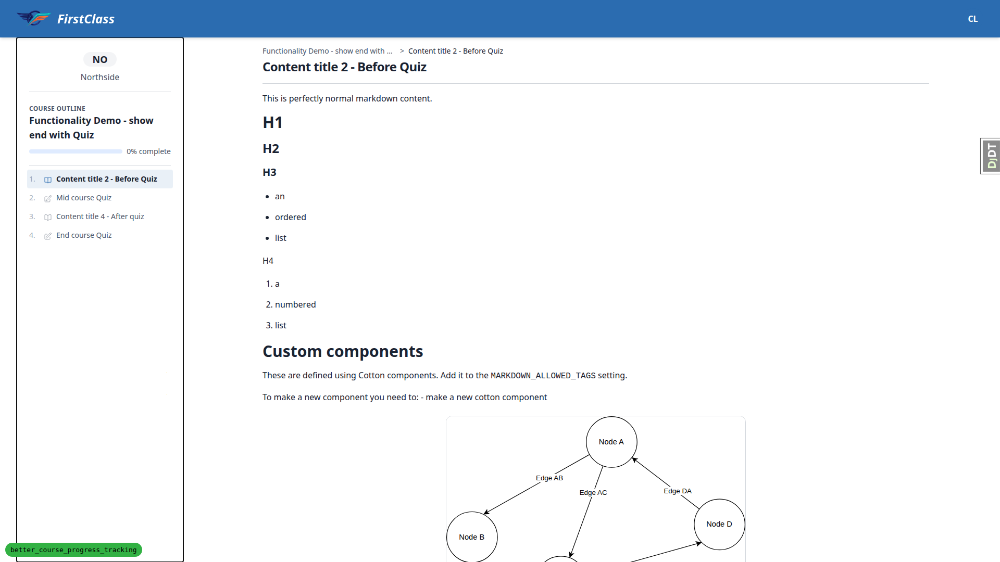
- **S10.6** (pass, behaves per design, flagged for judgment) — Completed item 1 on the Northside record
  to unlock item 2 by sequence, then added a hard past `LearnerDeadline` (`bc131e28`, 2026-08-25,
  `is_hard=True`) on the mid-course-quiz form through Cara's resolved Northside individual registration
  `f7694bc5`. She had already passed that exact quiz under the RPAS grant (CFA `ae249b66` on CP
  `a1e13559`, `passed=True`). Opening `/2/` redirected to the course detail page; the outline showed
  item 2 "Locked" with a "25 Aug" badge tooltipped "Individual registration". She is locked out of a
  quiz she has demonstrably passed, because completion is checked against the record she is currently
  in (Northside CP `175586cd`, no passing attempt) and not against the person. Records: passed under CP
  `a1e13559` (RPAS), locked out on CP `175586cd` (Northside). The badge correctly attributes its source
  ("Individual registration" here vs "Year 9 Maths" for cohort deadlines), and the RPAS deadlines were
  absent from this route throughout. See General notes for the design question this raises.
  

Incidental confirmation: on the Northside record, item 2 offered a fresh "Start Form" with an empty
previous-attempts list even though Cara has a passed sitting of that quiz on the RPAS record —
reinforcing S2.7 and S4.4 that attempts are scoped to the record, not the person.

---

## Bug B1: Cohort report counts a twice-placed form as complete at both placements, over-reporting completion and falsely marking a course complete

**Manifestations:** S9.5 (desktop)

**Expected:** A form placed twice in one course is two `ContentCollectionItem` rows and two
independent attempt streams, so a learner who has sat only the first placement should count as having
completed only that one. The learner-facing course outline already gets this right (S3.2: placement
2.3 reads Completed, placement 2.4 reads Not started), and `calculate_course_progress_percentage` /
`completed_collection_item_ids` agree — for CP `0f4added` (qa-report-learner-demodev-07) they return 6
completed of 8 items = 75%, matching the educator Course Progress matrix. The cohort report should
show the same 6 of 8 / 75%.

**Actual:** The cohort report PDF shows 7 of 8 = 88% for that learner, and for
qa-report-learner-demodev-09 (CP `4c948674`) it shows 8 of 8 with a tick and 100% — reporting the
course **complete** when she has never sat the second Knowledge Check placement. Every affected
learner is inflated by exactly one item: the duplicated placement.

**Root cause:** `freedom_ls/reports/gather.py:293`, in `_completed_items()`. It iterates the
flattened course items and, for a Form, looks up completion with key `(learner_id, item.id)` where
`item.id` is the **Form's** pk, not the `ContentCollectionItem`'s. When the same Form appears twice in
`all_items`, both entries hit the same `(learner_id, form_id)` key, so one completed sitting marks
both placements complete.

Reproduced on three independently generated reports (`147e3f2d`, `807f1461`, `6087e7da`), the last one
generated after `recalculate_progress_percentages` had brought all stored percentages up to date —
stale data is excluded as a cause. This is the "one tick marking both" defect the plan names in S3,
surviving in the reports path while the learner outline handles it correctly.

**Screenshots:**

---

## Bug status

| Bug | Status |
| --- | --- |
| B1 | **UNRESOLVED** — Cohort report counts a twice-placed form as complete at both placements, over-reporting completion and falsely marking a course complete (reason: red lane — needs a product decision on how a twice-placed form appears in an exported educator PDF, and a re-keying of the shared reports index; not a single mechanical fix) |

B1 was triaged to the red lane rather than auto-fixed. Green-lane conditions 1, 2, 3, 5 and 6 all hold: it is a real functional regression in code this branch touched (`reports/gather.py` and `reports/indexes.py` are both in the diff), it is unit-testable without a browser (`freedom_ls/reports/tests/test_gather.py` already exists), the root cause is inside the single `reports` app, no migration is involved, and it is not security-adjacent.

Condition 4 — "no product or UX decision is required" — fails. `ProgressIndex` keys form completions on `(learner_id, form_id)` throughout (`completed_attempts_by_learner_form`, `latest_by_learner_form`, `_quiz_result_for`), and `FormProgress` carries no placement at all; the collection item lives on `CourseFormAttempt`. Fixing this means joining `CourseFormAttempt` into the reports query and re-keying the whole index on the placement, which decides what educators see in an exported PDF: whether the `KC` / `KC-2` columns become genuinely independent quiz columns with independent scores and verdicts, and what happens to attempts whose `collection_item` is `NULL` — a state §S3.5 proved is reachable, since `ContentCollectionItem` deletion is `SET_NULL`. That is a design decision about an external deliverable plus a structural change with live edge cases, so no fixer was spawned and no commit was made.

---

## Plan corrections applied

Two corrections were made to `frontend_qa_seam.md` itself during this run, not just worked around:

1. **S4 step 1** named the Mid course Quiz for the resume test. That form is `submit_on_exit=True`,
   which makes "navigate away without finishing" impossible by construction — the attempt is submitted
   the moment the learner leaves the page. The plan's own §0.3 fixture table already records
   `submit_on_exit` against the Mid course Quiz, so this was an internal inconsistency in the plan, not
   a fresh discovery. S4 was rewritten to use the End course Quiz (item 4), which is two pages with
   `submit_on_exit=False` and is the form the test actually needs. The plan was also given the missing
   §0.1 setup: `functionality-demo-show-end-with-quiz` has no seeded registrations, so S4 now instructs
   creating the cohort and individual grants itself before steps 3–5, which need something to switch
   between.
2. **S6 step 1** told the tester to "mark it complete" in the admin. `completed_time` is deliberately
   read-only on `FormProgressAdmin`, with a source comment stating that only `FormProgress.complete()`
   may finish an attempt, because that is what sends `form_attempt_completed` — the signal S6 exists to
   exercise. The step was rewritten to complete the record through `FormProgress.complete()` instead,
   which is what the receiver contract is actually about.

---

## General notes

Observations below are not defects against any Expect in the plan. They are recorded for the owner to
judge.

- **Org badge missing on the course finish page.** The course outline panel shows the resolving
  organisation as a badge ("RPAS Training") on item player pages, useful for a multi-org learner, but
  the same panel on `course_finish.html` omits it. Cosmetic inconsistency; no Expect in this plan
  covers it.
- **Cohort picker ambiguity in the admin.** The report-generate form's cohort dropdown disambiguates by
  organisation ("Northside - Year 9 Maths" vs "RPAS Training - Year 9 Maths"). The
  `CohortCourseRegistration` admin's cohort picker does not — it renders two identical "Year 9 Maths"
  options with no way to tell them apart. On a branch whose whole point is multi-organisation grants,
  picking the wrong one silently grants the wrong org's cohort.
- **SET_NULL placement asymmetry.** Deleting a `ContentCollectionItem` that has answered work behind
  it is permitted and silently nulls the attempt's `collection_item` (S3.5), whereas S7 shows deleting
  the Form, Topic, `LearnerCourseRegistration` or Cohort behind the same work is refused. The
  `SET_NULL` is clearly intentional (`null=True` is declared on the field) and nothing crashed, but an
  author removing a placement quietly detaches real attempts from their position in the course, and the
  admin's delete confirmation lists only the collection item — not the attempts behind it.
- **`danger_content_delete` count mismatch.** Cosmetic only. The command's pre-flight census and its
  completion summary disagree: it counts "Courses: 6, Forms: 6, Collection Items: 30" then reports
  "Deleted 44 Courses, Deleted 113 Forms, Deleted 7 Collection Items". Every table verified at 0
  afterward, so the deletion itself is correct — the completion lines look like they print Django
  collector totals (which fold in cascaded child rows) against a census that counts only the named
  model. Confusing to read in a destructive command's output.
- **Console noise.** The Django admin emits a `favicon.ico` 404 and report-only CSP `unsafe-eval`
  warnings from `static/unfold/js/alpine/alpine.js` on every admin page. Pre-existing third-party admin
  noise, unrelated to this branch.
- **`completed_time` semantics.** CP `faacfa4f` read `progress_percentage=100` but `completed_time`
  stayed `None` after S1, because no course finish page had been visited for that course at that point.
  This resolved itself under S3: `CourseProgress.completed_time` is stamped by the course finish view,
  not by the percentage reaching 100 — CP `84f2a89b` got `completed_time=2026-08-28 08:22:22` only when
  `/finish/` was loaded. Correct behaviour, not a defect, but worth the owner knowing the two fields can
  diverge for a while.
- **Classifier block on `danger_content_delete`.** The first invocation was refused by the Claude Code
  auto-mode classifier when written as a pipeline (`command | grep | tail` plus an echo of `$?`).
  `Bash(uv run python manage.py danger_content_delete:*)` is explicitly allow-listed in
  `.claude/settings.json`, so re-running it bare, with no pipes or compound, succeeded. No user action
  needed; noted so a future run reaches for the bare form first.
- **S10.6 design wart.** Cara is locked out of the mid-course quiz under her Northside record even
  though she has demonstrably passed the identical quiz under her RPAS record (CFA `ae249b66` on CP
  `a1e13559`), because completion is checked against the record she is currently resolved to, not
  against the person. This is defensible per-organisation semantics — the RPAS grant should not carry
  privileges into Northside — but from the learner's seat it means passing a quiz for one employer does
  not carry to another, with no on-screen explanation of why the item is locked beyond the deadline
  badge itself. Worth a product decision on whether that is the intended experience.

---

status: ok · reason: 1 bug — 0 fixed, 1 unresolved (B1, red lane: product decision required); 41 of 42 checks passed; report rendered, 24 screenshots embedded and all resolve, 26 collected (the two extra are the Step 7 capture-check probe and the first, failed quiz sitting from S1.2)
