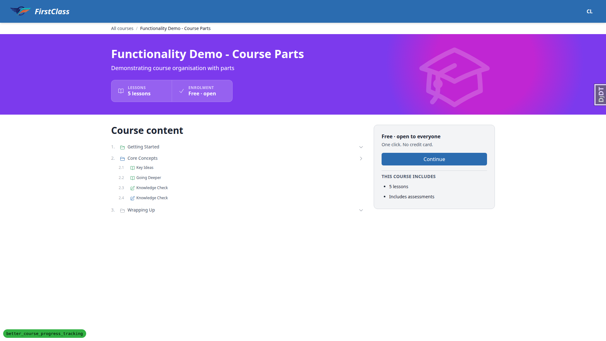
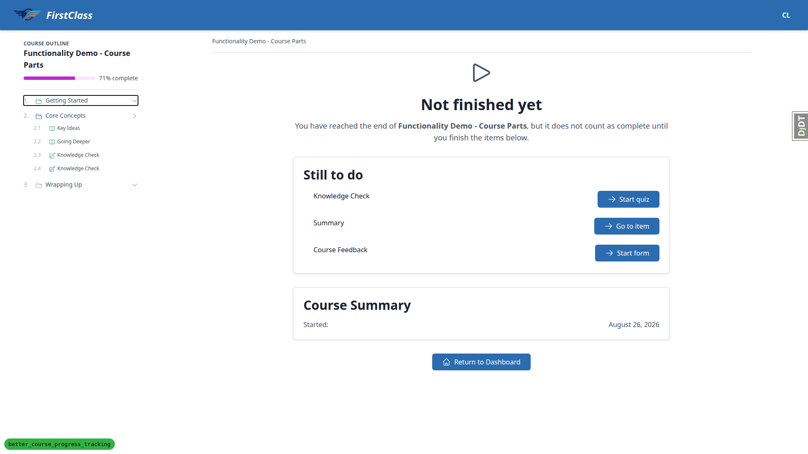

# QA Report — Seam QA (3a)

Manual QA run against `3a. seam_qa/frontend_qa_seam.md`, the "seam" plan for branch `better_course_progress_tracking`. The plan checks the join between a `form_engine` split already on `main` and this branch's re-keying of `CourseProgress` onto `Learner` plus the granting registration. As the plan frames it: "Every failure here is silent. Nothing 500s; a plausible percentage simply lands on the wrong record." This report is organised around that framing — which record things landed on, not just whether a page rendered.

## Methodology

Testing was performed manually through the Playwright MCP browser tools against a dev server on `http://127.0.0.1:8181`, desktop viewport 1920x1080 only. Screenshots were collected into `3a. seam_qa/screenshots/` alongside this report; every image referenced below exists in that directory.

Personas used, with explicit logout/login between each: DemoDev (`demodev@email.com`), Cara — a multi-organisation learner holding both a cohort-granted registration (RPAS Training / Year 9 Maths) and an individual registration (Northside) on the same courses, which is the persona that exercises the seam directly — Nell Unregistered (`no.reg.learner@example.com`, a Learner with no enrolment), `cohort.learner@example.com`, Olive Educator (organisation staff, `is_staff=False`), and the Django superuser for admin-only operations (protected-delete checks, report generation, hand-built fixture rows). Some steps also used the `fls-dev:qa-data-helper` agent and management commands (`qa_complete_form`, `qa_create_report_cohort`) rather than the browser, as the plan specifies.

## Diff scoping

The scoping gate fired class **FULL**, triggered by changes across `freedom_ls/educator_interface/templates/educator_interface/partials/course_progress_panel.html`, `freedom_ls/learner_interface/templates/learner_interface/course_finish.html`, `freedom_ls/learner_interface/templates/learner_interface/course_topic.html`, `freedom_ls/learner_interface/templates/learner_interface/partials/course_list.html`, `freedom_ls/panel_framework/templates/panel_framework/partials/delete_confirmation.html`, `freedom_ls/reports/templates/reports/partials/*.html`, plus roughly 120 further `.py` files across `learner_progress`, `form_engine`, `reports`, and `learner_interface`.

A FULL class would ordinarily require mobile and tablet passes as well. Those were **not** run here — not because the gate waived them, but because the test plan itself scopes this specific run to desktop only, assigning mobile (its Step 8) and tablet (its Step 9) passes to a separate plan, `3c. form_engine_regression_qa`. So the gap is deliberate plan scoping layered on top of a full-class diff, not an under-run.

## Smoke gate

**PASS.** Pages loaded: `http://127.0.0.1:8181/` and `http://127.0.0.1:8181/courses/qa-question-types-course/`. No failures recorded.

## Result summary

| Test ID | Status | Summary |
|---|---|---|
| S1.1–S1.2 | ✅ PASS | Failed sitting (25%, below pass mark) correctly did not complete the item; retry offered. |
| S1.3 | ✅ PASS | Passing second sitting (50%) moved course percentage 0% → 100% and flipped the outline item to Completed. |
| S1.4 | ✅ PASS | Exactly one `CourseFormAttempt` row per sitting, naming the right `FormProgress`, `CourseProgress`, and collection-item placement. |
| S1.5 | ❌ FAIL | `last_accessed_time` not refreshed on completion (137s stale) — see B2. |
| S2.1 | ✅ PASS | Adding an individual registration for a learner who already holds a cohort grant produced two independent, untouched `CourseProgress` records. |
| S2.2 | ✅ PASS | **Core assertion.** Completing a form credited exactly the cohort-granted record (cohort beats individual); one attempt row, right placement. |
| S2.2-step5 | ✅ PASS | Cohort record moved to 71%; individual (Northside) record stayed at 0%, completely untouched. |
| S2.2-step6 | ✅ PASS | Dashboard lists the course once, at 71% — the percentage of the record actually being worked. |
| S2.3 | ✅ PASS | "Previous attempts" showed exactly the one sitting just completed; no cross-record leakage. |
| S3.1–S3.2 | ✅ PASS | Same form placed twice; one placement's completion did not mark the other. Attempts are keyed on placement, not form. |
| S3.3 | ✅ PASS | Finish page correctly names the second, still-outstanding placement and links to it specifically. |
| S3.4 | ✅ PASS | Both placements passed independently produce two distinct `CourseFormAttempt` rows against the same `CourseProgress`; other-org record stayed at 0%. |
| S3-observation | ❌ FAIL | Course-part header read "Not started" while 3 of 4 children read "Completed" — see B1. |
| S4.1–S4.2 planned form | ⏭️ SKIP | Plan drift: `mid-course-quiz` has `submit_on_exit=True` and cannot demonstrate resume; re-run against `end-course-quiz`. |
| S4.1 credit-freeze | ✅ PASS | Even via the auto-submit path, credit froze correctly on the cohort-granted record; individual record untouched. |
| S4.2 | ✅ PASS | Resume ("Continue Form") offered the exact page left, with page-1 answers preserved, on `end-course-quiz`. |
| S4.3–S4.4 | ✅ PASS | Deactivating the cohort registration mid-attempt correctly hid the half-finished attempt (it belongs to the other record) and destroyed nothing. |
| S4.5 | ✅ PASS | Reactivating the cohort registration handed the original half-finished attempt straight back. |
| S5 | ✅ PASS | Unregistered learner guessing form/player URLs was redirected cleanly; zero progress rows of any kind were written. |
| S6 | ✅ PASS | A `FormProgress` with no `CourseFormAttempt` credited nothing; receiver structurally cannot raise `RelatedObjectDoesNotExist`. |
| S7.1 | ✅ PASS | Deleting a `Form` with answered `FormProgress` rows refused, readably, in admin. |
| S7.2 | ✅ PASS | Deleting a `Topic` with `TopicProgress` refused in admin. |
| S7.3 | ✅ PASS | Deleting a `LearnerCourseRegistration` that granted a `CourseProgress` refused, naming the exact blocking record. |
| S7.4 | ✅ PASS | Deleting a `Cohort` holding a registration that granted 9 records refused in admin. |
| S7.5 | ✅ PASS | Educator-interface delete dialog for the same cohort shows the plan's exact predicted sentence, Close only, no cascade list. |
| S7.6 | ✅ PASS | Educator-interface delete dialog for an unencumbered cohort shows the ordinary confirm/delete flow. |
| S8 | ⏭️ SKIP | HUMAN-RUN per plan; not executed — see General notes. |
| S9.1 | ✅ PASS | `qa_complete_form` ran to completion (previously died with `IntegrityError`) — confirms the 0.1b blocker is fixed. |
| S9.2 | ✅ PASS | Regenerated cohort report as superuser; ready, no error, byte size grew consistent with new completions. |
| S9.3–S9.4 | ✅ PASS | Report generation survived incomplete attempts, null scores, and orphaned (`collection_item=None`) attempt rows. |
| S9.3 limitation | ⏭️ SKIP | Could not build a genuinely completed sitting under an individual registration via admin (read-only timestamps/scores) — see General notes. |
| S9-incidental | ✅ PASS | DB-level uniqueness on `CourseFormAttempt.form_progress` confirmed (admin rejected a duplicate). |
| S9.5 | ✅ PASS | Educator Course Progress matrix agreed exactly with the database, including correctly excluding orphaned attempts. |
| S10.1–S10.2 | ✅ PASS | Course-level and item-level deadlines rendered correctly with the right tooltip and object reference. |
| S10.3 | ✅ PASS | Documented grain mismatch confirmed: a form-level deadline applies to both placements of a twice-placed form. |
| S10.4 | ✅ PASS | Hard past deadline on an uncompleted placement correctly locks and redirects. |
| S10.5 | ✅ PASS | Deadline on a registration the learner is not resolved through does not follow her; no badge shown. |
| S10.6 | ✅ PASS | Reverse case: hard deadline on the individual registration locks Cara out of a Knowledge Check she already passed under the cohort registration — documented design, flagged as a product question. |

## Bugs

### B1 — Course part status reads "Not started" while its own children read "Completed"

Manifestations: S3.1–S3.2 (desktop), S3.3 (desktop).

**Expected:** A course part whose children are partly complete summarises as "In progress." Before the second placement was added, Core Concepts correctly read "Completed" with all three children complete.

**Actual:** After a second placement of the Knowledge Check was added to the Core Concepts part, the part header flipped from "Completed" straight to "Not started" while three of its four children were still plainly labelled "Completed" (2.1 Key Ideas Completed, 2.2 Going Deeper Completed, 2.3 Knowledge Check Completed, 2.4 Knowledge Check Not started). The part header appears to take the status of the incomplete child rather than aggregating across children, so it states the opposite of the rows directly beneath it. Reproduced on both the course detail page and the player outline drawer. Display-only: no progress data was miscredited, and the underlying percentage (71%) stayed correct throughout.

### B2 — `last_accessed_time` is not refreshed when a form attempt completes

Manifestations: S1.5 (desktop).

No screenshots recorded for this bug.

**Expected:** Per the test plan's S1.5, after completing a form the record's `last_accessed_time` is within the last minute.

**Actual:** `last_accessed_time` stayed at the moment the item page was viewed (03:15:40) while the passing sitting completed at 03:17:43 and the finish page was opened at 03:18:09 — measured 137s stale immediately after completion. The same gap recurred in S2 (last access 03:21:35 vs. completion 03:21:57). This looks deliberate rather than broken: `recalculate_progress_percentage` in `learner_progress/signals.py` saves with `update_fields=['progress_percentage']` and carries the comment "last_accessed_time is written by the player: a background recalculation must not look like a visit." So completion is not treated as an access. Flagged as a design question, not a defect: decide whether submitting an attempt should count as accessing the record, and if not, soften the plan's S1.5 wording (a fast human tester would never notice, since viewing and submitting fall inside the same minute).

## Bug status

No auto-fix was attempted this run; both bugs were triaged to the human lane.

- **UNRESOLVED** — Course part status reads "Not started" while its own children read "Completed" (reason: not a regression from this branch — the status-precedence block is independent of placement keying, so the same part would have read "Not started" before; also touches a product/UX judgement about part labelling and resume routing. Root cause is located, see B1 above.)
- **UNRESOLVED** — `last_accessed_time` is not refreshed when a form attempt completes (reason: design decision required — the source comment states the current behaviour is deliberate)

## General notes

**§0.0 / §0.1b — already fixed on this branch.** The database-state check (§0.0) passed cleanly: all three `freedom_ls_form_engine` migrations applied, no stale content types. The known §0.1b blocker named in the plan — `qa_create_report_cohort` / `qa_complete_form` dying with `IntegrityError: null value in column site_id` — is **already fixed** on this branch by commit `2c2b5e35` ("Fix site-aware factories not forwarding site to nested sub-factories"). `CourseFormAttemptFactory` now forwards `site=` to its `FormProgressFactory` and `ContentCollectionItemFactory` sub-factories via `SelfAttribute`. "QA Report Cohort" existed in the DB with 14 `CourseFormAttempt` rows going in, and S9.1 (`qa_complete_form`) exited 0 during the run, confirming the fix directly.

**Plan drift found (plan bugs, not product defects):**
- S4 names `mid-course-quiz` for the resume test, but that form has `submit_on_exit=True` (per the plan's own §0.3 table), so it auto-submits on navigate-away and cannot demonstrate resume. The run confirmed this (auto-submitted at 03:29:10, scored 3/6, offered "Try Again" not resume) and re-ran the whole of S4 against `end-course-quiz` (`submit_on_exit=False`) instead. The plan should name `end-course-quiz` for the resume step.
- §0.2 states Olive Educator's password is `demodev@email.com`; it was actually `org.educator@example.com` (her own email — a persona that survived an earlier run and was never reset by `qa_create_organisation_scenarios`). The data-helper agent reset it to `demodev@email.com` for this run.
- `qa_complete_form` reports a created-completions count ("Created 6 completions for form 'Knowledge Check' in cohort 'QA Report Cohort'") but not a skipped-learner count, which the plan predicts it would print. Minor command/plan mismatch, not a defect.

**S8 was not run.** The plan marks S8 HUMAN-RUN ("This step must be run by a human at a terminal"), and running it here would have destroyed the fixtures the rest of the run depended on. A human must: run `uv run python manage.py danger_content_delete`, answer yes, and confirm it completes **without** a `ProtectedError` (the regression to watch for, since `FormProgress.form` is now `PROTECT` and the command must clear `QuestionAnswer` → `CourseFormAttempt` → `FormProgress` → `TopicProgress` → `CourseProgress` explicitly) — then re-seed from §0.1.

**S9.3 limitation.** The "a sitting under an individual registration does not appear in the cohort report" half of S9.3 was not fully demonstrated. The admin renders `FormProgress.completed_time` and `.scores` as read-only, so a hand-built attempt could not be turned into a genuinely completed sitting through the admin, and driving a real sitting in the browser would have required removing a report-cohort member's shared cohort registration mid-run (affecting all 9 members). What was established: two hand-built attempts both landed on the cohort-granted record and the report tolerated them, and the report query (`course_attempt__course_progress__cohort_registration`) is cohort-scoped by construction, which is `NULL` on an individually-granted record. Recommend re-running this specific sub-step once report-cohort learner credentials are documented.

**Final server-log scan.** Over the whole run (1700+ lines), zero occurrences of `Traceback`, `RelatedObjectDoesNotExist`, or `Internal Server Error`; zero HTTP 500 responses; exactly one 404 (`GET /favicon.ico`, not a product issue).

**Fixture restoration and residue.** Restored at end of run: the second Knowledge Check `ContentCollectionItem` `278215bb` was deleted (Core Concepts is back to its documented three items), and both cohort course registrations deactivated mid-run (`2fdac5fe` Year 9 Maths → course-parts, `bcb56173` Year 9 Maths → show-end-with-quiz) were reactivated. Data added and deliberately **not** removed (deleting it is now `PROTECT`ed in several cases, and it documents the run): Cara's Northside individual registrations `a4e13d85` (course-parts) and `66e5deeb` (show-end-with-quiz); cohort course registration `bcb56173`; `qa-report-learner-01`'s individual registration `a906bbc6`; deadlines `e5743e6c` + `89e5b241` (cohort, course-parts), `1efae46d` (cohort, hard past, end-course-quiz), and `LearnerDeadline` `53ff5b27` (individual, hard past, knowledge-check — **currently locks Cara out of the Knowledge Check whenever she resolves to her Northside grant; remove before reusing Cara as a clean fixture**); hand-built `FormProgress` rows `222d5c54`, `bfd56e9c`, `5756c9fc`; and `CourseFormAttempt` rows `8cf50321`, `e9d81dd3` (orphaned `collection_item`). A full re-seed per §0.1 clears all of it.

There is also an **uncommitted new file**: `freedom_ls/qa_helpers/management/commands/qa_grant_organisation_staff.py`, created by the `fls-dev:qa-data-helper` agent while working through S9 (idempotent command to grant `organisation_staff` on an organisation and optionally set a password). **Resolved: deleted.** The agent's own memory records that the grant was written on a false diagnosis — Olive already reached the cohort page through a guardian `view_cohort` grant — and `qa_create_organisation_scenarios` already performs the same grant inline, so the command solved nothing. The same agent reset `org.educator@example.com`'s password to `demodev@email.com` and granted Olive `organisation_staff` on the DemoDev organisation (`ObjectRoleAssignment a4c1c1e1`), which widened her visible DemoDev cohort list from 1 to 4 — relevant if a later QA step asserts on what she can see.

## What "pass" means — verdict against the plan's own criteria

- **Completing a form moves the percentage of the granting registration's record, and no other.** Met — S1, S2. S2.2/S2.2-step5 are the direct demonstration: the cohort-granted record (`CP<3bbdc51b>`) moved to 71% while the individual Northside record (`CP<bdb7bf75>`) stayed at 0% throughout.
- **Exactly one `CourseFormAttempt` row per sitting, naming the right record and right placement.** Met — S1, S2, S3. S1.4 confirmed one row per sitting with no duplicates; S3.1–S3.4 confirmed rows are keyed on placement (two placements of the same form produce two independent rows against the same `CourseProgress`); S9-incidental confirmed the uniqueness constraint is enforced at the DB/model level, not merely by convention.
- **A sitting with no join row credits nothing and raises nothing.** Met — S6. A hand-built `FormProgress` with no `CourseFormAttempt` left Cara's five `CourseProgress` records byte-identical before and after, and the receiver (`recalculate_course_progress_on_form_attempt`) is structurally incapable of raising `RelatedObjectDoesNotExist` (confirmed by reading the code and by `test_completion_signal.py:92`).
- **Deleting a form, topic, registration or cohort that has answered work behind it is refused, readably, in both admin and educator interface.** Met — S7. S7.1–S7.4 confirmed refusal in the admin with named blocking objects; S7.5 confirmed the educator-interface delete dialog shows the plan's exact predicted sentence with no Delete button; S7.6 confirmed the ordinary flow is unaffected for unencumbered records.
- **`danger_content_delete` completes without a `ProtectedError`.** NOT VERIFIED — S8 is human-run and was not executed in this pass.
- **Cohort reports generate whether or not every attempt has a cohort route.** Met — S9. S9.3–S9.4 confirmed report generation survives incomplete attempts, null scores, and orphaned (`collection_item=None`) attempt rows without crashing; S9.5 confirmed the educator progress matrix correctly excludes those orphaned rows rather than miscounting them.
- **No page 500s and no `RelatedObjectDoesNotExist` in the runserver log.** Met — confirmed by the final log scan (zero occurrences across 1700+ lines, zero 500s).

The headline finding is that the core seam assertions — S1, S2, S3, the ones this branch exists to get right — **passed cleanly**: completions land on the correct granting record, one attempt row per sitting names the correct placement, and cohort grants correctly beat individual grants when both exist. The two bugs found (B1 a cosmetic status-rollup display bug, B2 a design question about what counts as "access") sit outside that core and should not be read as undermining it.

status: ok · reason: 2 bugs — 0 fixed, 2 unresolved (both triaged to the human lane, neither auto-fixable); report rendered, 23 screenshots referenced and verified present
