# QA report — 3b. progress_gaps_qa

This run executed `frontend_qa_progress_gaps.md`, "QA 3b — the progress-tracking sections run 1
never reached": the twelve sections of `better_course_progress_tracking`'s test plan that the first
QA run ran out of budget before reaching, plus a regression check on the three bugs fixed after that
run finished. All **36 checks passed. No bugs were found.** This run covered two of the spec's
success criteria that run 1 never reached — criterion 6 (shared content across two courses, G1) and
criterion 9 (per-organisation deadlines, G5) — plus criteria 2 (registration fan-out, G4), 4
(deactivation retires nothing, G2) and 11 (access types degrade rather than crash, G7).

## Methodology

Manual browser QA driven through the Playwright MCP against a dev server on `http://127.0.0.1:8576`.
Screenshots were collected into `screenshots/` beside this report as the walk-through proceeded;
every image referenced below exists there. G8 (the report body) is marked HUMAN-RUN in the plan
because reports render PDF-only through `FileResponse` and cannot be clicked in a browser — it was
executed anyway, by generating the PDF through the Django admin's "Generate cohort report" action and
then reading and rasterising the PDF directly, so no human step is outstanding for this run. Database
state — course progress records, topic progress rows, form attempts, webhook events and deliveries —
was verified throughout with Django shell reads and admin lookups alongside the browser walk-through,
not inferred from the UI alone.

## Diff scoping

Diff class: **FULL**. Triggered by changed template (`.html`) files, including
`educator_interface/partials/course_progress_panel.html`, `learner_interface/course_finish.html`,
`learner_interface/course_topic.html`, `learner_interface/partials/course_list.html` and
`panel_framework/partials/delete_confirmation.html`, alongside changed Python across
`learner_progress/*.py`, `learner_management/*.py`, `form_engine/*.py`, `reports/*.py` and
`qa_helpers/management/commands/*.py`.

**Not run:** the mobile and tablet passes. This is **not** a scoping decision — the test plan itself
states "Viewports: desktop only" and explicitly assigns the mobile/tablet passes for all three QA
runs (this one included) to `3c. form_engine_regression_qa/`. It is a plan-owned division of labour,
respected here rather than repeated.

## Smoke gate

**Passed.** Two pages were loaded as the logged-in superuser: the site home
(`http://127.0.0.1:8576/`), and the educator cohort Course Progress panel at
`http://127.0.0.1:8576/educator/organisations/rpas-training/cohorts/3c3500ef-bcde-4bbc-9539-43140f564d27`
— the primary changed page for this branch.

## Results by plan section

### G1 [§3] Shared content across two courses — success criterion 6

**G1 — PASS.** SUCCESS CRITERION 6 VERIFIED. No topic was shared by any two courses in the seed (0
of 30 collection items had a repeated child), so per the plan's step 1 the topic "Content title 1"
(`c63e747c-8fd9-43e4-b46e-df1076c95d07`), item 1 of `functionality-demo-show-end-with-topic`, was
placed into `content-widgets-demo-reference` as its new item 1 via the Content collection items
admin. Sequential unlock is enforced, so the shared topic had to sit at position 1 in both courses to
be reachable; course C's five existing items were bumped from orders 0-4 to 1-5 to free order 0 (the
admin rejects a negative order). Sol Individual was registered for course C through the admin (he
already held course A). Completing the topic in course A only moved A from 0% to 14%, while course
C's table of contents still showed it "Not started" with C unchanged at 0%. Completing it in course C
too moved C from 0% to 17% (1 of 6) while A stayed at 14% (1 of 7). Topic progress records show
exactly two rows for that topic, each naming a different course progress record
(`c75b5d2e...` vs `16dbed47...`) and a different collection item (`50272b49...` vs `fc3e7a27...`),
with distinct `complete_time`s. Completion in one course did not tick the other.

Course C's table of contents after the topic was completed in course A only — still "Not started":

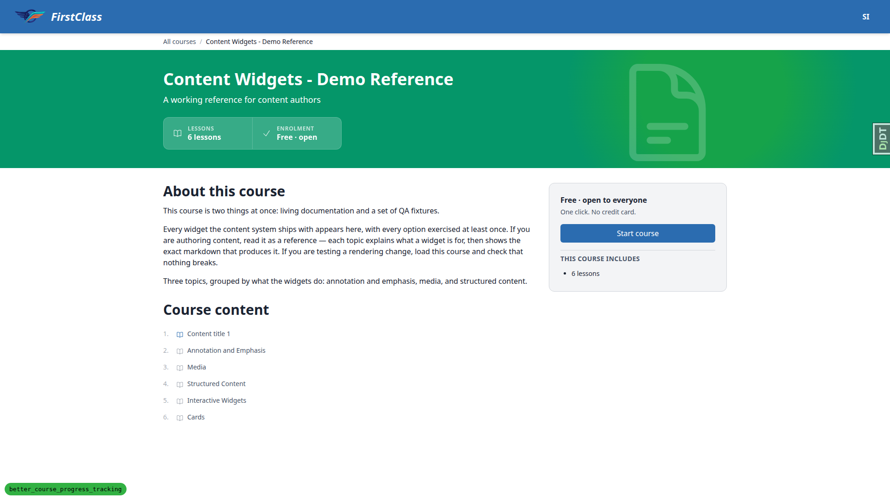

The same two rows as the plan's step 6 asks to see them, in the Topic progress records admin — one
under each course, each with its own collection item:

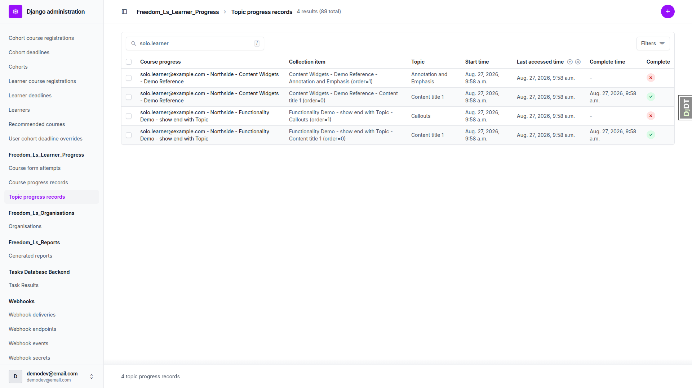

### G2 [§5.1–5.4] Nothing in this work retires a record — success criterion 4

**G2.1-3 — PASS.** Rita Removed (learner `8aeb644b-fe33-4db7-a5c3-b8deb54d38f8`) started with a 0%
record and no activity, so per step 2 she was reactivated in the admin, logged in as, and completed
item 1 of `functionality-demo-show-end-with-topic`. Record `a070cd3f-ae28-4fdb-be34-db7c2008d520`
then read `pct=14`, `started_at=09:49:55.803789`, `last_accessed_time=09:50:03.139480`,
`last_accessed_item=2ba90939-92a8-44a6-acbd-b8ff087e36e9`, `completed_time=None`, with 2
topic_progress rows. She was then deactivated again via the admin. Every one of those fields was
byte-identical afterwards and both topic_progress rows survived. Deactivation destroyed nothing.

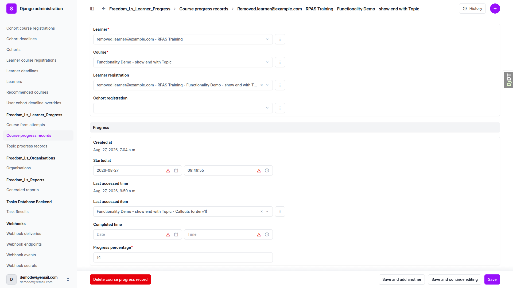

**G2.4 — PASS.** Deleted the CohortMembership `1b7d284a-76ef-40d0-9b1e-4750332cd0d7`
(`qa-report-learner-08@email.com` in QA Report Cohort B1) through the Cohort admin inline. The delete
succeeded, and both of that learner's course progress records (`579ed7c6...`, `9583555e...`) still
exist at `pct=86` with 5 topic_progress rows each.

**G2.5 — PASS.** Deactivated then reactivated Rita's LearnerCourseRegistration
`5813502c-654a-48a8-8b18-8c697372ae8b` in the admin. After each save the granted record stayed at
`pct=14`, `completed_time=None`, `last_accessed_item=2ba90939...`, with `started_at` and
`last_accessed_time` unchanged. Record count for Rita stayed at exactly 1 — no duplicate record on
reactivation.

### G3 [§6] The educator matrix keeps showing removed learners

**G3 — PASS.** Deactivated cohort member Margot Thibault (learner
`7d3983c1-3d98-4706-9c35-72f0046c98bd`) in the admin, then opened the cohort's Course Progress matrix
as Olive Educator. She still appears, at 86%, with her full history: 5 Completed cells plus a
"100% Pass x1" quiz cell. Her percentage column agrees with her item cells (6 of 7 = 86%).
Deactivation suspended access without hiding the record of past work. The roster count dropped from 9
to 8 only because G2.4 deleted `qa-report-learner-08`'s cohort MEMBERSHIP; that learner's progress
records still exist, and a matrix keyed on cohort membership correctly stops listing them.

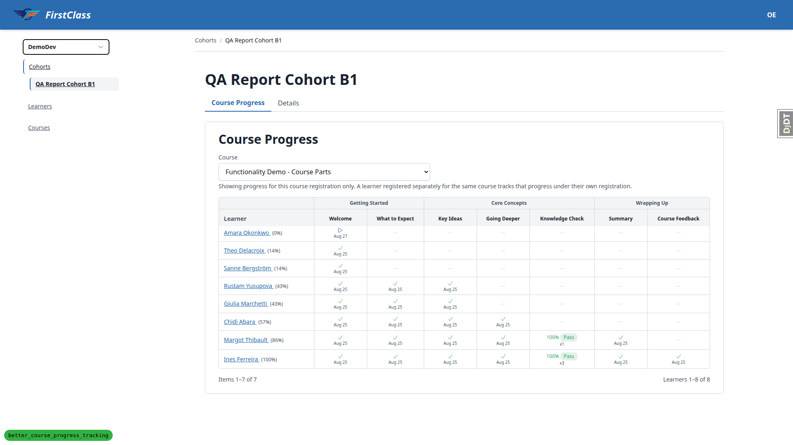

### G4 [§7.1] Registration fan-out on a new membership — success criterion 2

**G4 — PASS.** SUCCESS CRITERION 2. Added a new CohortMembership for an active Learner
(`y10.learner@example.com`, `e3a18de9-...`) to Year 9 Maths (RPAS) through the Cohort admin inline.
Course progress records immediately showed exactly one new record (`73de4348-...`) for
`functionality-demo-course-parts` — the cohort's one active course registration — with Learner
registration blank and Cohort registration "Year 9 Maths - Functionality Demo - Course Parts"
(`902f71e7-...`), site DemoDev. Repeated with an inactive Learner (Rita Removed, `8aeb644b-...`): the
membership was created but no new record appeared; she still holds only her pre-existing
individual-registration record for a different course.

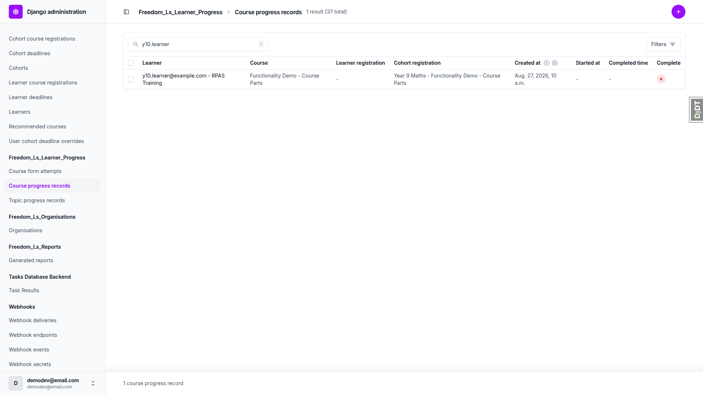

### G5 [§8] Deadlines are now per-organisation — success criterion 9

**G5.setup — PASS.** Created the two-organisation overlap: added a LearnerCourseRegistration
(`694a00ec-...`) giving Cara's Northside Learner row (`6234e7fc-...`) access to
`functionality-demo-course-parts`, the course her RPAS Year 9 Maths cohort already grants. She then
held two records for that one course — one via the RPAS cohort registration (`afa3d3bb-...`) and one
via the Northside individual registration (`9fd4187f-...`). `qa_create_soft_deadline` ran as written
and correctly attached its deadline to the RPAS cohort's registration despite a same-named
"Year 9 Maths" cohort existing under Northside.

**G5.1-2 — PASS.** SUCCESS CRITERION 9. Gave Cara a course-level soft CohortDeadline dated 20 Aug
through the RPAS Year 9 Maths cohort registration only. Logged in as Cara, the course table of
contents showed "20 Aug" against each of the three course parts.

**G5.3-4 — PASS.** SUCCESS CRITERION 9 — the central assertion. Added a second, obviously different
deadline (25 Nov 2026) as a LearnerDeadline on Cara's Northside individual registration for the same
course. Reloading her table of contents still showed only "20 Aug" on all three rows. The 25 Nov
Northside date appeared nowhere, and no row carried two deadlines side by side. She sees the
deadlines of the organisation she is studying through (the cohort grant, which wins resolution), not
a union of both.

**G5.5 — PASS.** Set a hard deadline 3 days in the past on the "Welcome" topic (uncompleted; Cara is
at 0%) through her resolved organisation, via `qa_create_soft_deadline --item-slug welcome --hard
--days-from-now -3` on the RPAS cohort. Navigating directly to
`/courses/functionality-demo-course-parts/1/` redirected her to
`/courses/functionality-demo-course-parts/detail/` — she was not shown the item.

**G5.6 — PASS.** Removed the cohort deadline and placed an equivalent hard past deadline on the same
"Welcome" topic through the other organisation only (a LearnerDeadline on Cara's Northside individual
registration). Navigating directly to `/courses/functionality-demo-course-parts/1/` now rendered the
Welcome item normally — no redirect. A deadline set through an organisation she is not studying
through does not lock her out.

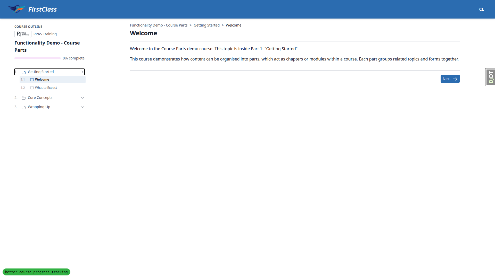

**G5.7 — PASS.** Tested on `functionality-demo-show-end-with-topic`, where Cara's Northside
individual registration is the resolving grant (no cohort competes), so the effect is observable. Put
a soft course-level LearnerDeadline dated 11 Oct on registration `dd5a7cc6-...`; the TOC showed
"11 Oct" on all 7 rows. Then deactivated her Northside Learner row (`6234e7fc-...`) and reloaded: the
11 Oct deadline still resolved and still rendered on every row. Items additionally switched to
"Locked", which is the access suspension deactivation is supposed to cause and is separate from
deadline resolution.

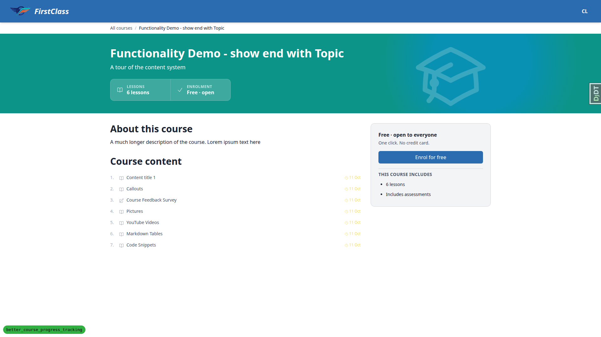

### G6 [§9.7] Submit-on-exit, and the double-submit

**G6.1-3 — PASS.** The submit-on-exit fixture exists exactly where the plan says: item 2
"Mid course Quiz" of `functionality-demo-show-end-with-quiz`, 6 questions over 2 pages, 80% pass
mark. Its exit dialog offers "Keep going" / "Leave and submit". Run 1's "no form configured for
submit-on-exit" was indeed a fixture mismatch. As Sol (registered for the course), all 3 page-1
questions were answered correctly and "Leave and submit" was hit without first saving the page. It
finalised and landed on `/2/complete` showing 50%, 3/6 correct, "Quiz not passed — you need 80%". The
three answers from the page the learner was standing on were counted; the pre-fix bug would have
discarded them and locked in 0%. The results page lists questions 4-6 as unanswered/Marked wrong, so
the 3 scored correct are accounted for.

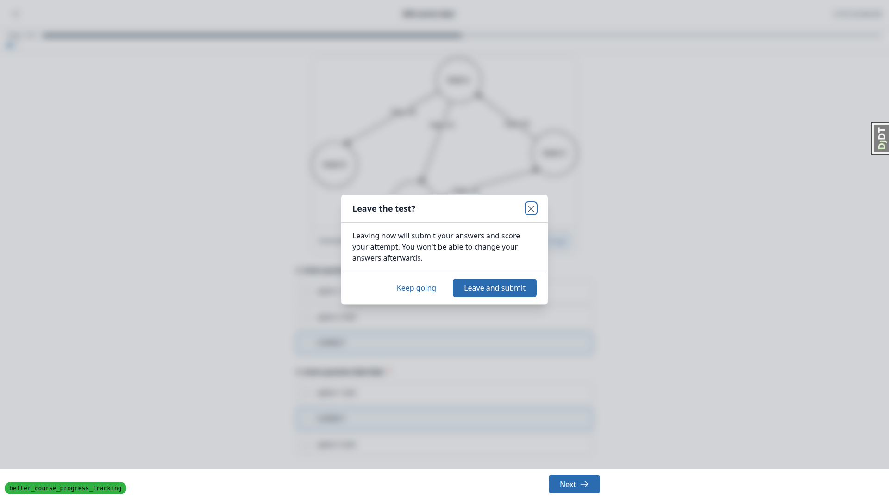

**G6.2 — PASS.** Re-entered item 2 after the submit-on-exit finalisation. It does not offer to
resume: the start page shows "Previous attempts — 27 Aug 2026, 50% (3/6)" and a "Try Again" button.
The attempt was genuinely finalised, not left open.

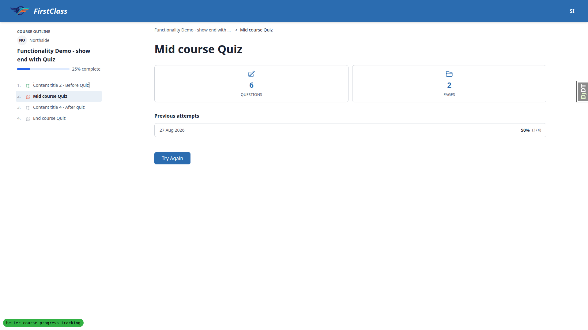

**G6.3-4 — PASS.** Stronger repeat of the scoring assertion, this time from page 2. Retried the
quiz, answered page 1 correctly, advanced to page 2, answered all 3 page-2 questions correctly, then
hit "Leave and submit" while standing on page 2. Result: "Quiz passed!", 100%, 6/6 correct — every
answer on the standing page was counted. The course percentage recalculated from 25% to 50%,
confirming this path ends in `complete()`.

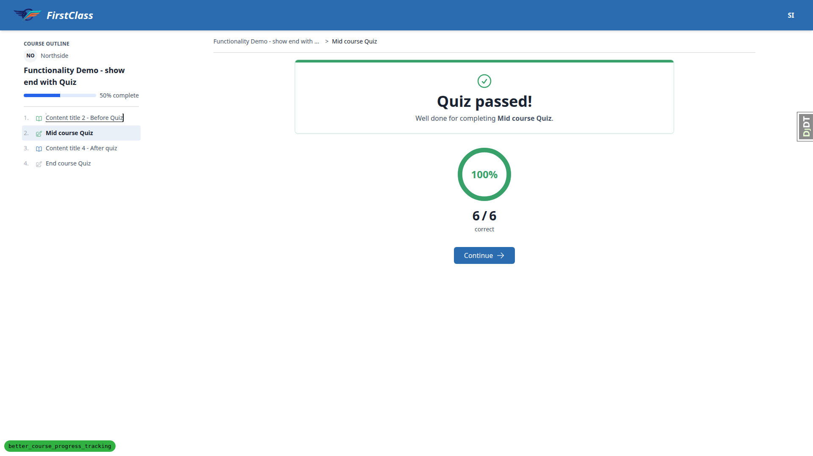

**G6.5 — PASS.** Double-clicked "Leave and submit" in one gesture. No error, and the database holds
exactly one FormProgress (`41c0cd23-...`, scores `{'score': 3, 'max_score': 6}`) and exactly one
CourseFormAttempt (`aa335997-...`) for that sitting. No second attempt was created.

**G6.6 — PASS.** Contrast case: item 4 "End course Quiz" has no `submit_on_exit`. Its exit dialog
reads "Leave the test? Your progress is saved — you can resume later" and offers "Keep going" /
"Leave and save" — no "Leave and submit" anywhere. After leaving mid-attempt with 3 answers given,
the item reads "In progress", the start page offers "Continue Form" (resume), and the course
percentage stayed at 75% — it did not move.

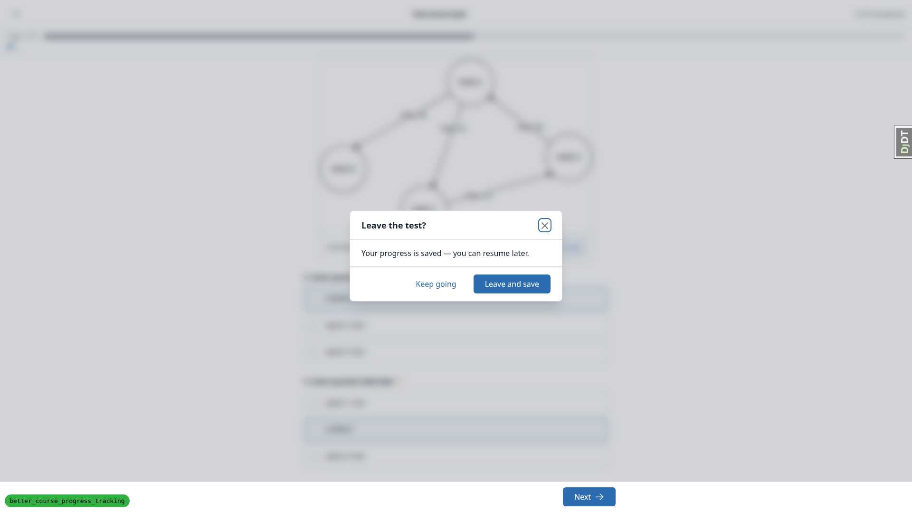

### G7 [§11.5] Access types degrade rather than crash — success criterion 11

**G7.1 — PASS.** SUCCESS CRITERION 11. `qa_create_course_access_types` ran to completion with no
traceback and no unhandled ProtectedError. It seeded "QA Free Course (Access Types)" (access_type
`free`) and "QA Application-Gated Course (Access Types)" (access_type `application_gated`). The plan
also mentions a registration-gated course; the command does not seed one, which is the command as
written, not a regression.

**G7.2 — PASS, with an environment caveat.** As Nell Unregistered, walked the catalogue and both
seeded courses. No 500 anywhere. The catalogue lists every course as "NOT REGISTERED" with a
"Details" link and offers no bogus "Continue" affordance. Both detail pages render with an enrol CTA
and their content item shown as Locked.

**Caveat, stated plainly:** this dev environment has `OVERRIDE_COURSE_ACCESS_TO_FREE=True` and
`OVERRIDE_COURSE_VISIBILITY_TO_VISIBLE=True`, and `VisibilityEnforcingBackend` deliberately replaces
the inner backend's real decision with the canonical free decision when that override is on. So the
application-gated course presents as "Free / open to everyone / Enrol for free" by design, and "each
behaves as its badge says" cannot be exercised through the browser here. The underlying decision was
verified directly instead: the inner `ApplicationCourseAccessBackend` returns
`cta='Apply now'`, `enrolment_summary='By application'`, `is_accessible_for_free=False` for that
course and Nell, while the override-wrapped outer backend returns "Enrol for free". `course_access`'s
backends and overrides are untouched by this branch (only a `qa_helpers` command and a
`learner_interface` test file mention `course_access` in the diff), so this is environment
configuration, not a regression.

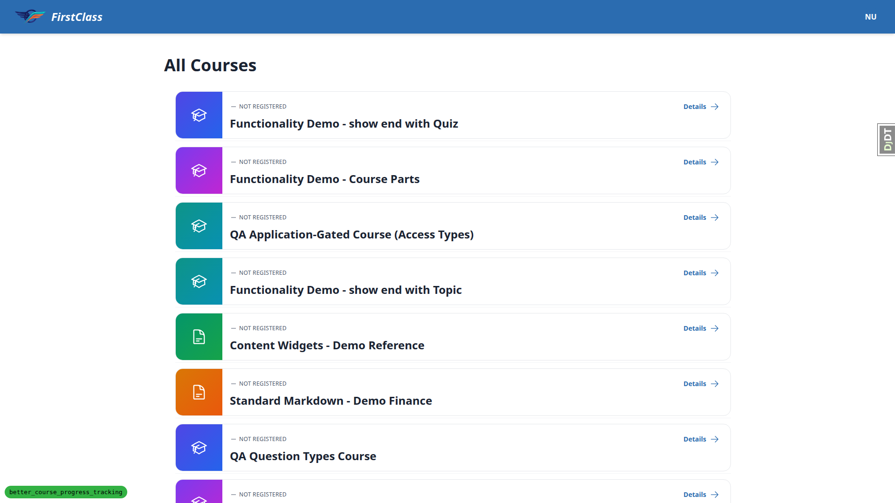

**G7.3 — PASS.** Guessed the player URL `/courses/qa-application-gated-course-access-types/1/` as
Nell. She was turned away by the access gate — redirected to the course detail page, not a 500.
Confirmed in the database afterwards that she still has 0 CourseProgress rows, 0 TopicProgress rows
and 0 CourseFormAttempt rows. No progress row of any kind was created by the turned-away request.

### G8 [§12.1, §12.3–12.7] The report body — executed despite HUMAN-RUN marking

**G8.1 — PASS.** The plan marks G8 HUMAN-RUN because reports render PDF-only through `FileResponse`.
It was run anyway: the report was generated as superuser via the admin's "Generate cohort report"
action for QA Report Cohort B1, then the resulting PDF (`media/reports/...-cohort-report.pdf`, 14
pages) was read directly, with two pages rasterised as evidence. No human step is outstanding. The
report renders in full: cover page, "Cohort at a glance" with headline stat tiles (8 learners, 43%
median completion, 1 not started, 1 completed everything), a Contents and definitions page, Section 1
summary table per course, Section 2 per-learner sections, Section 3 quiz confusions, and the at-risk
"Learners needing attention" list.

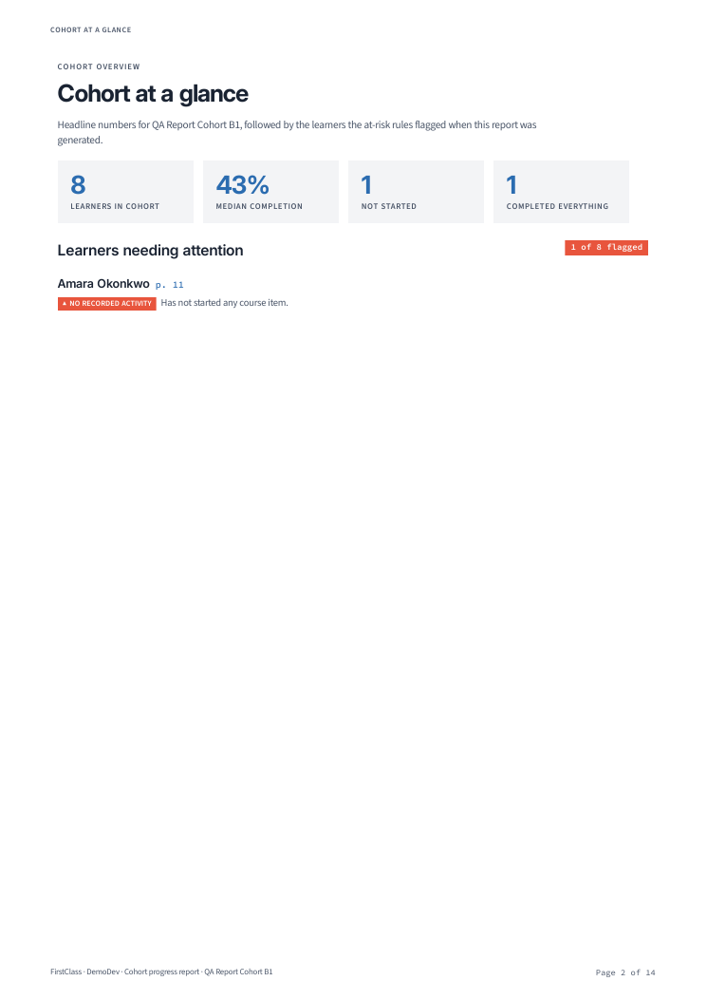

**G8.2 — PASS.** Verified the Contents anchors as real PDF link annotations rather than trusting the
printed page numbers. All 8 learner entries are internal links whose named destinations are keyed on
the learner pk and resolve to that learner's own page: `learner-d867b121` (Chidi Abara) -> p6,
`learner-f7c9bded` (Sanne Bergstrom) -> p7, `learner-2be31356` (Theo Delacroix) -> p8,
`learner-6ec9dabd` (Ines Ferreira) -> p9, `learner-52666b31` (Giulia Marchetti) -> p10,
`learner-0db91ee6` (Amara Okonkwo) -> p11, `learner-7d3983c1` (Margot Thibault) -> p12,
`learner-e4f60292` (Rustam Yusupova) -> p13. Every target matches both the Contents page number and
the running header on the destination page. The re-keyed anchor id works; no link goes nowhere.

**G8.3 — PASS.** The at-risk list was initially empty, so a genuine at-risk learner was created first
(see G8.4) and the report was regenerated. The "Learners needing attention" entry for Amara Okonkwo
carries an internal link to dest `learner-0db91ee6-b065-4802-b8ec-496f9f39ae23`, resolving to page 11
— matching both its printed "p. 11" and Amara's Contents entry. It jumps to the right learner.

**G8.4 — PASS.** The eager-creation check. On the first generation nobody was flagged (0 of 8) —
correctly, because all 8 seeded learners had some activity, including Amara who had a Started row. To
exercise the rule, Amara Okonkwo was made the case it targets: her 2 TopicProgress rows were deleted
and `started_at` / `last_accessed_time` / `last_accessed_item` were nulled on her records, leaving her
with a course progress record and zero activity. Regenerated: the report now flags exactly 1 of 8,
"Amara Okonkwo — NO RECORDED ACTIVITY — Has not started any course item.", and her detail page (p11)
shows "No activity recorded." with 0%, 0 of 7. The seven learners with real activity were not
flagged. The flag fires on the right condition and only on it, so the eager-creation regression
(nobody ever flagged inactive) is absent.

**G8.5 — PASS.** Quiz attempts tables are headed "every completed sitting, oldest first". Ines
Ferreira's Knowledge Check attempts are numbered 1, 2, 3 and Margot Thibault's is numbered 1 —
numbering restarts at 1 per quiz. Both learners also hold a second course progress record for the
same course under the original QA Report Cohort, and their attempt numbering here still starts at 1
rather than continuing a global count, so the "first attempt" shown is their first attempt in this
cohort's course, not their first ever.

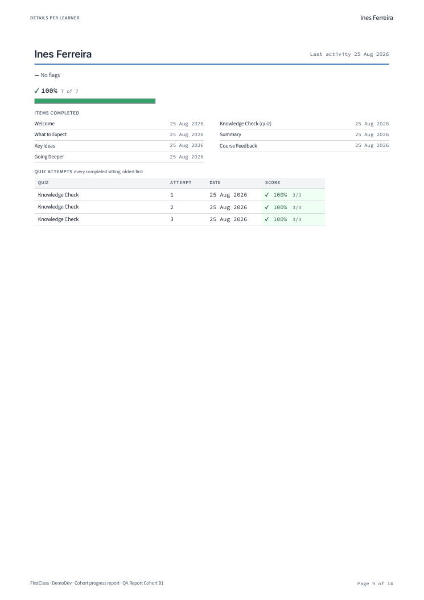

**G8.6 — PASS.** Cross-checked every learner's completion figures in the report's Section 1 summary
against what the educator Course Progress matrix showed for the same cohort. Report: Chidi 57% 4/7,
Sanne 14% 1/7, Theo 14% 1/7, Ines 100% 7/7, Giulia 43% 3/7, Amara 0% 0/7, Margot 86% 6/7, Rustam 43%
3/7. Matrix: Chidi 57%, Sanne 14%, Theo 14%, Ines 100%, Giulia 43%, Amara 0%, Margot 86%, Rustam 43%.
All eight agree, including deactivated Margot, who appears in both views. Neither view is merging
records.

### G9 [§14.1, §14.3] Webhook reference and live delivery

**G9.1 — PASS, but see the documentation gap below.** DOCUMENTATION GAP, not a regression — reporting
plainly as the plan directs. There is no standalone integrator-facing "event type reference" page in
the webhooks admin: `/admin/webhooks/` lists only Webhook deliveries, endpoints, events and secrets,
and nothing in the codebase implements a reference or sample-payload view. Run 1's inability to find
such a page is confirmed. The sample payloads do exist and are reachable, but only per-endpoint via
the "Send Test" action on a WebhookEndpoint (`WEBHOOK_EVENT_TYPE_SAMPLES` in
`freedom_ls/base/webhook_event_types.py`, rendered by `freedom_ls/webhooks/views.py`). Both event
types were exercised through it and the substantive expectation holds: `course.registered` previews
as `{user_id, user_email, course_id, course_title, registered_at, organisation_id,
course_progress_id}` and `course.completed` as `{user_id, user_email, course_id, course_title,
completed_time, organisation_id, course_progress_id}`. Both list `organisation_id` and the course
progress record id alongside their original fields.

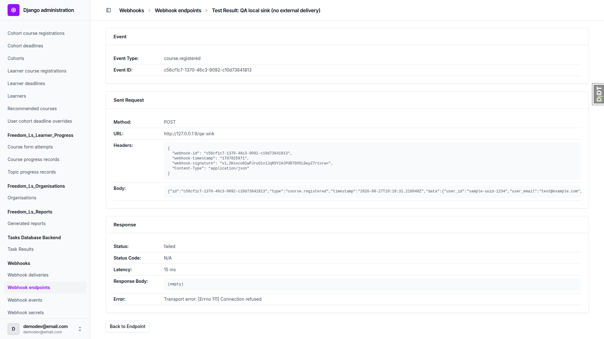

**G9.2 — PASS.** Configured a webhook endpoint (`43494fd3-...`) on site DemoDev subscribed to
`course.registered` and `course.completed`, pointed at a local dead port
(`http://127.0.0.1:9/qa-sink`) so nothing leaves the machine — WebhookEvent and WebhookDelivery rows
are still written, which is stronger evidence than a request bin. Baseline: 21 `course.registered`
events. Registered `y10.learner@example.com` for `functionality-demo-show-end-with-topic` via the
admin. Result: exactly one new `course.registered` event (21 -> 22) with exactly one delivery,
payload `{user_id: 76, course_id: 3ff21a03-..., user_email, course_title, registered_at,
organisation_id: ed15fbe3-..., course_progress_id: a9029fe5-dd0f-4047-b3f6-cfbe54384688}`. Both new
fields present, and `course_progress_id` resolves to a real Course progress record row for that
learner, that course, organisation RPAS Training. Then: re-saved the same registration unchanged —
still 22, no second delivery. Deactivated it — still 22. Reactivated it — still 22. It fires on
creation only.

### G10 Regression check on run 1's three fixes

**G10.1 — PASS.** B2 regression check. `/educator/organisations/rpas-training/cohorts/3c3500ef...`
(Year 9 Maths, which has 3 granted course progress records) renders normally as superuser: Course
Progress + Details tabs, full item matrix (7 items across 3 course parts), 3 learner rows. No 500, no
ProtectedError.

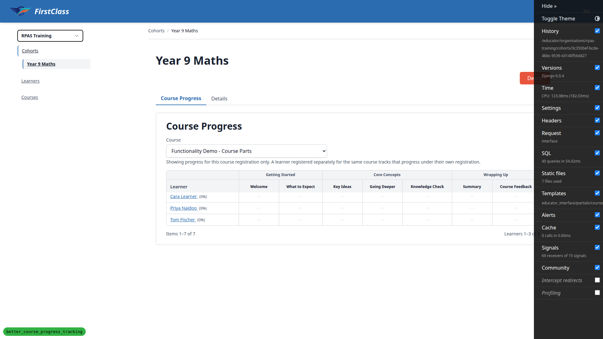

**G10.2 — PASS.** B2 regression check. The Delete dialog on the blocked cohort shows the plain
sentence "This cohort cannot be deleted because it still has 3 course progress records." with only a
Close button (and the header close X). No Delete button offered.

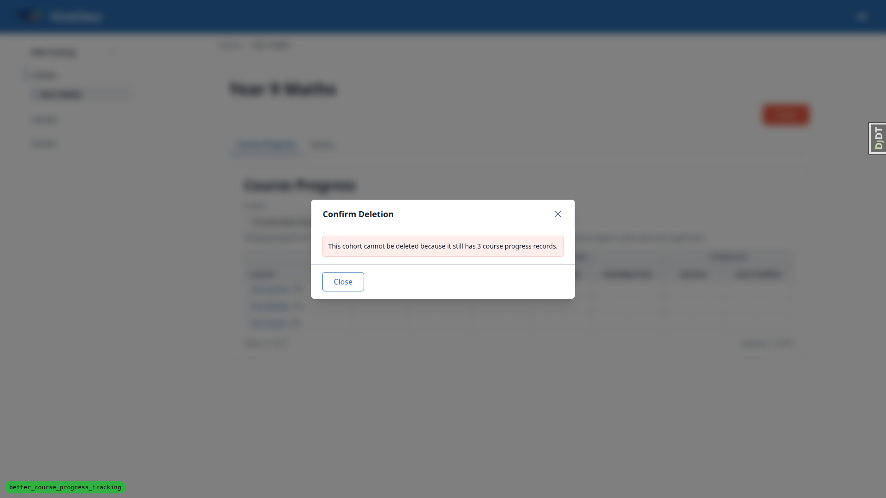

**G10.3 — PASS.** B2 regression check. Year 10 Science (RPAS, no granted progress) shows the
ordinary dialog: "Are you sure you want to delete Year 10 Science?" with a working Delete submit
button. Clicking it deleted the cohort and redirected to the cohorts list, where Year 10 Science no
longer appears.

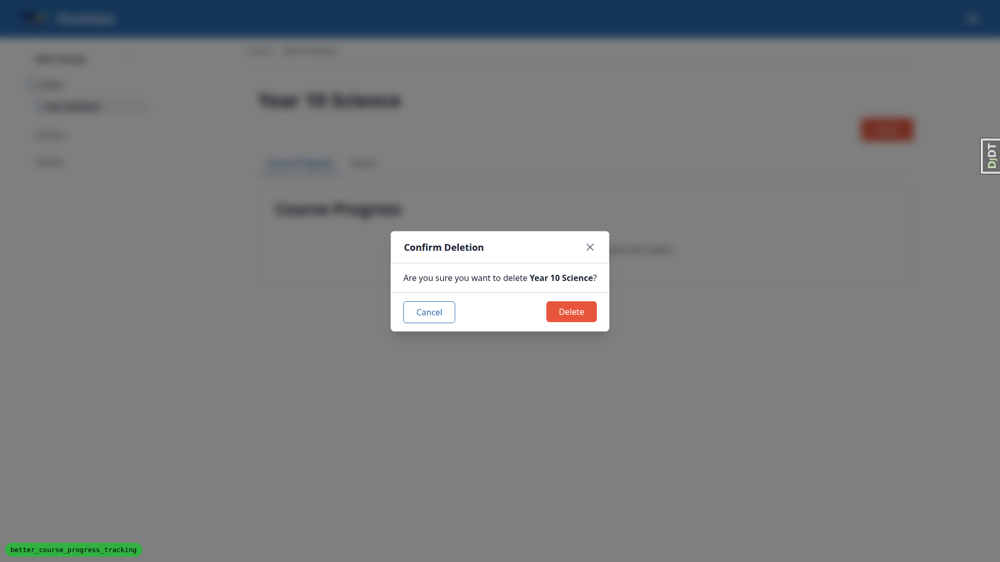

**G10.4 — PASS.** B2 regression check, submit path. POSTed directly to
`/educator/organisations/rpas-training/cohorts/3c3500ef-.../__actions/delete` for the blocked cohort.
Response was HTTP 422 carrying the same readable "cannot be deleted" message, not a 500. Cohort was
not deleted.

**G10.5 — PASS.** B1 regression check. Seeded a fresh cohort "QA Report Cohort B1"
(`fc920b1d-3d41-4e7d-8b89-53aa433c99a4`) with `qa_create_report_cohort` and deliberately did not run
`recalculate_progress_percentages`. Viewed as Olive Educator. All 9 learner percentages agree with
their completed cells: Amara 0% (1 Started, 0 Completed), Theo/Sanne 14% (1/7), Rustam/Giulia 43%
(3/7), Chidi 57% (4/7), Margot/Haruki 86% (6/7 incl. passed quiz), Ines 100% (7/7). No 0%-beside-
Completed rows.

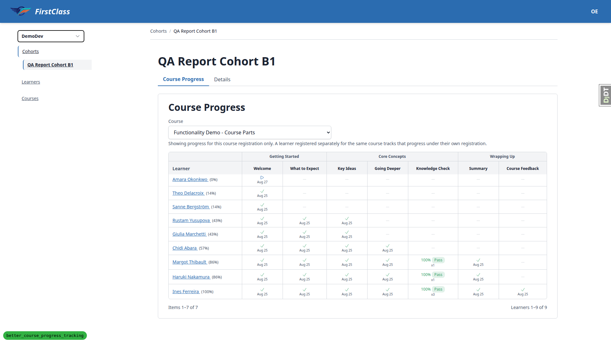

**G10.6 — PASS.** B3 regression check. `qa_create_report_cohort` ran clean with
`--cohort-name`/`--course-slug`/`--educator-email` exactly as written in the plan: no click usage
error, no traceback, no `site_id` IntegrityError. Confirms the 0.1b factory fix (`2c2b5e35`).
Plan-accuracy note: Olive Educator's password is her email address (`org.educator@example.com`), not
`demodev@email.com` — 0.2's caveat about reused personas keeping the organisation-scenario password
did not hold for her.

### G11 Triage of run 1's two open observations

**G11.1 — PASS.** TRIAGE VERDICT: run 1's observation does not reproduce; no bug to file. Built the
exact state it describes — as `y10.learner@example.com`, completed "Welcome" in the "Getting Started"
part of `functionality-demo-course-parts`, then deleted the "What to Expect" TopicProgress row the
player had opened, leaving the part with one child complete, one not started, and none in progress.
The course table of contents renders "Getting Started" as "In progress", which is what the plan
expects. Run 1 saw "Not started" in this situation. Commit `15cbec52` "Read one rule for a course
part's status" landed on this branch and is the likely cause of the change.

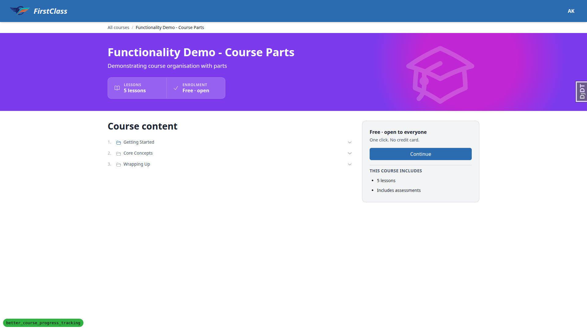

**G11.2 — PASS.** TRIAGE VERDICT: run 1's observation does not reproduce; no bug to file. Logged in
as Ines Ferreira (`qa-report-learner-09@email.com`), who is registered for courses and at 100% on all
of them, so her In Progress section is empty. The copy reads "No courses in progress — everything
you're signed up for is finished and waiting in your Learning History below." The untrue "You haven't
signed up for any courses yet." does not appear, and her completed course is listed under Learning
History as COMPLETED.

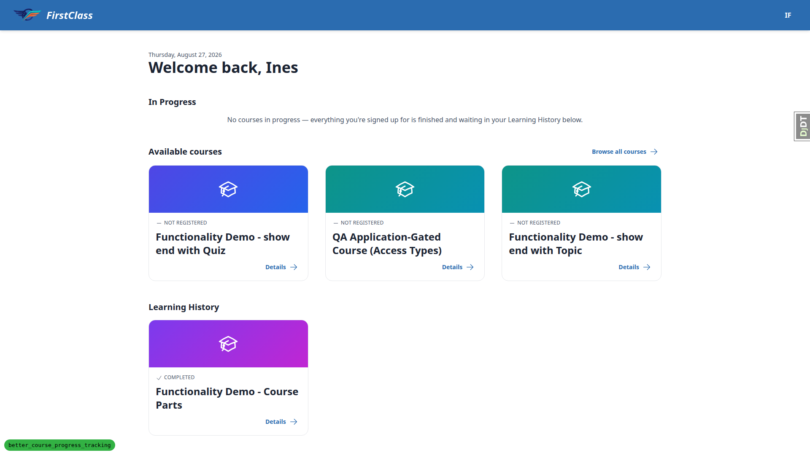

## Bug status

No bugs were found in this run — all 36 checks passed — so there is nothing to track.

## General notes

**Plan accuracy.** 0.0's database check was clean: all three `freedom_ls_form_engine` migrations
applied and the stale-content-type probe printed an empty list, so no rebuild was needed at the start.
0.1's seed data was already present. 0.1b is confirmed fixed — `qa_create_report_cohort` ran clean.
Two small plan-accuracy points: (a) 0.2 says a persona merely reused by `qa_create_report_cohort`
keeps its organisation-scenarios password, but Olive Educator's password was her email address, not
`demodev@email.com`; (b) G7 expects a registration-gated course, and `qa_create_course_access_types`
seeds only `free` and `application_gated`.

**Dev-environment overrides shape what the browser can show.** `OVERRIDE_COURSE_ACCESS_TO_FREE` and
`OVERRIDE_COURSE_VISIBILITY_TO_VISIBLE` are both True in this worktree. `VisibilityEnforcingBackend`
deliberately discards the inner backend's decision and substitutes the canonical free decision when
the first is on. Any future QA of access types or coming-soon/hidden visibility through the browser
will see every course as free and visible regardless of its `access_config`, so those assertions need
the overrides off, or must be checked at the backend directly (as G7.2 did here).

**Django debug toolbar intercepts clicks.** The debug toolbar's panel overlay intercepted pointer
events on controls near the left edge (the cohort Delete button), failing clicks with a Playwright
timeout naming the `djDebug` subtree. Collapsing the toolbar via its hide control plus the `djdt=hide`
cookie cleared it. Worth knowing for future browser QA in this worktree; not a product issue.

**Test-data residue.** This run reshaped dev data substantially: a shared topic placed into
`content-widgets-demo-reference` with that course's items reordered, cohort QA Report Cohort B1 and
its 9 learners, extra registrations for Sol / Cara-Northside / y10, cohort memberships for Rita and
y10, deadlines, a webhook endpoint, the `qa_create_course_access_types` courses, generated report
PDFs, deletion of the Year 10 Science cohort as part of G10.3, and stripped progress rows for Amara
Okonkwo (which touched the original QA Report Cohort fixture, not only the one this run created).
Because pre-existing seed data was altered, the database was dropped and rebuilt from the plan's own
§0 procedure at the end of the run and re-seeded from 0.1, rather than patched item by item. No
dev-data chore is left for anyone.

**Documentation gap (G9.1).** There is no standalone integrator-facing webhook event-type reference
page in the admin — only per-endpoint sample payloads reachable via each WebhookEndpoint's "Send
Test" action. This is a documentation gap, not a regression: the substantive payload content (both
new fields, on both event types) is correct and was verified.

status: ok
reason: report rendered, 36 checks documented, 0 bugs
