# QA report — 3c. form_engine_regression_qa

Executed against `frontend_qa_form_engine_regression.md` in this directory.

## Methodology

The run was driven with the Playwright MCP against a dev server started on port 8388, on branch
`better_course_progress_tracking` (confirmed via the debug branch badge visible in the UI). Screenshots
were collected into `screenshots/` beside this report; every image referenced by a test record below
exists in that directory. The smoke gate did not abort the run, so all steps executed. Screenshot
compression ran and reported exit code 0 with no PNG over 1024KB, so nothing needed compressing.

## Diff scoping

The scoping check fired class **FULL**. The changed-file set includes `.html` templates
(`course_progress_panel.html`, `course_finish.html`, `course_topic.html`, `course_list.html`,
`delete_confirmation.html`, `attention_entry.html`, `contents.html`, `learner_detail.html`) alongside
~120 `.py` files across `content_engine`, `form_engine`, `learner_progress`, `learner_interface`,
`learner_management`, `educator_interface`, `reports`, `qa_helpers` and `panel_framework`. Because
template files changed, nothing was skipped: the desktop, mobile and tablet passes all ran.

## Smoke gate

Result: **pass**. Pages loaded: `http://127.0.0.1:8388/` and
`http://127.0.0.1:8388/educator/organisations/demodev/cohorts/6b1d18f8-5e37-4e1f-ada6-33d8d387e2f1`.
No failure URL or reason was recorded.

## Setup

**0.0 — Database state check (pass).** All three `freedom_ls_form_engine` migrations were applied, and
the stale-content-type probe (`ContentType.objects.all()` filtered to `model_class() is None`) returned
an empty list. No rebuild was required.

**0.1 — Seeding (pass).** All 12 seed commands exited 0 with no `ImportError`/`ModuleNotFoundError`.
`git status --short demo_content/` printed nothing, so all content UUIDs round-tripped. The two ordering
traps documented in the plan were observed and respected: `qa_create_learner_deadlines` ran after
`qa_create_cohort_progress`, and `recalculate_progress_percentages` ran after
`qa_reset_learner_progress`.

## Results by section

### R1 — The form player golden path

- **R1.1** (desktop) — pass. Form start page for `qa-question-types-course` item 1 renders title,
  question count 4 (from `count_form_questions`, which moved app), 1 page and a Start Form button.
  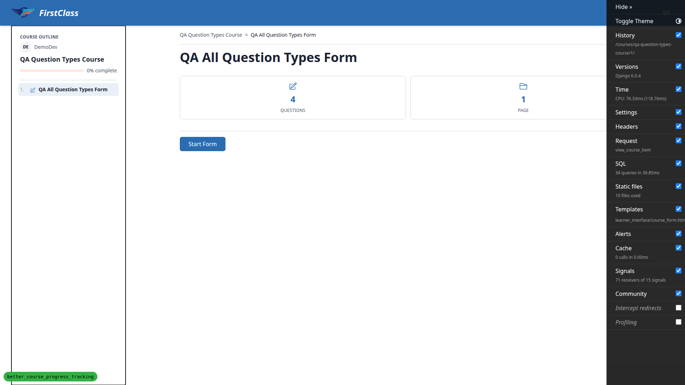
- **R1.2** (desktop) — pass. Runner page 1 shows all four question types: radio group (3 options),
  checkbox group (3 options), single-line textbox and textarea.
- **R1.3** (desktop) — pass. All four answered (MC option A correct, checkbox A+B correct, both
  free-text filled). Ready-to-submit dialog reported 4/4 answered. Completion page shows "Quiz passed!",
  ring 50% with "2 / 4 correct" beside it — the percentage matches the ring, free-text scored 0 as
  expected. Outline flipped to Completed and the course rail read 100%.
  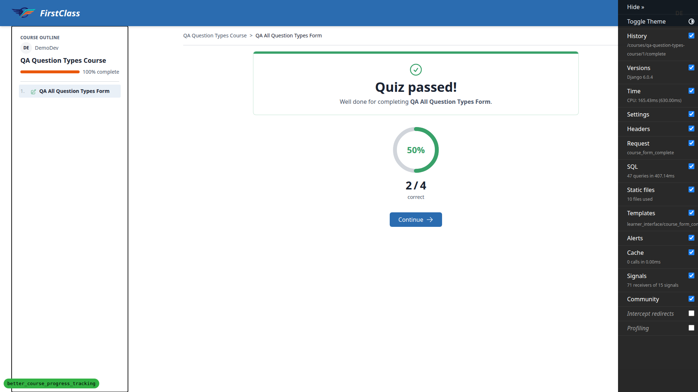
- **R1.4** (desktop) — pass. Enrolled `demodev@email.com`, completed items 1-3 to unlock item 4 (End
  course Quiz). Started it, answered page 1, navigated to `/courses/`, returned to item 4: the start page
  offered "Continue Form" and the outline read "In progress". Re-entering `fill_form/1` showed all three
  page-1 radios still `[checked]`. The attempt helpers that moved to `learner_progress/attempts.py`
  resolve the in-flight attempt correctly.
  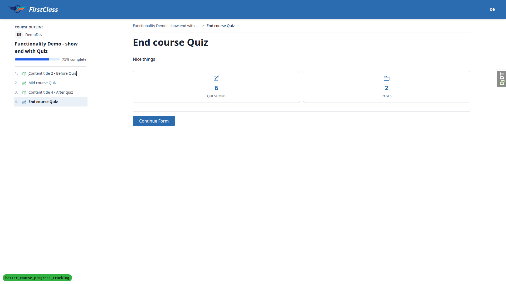
- **R1.5** (desktop) — pass. As `demodev_quizqa@email.com`, completed the
  `qa-free-text-survey-course` form: filled page 1's two required free-text questions, continued to page
  2, left both optional questions blank, submitted. Completion page reads "Form complete! Thank you for
  completing QA Free Text Survey." with no score ring, no pass/fail banner, no incorrect-answer review.
  `CATEGORY_VALUE_SUM` forms carry no verdict, as designed. The 100% figure on the page belongs to the
  course progress rail, not to a form score.
  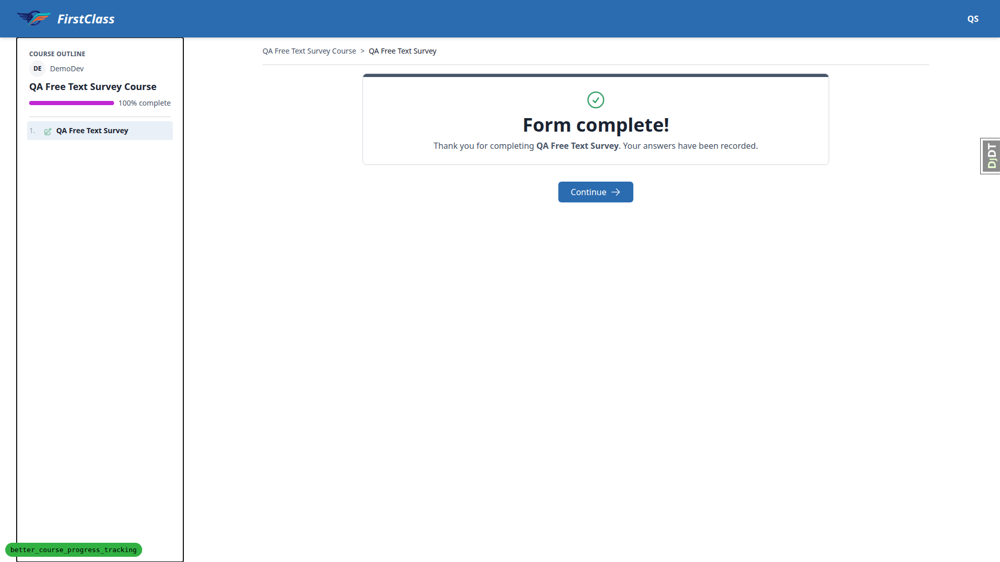
- **R1.6** (desktop) — pass. Started a fresh survey attempt, filled both free-text questions on page 1,
  continued to page 2, used the in-form Previous control. Page 1 returned with both saved values rendered
  into the input and the textarea verbatim. Note for the plan: once an attempt is complete the runner URLs
  redirect back to the item start page, so this step only works mid-flow.

### R2 — The signal substitution

- **R2.1** (desktop) — pass. Dashboard card for `qa-progression-block-course` read 33% for
  `demodev_quizqa@email.com` — non-zero and below 100, so `recalculate_progress_percentages` did run
  after the reset. The course page agreed at 33%.
  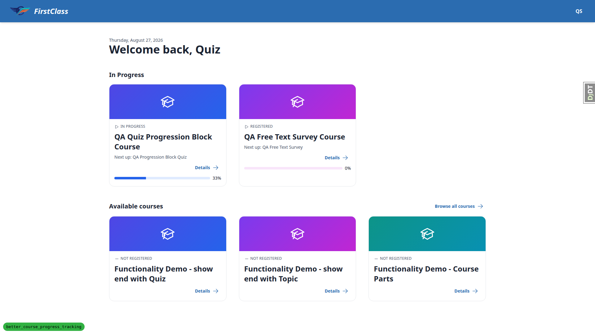
- **R2.2** (desktop) — pass. Sat the item-2 quiz, answered the checkbox question with both correct boxes
  and all three multiple-choice questions correctly. Completion page showed "Quiz passed!" at 100%
  (4/4).
  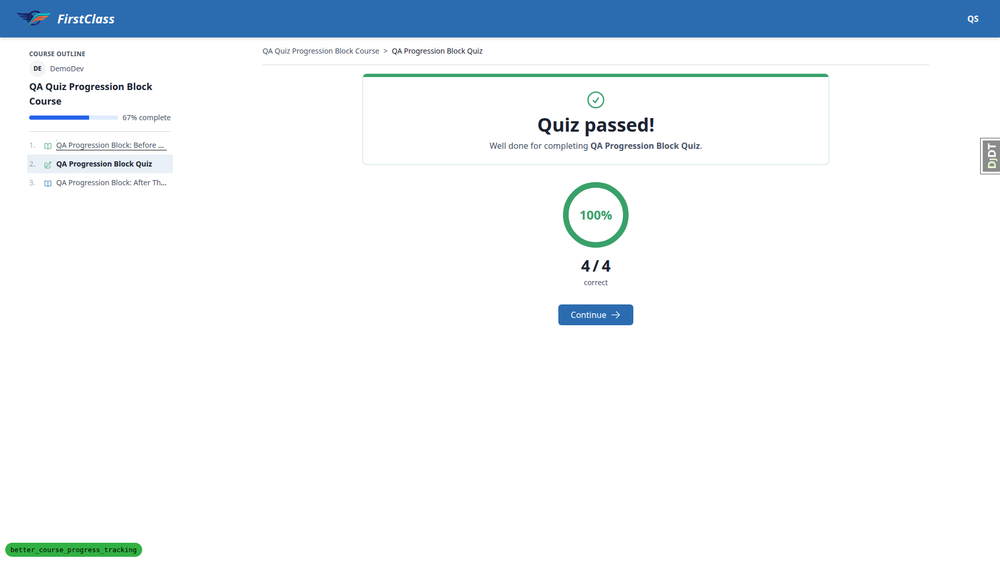
- **R2.3** (desktop) — pass. The course percentage moved 33% -> 67% on both the dashboard card and the
  course page immediately after completion. The explicit send inside `FormProgress.complete()` reaches
  the receiver and the recalculation runs.
- **R2.4** (desktop) — pass. Reloaded the dashboard and the course page five times each with cache
  bypassed. Both stayed at 67% every time and never exceeded 100. No double-counting.
- **R2.5** (desktop) — pass. The completed quiz item reads "Completed" in the outline, the page offers
  only a Next link to item 3 and no retake control, and the percentage stayed at 67%. Probing the
  `/start_form` URL directly (no UI path leads there) does open a fresh runner and does create a second
  `FormProgress` plus its `CourseFormAttempt` — the same machinery R3 relies on to re-sit a failed quiz —
  but the percentage still did not move and the signal did not double-count. The assertion that matters
  holds.
- **R2.6** (desktop) — pass. `qa_complete_form DemoDev --cohort-name "QA Progress Demo Cohort"
  --form-slug knowledge-check` exited 0 and reported "Created 4 completions". All nine cohort members now
  hold exactly one Knowledge Check `CourseFormAttempt`, each naming that learner's course progress record
  and the collection item "Core Concepts - Knowledge Check (order=2)". The four rows the command built
  (Alice, Bob, Carol, Dave) each carry a `completed_time` and a populated scores dict of
  `{'score': 0, 'max_score': 3}`; the other five pre-dated the run. No skipped line printed because
  `skipped_count` was 0 — the command counts only unregistered learners as skipped and silently passes
  over a member who already holds an attempt, which is exactly the 9-minus-5-equals-4 arithmetic seen
  here. `last_accessed_time` was `None` for every member both before and after, so the command moved no
  read timestamp and learners who never opened the course still have none.
  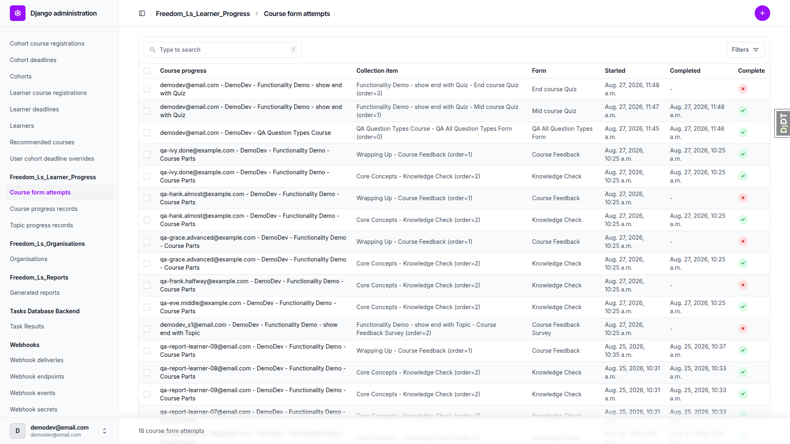
- **R2.7** (desktop) — pass. `recalculate_progress_percentages` exited 0 with no `ImportError`:
  "Recalculated 33 records, updated 0". Zero updates is the right answer here — the signal had already
  kept every percentage current. Dashboard and course pages agree afterwards (progression-block 67% on
  both).

### R3 — A failed quiz blocks the next item

- **R3.1** (desktop) — pass. `qa_reset_learner_progress --learner demodev_quizqa@email.com
  --course-slug qa-progression-block-course` deleted 2 `FormProgress` rows and reset 1 `CourseProgress`,
  keeping topic progress. `recalculate_progress_percentages` then updated 1 record. Course back to 33%
  with item 1 still Completed and item 3 Locked. The survey course's deliberate 100% survived, so
  course-scoping worked.
- **R3.2** (desktop) — pass. Re-sat the quiz with only the wrong checkbox ticked and all three
  multiple-choice questions correct. Result: "Quiz not passed", "You need 80% to pass", ring at 75% with
  "3 / 4 correct", and a "Review incorrect answers" section — `quiz_show_incorrect` is honoured.
  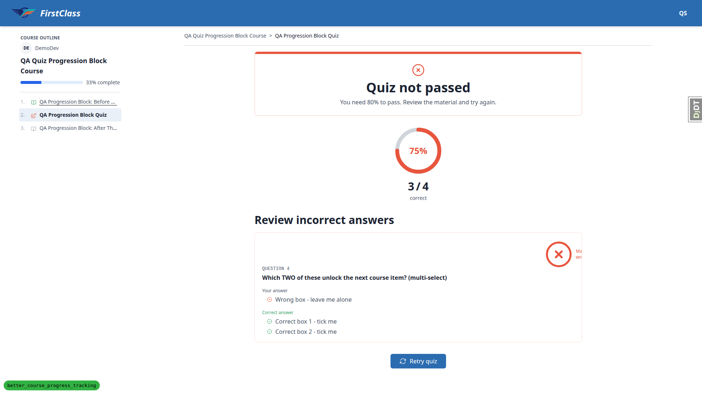
- **R3.3** (desktop) — pass. Back on the table of contents, item 3 reads Locked, item 2 reads "Needs
  retry", and the course percentage stayed at 33% — the failed quiz was not counted as complete.
- **R3.4** (desktop) — pass. Requesting `/courses/qa-progression-block-course/3/` directly while the quiz
  was failed redirected to the course detail page and served none of the topic body. Gating is enforced
  by the view, not merely hidden in the table of contents.
- **R3.5** (desktop) — pass. Re-sat and passed at 100%. Item 3 flipped to "Not started" and now returns
  200 on direct request; the course percentage rose 33% -> 67%.

### R4 — Content types: deadlines and reporting

- **R4.1** (desktop) — pass. Reached `/educator/` -> organisation demodev -> QA Progress Demo Cohort. The
  Course Progress matrix renders all nine learners against Functionality Demo - Course Parts, with part
  groupings Getting Started / Core Concepts / Wrapping Up and both form items (Knowledge Check, Course
  Feedback) present as columns.
  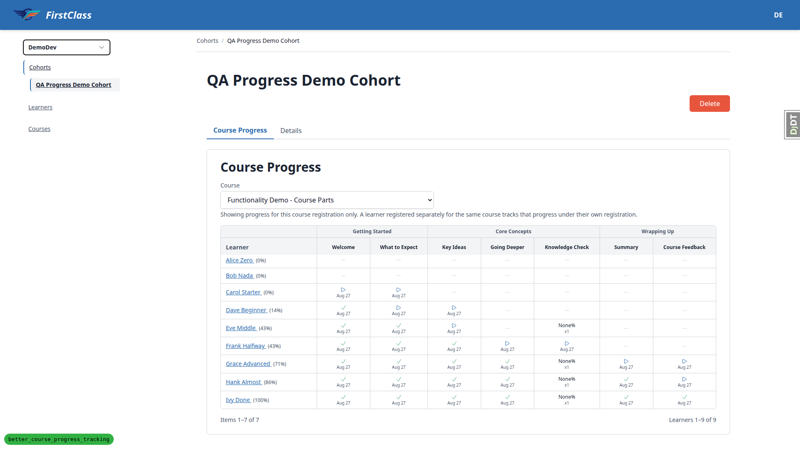
- **R4.2** (desktop) — pass. The Cohort deadline add form offers exactly one Form content type —
  "Freedom_Ls_Form_Engine | form" (id 16). There is no stale "Freedom_Ls_Content_Engine | form" row
  alongside it, which is the silent-wrong-answer case this section exists to catch. With deadlines set on
  both a topic and a form, the matrix header renders "Welcome Due: Sep 30" and "Knowledge Check Due: Oct
  15" — form items are not blank while topics show theirs.
  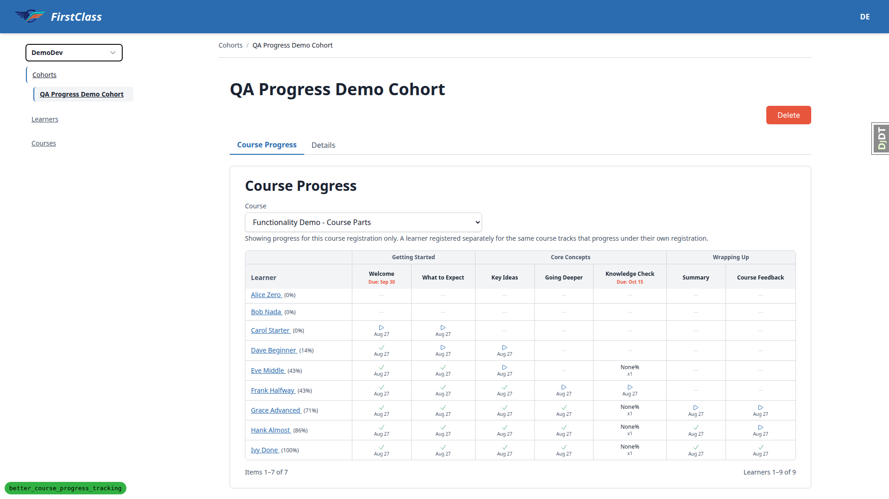
- **R4.3** (desktop) — pass. Created a `CohortDeadline` against the Knowledge Check form (content type
  16, `object_id` = the Form UUID) for QA Progress Demo Cohort, due Oct 15 2026 17:00. Saved cleanly; the
  admin changelist resolves the generic FK and displays "Knowledge Check", proving
  `ContentType.get_for_model(Form)` resolves to a live row. Reloading the educator matrix showed "Due: Oct
  15" on the Knowledge Check column and on no other column.
  
- **R4.4** (desktop) — pass. Logging in as `qa-eve.middle@example.com` initially bounced to
  `/accounts/confirm-email/` — the missing verified primary allauth `EmailAddress` row the plan's section
  0.2 warns about. Delegated to `fls-dev:qa-data-helper`, which backfilled verified primary
  `EmailAddress` rows for all nine cohort members (Eve's existed but was `verified=False`/`primary=False`,
  written by allauth during the failed attempt) and reset no passwords. After that she logged straight
  in. Her course table of contents for `functionality-demo-course-parts` shows "2.3 Completed Knowledge
  Check 15 Oct" — the deadline resolves against the correct form item on the learner side — and "1.1
  Completed Welcome 30 Sep 24 Sep", the cohort deadline plus her own override.
  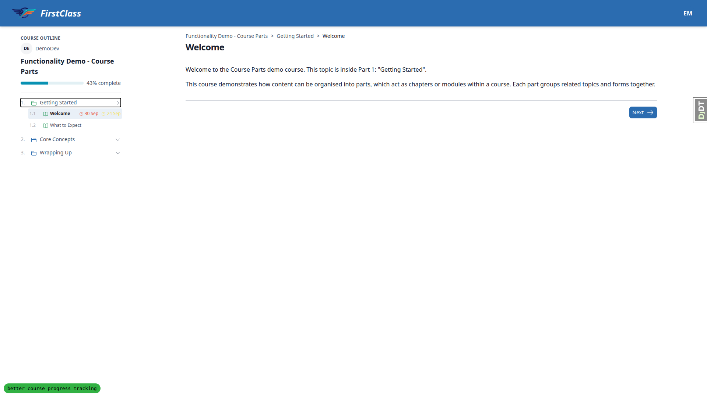
- **R4.5** (desktop) — pass. The generate action is an Unfold `actions_list` button at
  `/admin/freedom_ls_reports/generatedreport/generate/`, not an entry in the actions dropdown. Ran it
  against QA Progress Demo Cohort (course Functionality Demo - Course Parts, scored quiz Knowledge
  Check). The report reached Ready in one pass and downloaded as a 535,767-byte `application/pdf`.
  Extracted text confirms it carries the quiz questions ("What is a course part?", "What types of content
  can a course part contain?", "Which file identifies a directory as a course part"), a per-learner
  progress matrix with a Knowledge Check score column and attempt counts, a per-learner quiz-attempts
  table, and an "INCORRECT ANSWERS - KNOWLEDGE CHECK across all attempts" section pairing answers given
  against correct answers. `reports/gather.py` and `reports/indexes.py` both ran clean — no
  `RelatedObjectDoesNotExist` from `form_progress.course_attempt`.
  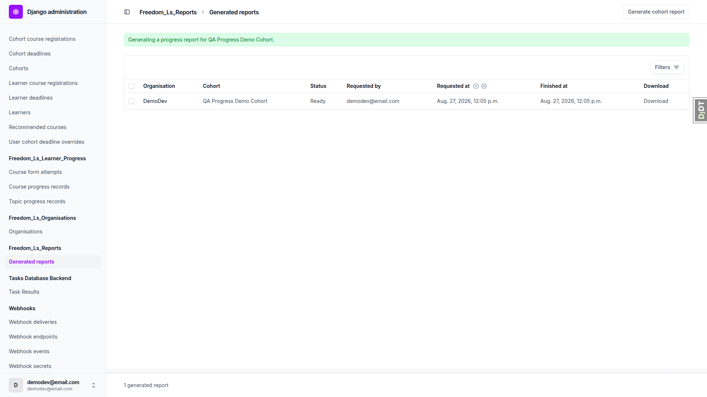

### R5 — The Django admin

- **R5.1** (desktop) — pass. `/admin/` shows a Freedom_Ls_Form_Engine section holding all seven models:
  Forms, Form pages, Form contents, Form questions, Question options, Form progress records and Question
  answers.
  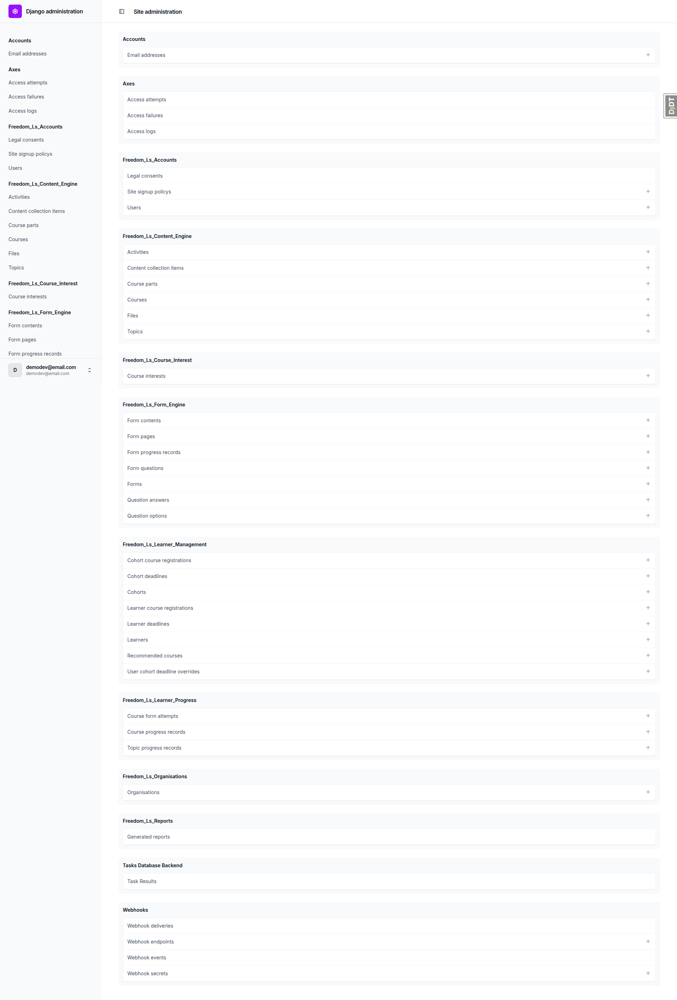
- **R5.2** (desktop) — pass. Freedom_Ls_Content_Engine lists only Activities, Content collection items,
  Course parts, Courses, Files and Topics. Forms, Form contents and Question options are gone from it, as
  intended.
- **R5.3** (desktop) — pass. Freedom_Ls_Learner_Progress lists Course form attempts (the new join
  model), Course progress records and Topic progress records. Form progress and Question answers are no
  longer there.
- **R5.4** (desktop) — pass. Opened Form "Knowledge Check": the Form pages inline rendered. Drilling
  into its Form page rendered both the Form contents and Form questions inlines. Drilling into the Form
  question "What is a course part?" rendered the Question options inline. No cross-app inline breakage.
- **R5.5** (desktop) — pass. Form progress record for `demodev@email.com` / QA All Question Types Form
  renders a Question answers inline carrying the learner's real answers, including the free-text values
  typed during R1.3.
  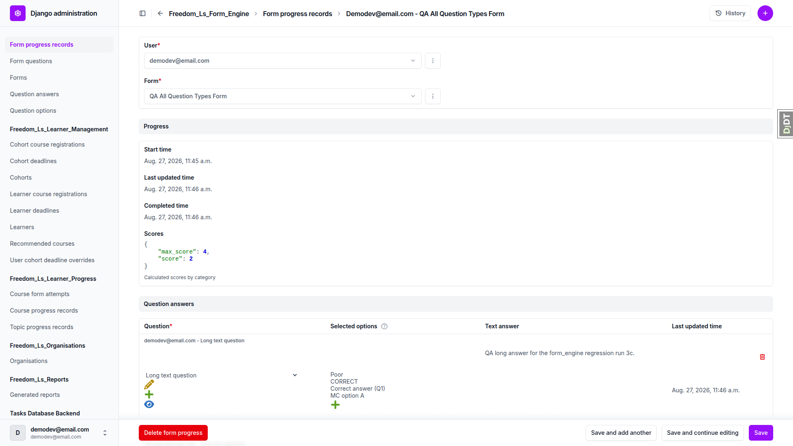
- **R5.6** (desktop) — pass. Course form attempts changelist loads with columns Course progress,
  Collection item, Form, Started, Completed, Complete; each row names a course progress record and a
  collection item. Opening a row returns 200 with fields Course progress, Collection item and Form
  progress. No `FieldError` and no 500.
  
- **R5.7** (desktop) — pass. Delegated to the `fls-dev:qa-data-helper` agent to seed a Form,
  FormProgress and CourseFormAttempt on Site 2 (Demo) under the marker "ZZ OTHER SITE", because until
  then every form row in the database was DemoDev's and the negative check was vacuous. With those rows
  in place, all six DemoDev changelists (form, formprogress, courseformattempt, formpage, formquestion,
  questionoption) returned 200 and none contained the marker; the form changelist showed 8 rows, not 9.
  The positive direction remains out of scope — `settings_dev.py` pins `FORCE_SITE_NAME` to DemoDev for
  every request regardless of port.

### R6 — The template-render-time edge

- **R6.1** (desktop) — pass. Item 1 of `functionality-demo-show-end-with-quiz` (the topic carrying a
  `<c-content-link>`) rendered with no 500, no `TemplateSyntaxError` and no `ImportError`. The "last
  chapter" link renders as the plain-text not-found fallback, which is the known content gap in section
  0.4, not a regression.
- **R6.2** (desktop) — pass. Walked all five items of `content-widgets-demo-reference` (Annotation and
  Emphasis, Media, Structured Content, Interactive Widgets, Cards). Every page returned 200, every widget
  rendered, no 500s and no traceback in the HTML. Console carried only the known report-only CSP lines
  plus the web-share and YouTube adapter warnings.
  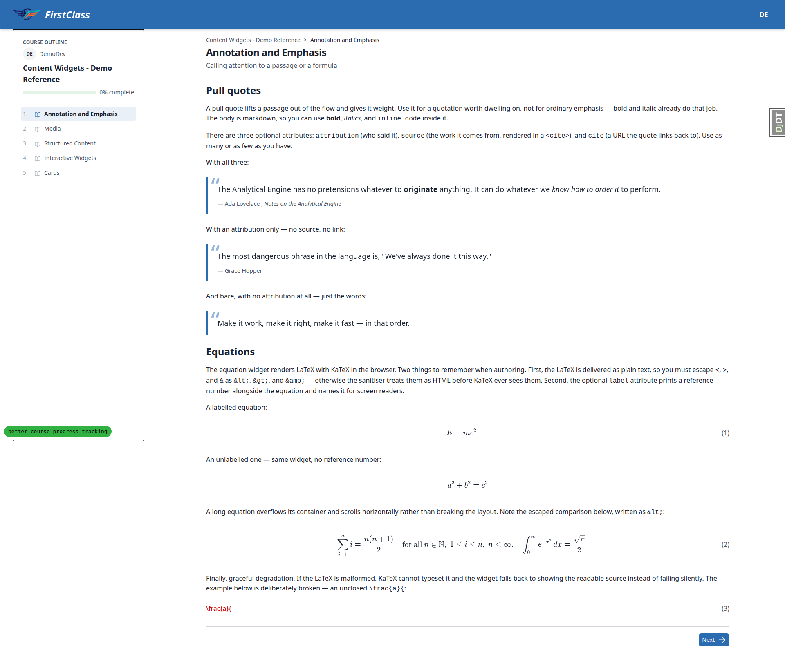
- **R6.3** (desktop) — **pass, on a re-run after the original skip.** The first run recorded this as
  untested by design, because no demo content linked to a Form by path. A fixture now exists:
  `demo_content/functionality_demo_end_with_quiz/2. topic/content.md` carries
  `<c-content-link path="../3. quiz/form.md">the Mid course Quiz</c-content-link>`, which resolves past
  the Topic lookup to the Form "Mid course Quiz". On item 1 of `functionality-demo-show-end-with-quiz`
  that link renders as `<a>the Mid course Quiz</a>` rather than a `` — a flip
  only the Form branch can produce. Page 200, no traceback in the HTML, nothing in the server log.
  Its `href` is empty, because `Form` has no `preview_url`; that is the pre-existing component gap
  recorded in §0.4 and filed under `## 9. QA` in the parent `todo.md`, not a finding of this run.
  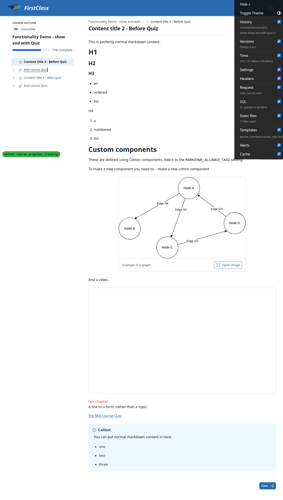

### R7 — Failure and adversarial branches

- **R7.1** (desktop) — pass. Submitting the runner page with nothing answered did not navigate; the
  browser required gate fired and focus moved to the first unanswered radio. Server 422 branch
  unreachable through the UI, as the plan anticipates.
- **R7.2** (desktop) — pass. With only the radio answered, submission was still blocked on page 1 and
  focus moved on to the next unanswered question (the short-text box). The client gate skipped the
  required checkbox group — HTML `required` cannot express "at least one box" across a group, so the
  browser passes over it. Not a regression from this branch; server-side validation still covers it.
- **R7.3** (desktop) — pass. On the End course Quiz: answered page 1, submitted to page 2, pressed
  browser Back, changed the first radio from CORRECT to "option 2 text" and resubmitted the same page. No
  `IntegrityError` and no 500. Re-reading page 1 showed the changed selection, and `QuestionAnswer` rows
  for the attempt totalled 3 with exactly one per question — answers updated rather than duplicated.
- **R7.4** (desktop) — pass. As a registered logged-in learner: `/courses/qa-question-types-course/99/`
  -> 404, `/0/` -> 404, `/1/fill_form/99` -> 404, and
  `/courses/functionality-demo-show-end-with-quiz/1/start_form` (item 1 is a Topic) -> 404. No 500, no
  traceback in any response body and no form question markup leaked.
- **R7.5a** (desktop) — pass. Logged out entirely and visited
  `/courses/qa-progression-block-course/2/start_form`. Redirected to `/accounts/login/?next=...` — not
  the form, not a 500.
- **R7.5b** (desktop) — pass. As `demodev_quizqa@email.com`, a logged-in learner not registered for
  `functionality-demo-course-parts` or `functionality-demo-show-end-with-quiz`, requests to those
  courses' `/start_form` and item URLs all landed on the course detail page. No form questions in any
  response body, no 500 and no traceback. Course authorisation alone gates form access, as the split
  intended.
- **R7.6** (desktop) — **skip**. Not run here by instruction: the plan assigns submit-on-exit to 3b.
  `progress_gaps_qa` section G6 and says explicitly not to repeat it in this plan.

### R8 — Sweep and log scan

- **R8.1** (desktop) — pass. Swept all seven courses on `/courses/` as `demodev@email.com`. Every course
  home, detail page and first item returned 200 with no traceback in the body; courses the account is not
  enrolled in redirect to their detail page, which is correct. The course list rendered all seven cards
  and the enrolled courses showed their progress bars (75%, 80%, 100%). No empty course list.
  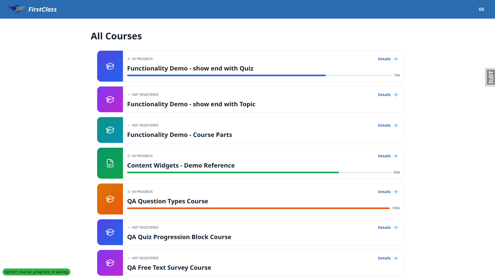
- **R8.2** (desktop) — pass. Scanned the full 1,624-line runserver log for the session. Zero occurrences
  of `ImportError`, `ModuleNotFoundError`, "doesn't declare an explicit app_label", "ContentType matching
  query does not exist", `IntegrityError`, `RelatedObjectDoesNotExist`, `TemplateSyntaxError`,
  `FieldError` or any Python traceback. Status tally: 1240x304, 289x200, 67x302, 6x404 and zero 5xx — the
  six 404s are the deliberate adversarial URLs from R7.4 plus two from an educator URL guessed wrong. The
  only non-HTTP ERROR line is a cssutils complaint about a `0.375rem` border-radius raised while WeasyPrint
  rendered the cohort report PDF; cosmetic and unrelated to the split.
- **R8.3** (desktop) — pass. Aggregated every console log captured across the run. The only entries are
  the report-only CSP lines for the CDN htmx/Alpine/chart.js scripts, three "Unrecognized feature:
  web-share" warnings, three YouTube "No available adapters" warnings, and six 404 resource errors that
  are the tester's own adversarial fetches from R7.4. All are on the plan's not-a-finding list. No new
  JavaScript errors on the form runner or completion pages.

### R9 — Responsive

Mobile, 375x812:

- **R9.1** (mobile) — pass. Dashboard at 375x812 as `qa-eve.middle@example.com`. Course cards stack to a
  single column, progress bars render with their percentages (0%, 43%), and `document.scrollWidth` equals
  `clientWidth` with zero elements extending past the viewport. The only overlap is the dev branch badge
  sitting over a "Next up" line, which is debug chrome and not product UI.
  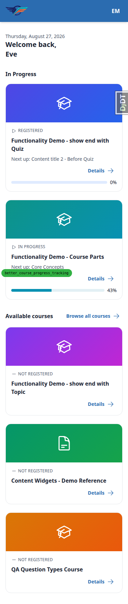
- **R9.2** (mobile) — pass. Course table of contents for the part-based
  `functionality-demo-course-parts` at 375x812. The outline moves into an "Open course outline"
  bottom-sheet drawer that opens cleanly over the content, carrying the 43% progress bar, all three
  collapsible parts, and the deadline badges: Welcome shows "30 Sep" and "24 Sep" side by side, and
  expanding Core Concepts shows the Knowledge Check form item with its "15 Oct" badge. Nothing overflowed
  or truncated.
  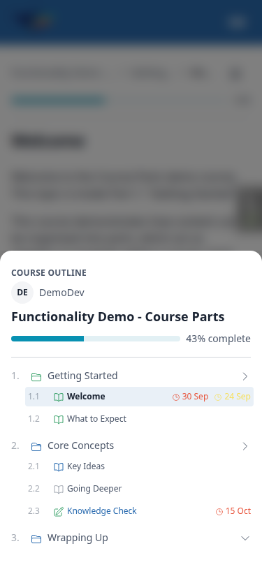
- **R9.3** (mobile) — pass. Form runner at 375x812 with all four question types on one page. Radio and
  checkbox options render as full-width tappable rows around 56px tall, comfortably above the
  touch-target guideline; the Next button spans the width. Zero horizontal overflow, all eight inputs
  present including the textarea. The runner uses a fixed-height app shell with an inner scroll region,
  so a full-page capture shows only the first screen — question 4 is reached by scrolling that region,
  which is the intended layout rather than clipping. The ready-to-submit dialog reflows to a mobile width
  with stacked Submit / Go back buttons.
  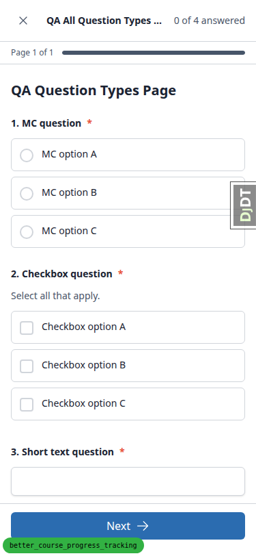
- **R9.3b** (mobile) — pass. Completion page at 375x812: the score ring renders at full size and stays
  circular, showing 50% with "2 / 4 correct" beneath it, the passed banner sits above it, and the Continue
  button spans the width. Breadcrumb text truncates with an ellipsis rather than pushing the page
  sideways.
  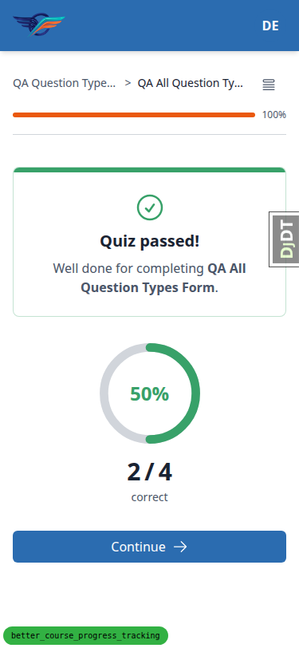
- **R9.4** (mobile) — **fail**. The container behaviour is correct: the 928px matrix sits in a 301px
  overflow-x:auto wrapper and the page itself reports zero horizontal overflow, so the table scrolls
  inside its own container rather than pushing the page sideways. But scrolling it horizontally at 375px
  leaves the learner-name cells painted in place while every other column slides beneath them, so the
  names overlap and obscure the data columns. See Bug B1 below.
  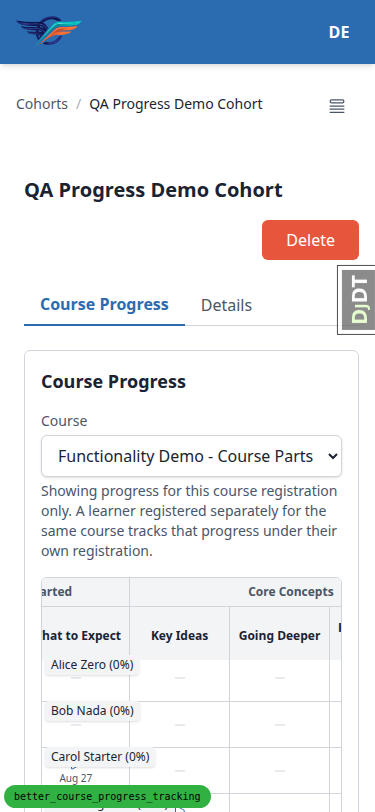
- **R9.5** (mobile) — pass. Primary navigation collapses to the logo plus a 40x40 avatar button. It opens
  a menu with Profile and Sign Out at 158x36 each, fully on-screen, and the page still has zero
  horizontal overflow with the menu open. The 40px trigger and 36px rows sit just under the 44px
  touch-target guideline — usable, pre-existing header chrome, and outside this branch's diff.
  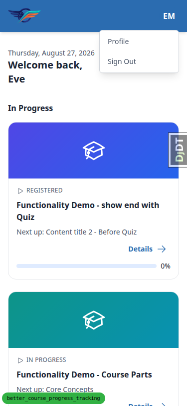

Tablet, 768x1024:

- **R9.6** (tablet) — pass. At 768x1024 the tablet gets the mobile-style navigation, not the desktop one:
  logo plus a 40x40 avatar button. It works — the menu opens with Profile, Educator Interface, Admin
  Panel and Sign Out, all fully on-screen and clickable, with zero horizontal overflow. Dashboard cards
  reflow to a two-column grid at this width.
  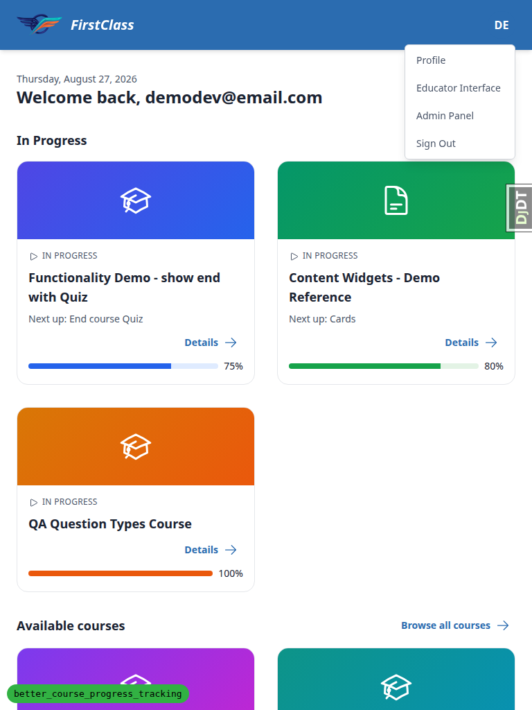
- **R9.7** (tablet) — pass. The QA Progress Demo Cohort is too small to paginate, so the fixture was
  seeded purpose-built with `qa_create_paginated_progress_matrix --educator-email demodev@email.com`: 32
  learners and 26 items in the RPAS Training organisation. Both paginators then appeared — "Items 1-15 of
  26" and "Learners 1-20 of 32". Advancing the column paginator over HTMX moved it to "Items 16-26 of 26 /
  Page 2 of 2" while the learner paginator held page 1; advancing the learner paginator then reached
  "Learners 21-32 of 32" with 12 rows, and the column paginator held page 2. They are independent and each
  preserves the other's state. At 768px the 2305px matrix scrolls inside its 628px overflow-x:auto
  wrapper with zero page overflow, and here the Learner column is correctly `position:sticky` (the `md:`
  breakpoint is active), so names stay pinned with an opaque background while the data columns scroll
  cleanly beneath — the exact behaviour that is missing at 375px in R9.4. Long item titles truncate with
  an ellipsis rather than widening the columns.
  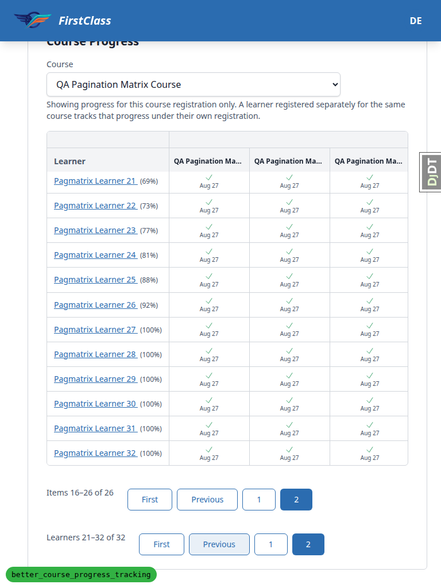
- **R9.8** (tablet) — pass. Confirmed unchanged, as the plan asks. At 768x1024 the course player still
  uses the mobile drawer rather than an inline side panel — the outline element has zero width and an
  "Open course outline" button is present. It works: the drawer slides up over the content carrying the
  course title, the 75% progress bar and all four items with their type icons. One difference from Run
  1's note: the right half of the viewport is not empty here, because the content column spans the full
  768px (left 24, right 744). Either way this is a layout observation, not a defect, and is not re-filed.
  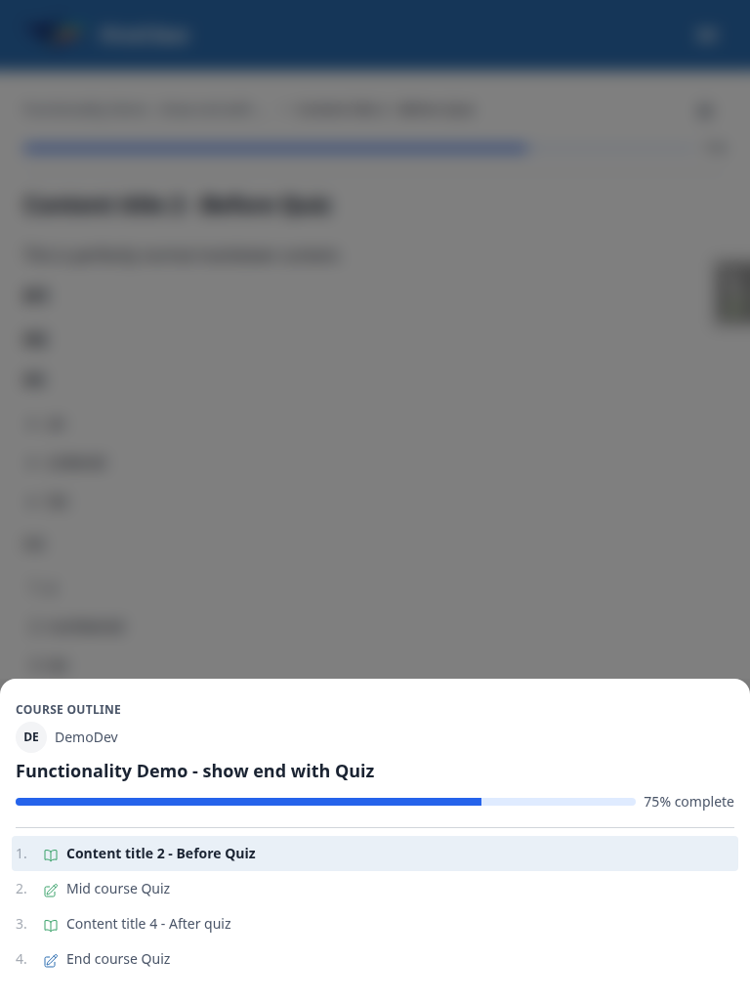
- **R9.9** (tablet) — pass. Cohort Delete on QA Progress Demo Cohort opens the blocked-state dialog,
  which is the layout this branch changed. At 768x1024 it renders as a centred card about 572px wide
  inside the 768px viewport, the blocked message reads clearly — "This cohort cannot be deleted because
  it still has 9 course progress records." — on its own tinted panel, and the 91x42 Close button plus the
  header close icon both sit comfortably. Clicking Close dismissed it cleanly and the page kept zero
  horizontal overflow throughout. Re-checked at 375x812: the card reflows to the narrower width, the
  message wraps to two lines without clipping, and the Close button stays fully visible.
  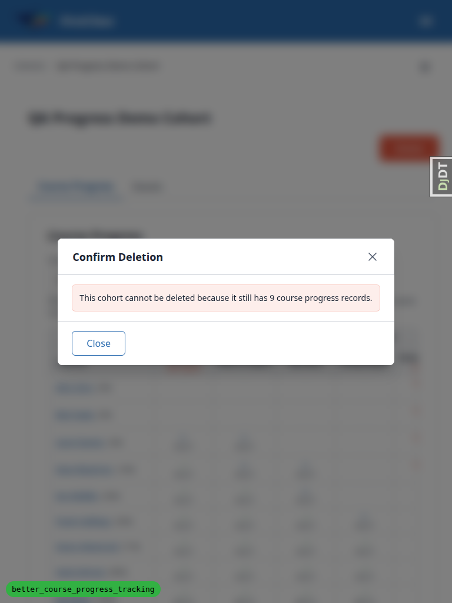

## Bug B1 — Educator progress matrix: learner-name column overlaps the data columns when scrolled horizontally below 768px

**Manifestations:**
- R9.4, mobile

**Screenshots:**

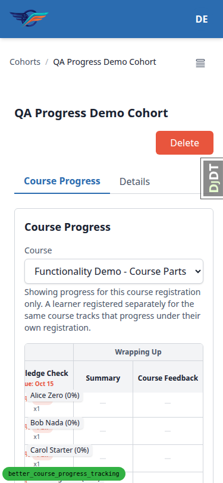

**Expected:** At 375px the Course Progress matrix scrolls horizontally inside its own container and the
learner-name cells scroll away with the rest of the row, leaving the data columns readable — the same way
every other column behaves.

**Actual:** The learner-name cells stay painted in place while the other columns slide beneath them, so
the names sit on top of the data columns and both become unreadable. Reproduced at `scrollLeft` 300 and
at the far end 629, after a settled scroll — not a stale capture. The layout is correct
(`getBoundingClientRect` puts the cells off-screen at `left -287` / `-587`, and `elementFromPoint` at the
overlap returns the underlying Knowledge Check cells) — only the painting is wrong. Cause: in
`course_progress_panel.html` the row-header cells carry `z-10` (header cells `z-30`) plus an opaque
background unconditionally, while `position:sticky` is applied only at the `md:` breakpoint, so below
768px they are `position:static` elements that still get promoted to a stuck paint layer. At 768px, where
sticky is active, the column behaves correctly (see R9.7). Pre-existing, not a regression from this
branch: `git diff main...HEAD` on `course_progress_panel.html` shows this branch added only an
explanatory paragraph and left every sticky and z-index class byte-identical to `main`.

## Bug status

- **UNRESOLVED** — B1: Educator progress matrix: learner-name column overlaps the data columns when scrolled horizontally below 768px (reason: red lane — pre-existing on `main`, not a regression from this branch, and a CSS/compositing defect that cannot be verified without a browser, so it fails the auto-fix conditions on both counts)

## General notes

**Not tested, and why.**
- ~~The Form branch of `content_tags.get_content_by_path` (R6.3): no demo content links to a Form by
  path, so no fixture reaches that branch.~~ **Closed on 2026-08-27.** A Form link was authored into
  `demo_content/functionality_demo_end_with_quiz/2. topic/content.md` and R6 was re-walked; R6.3 now
  records a pass. The branch also gained unit coverage in
  `freedom_ls/content_engine/tests/test_content_tags.py`, and
  `freedom_ls/content_engine/tests/test_demo_content_form_link.py` guards the fixture against the silent
  rot that produced this gap in the first place.
- Submit-on-exit (R7.6): owned by `3b. progress_gaps_qa` section G6; the plan for this run says
  explicitly not to repeat it here.
- The positive direction of admin site scoping (R5.7): unreachable because `settings_dev.py` pins
  `FORCE_SITE_NAME` to DemoDev for every request regardless of port, so only the negative direction
  (a second site's rows are absent from DemoDev's changelists) could be exercised.

**Data gaps hit during the run, fixed via the `fls-dev:qa-data-helper` agent.**
- No non-DemoDev form rows existed in the database, which made the R5.7 site-scoping check vacuous. The
  helper seeded a Form, FormProgress and CourseFormAttempt on Site 2 (Demo) under the marker "ZZ OTHER
  SITE" to give the negative check something to exclude.
- The `qa_create_cohort_progress` learner personas had no verified primary allauth `EmailAddress`, so
  they bounced to `/accounts/confirm-email/` and could not log in (surfaced at R4.4). The helper
  backfilled verified primary `EmailAddress` rows for all nine cohort members.
- As a result of these fixes, the helper left two source files modified and uncommitted:
  `freedom_ls/qa_helpers/management/commands/qa_create_site_scoping_form.py` (extended to build the whole
  chain down to `CourseFormAttempt`) and
  `freedom_ls/qa_helpers/management/commands/qa_create_cohort_progress.py` (now ensures a verified email
  for each persona it creates). These are QA-helper commands, not product code, but a human should decide
  whether to keep them.

**Other account gap.** The educator persona `qa-educator-progress@example.com` has the same
missing-`EmailAddress` problem observed for the cohort personas and will bounce to the verification page
if used.

**Known and already-judged items, observed again and deliberately not re-filed.**
- The literal `None%` text in the educator progress grid, where a completed attempt's
  `FormProgress.scores` is null.
- The "last chapter" content link rendering as the not-found fallback.

**`qa_complete_form` skipped-count wording.** It prints a skipped line only when non-zero, and counts
only learners unregistered for the course; a member who already holds an attempt is passed over silently.
That is why 9 members yielded 4 completions with no skipped line printed.

**Server log.** The one non-HTTP ERROR line in the runserver log for the session is a cssutils complaint
about a `0.375rem` border-radius, raised while WeasyPrint rendered the cohort report PDF.

---

status: ok · reason: 1 bug — 0 fixed, 1 unresolved (red lane, pre-existing on main); report rendered, screenshots verified
