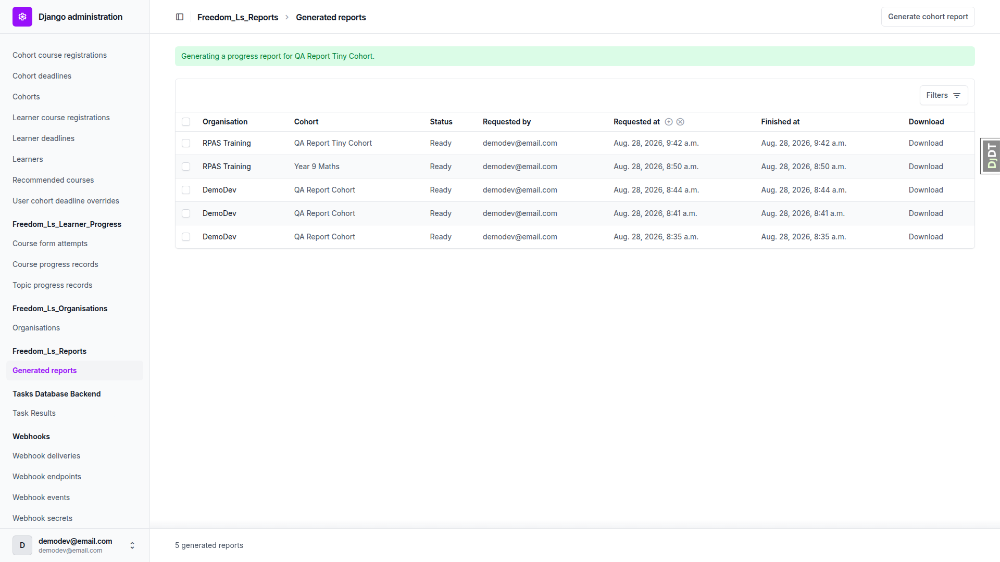
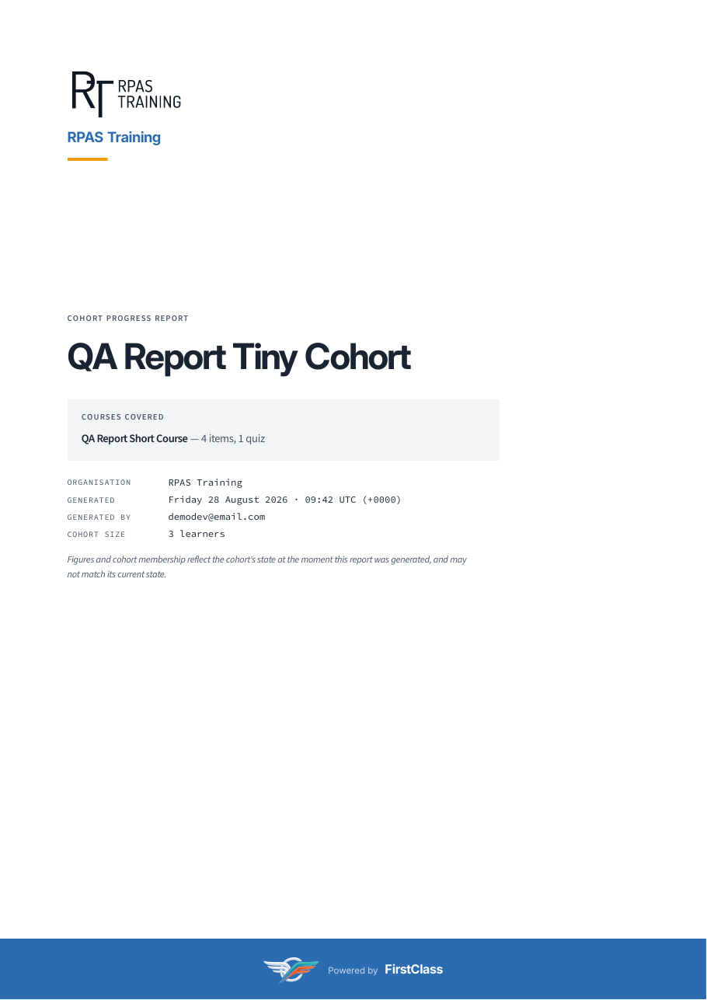
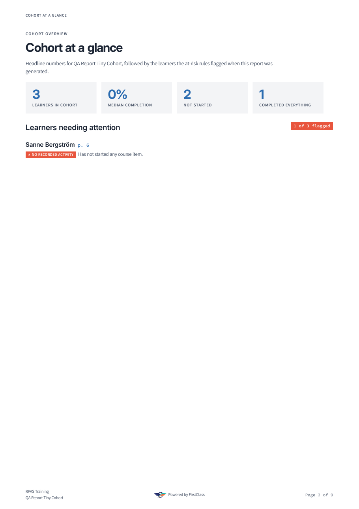
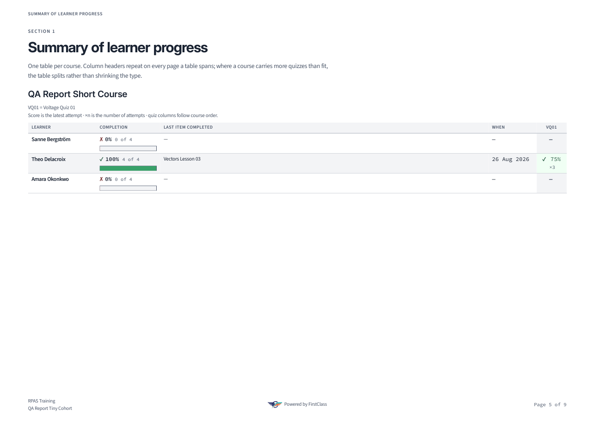

# QA report — 3d. report_smoke_qa

The report feature survived the re-keying of `CourseProgress` onto the granting registration. A report generates, downloads under the organisation-first filename, opens as a valid 9-page PDF, and, the point of this plan, carries real numbers rather than an empty shell, confirmed against the database.

## Methodology

The run executed the `3d. report_smoke_qa` plan against a dev server the run started on port 8000. Port 8000 specifically, because the `DemoDev` Site is bound to `127.0.0.1:8000`: any other port resolves to a different Site and would have tested the wrong data. Browser work was done through Playwright MCP as the admin `demodev@email.com` in the Django admin at 1920x1080. PDF assertions were done in the shell with `pdfinfo`, `pdftotext`, `pdfimages` and `pdftoppm`, plus Django shell cross-checks against the database. Screenshots were collected into `screenshots/` beside this report, and every image referenced below exists there. The run did not abort at the smoke gate, so every step ran.

## Diff scoping

The scoping record classifies the change as **FULL**, triggered by changed template/`.html` and Python paths:

- `freedom_ls/reports/gather.py`
- `freedom_ls/reports/indexes.py`
- `freedom_ls/reports/report_data.py`
- `freedom_ls/reports/templates/reports/partials/attention_entry.html`
- `freedom_ls/reports/templates/reports/partials/contents.html`
- `freedom_ls/reports/templates/reports/partials/learner_detail.html`
- `freedom_ls/educator_interface/templates/educator_interface/partials/course_progress_panel.html`
- `freedom_ls/learner_interface/templates/learner_interface/course_finish.html`
- `freedom_ls/learner_interface/templates/learner_interface/course_topic.html`
- `freedom_ls/learner_interface/templates/learner_interface/partials/course_list.html`
- `freedom_ls/panel_framework/templates/panel_framework/partials/delete_confirmation.html`

What was **not** run, and why: the mobile (Step 8) and tablet (Step 9) passes were skipped. This is a deliberate, plan-directed narrowing of a FULL classification, not a silent skip. The test plan is explicitly scoped desktop-only, because the artifact under test is a fixed-page-size PDF with no responsive behaviour, and the browser half of the run is the Django admin, not a learner-facing responsive surface. The plan assigns this branch's mobile and tablet passes to `3c. form_engine_regression_qa`'s R9 section, which has already run.

## Smoke gate

Passed. Two pages were loaded as the logged-in admin:

- `http://127.0.0.1:8000/`
- `http://127.0.0.1:8000/admin/freedom_ls_reports/generatedreport/`

## Results

### RS0.0 — Database state

Purpose: confirm the worktree's database is on the rebuilt `form_engine` schema before anything else runs, since a migrated-not-rebuilt database breaks every course containing a form.

Observed: `form_engine` migrations `0001_initial`, `0002_formprogress_questionanswer` and `0003_alter_formprogress_form` all show `[X]`. The database is on the rebuilt schema; no drop/rebuild was needed.

### RS0.1 — Seed the data

Purpose: idempotently seed the fixture data the rest of the plan depends on.

Observed: seed ran clean. `create_demo_data` was skipped per the plan, since `demodev@email.com` already logs in. `qa_create_organisations DemoDev` reused RPAS Training (has a logo). `qa_create_report_fixtures --only tiny-cohort-short-course --organisation-slug rpas-training` built `qa-report-short-course` (4 items, 1 quiz) and QA Report Tiny Cohort (3 learners, pk `a92e7e05-5a9c-4e12-9c5b-3a69d04a526e`). No traceback, no click usage error.

### RS1 — A report generates

Purpose: confirm a report can be generated from the admin against RPAS Training's tiny cohort, and that the run is clean end to end.

Observed: the Generate cohort report dropdown is one flat list ordered by organisation (DemoDev, Northside, RPAS Training, Southgate) and contains "RPAS Training - QA Report Tiny Cohort". Submitting returned the changelist with "Generating a progress report for QA Report Tiny Cohort." A new row appeared: RPAS Training / QA Report Tiny Cohort / status Ready, pk `ecebf7fa-a17e-4a9a-acf2-868f8aae1a7c`, generated 9:42 a.m. The runserver console was clean: no traceback, no exception, no warning across the whole generation request.

### RS2 — It downloads, named for the organisation

Purpose: confirm the download succeeds and the filename puts the organisation before the cohort.

Observed: the download link returned a file, not a 404/500. Playwright reported the suggested filename as `rpas-training-qa-report-tiny-cohort-progress-report.pdf`, organisation slug first, then cohort slug, exactly as specified. The downloaded file is 614152 bytes, matching the on-disk artifact.

### RS3 — The file is a real, short PDF

Purpose: confirm the PDF parses cleanly, stays under the page ceiling, and is not an empty render.

Observed: `pdfinfo` parses the file without error. Pages: 9, under the 15-page ceiling. Title: "QA Report Tiny Cohort - Cohort progress report". File size 614152 bytes (600 KB), well past the 2 KB empty-render threshold. Page 5 is landscape (841.89 x 595.276), the rest A4 portrait, so the summary table rotated as designed.

### RS4 — The organisation's brand is on the cover

Purpose: confirm RPAS Training's logo and name render correctly on the cover, as real embedded content rather than missing glyphs or a broken image reference.

Observed: the cover renders the RPAS Training logo whole at top left, not clipped, squashed or stretched. The organisation name is set as text directly beneath the logo, above a left-aligned orange accent rule. The metadata list's ORGANISATION row reads "RPAS Training" in full; COHORT SIZE reads "3 learners"; the cover names the cohort as its title. `pdftotext` on page 1 confirms "RPAS Training" is real text, not missing-glyph boxes. `pdfimages` shows page 1 carries two images (org logo 1324x609 and platform mark 1512x737), so the logo is genuinely embedded.

### RS5 — The band and the footer

Purpose: confirm the cover's branded band and the running page footer render correctly and do not duplicate or collide.

Observed on the cover: the solid blue band at the foot bleeds off the left, right and bottom edges, carrying the platform's reversed (on-dark) mark followed by "Powered by FirstClass". `grep -c 'Powered by'` on page 1 returns exactly 1, the band only, nothing duplicated into the bottom margin.

Observed on pages 2 and after: bottom-left is a two-line stack, "RPAS Training" then "QA Report Tiny Cohort", and nothing else; bottom-centre is the full-colour mark beside "Powered by FirstClass" on one line; bottom-right reads "Page N of 9". The three do not collide. The landscape page 5 carries the whole footer row too.

*Cover band, zoomed: reversed platform mark and "Powered by FirstClass".*

*Page 2 footer stack: organisation/cohort bottom-left, mark and "Powered by" bottom-centre, page number bottom-right.*

### RS6 — Document properties

Purpose: confirm the PDF's metadata (Author, Creator) is set correctly and not double-tagged.

Observed: `pdfinfo` metadata shows Author "RPAS Training", the organisation and one name only, no "RPAS Training, DemoDev" double tag. Creator "FirstClass", the platform display name (`HEADER_TITLE` in `config/settings_dev.py`) that the report code and its own test (`test_pdf_integration.py:766`, asserting `creator == site_context.name`) treat as the site name. Producer WeasyPrint 69.0.

### RS7 — The numbers are real

Purpose: confirm the report's content reflects real learner and quiz data, not an empty shell that happens to render, which is the failure mode the `CourseProgress` re-keying makes possible.

Observed: the numbers are real, not an empty shell. All three learners appear with a section each (Sanne Bergstrom p6, Theo Delacroix p7, Amara Okonkwo p8). The landscape summary table carries a VQ01 column for the course's one quiz, and Theo Delacroix's cell holds a score: "checkmark 75% x3". Sanne and Amara show a dash, which is correct rather than a join-row failure: the database cross-check returns 3 `CourseFormAttempt` join rows on `course_progress__cohort_registration__cohort`, and all 3 are Theo's three attempts. Completion is not uniformly 0%: Theo 100% (4 of 4), the other two 0%, and the at-a-glance tiles read 3 learners / 0% median / 2 not started / 1 completed everything, all matching `CourseProgress` rows in the database (pct 0, 0, 100). One learner is flagged at risk, named, with a reason: "Sanne Bergstrom - NO RECORDED ACTIVITY - Has not started any course item." The confusion and incorrect-answer tables hold real option text ("Voltage Q04 option C x1", "Voltage Q04 option A (correct)"), not "Not answered" for everything.

*Landscape summary table, page 5.*

## Bug status

There are no bugs: every test in this run passed.

## General notes

**At-a-glance "NOT STARTED" tile vs. the learner's own section.** The at-a-glance tile counts Amara Okonkwo under "NOT STARTED", while her own section on page 8 reads "Started, but nothing completed yet." Both are true under their own definitions: `gather.py:726` computes `not_started_count` as the number of learners whose completion value is 0, whereas the learner detail keys off whether any `TopicProgress` row exists. The database confirms Amara has one `TopicProgress` row with a start time and no complete time, and a `CourseProgress` at 0%. The two labels disagree at a glance for a learner in exactly that state. This is not a failure of any check in this plan and not a regression this branch introduced.

**Test plan drift on the page-footer platform name.** The plan's RS5 expects the cover band to read "Powered by FirstClass" and the page-2+ footer to read "Powered by DemoDev". The report renders "Powered by FirstClass" in both places, and that is correct: `reports/templates/reports/report.html:69` and `partials/title_page.html:76` both resolve the same `data.site_name` value, so the two can never differ. FirstClass is `HEADER_TITLE` from `config/settings_dev.py`; DemoDev is the `django.contrib.sites` `Site.name`. The "Powered by DemoDev" line is stale text in the plan, not a product regression: the plan is what needs correcting, not the product.

As context: the changelist carried four report rows from earlier runs the same morning. This run's row was identified by its 9:42 timestamp and pk `ecebf7fa-a17e-4a9a-acf2-868f8aae1a7c`.

status: ok
reason: report rendered, 9 tests, 0 bugs documented
