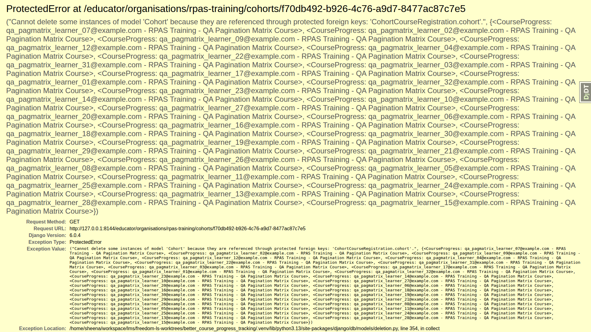
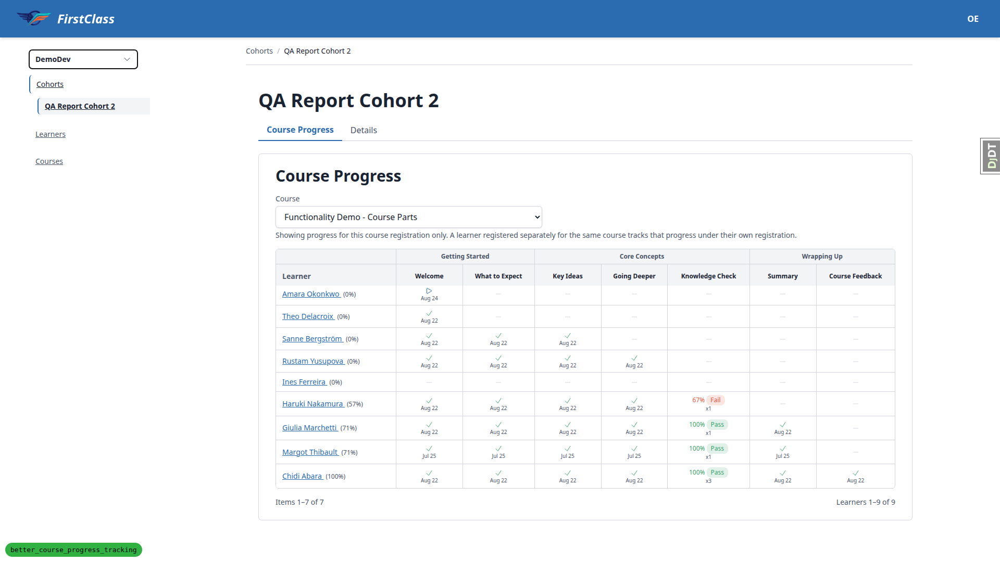

# QA Report: Better Course Progress Tracking

**Verdict:** The core of this change — success criterion 5, two organisations independently tracking progress for the same course via separate grants (an individual registration and a cohort registration) — was verified end-to-end and passed cleanly, including admin-level confirmation that `started_at` is genuinely set on first content open rather than at registration. However, one HIGH-severity regression was found: the educator cohort panel returns an unhandled HTTP 500 (`ProtectedError`) for any cohort that has granted course progress records, when viewed by a user for whom the delete action renders. Two lower-severity issues were also found, both in QA tooling/documentation rather than product code. Several plan sections were not executed within the run's budget, most notably section 3 (success criterion 6, shared content across two courses) and section 8 (success criterion 9, per-organisation deadlines) — neither of the two other success criteria this run had budget to reach was disproved, they simply were not tried.

## Methodology

Testing was performed manually through a real browser (Playwright MCP) against a local dev server on port 8144 running branch `better_course_progress_tracking`. Screenshots were collected into `spec_dd/2. in progress/better_course_progress_tracking/screenshots/`, and every image referenced in this report exists in that directory alongside it. All four of the section 0.2 seed commands were run — two required corrections to the arguments documented in the plan before they would succeed (see bug B3). The desktop pass covered the bulk of the test plan; dedicated mobile (375x812) and tablet (768x1024) passes were also run against the templates this change touched.

## Diff scoping

The scoping check fired the **FULL** class. The changed-file set spans the templates this change touches directly (`course_progress_panel.html`, `course_finish.html`, `course_topic.html`, and the `reports` app's `attention_entry.html` / `contents.html` / `learner_detail.html` partials) plus a large body of Python across `learner_progress`, `learner_interface`, `educator_interface`, `learner_management`, `reports`, and the QA helper commands, tests, migrations and spec docs. Nothing was skipped on scoping grounds — because the class was FULL, the desktop, mobile **and** tablet passes all ran in this session.

## Smoke gate

The smoke gate **passed**. Both the homepage (`http://127.0.0.1:8144/`) and a course detail page (`http://127.0.0.1:8144/courses/functionality-demo-course-parts/detail/`) loaded without error, so the full test matrix proceeded rather than being short-circuited.

## Bugs

### B2 — Educator cohort panel 500s with ProtectedError when the cohort has granted course progress records

**Severity:** HIGH

**Manifestations:** test 4.12 (desktop), test 4.12b (desktop, scoping experiment)

**Expected:** `GET` on an educator cohort panel should render the cohort's tabs and Course Progress matrix, whoever is viewing. The new `PROTECT` constraint should surface as a friendly protected-object message when someone tries to *delete* the cohort, exactly as it already does in the Django admin.

**Actual:** `GET /educator/organisations/rpas-training/cohorts/<id>` raises an unhandled `ProtectedError` and returns HTTP 500: *"Cannot delete some instances of model Cohort because they are referenced through protected foreign keys: CohortCourseRegistration.cohort."* Traceback chain: `educator_interface/views.py:1231` (`interface`) → `panel_framework/views.py:640` (`_dispatch_resolved`) → `:505` (`render`) → `:68` (`_render_tabbed`) → `:130` (`_render_instance_actions`) → `panel_framework/actions.py:81` (`render`) → `actions.py:245` (`get_cascade_summary`) → `collector.collect([instance])` → `django/db/models/deletion.py:354`, which raises `ProtectedError`. The panel framework's delete instance-action renders a cascade *preview* by calling `Collector.collect()`; under this change's new `PROTECT` constraint that call now raises instead of returning a deletable-object summary, and nothing catches it. Reproduced (4.12b) on two cohorts with granted records (RPAS "QA Pagination Cohort" `f70db492` and RPAS "Year 9 Maths" `785bfe6d`); the RPAS "Year 10 Science" cohort (`dad1831c`), which has no granted records, renders 200 normally. The crash is scoped to viewers for whom the delete action renders — the superuser hit it; educator personas Olive and Lena, viewing the same panels, did not. This is a regression introduced by this branch's new `PROTECT` relationship: the Django admin already handles the same constraint gracefully, but the panel framework does not.

### B1 — qa_create_report_cohort leaves stale progress_percentage, so the educator matrix shows 0% next to completed cells

**Severity:** MEDIUM

**Manifestations:** test 4.3 (desktop)

**Expected:** A seeded QA cohort should render a coherent Course Progress matrix: each learner's percentage in the left column should agree with the completed cells across their row.

**Actual:** Immediately after seeding, learners showed percentages that contradicted their own cells — Theo Delacroix at 0% with a "Completed Aug 22" cell, Sanne Bergstrom and Rustam Yusupova likewise at 0% with completed cells present. The read path itself is not at fault: the cells and the percentage are read from the same `CourseProgress` record. The seed command writes already-complete `TopicProgress` rows without recalculating the owning `CourseProgress.progress_percentage`, so the stored value stays at 0. Running `uv run python manage.py recalculate_progress_percentages` updated 14 records, after which every row agreed with its cells (Theo 0%→14%, Sanne→43%, Rustam→57%). Impact: this QA fixture produces a false-looking incoherence that is exactly the symptom this change's success criteria tell a tester to treat as a serious read-path defect, so it is worth fixing at the source.

### B3 — Test plan's section 0.2 seed invocations are stale — two commands reject them for missing required arguments

**Severity:** LOW

**Manifestations:** test 0.2 (desktop)

**Expected:** Copy-pasting the four seed commands from section 0.2 of the test plan should seed the QA data. The plan itself warns that an `ERROR` from `qa_create_organisation_scenarios` or `qa_create_cohort_progress` is a real regression in the QA helpers (plan Task 21).

**Actual:** Two of the four commands fail immediately in their documented form: `qa_create_cohort_progress` exits with `Error: Missing argument 'SITE_NAME'`, and `qa_create_report_cohort` exits with `Error: Missing option '--cohort-name'`. Both succeed once the missing arguments are supplied (`qa_create_cohort_progress DemoDev`; `qa_create_report_cohort --cohort-name ... --course-slug ...`). These are usage errors, not tracebacks, so this is not the Task 21 crash the plan is warning about — but a tester following the plan literally hits a hard stop and, per the plan's own instruction, would wrongly log it as a regression. Separately: `qa_create_report_cohort` silently produces a cohort with **no** course registrations unless `--course-slug` is passed, leaving its Course Progress panel reading "No course registrations found for this cohort"; the plan's section 0.3 claims every seeded learner's password equals their email, but `qa_create_organisation_scenarios` prints "All persona passwords: demodev@email.com"; and section 13.1 names an `--email` option that is actually `--learner`. The plan and the commands need reconciling.

## What passed

**Section 1 — golden path (desktop):** Dashboard lists registered courses with progress bars (1.1); course player advances through items and updates the header percentage (1.3, 1.4); resume pointer survives navigation away (1.5); completing every item reaches the finish page at 100% (1.6); course moves from In Progress to Learning History with no duplicate card after completion (1.8). **Highest-value:** test 1.2 — a freshly-registered learner with a progress record but no content opened still sees "Start course", not "Continue", confirming no eager-creation regression. Test 1.7/1.7b — the finish page's "Started:" field is populated and, cross-checked in the admin against a record with three distinct timestamps (created_at / started_at / completed_time), is genuinely `started_at` set on first content open, not `created_at` copied from registration.

**Section 2 — two-organisations core (desktop):** Admin's rewritten Course progress changelist renders with the new Learner/registration columns and searches by learner email (2.4); exactly two independent `CourseProgress` records exist for the overlapping-course scenario, one per grant (2.5); Topic/Form progress changelists render without a `FieldError` (2.6); the player resolves to the cohort-granted organisation and progresses only that record (2.7); the dashboard lists the overlapping course exactly once, reading courses rather than records (2.10). **Headline results:** tests 2.8 and 2.9 — after Cara worked in and then completed the overlapping course, only the cohort-granted RPAS record moved (started_at, then completed_time) while the individually-granted Northside record for the same course stayed completely untouched (empty started_at/completed_time, 0%, unset resume pointer) at both checkpoints.

**Section 4 — educator matrix (desktop):** Matrix renders per-cohort with one row per member and one column per item (4.2); percentages agree with cells once seed data is corrected (4.3, see B1); cohort progress is shown, not merged across a learner's other registrations (4.4); the "showing progress for this course registration only" explanatory line is present (4.5); switching the registration selector updates both halves together (4.6); organisation scoping holds for cohort membership and the org switcher (4.8); a per-cohort educator grant sees only their cohort (4.9) and is 404'd on a different cohort by direct URL (4.10); a non-educator is 404'd at `/educator/` and on direct cohort URLs (4.11). **Highest-value:** test 4.7 — on a purpose-built 32-learner/26-item cohort, both the learner and item paginators work independently and progress stays attached to the right learner and the right item on page 2 of both axes (verified against exact expected cell counts per percentage).

**Section 5 — protected deletes (desktop):** Deleting a `LearnerCourseRegistration` that granted a record is refused with a protected-object message naming the record, not a 500 (5.5); deleting a cohort with granted records is refused the same way (5.6); deleting a `Topic` with progress against it is refused, preventing a silent cascade that would wipe completions (5.7).

**Sections 7/14 — fan-out and webhooks (desktop):** A new individual registration immediately creates a progress record on the correct site/org at 0% with no eager `started_at` (7.2); adding a cohort registration fans out a record per active member with no eager `started_at` (7.3); deactivate/reactivate of a registration does not duplicate or reset a record (7.4); registering the same course individually and via cohort produces one independent record per grant (7.5). Both `course.registered` and `course.completed` webhook payloads carry the new `organisation_id` and `course_progress_id` fields alongside the original five/five, verified against real emitted events rather than a static reference (14.2); events fire once on creation only, not on no-op saves or deactivate/reactivate (14.4, 14.5, 14.6); the `course_progress_id` and `organisation_id` on a real `course.completed` event correctly identify the cohort-granted record and organisation the learner was studying through, not her other organisation's registration for the same course (14.7).

**Sections 10/11 — access gates (desktop):** Guessing a locked item or start-form URL redirects to course detail rather than crashing or creating progress, and leaves no trace of the blocked visit in the learner's progress rows (10.1, 10.2, 9.9). An unregistered learner sees the full catalogue with "Not registered" badges and no progress UI (11.2), a working "Enrol for free" CTA (11.3), and is redirected away from the player with zero progress rows created (11.4).

**Section 9 — quizzes (desktop):** Results page shows score, pass/fail verdict, per-question review and retry link (9.2); failing blocks course completion with a named "Still to pass" quiz (9.3); passing on retry unlocks and completes the course (9.4); "Previous attempts" lists exactly this course's attempts, newest first, with no cross-course leakage (9.5); leaving a form part-way and returning reuses the same attempt and marks the item/part "In progress" (9.6); submitting with required questions unanswered blocks progress (enforced client-side via HTML5 validation) (9.8).

**Section 12 — report generation (desktop):** Generating a cohort report via the admin action completes with a "Finished at" timestamp and a working download, no traceback (12.2).

**Section 13 — reset (desktop):** `qa_reset_learner_progress` (option is `--learner`, not `--email` as the plan states) cleanly deleted Form/Topic progress and reset Course progress rows to a freshly-registered state; confirmed in the browser afterwards that the learner's CTA read "Start course" again while remaining registered (13.1).

**Mobile pass (375x812):** Dashboard single-column layout with no overflow (8.1); course player TOC correctly collapses to a bottom-sheet drawer with the resolved organisation shown (8.2); finish page renders Started/Completed as stacked pairs, both populated (8.3); educator matrix collapses to a full-width course selector with the wide table scrolling inside its own container rather than the page body (8.4).

**Tablet pass (768x1024):** Educator matrix gets the desktop-style header, percentages still agree with cells at this width, long item names truncate cleanly (9.1t); course player shows full untruncated breadcrumbs and comfortably-sized navigation (9.2t).

## Not tested

- **Section 3 — shared content across two courses (success criterion 6).** Not executed; not reached before the run's budget was spent. This is one of the two success criteria this change exists to satisfy — the other, criterion 5, was tested thoroughly in section 2 and passed. The topic-progress admin shows each `TopicProgress` keyed to both a course progress record and a collection item, which is the shape that makes per-course independence possible, but that is structural evidence only, not a behavioural test.
- **Section 8 — per-organisation deadlines (success criterion 9).** Not executed; not reached before the run's budget was spent. Requires seeding conflicting deadlines through a learner's two organisations for an overlapping course and proving only the resolved organisation's deadline is shown, including hard-deadline lockout behaving per-organisation. The plan itself flags this as "the behaviour reversal with nothing to grep for", so it deserves a dedicated pass.
- **Test 13.2 — `danger_content_delete --yes`.** BLOCKED, not a "did not get to it" skip: this session's command-permission classifier refused the destructive-operation command outright, and no workaround was attempted. This is one of the plan's explicit "what pass means" criteria (the command must complete without a `ProtectedError` now that progress rows protect content) and is the regression that would ruin the next person's database reset. A human must run it directly and confirm it completes, then re-seed from section 0.2. Test 13.3 (re-seed after 13.2) was consequently also not executed.
- **Section 12 report body checks (12.3, 12.4, 12.5/12.6/12.7).** Reports render only as a downloaded PDF (weasyprint) via `FileResponse`; there is no HTML view, so in-browser clicking of Contents anchors, the "No recorded activity" flag, quiz attempt numbering, and the completion-count cross-check against the educator matrix could not be exercised. The Contents/attention-entry anchor ids were cross-checked statically instead: `contents.html` and `attention_entry.html` both link `href="#learner-{{ learner.learner_id }}"`, and `learner_detail.html` renders `id="learner-{{ learner.learner_id }}"` — the same re-keyed identifier on both sides, so the anchors correspond, but a human should confirm the jump actually works in a PDF viewer.
- **Section 5.1–5.4 and section 6.** Only 5.5–5.7 (protected-delete refusals) ran. Not executed: deactivating a learner and confirming their progress record survives unchanged (5.1–5.3), deleting a cohort membership and confirming the record survives (5.4), and the educator matrix still showing a deactivated member with history intact (section 6, depends on section 5).
- **Miscellaneous not reached:** 7.1 (a brand-new `CohortMembership` fanning out progress per active registration — the sibling case 7.3 was tested and passed); 9.1/9.7 (submit-on-exit quiz idempotency — no form in the demo course is configured for submit-on-exit, only "Leave and save"); 11.5 (`qa_create_course_access_types` walk of free/application-gated/registration-gated courses); 12.1 (opening a report as an educator rather than generating it as superuser); 14.1/14.3 (an integrator-facing webhook event-type reference page — not located in the admin, see General notes — and a live webhook catcher endpoint).

## General notes

- The admin has no integrator-facing "event type reference" page for webhooks that could be found; the new payload fields were instead verified against real emitted `course.registered` / `course.completed` events, which is stronger evidence anyway.
- A course part whose children are partly complete but with none currently "in progress" displayed "Not started" rather than "In progress" (an "In progress" part state does exist and was observed elsewhere in the run). Low confidence this is related to this change; worth a look.
- The learner dashboard's empty "In Progress" section reads "You haven't signed up for any courses yet." even for a learner who IS registered but has completed everything — misleading copy, and more visible now that completed courses move out to Learning History under this change.
- At 768px (tablet) the course player still uses the mobile drawer for the table of contents, leaving the right half of the viewport empty. This works correctly; it is purely a layout observation, not a defect.
- Deviation from the plan: plan section 2.1 says to create a second `LearnerCourseRegistration`, but its own section 2.8 expects "the cohort-granted one" to win — those two instructions are inconsistent with each other. A `CohortCourseRegistration` was created instead, which is the configuration the plan's own expectations describe and the one that actually exercises success criterion 5.

## Bug status

**FIXED** — B2: Educator cohort panel 500s with ProtectedError when the cohort has granted course progress records. `DeleteAction` now catches `ProtectedError` on both the render and the submit path (`panel_framework/actions.py`), showing a plain "This cohort cannot be deleted because it still has 3 course progress records." in the dialog with no Delete button; the submit path answers 422 rather than 500. Fixed on `DeleteAction` itself, so every `PROTECT`ed model with a delete action is covered. Verified in the browser on both the previously-500ing cohort and a deletable one.

**FIXED** — B1: qa_create_report_cohort leaves stale progress_percentage, so the educator matrix shows 0% next to completed cells. The percentage recalculation was extracted to `recalculate_progress_percentage(record)` in `learner_progress/signals.py`, and `qa_create_report_cohort` now calls it after seeding each learner's rows (and stamps `completed_time` at 100%). Verified live: all nine seeded learners' stored percentages agree with their cells straight from the seed, with no `recalculate_progress_percentages` run.

**FIXED** — B3: Test plan's section 0.2 seed invocations are stale — two commands reject them for missing required arguments. `3. frontend_qa.md` §0.2, §0.3, §8, §9, §12 and §13.1 were reconciled against the real click signatures, and every corrected command was run to confirm it works.

---
status: ok
reason: 3 bugs — 3 fixed, 0 unresolved (B2 fixed on DeleteAction and verified in the browser; B1 fixed at the seed source and verified live against a fresh seed; B3 reconciled and every corrected command run); report rendered, screenshots verified beside it
