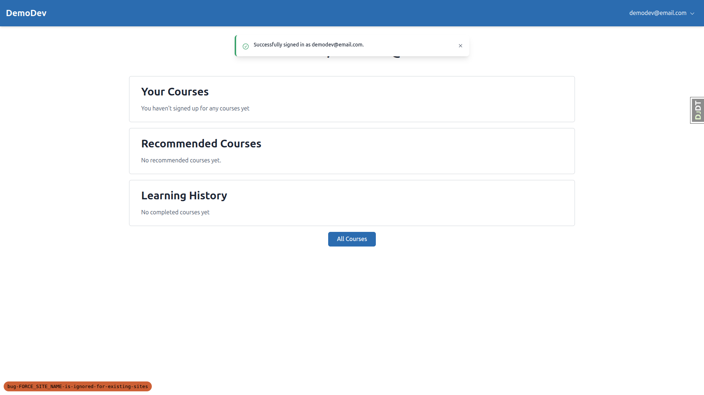
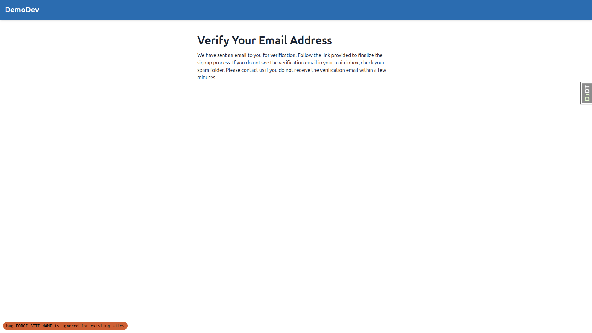
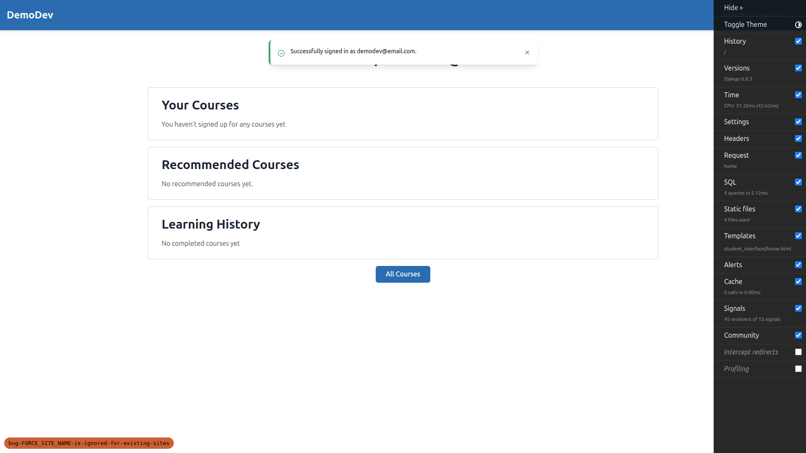
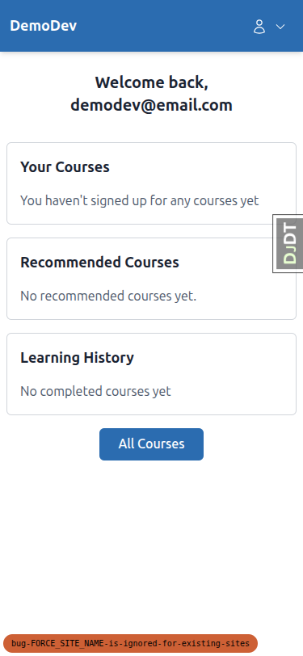

# QA Report: FORCE_SITE_NAME bug fix

**Date:** 2026-03-13
**Branch:** bug-FORCE_SITE_NAME-is-ignored-for-existing-sites
**Tester:** Claude (automated QA via Playwright MCP)

## Summary

All 3 tests **PASSED**. No errors or 500s were encountered. The `FORCE_SITE_NAME` setting correctly overrides domain-based site resolution in all tested scenarios.

## Test Results

### Test 1: Login works on non-matching port (port 8010) — PASS

- Visited `http://127.0.0.1:8010/accounts/login/`
- Page displayed **DemoDev** branding (correct — forced site)
- Logged in with `demodev@email.com` successfully
- Redirected to home page with "Successfully signed in" message

### Test 2: No IntegrityError on duplicate signup (port 8010) — PASS

- Visited `http://127.0.0.1:8010/accounts/signup/`
- Attempted signup with existing email `demodev@email.com`
- **No IntegrityError / 500 error occurred** (the critical requirement)
- Note: Instead of a form validation error saying "email already taken", allauth's anti-enumeration feature (`ACCOUNT_PREVENT_ENUMERATION`) silently redirected to the email verification page. This is a privacy feature that prevents attackers from discovering which emails are registered. This is acceptable and expected allauth behavior.

### Test 3: Forced site overrides domain-matched site (port 8001) — PASS

- Visited `http://127.0.0.1:8001/` (Bloom's configured domain)
- Page displayed **DemoDev** branding, NOT Bloom — FORCE_SITE_NAME correctly overrides the domain match
- Logged in with `demodev@email.com` successfully on this port

## Mobile Testing (375x812)

The tests in this QA plan are primarily about backend site-resolution logic and authentication. The login/signup forms and home page render correctly on mobile with no overflow or layout issues.

## Tablet Testing (768x1024)

Layout renders correctly at tablet size. Navigation shows the desktop-style nav with the user email visible in the header.

## Setup Notes

- The `demodev@email.com` user's `EmailAddress` record was initially `verified=False` and `primary=False`, which caused the first login attempt to redirect to email verification. This was corrected during testing by marking the email as verified and primary. This is a data setup issue, not a bug in the feature under test.

## Observations

No issues unrelated to the feature under test were observed.
