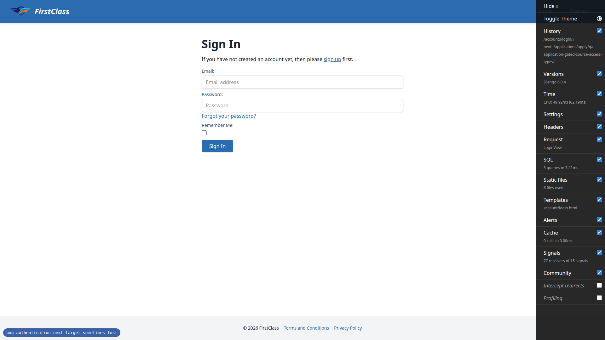
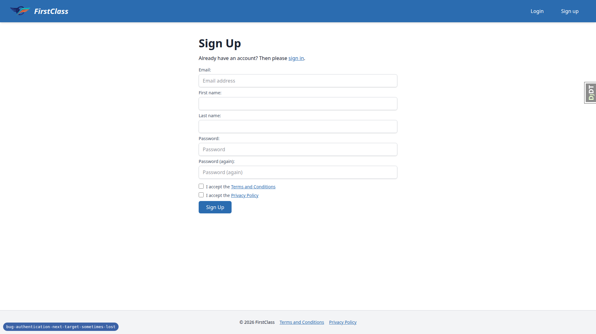
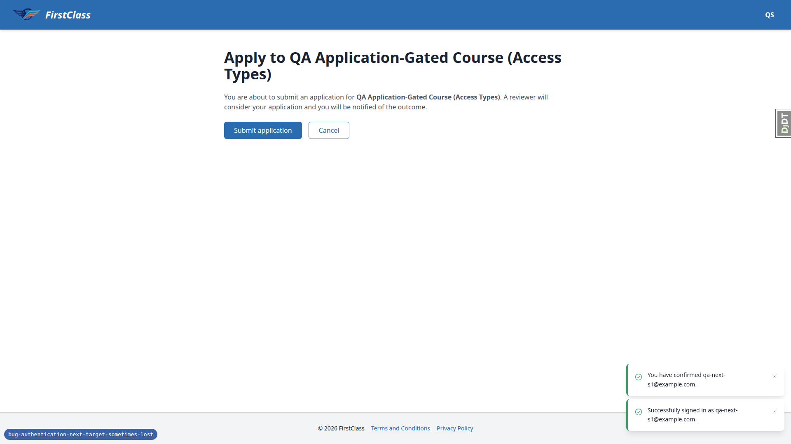
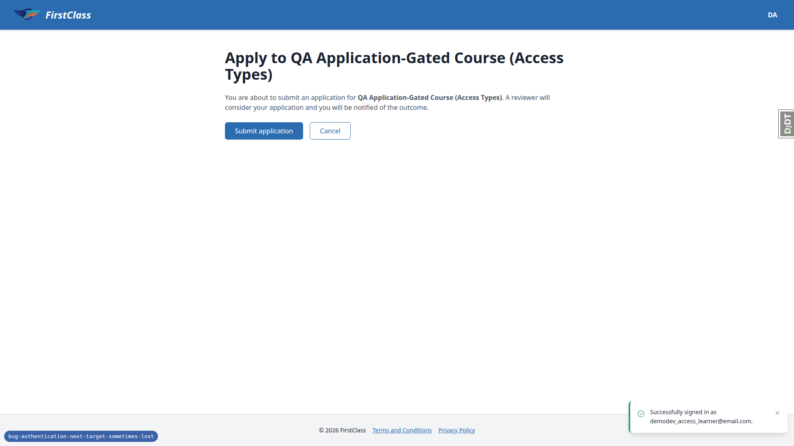
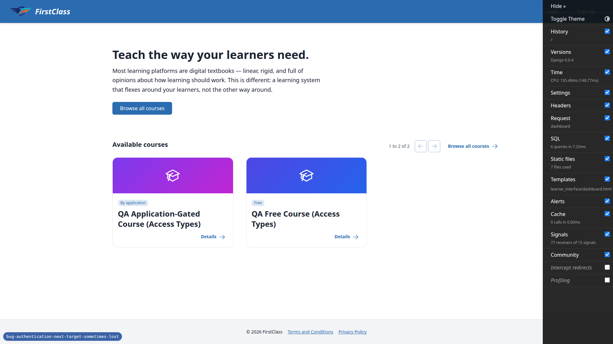
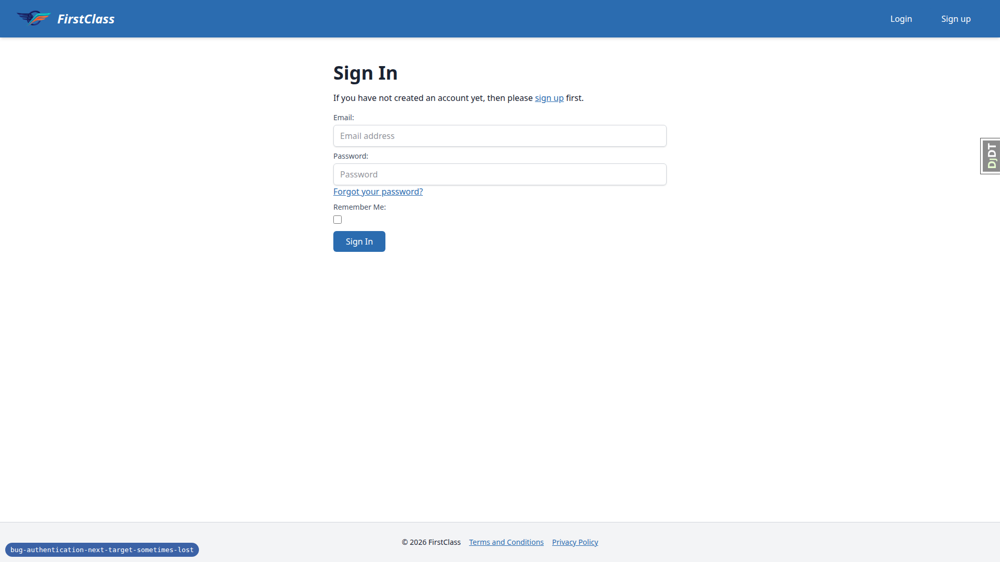
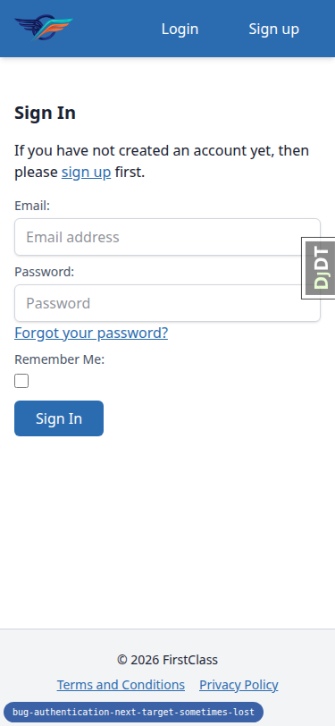
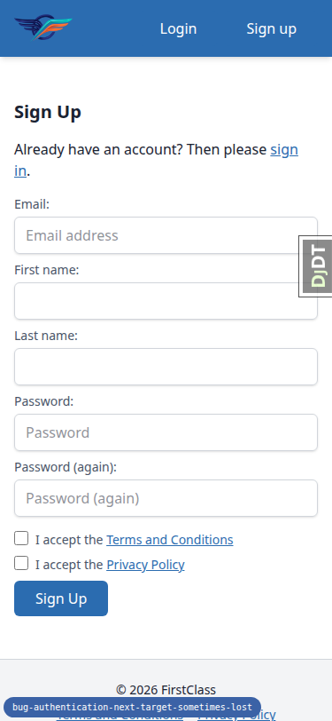
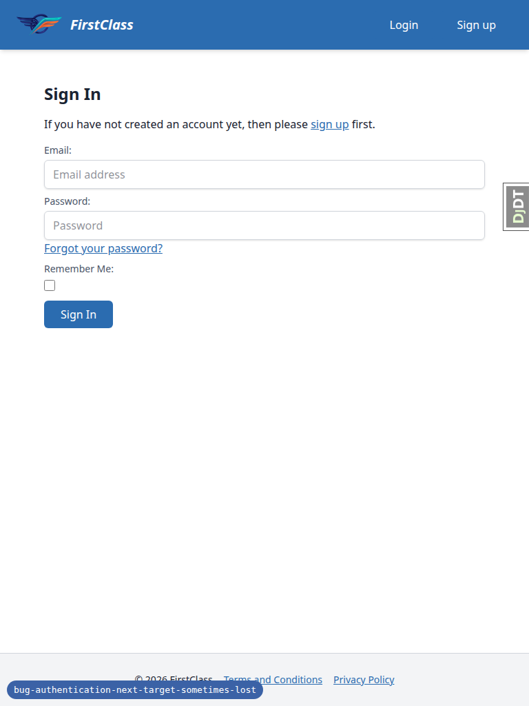

# Frontend QA Report: bug-authentication-next-target-sometimes-lost

## 1. Methodology

Manual walk-through using the Playwright MCP browser against a dev server running on port 8584 (`http://127.0.0.1:8584`). Three viewports were exercised:

- Desktop: 1920x1080
- Mobile: 375x812
- Tablet: 768x1024

Confirmation emails were read from Mailpit at `http://localhost:8025`. Screenshots were saved to `screenshots/` beside this report; every screenshot referenced below was confirmed to exist on disk with a Glob of that directory before being cited here.

## 2. Diff scoping

Scoping class: **FULL**, triggered by `freedom_ls/base/templates/partials/login_prompt.html`.

Changed files:

- `freedom_ls/accounts/templatetags/__init__.py`
- `freedom_ls/accounts/templatetags/accounts_tags.py`
- `freedom_ls/accounts/tests/test_accounts_tags.py`
- `freedom_ls/accounts/tests/test_header_auth_links_carry_next.py`
- `freedom_ls/base/templates/partials/login_prompt.html`
- `freedom_ls/base/tests/test_header_bar_user_menu.py`
- `spec_dd/2. in progress/bug-authentication-next-target-sometimes-lost/2. plan.md`
- `spec_dd/2. in progress/bug-authentication-next-target-sometimes-lost/3. frontend_qa.md`
- `spec_dd/2. in progress/bug-authentication-next-target-sometimes-lost/todo.md`

Nothing was skipped. Desktop, mobile and tablet viewports all ran, per the test plan's 8 scenarios.

## 3. Smoke gate

Status: **pass**.

Pages checked:

- `http://127.0.0.1:8584/`
- `http://127.0.0.1:8584/applications/apply/qa-application-gated-course-access-types/`

## 4. Results

| Scenario | Viewport | Status | Note |
|---|---|---|---|
| 1 (steps 1-3) | desktop | pass | Apply now while logged out redirects to `/accounts/login/?next=/applications/apply/qa-application-gated-course-access-types/`; header Login and Sign up hrefs both carry the encoded next. |
| 1 (step 4) | desktop | pass | Header Sign up lands on `/accounts/signup/?next=%2Fapplications%2Fapply%2F...`; form has hidden next input. |
| 1 (steps 5-7) | desktop | pass | Signup, Mailpit confirmation, and post-confirm login land on the apply page, not home. Reported bug is fixed. |
| 2 | desktop | pass | In-form sign-up link also carries next; second test account confirmed via Mailpit lands on the apply page. |
| 3 | desktop | pass | Header Login from the signup page carries next; signing in as the existing learner lands on the apply page. |
| 4 | desktop | pass | Home, `/courses/`, and gated course detail: header hrefs are exactly `/accounts/login/` and `/accounts/signup/` with no next. Header sign-in from home lands on the dashboard. |
| 5 | desktop | pass | `next=https://evil.example.com/` is dropped from header hrefs. An HTML-breaking next value renders with no injected script and is fully URL-encoded in the header hrefs. |
| 6 | desktop | pass | Signing up again with an existing learner's email via the header follows allauth's normal enumeration-safe path (verify-your-email page, no error page), next still carried through signup. |
| 7 | desktop | pass | With signups disabled via admin, header shows Login only, with next in its href; signing in lands on the apply page. |
| 8 (steps 1-2) | mobile | pass | 375x812: header Login and Sign up render side by side, both carry next, no horizontal overflow. |
| 8 (steps 3-4) | mobile | pass | 375x812: tapping header Sign up lands on the signup page with next carried; header links on that page also carry next. |
| 8 | tablet | pass | 768x1024: sign-in page shows the desktop-style header (brand text + Login + Sign up), both carry next, no overflow. |

### Scenario narrative

**Scenario 1 (the reported bug).** Logged out, Apply on the gated course redirects to `/accounts/login/?next=/applications/apply/qa-application-gated-course-access-types/` (unencoded slashes from Django's `login_required`, same target). The header's Login and Sign up buttons carry the same next value, URL-encoded (`next=%2Fapplications%2Fapply%2F...`).

Clicking header Sign up lands on the signup page with next preserved and a hidden next input in the form.

Signing up as `qa-next-s1@example.com`, confirming via the Mailpit link, and completing confirmation logs the user in and lands them on the apply page for the gated course, not the home page — the bug is fixed.

**Scenario 2 (in-form sign-up link).** The in-form sign-up link on the login page also carries next. A second account, `qa-next-s2@example.com`, signed up this way and confirmed via Mailpit, also lands on the apply page. No screenshot was captured for this scenario.

**Scenario 3 (header Login from the signup page).** Reaching the signup page via the in-form link, the header Login href carries `next=%2Fapplications%2Fapply%2F...`. Signing in as the existing learner `demodev_access_learner@email.com` lands on the apply page.

**Scenario 4 (no pending target).** On the home page, `/courses/`, and a gated course detail page, the header Login and Sign up hrefs are exactly `/accounts/login/` and `/accounts/signup/` with no next appended. Signing in from the header from the home page lands on the dashboard, as before.

**Scenario 5 (unsafe next is not forwarded).** With `next=https://evil.example.com/`, the header hrefs are bare — no `evil.example.com` appears anywhere in them. With an HTML-breaking value (`next=">`), the page renders normally (200), no script element is injected and no dialog fires; the header hrefs carry the value fully URL-encoded (`%22%3E%3Cscript%3Ealert%281%29%3C%2Fscript%3E`). The in-form sign-up link forwards the same encoded value.

**Scenario 6 (existing account re-signs-up via header).** Reaching the signup page via the header from the gated-apply login page and submitting an existing learner's email produces allauth's normal enumeration-safe response: a 302 to the Verify Your Email page identical to the new-account path, no error page, and Mailpit receives an "Account already exists" email. The post-submit confirm-email URL carries no next param — the same as the new-account path, since allauth holds next in session — so this is not a regression. No screenshot was captured for this scenario.

**Scenario 7 (signups disabled).** With a `SiteSignupPolicy` created via admin with `allow_signups` off, the header shows Login only, still carrying next. Signing in lands on the apply page. The policy was then deleted to restore the default (Sign up back in the header).

**Scenario 8 (mobile and tablet width).** At 375x812, Apply leads to the sign-in page with header Login (90x40) and Sign up (105x40) visible side by side, both carrying next, with no horizontal overflow (`scrollWidth` 375); the brand text collapses to logo only.

Tapping header Sign up lands on the signup page with next carried in the URL, and the header links there also carry next.

At 768x1024, the sign-in page after Apply shows the desktop-style header (brand text plus Login and Sign up), both buttons 40px tall and carrying next, with no overflow.

## 5. Per-bug sections

None. No bugs were found during this QA pass. All 8 scenarios in the test plan passed at every viewport they were run against.

## Bug status

There are no bugs to report.

## 6. General notes

- Setup: the dev database had no DemoDev site, so `qa_create_course_access_types` failed on first run. Fixed by running `create_demo_data --yes`, then `qa_create_course_access_types`. The gated course slug is `qa-application-gated-course-access-types`. The site was forced to DemoDev via `FORCE_SITE_NAME`; "FirstClass" is the theme's brand name.
- Test accounts created this run: `qa-next-s1@example.com` and `qa-next-s2@example.com` (both verified via Mailpit).
- Out of scope, existing behaviour: with `allow_signups` off, allauth's stock sign-in form still shows a "please sign up first" link to `/accounts/signup/`, which returns a "Sign Up Closed" page. This branch did not touch that template; the header correctly hides Sign up regardless.
- Out of scope, existing behaviour: with `next=https://evil.example.com/`, allauth's hidden next input on the sign-in form echoes the raw value (allauth validates it on POST). The header links drop it as intended.
- Out of scope: the `login_required` redirect puts next into the URL with unencoded slashes (`?next=/applications/...`) instead of `%2F` as the test plan describes. It names the same target and works correctly.
- Dev-only: the Django debug toolbar's side panel sits over the header's Sign up button at 1920 width and blocks clicks until the toolbar is hidden. Not a production issue.

status: ok
reason: report rendered, 0 bugs documented, all 8 scenarios passed
