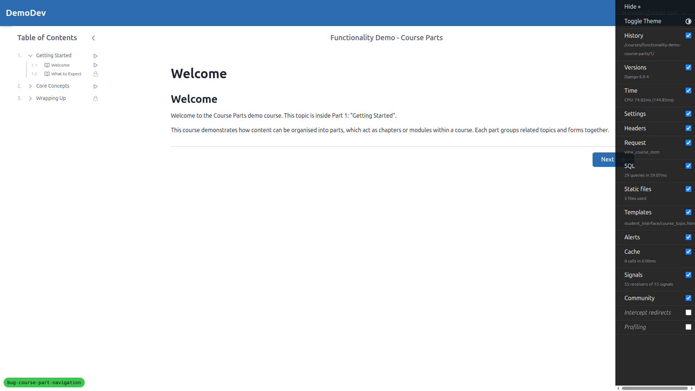
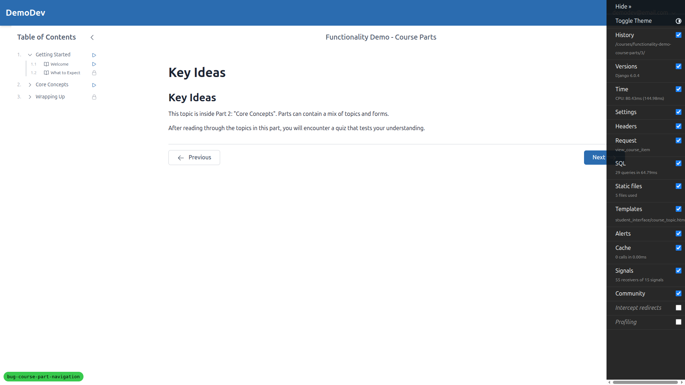
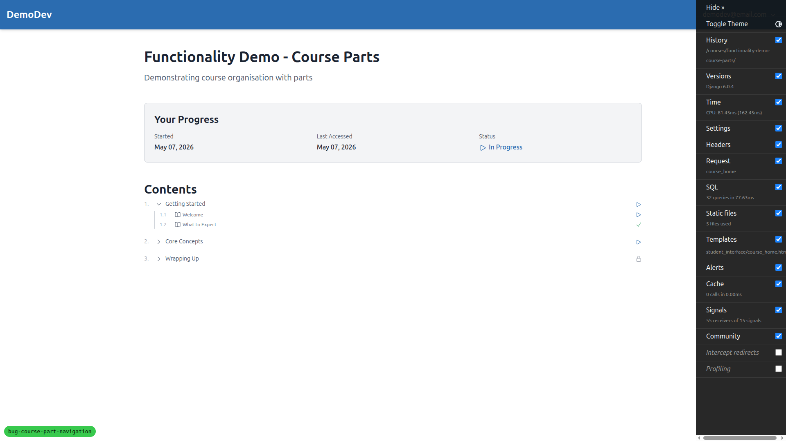
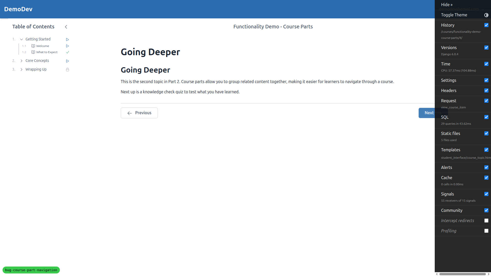
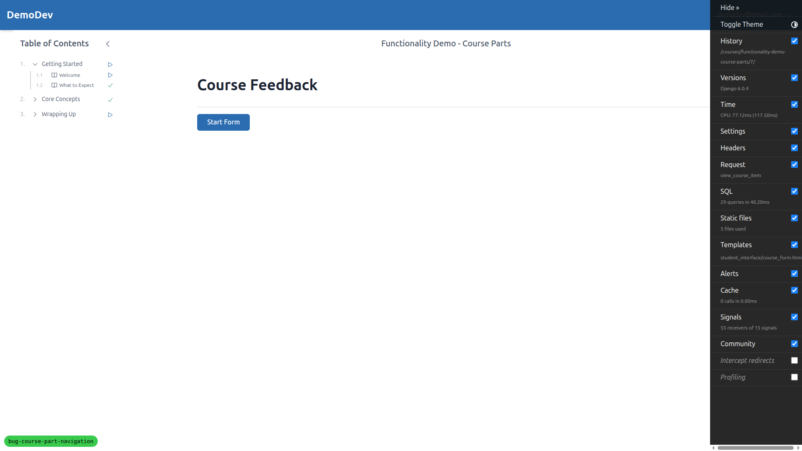
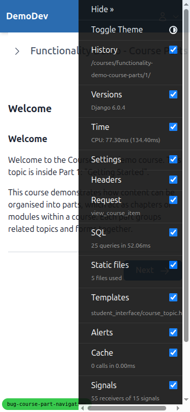
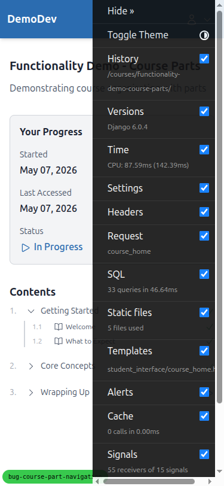
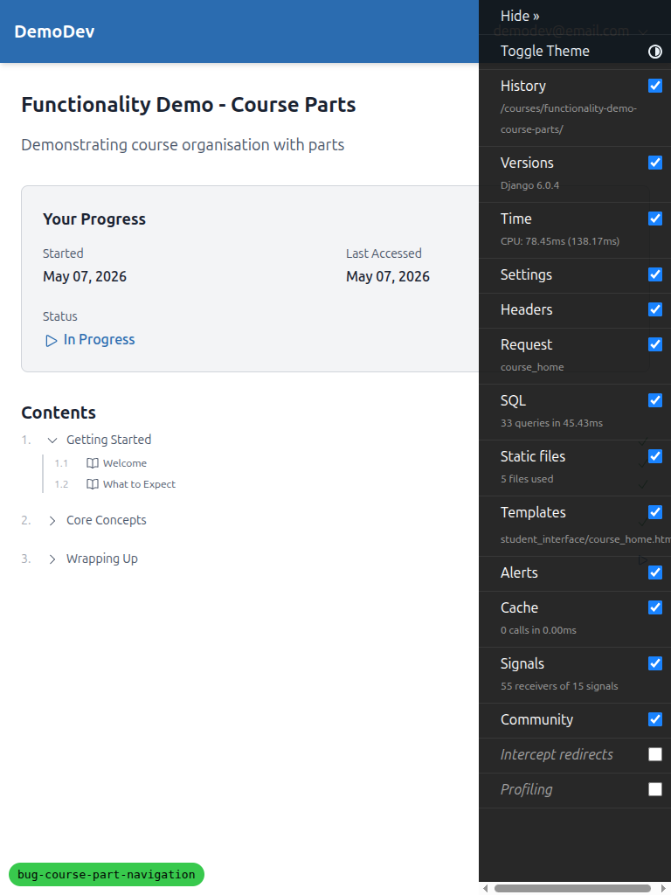

# QA Report — Course part navigation re-index

**Result:** All targeted bugs fixed. No regressions found. One pre-existing observation noted (not a regression).

Tested against branch `bug-course-part-navigation` on the `DemoDev` site, course `functionality-demo-course-parts`, signed in as `demodev@email.com`.

## Test results

| Test | Description | Outcome |
|---|---|---|
| 1 | Bug 1 — `/1/` shows Welcome with no Previous button | PASS |
| 2 | Bug 2 — `/3/` Previous links directly to `/2/`, single GET 200 | PASS |
| 3 | Latent Next — `/2/` Next reaches `/3/` directly (POST 302 -> GET); also `/5/` quiz pass -> `/6/` directly | PASS |
| 4 | TOC — Getting Started status link -> `/1/`, Core Concepts -> `/3/`, single GET 200 | PASS |
| 5 | Middle of part — `/4/` Previous -> `/3/`, Next -> `/5/` (mark_complete or link form) | PASS |
| 6 | Last item `/7/` (survey) — no Next button | PASS (with observation, see below) |
| 7 | Out-of-range `/8/` returns 500 (pre-existing, sanity) | PASS |
| 8 | Walking 1->7 via in-page Next: every hop is a single GET 200 (or POST 302 -> single GET); no part-header redirect chains | PASS |

## Bug 1 — first viewable item has no Previous button

`/1/` renders the **Welcome** topic and exposes only a Next control (no Previous link/button). URL stays at `/1/`.



## Bug 2 — first item of non-first part: Previous links directly to last item of previous part

At `/3/` ("Key Ideas") the Previous control is `<a href="/courses/functionality-demo-course-parts/2/">`. Clicking it produced a single `GET /2/ -> 200` and rendered "What to Expect". No 302 hop through any part-header URL.



Network trace excerpt:

```
[GET]  /courses/functionality-demo-course-parts/3/ -> 200
[GET]  /courses/functionality-demo-course-parts/2/ -> 200
```

## Latent Next fix

- From `/2/` (uncompleted), Next is the `mark_complete` POST. Submitting produced exactly `POST /2/ -> 302` followed by `GET /3/ -> 200` (no part-header intermediary).
- From `/2/` once it's already complete, Next is `<a href="/courses/functionality-demo-course-parts/3/">`. Clicking it is a single `GET /3/ -> 200`.
- After passing the quiz at `/5/`, the Continue control links directly to `/6/` (Summary), one hop.

## TOC part-header rows

On the course home, the part-header rows expose status links pointing at the first viewable child:

- Getting Started -> `/1/` (Welcome)
- Core Concepts -> `/3/` (Key Ideas)
- Wrapping Up -> no link rendered yet (locked icon shown until prerequisites are completed; this is existing locking behaviour and not in scope for the fix)

Clicking the Core Concepts status link produced a single `GET /3/ -> 200`, no redirect chain.



## Middle-of-part regression

`/4/` (Going Deeper) shows Previous href `/3/` and a Next mark_complete form (because the topic was uncompleted at the time). Clicking Previous returned a single `GET /3/ -> 200`. Clicking Next executed `POST /4/ -> 302 -> GET /5/ -> 200`.



## End-of-course

At `/7/` (Course Feedback survey) there is no Next control — only the survey "Start Form" call-to-action.



### Observation (not a regression, not in scope)

The survey landing page at `/7/` does **not** render a Previous button. The QA plan's "Expected" line says Previous's `href` should end with `/6/`. However, this absence is consistent with the existing pattern for forms in their pre-start state (the page only renders the "Start Form" link until the form has been started/completed), and it is unchanged by the index-fix in this worktree. It pre-dates the bug fix and is not a side-effect of the change. Filing it here as an observation; not raising it as a new bug.

## Walk-through 1 -> 7

Starting fresh from `/1/`, navigating using only in-page Next/Continue/mark_complete controls:

```
GET  /1/  -> 200
POST /1/  -> 302
GET  /2/  -> 200
GET  /3/  -> 200
GET  /4/  -> 200
GET  /5/  -> 200
GET  /6/  -> 200
GET  /7/  -> 200
```

Every step is a single hop. There is no `GET part-header -> 302 -> GET item` chain anywhere along the path.

## Mobile (375x812) / Tablet (768x1024) spot-checks

Mobile and tablet rendering of `/1/` and the course home TOC behave identically to desktop — the Previous control is absent on `/1/`, the Next control is present, and the TOC part-header status links point at the same indices.





## Test data setup notes

- The `DemoDev` admin user (`demodev@email.com`) had no verified `EmailAddress` after the bare login attempt redirected to "Verify Your Email Address". The `EmailAddress` row was created and marked `verified=True, primary=True` so login could proceed. This is dev-account hygiene and unrelated to the navigation fix.

## Pre-existing issues observed (not introduced by this change)

- `/8/` (out-of-range index) returns a 500 IndexError. The plan explicitly calls this out as out of scope and pre-existing — confirmed unchanged.
