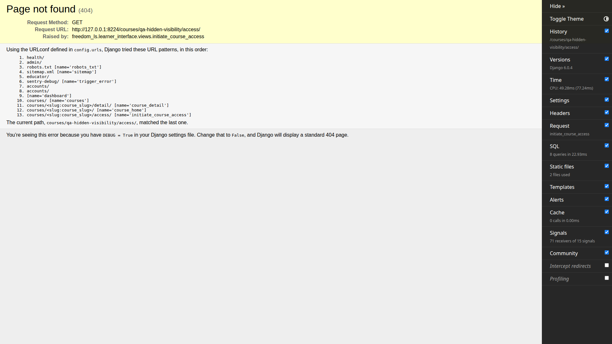
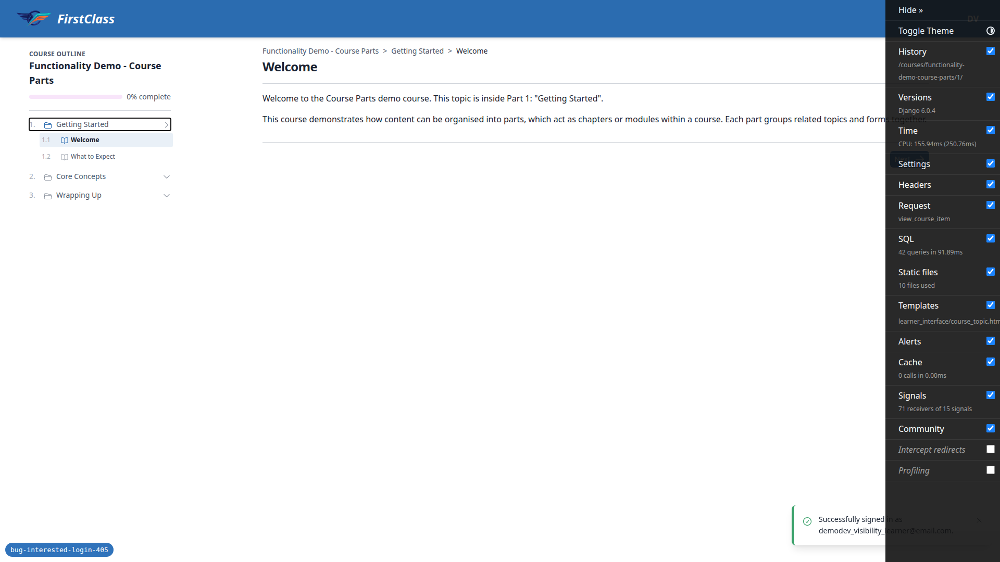
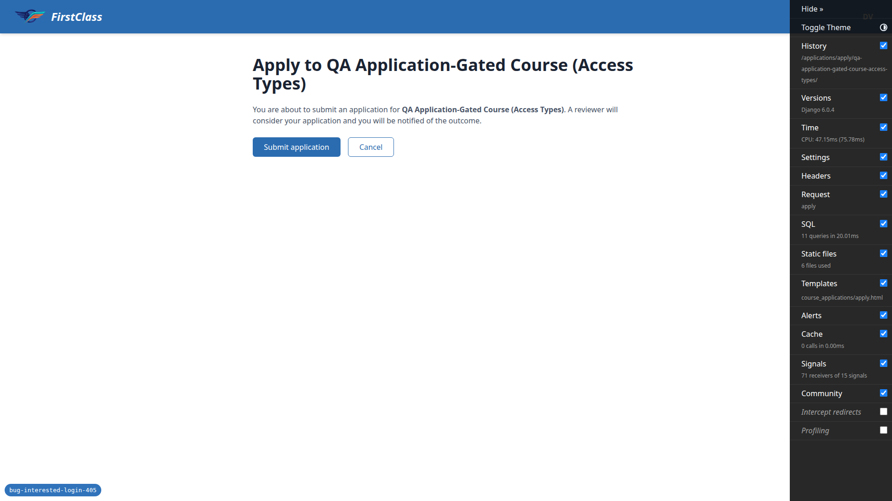
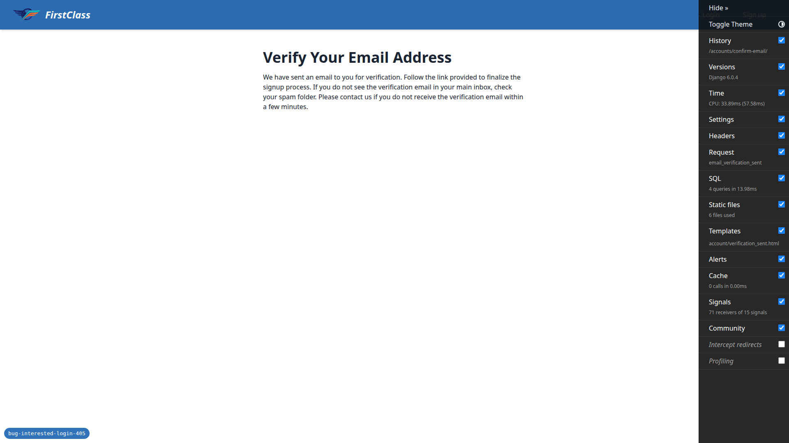
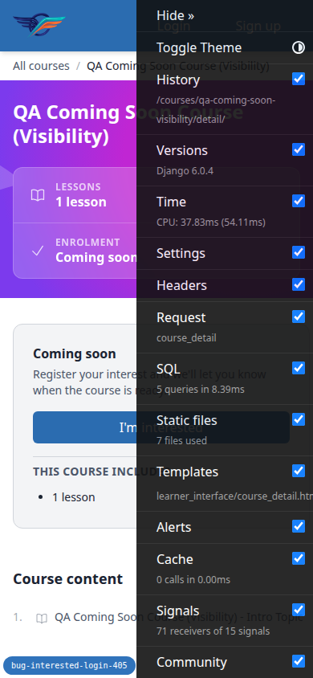
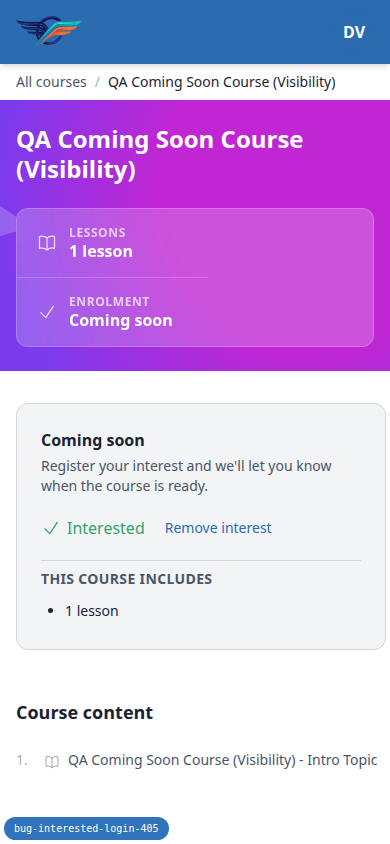
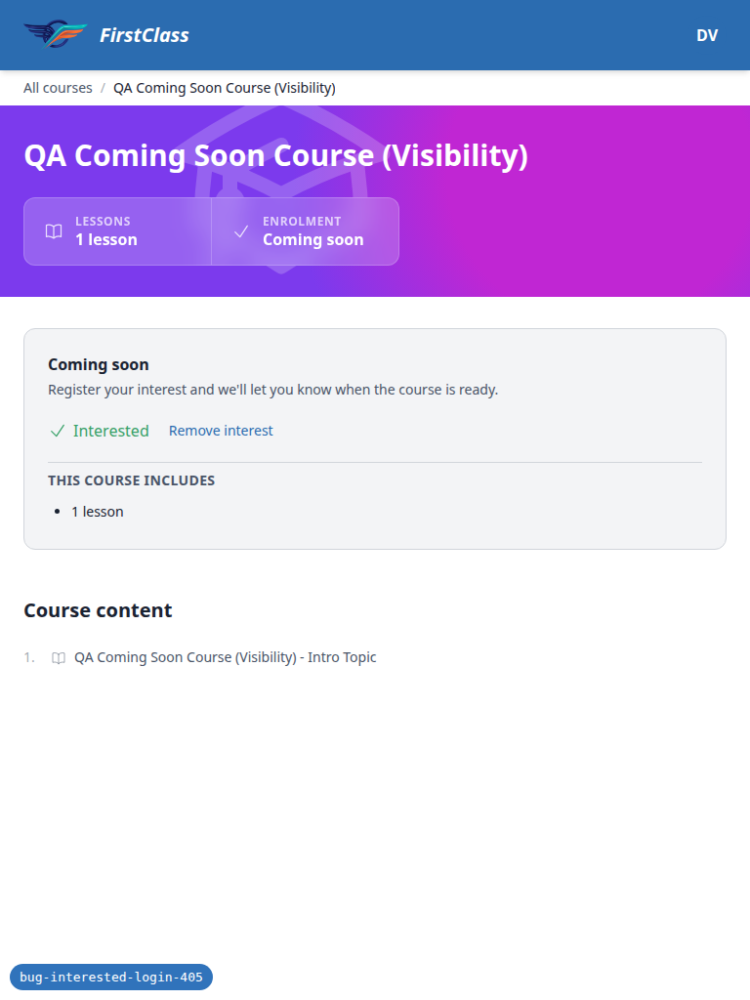

# Frontend QA report — express interest survives sign-in

Bug: `bug-interested-login-405`. Plan executed: `3. frontend_qa.md`.

## 1. Methodology

QA was driven through the Playwright MCP server against a dev server started on port 8224, on branch `bug-interested-login-405`. Screenshots were saved to `screenshots/` beside this report; every image referenced below was checked and exists in that directory.

Fixtures were seeded with:

```
migrate
create_demo_data --yes
content_save demo_content/* DemoDev
qa_create_course_visibility DemoDev
qa_create_course_access_types DemoDev
```

That gave the following fixtures, used throughout the run:

- Coming-soon course: `qa-coming-soon-visibility`
- Hidden course: `qa-hidden-visibility`
- Published free course: `functionality-demo-course-parts`
- Application-gated course: `qa-application-gated-course-access-types`
- QA learner account: `demodev_visibility_learner@email.com`
- Admin account: `demodev@email.com`

Nothing in the run aborted. Every step in the plan, across all three viewport passes, ran to completion.

## 2. Diff scoping

Scoping class: **FULL**. The changed set for this bug was:

```
freedom_ls/accounts/middleware.py
freedom_ls/accounts/tests/test_deferred_login.py
freedom_ls/accounts/tests/test_registration_completion_middleware.py
freedom_ls/accounts/utils.py
freedom_ls/course_applications/tests/test_views.py
freedom_ls/course_interest/tests/test_views.py
freedom_ls/course_interest/urls.py
freedom_ls/course_interest/views.py
spec_dd/2. in progress/bug-interested-login-405/2. plan.md
spec_dd/2. in progress/bug-interested-login-405/3. frontend_qa.md
spec_dd/2. in progress/bug-interested-login-405/todo.md
```

Because the changed set mixes `.md` spec files with `.py` source, rule 4's safe default applied and the run treated scoping as full rather than partial. Nothing was skipped on that basis: the desktop, mobile and tablet passes all ran.

## 3. Smoke gate

The smoke gate passed. Two pages were loaded before the timed tests began:

- `http://127.0.0.1:8224/` (Dashboard)
- `http://127.0.0.1:8224/courses/qa-coming-soon-visibility/detail/`

## 4. Environment note (important)

The stock `config/settings_dev.py` sets `OVERRIDE_COURSE_VISIBILITY_TO_VISIBLE = True` and `OVERRIDE_COURSE_ACCESS_TO_FREE = True`. Under those settings every coming-soon course renders the ordinary "Enrol for free" CTA and every hidden course is visible. With the stock dev settings, not one test in this plan is exercisable — there is no "I'm interested" CTA to click and no hidden course to probe.

This run used a separate QA settings module — dev settings with both `OVERRIDE_COURSE_VISIBILITY_TO_VISIBLE` and `OVERRIDE_COURSE_ACCESS_TO_FREE` set to `False` — supplied via the `DJANGO_SETTINGS_MODULE` environment variable. No file in the repository was modified to achieve this.

Anyone re-running this plan must do the same: point `DJANGO_SETTINGS_MODULE` at an equivalent settings module with both overrides off, rather than running against `config/settings_dev.py` as-is.

## 5. Results

| Test | Viewport | Status | Note |
|---|---|---|---|
| 1 | desktop | pass | Reported regression journey: anonymous interest click, sign-in, lands on "Interested". No 405. |
| 2 | desktop | pass | Already-signed-in path: htmx swap in place, no navigation, state persists on reload. |
| 3 | desktop | pass | Three rapid remove/express clicks at human speed stay consistent, one DB row. |
| 4 | desktop | pass | Remove-interest while signed out degrades to sign-in redirect, not a 405; removal never applied. |
| 5 | desktop | pass | Course flips to published mid-flow; sign-in lands on normal enrolment CTA, no interest row created. |
| 6 | desktop | pass | Hidden vs nonexistent course both 404 anonymously; 404 for the hidden course only arrives after sign-in. |
| 7 | desktop | pass | Free-course enrolment and application-gated apply flow both round-trip through sign-in correctly. |
| 8 | desktop | pass | Brand-new signup mid-flow: no 405, intent survived, new account lands "Interested". |
| 9 | desktop | pass | Signup with an existing email returns the same neutral verification page, no enumeration. |
| 10 | desktop | pass | Wrong password redisplays with `next` retained; correct password on retry lands "Interested". |
| 11 | mobile | pass | 390px repeat of Test 1: CTA panel above content, no overflow, same sign-in navigation. |
| 11-nav | mobile | pass | 390px header: collapsed user-menu button, no overflow anywhere in the flow. |
| 1 | tablet | pass | 768px repeat of Test 1: single-column layout, same navigation and end state as desktop. |
| 11-nav | tablet | pass | 768px header uses the same collapsed menu button as mobile. |

### Test 1 (desktop) — the reported bug

Anonymous, the coming-soon detail page showed "Coming soon", the subtext, and the primary "I'm interested" button. Clicking it produced a full browser navigation — not an htmx swap — to `/accounts/login/?next=/interest/courses/qa-coming-soon-visibility/deferred-express-interest/`, with full site chrome. The `next` value pointed at `deferred-express-interest`, not `express-interest`. Signing in landed back on `/courses/qa-coming-soon-visibility/detail/`, showing a green check "Interested" and a quiet "Remove interest" button. No 405, no "Method Not Allowed", no raw `/interest/` URL in the address bar.


### Test 2 (desktop) — already signed in

Signed in, "Remove interest" swapped the panel in place back to "I'm interested" via `POST .../remove-interest/` (200, no navigation). "I'm interested" swapped it to "Interested" via `POST .../express-interest/` (200). A full page reload still showed "Interested", confirming the state persisted server-side rather than being a client-only swap.

### Test 3 (desktop) — repeat clicks

Remove, then three "I'm interested"/"Remove interest" clicks roughly three seconds apart, each issued an htmx `POST` returning 200. The panel toggled cleanly each time and ended on "Interested", matching the last click. Exactly one CTA wrapper and button were on the page throughout, and the database held exactly one `CourseInterest` row for this learner and course.

### Test 4 (desktop) — remove interest while signed out

With the QA learner signed out in a second tab, clicking "Remove interest" on the stale panel in the first tab produced a full navigation to `/accounts/login/?next=/courses/qa-coming-soon-visibility/detail/` — full site chrome, no 405, no login form inside the panel. Signing back in landed on the course detail page with the interest still present ("Interested"); the database still held exactly one `CourseInterest` row, so the unauthorised removal was never applied.


### Test 5 (desktop) — course stops being coming-soon mid-flow

Anonymous "I'm interested" reached `/accounts/login/?next=/interest/.../deferred-express-interest/`. With the sign-in page still open, the course was flipped to published (via the ORM rather than the admin UI, an equivalent state change). Signing in ran the deferred view (a `GET` producing a 302) and landed on the course detail page showing the normal "Enrol for free" CTA, with no 405, 422 or traceback. The database confirmed no `CourseInterest` row was created. The course was restored to `coming_soon` afterwards.


### Test 6 (desktop) — hidden courses leak nothing

Anonymous `/courses/qa-hidden-visibility/detail/` returned 404, as did `/courses/definitely-not-a-real-course-xyz/detail/`. Anonymous `/applications/apply/qa-hidden-visibility/` redirected to `/accounts/login/?next=...` rather than 404ing, and never named the course. Anonymous `/courses/qa-hidden-visibility/access/` also redirected to sign-in. Signing in as the unregistered QA learner and following `next` produced the 404 only at that point, after authentication.



### Test 7 (desktop) — apply and self-registration still round-trip

Anonymous on the published free course `functionality-demo-course-parts`, "Enrol for free" led to `/accounts/login/?next=/courses/functionality-demo-course-parts/access/`. Signing in enrolled the learner and landed inside the course player at `/courses/functionality-demo-course-parts/1/` — not back on the detail page, no 405.

For the application-gated arm (`qa-application-gated-course-access-types`), anonymous "Apply now" led to `/accounts/login/?next=/applications/apply/<slug>/`; signing in landed on the apply confirmation page ("Apply to QA Application-Gated Course") with a "Submit application" button still to press. The database confirmed no `CourseApplication` row had been created by the redirect alone.




### Test 8 (desktop) — signing up as a brand new user mid-flow

Anonymous CTA led to sign-in, then the "sign up" link, which carried `next=/interest/.../deferred-express-interest/` through as a query parameter. A new account, `qa-newuser-405@email.com`, was registered and confirmed via the emailed link (dev SMTP is caught by Mailpit on `:8025`, not printed to the runserver console). The confirmation `POST` redirected (302) to the deferred-express-interest view, which redirected on to the course detail page. No 405 anywhere in the chain, and no login form rendered inside a course panel. The intent survived the signup arm: the new account landed on the detail page showing "Interested", with one `CourseInterest` row in the database for `qa-newuser-405@email.com` on `qa-coming-soon-visibility` — better than the plan's acceptable minimum of losing intent across signup.


### Test 9 (desktop) — existing account tries to sign up again

Submitting the QA learner's existing email on the signup form returned the same "Verify Your Email Address" page a fresh signup gets, with the neutral message "Confirmation email sent to <email>." Nothing on the page indicated the account already existed. No 405, no unstyled page, no traceback, and no duplicate `User` row. `ACCOUNT_PREVENT_ENUMERATION` sent an "Account already exists" email instead, which is invisible from the browser as intended.



### Test 10 (desktop) — invalid sign-in credentials mid-flow

Anonymous CTA to sign-in, then a wrong password produced the redisplayed form with "The email address and/or password you specified are not correct." The address bar dropped the `?next=` query string (allauth posts to a bare `/accounts/login/`), but the redisplayed form still carried `next=/interest/courses/qa-coming-soon-visibility/deferred-express-interest/` as a hidden input. Signing in correctly on the second attempt landed on the course detail page showing "Interested", not the site home page — the failed attempt did not lose the intent, and the database confirmed the `CourseInterest` row was created.


### Test 11 (mobile, 390×844) — small screens

Test 1 steps 1–8 repeated at 390px. The CTA panel rendered above the course content (panel top at 403px, course outline top at 750px, confirming `order-first`), with no horizontal overflow (`scrollWidth == innerWidth == 390`). The anonymous CTA button was full-width, 320×40. The click produced the same full navigation to `/accounts/login/?next=/interest/.../deferred-express-interest/`; signing in landed back on the detail page with "Interested" and "Remove interest" legible and not clipped (wrapper 320×32, right edge at 361px inside the 390px viewport). Remove and re-express also swapped in place correctly at this width.




### Test 11-nav (mobile, 390×844) — header

At 390px the header shows a logo link and a single 40×40 user-menu button; the "Profile" and "Sign Out" items stay collapsed (0×0) until the menu opens. No horizontal overflow anywhere in the coming-soon flow, and the sign-in form itself filled and submitted without layout trouble at this width.

### Test 1 (tablet, 768×1024)

The detail page stays single-column at this width: the CTA panel is full-bleed (720px wide) above the course outline rather than a narrow sidebar. The anonymous → CTA → sign-in → "Interested" round trip behaved identically to desktop: full navigation to `/accounts/login/?next=/interest/.../deferred-express-interest/`, the sign-in form rendered at 640px inside the 768px viewport with the same hidden `next` value, and signing in landed on the detail page with "Interested" and "Remove interest" unclipped (670px wide, right edge at 719px). No horizontal overflow at any point.


### Test 11-nav (tablet, 768×1024) — header

The tablet header uses the same collapsed user-menu button as mobile (40×40) rather than the expanded desktop nav; "Profile" and "Sign Out" stay 0×0 until opened. Workable, just noticeably more mobile-shaped than a 768px viewport needs.



## 6. Bugs

No defects were found. The reported 405 regression did not reproduce in any of the eleven tests, at any of the three viewports.

## Bug status

No bugs were logged against this run.

## 8. General notes

Synthetic burst clicking on Test 3 (three programmatic clicks 40ms apart, faster than a human) made the second click fall through htmx and submit the CTA form natively — a plain `GET` to `/courses/<slug>/detail/?` that reloaded the page. The form carries no `action`/`method`, so the native submit is a harmless same-page `GET`; the resulting state stayed consistent and only one `CourseInterest` row existed. This is not reproducible at human click speed and sits outside the reported bug, so it is recorded here rather than as a failure.

On Test 6, the two anonymous 404 pages are not byte-identical under `DEBUG=True`: the nonexistent-slug page carries the extra line "No Course matches the given query." from `get_object_or_404`, while the hidden-course page raises a bare `Http404` with no message. Both return HTTP 404 and neither names the course title. Under `DEBUG=False` both render the same generic 404 template, so this is a debug-page artefact rather than a production enumeration channel.

On Test 11 (mobile), the django-debug-toolbar handle overlaid the CTA button at 390px and intercepted pointer events, so Playwright could not click it until the toolbar was hidden. This is dev-tooling only — the toolbar is not present outside `DEBUG` — but it does make manual mobile QA of this panel awkward.

Screenshots were taken with the debug toolbar visible on the desktop and full-page shots; on the mobile and tablet shots the toolbar was hidden with an inline style override so it would stop covering the CTA. Both are dev-only overlay artefacts, not product differences between viewports.

Teardown cleared all `CourseInterest` rows and deleted the ad hoc Test 8 account `qa-newuser-405@email.com`, and confirmed `qa-coming-soon-visibility` is back on `coming_soon` with an empty `access_config`. The QA learner `demodev_visibility_learner@email.com` was left in place, since it is a deterministic fixture created by `manage.py qa_create_course_visibility DemoDev` rather than an account this run created; removing it would leave that fixture half-built for the next run.

Compression check found no PNGs over 1024KB, so there was nothing to compress.

---

status: ok
reason: report rendered, 14 test records, 0 bugs, 15 screenshots verified
