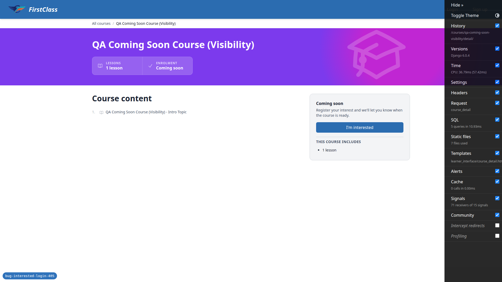
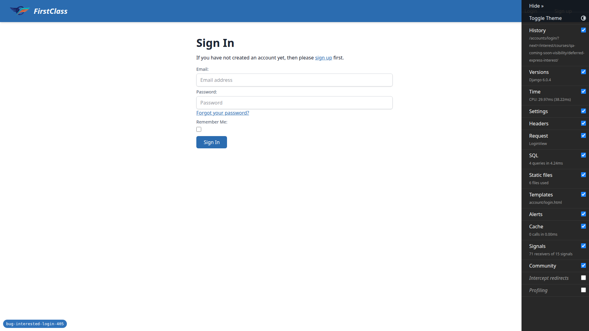
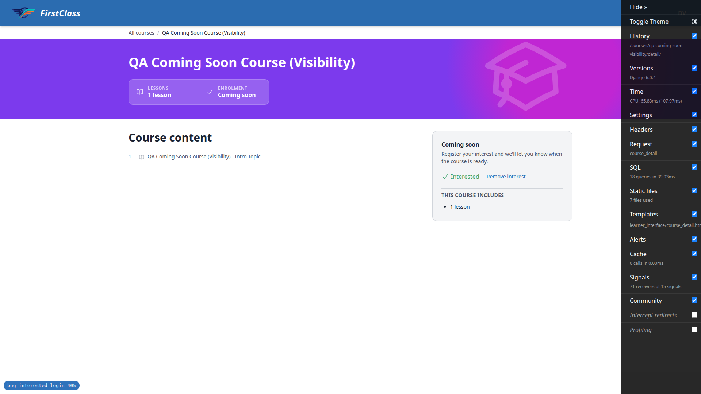
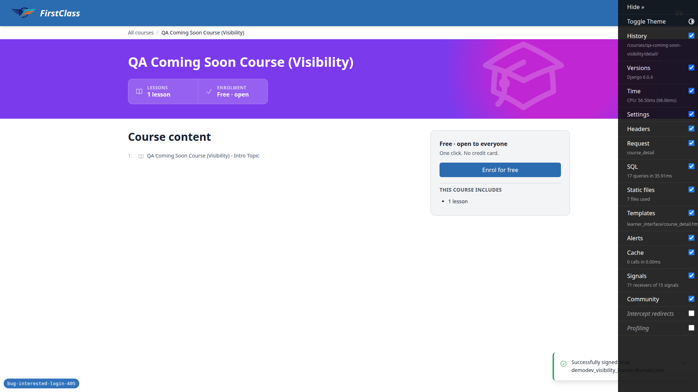
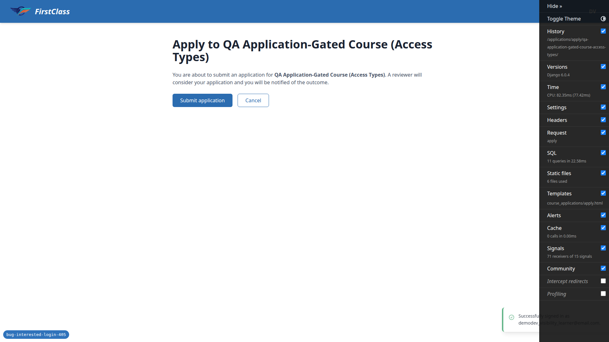
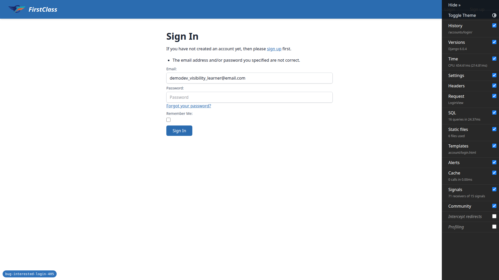
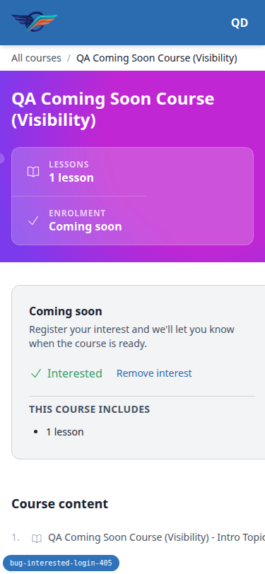
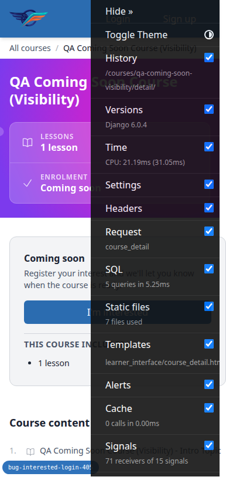
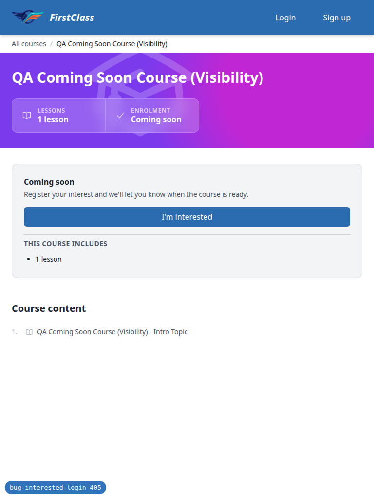
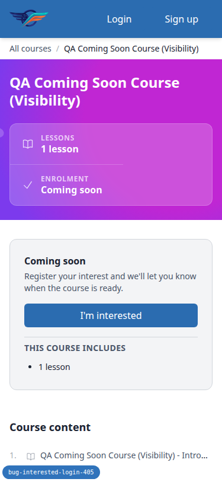

# QA report — bug-interested-login-405

Manual frontend QA for the fix that lets "express interest in a coming-soon
course" survive an anonymous user signing in. Previously the htmx CTA swapped
a login page into the course panel and the deferred POST 405'd.

## 1. Methodology

The run drove a real browser through the Playwright MCP server against a dev
server on port 8835. 16 screenshots were collected into
`spec_dd/2. in progress/bug-interested-login-405/screenshots/`; every image
referenced below exists beside this report. One of the 16 files
(`page-2026-09-01T10-27-26-411Z.png`) was captured during the smoke gate and
is not tied to a specific test, so it is not embedded in the per-test
sections below.

The compression pass (`compress_screenshots.sh`) exited 0: no PNG exceeded
the 1MB threshold, so nothing needed compressing.

The run completed all planned steps. The smoke gate passed and nothing was
aborted.

## 2. Diff scoping

The scoping record classified this diff as **FULL**, triggered by these
changed files:

- `config/settings_dev.py`
- `freedom_ls/accounts/middleware.py`
- `freedom_ls/accounts/tests/test_deferred_login.py`
- `freedom_ls/accounts/tests/test_registration_completion_middleware.py`
- `freedom_ls/accounts/utils.py`
- `freedom_ls/contrib/conformance/test_urls.py`
- `freedom_ls/course_applications/tests/test_views.py`
- `freedom_ls/course_interest/templates/course_interest/partials/express_interest_cta.html`
- `freedom_ls/course_interest/tests/test_views.py`
- `freedom_ls/course_interest/urls.py`
- `freedom_ls/course_interest/views.py`

Skipped: nothing. Everything ran. All 11 plan tests executed at desktop
(1920x1080), and the small-screens test executed at both mobile (375x812)
and tablet (768x1024).

## 3. Smoke gate

Outcome: **pass**. Pages loaded:

- `http://127.0.0.1:8835/`
- `http://127.0.0.1:8835/courses/qa-coming-soon-visibility/detail/`

No failure URL or failure reason was recorded.

## 4. Per-test results

### Test 1 — the reported bug: interest survives sign-in

**Status: pass**

- Steps 1-3 (anonymous CTA state): the right-hand panel showed "Coming soon",
  the subtext "Register your interest and we'll let you know when the course
  is ready.", and a primary "I'm interested" button.

  

- Steps 4-5 (click navigates, `next` targets the deferred endpoint): the
  whole browser navigated to
  `/accounts/login/?next=/interest/courses/qa-coming-soon-visibility/deferred-express-interest/`
  — a full page load with full site chrome (debug toolbar confirms
  `Request=LoginView`, `template=account/login.html`). `next` points at
  `deferred-express-interest`, not `express-interest`. No login form was
  swapped into the CTA panel.

  

- Steps 6-9 (sign in, panel updates, no notification promise): signed in as
  the QA learner and landed back on
  `/courses/qa-coming-soon-visibility/detail/`. The panel showed a green
  check + "Interested" plus a quiet "Remove interest" button. No 405, no
  "Method Not Allowed", no raw `/interest/...` URL in the address bar. The
  confirmation copy itself is "Interested" / "Remove interest" only — no
  notification promise in the CTA partial (see General notes for the
  standing subtext caveat).

  

### Test 2 — already signed in (the path that always worked)

**Status: pass**

Signed-in "Remove interest" swapped the panel in place back to "I'm
interested"; a window marker set before the next click survived it, proving
an htmx swap rather than a page reload. Clicking "I'm interested" again
swapped the panel to "Interested" with no navigation and no login page. A
hard reload still showed "Interested" — the state persisted server-side.

### Test 3 — repeat clicks and double submission

**Status: pass** (no screenshot recorded)

Removed interest, then triple-clicked "I'm interested" in one synchronous JS
burst. `hx-disabled-elt` disabled the button on the first click, so clicks 2
and 3 were swallowed. The panel ended as a single "Interested / Remove
interest" block — one CTA wrapper, one button, no error toast, no stacked
CTAs, no page reload. Reload showed the same state. DB check: exactly 1
`CourseInterest` row for the QA learner on `qa-coming-soon-visibility`.

### Test 4 — remove interest while signed out

**Status: pass**

Signed out in a second tab, then clicked the stale "Remove interest" in tab
1. The browser did a full-page navigation to
`/accounts/login/?next=/courses/qa-coming-soon-visibility/detail/` — no 405,
no login form swapped into the panel. Signing back in landed on the course
detail page with the interest still present ("Interested"), confirmed by DB
count still 1. The unauthorised removal was correctly not performed, and
`next` points at the detail page rather than a deferred-remove endpoint.

### Test 5 — the course stopped being coming-soon mid-flow

**Status: pass**

Anonymous, clicked "I'm interested" and parked on
`/accounts/login/?next=/interest/courses/qa-coming-soon-visibility/deferred-express-interest/`.
Flipped the course visibility to published while parked (see General notes
for why this was done through the Django shell), then signed in. Landed on
`/courses/qa-coming-soon-visibility/detail/` showing the normal enrolment CTA
("Free - open to everyone" / "Enrol for free" -> `/access/`). No 405, no 422,
no traceback. DB check: 0 `CourseInterest` rows created — the deferred action
correctly declined because the course was no longer coming soon. Visibility
was restored to `coming_soon` afterwards.

### Test 6 — hidden courses leak nothing (enumeration)

**Status: pass** (no screenshots recorded)

- Steps 1-2: anonymous `/courses/qa-hidden-visibility/detail/` and
  `/courses/definitely-not-a-real-course-xyz/detail/` both returned HTTP 404,
  raised by `learner_interface.views.course_detail`. In the browser the two
  DEBUG technical-404 pages differ by one line (a dev-only artefact of
  Django's technical 404 page). Verified with the Django test client under
  `override_settings(DEBUG=False)`: both responses are 404 with
  byte-identical 179-byte bodies, so a real visitor cannot distinguish them.
- Step 3: anonymous `GET /applications/apply/qa-hidden-visibility/` redirected
  to `/accounts/login/?next=/applications/apply/qa-hidden-visibility/` — a
  sign-in page, not a 404, and nothing in the page named the course.
- Step 4: anonymous `GET /courses/qa-hidden-visibility/access/` redirected to
  `/accounts/login/?next=/courses/qa-hidden-visibility/access/`.
- Steps 5-6: signed in as the QA learner (not registered for the hidden
  course) and let the `next` redirect run: HTTP 404 at
  `/courses/qa-hidden-visibility/access/`. The 404 arrived only after
  authentication, never before.

### Test 7 — apply and self-registration still round-trip

**Status: pass**

- Steps 1-5: anonymous on `/courses/functionality-demo-course-parts/detail/`
  showed "Free - open to everyone" with an "Enrol for free" link to the
  `/access/` URL. Clicking it reached
  `/accounts/login/?next=/courses/functionality-demo-course-parts/access/`.
  Signing in landed directly inside the course player at
  `/courses/functionality-demo-course-parts/1/` on the first item ("Welcome -
  Getting Started") — enrolled, not back on the detail page, no 405.

  

- Step 6: on the application-gated course
  `qa-application-gated-course-access-types`, anonymous "Apply now" ->
  `/accounts/login/?next=/applications/apply/.../` -> after sign-in landed on
  the apply confirmation page with an explicit "Submit application" button
  and a Cancel link. DB check confirmed 0 `CourseApplication` rows for this
  learner and course, so the redirect did not auto-create the application.

  

### Test 8 — signing up as a brand new user mid-flow

**Status: pass**

From the coming-soon CTA -> sign-in -> "sign up" (`next` preserved) ->
registered `qa_deferred_signup_405@email.com` with T&C and Privacy consent ->
neutral "Verify Your Email Address" page. Confirmation link was read from
Mailpit at `127.0.0.1:8025` (see General notes: dev mail is SMTP on
`localhost:1025`, not the runserver console). Clicking Confirm signed the new
user in and landed them on `/courses/qa-coming-soon-visibility/detail/`
showing "Interested". The intent survived the signup arm as well as the
sign-in arm, which is better than the plan's acceptable minimum. No 405
anywhere in the chain and no login form rendered inside a course panel.

### Test 9 — an existing account tries to sign up again

**Status: pass**

From the coming-soon CTA -> sign-in -> "sign up" (`next` value carried
through to `/accounts/signup/?next=...deferred-express-interest/`). Submitted
the QA learner's existing email. The response was the neutral, fully styled
"Verify Your Email Address" page — identical to a genuine signup, with no
statement that the account already exists. No 405, no unstyled page, no
traceback. DB check: still exactly 1 user with that email, first/last name
and password unchanged, so the duplicate signup neither created nor
overwrote an account.

### Test 10 — invalid sign-in credentials in the middle of the flow

**Status: pass**

Anonymous -> "I'm interested" -> sign-in page; submitted a wrong password.
The sign-in page redisplayed with "The email address and/or password you
specified are not correct." and the form still carried the intent as a
hidden field, `next=/interest/courses/qa-coming-soon-visibility/deferred-express-interest/`
(the address bar drops the query string on the error POST, which is
allauth's normal behaviour — the intent lives in the hidden input). A second
attempt with the correct password landed on
`/courses/qa-coming-soon-visibility/detail/` showing "Interested". The failed
attempt did not lose the intent and did not dump the user on the home page.

### Test 11 — small screens

**Status: pass**

Mobile (375x812, narrower than the plan's ~390x844, so a stricter case).
Repeated Test 1 steps 1-8: the CTA panel renders above the course content
(aside top 379 vs "Course content" heading top 698 — `order-first` works),
the "I'm interested" button is full-width 320x40, clicking it performed the
same full-page navigation to
`/accounts/login/?next=...deferred-express-interest/`, and signing in
returned to the detail page showing "Interested" + "Remove interest". The
interested state sits fully inside the viewport (right edge 361 of 375), is
not clipped (`scrollWidth == clientWidth`), and is legible. The Django debug
toolbar overlaid the CTA at this width and had to be hidden to click it —
dev tooling only, see General notes.

While checking the mobile layout, an incidental defect outside this diff's
scope was found: `/courses/qa-coming-soon-visibility/detail/` overflows
horizontally at 375px (`document.scrollWidth` 386 vs `clientWidth` 375, an
11px sideways scroll). See bug **B1** below — since fixed, under the todo's
follow-up item.

Tablet (768x1024) was also run, extending the plan's phone-only scope. 768 is
below the `lg:` breakpoint so the detail page keeps the stacked
single-column layout: CTA panel above the course content (aside top 312,
"Course content" top 619), full-width 670x40 "I'm interested" button, no
horizontal overflow (`scrollWidth` 768 == `clientWidth`). Header nav is the
desktop link row ("Login / Sign up" anonymous, avatar when signed in), no
hamburger, all reachable. Clicking the CTA navigated full-page to the
sign-in URL with the deferred-express-interest `next` value; the sign-in
form rendered at a sensible 640px centred width with 42px-tall inputs. After
sign-in, back on the detail page showing "Interested / Remove interest", not
clipped, right edge 719 of 768.

The horizontal overflow seen at 375px does not reproduce at 768px — the
720px content column comfortably fits the long locked-topic outline row.

## 5. Per-bug sections

### B1 — Course detail page scrolls sideways on a 375px phone when an outline row has a long locked-topic title

**Manifestations:**

- Test 11 (incidental), mobile (375x812)

**Evidence:**

**Expected:** at a 375px-wide phone viewport,
`/courses/qa-coming-soon-visibility/detail/` fits the viewport:
`document.scrollWidth` equals `clientWidth` and the page does not scroll
horizontally.

**Actual:** `document.scrollWidth` is 386 against a `clientWidth` of 375, so
the page scrolls sideways by 11px. The single implicit grid column is sized
to the content column's min-content width (369.5px) inside a 343px
container. The offending element is the course-outline row "1. [Locked] QA
Coming Soon Course (Visibility) - Intro Topic" — its truncate span does not
shrink.

**Pre-existing:** not something this diff introduced. It was isolated by
measuring the min-content width of the two grid children: the aside/CTA column
changed by this branch measures a healthy 174px, while the content column
measures 370px. The overflow persists with the Django debug toolbar hidden
(`#djDebug`), ruling out dev tooling as the cause. It does not reproduce at
768px, nor on `/courses/functionality-demo-course-parts/detail/` or
`/courses/content-widgets-demo-reference/detail/`, whose outline rows are
shorter — confirming it is triggered by a long locked-topic title.

**Root cause (found during the fix — the triage note above was one level off).**
The outline row is not at fault: `course_minimal_toc.html:61` already carries
`flex-1 min-w-0 truncate` and asks to be clipped. It never gets the chance,
because of the grid two levels above it at `course_detail.html:121`, which was
`class="grid lg:grid-cols-3 …"`. Below `lg` that declares no column template, so
the single implicit column is `grid-auto-columns: auto` → `minmax(auto, auto)`.
By CSS Grid §6.6, an item spanning a track whose *min* sizing function is `auto`
takes a content-based automatic minimum size, so the column was floored at the
title's min-content width (369.5px) inside the 343px well, and the item could
not shrink below it either. Tailwind's `grid-cols-N` compiles to
`repeat(N, minmax(0, 1fr))`; a min function of `0` removes both the track floor
and the item's automatic minimum — which is also why `lg:grid-cols-3` meant the
overflow never reproduced at desktop widths.

**Fix:** add `grid-cols-1` to that grid, naming the mobile column explicitly.
One class, in `course_detail.html`; the shared `course_minimal_toc.html` partial
is untouched, so the course-player sidebar that also consumes it is unaffected.
The long title now truncates with an ellipsis, which is the behaviour the
template already declared.

**Regression test:**
`freedom_ls/learner_interface/tests/playwright/test_course_detail_layout.py` —
an anonymous visitor (so every outline row is locked) on a course whose topic
title is too long for a phone. One test asserts no horizontal overflow across
375/768/1280, a second asserts the mobile title is genuinely ellipsised, so the
first cannot pass on a layout that merely dropped or wrapped the title. Both
fail on the old template and pass on the new one.

**Verified on the reported page** at 375px with `#djDebug` hidden:
`document.scrollWidth` 375 == `clientWidth` 375 (was 386), the grid track is
343px (was 369.5px), and "QA Coming Soon Course (Visibility) - Intro Topic" is
clipped from 310px into 283px.

## Bug status

**FIXED** — Course detail page scrolls sideways on a 375px phone when an
outline row has a long locked-topic title. Triaged to the red lane during the QA
run (not a regression in the feature under test, and the fix shape looked like a
product judgement call), then fixed under the todo's own follow-up item via TDD.
It turned out not to be a judgement call: the outline row already declares
truncation, so restoring it was the fix. See the root-cause and fix notes under
**B1** above.

## General notes

- The coming-soon panel's standing subtext "Register your interest and we'll
  let you know when the course is ready." stays visible in the interested
  state. The plan's Test 1 step 9 asks that the confirmation copy not
  promise a notification; the CTA partial itself only renders "Interested" /
  "Remove interest", and the plan's own Test 1 step 2 expects that subtext,
  so this was judged a pass — but it is worth a product eye, since a visitor
  who has just registered interest still reads a sentence that sounds like a
  promise to email them.
- The plan's Test 8 step 4 says the confirmation link is printed to the
  runserver console; it is not — dev mail goes to Mailpit on `localhost:1025`
  with a web UI on `127.0.0.1:8025`, exactly as the plan's own preamble
  states. The step wording is stale.
- Test 5's admin step was performed through the Django shell rather than the
  admin UI, because Playwright MCP exposes a single browser context: an admin
  login in a second tab would have shared the session cookie with the tab
  parked on the sign-in page, contaminating the test. This does not weaken
  the test — what mattered was the course's visibility changing while the
  user was parked on the sign-in page, and the shell achieved exactly that
  state change without touching the browser session under test.
- The Django debug toolbar overlays the CTA button at a 375px viewport and
  had to be hidden via JS to click it. Dev tooling only, not a product
  defect.
- The CTA button is 40px tall at mobile, slightly under the usual 44px
  touch-target guideline. Pre-existing button sizing, not introduced here.
- The changed template
  `freedom_ls/course_interest/templates/course_interest/partials/express_interest_cta.html`
  carries a comment citing "spec §7.2, §10". The project's `code-comments`
  skill says spec section citations should not leak into code; a maintainer
  may want to reword that line.
- Enumeration behaviour observed out-of-band: signing up with an
  already-registered email produced the neutral "Verify Your Email Address"
  page in the browser while an "Account already exists" email went to
  Mailpit — the correct `ACCOUNT_PREVENT_ENUMERATION` shape.
- Data hygiene: the run's residue (the ad hoc signup account, interest rows,
  and the Test 7 enrolment) was cleared as part of teardown, and the
  coming-soon course's visibility was restored.

status: ok · reason: 1 bug — 1 fixed (pre-existing, fixed after the run under the todo's follow-up item), 0 unresolved; all 11 plan tests passed across 3 viewports, report rendered, screenshots verified
