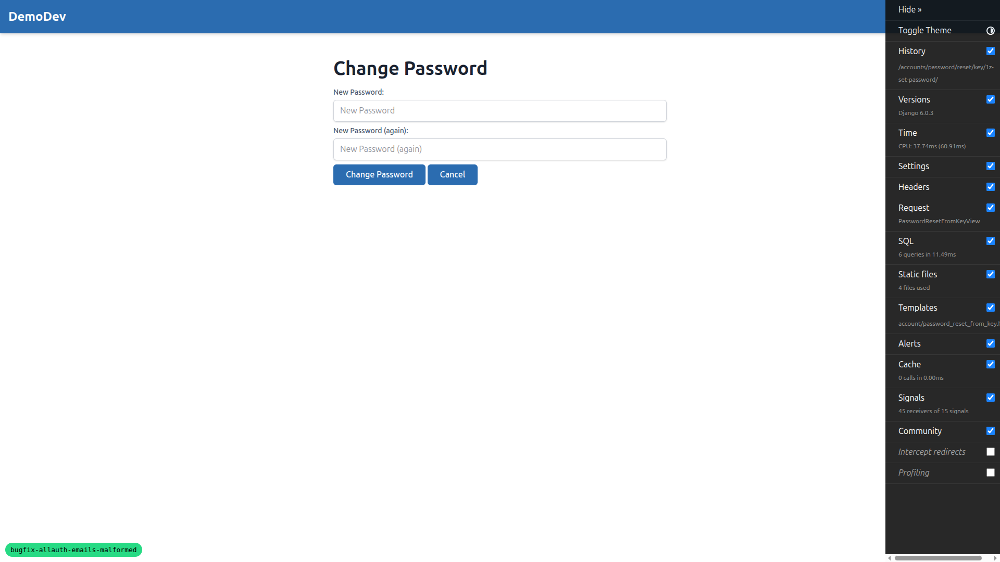
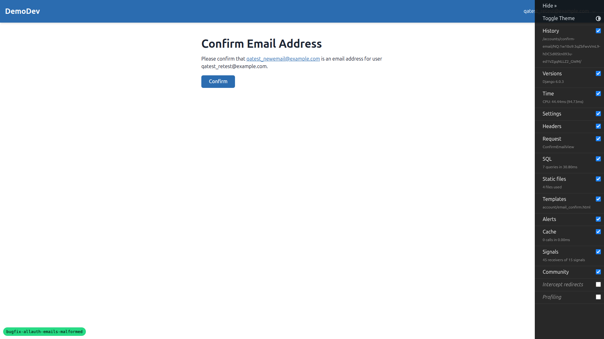
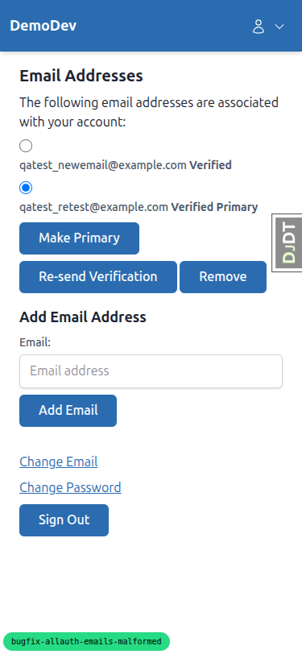
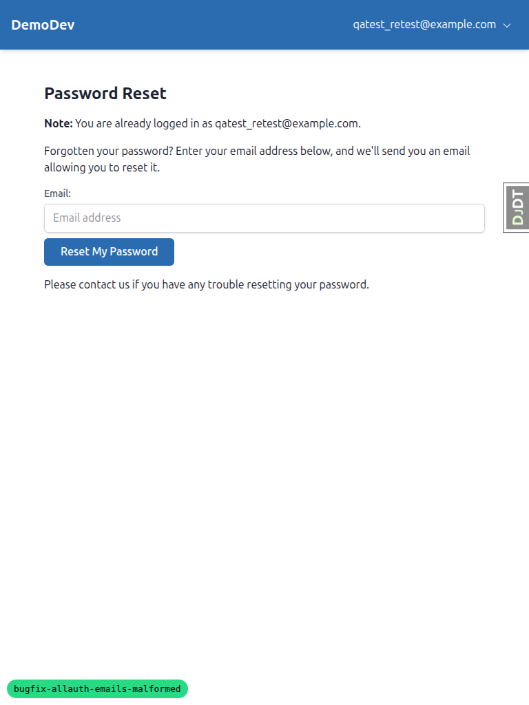
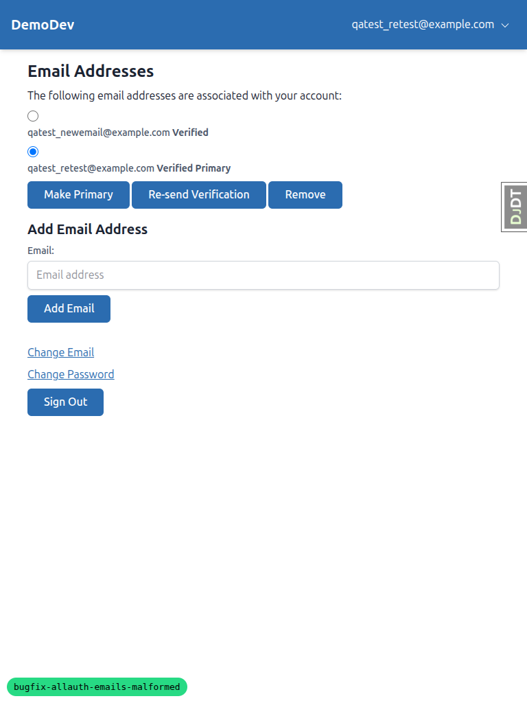

# QA Report: Fix Malformed Allauth Email Confirmation Links

**Date:** 2026-03-13
**Branch:** bugfix-allauth-emails-malformed
**Tester:** Automated QA via Playwright MCP
**Dev server:** http://127.0.0.1:8013 (Site 7: "QA Test")

## Summary

All three email flows pass. The fix (switching email Content-Transfer-Encoding from `quoted-printable` to `8bit`) is working correctly across registration confirmation, password reset, and email change. All URLs in generated emails are single unbroken strings with no line-wrapping corruption.

## Test Results

### Test 1: Email Confirmation on Registration - PASS

- Signed up with `qatest_signup@example.com`
- Confirmation email generated in `gitignore/emails/`
- **Email content verification:**
  - `Content-Transfer-Encoding: 8bit` in both text/plain and text/html parts
  - No `quoted-printable` encoding anywhere in the file
  - No `=\n` line breaks in the email body
  - Confirmation URL is a single unbroken string in both MIME parts
- Visited the confirmation URL from the email
- **Result:** Email confirmation page loaded successfully with "Confirm" button

### Test 2: Password Reset - PASS

- Requested password reset for `qatest_retest@example.com` (user on Site 7, matching the dev server port)
- Password reset email generated in `gitignore/emails/`
- **Email content verification:**
  - `Content-Transfer-Encoding: 8bit` in both text/plain and text/html parts
  - No `quoted-printable` encoding anywhere in the file
  - No `=\n` line breaks in the email body
  - Password reset URL is a single unbroken string in both MIME parts
- Visited the password reset URL from the email
- **Result:** Password reset form loaded successfully, new password was set, and user was signed in with success message "Password successfully changed."

### Test 3: Email Change - PASS

- Logged in as `qatest_retest@example.com`
- Navigated to `/accounts/email/` — email management page loaded correctly
- Added new email address `qatest_newemail@example.com`
- Confirmation email generated in `gitignore/emails/`
- **Email content verification:**
  - `Content-Transfer-Encoding: 8bit` in both text/plain and text/html parts
  - No `quoted-printable` encoding anywhere in the file
  - No `=\n` line breaks in the email body
  - Confirmation URL is a single unbroken string in both MIME parts
- Visited the confirmation URL from the email
- **Result:** Email confirmation page loaded with "Confirm" button. After confirming, success message "You have confirmed qatest_newemail@example.com." displayed. The new email now shows as "Verified" on the email management page.

## Responsive Testing

### Mobile (375x812)

Forms render correctly at mobile width. All form fields and buttons are accessible and properly sized for touch targets.

### Tablet (768x1024)

Forms render correctly at tablet width with good use of available space. Navigation shows the full email address in the header.

## Tangential Issues Found

None. The previous "Bad Token" issue reported in the prior QA run was caused by a port/site mismatch (dev server on port 8022 which didn't match any Site in the database). Running the dev server on port 8013 with a matching Site entry resolved this completely.

## Conclusion

The email encoding fix is **working correctly** across all three allauth email flows. All generated emails use `Content-Transfer-Encoding: 8bit` instead of `quoted-printable`, and all URLs are single unbroken strings with no `=\n` corruption. Registration confirmation, password reset, and email change all complete successfully end-to-end.
