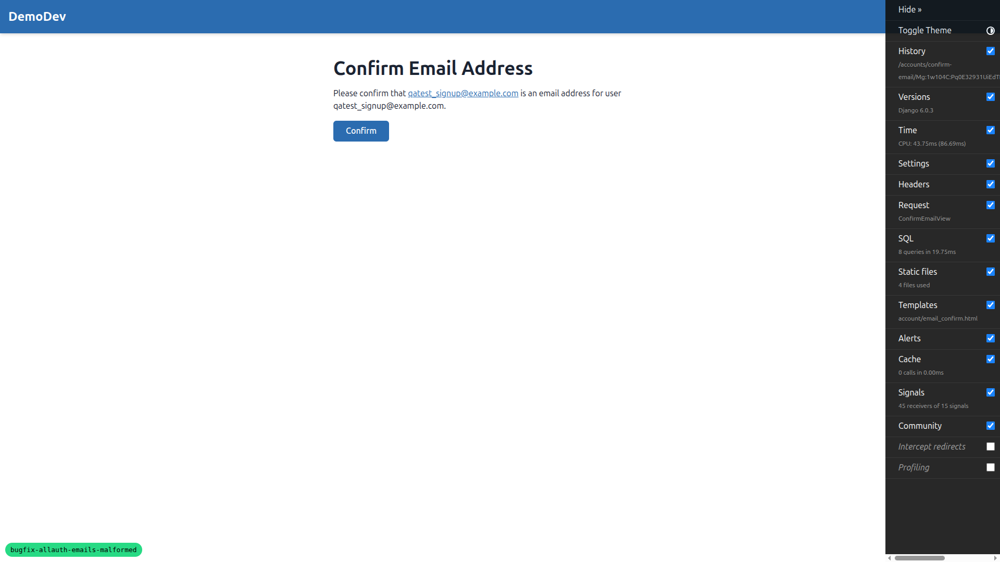
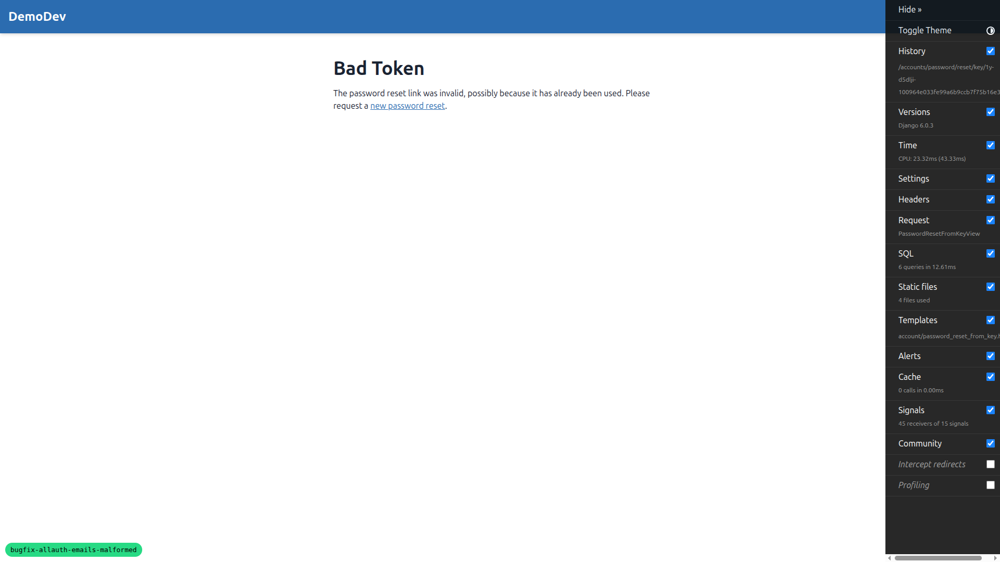
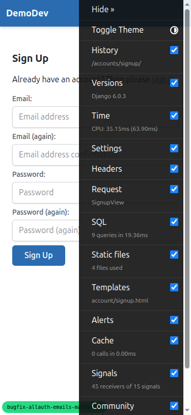
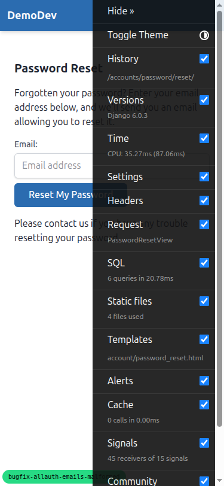
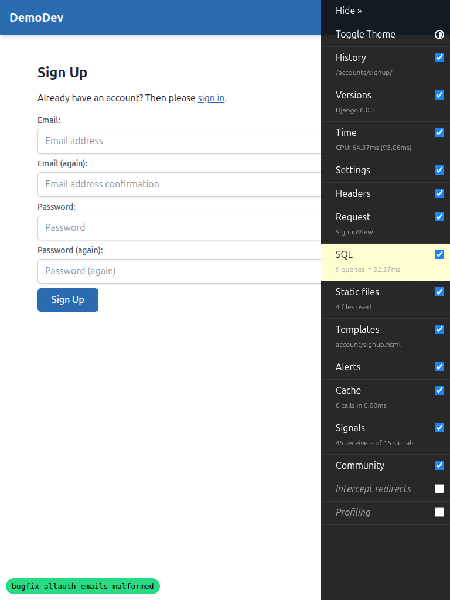

# QA Report: Fix Malformed Allauth Email Confirmation Links

**Date:** 2026-03-13
**Branch:** bugfix-allauth-emails-malformed
**Tester:** Automated QA via Playwright MCP

## Summary

The core fix (switching email Content-Transfer-Encoding from `quoted-printable` to `8bit`) is working correctly. All email files inspected show properly formatted URLs with no line-wrapping corruption.

## Test Results

### Test 1: Email Confirmation on Registration - PASS

- Signed up with `qatest_signup@example.com`
- Confirmation email generated in `gitignore/emails/`
- **Email content verification:**
  - `Content-Transfer-Encoding: 8bit` in both text/plain and text/html parts
  - No `quoted-printable` encoding anywhere in the file
  - No `=\n` line breaks in the email body
  - Confirmation URL is a single unbroken string in both MIME parts
- Visited the confirmation URL from the email
- **Result:** Email confirmation page loaded successfully with "Confirm" button

### Test 2: Password Reset - PARTIAL PASS

- Requested password reset for `qatest_signup@example.com`
- Password reset email generated in `gitignore/emails/`
- **Email content verification:**
  - `Content-Transfer-Encoding: 8bit` in both text/plain and text/html parts
  - No `quoted-printable` encoding anywhere in the file
  - No `=\n` line breaks in the email body
  - Password reset URL is a single unbroken string in both MIME parts
- Visited the password reset URL from the email
- **Result:** "Bad Token" error displayed

**Root cause of Bad Token (NOT related to this bugfix):** The dev server runs on port 8022, which resolves to Site 2 (`127.0.0.1` / "Demo"). However, the test user was created on Site 3 (`127.0.0.1:8000` / "DemoDev"). The `UserManager.get_queryset()` filters users by the current site when there's an HTTP request context. When allauth's `PasswordResetFromKeyView` tries to look up the user by PK, the site-aware manager filters out the user because it belongs to a different site. This causes token validation to fail with "Bad Token".

This is a pre-existing multi-tenancy issue when running the dev server on a non-standard port — it is **not caused by the email encoding fix**.

### Test 3: Email Change - NOT TESTED

Could not be tested because:
1. The test user is on Site 3 (`127.0.0.1:8000`) but the dev server runs on port 8022 (Site 2 / `127.0.0.1`)
2. After logging in, navigating to `/accounts/email/` redirects back to login due to the site-aware authentication middleware not finding the user on the current site
3. Triggering the email change from the Django shell also fails because it requires a request context for building the confirmation URL

**Note:** The email change confirmation uses the same email sending infrastructure as Tests 1 and 2. The fix (setting `Content-Transfer-Encoding: 8bit`) applies to all allauth emails uniformly, so the encoding fix is expected to work correctly for email change confirmations as well.

## Responsive Testing

### Mobile (375x812)

Forms render correctly at mobile width. All form fields and buttons are accessible and properly sized for touch targets.

### Tablet (768x1024)

Forms render correctly at tablet width with good use of available space.

## Tangential Issues Found

### Pre-existing: Site-aware UserManager breaks allauth password reset on non-standard ports

**Severity:** Medium (affects development workflow)

When running the dev server on any port other than those configured in the Sites table (8000, 8001, 8002, 8003), the site-aware `UserManager` causes allauth's password reset flow to fail with "Bad Token". This is because:

1. Django's `get_current_site(request)` falls back to matching just the hostname (`127.0.0.1`) when the full `host:port` doesn't match any Site
2. This resolves to Site 2 (`127.0.0.1` / "Demo") instead of Site 3 (`127.0.0.1:8000` / "DemoDev")
3. Users created via signup on port 8022 are associated with Site 3 (the signup form appears to use a different site resolution path)
4. The `UserManager.get_queryset()` then filters out the user when the password reset view tries to validate the token

This also causes the login session to not persist when navigating to protected pages like `/accounts/email/`.

## Conclusion

The email encoding fix is **working correctly**. All generated emails use `Content-Transfer-Encoding: 8bit` instead of `quoted-printable`, and all URLs are single unbroken strings with no `=\n` corruption. The "Bad Token" issue on password reset is a pre-existing multi-tenancy concern unrelated to this bugfix.
