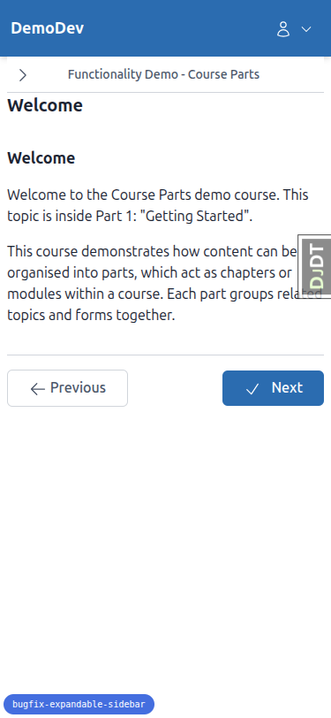
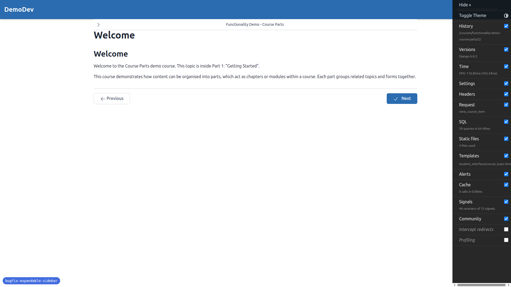
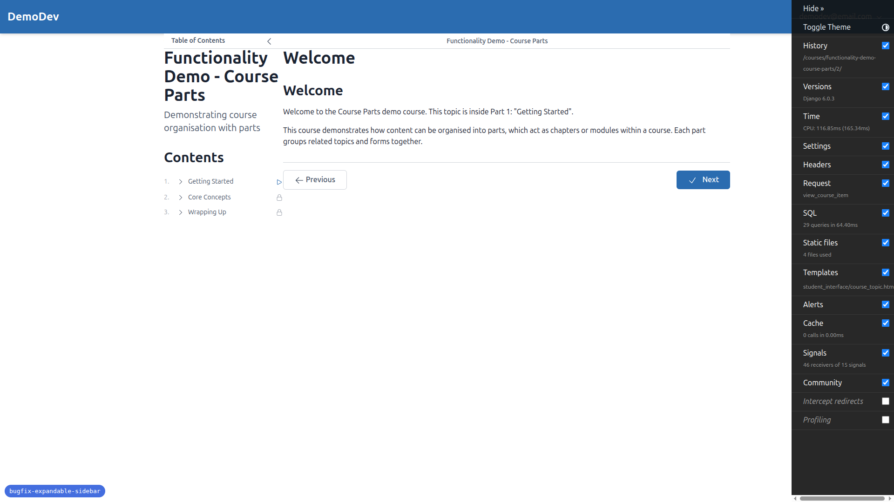
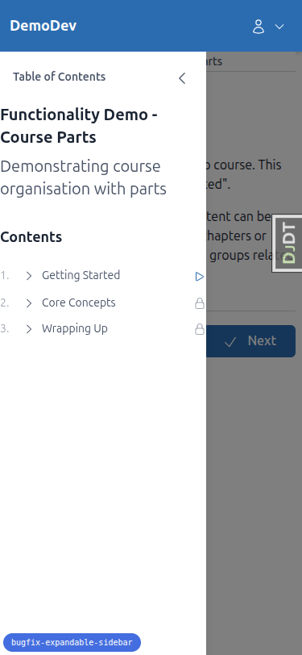
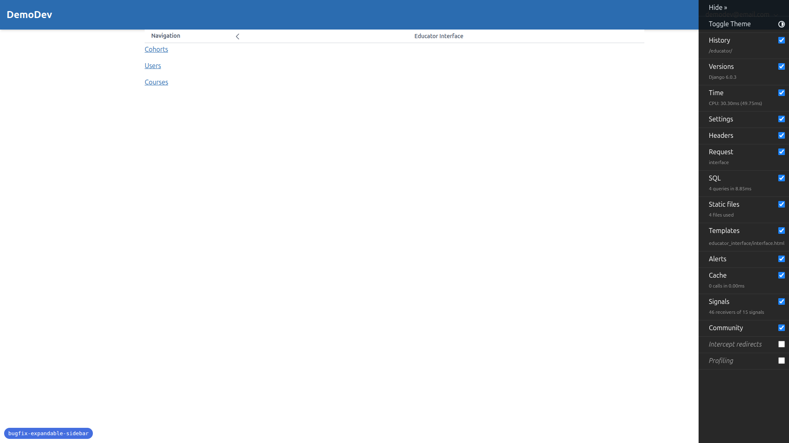
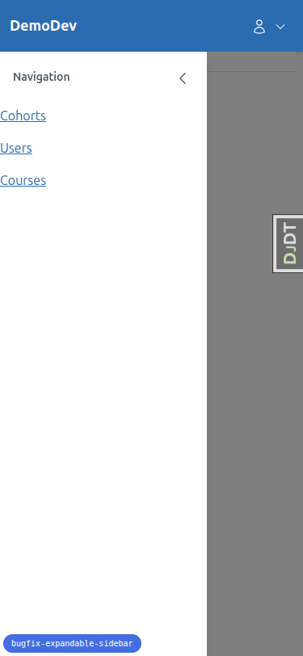
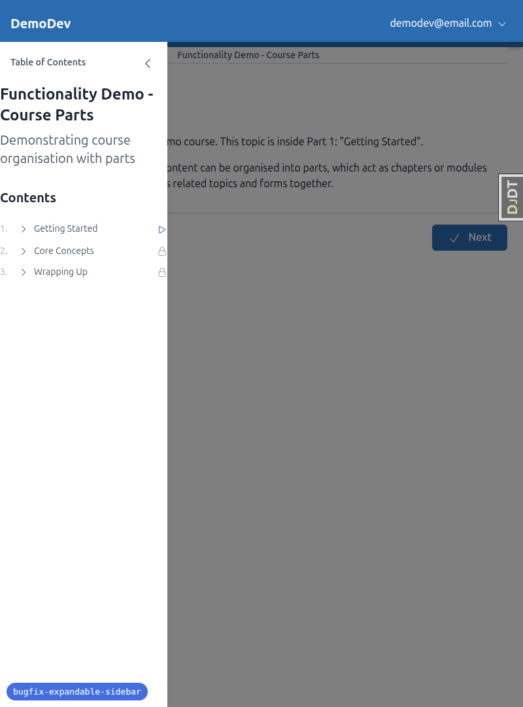
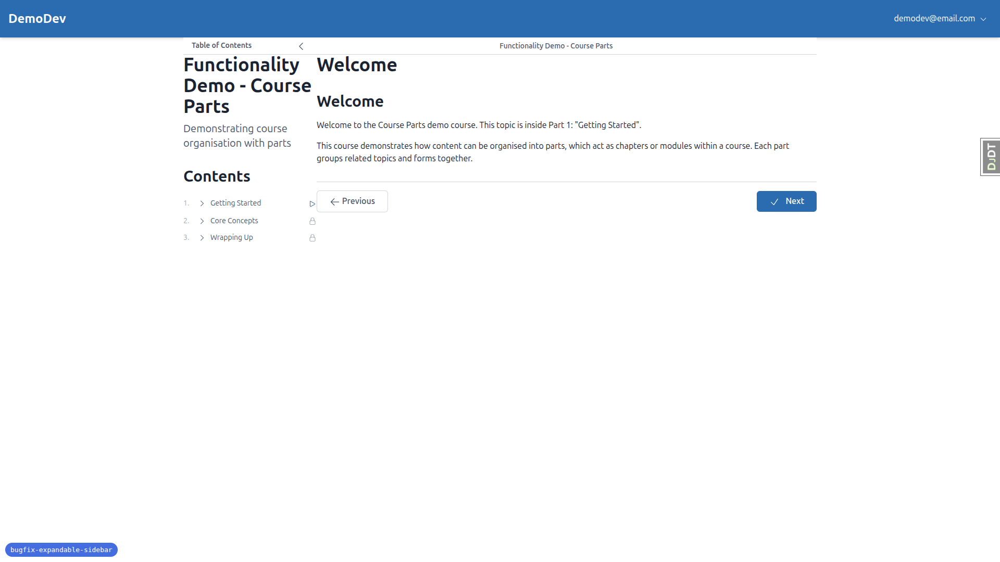
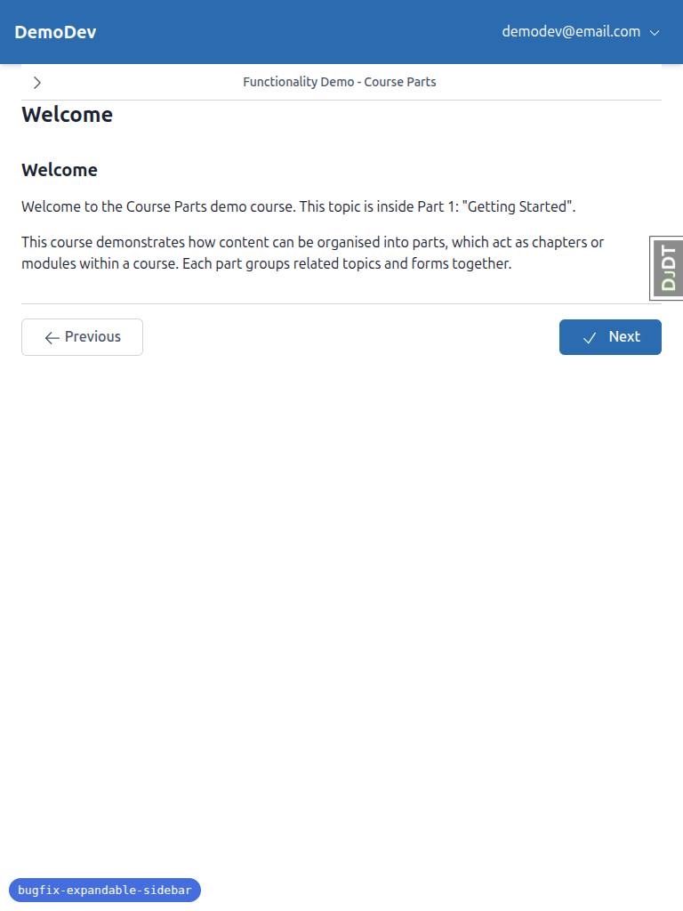
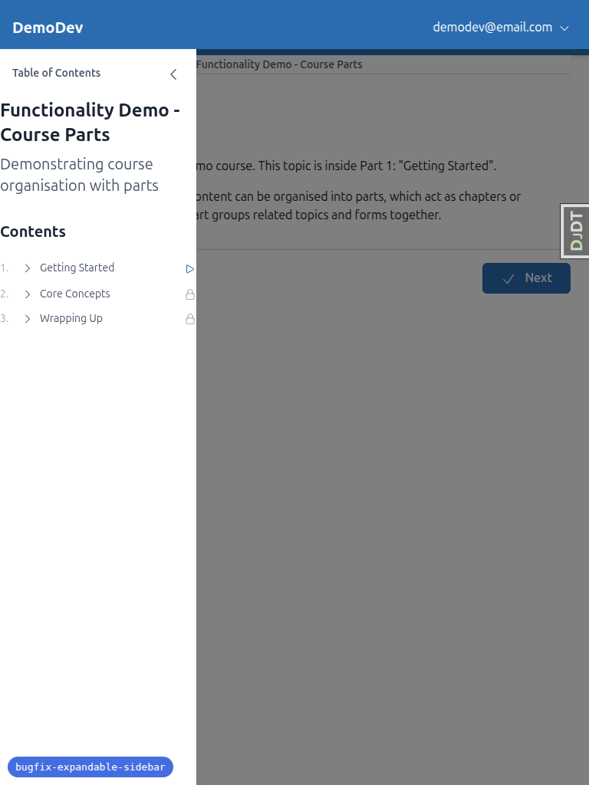

# QA Report: Fix Expandable Sidebar — Button Jumps Around

**Date:** 2026-03-16
**Branch:** bugfix-expandable-sidebar
**Tested by:** Automated QA via Playwright MCP

---

## Summary

All 9 tests **PASSED**. No errors found.

---

## Test Results

### Test 1: Toggle Button Position Stability (Mobile) — PASS

The toggle button (chevron >) stays in the exact same position in the header bar between open/close states. The close button appears at the top of the sidebar panel, not in the header bar.

### Test 2: Toggle Button Position Stability (Desktop) — PASS

On desktop, the header bar splits cleanly when the sidebar opens: left section (w-64) shows "Table of Contents" + close button, right section shows course name centered. Toggle button returns to the same position after closing.

### Test 3: Mobile Sidebar Overlay Behavior — PASS

All three close methods work correctly:
1. **Close button** (chevron <) at top of sidebar panel — closes sidebar
2. **Backdrop click** — closes sidebar
3. **Navigation link click** — auto-closes sidebar (page navigates)

The sidebar uses fixed positioning (z-40) with a semi-transparent backdrop (z-30, bg-black/50). Both start below the site header (top: 64px), so the site header is never covered.

### Test 4: Desktop Sidebar Push Behavior — PASS

On desktop (>= 1024px):
- Sidebar appears as a w-64 column on the left
- Main content is pushed to the right (no overlay)
- No backdrop visible
- Header bar splits correctly

### Test 5: Header Bar Contextual Text — Student Course Pages — PASS

- Header bar shows the course title "Functionality Demo - Course Parts" as centered text
- Sidebar heading says "Table of Contents"

### Test 6: Header Bar Contextual Text — Educator Interface — PASS

- Header bar shows "Educator Interface" as centered text
- Sidebar heading says "Navigation"
- Navigation links (Cohorts, Users, Courses) are displayed correctly

### Test 7: Sidebar State Persistence — PASS

- **Student course page:** Closed sidebar, refreshed — stayed closed. Opened sidebar, refreshed — stayed open.
- **Educator interface:** Closed sidebar, refreshed — stayed closed. Uses separate localStorage key.

### Test 8: Smooth Transitions — PASS

Alpine.js `x-transition` directives are properly configured:
- **Sidebar enter:** `transition-all duration-300 ease-out` (slide + fade in)
- **Sidebar leave:** `transition-all duration-200 ease-in` (slide + fade out)
- **Backdrop enter:** `ease-out duration-300` (fade in)
- **Backdrop leave:** `ease-in duration-200` (fade out)

### Test 9: Responsive Breakpoint Transition — PASS

- Opened sidebar on desktop (push layout, no backdrop)
- Resized below 1024px — sidebar transitioned to mobile overlay behavior with backdrop
- Resized back above 1024px — sidebar returned to desktop push behavior without backdrop

---

## Mobile Testing (375x812)

All mobile-specific behavior tested:
- Sidebar opens as overlay with backdrop
- Toggle button position stable
- All three close methods functional
- Touch targets are appropriately sized
- No overflow or layout issues

## Tablet Testing (768x1024)

Tablet (768px) correctly gets the mobile overlay behavior (below 1024px breakpoint):
- Sidebar overlays with backdrop
- Content is readable behind the darkened backdrop
- Sidebar doesn't crowd the main content

---

## Issues / Notes

- No errors found during testing.
- The Django Debug Toolbar (DJDT) overlaps UI on mobile viewports, but this is a development tool and not a real issue.
