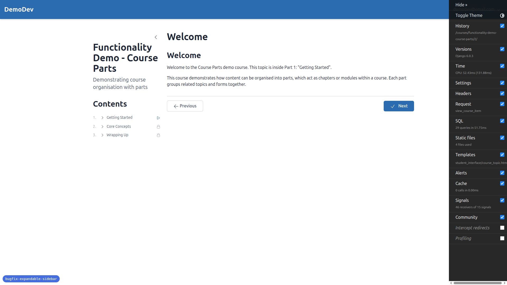
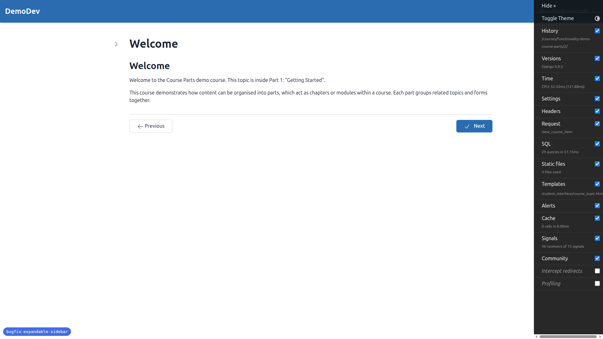
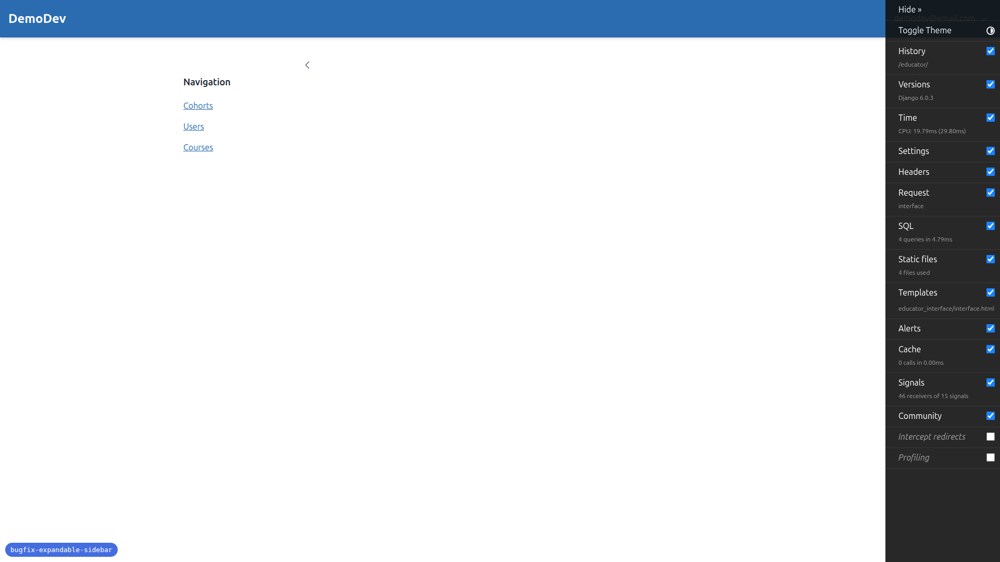
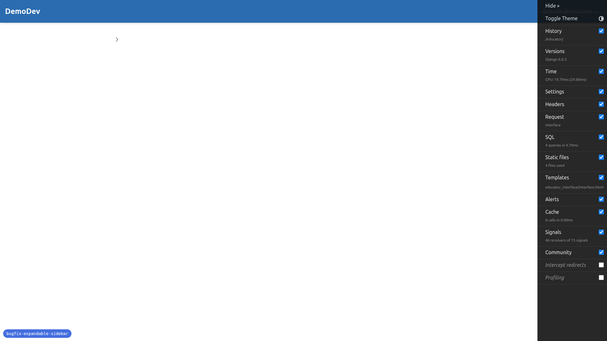
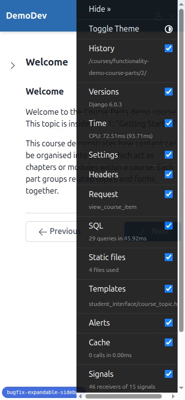
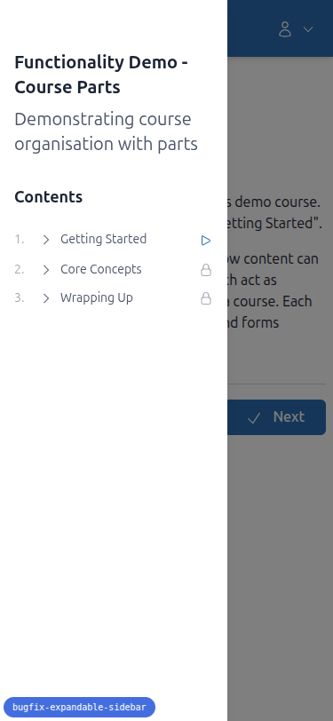
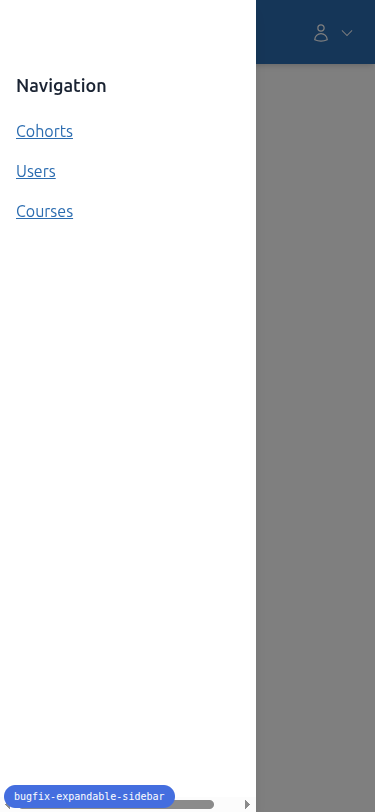
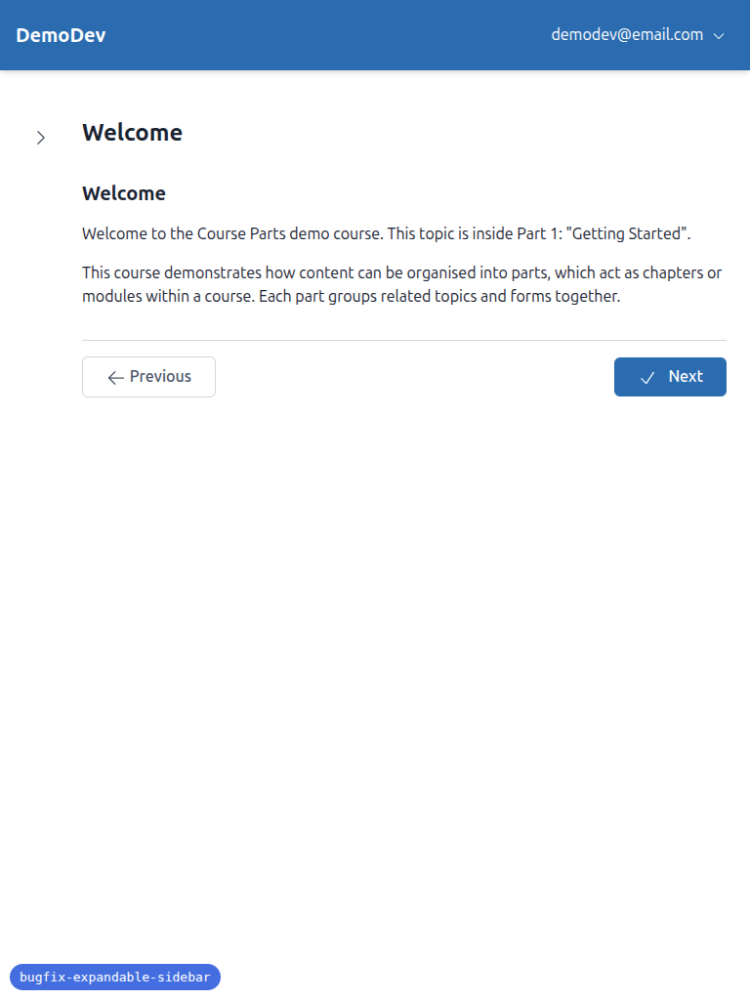
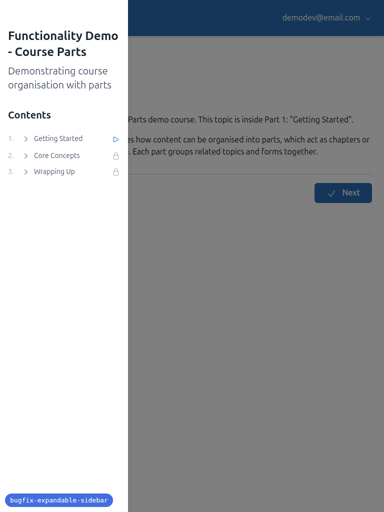
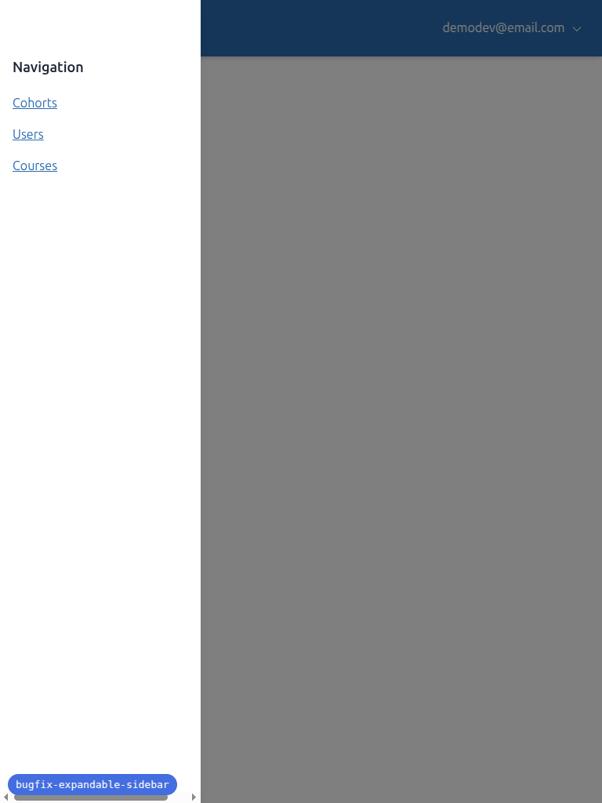

# QA Report: Expandable Sidebar

**Date:** 2026-03-14
**Branch:** bugfix-expandable-sidebar
**Tester:** Automated QA via Playwright MCP

## Summary

All 9 tests **PASSED**. No bugs found.

## Desktop Testing (1920x1080)

### Test 1: Desktop — Toggle Button and Compress Behavior - PASS

- Sidebar is open by default (or matches localStorage state)
- Toggle button shows chevron-left when open, chevron-right when closed
- Clicking toggle collapses the sidebar and main content expands to fill the space
- No overlay or backdrop appears on desktop
- Toggle button stays in the same vertical position

### Test 2: Desktop — Links Keep Sidebar Open - PASS

- Clicked a link inside the sidebar
- Page navigated to the link target
- Sidebar remained open after navigation

### Test 3: Desktop — State Persistence - PASS

- localStorage key `sidebar-course-toc` correctly persists state
- Closed sidebar, refreshed: stayed closed
- Opened sidebar, refreshed: stayed open

### Test 7: Smooth Transitions - PASS

- Transitions use `duration-300 ease-out` (enter) and `duration-200 ease-in` (leave)
- Toggling multiple times on both desktop and mobile produced smooth fade+slide animations

### Test 8: Child Template Compatibility - PASS

**Student course page:**
- Sidebar loads course TOC content via HTMX
- Toggle, collapse, expand all work correctly

**Educator interface:**
- Sidebar shows the navigation menu (Cohorts, Users, Courses)
- Toggle, collapse, expand all work correctly

### Test 9: Toggle Button Vertical Alignment - PASS

- Toggle button stays in the same vertical position between open and closed states
- No jumping or shifting observed

## Mobile Testing (375x812)

### Test 4: Mobile — Hidden by Default - PASS

- Sidebar hidden by default on mobile (after clearing localStorage)
- Toggle button visible showing open/menu icon

### Test 5: Mobile — Overlay and Backdrop - PASS

- Sidebar slides out as a fixed overlay on top of main content
- Semi-transparent dark backdrop (`bg-black/50`) appears behind the sidebar
- Clicking the backdrop closes the sidebar

### Test 6: Mobile — Auto-Close on Link Click - PASS

- Opened sidebar on mobile, clicked a link
- Page navigated and sidebar closed automatically

### Test 8 (Mobile): Child Templates - PASS

- Both student course page and educator interface work correctly on mobile
- Sidebar overlays with backdrop on both

## Tablet Testing (768x1024)

### Navigation Behavior - PASS

- At 768px, tablet uses mobile behavior (overlay with backdrop)
- `isMobile` correctly reports `true` at this width (breakpoint is `< 1024px`)
- Sidebar opens as overlay, does not crowd main content

### Educator Interface on Tablet - PASS

- Sidebar works correctly as overlay
- Navigation links are usable with good touch-target sizing

## Notes

- The Django Debug Toolbar overlaps content on mobile/tablet viewports. This is a development tool artifact and not related to the sidebar feature.
- The educator interface landing page (`/educator/`) has no main content area — only the sidebar navigation. When the sidebar is closed on this page, just the toggle button is visible. This is expected behavior since the page serves as a navigation hub.
